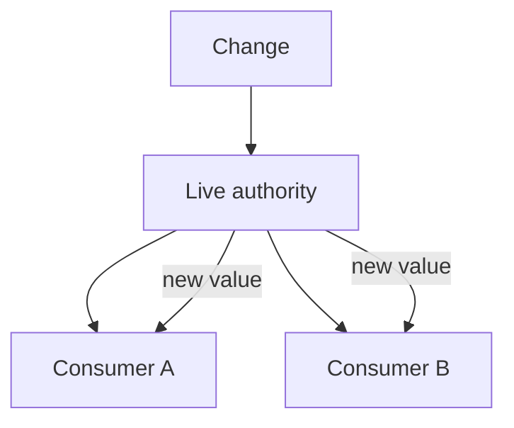
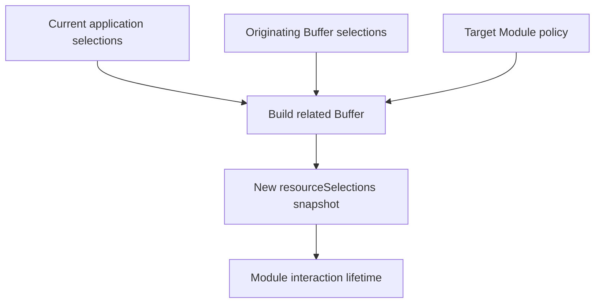
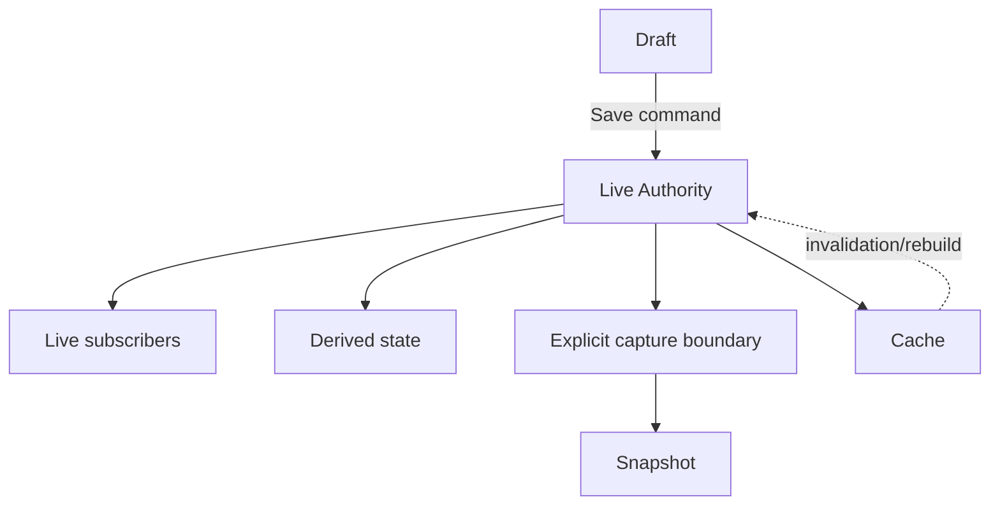

# Live State and Snapshot Semantics

## Status

**Application Standard / Architecture Guidance**

Save in the repository as:

```text
docs/03_implementation/runtime/013-live-vs-snapshot-state.md
```

---

# 1. Purpose

This document defines how KJVOnly.bible should decide whether runtime state is:

```text
live
snapshot
derived
draft
cached
```

A major architectural source of bugs is using the wrong semantic model.

Examples:

```text
Settings
    should be live across mounted instances

Buffer.resourceSelections
    should be captured snapshots

search results
    should be derived

editor content before Save
    may be draft
```

The central rule is:

> **Every important runtime value should have an explicit freshness semantic.**

---

# 2. Why Freshness Semantics Matter

Without an explicit rule, developers naturally choose whichever data source is easiest to access.

That can produce:

```text
open Module silently changes context
hidden Module reads another Module's resources
Settings UI becomes stale
draft overwrites newer committed data
derived values drift from authority
```

---

# 3. Live State

Live state represents current application truth.

Consumers expect later changes to propagate.

Examples:

```text
SettingsService state
authentication identity
application events/current global status
shared synchronization state
```

Conceptually:



---

# 4. Snapshot State

Snapshot state is captured for a specific interaction/time.

Later changes to the source do not automatically alter the snapshot.

Example:

```text
Buffer.resourceSelections
```

A Module interaction should continue using the Resource sources captured when its Buffer was created.

---

# 5. Snapshot Creation

Conceptually:



The snapshot is intentionally independent afterward.

---

# 6. Snapshot Does Not Mean Immutable Object

Snapshot semantics mean:

```text
not automatically replaced by later source changes
```

They do not necessarily require JavaScript deep immutability.

However, accidental shared mutable references can violate snapshot intent.

Therefore snapshot construction should copy/own data appropriately.

---

# 7. Live Does Not Mean Global

A value can be live within a narrower scope.

Example:

```text
Module-local navigation stack
```

is live state for one Module instance.

It is not application-global.

"Live" describes freshness semantics, not scope.

---

# 8. Snapshot Does Not Mean Persisted

A snapshot may exist only in memory.

Example:

```text
temporary interaction context
```

Persistence and freshness are separate questions.

A value can be:

```text
live + persisted
live + ephemeral
snapshot + persisted
snapshot + ephemeral
```

---

# 9. Settings as Live State

Settings are application-global live state.

Expected behavior:

```text
Settings module A changes theme
Settings module B updates
BufferContainer updates max-width behavior
other Settings consumers update
```

A mounted consumer should not keep using an old Settings snapshot unless it explicitly represents a draft.

---

# 10. Buffer Resource Selections as Snapshot State

Resource selections on a Buffer are interaction context.

Expected behavior:

```text
Bible Pane uses KJVS
application current Bible selection changes later
existing Bible interaction still uses KJVS
```

A newly created Module may use the newer application selection according to contributor policy.

---

# 11. Application ResourceSelectionService as Live Policy State

`ResourceSelectionService` represents current/default application selection policy.

It is consulted when constructing new Module context.

It should not be read repeatedly by an already-created Module as a substitute for its Buffer snapshot.

---

# 12. Derived State

Derived state is computed from other state.

Examples:

```text
search results
current choice label
formatted font-size text
canGoBack
active navigation entry
```

Derived state should normally update automatically from its dependencies.

It should not become an independent stored authority.

---

# 13. Draft State

Draft state intentionally diverges from authority until committed.

Examples:

```text
Note editor draft
Font Size unsaved input
future encrypted draft content
```

Draft semantics should define:

```text
when created
when saved
when discarded
whether auto-save exists
```

---

# 14. Cached State

A cache stores a value for performance but should remain logically reproducible from another authority.

Examples might include:

```text
local saved search index
decoded resource cache
computed lookup table
```

Cache invalidation rules should be explicit.

A cache should not silently become the only source of truth unless architecture changes deliberately.

---

# 15. Freshness Matrix

| State kind | Later authority changes propagate automatically? | Can diverge intentionally? |
| --- | ---: | ---: |
| Live | Yes | No, except transient processing |
| Snapshot | No | Yes, by design |
| Derived | Recomputed | No independent authority |
| Draft | No until commit | Yes |
| Cache | Depends on invalidation | Temporarily |

---

# 16. Scope and Freshness Are Separate Axes

Example matrix:

| Value | Scope | Freshness |
| --- | --- | --- |
| Settings | Application | Live |
| Settings navigation | Module instance | Live |
| Settings search query | View | Live/local |
| Buffer.resourceSelections | Module instance | Snapshot |
| Buffer.bag | Module instance | Captured context |
| Note Domain Object | Domain/application | Authoritative persisted |
| Note edit draft | View/module | Draft |
| Search results | View | Derived |

This vocabulary helps reviews.

---

# 17. Captured Context

`Buffer.bag` is best thought of as:

```text
captured Module initialization/navigation context
```

Some bag fields may later be updated deliberately, but the bag should not automatically mirror unrelated global state.

Its semantics are closer to:

```text
interaction context
```

than:

```text
application-global live state
```

---

# 18. Related Snapshot Creation

A related Module transition may inherit compatible context from an originating snapshot.

This means:

```text
new snapshot
    based partly on
originating snapshot
```

not:

```text
both Modules share one mutable selection object
```

---

# 19. Why Snapshots Matter for Multiple Panes

Multiple Panes may intentionally use different Resources.

Example:

```text
Pane A
    KJVS Bible

Pane B
    another Bible version
```

If both always read live global selection state, they could not remain independent.

Buffer snapshots enable concurrent interaction contexts.

---

# 20. Why Snapshots Matter for Persistent Navigation

Persistent cross-module navigation keeps hidden Modules mounted.

Each hidden Module must retain:

```text
its own Buffer
its own Resource snapshot
```

A paneID-only resolver that reads only current `Pane.buffer` would violate this.

---

# 21. Live State Subscription

Live state usually requires one of:

```text
reactive store
subscriber API
event + refresh
context projection updated by authority
```

The subscription lifetime should match the consumer lifecycle.

---

# 22. Snapshot Access

Snapshot state should generally be accessed through the Module runtime/Buffer boundary.

Avoid repeatedly re-deriving it from mutable application state.

---

# 23. Conversion from Live to Snapshot

Creating a Buffer is an example of converting live/default policy into a snapshot.

```text
current application state
    +
originating interaction
    +
Module policy
    ↓
captured Buffer state
```

This conversion should happen at an explicit factory/builder boundary.

---

# 24. Conversion from Draft to Live Authority

Saving an editor draft is another semantic transition.

```text
draft
    ↓ command
validate/persist
    ↓
authoritative state
    ↓
live synchronization
```

Do not blur draft and committed state.

---

# 25. Conversion from Authority to Derived

Example:

```text
Settings.fontSize = 16
    +
formatter
    ↓
"16 px"
```

The formatted string should remain derived.

Do not store both unless necessary.

---

# 26. Freshness at API Boundaries

APIs should communicate semantics where ambiguity matters.

Examples:

```text
getSettings()
    current live authority snapshot at call time

Buffer.resourceSelections
    interaction snapshot

getSearchResults()
    derived result
```

JSDoc should clarify subtle cases.

---

# 27. Naming

Useful naming words:

```text
current
snapshot
draft
cached
resolved
derived
initial
published
```

Avoid vague names like:

```text
data
state2
currentData
```

when freshness semantics matter.

---

# 28. Snapshot Versioning

If persisted snapshots later need migration/version handling, version the schema or normalize during restore.

Do not assume old persisted context always matches current runtime expectations.

---

# 29. Refreshing a Snapshot

Sometimes product behavior may explicitly refresh a snapshot.

Example:

```text
user chooses a new Resource source for an open Module
```

That should be an explicit operation:

```text
replace/update Buffer interaction context
```

not a hidden side effect of global selection changing.

---

# 30. Replacing Versus Mutating Snapshot

For major context changes, creating/replacing a Buffer may be safer than mutating an existing snapshot in place.

This preserves:

```text
interaction identity semantics
testability
history
```

The exact behavior depends on the operation.

---

# 31. Live State and Hidden Views

A persistent hidden view may continue receiving live state.

Example:

```text
Settings
```

This is expected.

A hidden Module's snapshot state remains fixed while its live global dependencies may update.

One component can consume both kinds simultaneously.

---

# 32. Mixed Semantics Example

A Bible Module might consume:

```text
Buffer.resourceSelections
    snapshot

global Settings
    live

current auth identity
    live, depending on feature

local search/filter
    view-local live

note edit draft
    draft
```

Do not assume a Module has one freshness model for all data.

---

# 33. Source Selection Versus Presentation Toggle

A useful example:

```text
which Paragraph Resource is selected?
    snapshot Resource context

should Paragraphs currently be shown?
    live Settings/presentation state
```

These are different dimensions.

Do not encode presentation visibility by adding/removing required Resource selections.

---

# 34. Snapshot Versus Publication State

Outbox/publication state has its own live lifecycle:

```text
pending
in progress
completed
failed
```

The Domain Object being published may have identity/snapshot semantics separate from publication status.

Keep those concepts distinct.

---

# 35. Testing Live State

Test:

```text
change authority
all intended mounted consumers update
new subscriber receives current value
destroyed subscriber stops receiving
```

Settings multi-instance tests are the reference pattern.

---

# 36. Testing Snapshot State

Test:

```text
create Module Buffer
change global/default selection
existing Buffer selection unchanged
new Buffer follows new policy
```

This proves the intended capture boundary.

---

# 37. Testing Derived State

Test inputs and resulting derived output.

Avoid direct mutation APIs for derived state because there should not be one.

---

# 38. Testing Draft State

Test:

```text
edit draft
authority unchanged before Save
Save commits intended value
Cancel/discard leaves authority unchanged
```

If auto-save exists, test its explicit trigger policy.

---

# 39. Testing Persistent Navigation Snapshots

For future app-wide navigation:

```text
Module A uses snapshot A
push Module B using snapshot B
A remains mounted hidden
B becomes active
A still resolves snapshot A
pop B
A resumes with snapshot A
```

This is a critical browser/integration contract.

---

# 40. Freshness Review Questions

Before consuming state, ask:

```text
Do I want the latest value?
Do I want the value captured when this interaction started?
Can the user intentionally edit a draft?
Can I derive this instead?
Is this only a cache?
Should another Pane changing something affect this instance?
```

---

# 41. Anti-Patterns

Avoid:

## Reading mutable global Resource selection from an existing Module

Breaks snapshot semantics.

## Copying live Settings once and never subscribing

Creates unintended stale state.

## Treating a draft as committed authority

Can leak unsaved edits.

## Persisting derived labels/results independently

Can drift from source.

## Sharing mutable snapshot objects between Module instances

Breaks isolation.

## Calling snapshot state "current" without qualification

Creates semantic ambiguity.

---

# 42. Architecture Invariants

1. Every important runtime value has explicit freshness semantics.
2. Application Settings are live shared state.
3. Buffer Resource selections are Module-instance snapshots.
4. Application Resource selections are current/default policy for new context.
5. Derived state is not independently authoritative.
6. Draft state is explicitly separate from committed state.
7. Snapshot creation occurs at explicit boundaries.
8. Global state changes do not silently rewrite existing interaction snapshots.
9. Hidden persistent Modules retain their own snapshots.
10. Scope and freshness are treated as separate dimensions.
11. Caches remain subordinate to their authority/invalidation policy.
12. Explicit refresh/replacement operations are used when snapshots should change.

---

# 43. Mermaid Summary



---

# 44. Summary

The application should stop using "state" as if every value had the same freshness semantics.

Instead classify values as:

```text
live
snapshot
derived
draft
cache
```

Then combine that with ownership scope:

```text
application
Pane
Module
view
domain
```

This vocabulary makes implementation decisions much clearer.

The core rule is:

> **Live state follows the authority; snapshot state follows the interaction.**
