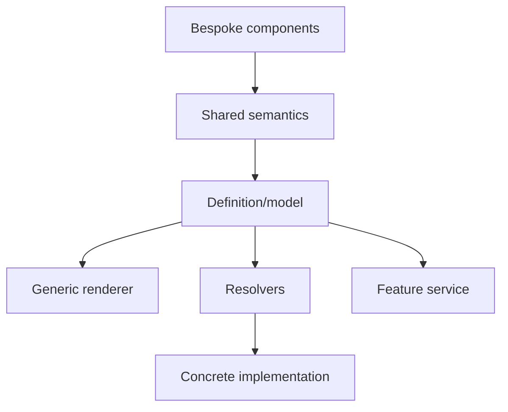
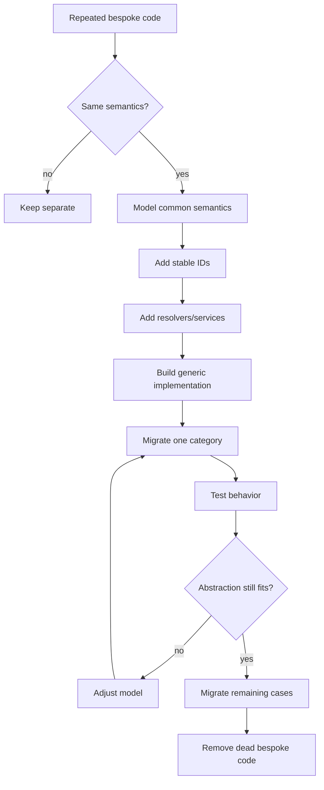

# Bespoke-to-Generic Refactoring Pattern

## Status

**Application Standard / Refactoring Guidance**

Save in the repository as:

```text
docs/03_implementation/runtime/014-bespoke-to-generic-refactoring.md
```

---

# 1. Purpose

This document defines the preferred KJVOnly.bible workflow for replacing repeated bespoke implementations with a smaller generic architecture.

The Settings refactor demonstrated a reusable migration pattern:

```text
many one-off components
    ↓
identify repeated semantics
    ↓
define a common model
    ↓
add stable IDs
    ↓
introduce resolvers/services
    ↓
build generic renderer
    ↓
migrate incrementally
    ↓
keep custom escape hatch
    ↓
remove obsolete code
```

The central rule is:

> **Generalize behavior only after the common semantics are visible, and migrate incrementally so architecture improves without destabilizing the application.**

---

# 2. Why This Pattern Matters

Large applications naturally accumulate one-off implementations.

Examples:

```text
one component per setting
one popup per navigation target
one callback chain per module
one Resource lookup path per feature
one header implementation per screen
```

These may be reasonable initially.

The problem appears when the same semantic pattern is repeated enough that fixes must be copied across implementations.

At that point, a generic architecture can reduce:

```text
duplicate code
inconsistent behavior
test duplication
dead imports
special-case branching
future migration cost
```

---

# 3. Do Not Generalize Too Early

The first version of a feature often should be concrete.

Premature generic architecture can create:

```text
abstract APIs with no real use cases
generic names with unclear meaning
complex type systems
unused extension points
```

A good rule is:

```text
first implementation
    prove behavior

second similar implementation
    compare

third repeated pattern
    consider generalization
```

This is guidance, not a strict count.

The important point is that the abstraction should emerge from real repeated behavior.

---

# 4. Identify Semantic Repetition

Before refactoring, classify what is genuinely common.

For Settings, repeated concepts were:

```text
title
secondary text
icon
group navigation
toggle mutation
select choice
custom editor
search metadata
```

The common language became:

```text
group
toggle
select
custom
```

The refactor did not attempt to make every possible setting interaction generic.

---

# 5. Separate Structure From Implementation

The useful transformation is:



The definition describes:

```text
what exists
```

The renderer/service/resolvers describe:

```text
how it behaves
```

---

# 6. Establish Stable Semantic IDs First

Before migrating rendering, identify stable IDs.

Examples:

```text
font-size
show-pericopes
appearance
color-theme
```

Stable IDs make later steps easier:

```text
search
navigation
tests
resolvers
migration
```

Do not base the new architecture on display labels or array positions.

---

# 7. Build the Model Before the Renderer

A common mistake is to start with a generic component and only later decide what the data model is.

Prefer:

```text
model
    first

renderer
    second
```

The model should represent semantic types clearly.

Example:

```ts
type SettingsRowDefinition =
    | SettingsGroupRowDefinition
    | SettingsToggleRowDefinition
    | SettingsSelectRowDefinition
    | SettingsCustomRowDefinition;
```

---

# 8. Use Discriminated Unions

A discriminated union gives the generic renderer a type-safe language.

Conceptually:

```text
type = group
    requires pageID

type = toggle
    requires boolean setting key

type = select
    requires options

type = custom
    requires custom view ID
```

This is better than one object with many unrelated optional fields.

---

# 9. Introduce Resolvers Before Spreading Lookups

Once definitions contain stable IDs, add resolver boundaries.

Examples:

```text
page ID
    → page definition

custom view ID
    → Svelte component

icon ID
    → icon component
```

Do this before many consumers manually scan registries.

---

# 10. Preserve a Custom Escape Hatch

A generic system should not force genuinely specialized behavior into a poor abstraction.

Settings retains:

```text
custom
```

for Font Size.

This is important.

A healthy generic architecture says:

```text
simple/common cases
    generic

exceptional interaction
    explicit custom implementation
```

---

# 11. Migrate One Behavior Category at a Time

Avoid migrating every old component in one patch.

Example sequence:

```text
1. root group rows
2. Bible toggle rows
3. Appearance select rows
4. custom Font Size
5. search
6. navigation contexts
7. dead-component cleanup
```

Each step should leave the application coherent.

---

# 12. Why Incremental Migration Is Safer

Small migrations make it easier to identify:

```text
which patch introduced a regression
which abstraction is insufficient
which old behavior must remain
which test is missing
```

Large migrations obscure causality.

---

# 13. Create Compatibility Bridges

During migration, old and new architecture may coexist.

A compatibility bridge is acceptable when temporary and explicit.

Examples:

```text
old module renderer still passes bind:pane
new code prefers paneID

Pane.buffer still mirrors active navigation entry
new stack owns several Buffers
```

Document bridges so they are not mistaken for final architecture.

---

# 14. Do Not Rewrite Stable Lower Layers Without Need

A refactor should reuse proven boundaries.

Settings reused:

```text
NavigationService
NavigationContainer
SettingsService
Buffer shell components
```

The goal was not to rewrite everything.

Prefer adapting the smallest necessary layer.

---

# 15. Add Generic Infrastructure Only When It Has Multiple Consumers

Examples:

```text
PersistentNavigationStack
```

makes sense when both:

```text
internal navigation
cross-module navigation
```

need the same mount/hide/pop behavior.

Before that, keeping behavior inside Settings was reasonable.

---

# 16. Extract Behavior Before Styling

When repeated components differ mainly in styling, first determine whether the behavior is truly shared.

A generic renderer with clear behavior is more valuable than a generic wrapper that only shares CSS.

---

# 17. Preserve Existing UX During Structural Refactor

Unless the task explicitly changes behavior, refactoring should preserve:

```text
navigation
scroll
focus
selected values
persistence
close behavior
```

UI redesign and architecture migration should not be mixed casually.

---

# 18. Define Invariants Before Deleting Old Code

Before removing bespoke components, verify the generic architecture protects the important behavior.

Examples:

```text
all group destinations resolve
all settings values update
search still finds options
Back preserves root state
multi-instance Settings synchronize
```

Then remove dead code.

---

# 19. Delete Dead Code Deliberately

After migration, search for:

```text
old components
old imports
old callbacks
old helpers
old CSS
old tests
old docs
```

Do not keep dead implementations "just in case."

Dead code confuses future architecture decisions.

---

# 20. Preserve Historical Behavior Only When Still Required

Some old code may encode workarounds or behavior not obvious from the UI.

Before deleting, determine:

```text
why did this exist?
is the reason still valid?
does the new architecture reproduce the behavior?
```

The Notes popup regression was an example of a hidden container/sizing assumption.

---

# 21. Refactor Around Ownership Boundaries

A generic refactor often succeeds when it follows ownership.

For Settings:

```text
SettingsService
    application authority

SettingsContainer
    module composition

SettingsContext
    module-local projection

SettingsNavigationService
    semantic navigation

definition
    information architecture
```

Each boundary became smaller and clearer.

---

# 22. Replace Callback Plumbing With Context When Scope Is Clear

During refactoring, repeated callbacks may indicate a missing scoped context.

Example:

```text
root
    → section
        → row
            → navigation callback
```

If all descendants belong to one Module instance, a module-local context may be the better boundary.

Do not globalize it.

---

# 23. Replace Conditional Proliferation With Semantic Maps

Repeated branching such as:

```ts
if (type === 'font-size') ...
if (type === 'color-theme') ...
if (type === 'font-weight') ...
```

may indicate the need for:

```text
definition
resolver
component map
```

The generic runtime should not accumulate feature names.

---

# 24. Use Factories for Construction Invariants

If migration introduces a new runtime object, use a factory when construction requires:

```text
identity
copied context
default state
registered policy
```

Do not let every migrated caller construct its own variant.

---

# 25. Use Feature Services as Adapters

A feature-specific service can translate semantic actions into generic runtime actions.

Example:

```text
Settings row
    ↓
SettingsNavigationService
    ↓
NavigationService
```

This allows the generic runtime to remain generic.

---

# 26. Refactor Tests Along With Architecture

Old tests may be coupled to old implementation details.

When migrating:

```text
preserve behavioral tests
replace obsolete implementation tests
add architecture validation tests
```

Avoid carrying forward tests that only assert deleted component structure.

---

# 27. Test the New Language

If the new generic language has four row types:

```text
group
toggle
select
custom
```

test those four contracts.

Do not create identical tests for every definition instance.

Then separately validate the definition registry.

---

# 28. Browser Tests for Structural Refactors

Browser tests are especially valuable when migration changes:

```text
component ownership
context
navigation
mount/unmount behavior
DOM persistence
focus
scroll
```

Pure unit tests cannot prove those runtime behaviors.

---

# 29. Add Tests Before High-Risk Deletion

If a bespoke implementation has subtle behavior, add a focused regression test first.

Then migrate/delete.

This makes the refactor safer.

---

# 30. Use Documentation as an Architecture Lock

Once the new pattern is accepted, document:

```text
ownership
invariants
extension steps
anti-patterns
```

This prevents future contributors from reintroducing the old bespoke pattern.

The Settings implementation document serves this purpose.

---

# 31. Migration State Should Be Named

When a subsystem is partially migrated, say so.

Examples:

```text
current compatibility bridge
temporary legacy path
future target
```

Do not write documentation as if incomplete migration were finished.

---

# 32. Avoid Dual Authorities During Migration

The most dangerous migration state is:

```text
old system writes
new system writes
```

simultaneously without a clear authority.

A compatibility period should still have one source of truth.

---

# 33. Prefer One-Way Compatibility

Good:

```text
old caller
    adapts into
new service
```

Risky:

```text
old and new systems both synchronize each other bidirectionally
```

One-way bridges are easier to reason about.

---

# 34. Refactoring Decision Tree



---

# 35. When Not to Generalize

Keep implementations separate when:

```text
behavior is fundamentally different
only superficial styling is shared
generic API becomes harder to understand than concrete code
type model requires many exceptions
the feature is unlikely to repeat
```

Generic architecture should reduce cognitive load.

---

# 36. Smells That Generalization Has Gone Too Far

Warning signs:

```text
many boolean flags controlling generic component
dozens of optional fields
frequent type assertions
custom escape hatch used for most items
generic component knows feature IDs
documentation longer than behavior
```

At that point, split the abstraction.

---

# 37. Smells That Generalization Is Needed

Warning signs:

```text
same bug fixed in many files
same markup copied repeatedly
same lookup logic copied repeatedly
new feature requires another nearly identical component
large switch by semantic item ID
search/navigation metadata duplicated
```

---

# 38. Migration Checklist

Before migration:

```text
identify repeated semantics
identify authority/source of truth
identify stable IDs
identify behavior that must remain
identify tests
```

During migration:

```text
introduce model
introduce resolver
introduce generic implementation
migrate one slice
test
```

After migration:

```text
remove dead code
remove dead imports
update docs
add invariant tests
review ownership
```

---

# 39. Patch Strategy

Large migrations should be split into focused patches.

Good sequence:

```text
models
resolvers
generic renderer
first migration
next migration
browser regression test
dead-code cleanup
docs
```

This matches the project's small verified patch philosophy.

---

# 40. Naming

Use semantic names for the new abstraction.

Prefer:

```text
SettingsDefinition
SettingsRowDefinition
SettingsNavigationService
```

over vague:

```text
Config
Item
Manager
ThingRenderer
```

Names should make the new common language obvious.

---

# 41. Preserve Domain Boundaries

A generic refactor must not flatten Domain ownership.

Example:

```text
ModuleResourceSelectionBuilder
```

is generic,

but:

```text
BibleModuleResourceSelectionContributor
```

owns Bible policy.

Do not centralize Domain rules merely because runtime code is being generalized.

---

# 42. Performance Review

A structural refactor may alter:

```text
mounting behavior
subscriptions
worker lifecycle
DOM persistence
memory usage
```

Review these explicitly.

Persistent navigation is an example where behavior improved but lifecycle/resource management must also evolve.

---

# 43. Architecture Invariants

1. Generalization follows proven repeated semantics.
2. Stable IDs are established before broad generic behavior depends on them.
3. Generic infrastructure remains free of feature-specific branches.
4. Feature/domain policy stays with the owning feature/domain.
5. Custom behavior remains possible through explicit escape hatches.
6. Migration proceeds incrementally.
7. One source of truth remains during migration.
8. Compatibility bridges are explicit and temporary.
9. Behavioral tests survive the refactor.
10. Definition/resolver invariants are added where useful.
11. Dead bespoke code is removed after migration.
12. Documentation is updated to describe the accepted architecture.

---

# 44. Summary

The preferred migration pattern is:

```text
observe repetition
    ↓
model semantics
    ↓
assign stable identity
    ↓
add boundary/resolver
    ↓
build generic behavior
    ↓
migrate incrementally
    ↓
test contracts
    ↓
remove obsolete code
```

The goal is not abstraction for its own sake.

The goal is to make future changes:

```text
smaller
safer
more consistent
more testable
easier to understand
```

while preserving clear ownership and Domain boundaries.
