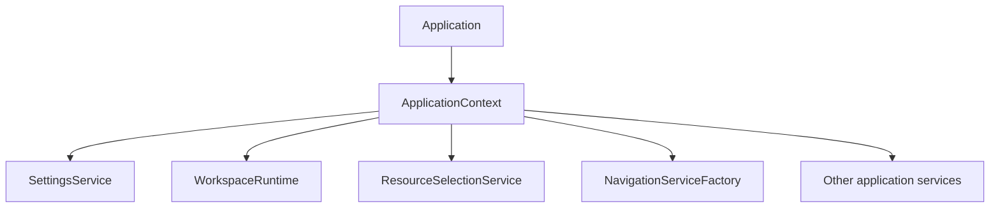
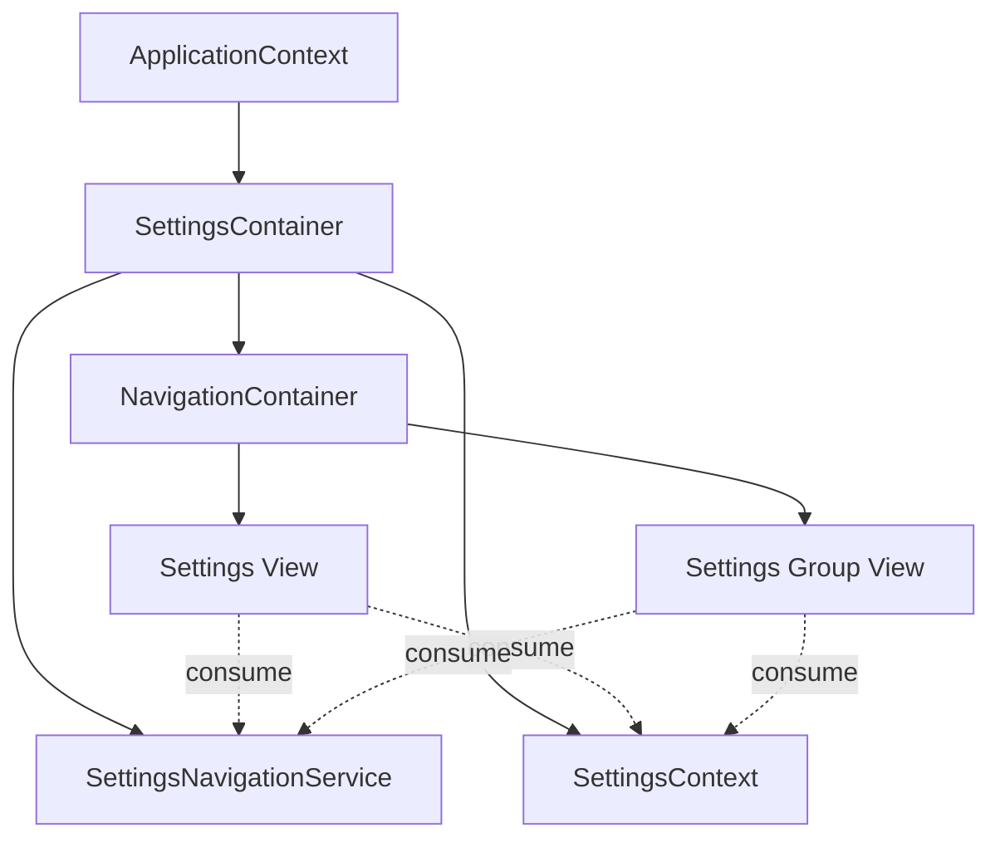
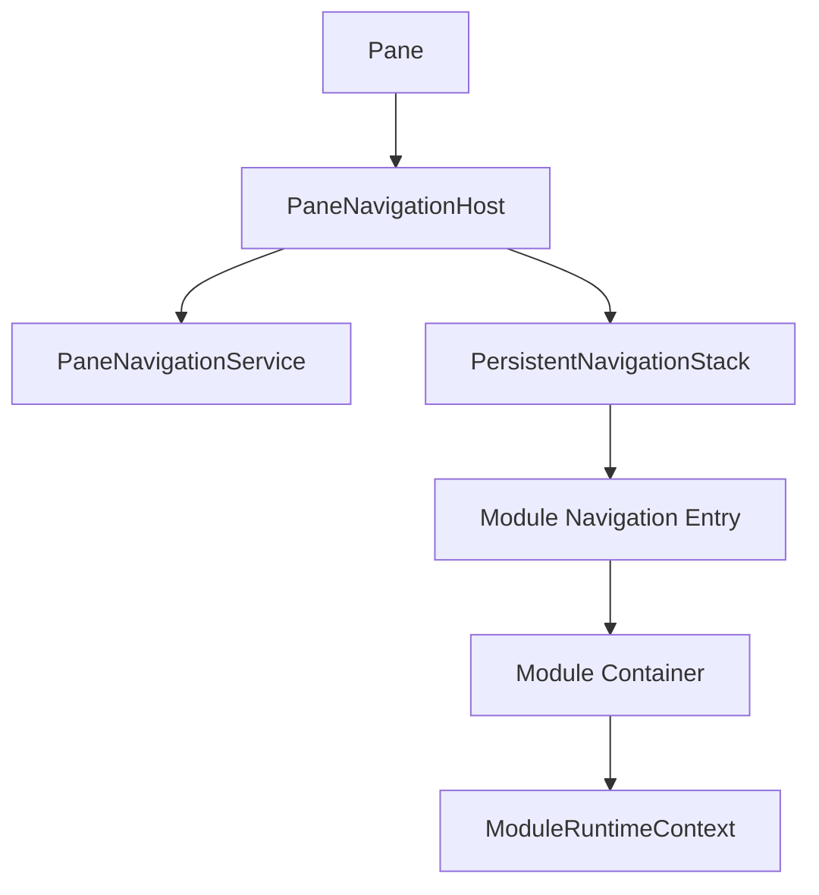
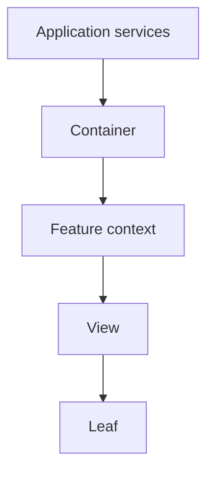
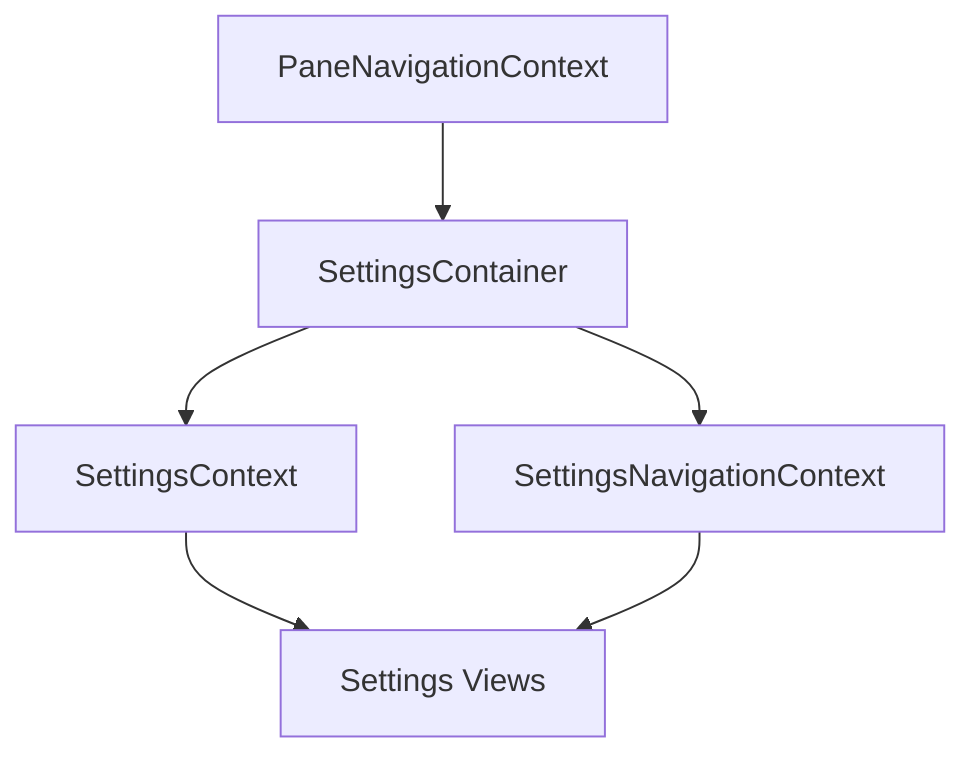

# Composition Roots and Container Boundaries

## Status

**Application Standard / Architecture Guidance**

Save in the repository as:

```text
docs/03_implementation/runtime/015-composition-root-container-boundaries.md
```

---

# 1. Purpose

This document defines where application/module runtime dependencies should be composed and where feature logic should consume them.

The Settings refactor reinforced a strong pattern:

```text
Application
    composes application-global services

Module container
    composes one Module instance

Feature views/components
    consume narrow contexts/capabilities
```

The central rule is:

> **Composition belongs at explicit boundaries; leaf components should consume capabilities rather than reconstruct runtime wiring.**

---

# 2. Application Composition Root

The application root owns long-lived application services.

Conceptually:



This is where dependencies with application lifetime should be constructed and connected.

---

# 3. What Belongs in ApplicationContext

ApplicationContext should expose application-level capabilities such as:

```text
SettingsService
WorkspaceRuntime
authentication/account capability
Resource selection services
factories
event/publication services
```

It should not contain:

```text
one Settings module's search query
one Pane's navigation stack
one Notes editor draft
one view's selected tab
```

---

# 4. Module Container as Secondary Composition Root

Each mounted Module container is a composition root for one Module instance.

Example Settings responsibilities:

```text
consume ApplicationContext
create NavigationService
create SettingsNavigationService
create local reactive Settings projection
provide SettingsContext
provide SettingsNavigationContext
subscribe SettingsService
push root navigation view
choose close behavior
cleanup subscriptions
```

The container owns wiring.

---

# 5. Why Containers Are Valuable

Without a container boundary, leaf components accumulate:

```text
ApplicationContext access
service construction
subscriptions
WorkspaceRuntime access
navigation creation
persistence behavior
close behavior
```

This makes feature UI difficult to reuse and test.

A container keeps feature views simpler.

---

# 6. Container Versus View

A useful distinction:

## Container

Owns:

```text
runtime wiring
context providers
service composition
subscription lifecycle
module shell
entry-point behavior
```

## View

Owns:

```text
feature rendering
user interaction
local UI state
semantic actions
```

---

# 7. Example



Views do not need to know how those services were constructed.

---

# 8. One Container Per Module Instance

Two mounted instances should normally have separate Module containers.

Example:

```text
Settings A
    SettingsContainer A
    NavigationService A

Settings B
    SettingsContainer B
    NavigationService B
```

They may consume the same application services while keeping module-local state isolated.

---

# 9. Runtime Scope Follows Provider Scope

The component that provides a context should live as long as the context state should live.

If navigation should survive nested page changes:

```text
provider
    must live above nested pages
```

If provider is placed inside the page:

```text
navigation destroys/recreates the service
```

which violates ownership.

---

# 10. Avoid Service Construction in Leaf Components

Bad:

```text
row component
    new NavigationService()
```

Bad:

```text
word component
    new ModuleBufferFactory(...)
```

Good:

```text
container composes
leaf consumes context/service
```

---

# 11. Avoid Repeated `useApplicationContext()` Everywhere

It is acceptable for feature components to use ApplicationContext when they genuinely consume an application-level capability.

But when many descendants need a feature-specific projection/facade, create that at the Module container.

Example:

```text
SettingsContext
```

prevents every Settings row from understanding SettingsService persistence/subscriber semantics.

---

# 12. Narrow Contexts

A Module context should expose only what descendants need.

Good:

```ts
interface SettingsContext {
    settings: Settings;
    update(...): void;
}
```

Instead of:

```text
entire ApplicationContext
entire SettingsService implementation
WorkspaceRuntime
all factories
```

Narrow contexts reduce coupling.

---

# 13. Context as Facade

A context can be a module-specific facade over application services.

Example:

```text
SettingsContext.update()
    ↓
SettingsService.updateSetting()
```

The leaf sees:

```text
semantic module operation
```

not:

```text
persistence + broadcast machinery
```

---

# 14. Module Runtime Context

App-wide persistent navigation may add another composition boundary:

```text
ModuleRuntimeContext
```

Conceptually containing:

```text
paneID
buffer identity
Buffer/resource snapshot
activity state
```

The Pane navigation host creates the runtime entry.

The Module container provides the scoped runtime context.

---

# 15. Pane Navigation Host

For app-wide navigation:



This is another composition root:

```text
one per Pane navigation session
```

---

# 16. Composition Layers

The application can be viewed as layered composition roots:

```text
Application
    ↓
Workspace/Pane
    ↓
Module Container
    ↓
Internal View
```

Each level owns dependencies with the matching lifetime.

---

# 17. Lifetime Table

| Boundary | Typical lifetime | Owns |
| --- | --- | --- |
| Application | app session | global services |
| Pane navigation host | Pane lifetime | Pane navigation stack |
| Module container | Module entry lifetime | module-local services/context |
| Internal view | navigation-view lifetime | local view state |
| Leaf component | component lifetime | local UI state |

---

# 18. Avoid Lifetime Mismatch

Bad:

```text
application service constructed in page component
```

It may be recreated too often.

Bad:

```text
view-local search query stored in application singleton
```

It lives too long and becomes shared unexpectedly.

Correct composition follows lifetime.

---

# 19. Dependency Direction

Containers should depend inward/downward on services.

Leaf components should not reach upward into concrete Workspace structures unless that is their actual responsibility.

Preferred:



---

# 20. Entry-Point Normalization

If the same feature can open from several places, route them through the same container when full behavior is required.

Example:

```text
Settings as Workspace Module
Settings inside Bible popup
```

Both should use:

```text
SettingsContainer
```

with host-specific close behavior.

This prevents two different initialization paths.

---

# 20.1 The Container Is the Full Feature Entry Point
When external code needs the complete behavior of a Module/feature, it should mount the feature's container rather than bypassing the container and rendering one of its internal views directly.

The container is the entry point that establishes:
```text
contexts
module-local services
navigation
subscriptions
runtime sizing/shell ownership
host behavior
cleanup
```

For example, opening Settings from another Module should use:
```text
SettingsContainer
```

rather than directly mounting:
```text
settings.svelte
```

if the caller expects normal Settings navigation and runtime behavior.

Internal views are implementation details of the feature's composed runtime tree unless they are explicitly designed and documented as independently mountable components.

This rule prevents multiple entry paths from silently acquiring different:
```text
context providers
navigation behavior
height/clientHeight behavior
subscriptions
close semantics
```

---
# 21. Host-Specific Behavior Via Inputs

A reusable container can accept a narrow host-specific callback.

Example:

```text
onClose
```

If provided:

```text
popup closes
```

Otherwise:

```text
WorkspaceRuntime closes Pane
```

This keeps host differences at the boundary.

---

# 22. Avoid Host Logic in Deep Views

The root Settings view should not know:

```text
am I in a popup?
am I a Workspace Module?
```

The container resolves that distinction and passes one semantic close action.

---

# 23. Resource Capture at Container Boundary

Module containers are a natural place to capture/provide the Module's Resource context.

Future stacked Modules should not repeatedly ask:

```text
what is the current Pane.buffer now?
```

Instead:

```text
navigation entry
    owns Buffer

Module container
    captures/provides that Buffer context
```

---

# 24. Subscriptions at Container Boundary

Subscriptions that serve the whole Module instance should be owned by the Module container.

Examples:

```text
SettingsService subscriber
Pane-level event subscription
Module-global live state subscription
```

Cleanup happens when the Module instance is destroyed.

---

# 25. View-Specific Subscriptions

A subscription used only by one internal view may belong to that view.

Persistent navigation complicates this because hidden views remain mounted.

Decide whether it should:

```text
continue while hidden
pause while inactive
cleanup only on destroy
```

Ownership still follows scope.

---

# 26. Container Shell Ownership

A full Module container may also own:

```text
BufferContainer
BufferHeader/Body composition
navigation shell
```

Do not add another full Module shell around it at a higher navigation layer.

The Pane stack should remain shell-neutral.

---

# 27. Container Testing

A container deserves focused browser/integration tests when it composes:

```text
contexts
subscriptions
navigation
host-specific close behavior
multi-instance synchronization
```

Do not test every child through the container.

Use smaller tests for child behavior.

---

# 28. Minimal Test Hosts

Test hosts can act as temporary composition roots.

They should provide only:

```text
required ApplicationContext
test props
production container/component
```

This mirrors production composition without launching the entire app.

---

# 29. Constructor Injection Versus Context

Non-Svelte services should prefer explicit constructor dependencies where practical.

Svelte component trees may receive runtime capabilities through context.

Do not use Svelte context inside domain services.

---

# 30. Factory Injection

Containers may receive factories from ApplicationContext.

Example:

```text
NavigationServiceFactory
```

This keeps:

```text
service creation policy
```

at the application boundary while allowing:

```text
one instance per Module container
```

---

# 31. Module-Specific Factories

If a Module eventually needs complex instance setup, introduce a feature factory only when construction has meaningful invariants.

Do not create factory layers for trivial object creation.

---

# 32. Composition and Domain Boundaries

Application/module composition may connect:

```text
domain services
runtime services
UI contexts
```

but Domain code should not import Svelte/container concepts.

Dependency direction remains one-way.

---

# 33. Composition Root Is Allowed to Know More

A composition root naturally knows concrete implementations.

That is its job.

Example:

```text
Application
    knows which service implementations to instantiate
```

This knowledge should not leak into every consumer.

---

# 34. Avoid Service Locator Behavior

ApplicationContext should not become a generic:

```text
getAnything(name)
```

service locator.

Prefer typed explicit fields/capabilities.

This keeps dependencies visible.

---

# 35. Avoid Giant Module Contexts

A Module context should not become:

```text
everything this module could ever need
```

Split meaningful concerns when needed:

```text
SettingsContext
SettingsNavigationContext
ModuleRuntimeContext
```

This improves ownership and testability.

---

# 36. Context Nesting Is Valid

A Module may inherit Pane-level context and provide Module-specific contexts beneath it.

Example:



Scopes compose naturally.

---

# 37. Composition Review Questions

When adding a dependency, ask:

```text
What lifetime does it need?
Who should construct it?
Should multiple Module instances share it?
Should multiple Panes share it?
Does the leaf need the concrete service or only a narrow capability?
Where will cleanup occur?
```

---

# 38. Signs a Container Is Missing

Symptoms:

```text
same setup code copied across pages
many descendants call ApplicationContext for same feature concern
callbacks threaded through several layers
subscriptions owned by arbitrary leaf components
host-specific behavior checked deep inside feature views
```

A container/context boundary may simplify the design.

---

# 39. Signs a Container Is Too Large

Symptoms:

```text
hundreds of unrelated responsibilities
domain logic inside container
many conditionals for individual child views
container stores every view's local state
```

Split ownership rather than adding more wiring.

---

# 40. Anti-Patterns

Avoid:

## Leaf component constructs application service

Wrong lifetime.

## Application singleton for module-local state

Cross-instance interference.

## Deep view decides Workspace close policy

Host concern leaked inward.

## Repeating full initialization for popup/module entry

Use same container.

## Giant untyped context bag

Unclear dependencies.

## Context used from domain layer

Framework leakage.

## Provider placed below views that need state persistence

Lifecycle mismatch.

---

# 41. Architecture Invariants

1. Application-global services are composed at the application root.
2. Pane-local navigation is composed at the Pane navigation host.
3. Module-local services/contexts are composed at the Module container.
4. View-local state remains in the view.
5. Provider lifetime matches state/service lifetime.
6. Multiple Module instances get isolated module-local state.
7. Host-specific behavior is resolved at the container boundary.
8. Leaf components consume narrow capabilities.
9. Domain services remain independent from Svelte context.
10. Containers own subscription cleanup for subscriptions they create.
11. Full Module containers are not wrapped in competing full Module shells.
12. Test hosts provide minimal production-like composition.

---

# 42. Summary

The preferred composition structure is:

```text
Application
    global services

Pane Navigation Host
    Pane navigation/runtime

Module Container
    module instance services/contexts

View
    view state

Leaf
    local interaction
```

Each layer composes dependencies for the lifetime it owns.

This reduces:

```text
global state
prop drilling
duplicated setup
lifecycle leaks
host-specific branching
testing complexity
```

and makes the codebase easier to reason about incrementally.
