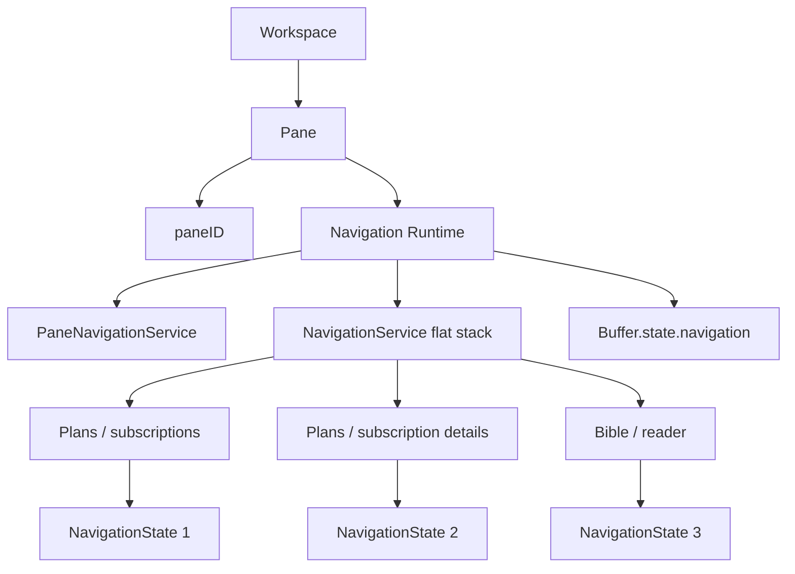
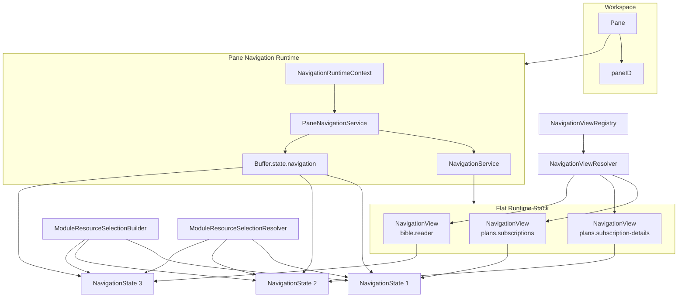

# Application Navigation Architecture

## Status

**Accepted implementation architecture / application standard**

This document defines the application navigation architecture currently being implemented in KJVOnly.bible.

The architecture began with lessons proven by the Settings navigation refactor, but it has evolved beyond the original Buffer-per-navigation-entry proposal.

The current implementation standard is:

> **A Pane owns one persistent, flat navigation stack. Every stack entry owns a serializable `NavigationState`; previous entries remain mounted while hidden; navigation is Pane-local; Resource selections belong to navigation-entry state; and runtime components are reconstructed from stable registered view IDs.**

The current repository path is:

```text
docs/03_implementation/runtime/016-navigation-architecture.md
```

Settings remains documented separately in:

```text
docs/03_implementation/modules/003-settings-module.md
```

Settings is still an important proof of persistent mounted navigation, but application navigation is now a generic Pane runtime rather than a Settings-specific extension.

---

# 1. Purpose

The application historically used several different navigation mechanisms:

```text
replace Pane Buffer
Module-specific view state
popup navigation
internal NavigationService stacks
Pane splitting
Buffer.bag navigation payloads
```

Those mechanisms made it difficult to preserve exact runtime state when moving between related application views and Modules.

The new navigation architecture establishes one primary model:

```text
navigate deeper
    → push NavigationState

go back
    → pop one NavigationState

open side-by-side
    → split to a new Pane navigation runtime
```

Previous entries remain mounted until popped.

This preserves naturally:

```text
DOM identity
local Svelte state
scroll position
browser input state
feature runtime state
```

without feature-specific reconstruction logic during same-session Back navigation.

---

# 2. Core Mental Model

A Pane is a stable navigation host.



Example runtime stack:

```text
Plans / subscriptions
Plans / subscription details
Bible / reader
```

Only the top entry is visible.

The two Plans entries remain mounted while Bible is active.

Back from Bible produces:

```text
Plans / subscriptions
Plans / subscription details
```

The subscription-details component is revealed; it is not reconstructed.

---

# 3. Navigation Is One Flat Stack

Application navigation uses one flat stack.

Do not maintain separate nested histories such as:

```text
Pane module history
    +
Module internal history
```

The stack itself already represents navigation history.

For example:

```text
Plans / subscriptions
    ↓
Plans / subscription details
    ↓
Bible / reader
    ↓
Strong's / definition
```

is represented as four entries in one stack.

Back naturally walks the reverse path:

```text
Strong's
    ← Bible
    ← subscription details
    ← subscriptions
```

A destination being in the same Module or another Module affects state construction and Resource policy, but it does not require another stack abstraction.

---

# 4. NavigationState

Every persisted navigation entry is represented by a `NavigationState`.

Conceptually:

```ts
interface NavigationState<
    TView extends string | number = string | number
> {
    readonly module: Modules;
    readonly view: TView;
    readonly state: NavigationViewState;
}
```

Meaning:

```text
module
    owning application Module / Resource policy

view
    stable globally registered view identity

state
    serializable semantic state required by that view
```

Example:

```ts
{
    module: Modules.PLANS,
    view: 'plans.subscription-details',
    state: {
        subID: 'publisher/group/subscription-id'
    }
}
```

Example Bible entry:

```ts
{
    module: Modules.BIBLE,
    view: 'bible.reader',
    state: {
        bibleLocationRef: '43_3_16',
        resourceSelections: {
            ...
        }
    }
}
```

---

# 5. Stable View IDs

Navigation views use stable globally namespaced IDs.

Examples:

```text
plans.subscriptions
plans.subscription-actions
plans.subscription-details
plans.list
plans.details
plans.next-readings

bible.reader
```

The view ID itself is globally unique enough for component resolution.

Therefore component resolution does not require:

```text
module + view
```

It requires only:

```text
view
```

`NavigationState.module` still has a separate purpose: Module Resource-selection policy and feature-state validation.

---

# 6. NavigationView

Runtime stack entries are `NavigationView` values.

Conceptually:

```ts
interface NavigationView<
    TObj extends Record<string, unknown> = Record<string, unknown>
> {
    readonly component: NavigationComponent;
    obj: TObj;
}
```

For application navigation, `obj` contains the navigation state:

```ts
{
    navigationState
}
```

The runtime entry therefore has:

```text
NavigationView
    component
    obj.navigationState
```

Runtime component constructors are not persisted.

---

# 7. Serialized State and Runtime State

Navigation maintains two related representations.

## Persisted

```text
NavigationState[]
```

Persisted under:

```text
Buffer.state.navigation
```

## Runtime

```text
NavigationView[]
```

owned by:

```text
NavigationService
```

The relationship is:

```text
Buffer.state.navigation[index]
        ↓
NavigationView.obj.navigationState
```

During one runtime session, the runtime view should reference the same logical `NavigationState` object held by the persisted navigation array.

This allows navigation-owned state to be updated without repeatedly serializing and rebuilding the stack.

---

# 8. NavigationViewState

`NavigationState.state` contains view-specific semantic state.

Conceptually:

```ts
interface NavigationViewState {
    resourceSelections?: ResourceSelections;
    [key: string]: NavigationStateValue | undefined;
}
```

Examples:

```ts
{
    subID: '...'
}
```

```ts
{
    bibleLocationRef: '43_3_16',
    navReadings: {...},
    resourceSelections: {...}
}
```

```ts
{}
```

Not every view uses Resources.

For example:

```text
Settings
Archive
simple application pages
```

may have no `resourceSelections` field.

---

# 9. Resource Selections Belong to Navigation State

Resource selections are navigation-entry state.

They are not universally Pane state and they are not resolved from whichever Buffer happens to be active.

The ownership rule is:

```text
Navigation
    owns NavigationState
        ↓
NavigationState.state
    owns resourceSelections
        ↓
View
    consumes selections through resolver
```

This supports multiple independent interactions in one stack.

Example:

```text
Bible entry A
    KJV

Search

Bible entry B
    ASV
```

Bible entry B changing to ASV must not mutate Bible entry A's KJV selection.

---

# 10. ModuleResourceSelectionBuilder

`ModuleResourceSelectionBuilder` owns Resource-selection policy and transformation.

The important operations are:

```ts
independent(module)
```

```ts
related(module, originatingSelections)
```

```ts
update(module, selections, key, value)
```

The Builder delegates Module-specific policy to the existing Resource-selection contributor architecture.

Navigation must not contain Module-specific Resource rules.

---

# 11. independent()

`independent()` creates Resource selections when there is no originating Resource-selection snapshot.

Flow:

```text
target Module
    ↓
ModuleResourceSelectionBuilder.independent()
    ↓
Module contributor
    ↓
current application/default selections
```

This is the same default-selection mechanism used elsewhere in application composition/bootstrap.

Navigation does not duplicate default Resource configuration.

If required defaults cannot be produced, existing Builder/contributor policy determines failure.

---

# 12. related()

`related()` accepts candidate/originating selections and produces selections valid for the target Module.

Flow:

```text
originating NavigationState.resourceSelections
    ↓
target Module
    ↓
ModuleResourceSelectionBuilder.related()
    ↓
target contributor
    ↓
preserve / replace / add / default
```

`related()` may safely be called more than once.

Its useful contract is:

> Given a Module and candidate Resource selections, produce the valid Resource selections for this Module interaction.

It is not restricted to one-time Buffer creation.

---

# 13. update()

`update()` changes one Resource selection in the context of a Module's full Resource-selection policy.

Conceptually:

```ts
update(
    module,
    selections,
    resourceType,
    value
)
```

Flow:

```text
current ResourceSelections
    ↓
replace requested key/value in a copied candidate
    ↓
normal Module contributor/build path
    ↓
new normalized ResourceSelections
```

The previous selection map must not be mutated by reference.

Navigation applies the returned map to the active `NavigationState`.

---

# 14. ModuleResourceSelectionResolver

The resolver owns Resource-selection access and normalization.

Navigation-aware APIs are:

```ts
findWithNavigationState(
    navigationState,
    resourceType
)
```

and:

```ts
requireWithNavigationState(
    navigationState,
    resourceType
)
```

Both use the same normalization path.

If `navigationState.state.resourceSelections` exists:

```text
builder.related(module, selections)
```

If it does not exist:

```text
builder.independent(module)
```

The normalized result is written back to:

```text
navigationState.state.resourceSelections
```

The consuming view does not implement fallback/default Resource logic.

---

# 15. Legacy Pane Resource APIs

During migration, the existing APIs may remain:

```ts
find(paneID, resourceType)
require(paneID, resourceType)
```

These exist only for unmigrated code.

The long-term navigation architecture does not require Resource selection to flow through:

```text
paneID
    ↓
Pane.buffer
    ↓
Buffer.resourceSelections
```

Migrated views use `NavigationState` directly.

When all callers are migrated, Pane-based Resource lookup can be removed.

---

# 16. NavigationStateBuilder

`NavigationStateBuilder` owns construction of new navigation-entry state.

Conceptually:

```ts
create(
    module,
    view,
    viewState,
    originatingState?
)
```

It creates:

```text
module
view
state
resourceSelections when applicable
```

Feature code supplies semantic view state.

It does not control Resource-selection inheritance itself.

Resource selection is derived through `ModuleResourceSelectionBuilder`.

---

# 17. NavigationStateBuilder Resource Rules

When the originating state has Resource selections:

```text
builder.related(
    targetModule,
    originatingSelections
)
```

When no originating Resource selections exist:

```text
builder.independent(targetModule)
```

Caller-supplied `viewState.resourceSelections` is not authoritative.

The state builder derives Resource selections through the Resource builder so feature code cannot bypass Resource policy.

For non-Resource views, `resourceSelections` may remain absent.

---

# 18. View Registry

The generic navigation runtime must not know feature components.

Instead, each feature owns registration data for its views.

Example Plans registrations:

```text
plans.subscriptions
    → SubsView

plans.subscription-details
    → SubsDetails

plans.list
    → Discover
```

Example Bible registration:

```text
bible.reader
    → BibleContainer / reader entry
```

Application composition registers these mappings.

---

# 19. Application Composition Owns Registration

View registration happens explicitly in application composition.

Conceptually:

```text
Plans exports registrations
Bible exports registrations
        ↓
Application composition
        ↓
NavigationViewRegistry.registerAll(...)
```

Avoid import-time self-registration.

Explicit composition makes installed navigation capabilities visible and testable.

---

# 20. NavigationViewRegistry

The registry is intentionally simple:

```text
view ID
    → NavigationComponent
```

It does not understand:

```text
Plans state
Bible state
Resource requirements
Pane structure
```

Duplicate view registration is an error.

Requesting an unknown view is an error.

---

# 21. NavigationViewResolver

`NavigationViewResolver` resolves a serialized navigation state to its runtime component.

Conceptually:

```ts
resolve(navigationState)
    → registry.require(navigationState.view)
```

It does not validate feature-specific state.

For example, it knows that:

```text
plans.subscription-details
    → SubsDetails
```

but it does not know that `SubsDetails` requires a `subID`.

---

# 22. Feature View State Validation

Each navigatable view validates the state it needs to perform its responsibilities.

Example:

```ts
function validateNavState(
    value: unknown
): asserts value is SubsDetailsNavigationState
```

A Plans subscription-details view validates:

```text
module == Modules.PLANS
view == plans.subscription-details
state.subID is valid
```

A Bible reader validates:

```text
module == Modules.BIBLE
view == bible.reader
required Bible state is valid
```

Malformed state should throw rather than silently degrade into an arbitrary view.

Resource state validation remains the Resource resolver's concern.

---

# 23. Generic NavigationService

The generic `NavigationService` owns stack mechanics.

Responsibilities include:

```text
views store
push
pop
hydrate
back
```

`back()` preserves the root:

```text
stack depth <= 1
    → no-op

stack depth > 1
    → remove newest entry
```

The generic service does not know about:

```text
Modules
Resources
Workspace
Panes
feature state
```

---

# 24. PaneNavigationService

`PaneNavigationService` is the semantic Pane-scoped navigation facade.

It composes:

```text
NavigationService
NavigationStateBuilder
NavigationViewResolver
ModuleResourceSelectionBuilder
navigation persistence
```

Current responsibilities include operations such as:

```text
pushView
pushModule
back
clear
updateResourceSelection
backWithResult
```

Split is expected to become another Pane navigation operation as its migration proceeds.

---

# 25. pushView()

`pushView()` navigates to another view while keeping the current Module identity.

Example:

```text
Plans / subscriptions
    ↓
Plans / subscription details
```

Flow:

```text
active NavigationState
    ↓
NavigationStateBuilder.create(
    same module,
    target view,
    target semantic state,
    active state
)
    ↓
NavigationViewResolver
    ↓
NavigationView
    ↓
push
```

The destination receives its own Resource-selection snapshot derived from the origin.

---

# 26. pushModule()

`pushModule()` navigates to a view owned by another Module in the same Pane.

Example:

```text
Plans / subscription details
    ↓
Bible / reader
```

Flow:

```text
active NavigationState
    ↓
NavigationStateBuilder.create(
    Modules.BIBLE,
    bible.reader,
    Bible semantic state,
    active state
)
    ↓
ModuleResourceSelectionBuilder.related()
    ↓
NavigationViewResolver
    ↓
push
```

The originating Plans view remains mounted hidden.

---

# 27. Back

Back removes only the top entry.

Example:

```text
Plans / subscriptions
Plans / subscription details
Bible / reader
```

Back becomes:

```text
Plans / subscriptions
Plans / subscription details
```

The previous entry was already mounted.

Back does not:

```text
recreate the previous component
reload its semantic state
restore its scroll manually
serialize and rebuild the remaining stack
```

It simply removes the popped runtime/persisted entry and reveals the previous entry.

---

# 28. Navigation Results

Some navigation interactions need a result returned to the direct parent view.

The first proven use is Reading Plans completion.

Plans pushes Bible with an opaque return payload.

When Bible reaches the end of the requested reading, Bible returns the payload through navigation.

Conceptually:

```text
Plans
    ↓ push Bible
Bible
    ↓ backWithResult(result)
Plans result handler
    ↓
complete plan reading
    ↓
Bible pops
```

The navigation result boundary prevents Bible from depending on Reading Plans services or models.

---

# 29. Result Callbacks Are Runtime-Only

Result handlers are runtime behavior.

They are not persisted in `NavigationState`.

The lower mounted view registers a runtime callback with the Pane navigation service.

The upper view returns an opaque result.

This is similar to callback-based communication without prop binding or prop drilling.

Persisted navigation remains data-only.

After reload, restored views mount and register their handlers again.

---

# 30. Result Scope Is Direct Parent

The current result contract is intentionally one level deep.

For:

```text
A
B
C
```

`C.backWithResult(result)` targets `B`.

It does not search arbitrarily down the stack for A.

This keeps navigation results from becoming a hidden global event bus.

If a real workflow later needs deeper targeting, add an explicit targeting API rather than accidental callback chaining.

---

# 31. Result Handling Happens Before Pop

A result handler completes before the child entry is popped.

This is important for durable state changes.

For Reading Plans:

```text
Bible final reading
    ↓
Plans result handler
    ↓
PlanProgressService.completeReading()
    ↓
plansPubSubService.putProgress()
    ↓
Bible pop
```

If the result handler fails, the child remains active.

This prevents the navigation event from being lost before the durable write completes.

---

# 32. NavigationRuntimeContext

Each rendered Pane provides one navigation runtime context.

Conceptually:

```ts
interface NavigationRuntimeContext {
    paneID: string;
    navigation: PaneNavigationService;
}
```

The runtime is Pane-local.

Two Panes have independent:

```text
NavigationService instances
NavigationState stacks
active entries
Resource-selection state
result handlers
```

Navigation must not become an application-global singleton.

---

# 33. paneID Ownership

`paneID` belongs to the navigation runtime / Workspace placement boundary.

Views should progressively stop receiving `paneID` merely to:

```text
resolve Resources
navigate
find their Buffer
```

Those operations now flow through navigation state and navigation context.

Do not serialize `paneID` into every `NavigationState`.

It describes where the navigation session is hosted, not the semantic state of an individual view.

---

# 34. NavigationEntry Context

Each mounted navigation entry provides its own `NavigationState` context to descendants.

This is important for nested component trees such as Bible Reader.

A nested Bible component can resolve Resources from the nearest navigation entry without receiving `navigationState` through every prop layer.

Conceptually:

```text
PaneNavigationContainer
    ↓
NavigationEntry
    provides NavigationState
    ↓
Bible reader descendants
```

This keeps entry identity local and avoids falling back to `Pane.buffer`.

---

# 35. Renderer Ownership

The Pane renderer decides which runtime navigation entry is visible.

It should remain shell-neutral.

Conceptually:

```svelte
{#each $navigation.views as navigationView, index}
    <NavigationEntry
        hidden={index !== lastIndex}
        {navigationView}
    />
{/each}
```

Previous entries remain mounted and hidden.

Popped entries are destroyed.

The renderer does not own:

```text
Module Resource policy
feature state validation
domain behavior
view registration
```

---

# 36. One-Way Navigation Entry Props

Navigation owns each runtime entry object.

Therefore the renderer passes entry state one-way:

```svelte
<ViewComponent
    obj={navigationView.obj}
/>
```

Do not bind the child back to:

```svelte
bind:obj={navigationView.obj}
```

The child may mutate navigation-owned state through navigation APIs, but it does not own replacing the navigation entry object.

---

# 37. Persistence

The navigation stack is persisted as:

```text
Buffer.state.navigation
    = NavigationState[]
```

During migration, Buffer remains the persistence anchor for a Pane.

Buffer is no longer the authoritative Resource-selection identity for each migrated navigation entry.

The authoritative entry state is:

```text
NavigationState
```

and:

```text
NavigationState.state.resourceSelections
```

---

# 38. Stack Persistence Synchronization

The navigation runtime and persisted array are updated together.

## Push

```text
create NavigationState
append same state object to Buffer.state.navigation
create NavigationView referencing same state
append runtime view
persist Workspace
```

## Back

```text
remove top runtime NavigationView
remove top persisted NavigationState
persist Workspace
```

Remaining entries are not rebuilt.

## Resource update

```text
update active NavigationState.state.resourceSelections
persist Workspace
```

No component reconstruction is required.

---

# 39. Hydration

On reload:

```text
Buffer.state.navigation[]
    ↓
for each NavigationState
    ↓
NavigationViewResolver.resolve(view)
    ↓
NavigationView {
    component,
    obj: { navigationState }
}
    ↓
NavigationService.hydrate()
```

All restored entries mount.

Only the top entry is visible.

Exact browser DOM identity does not survive a browser reload.

The semantic navigation hierarchy does survive.

---

# 40. Hydration Is Generic

Feature containers do not reconstruct their own persisted navigation stack.

The generic navigation runtime has everything required:

```text
NavigationState.module
NavigationState.view
NavigationState.state
registered view component
```

Plans does not own Plans-specific stack hydration.

Bible does not own Bible-specific stack hydration.

The view validates its own semantic state after it mounts.

---

# 41. Opening a Module Means Opening a View

The primitive navigation action should always identify a concrete destination view.

Prefer:

```text
module + view + state
```

not merely:

```text
module
```

For example:

```ts
navigation.pushModule(
    Modules.BIBLE,
    'bible.reader',
    {
        bibleLocationRef
    }
)
```

Navigation should not rediscover a Module's default view through a second root-factory abstraction.

---

# 42. Initial Pane Navigation

Something always opens the initial Module/view.

Examples:

```text
application composition creates initial Pane navigation
Modules launcher opens a selected view
split operation creates another Pane with an initial view
```

The initiating action supplies:

```text
module
view
semantic state
```

`NavigationStateBuilder` completes the state.

Feature views may react to domain conditions after mounting.

---

# 43. Feature-Driven Redirect/Push

Feature-specific startup behavior belongs to the feature view, not generic navigation.

Example:

```text
open plans.subscriptions
    ↓
Plans subscriptions view mounts
    ↓
no subscriptions exist
    ↓
navigation.pushView(plans.list)
```

The original subscriptions view remains mounted hidden.

Back from Discover reveals it.

No Module root-initializer registry is necessary for this behavior.

---

# 44. Split

Split is a Pane navigation operation, not a feature-owned Workspace mutation.

Long-term direction:

```ts
navigation.split(
    direction,
    module,
    view,
    state
)
```

Flow:

```text
current navigation runtime
    ↓
NavigationStateBuilder creates destination root
    ↓
Workspace creates new Pane
    ↓
new Pane gets independent NavigationRuntimeContext
    ↓
destination state becomes its root
```

A split creates:

```text
new Pane
new paneID
new NavigationService
new stack
```

A split is not a push into the current stack.

---

# 45. Back Versus Close

Back and root close remain distinct concepts.

## Back

```text
stack depth > 1
    → pop one entry
```

## Root close

```text
stack depth == 1
    → application root/Modules policy
```

The current navigation facade may expose `clear()` while migration continues, but root close policy should remain conceptually separate from nested Back.

---

# 46. Settings

Settings does not need to be rewritten merely because Pane navigation now exists.

Its internal navigation remains useful and proven.

Settings can continue using its own:

```text
SettingsNavigationContext
NavigationService
NavigationContainer
```

until there is a concrete benefit to migrating it.

The new Pane navigation runtime must not break Settings.

---

# 47. Archive and Non-Resource Views

Navigation state does not require Resource selections.

Example:

```ts
{
    module: Modules.ARCHIVE,
    view: 'archive.export',
    state: {}
}
```

This is intentional.

Resource selection is optional view state, not a universal navigation field.

---

# 48. Buffer Role During Migration

Buffer currently remains important for:

```text
Pane persistence envelope
legacy Module state
legacy bag
legacy Resource-selection callers
Workspace compatibility
```

But migrated navigation views should not depend on:

```text
Pane.buffer.resourceSelections
```

for their active Resource context.

Do not perform a broad Buffer cleanup as part of navigation migration.

After migration, separately evaluate whether these fields remain necessary:

```text
Buffer.componentName
Buffer.bag
Buffer.resourceSelections
```

---

# 49. Buffer.bag

`Buffer.bag` remains untouched during this migration.

Do not force navigation state back into `bag` merely for compatibility.

New navigation state belongs in:

```text
Buffer.state.navigation
```

Feature-specific legacy bag consumers can be migrated separately.

---

# 50. First Proven Feature Migration: Reading Plans

Reading Plans is the first feature migrated to the new Pane navigation model.

Plans now registers stable navigation views such as:

```text
plans.subscriptions
plans.subscription-actions
plans.subscription-details
plans.list
plans.details
plans.next-readings
```

Plans views:

```text
consume obj.navigationState
validate their own state
use Pane navigation context
use NavigationState Resource resolution
push views through navigation
use Back through navigation
```

The old Plans container-owned navigation stack and serialization logic are removed from the migrated path.

---

# 51. Plans Empty-State Navigation

The Plans root view can react to accepted domain state after mounting.

Example:

```text
plans.subscriptions mounts
    ↓
subscriptions.length == 0
    ↓
push plans.list
```

This produces:

```text
plans.subscriptions      mounted hidden
plans.list               active
```

The feature decides this because it understands Plans domain state.

Generic navigation remains unaware of subscription counts.

---

# 52. First Proven Cross-Module Flow: Plans → Bible

The first migrated cross-Module workflow is:

```text
Plans / subscription details
    ↓ select reading
Bible / reader
```

Plans calls the Pane navigation service with:

```text
Modules.BIBLE
bible.reader
Bible location
Bible reading navigation payload
opaque Plans return result
```

`NavigationStateBuilder` derives Bible Resource selections from the originating Plans navigation state.

Bible becomes the active top entry.

Plans remains mounted hidden.

---

# 53. Plans → Bible Back Preservation

While Bible is active:

```text
Plans / subscription details
    mounted hidden

Bible / reader
    mounted visible
```

Normal Bible Back/close:

```text
pop Bible
reveal existing Plans view
```

Plans is not reconstructed.

Its runtime state and DOM remain intact.

---

# 54. Plans Reading Completion Result

Completion is not inferred merely from returning from Bible.

A normal Back does not mark a reading complete.

When the user advances beyond the final requested Bible reading:

```text
Bible
    ↓ backWithResult(opaque Plans payload)
Plans result handler
    ↓ PlanProgressService.completeReading()
    ↓ plansPubSubService.putProgress()
Bible pops
```

The persisted Plans progress remains authoritative.

Bible remains independent of Reading Plans services.

---

# 55. Domain Dependency Direction

Navigation must not introduce reverse domain dependencies.

For Plans → Bible:

```text
Reading Plans
    → Bible navigation payload

Bible
    ✕ Reading Plans domain/service imports
```

Bible treats the result payload as opaque navigation data.

The hidden Plans view owns completion semantics.

---

# 56. Bible Reader Resource Context

The Bible reader and nested reader components use the current navigation entry's `NavigationState` for Resource resolution.

They must not resolve Resources by assuming:

```text
Pane.buffer == this Bible interaction
```

because another entry may become active later while the Bible component remains mounted.

The navigation-entry context supplies stable access to the correct state.

---

# 57. Resource Selection Changes in Bible

When a user changes a Bible Resource selection:

```text
Bible view
    ↓
navigation.updateResourceSelection(type, value)
    ↓
ModuleResourceSelectionBuilder.update()
    ↓
active Bible NavigationState.state.resourceSelections
    ↓
Workspace persistence
```

The view does not directly mutate selection maps.

Other hidden navigation entries keep their own Resource snapshots.

---

# 58. Navigation Component Ownership

A feature's navigatable page owns:

```text
state contract validation
feature domain reads/writes
feature-specific UI behavior
when to request navigation
```

It does not own:

```text
stack persistence
component registry
Resource inheritance policy
Pane lookup
Workspace stack reconstruction
```

---

# 59. Domain Services Remain Navigation-Agnostic

Domain services should not learn about:

```text
Pane
paneID
NavigationService
NavigationState stack
Svelte context
Workspace layout
```

They receive domain/application values only.

Navigation remains an application/runtime concern.

---

# 60. Generic Runtime Must Avoid Feature Switches

Do not implement central branches such as:

```ts
if (module === Modules.PLANS) {
    ...
}

if (view === 'bible.reader') {
    ...
}
```

inside generic navigation mechanics.

Feature knowledge belongs in:

```text
feature registration
feature state validators
Module Resource contributors
feature domain services
```

Application composition is the explicit integration boundary.

---

# 61. Persistence Data Rules

Persist only semantic navigation data.

Allowed:

```text
module
stable view ID
strings
numbers
booleans
null
arrays/plain objects
Resource selection references
feature semantic IDs
```

Do not persist:

```text
Svelte component constructors
DOM nodes
callbacks
service instances
workers
context objects
NavigationService
```

Runtime callbacks such as navigation result handlers are reconstructed after mount.

---

# 62. Same-Session Identity

The primary reason to keep hidden entries mounted is same-session identity preservation.

Browser tests should prove:

```text
mount A
capture DOM node
push B
A stays mounted hidden
back
revealed A node === original A node
```

Use object identity assertions where practical.

---

# 63. Reload Semantics

Reload is different from Back.

After browser reload:

```text
DOM identity is new
component instances are new
runtime callbacks are re-registered
```

But persisted semantic hierarchy remains:

```text
NavigationState[]
```

The runtime reconstructs the stack from semantic state and registered view mappings.

---

# 64. Multi-Pane Isolation

Every Pane has its own navigation runtime.

Example:

```text
Pane A
    Plans → Bible

Pane B
    Bible → Strong's
```

Required isolation:

```text
independent NavigationService
independent persisted navigation stack
independent Resource-selection snapshots
independent result handlers
```

No Pane navigation state should be global.

---

# 65. Same View Multiple Times

The same view may appear more than once in a stack.

Example:

```text
bible.reader Genesis 1
search.results grace
bible.reader Romans 8
```

The two `bible.reader` entries are separate interactions because they have separate `NavigationState` objects and separate component instances.

View identity is component type identity, not runtime interaction identity.

---

# 66. Active / Inactive / Popped

Navigation entries have three meaningful lifecycle states:

```text
active
    mounted + visible

inactive
    mounted + hidden

popped
    destroyed
```

These must remain distinct.

Future worker/subscription lifecycle APIs may react to active/inactive transitions without destroying UI state.

Do not solve memory concerns by automatically destroying hidden entries.

---

# 67. Browser History Is Separate

Pane navigation is application navigation.

It is not automatically browser URL/history navigation.

The app is a single-route PWA.

Do not couple Pane navigation to browser History API unless a separate product requirement calls for it.

---

# 68. Testing — Generic NavigationService

Unit tests should cover:

```text
push adds entry
back removes only newest entry
back preserves root
pop behavior remains explicit
hydrate installs supplied runtime stack
```

---

# 69. Testing — NavigationStateBuilder

Verify:

```text
no originating selections
    → independent()

originating selections
    → related()

feature state preserved
caller-supplied resourceSelections not authoritative
non-Resource target may omit resourceSelections
new selection snapshots do not alias origin
```

---

# 70. Testing — ModuleResourceSelectionBuilder.update

Verify:

```text
requested key is updated
origin map is not mutated
Module contributor/default policy is applied
compatible selections remain
invalid/dependent selections normalize as policy requires
```

---

# 71. Testing — Navigation-Aware Resolver

Verify:

```text
find allows undefined
require throws when unresolved
missing selections use independent defaults
existing selections use related normalization
normalized selections are written back to NavigationState
Pane lookup is not used
```

Legacy Pane resolver tests remain until that API is removed.

---

# 72. Testing — View Registry

Verify:

```text
registered view resolves component
duplicate registration throws
unknown view throws
resolver does not inspect feature state
```

---

# 73. Testing — View State Validation

Each feature should test its view state contract.

For example:

```text
correct module/view/state
    → accepted

wrong module
    → throws

wrong view
    → throws

missing required semantic ID
    → throws
```

Do not duplicate Resource resolver tests inside feature validators.

---

# 74. Testing — Stack Persistence

Verify object ownership and synchronization:

```text
push
    same NavigationState object is used by persisted and runtime entry

back
    only newest persisted/runtime entry removed

Resource update
    active state object retained and persisted
```

Do not rebuild remaining entries merely to persist the stack.

---

# 75. Testing — Hydration

Integration/browser test:

```text
navigate through multiple views
persist Workspace
recreate runtime
hydrate stack
verify all semantic entries restored
verify only top visible
```

Exact DOM identity is not expected across reload.

---

# 76. Testing — Plans → Bible → Back

This is the first end-to-end regression workflow for the new architecture.

Verify:

```text
Plans details mounted
push Bible
Plans remains mounted hidden
Bible uses related Resource selections
Back Bible
same Plans DOM/component instance becomes visible
```

---

# 77. Testing — Plans Completion Result

Verify:

```text
normal Bible Back
    → no progress completion

final plan Bible reading
    → result handler executes
    → PlanProgressService.completeReading()
    → worker projection updated
    → Bible pops

result handler failure
    → Bible remains active
```

This protects durable-before-navigation semantics.

---

# 78. Testing — Resource Isolation

Eventually verify:

```text
Bible entry A uses KJV
push another interaction
Bible entry B switches to ASV
Bible entry A still resolves KJV
Bible entry B resolves ASV
```

No hidden view may accidentally read another entry's active Resource selections.

---

# 79. Testing — Pane Isolation

Mount two Panes.

Navigate independently.

Verify:

```text
Pane A changes do not alter Pane B stack
Pane A Resources do not alter Pane B Resources
Pane A result handlers do not affect Pane B
```

---

# 80. Migration Strategy

Migrate feature flows incrementally.

The preferred order is:

```text
1. establish generic navigation primitives
2. migrate one feature's internal navigation
3. migrate one cross-Module flow
4. add regression tests
5. migrate adjacent flows
6. remove legacy Pane/Buffer navigation APIs only after callers are gone
```

Do not add broad compatibility layers merely to preserve old navigation while the new architecture is still being established.

Breaking migration changes are acceptable during this phase when they keep the new architecture clean.

---

# 81. Current Implemented Milestones

The current implementation has established:

```text
flat NavigationState
stable namespaced view IDs
NavigationStateBuilder
NavigationViewRegistry
application-composition registration
NavigationViewResolver
Pane NavigationRuntimeContext
PaneNavigationService
navigation-entry context
flat-stack hydration
Buffer.state.navigation persistence sync
Pane stack renderer
Resource builder update()
navigation-aware Resource resolver
Plans navigation migration
Bible reader navigation entry
Plans → Bible pushModule flow
Back preservation
runtime direct-parent navigation results
Plans reading completion through backWithResult
```

This document should now be treated as describing the implemented direction, not an early Buffer-per-entry proposal.

---

# 82. Remaining Legacy Boundaries

The following compatibility areas still exist and should be migrated deliberately:

```text
legacy Pane-based Resource resolver APIs
unmigrated Modules rendered through legacy Buffer/component path
Buffer.resourceSelections legacy consumers
Buffer.bag navigation consumers
Workspace/Panes split APIs called directly by features
legacy Module component resolver callers
```

Do not remove a compatibility API until its real callers have migrated.

---

# 83. Next Architectural Migration Areas

Likely next navigation migrations include:

```text
Bible → Strong's
Bible → Search
Search → Bible
Bible → Notes
Bible → Cross References
Dictionary
other Module launcher entries
split-pane navigation API
```

Each should use the same primitives rather than adding feature-specific navigation infrastructure.

---

# 84. Navigation Architecture Invariants

The implementation should preserve these invariants:

1. A Pane owns exactly one Pane navigation runtime.
2. Navigation is a flat stack of runtime `NavigationView` entries.
3. Persisted history is a flat `NavigationState[]`.
4. Every persisted entry identifies `module`, stable `view`, and semantic `state`.
5. View IDs are globally namespaced and registered by owning features.
6. Application composition performs explicit view registration.
7. Generic navigation does not import feature components directly.
8. Previous entries remain mounted while hidden.
9. Back removes only the newest entry and reveals the existing previous entry.
10. `NavigationState.state.resourceSelections` owns migrated Resource-selection snapshots.
11. `ModuleResourceSelectionBuilder` owns independent/related/update Resource policy.
12. `ModuleResourceSelectionResolver` owns Resource access/default normalization.
13. Views do not implement Resource fallback logic.
14. Views validate their own semantic navigation-state contract.
15. `paneID` belongs to the Pane navigation runtime, not every view state.
16. Navigation entry state may be provided to descendants through entry-scoped context.
17. Runtime component constructors and callbacks are never persisted.
18. Stack persistence mutates/appends/removes the existing state objects rather than rebuilding the remaining stack.
19. Reload reconstructs runtime components from registered stable view IDs.
20. A navigation action opens a concrete `module + view`, not an abstract Module that must rediscover its root view.
21. Feature-driven redirects/pushes remain feature behavior.
22. Result callbacks are runtime-only and currently direct-parent scoped.
23. Result handlers complete before the child is popped.
24. Cross-domain result payloads remain opaque to the destination Module.
25. Domain services remain unaware of Pane/navigation mechanics.
26. Split creates a new Pane navigation runtime rather than another entry in the current Pane.
27. Settings may retain its existing internal navigation until a concrete migration benefit exists.
28. Legacy Pane/Buffer APIs are compatibility boundaries, not the target Resource/navigation architecture.

---

# 85. Anti-Patterns

Avoid:

## Feature-specific component imports in generic navigation

Use the registry and application composition.

## Nested navigation-history representations

Do not put `entries[]` inside each `NavigationState`.

The `NavigationService` stack is already the history.

## Passing Buffer through every navigated component

Navigation state owns semantic entry context.

## Resolving migrated Resources from current `Pane.buffer`

Hidden entries may belong to different interactions.

## Direct mutation of `NavigationState.state.resourceSelections` from feature UI

Use navigation / Resource builder update APIs.

## Reconstructing navigation history in feature containers

Hydration is generic.

## Binding navigation-owned runtime objects back from child components

Pass navigation entry objects one-way.

## Central feature switches in generic navigation

Use registrations, validators, contributors, and composition.

## Persisting callbacks or Svelte component constructors

Persist semantic state only.

## Treating normal Back as successful feature completion

Use an explicit navigation result when completion semantics are required.

## Deep result callback search without an explicit use case

Keep direct-parent result semantics until a real deeper-target workflow requires otherwise.

---

# 86. Final Target Model



The core application rule is:

> **A Pane hosts one flat navigation session. Each navigation entry owns serializable semantic state and its own Resource-selection snapshot. Runtime views remain mounted until popped. Stable registered view IDs reconstruct runtime components. Navigation context owns movement; feature views own semantic meaning; Resource contributors own Module Resource policy.**

---

# 87. Summary

The mature KJVOnly.bible navigation model is no longer based on replacing Buffers or giving each stacked Module a separate Buffer identity.

The stable model is:

```text
Pane
    → Pane-local navigation runtime

Navigation runtime
    → flat NavigationView stack

NavigationView
    → one NavigationState

NavigationState
    → module + stable view + semantic state

NavigationViewState
    → optional Resource selections

NavigationStateBuilder
    → creates destination state

NavigationViewRegistry
    → maps stable view IDs to components

NavigationService
    → generic stack mechanics

PaneNavigationService
    → semantic push/back/update/result behavior

ModuleResourceSelectionBuilder
    → Resource-selection policy

ModuleResourceSelectionResolver
    → Resource access/normalization

Buffer.state.navigation
    → persisted flat semantic stack
```

The first real proof is already working:

```text
Plans
    → Bible reader
    → Back
    → exact mounted Plans view

Plans
    → Bible final reading
    → navigation result
    → durable Plan progress update
    → Back
```

Future Module migrations should reuse these same primitives rather than introducing new navigation mechanisms.
