# Application Navigation Architecture

## Status

**Target Architecture / Proposed Application Standard**

This document defines the desired navigation architecture for KJVOnly.bible based on the navigation model proven by the Settings refactor.

The Settings module remains documented separately in:

```text
docs/03_implementation/modules/003-settings-module.md
```

That document explains how Settings itself is implemented.

This document extracts the reusable navigation lessons from Settings and defines how navigation should evolve across the rest of the application.

Suggested repository path:

```text
docs/03_implementation/runtime/006-navigation-architecture.md
```

---

# 1. Purpose

The application already has several strong runtime concepts:

```text
Workspace
Pane
Buffer
Buffer.bag
Buffer.resourceSelections
ModuleBufferFactory
ModuleResourceSelectionResolver
NavigationService
NavigationContainer
Svelte context
```

Historically, these concepts have not all been composed into one consistent navigation model.

Some navigation currently behaves like:

```text
replace the module in the Pane
```

while Settings demonstrated a different and often better interaction model:

```text
keep the originating view mounted
push the destination on top
hide the originating view
pop the destination later
reveal the exact same originating view
```

The Settings implementation proved several important properties of this model:

```text
local component state survives
scroll state survives
browser input state survives
DOM identity survives
Back is cheap
navigation is instance-local
navigation communication can be context-based
```

The desired application architecture is to reuse those lessons for navigation between normal application Modules.

The central target is:

> **A Pane becomes a stable navigation host. Related Modules can be pushed onto a persistent stack inside that Pane. The Pane keeps the same `paneID`; each Module entry keeps its own Buffer/runtime identity; navigation is coordinated through a Pane-local navigation context.**

---

# 1.1 Implementation Gate for App-Wide Module Overlays

The Settings implementation proves the persistent-stack interaction model, but full cross-Module overlays should not be rolled out until the runtime satisfies two prerequisites.

## Entry-scoped Buffer and Resource resolution

Every mounted Module entry must retain stable access to its own Buffer and captured Resource selections.

The existinggit apply --check 20260924-docs-capture-session-learnings.patch &&
git apply 20260924-docs-capture-session-learnings.patch lookup shape:

```text
paneID
    ↓
Pane.buffer
```

is sufficient only while a Pane effectively has one mounted Module interaction.

Once Module A remains mounted underneath Module B:

```text
Pane.buffer
```

represents the active top entry and cannot safely identify Module A's Buffer.

Therefore the first app-wide navigation slice must make Module Resource access entry/Buffer-aware before relying on persistent hidden Modules.

## Shell-neutral persistent stack rendering

The reusable persistent-stack primitive must also be separable from:

```text
BufferContainer
BufferHeader
BufferBody
```

Full Module containers already own their Module shell. App-wide stacking must not introduce a second competing shell around them.

These are implementation prerequisites, not optional follow-up cleanup.

The migration order should therefore begin with:

```text
1. extract shell-neutral persistent stack rendering
2. establish entry-scoped Module Buffer/runtime context
3. make Resource lookup follow that Buffer context
4. prove isolation with browser tests
5. migrate the first real cross-Module workflow
```

Do not broadly convert existing Module transitions to persistent push navigation before those boundaries are in place.

---

# 2. Core Mental Model

The desired runtime model is:

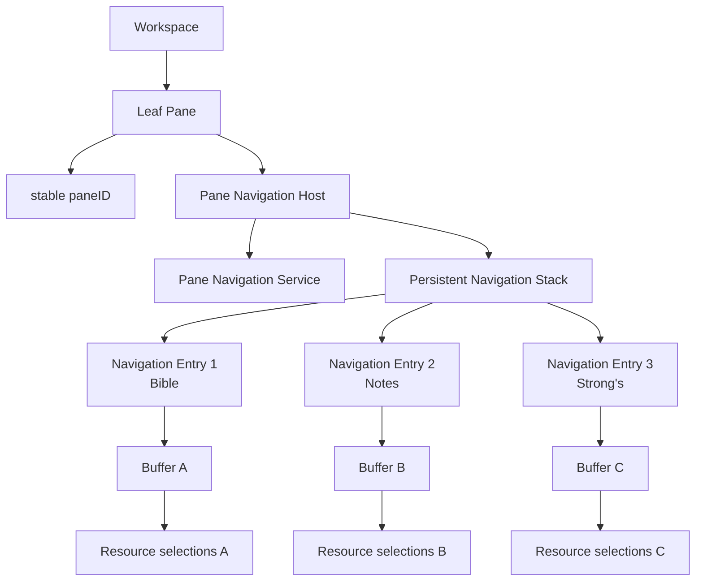

The identities are intentionally separate:

```text
paneID
    = where the navigation session is displayed

Buffer key
    = which concrete Module interaction exists

Navigation entry
    = one mounted layer in the Pane navigation stack
```

A Pane remains structurally stable while its navigation stack changes.

---

# 3. What Settings Proved

Settings is the reference implementation for the persistent-view part of this architecture.

Settings currently demonstrates:

```text
NavigationService
    owns stack state

NavigationContainer
    renders every stack entry

previous views
    stay mounted

only top view
    is visible

Svelte context
    provides navigation without prop drilling

Back
    pops the stack

pop
    destroys only the top view

revealed view
    is the exact previous mounted instance
```

Conceptually:

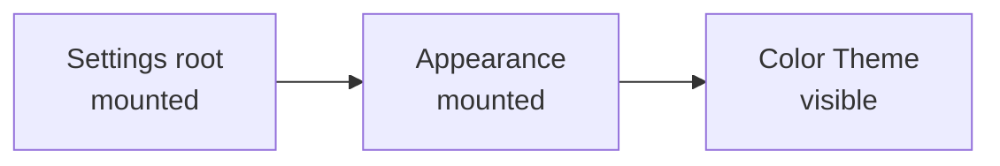

After Back:

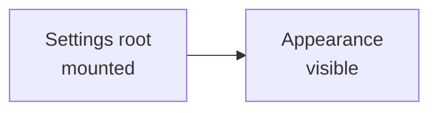

`Appearance` was not reconstructed.

Its DOM and local state already existed.

This is the behavior the rest of the application should reuse.

---

# 4. Why Settings Is a Special Case

Settings is self-contained.

Its navigation stack contains Settings-specific views such as:

```text
Settings root
Appearance page
Bible settings page
choice page
custom setting page
```

These are not separate application Modules.

They all belong to one Settings Module instance.

Therefore Settings can use:

```text
one Settings Buffer
one SettingsContainer
one local SettingsNavigationService
one local SettingsNavigationContext
many internal Settings views
```

No nested Settings view needs to become:

```text
Notes
Bible
Search
Plans
Strong's
```

The Settings architecture therefore represents **internal view navigation**.

Application-wide navigation needs the same persistent-stack behavior but must additionally preserve Module/Buffer semantics.

---

# 5. Two Navigation Layers

The application should explicitly distinguish two kinds of navigation.

## 5.1 Internal View Navigation

Internal navigation stays inside one Module instance.

Examples:

```text
Settings
    → Appearance
    → Color Theme

Profile
    → Edit Profile
    → Relay editor

Plans
    → Subscriptions
    → Discover
```

Characteristics:

```text
same Module
same Buffer
same resource-selection snapshot
same module-level runtime ownership
different mounted Svelte views
```

This is the navigation pattern already proven by Settings.

---

## 5.2 Cross-Module Navigation

Cross-module navigation moves from one application Module to another while preserving relationship to the originating interaction.

Examples could include:

```text
Bible
    → Notes

Bible
    → Strong's

Search
    → Bible

Reading Plan
    → Bible reading

Bible
    → Dictionary

Bible
    → Cross References
```

Characteristics:

```text
same Pane
same paneID
same navigation session
different Module
different Buffer identity
related Resource context
previous Module remains mounted
```

This is the application-wide extension of the Settings pattern.

---

# 6. Internal Views and Module Overlays Are Not the Same Thing

It is important not to flatten these two concepts.

Internal Settings navigation:

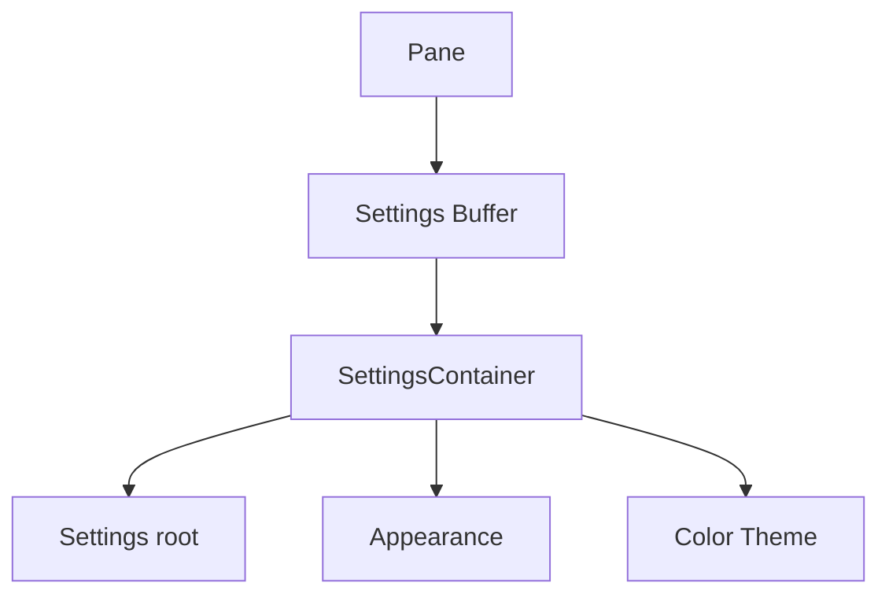

Cross-module navigation:

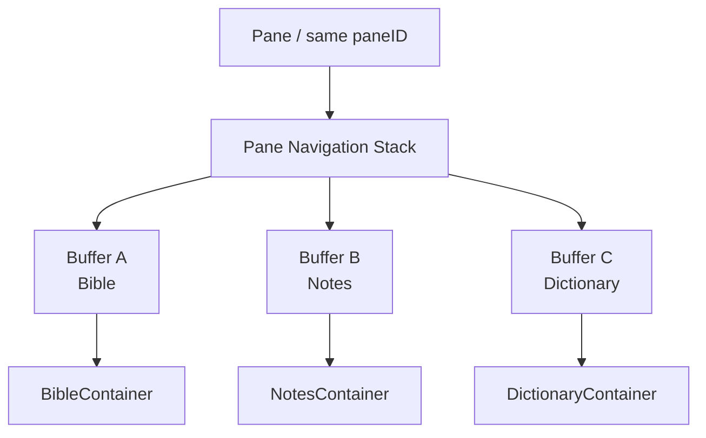

The first model has:

```text
one Module
one Buffer
many internal views
```

The second has:

```text
one Pane
many related Module instances
one Buffer per Module instance
```

---

# 7. Stable Pane Identity

The stable structural identity remains:

```text
paneID
```

Navigation must not create a new Pane merely because a Module is pushed.

For example:

```text
Pane a
    Bible

navigate to Notes

Pane a
    Bible hidden
    Notes visible
```

The user has not created a second pane.

The Workspace layout should not change.

Therefore:

```text
paneID before push
    =
paneID after push
```

This mirrors the existing rule that Pane identity and Buffer identity are separate.

---

# 8. Buffer Identity Must Remain Per Module Instance

The existing Buffer contract defines a Buffer as runtime context for one concrete Module instance.

A Buffer owns:

```text
key
componentName
bag
resourceSelections
```

That rule should remain.

Cross-module navigation must **not** reinterpret one Buffer as simultaneously representing multiple stacked Modules.

Incorrect target:

```text
Pane
    one Buffer
        Bible
        Notes
        Dictionary
```

Correct target:

```text
Pane
    Navigation Stack
        Buffer A → Bible
        Buffer B → Notes
        Buffer C → Dictionary
```

Each Buffer has its own stable key.

---

# 9. Related Context Does Not Mean Shared Buffer Identity

When Module B is opened from Module A, their runtime context is related.

That does not mean:

```text
Buffer A === Buffer B
```

It means:

```text
Buffer B
    was created using Buffer A as its originating context
```

The existing related Buffer rule already supports this concept:

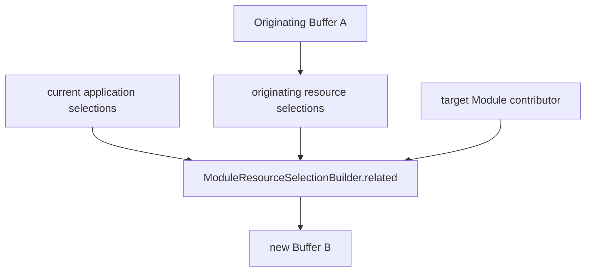

The target Module's Resource contributor decides which originating selections should carry forward.

This is exactly the behavior cross-module navigation needs.

---

# 10. Navigation Resource Lineage

The phrase "shared Resource context" should mean:

> related entries inherit compatible Resource selections from the originating entry.

It should **not** mean:

> every entry references the same mutable `resourceSelections` object.

Example:

```text
Bible Buffer
    Bible Chapters = KJVS
    Paragraphs = Publisher A
    Booknames = Default

push Notes

Notes Buffer
    inherits compatible Bible context
    adds/requires Notes context
    remains its own Resource-selection snapshot
```

The previous Bible Buffer remains unchanged.

This allows Back to restore the exact prior Module interaction.

---

# 11. Buffer Bag Lineage

The same distinction applies to:

```text
Buffer.bag
```

The bag is serializable Module-specific initialization/navigation context.

It should not become one global mutable object shared by all entries.

Instead:

```text
Navigation Service
    owns navigation relationship

each Buffer
    owns explicit Module-specific bag
```

When pushing a target Module, navigation decides which bag to provide.

Examples:

```text
Bible → Notes
    bag may contain note/navigation target

Search → Bible
    bag may contain Bible location

Plan → Bible
    bag may contain reading-plan navigation context
```

The `ModuleBufferFactory` should continue to copy explicit top-level bag context rather than implicitly sharing mutable bag identity.

---

# 12. Navigation Context Becomes the Communication Medium

The application-wide pattern should use a Pane-local Svelte navigation context.

Conceptually:

```ts
interface PaneNavigationContext {
  pushModule(module: Modules, bag?: unknown): void;

  back(): void;

  canGoBack(): boolean;
}
```

Exact names may change during implementation.

The architectural rule is more important:

> **Descendants request navigation through the nearest Pane navigation context instead of directly manipulating Workspace/Pane internals.**

For example:

```text
Bible word component
    ↓
usePaneNavigationContext()
    ↓
pushModule(STRONGS, context)
```

The initiating child does not need:

```text
Pane tree traversal
Buffer replacement logic
ModuleBufferFactory details
component resolver details
Workspace persistence details
```

Those belong behind the navigation boundary.

---

# 13. Why Context Is the Correct Boundary

Settings showed that navigation callbacks quickly become prop-drilling noise.

Without context:

```text
Pane
    ↓ callback
BibleContainer
    ↓ callback
BibleReader
    ↓ callback
Word
    ↓ callback
Strong's link
```

With context:

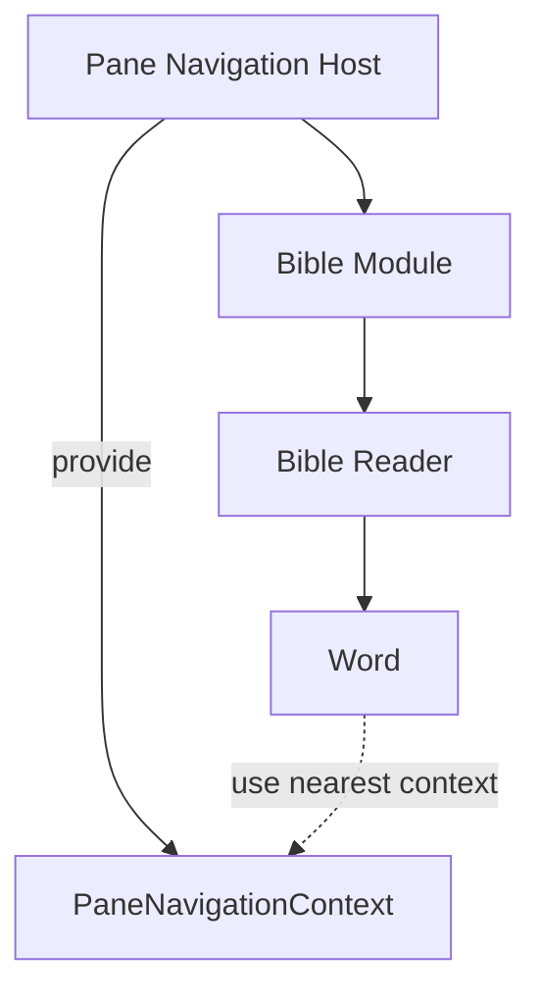

The component that knows a navigation action should request it directly through the context.

It should not require every parent to forward the request.

---

# 14. Navigation Context Is Pane-Local, Not Global

Every rendered Pane should own an independent navigation service/context.

Example:

```text
Pane A
    Bible
    → Notes

Pane B
    Plans
    → Bible
```

The stacks must not interfere.

Conceptually:

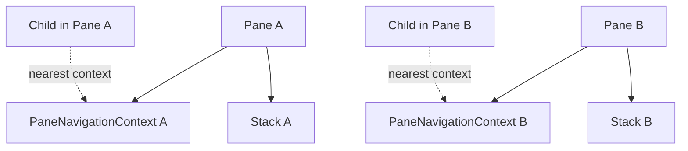

This uses the same Svelte-context property that made multiple Settings modules safe:

```text
same context Symbol
    does not mean
same context value
```

The nearest provider wins.

---

# 15. Settings Keeps Its Own Navigation Context

Settings should remain self-contained.

It currently has:

```text
SettingsNavigationContext
```

That context maps Settings-specific semantic actions such as:

```text
group row
select row
custom row
search result
```

to internal Settings views.

That is different from:

```text
PaneNavigationContext
```

which navigates between application Modules.

Therefore the desired hierarchy may look like:

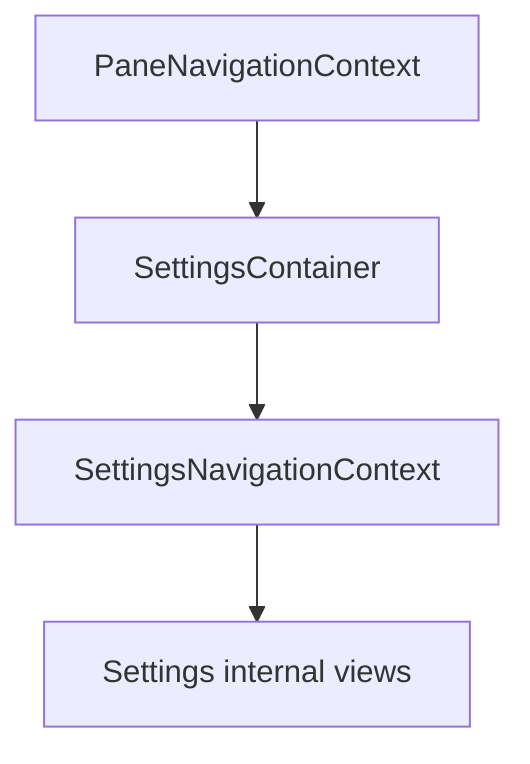

Settings descendants normally use the inner Settings-specific context.

Because Settings does not navigate to unrelated Modules, it does not need to expose cross-module behavior through its internal navigation service.

Other Modules can inherit the Pane navigation context directly when they do not define a more specialized internal navigation layer.

---

# 16. Proposed Pane Navigation Entry

The app-wide stack should have a semantic entry representing one Module interaction.

Conceptually:

```ts
interface ModuleNavigationEntry {
  key: string;
  buffer: Buffer;
  module: Modules;
}
```

The exact implementation may store:

```text
Buffer
```

or:

```text
Buffer key + Buffer registry lookup
```

depending on the final Workspace design.

The important properties are:

```text
entry has stable identity
entry has Module identity
entry has its own Buffer
entry remains mounted while present in stack
```

Do not store a Svelte component constructor in persisted navigation data.

The Module component should continue to be resolved from semantic Module identity.

---

# 17. Runtime-Only View Entries

Internal view navigation may continue to use runtime-only component entries similar to the current Settings stack.

This suggests a future discriminated navigation model may be useful:

```ts
type NavigationEntry = ModuleNavigationEntry | ViewNavigationEntry;
```

Conceptually:

```ts
interface ViewNavigationEntry {
  type: "view";
  component: NavigationComponent;
  obj: Record<string, unknown>;
}

interface ModuleNavigationEntry {
  type: "module";
  buffer: Buffer;
}
```

This is a possible implementation direction, not a requirement that must be introduced immediately.

The important design distinction is:

```text
view push
    stays inside one Buffer

module push
    creates another Buffer
```

---

# 18. Push Module Flow

The desired `pushModule()` behavior is:

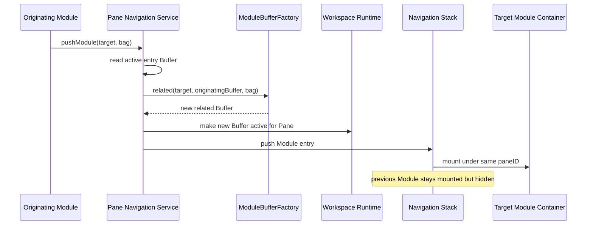

The originating entry is not destroyed.

---

# 19. Pop Module Flow

The desired Back behavior is:

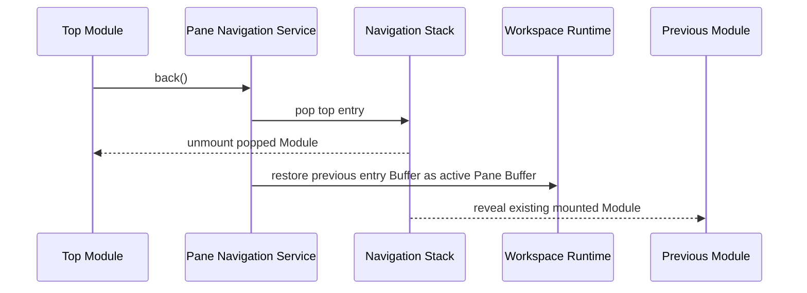

The previous Module should not be recreated.

---

# 20. Why `Pane.buffer` Alone Is Not Enough for a Persistent Module Stack

Today the normal resource-resolution path is:

```text
paneID
    ↓
find Pane
    ↓
Pane.buffer
    ↓
resourceSelections
```

This works when a Pane has one active Module instance.

It becomes unsafe when previous Modules remain mounted.

Example:

```text
Pane A stack

Bible Buffer
    hidden

Notes Buffer
    visible
```

If the hidden Bible component later executes:

```ts
moduleResourceSelectionResolver.require(paneID, BIBLE_CHAPTERS);
```

and the resolver follows only:

```text
Pane.buffer
```

it will inspect the Notes Buffer because Notes is currently active.

That violates the Buffer snapshot rule.

Therefore persistent cross-module navigation requires an update to Module runtime context.

---

# 21. Required Resource-Resolution Update

Each mounted Module container needs stable access to **its own Buffer**, even while another Module is above it.

The target pattern should become conceptually:

```text
Navigation Entry
    owns Buffer

Module Container
    mounts from Navigation Entry
    captures/provides its Buffer context

Module descendants
    resolve Resources from that Buffer context
```

Possible API directions include:

```ts
moduleResourceSelectionResolver.require(buffer, RESOURCE_TYPE);
```

or:

```ts
moduleResourceSelectionResolver.requireByBufferKey(bufferKey, RESOURCE_TYPE);
```

or a module-runtime context:

```ts
const moduleRuntime = useModuleRuntimeContext();

moduleRuntime.resourceSelections.require(RESOURCE_TYPE);
```

The final API can be decided during implementation.

The invariant is:

> **A mounted Module must never start reading another stack entry's Buffer merely because that entry became the Pane's active top Module.**

---

# 22. Module Runtime Context

A reusable Module runtime context is likely the cleanest app-wide direction.

Conceptually:

```ts
interface ModuleRuntimeContext {
  paneID: string;
  bufferKey: string;
  buffer: Buffer;
}
```

Potentially it could expose narrower application-facing capabilities rather than the raw Buffer.

For example:

```ts
interface ModuleRuntimeContext {
  paneID: string;
  bufferKey: string;
  bag: unknown;
  resourceSelections: ModuleResourceSelectionReader;
}
```

The exact interface is deferred.

The architectural goal is:

```text
Pane identity
    stays stable

Module Buffer identity
    stays stable

resource lookup
    follows Module Buffer identity
```

---

# 23. Module Containers Are the Capture Boundary

Module containers are already a natural runtime boundary.

They receive:

```text
paneID
```

when they mount.

For app-wide stacked navigation, the Module container should also receive or resolve the Navigation Entry's Buffer once when the entry is created.

Conceptually:

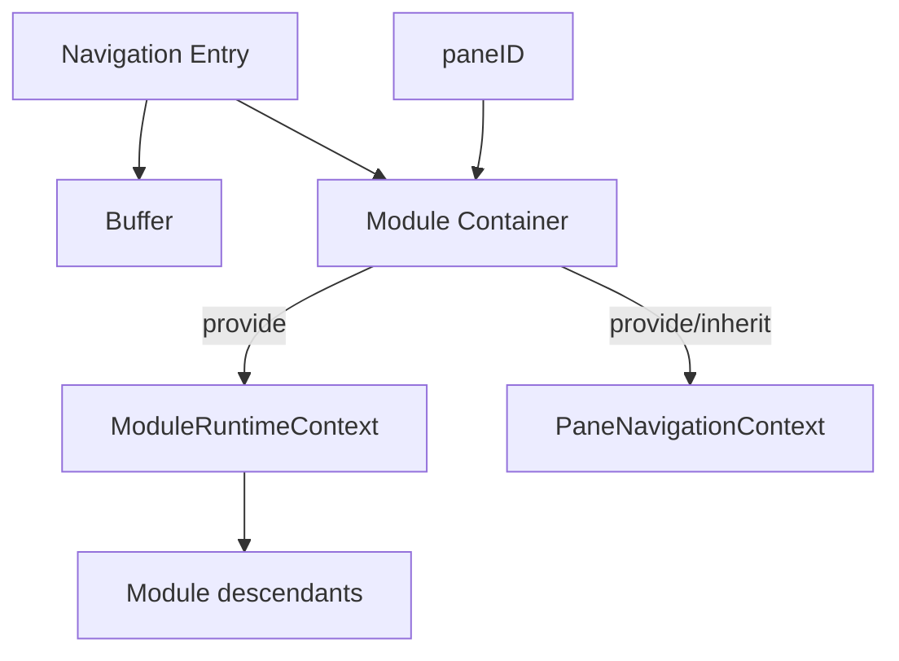

This fits the existing architectural preference:

```text
containers compose runtime dependencies
children consume context/services
```

---

# 24. The Persistent Stack Renderer Should Be Separated from `BufferContainer`

The current shared `NavigationContainer` was designed from the Profile/Settings pattern.

It currently combines two responsibilities:

```text
persistent stack rendering
+
BufferContainer shell
```

That works well for Settings because Settings internal views are not full application Module containers.

App-wide module overlays are different.

A stacked Module may already own its own:

```text
BufferContainer
BufferHeader
BufferBody
```

Wrapping all full Modules inside another `BufferContainer` would create duplicate layout ownership.

Therefore application-wide adoption should extract the persistent stack behavior into a lower-level primitive.

Conceptually:

```text
PersistentNavigationStack
    only:
        render stack
        keep previous entries mounted
        hide inactive entries

NavigationContainer
    internal-view helper:
        BufferContainer
        +
        PersistentNavigationStack

PaneNavigationContainer
    module-level helper:
        PersistentNavigationStack
        +
        full Module containers
```

---

# 25. Proposed Stack Primitive

Conceptually:

```svelte
{#each entries as entry, index (entry.key)}
    <div
        class={index === entries.length - 1
            ? 'h-full w-full'
            : 'hidden h-full w-full'}
    >
        <EntryRenderer {entry} />
    </div>
{/each}
```

The exact markup can evolve.

Its responsibility should stay small:

```text
mount
hide
show
unmount on pop
```

It should not own:

```text
Module resource policy
Buffer creation
Workspace persistence
domain navigation semantics
```

---

# 26. Active/Inactive Module State

Settings navigation is relatively lightweight.

Application Modules may own:

```text
subscriptions
workers
timers
media
search indexes
expensive reactive effects
network activity
```

Keeping a Module mounted means those resources may continue running while hidden.

App-wide navigation should therefore expose active state.

Conceptually:

```ts
interface NavigationEntryState {
  active: boolean;
}
```

or:

```text
NavigationEntryContext
    isActive
```

A hidden Module can then preserve UI state while pausing expensive activity when appropriate.

This complements future ephemeral-worker work:

```text
visible/active Module
    start or retain expensive worker

hidden/inactive Module
    pause/terminate worker when safe

pop/reveal
    restore/recreate worker from preserved Module state
```

The application should not solve this by destroying every hidden Module, because that would defeat persistent navigation.

---

# 27. Visibility Is Not Destruction

The semantic states are:

```text
active
    mounted + visible

inactive
    mounted + hidden

popped
    destroyed/unmounted
```

These states should remain distinct.

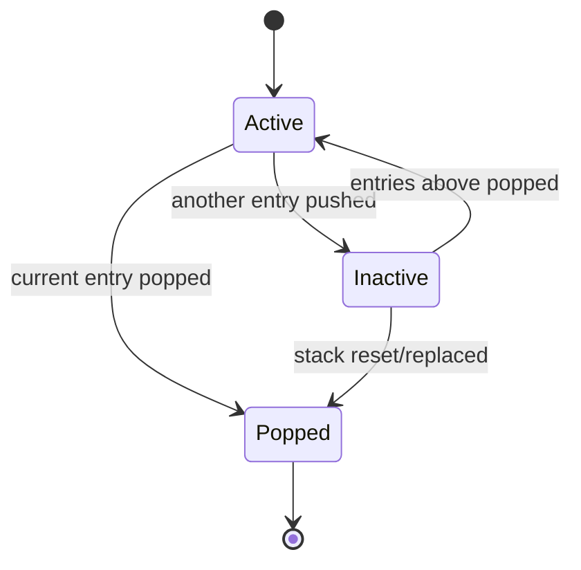

Modules may react differently to:

```text
inactive
```

versus:

```text
destroyed
```

---

# 28. Push Versus Replace

Not every Module transition should become navigation history.

The application should distinguish:

```text
push
replace
split
```

## Push

Use when the destination is contextually related and Back should return to the exact originating interaction.

Examples:

```text
Bible → Notes
Search result → Bible
Plan reading → Bible
Bible word → Strong's
```

Behavior:

```text
same Pane
new related Buffer
origin stays mounted
destination pushed
Back restores origin
```

---

## Replace

Use when the user is changing the Pane's root working Module and the previous Module should not remain navigation history.

Examples may include:

```text
Modules launcher → choose Bible as new root
explicit "open module here"
reset Pane to Modules
```

Behavior:

```text
same Pane
old root interaction discarded/replaced
new Buffer
new navigation root
```

Existing `WorkspaceRuntime.replaceBuffer()` remains conceptually appropriate for this class of operation.

---

## Split

Use when the destination should coexist visibly in another Pane.

Behavior:

```text
new Pane
new paneID
new Buffer
independent Pane navigation stack
```

A split is not navigation push.

---

# 29. Root Module

Every Pane navigation stack has a root Module entry.

Example:

```text
Pane A

stack:
    Bible
```

Push Notes:

```text
Pane A

stack:
    Bible
    Notes
```

Pop:

```text
Pane A

stack:
    Bible
```

Popping the root should not produce:

```text
empty stack
```

Root close behavior should defer to the application's established module-close policy.

For example, a root Module close may transition the Pane to Modules/default state rather than acting like Back.

---

# 30. Back Versus Close

Back and Close should have different semantics.

## Back

Back means:

```text
return to previous navigation entry
```

Therefore:

```text
stack depth > 1
    → pop
```

## Close

Close means:

```text
close/reset the current root Module or hosting surface
```

The exact root-close behavior remains owned by Workspace/module policy.

For a navigated overlay, UI should usually prefer a Back affordance rather than pretending the overlay is a new independent Pane.

This mirrors the Settings distinction between nested Back and root Close.

---

# 31. Module-to-Module Payloads

Navigation payload should remain small and semantic.

Good:

```ts
navigation.pushModule(Modules.BIBLE, {
  bibleLocationRef: "...",
});
```

Good:

```ts
navigation.pushModule(Modules.NOTES, {
  noteID: "...",
});
```

Avoid:

```text
Svelte component constructor
DOM node
service instance
entire Pane object
arbitrary mutable application objects
```

The destination Module should interpret its own bag.

The generic navigation layer should not understand domain-specific fields.

---

# 32. Navigation Requests Should Use Module IDs

Cross-module navigation should request semantic Module identity.

Prefer:

```text
Modules.NOTES
Modules.BIBLE
Modules.STRONGS
```

over:

```text
NotesContainer component constructor
BibleContainer component constructor
StrongsContainer component constructor
```

The runtime should continue to resolve Module components through the existing Module component resolver.

This preserves:

```text
serializable runtime state
framework separation
centralized component resolution
```

---

# 33. Resource Contributor Ownership Remains Unchanged

The navigation architecture must not centralize Module Resource requirements.

When pushing a target Module:

```text
Pane Navigation Service
    asks for related Buffer

ModuleBufferFactory
    asks ModuleResourceSelectionBuilder

ModuleResourceSelectionBuilder
    asks target Module contributor
```

The navigation service should not contain:

```ts
if (module === Modules.BIBLE) {
    ...
}
```

or:

```ts
if (module === Modules.NOTES) {
    ...
}
```

Resource ownership remains with the Module/domain contributor architecture.

---

# 34. Domain Services Remain Navigation-Agnostic

Cross-module navigation is an application/runtime concern.

Domain services should not learn about:

```text
Pane
paneID
Buffer
NavigationService
Navigation stack
Svelte context
```

The dependency direction remains:

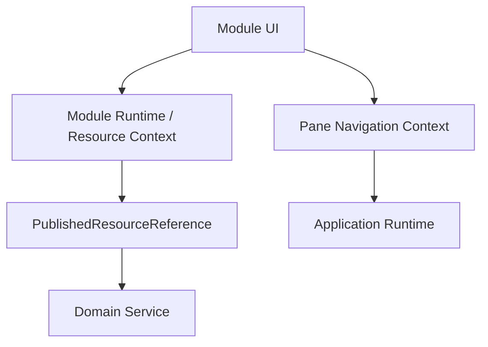

Domain behavior receives domain/application values, not Workspace mechanics.

---

# 35. Navigation Service Responsibilities

The Pane navigation service should own or coordinate:

```text
current stack
push
pop/back
active entry
Module Buffer creation for push
active Pane Buffer synchronization
navigation-entry identity
activation/deactivation
```

It should not own:

```text
domain behavior
Module-specific Resource policy
Module-specific bag interpretation
Svelte page internals
Workspace split geometry
global application selection policy
```

---

# 36. Generic `NavigationService` Versus Pane Navigation Service

The existing `NavigationService` is intentionally generic:

```text
push view
pop view
store views
```

That generic service can remain useful.

A Pane-specific facade can layer application semantics over it.

Conceptually:

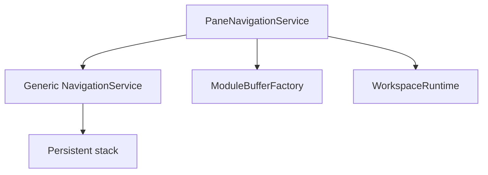

This mirrors the Settings pattern:

```text
SettingsNavigationService
    wraps
NavigationService
```

The Pane facade translates:

```text
"push Notes"
```

into:

```text
create related Notes Buffer
create Module navigation entry
push entry
make it active
```

---

# 37. Navigation Context API Direction

A minimal target API might look conceptually like:

```ts
interface PaneNavigationService {
  pushModule(module: Modules, bag?: unknown): void;

  back(): void;

  canGoBack(): boolean;

  getActiveEntry(): ModuleNavigationEntry;
}
```

Potential later operations:

```text
replaceRoot()
reset()
popToRoot()
popTo(entryKey)
```

These should be added only when real workflows require them.

Do not over-design the API before the first migrations prove what is needed.

---

# 38. Navigation Context and Buffer Bag Are Complementary

These two concepts solve different problems.

## Navigation context

Answers:

```text
How do I move through this Pane's interaction stack?
```

It is runtime/service state.

## Buffer bag

Answers:

```text
What serializable initialization/navigation data belongs to this Module instance?
```

It is Module-instance state.

Do not combine them.

Conceptually:

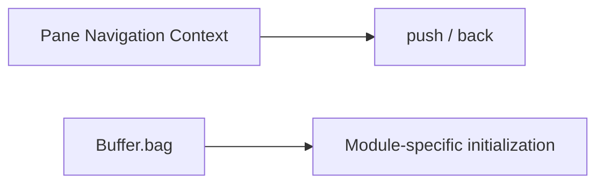

The navigation service may use a bag to create a destination Buffer, but the bag is not the navigation service.

---

# 39. Pane Buffer Compatibility Bridge

The existing Workspace model currently exposes one:

```text
Pane.buffer
```

During migration, the active top navigation entry should remain mirrored there.

Example:

```text
stack:
    Bible Buffer
    Notes Buffer   ← active

Pane.buffer
    = Notes Buffer
```

After Back:

```text
stack:
    Bible Buffer   ← active

Pane.buffer
    = Bible Buffer
```

This preserves compatibility with existing Workspace persistence and runtime code while the navigation stack becomes richer.

However, hidden mounted Modules must use their own captured Buffer context rather than treating `Pane.buffer` as their Buffer.

---

# 40. Persistence Strategy

The first app-wide navigation implementation does not need to persist the full live Svelte navigation stack.

The minimal persistence rule can remain:

```text
Pane.buffer
    represents the active top Module
```

On reload:

```text
restore active Module as navigation root
```

The historical Back stack may initially be treated as ephemeral UI state.

If future requirements demand restoration of full navigation history, persist semantic entries such as:

```text
Buffer data
Module IDs
serializable bags
resourceSelections
```

Never persist:

```text
Svelte component instances
DOM state
service references
context objects
```

---

# 41. Browser History Is a Separate Concern

Pane navigation history is not automatically equivalent to browser URL history.

The application is a single-route PWA.

Therefore:

```text
Pane Navigation Stack
```

should initially remain an application runtime concept.

Browser Back integration can be designed separately if desired.

Do not couple the first app-wide stack implementation to browser History API requirements unless a concrete product behavior requires it.

---

# 42. Example: Bible to Notes

Initial state:

```text
Pane A
    Bible Buffer A
```

The user opens a Note related to the current Bible context.

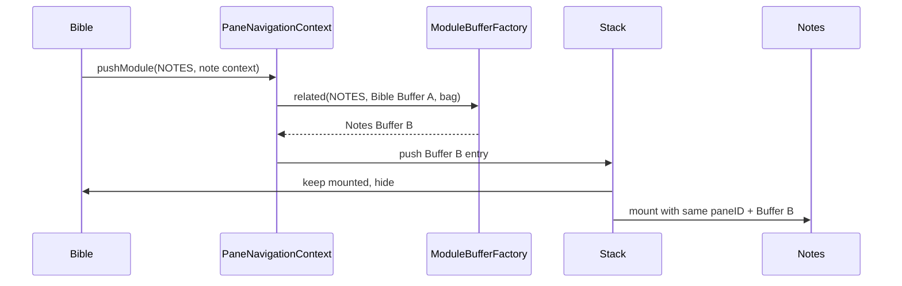

The result:

```text
Pane A
    Bible Buffer A
        mounted hidden

    Notes Buffer B
        mounted visible
```

Back:

```text
pop Notes Buffer B
destroy Notes
reveal existing Bible
restore Bible Buffer A as Pane.buffer
```

The Bible reader returns with its previous:

```text
scroll position
local state
selection
DOM
navigation state
```

without reconstructing those values manually.

---

# 43. Example: Search to Bible

Suppose Search is showing:

```text
"grace"
```

with a scroll position halfway through the results.

The user selects:

```text
Romans 5:2
```

Desired behavior:

```text
Search remains mounted hidden
Bible is pushed
Bible receives location in bag
Bible Buffer inherits compatible Resource context
```

Back should return to:

```text
same Search component
same query
same result list
same scroll position
same browser DOM state
```

No explicit "restore search" code should be needed.

This is exactly the class of behavior Settings already proved.

---

# 44. Example: Reading Plan to Bible

A reading plan may push Bible with explicit context:

```text
plan subscription
reading index
Bible location
```

The Bible Module gets its own related Buffer.

Back returns to the same plan view without reconstructing:

```text
expanded plan section
scroll position
selected reading
local component state
```

The plan's Buffer remains intact underneath.

---

# 45. Multiple Instances of the Same Module

A navigation stack may contain the same Module type more than once.

Example:

```text
Bible Genesis 1
    → Search
        → Bible Romans 8
```

The two Bible entries must not be treated as the same interaction.

They have:

```text
same Module type
same paneID
different Buffer keys
possibly different bags
possibly different Resource selections
different component instances
```

This is another reason Buffer identity must remain per navigation entry.

---

# 46. Multiple Panes

The architecture must continue to support:

```text
Pane A
    Bible → Notes

Pane B
    Bible → Strong's
```

Each Pane has:

```text
its own paneID
its own navigation service
its own stack
its own active entry
its own related Buffer lineage
```

No Pane-level navigation service should be global.

---

# 47. Nested Internal Navigation Within a Module Overlay

A pushed Module may itself use internal navigation.

Example:

```text
Pane stack

Bible
    hidden

Settings
    visible
    internal stack:
        Settings root
        Appearance
        Color Theme
```

This is valid.

The hierarchy becomes:

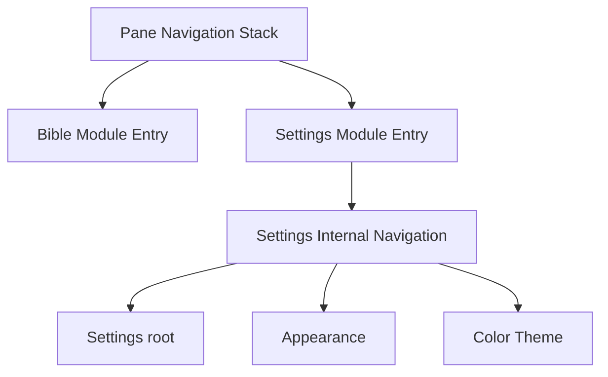

The Pane stack decides:

```text
which Module is active
```

The Settings stack decides:

```text
which Settings view is active
```

These responsibilities remain separate.

---

# 48. Navigation Shell Ownership

App-wide navigation should preserve clear layout ownership.

A full Module container should continue to own its normal:

```text
BufferContainer
BufferHeader
BufferBody
```

or equivalent shared shell.

The Pane-level persistent stack should only decide:

```text
which Module container is visible
```

It should not introduce an additional competing header/body/scroll container.

This is why extracting the stack primitive from the current `NavigationContainer` is important.

---

# 49. Events and Propagation

The existing NavigationContainer stops click propagation at its stack boundary.

App-wide navigation should preserve the principle that interaction inside a Module does not accidentally trigger Pane-level click behavior.

However, event suppression should remain minimal.

Do not globally suppress:

```text
keyboard events
pointer events
focus
```

unless the Pane shell actually needs it.

Hidden entries should use browser-safe hidden/inert behavior so they do not participate in normal focus navigation.

---

# 50. Active Entry Focus

When a new Module is pushed:

```text
focus should move into the new active Module
```

When it is popped:

```text
focus should return reasonably to the revealed Module
```

The first implementation may rely on normal component focus behavior.

If explicit focus restoration becomes necessary, navigation entry identity provides the correct place to associate it.

Do not encode focus restoration into Domain state.

---

# 51. Close-Module Policy Interaction

The existing application has separate close behavior for root Modules.

For example, root close behavior may use the Modules Module as the Pane's default/empty state.

Navigation overlays should not disrupt that policy.

Conceptually:

```text
stack depth > 1
    Back / overlay close
        → pop

stack depth = 1
    root Module close
        → existing Workspace/module-close policy
```

This allows the navigation system and the root close policy to coexist cleanly.

---

# 52. When Not to Push

Do not push a Module merely because two screens are sequential.

Push is appropriate when preserving the originating interaction adds value.

Use replacement when:

```text
the previous interaction is intentionally discarded
the destination becomes the new root working context
the user explicitly chose "open here"
```

Use split when:

```text
the user needs both Modules visible simultaneously
```

Use internal view navigation when:

```text
the destination is only another view of the same Module instance
```

---

# 53. Avoid Centralized Module Special Cases

The navigation architecture should remain open/closed.

Do not build a central switch such as:

```ts
if (from === Modules.BIBLE && to === Modules.NOTES) {
    ...
}

if (from === Modules.BIBLE && to === Modules.STRONGS) {
    ...
}
```

Generic navigation should know:

```text
origin Buffer
target Module
explicit bag
related Buffer creation
stack mechanics
```

Each target Module/domain owns:

```text
Resource requirements
bag interpretation
domain behavior
```

---

# 54. Proposed Implementation Components

The final names can evolve, but the architecture likely needs concepts equivalent to:

```text
PersistentNavigationStack
PaneNavigationService
PaneNavigationContext
ModuleNavigationEntry
ModuleRuntimeContext
PaneNavigationContainer / PaneNavigationHost
```

Existing concepts remain:

```text
NavigationService
ModuleBufferFactory
ModuleResourceSelectionBuilder
ModuleResourceSelectionResolver
WorkspaceRuntime
resolveModuleComponent
```

The goal is composition, not replacement for its own sake.

---

# 55. Minimal First Implementation

A low-risk first implementation should avoid redesigning the whole Workspace.

The smallest meaningful slice is:

```text
1. extract persistent stack rendering from NavigationContainer
2. preserve existing Settings behavior using the extracted primitive
3. create Pane-local navigation context/service
4. allow one related Module push
5. give each stack entry its own Buffer
6. keep Pane.buffer synchronized to top entry
7. provide Module entry Buffer context
8. make Resource selection resolve from that entry Buffer
9. implement Back/pop
10. browser-test DOM and Resource-context preservation
```

Only after that slice is stable should more Module flows migrate.

---

# 56. Recommended Migration Order

A practical migration sequence is:

## Phase 1 — Navigation primitive

Extract:

```text
PersistentNavigationStack
```

from the existing shared NavigationContainer.

Regression-test Settings to prove nothing changes.

---

## Phase 2 — Pane navigation context

Create one navigation service/context per rendered leaf Pane.

Initially it may expose only:

```text
pushModule
back
canGoBack
```

---

## Phase 3 — Module entry Buffer

Represent cross-module entries with their own related Buffer.

Mirror the active entry into:

```text
Pane.buffer
```

for compatibility.

---

## Phase 4 — Module runtime/resource context

Ensure a hidden mounted Module keeps access to its own Buffer/resource snapshot.

This must be complete before general cross-module overlays are considered safe.

---

## Phase 5 — One real cross-module workflow

Migrate one simple, high-value relationship.

Good candidates are interactions where Back-state preservation is visibly useful, such as:

```text
Bible → Notes
Search → Bible
Plan → Bible
```

Do not migrate many flows at once.

---

## Phase 6 — Expand gradually

Move other related navigation flows onto the same context API.

Remove old replacement/pop-up special cases only after their behavior has equivalent test coverage.

---

# 57. Unit Testing Strategy

Unit tests should cover pure navigation/runtime contracts.

Examples:

```text
push adds entry
pop removes only top entry
root cannot be accidentally popped
active entry changes correctly
pushModule creates related Buffer
pushed Buffer has a new key
explicit bag reaches new Buffer
resource contributor receives originating selections
two Pane navigation services remain independent
```

Use service/factory tests for these behaviors.

---

# 58. Browser Testing Strategy

Browser tests are essential for the behavior that motivated this architecture.

## Persistent Module DOM identity

Test:

```text
mount Module A
mutate local/browser state
push Module B
verify A still exists but hidden
pop B
verify revealed A element is the exact same DOM node
```

Use identity assertions:

```ts
expect(restoredElement).toBe(originalElement);
```

---

## Resource-context isolation

This is the most important app-wide regression test.

Test:

```text
Module A mounts with Buffer A resources
push Module B with Buffer B resources
Module A stays mounted
trigger an A-side Resource read while B is active
verify A still reads Buffer A
```

This prevents paneID-only resolution from leaking top-entry Resource context into hidden Modules.

---

## Pane isolation

Mount two Panes.

Push in Pane A.

Verify:

```text
Pane B stack unchanged
Pane B active Module unchanged
Pane B resources unchanged
```

---

## Same Module twice

Push the same Module type twice with different bags/Resources.

Verify:

```text
different Buffer keys
different mounted instances
correct context per entry
```

---

## Back preservation

Verify local state such as:

```text
search query
scroll position
selected tab
expanded section
browser input value
```

survives push/pop naturally.

---

# 59. Lifecycle Testing

Because hidden Modules remain mounted, browser tests should also verify:

```text
active → inactive
inactive → active
pop → unmount
```

If an active-state API is introduced, test that expensive behavior pauses/resumes without losing UI state.

---

# 60. Navigation Architecture Invariants

The application-wide navigation implementation should preserve these invariants.

1. `paneID` identifies where the navigation session is displayed.
2. Cross-module push does not create a new Pane.
3. Every cross-module navigation entry has its own Buffer identity.
4. Related Buffer creation inherits compatible Resource context through Module policy.
5. Previous stack entries remain mounted until popped/reset.
6. Only the active top entry is visible.
7. Back pops one entry and reveals the exact previous mounted Module.
8. Hidden Modules retain their own Buffer/resource snapshot.
9. `Pane.buffer` represents the active top entry during compatibility migration.
10. Navigation communication is Pane-local, not global.
11. Module/domain Resource requirements remain owned by contributors.
12. Module bags remain Module-specific and serializable.
13. Domain services do not depend on Pane/Buffer/navigation mechanics.
14. Internal view navigation does not create unnecessary Buffers.
15. Full Module navigation does create a distinct Buffer.
16. Split navigation creates a distinct Pane rather than a stack entry.
17. Root close policy remains separate from Back/pop.
18. Svelte component constructors are not persisted as navigation state.

---

# 61. Anti-Patterns

Avoid:

## Replacing the Pane Buffer for every related interaction

If the user expects Back to restore the exact previous interaction, destructive replacement loses useful state.

---

## Sharing one Buffer object across multiple Modules

This breaks the established Buffer identity/resource-snapshot model.

---

## Resolving hidden Module resources only from current `Pane.buffer`

The current top Buffer may belong to another Module.

---

## Global NavigationService singleton

Navigation state belongs to the Pane interaction tree.

---

## Navigation callback prop drilling

Use context/service access.

---

## Domain-specific navigation branches in generic runtime

Pass semantic Module ID + bag and let target Module policy own its requirements.

---

## Persisting Svelte components in navigation state

Persist semantic Module/Buffer data only.

---

## Nesting duplicate Buffer layout shells

Separate the persistent-stack primitive from `BufferContainer`.

---

## Destroying previous Modules merely to save memory

Prefer an explicit inactive state and pause expensive work where necessary.

---

# 62. Relationship to the Buffer Bag Pattern

The app-wide navigation model is intentionally similar to the Buffer bag model.

The similarity is:

```text
generic runtime
    carries context it does not interpret

owning Module
    interprets its own context
```

For Buffer bag:

```text
Workspace
    preserves bag

Module
    understands bag
```

For navigation context:

```text
Pane
    provides navigation service

Module
    decides when/where to navigate
```

These two patterns reinforce the same architecture principle:

> **Generic runtime owns transport/lifecycle; Modules own semantic meaning.**

---

# 63. Relationship to Resource Selection

Navigation and Resource selection should compose as:

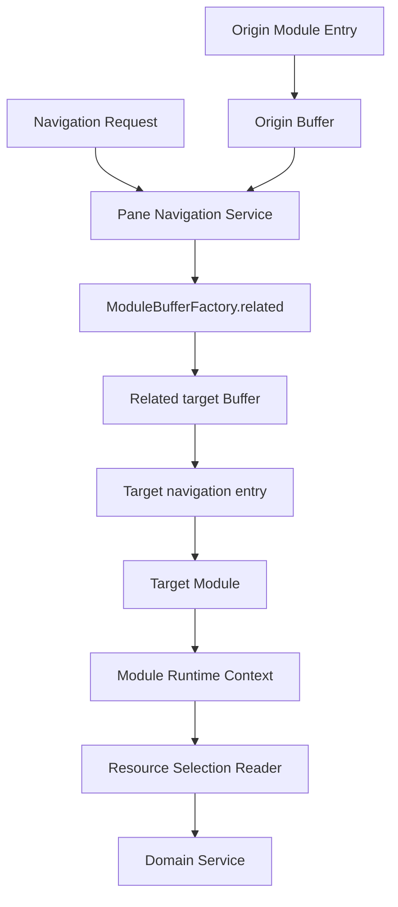

Navigation decides:

```text
which target Module interaction is created
```

Resource policy decides:

```text
which Resources that target interaction uses
```

Neither should absorb the other's responsibility.

---

# 64. Final Target Architecture

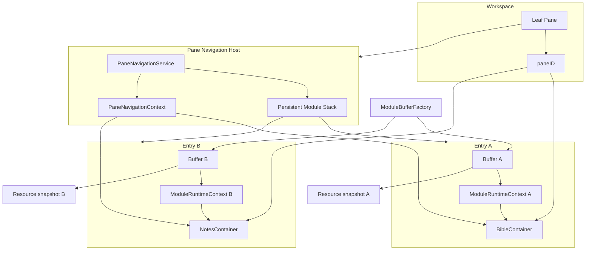

The core application rule becomes:

> **Pane identity is stable. Navigation stacks related interactions inside the Pane. Internal views may share one Module Buffer; cross-module entries get distinct related Buffers. Previous entries remain mounted. Context is the communication medium. Resource lookup follows the entry's Buffer, not merely the Pane's currently active Buffer.**

---

# 65. Summary

The Settings refactor demonstrated that persistent stacked navigation is a strong fit for KJVOnly.bible.

The useful lessons are not Settings-specific:

```text
keep prior interaction mounted
hide instead of destroy
use Back as pop
use context instead of callback threading
preserve local browser/Svelte state naturally
scope navigation to one runtime tree
```

The application-wide extension adds the runtime constraints that Settings did not need to solve:

```text
cross-module entries need distinct Buffer identities
related Resource selections must be preserved
hidden Modules must retain their own Buffer context
Pane.buffer can only represent the active entry
full Module stacks need a shell-free persistent stack primitive
resource-heavy hidden Modules may need active/inactive lifecycle signals
```

With those additions, the existing Pane/Buffer/Resource architecture and the Settings navigation architecture fit together naturally.

The intended result is a consistent user interaction model:

```text
navigate deeper
    → push

go back
    → pop

change the root working Module
    → replace

show work side-by-side
    → split
```

That model should become the default navigation architecture for the application.
