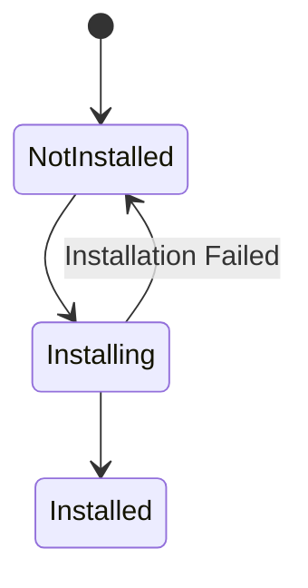

# Resource Installation Implementation

**Status**

Implementation Design — Preserved from Resource Boundary ADRs

---

# Purpose

This document preserves the concrete implementation ideas behind Resource Installation.

ADR 08 — Resource Installation Lifecycle defines the architectural acceptance boundary.

This document describes practical Domain interpretation, candidate construction, dependency coordination, staging, atomic commit, installed-state tracking, and uninstallation.

---

# Processing Model

The current architectural flow is:

```text
Verified Serialized Resource Content
        ↓
Domain Interpretation
        ↓
Candidate Domain Objects
        ↓
Domain Validation
        ↓
Acceptance
        ↓
Accepted Local State
        ↓
Persistence
```

The implementation may use factories, parsers, repositories, stores, or transactions to perform these steps.

Those mechanisms are not mandatory architectural layers.

---

# Domain Object Factory Pattern

The old Resource model used a **Domain Object Factory**.

That remains a useful implementation pattern.

Its practical responsibility was:

* interpret Resource schema,
* validate Domain-specific content,
* construct one or more Domain Objects,
* and preserve Resource origin metadata.

Conceptually:

```text
Resolved Content
    ↓
Domain Object Factory
    ↓
Candidate Domain Objects
```

The name may change without affecting the Resource Boundary.

---

# Factory Selection

Resource Type may be used to select the implementation responsible for interpreting the content.

Conceptually:

```text
Resource Type
    ↓
Interpreter / Factory Registry
    ↓
Domain Interpreter
```

The registry should dispatch to the owning Domain implementation.

It should not make the acceptance decision itself unless that behavior belongs to the Domain.

---

# Candidate Objects

Objects constructed from external Resource content should initially be treated as candidates.

```text
Candidate Domain Object
    ≠
Accepted Domain Object
```

This allows parsing and construction to complete before application state changes.

Candidate objects may retain provenance such as:

```text
publisher public key
Resource Identifier
source event id
```

where appropriate.

The source event ID is publication metadata rather than Domain identity.

---

# Domain Validation

Before acceptance, the owning Domain validates its invariants.

Validation may include:

* required properties,
* schema compatibility,
* identifiers,
* internal references,
* Domain-specific constraints,
* and compatibility requirements.

Resource hash verification has already happened during Resolution.

Domain validation therefore should not duplicate transport-integrity validation.

---

# Installation Coordinator

A useful implementation component is an Installation Coordinator.

Its responsibilities may include:

```text
receive verified content
select Domain interpreter
construct candidates
validate candidates
resolve required dependencies
stage state changes
commit accepted state atomically
record installation provenance/status
```

It should not reimplement Resource Discovery or Resource Resolution.

---

# Installation Sources

The same coordinator may receive verified Resource content from:

* normal Nostr discovery/resolution,
* application-provided Resources,
* Resource Archives,
* synchronization,
* manual installation,
* or direct Resource references.

Origin should not create a separate Domain parsing pipeline.

---

# Dependency Coordination

A Resource may depend on other Resources.

A practical installation workflow may:

```text
Requested Resource
        ↓
Determine Required Dependencies
        ↓
Ensure Dependencies Available
        ↓
Install / Accept Dependencies
        ↓
Continue Requested Installation
```

Discovery determines how missing Resources are found.

Resolution determines how their content is obtained.

Installation coordinates whether required dependencies have reached the state needed for the requested Resource.

---

# Dependency Failure

If a required dependency cannot be installed, the dependent installation should fail before its state becomes visible.

Independent optional Resources should not necessarily make the entire operation fail.

The exact dependency metadata and semantics are Resource/Domain-specific.

---

# Staging

The old implementation direction included staging before committing an update.

That remains valuable.

Conceptually:

```text
Current Accepted State
        ↓
Build Candidate State
        ↓
Validate Entire Candidate Installation
        ↓
Stage
        ↓
Atomic Commit
```

Staging prevents partially updated application state from leaking into normal reads.

---

# Atomic Installation

Installation of one Resource must preserve atomic acceptance.

Either:

```text
all required Domain Objects become accepted
```

or:

```text
previous accepted state remains intact
```

The persistence implementation should provide the transaction or staging mechanism necessary to preserve this invariant.

---

# Installation Lifecycle

The old ADR used:



This is still useful as local implementation state.

Additional implementation states may be introduced when useful, but they should not change the architectural meaning of Installation.

---

# Installation Metadata

The implementation may retain metadata such as:

```text
Published Resource Identity
source publication event id
publisher
Resource Identifier
installed timestamp
installation status
provenance
```

This metadata can support:

* diagnostics,
* synchronization,
* uninstallation,
* provenance display,
* and future updates.

It should not become a competing Resource Identity system.

---

# Installing a Later Publication

A later publication of the same Published Resource may be presented to Installation by synchronization or another update workflow.

The implementation should treat it as a new candidate installation:

```text
Current Accepted State
        +
New Verified Publication
        ↓
Construct Candidate State
        ↓
Validate
        ↓
Accept or Reject
```

Do not automatically overwrite accepted state merely because the Nostr event is newer.

---

# Update Staging

When replacing accepted state, a useful implementation approach is:

```text
Read Existing Installation
        ↓
Build Complete Replacement
        ↓
Validate Replacement
        ↓
Begin Persistence Transaction
        ↓
Write Replacement
        ↓
Update Installation Metadata
        ↓
Commit
```

If any required step fails, rollback to the previous accepted state.

---

# Persistence Boundary

Installation determines acceptance.

Persistence performs durable storage.

The implementation may make these operations part of one transaction when needed for atomicity.

That does not make persistence itself part of Resource identity or Resource Resolution.

---

# Uninstallation

Uninstallation removes local state associated with an installed Resource according to Domain policy.

A practical flow is:

```text
Identify Installed Resource
        ↓
Determine Produced Local State
        ↓
Validate Removal / Dependencies
        ↓
Remove Atomically
        ↓
Update Installation Metadata
```

Uninstallation does not delete or mutate the external Nostr Resource.

---

# Shared or Derived Objects

A Resource may produce multiple Domain Objects.

Care is required if accepted Domain Objects can also be shared by another installed Resource.

The installation implementation should retain sufficient provenance or ownership metadata to avoid deleting unrelated local state during uninstallation.

The exact model is Domain-specific and should be documented when such sharing exists.

---

# Failure Handling

Useful installation failures include:

```text
Unsupported Resource Type
Decode / Decompression Failure
Domain Parse Failure
Domain Validation Failure
Missing Required Dependency
Dependency Installation Failure
Staging Failure
Persistence Failure
Atomic Commit Failure
```

Failure should leave prior accepted state intact.

---

# Decompression and Decoding

The old Resolution ADR placed decompression and Domain decoding after Resolution.

That remains a useful implementation boundary.

For example:

```text
Verified application/json+gzip bytes
        ↓
Decompress
        ↓
Parse JSON
        ↓
Domain Interpreter
```

Resolution verifies the serialized bytes.

Installation-side interpretation decides how those verified bytes become Domain information.

---

# Potential Components

A practical implementation may contain:

```text
ResourceInstallationCoordinator

DomainResourceInterpreterRegistry

DomainObjectFactory / Parser

InstallationDependencyResolver

InstallationStager

InstallationRepository
```

These are implementation names, not architectural owners.

---

# Big Takeaway

The implementation pattern worth preserving from the old ADRs is:

```text
verified content
    ↓
factory / interpreter
    ↓
validated candidates
    ↓
staging
    ↓
atomic acceptance
    ↓
persistence
```

Factories and stores may implement the process.

The architecture only requires that externally obtained information becomes accepted local state deliberately and atomically.
