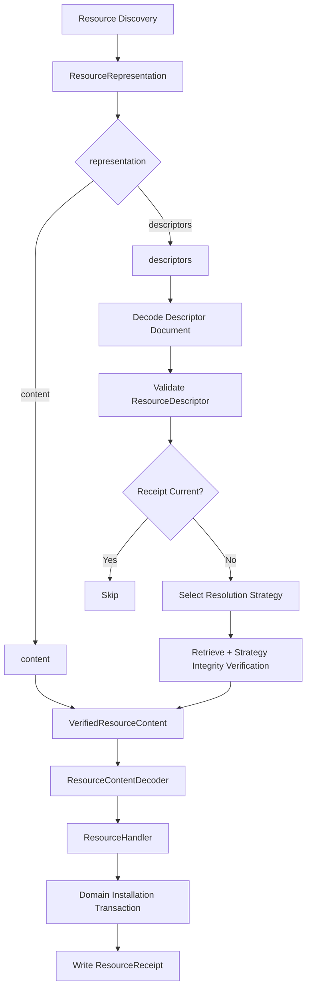

# Resource Descriptor Resolution and Receipt Design

## Status

**Status:** Implementation-ready design  
**Scope:** Resource Resolution, descriptor collections, resolution strategies, Resource receipts, and Resource Service orchestration  
**Application:** KJVOnly.bible  
**Date:** 2026-08-30

---

# 1. Purpose

This document captures the Resource Resolution design work completed during the current implementation cycle.

The purpose of the design is to support externally stored Published Resource content while preserving the existing Resource lifecycle and Domain installation boundaries.

The design introduces:

- a single external-content Resource representation named `descriptors`,
- self-contained Resource descriptors,
- strategy-specific descriptor data,
- pluggable Resource Resolution Strategies,
- best-effort descriptor collection resolution,
- pre-download Resource freshness checks,
- Resource receipts,
- post-install receipt recording,
- explicit resolution results and failures,
- and a clean boundary between Resource-level processing state and Domain Object installation provenance.

The design intentionally avoids:

- creating a separate Resource bundle abstraction,
- creating separate singular and plural descriptor pipelines,
- coupling Resource Resolution to Domain Object identity,
- coupling Domain installation transactions to Resource receipt persistence,
- using legacy synchronization workers as the new Resource installer,
- decompressing or parsing external content inside retrieval strategies,
- and leaking Nostr-specific Event IDs into the generic post-resolution Resource lifecycle.

---

# 2. Architectural Context

The existing inbound Resource lifecycle is:

```text
Published Resource
    ↓
Resource Discovery
    ↓
Resource Resolution
    ↓
VerifiedResourceContent
    ↓
Resource Content Decoding
    ↓
DecodedResourceContent
    ↓
Resource Handler
    ↓
Resource-Type Interpretation
    ↓
Domain Validation
    ↓
Domain Installation
    ↓
Domain Store
```

The architecture preserves the following separations:

```text
Discovery
    determines which Published Resource exists

Resolution
    determines how serialized Resource content is obtained

Content Decoding
    transforms serialization/compression/media encodings

Interpretation
    maps decoded serialized Resource content into Domain candidates

Validation
    determines whether Domain candidates are valid

Installation
    determines whether valid Domain Objects should replace local state

Persistence
    commits Domain Objects and their provenance
```

External content must enter the same lifecycle after Resource Resolution.

No alternate external-content installation path is introduced.

---

# 3. Core Design Principle

The application should have one Resource lifecycle regardless of where serialized Resource content is stored.

Conceptually:

```text
content representation
        \
         \
          → VerifiedResourceContent
         /
        /
descriptors representation
```

After `VerifiedResourceContent` exists, downstream code must not care whether the content originally came from:

- a Nostr event payload,
- Blossom,
- HTTP,
- a local archive,
- IPFS,
- or a future provider.

Representation differences disappear at the Resource Resolution boundary.

---

# 4. Representation Model

## 4.1 Supported Representations

The Resource representation model is simplified to:

```ts
export type ResourceRepresentationType =
    | 'content'
    | 'descriptors';
```

The singular `descriptor` representation is removed.

A single external Resource is represented as a `descriptors` Resource containing an array with one descriptor.

Example:

```json
[
  {
    "metadata": {
      "publisher": "...",
      "resourceId": "kjvonly/bible/chapters/kjvs",
      "category": "kjvonly/bible/chapters",
      "modifiedAt": 100,
      "mediaType": "application/json+gzip"
    },
    "strategy": {
      "type": "blossom",
      "data": {
        "url": "https://...",
        "sha256": "...",
        "size": 123456
      }
    }
  }
]
```

This deliberately eliminates a second singular descriptor path.

The mental model becomes:

```text
content
    = serialized Resource content is already present

descriptors
    = one or more independently resolvable Resources are described
```

---

# 5. Descriptor Collection Mental Model

A `descriptors` Resource is best understood as a Resource describing other Resources.

It may contain:

- one descriptor,
- many descriptors,
- descriptors for different Resource Types,
- multiple descriptors for the same Resource Type,
- Resources published by different publishers,
- bundled Resources,
- individual Resources,
- and eventually Resources that recursively resolve to other descriptor collections.

Example:

```text
Bootstrap Descriptors Resource
    ↓
[
    Bible Chapters Resource,
    Strong's Definitions Resource,
    Search Index Resource,
    Paragraph Metadata Resource
]
```

The collection itself is not interpreted as Domain content.

Its descriptors resolve independently into Resource content that then enters the normal Resource Service pipeline.

---

# 6. Descriptor Is Self-Contained

A descriptor contains the Resource metadata required by the generic Resource lifecycle.

The descriptor does not inherit child Resource identity, publisher, or revision information from the containing Nostr event.

The containing Nostr event only publishes the descriptor document.

The descriptor itself determines:

```text
publisher
resourceId
category
modifiedAt
mediaType
resolution strategy
strategy-specific data
```

This means a single descriptors collection may describe Resources from different publishers and different Resource Types.

Example:

```json
[
  {
    "metadata": {
      "publisher": "publisher-a",
      "resourceId": "kjvonly/bible/chapters/kjvs",
      "category": "kjvonly/bible/chapters",
      "modifiedAt": 100,
      "mediaType": "application/json+gzip"
    },
    "strategy": {
      "type": "blossom",
      "data": {}
    }
  },
  {
    "metadata": {
      "publisher": "publisher-b",
      "resourceId": "kjvonly/strongs/definitions/kjvs",
      "category": "kjvonly/strongs/definitions",
      "modifiedAt": 250,
      "mediaType": "application/json+gzip"
    },
    "strategy": {
      "type": "blossom",
      "data": {}
    }
  }
]
```

No child Resource metadata is copied from the containing event.

---

# 7. Descriptor Model

The canonical generic descriptor model is:

```ts
export interface ResourceDescriptor {
    readonly metadata:
        ResourceDescriptorMetadata;

    readonly strategy:
        ResourceDescriptorStrategy;
}

export interface ResourceDescriptorMetadata {
    readonly publisher: string;
    readonly resourceId: string;
    readonly category: string;
    readonly modifiedAt: number;
    readonly mediaType: string;
}

export interface ResourceDescriptorStrategy {
    readonly type: string;
    readonly data: unknown;
}
```

---

# 8. Descriptor Metadata

## 8.1 `publisher`

`publisher` identifies the publisher of the described Published Resource.

For the current Nostr-based Resource architecture it is a Nostr public key.

It is not inherited from the descriptors event.

## 8.2 `resourceId`

`resourceId` is the Published Resource Identifier.

It is equivalent in meaning to the Resource event `d` tag.

Examples:

```text
kjvonly/bible/chapters/kjvs
kjvonly/bible/chapters/kjvs/1_1
kjvonly/strongs/definitions/kjvs
```

It is independently supplied by each descriptor.

## 8.3 `category`

`category` is equivalent in meaning to the Resource event `t` tag.

For current Resource identity rules:

```text
category
    =
Resource Type extracted from resourceId
```

Example:

```text
resourceId:
    kjvonly/bible/chapters/kjvs

category:
    kjvonly/bible/chapters
```

The descriptor validator must reject descriptors where these values disagree.

The field is intentionally retained rather than silently derived so descriptor publication has the same identity/classification invariant as normal Resource event publication.

## 8.4 `modifiedAt`

`modifiedAt` is the revision time of the described Resource.

It is supplied by the descriptor.

It is not inherited from the containing descriptors event's Nostr `created_at`.

This is necessary because descriptors inside one collection may change independently.

Example:

```text
collection revision:
    event created_at = 1000

descriptor A:
    modifiedAt = 100

descriptor B:
    modifiedAt = 400

descriptor C:
    modifiedAt = 900
```

The containing event revision and child Resource revisions are distinct concepts.

## 8.5 `mediaType`

`mediaType` describes the serialized content returned by the Resource Resolution Strategy.

Examples:

```text
application/json
application/json+gzip
application/octet-stream
audio/mpeg
```

This is distinct from the containing descriptors Resource's media type.

Example:

```text
descriptors event:

m = application/json

descriptor.metadata.mediaType =
    application/json+gzip
```

The outer media type tells the application how to decode the descriptor document.

The descriptor media type tells the application how to decode the resolved Resource content later.

---

# 9. Strategy Envelope

Provider-specific retrieval and integrity metadata does not belong in the generic descriptor model.

The generic model therefore uses:

```ts
export interface ResourceDescriptorStrategy {
    readonly type: string;
    readonly data: unknown;
}
```

Example:

```json
{
  "type": "blossom",
  "data": {
    "url": "https://...",
    "sha256": "...",
    "size": 123456
  }
}
```

The generic Resource layer knows only:

```text
strategy.type
strategy.data
```

It does not know what fields a particular strategy requires.

---

# 10. Why Strategy Data Is Opaque

Provider requirements may differ.

A Blossom strategy may currently use:

```text
url
sha256
size
```

Another strategy may use:

```text
CID
gateway
```

A future strategy may use:

```text
archive key
offset
length
```

Another future provider may use a different integrity scheme entirely.

Therefore the generic Resource descriptor must not hardcode:

```text
url
sha256
size
```

as universal Resource fields.

The selected strategy owns its own data contract.

---

# 11. Resource Resolution Strategy

The generic strategy contract is:

```ts
export interface ResourceResolutionStrategy {
    readonly type: string;

    resolve(
        descriptor:
            ResourceDescriptor
    ): Promise<Uint8Array>;
}
```

The exact return type may evolve later for large-content staging.

For the initial implementation, `Uint8Array` is sufficient.

A strategy owns:

```text
validation of strategy.data
retrieval of serialized bytes
strategy-specific integrity verification
strategy-specific location semantics
```

A strategy does not own:

```text
Resource identity
Resource receipt freshness policy
Resource content decoding
gzip decompression
JSON parsing
Domain interpretation
Domain validation
Domain installation
Domain persistence
```

---

# 12. Blossom Strategy

The initial external-content strategy will be Blossom.

Conceptually:

```ts
interface BlossomStrategyData {
    readonly url: string;
    readonly sha256: string;
    readonly size?: number;
}
```

The exact type is private to the Blossom strategy.

The Blossom flow is:

```text
ResourceDescriptor
        ↓
validate strategy.data
        ↓
fetch raw bytes
        ↓
optional size verification
        ↓
SHA-256 verification
        ↓
return raw serialized bytes
```

The Blossom strategy must not:

```text
decompress gzip
decode JSON
create Domain Objects
write IndexedDB Domain state
```

Those responsibilities already exist downstream.

---

# 13. Existing Content Decoder Reuse

The current Resource content decorator pipeline remains the single content decoding mechanism.

For example:

```text
application/json+gzip
        ↓
Gzip decorator
        ↓
JSON decorator
        ↓
decoded value
```

This same machinery is used after Blossom resolution.

The Blossom strategy returns raw serialized bytes.

Example:

```text
Blossom
    ↓
Uint8Array containing gzip bytes
    ↓
VerifiedResourceContent
    ↓
ResourceContentDecoder
    ↓
GzipResourceContentDecorator
    ↓
JsonResourceContentDecorator
    ↓
DecodedResourceContent
```

No second gzip or JSON implementation should be introduced for descriptor-resolved Resources.

---

# 14. Descriptor Document Decoding

A descriptors event has its own media type.

Example:

```text
representation = descriptors
m = application/json
```

The descriptor document must be decoded using the same generic media-type decoding machinery already used by Resource content decoding.

Conceptually:

```text
ResourceRepresentation.payload
        +
ResourceRepresentation.mediaType
        ↓
media-type decorator chain
        ↓
unknown decoded value
```

The decoded value must then be validated as a descriptor collection.

Normally `application/json` will be used.

The design intentionally does not prevent future descriptor documents from using a supported encoded media type such as:

```text
application/json+gzip+hex
```

---

# 15. Descriptor Collection Shape

The decoded descriptor document must be an array.

Valid:

```json
[]
```

Valid:

```json
[
  { "...": "descriptor" }
]
```

Valid:

```json
[
  { "...": "descriptor A" },
  { "...": "descriptor B" }
]
```

Invalid:

```json
{
  "not": "an array"
}
```

The empty array is valid and resolves nothing.

---

# 16. Generic Descriptor Validation

Generic descriptor validation validates only the generic Resource metadata and strategy envelope.

It does not validate provider-specific strategy data.

The validator starts from `unknown` and produces a trusted `ResourceDescriptor` or a descriptor validation failure.

---

# 17. Generic Validation Rules

## 17.1 Metadata object

Required and must be a non-null object.

## 17.2 Publisher

Required.

Must be a non-empty valid publisher string.

For the current Nostr architecture this should validate as a valid hex public key.

No string coercion is performed.

## 17.3 Resource Identifier

Required.

Must be a non-empty string and pass the existing Resource Identifier parser.

## 17.4 Category

Required.

Must be a non-empty string.

It must match:

```text
parseResourceIdentifier(resourceId).resourceType
```

If it does not match, the descriptor is invalid.

No automatic correction is performed.

## 17.5 Modified Time

Required.

Must satisfy:

```text
number
safe integer
>= 0
```

String timestamps are not coerced.

Invalid:

```json
{
  "modifiedAt": "100"
}
```

Valid:

```json
{
  "modifiedAt": 100
}
```

## 17.6 Media Type

Required and must be a non-empty string.

Generic descriptor validation does not require that the current client has a decoder registered for the media type.

Media-type support is a later Resource Content Decoding concern.

## 17.7 Strategy

Required and must be a non-null object.

## 17.8 Strategy Type

Required and must be a non-empty string.

Generic descriptor validation does not require that the current client supports the strategy.

Unsupported strategy handling belongs to Resource Resolution.

## 17.9 Strategy Data

Required.

Its contents remain opaque to generic descriptor validation.

The selected strategy validates its own data.

---

# 18. Best-Effort Descriptor Validation

A valid descriptors document may contain invalid individual descriptors.

One invalid descriptor must not invalidate unrelated descriptors.

Example:

```text
descriptor 1
    valid
    → continue

descriptor 2
    malformed
    → ResourceResolutionFailure

descriptor 3
    valid
    → continue
```

This preserves best-effort collection semantics.

A failure to decode the descriptor document itself is different.

If the outer document cannot be decoded or is not an array, no individual descriptor entries can be processed.

---

# 19. Strategy Registry

The strategy registry follows the same composition pattern already used for Resource Type handlers.

The descriptor resolver receives:

```ts
strategies:
    readonly ResourceResolutionStrategy[]
```

At construction time it creates:

```ts
Map<
    string,
    ResourceResolutionStrategy
>
```

using `strategy.type` as the key.

Example:

```text
blossom
    → BlossomResourceResolutionStrategy

http
    → HttpResourceResolutionStrategy

ipfs
    → IpfsResourceResolutionStrategy
```

No dedicated registry service is required initially.

---

# 20. Duplicate Strategy Registration

Duplicate strategy types are a composition error.

Example:

```text
blossom
blossom
```

must fail during construction.

This mirrors duplicate ResourceHandler registration behavior and prevents ambiguous runtime dispatch.

---

# 21. Strategy Dispatch

For each valid descriptor:

```text
descriptor.strategy.type
        ↓
strategy map lookup
        ↓
supported?
    ├── no → resolution failure
    └── yes
         ↓
      strategy.resolve(descriptor)
```

The full descriptor is passed to the strategy.

The strategy may inspect both `metadata` and `strategy.data` as needed.

---

# 22. Strategy-Specific Validation

The strategy owns validation of `descriptor.strategy.data`.

For Blossom this may include:

```text
URL format
required hash
hash format
optional size
size constraints
```

This keeps provider-specific validation out of the generic descriptor validator.

---

# 23. Strategy-Specific Integrity

Integrity verification belongs to the strategy when the integrity mechanism is strategy-specific.

For Blossom today:

```text
SHA-256
optional size
```

A future strategy may use a different mechanism.

The generic descriptor resolver requires only that:

> A successful strategy resolution returns content that satisfies that strategy's retrieval and integrity contract.

---

# 24. Resource Receipts

Descriptor collections may contain hundreds or thousands of Resources.

The application should not download every descriptor every time the collection is encountered.

A generic Resource receipt tracks the last successfully processed revision of a Published Resource.

It answers:

> Has this application already successfully processed this Resource revision?

This is intentionally different from Domain Object provenance.

---

# 25. ResourceReceipt Model

```ts
export interface ResourceReceipt {
    readonly id: string;
    readonly publisher: string;
    readonly resourceId: string;
    readonly modifiedAt: number;
}
```

Logical identity:

```text
publisher + resourceId
```

Example physical persistence key:

```ts
export function createResourceReceiptId(
    publisher: string,
    resourceId: string
): string {
    return `${publisher}:${resourceId}`;
}
```

The receipt does not store `eventId`.

---

# 26. Why Event ID Is Not Stored in Receipts

The stable Resource identity is:

```text
publisher + resourceId
```

Freshness is:

```text
modifiedAt
```

A Nostr Event ID:

- changes whenever the containing event is republished,
- may represent a descriptor collection rather than an individual child Resource,
- does not participate in freshness comparison,
- and can quickly become stale as diagnostic metadata.

Therefore it is not stored in `ResourceReceipt`.

---

# 27. ResourceReceiptStore

```ts
export interface ResourceReceiptStore {
    get(
        publisher: string,
        resourceId: string
    ): Promise<
        ResourceReceipt |
        undefined
    >;

    put(
        receipt: ResourceReceipt
    ): Promise<void>;

    delete(
        publisher: string,
        resourceId: string
    ): Promise<void>;
}
```

The persistence adapter owns physical key construction.

---

# 28. ResourceReceiptService

The service owns Resource-level freshness policy.

Conceptually:

```ts
export class ResourceReceiptService {
    constructor(
        private readonly store:
            ResourceReceiptStore
    ) {}

    async needsProcessing(
        publisher: string,
        resourceId: string,
        modifiedAt: number
    ): Promise<boolean> {
        const receipt =
            await this.store.get(
                publisher,
                resourceId
            );

        return (
            receipt === undefined ||
            modifiedAt >
                receipt.modifiedAt
        );
    }

    async markProcessed(
        publisher: string,
        resourceId: string,
        modifiedAt: number
    ): Promise<void> {
        await this.store.put({
            id:
                createResourceReceiptId(
                    publisher,
                    resourceId
                ),
            publisher,
            resourceId,
            modifiedAt
        });
    }

    async remove(
        publisher: string,
        resourceId: string
    ): Promise<void> {
        await this.store.delete(
            publisher,
            resourceId
        );
    }
}
```

---

# 29. Receipt Freshness Rule

The generic rule is:

```text
no receipt
    → process

incoming.modifiedAt
    >
receipt.modifiedAt
    → process

incoming.modifiedAt
    <=
receipt.modifiedAt
    → skip
```

The comparison deliberately uses `<=`.

If local processing has already reached revision `300`, a descriptor advertising revision `200` must not cause a downgrade download.

---

# 30. Receipt Check Boundary

The receipt freshness check happens:

```text
after descriptor decoding/validation
before strategy resolution/download
```

Flow:

```text
valid ResourceDescriptor
        ↓
ResourceReceiptService.needsProcessing(...)
        ↓
needs processing?
    ├── no → skip
    └── yes
         ↓
      strategy lookup
         ↓
      download
```

This avoids unnecessary retrieval.

---

# 31. Why Receipt Check Is a Resource Responsibility

At descriptor resolution time the application knows:

```text
publisher
resourceId
modifiedAt
```

It does not yet know Domain Object identities created downstream.

Therefore the pre-download check cannot depend on:

```text
objectType
objectId
```

The check belongs to the generic Resource lifecycle.

---

# 32. Resource Receipt vs Resource Installation

These are two separate concepts and must remain separate.

## ResourceReceipt

Answers:

> What revision of this Published Resource has the application successfully processed?

Identity:

```text
publisher + resourceId
```

Data:

```text
modifiedAt
```

Used before downloading.

## ResourceInstallation

Answers:

> Which Published Resource revision currently supplied this Domain Object?

Identity:

```text
objectType + objectId
```

Data:

```text
publisher
resourceId
modifiedAt
```

Used during Domain replacement decisions.

---

# 33. Why Both Are Required

Example:

```text
1. chapters/kjvs bundle @ 200 installs all Chapters

2. individual Genesis 1 Resource @ 300
   replaces Genesis 1
```

Domain Object provenance may now be:

```text
Genesis 1
    → individual Resource @ 300

Genesis 2
    → chapters/kjvs @ 200

Exodus 1
    → chapters/kjvs @ 200
```

The Resource receipt may still correctly say:

```text
chapters/kjvs
    last successfully processed = 200
```

If descriptors later advertise:

```text
chapters/kjvs @ 200
```

the application can skip downloading it.

If descriptors advertise:

```text
chapters/kjvs @ 250
```

the application downloads it.

During Domain installation:

```text
Genesis 1
    incoming 250 < existing 300
    → keep existing

Genesis 2
    incoming 250 > existing 200
    → replace
```

Resource freshness and Domain Object replacement remain independent.

---

# 34. Separate Physical Stores

Application IndexedDB should contain:

```text
domain_objects
resource_installations
resource_receipts
```

`resource_receipts` is intentionally separate from `resource_installations`.

Do not overload ResourceInstallation records with Resource-level processing state.

---

# 35. Receipt Write Timing

A receipt is written only after the corresponding Resource has successfully completed the application Resource processing path.

Conceptually:

```text
VerifiedResourceContent
        ↓
decode
        ↓
ResourceHandler
        ↓
Domain interpretation
        ↓
Domain validation
        ↓
Domain installation transaction commits
        ↓
handler returns success
        ↓
ResourceReceiptService.markProcessed(...)
```

A receipt must never be written merely because:

```text
descriptor was seen
bytes were downloaded
hash validation succeeded
content decoded
```

Successful Domain handling is required.

---

# 36. Receipt Safety Invariant

The core invariant is:

> A Resource receipt may lag successfully installed Domain state, but it must never get ahead of successfully installed Domain state.

This determines receipt failure semantics.

---

# 37. Receipt Write Failure

Suppose:

```text
download succeeds
decode succeeds
Domain handler succeeds
Domain transaction commits
receipt write fails
```

The Resource remains successfully handled.

The receipt failure is diagnostic/bookkeeping failure.

The next encounter may download the same Resource again.

That redundant work is acceptable because normal Domain replacement policy prevents stale state from incorrectly replacing newer Domain state.

This is intentionally preferred over coupling receipt persistence into every Domain installation transaction.

---

# 38. Why Receipts Are Not Written Inside Domain Transactions

Current Domain installers already own atomic transactions containing:

```text
Domain Object state
+
ResourceInstallation provenance
```

Adding ResourceReceipt writes to those transactions would:

- couple generic Resource bookkeeping to every Domain installer,
- force every Domain installation transaction to know about receipts,
- weaken architectural boundaries,
- and make future Resource-level changes require Domain transaction changes.

Instead:

```text
Domain transaction commits
        ↓
ResourceService receives success
        ↓
Resource receipt write
```

The only failure mode introduced is potential redundant future retrieval.

That is a safe failure mode.

---

# 39. Receipt Write Matrix

| Outcome | Write Receipt? |
| --- | --- |
| Descriptor already current | No; existing receipt already covers it |
| Descriptor validation failure | No |
| Unsupported strategy | No |
| Strategy data invalid | No |
| Retrieval failure | No |
| Integrity failure | No |
| Unsupported Resource Handler | No |
| Resource content decode failure | No |
| Resource handler/install failure | No |
| Resource successfully handled | Yes |
| Resource handled but receipt write fails | Remain handled; log diagnostic |

---

# 40. Content Representation and Receipts

Receipts are a generic Resource lifecycle optimization, not a Blossom cache.

Therefore a successfully handled `content` Resource may also create/update a receipt.

Example:

```text
today:
    content representation
    resource modifiedAt = 100
    → successfully handled
    → receipt = 100

later:
    descriptors collection
    same Resource modifiedAt = 100
    → receipt says current
    → external download skipped
```

This behavior is useful and preserves representation independence.

---

# 41. ResourceResolutionResult

Resource Resolution must support best-effort partial collection results.

The resolver contract should return:

```ts
export interface ResourceResolutionResult {
    readonly contents:
        readonly VerifiedResourceContent[];

    readonly failures:
        readonly ResourceResolutionFailure[];
}
```

No explicit skipped list is required.

---

# 42. Skip Semantics

A descriptor skipped because its receipt is current contributes:

```text
no VerifiedResourceContent
no ResourceResolutionFailure
```

It is an internal successful no-op.

Example:

```text
100 descriptors

97 current
2 resolved
1 failed
```

Resolution result:

```text
contents:
    2

failures:
    1
```

The `97 skipped` count may be emitted through diagnostics/logging, but it is not part of the core lifecycle contract.

---

# 43. ResourceResolutionFailure

The generic failure should preserve enough information to identify the Resource when possible.

Conceptually:

```ts
export interface ResourceResolutionFailure {
    readonly publisher?: string;
    readonly resourceId?: string;
    readonly resourceType?: string;

    readonly error: unknown;
}
```

Fields are optional because a malformed descriptor may fail before complete Resource identity can be trusted.

After generic descriptor validation succeeds, the Resource identity fields should be available.

---

# 44. Failure Detail Strategy

The generic result does not require a large failure taxonomy initially.

Useful diagnostic detail may be preserved in wrapped error objects.

Examples:

```text
Invalid Resource descriptor

Unsupported Resource resolution strategy:
    ipfs

Invalid Blossom strategy data

Blossom Resource not found

Blossom retrieval failed

Blossom content size mismatch

Blossom content integrity check failed
```

Developer logs should preserve meaningful causes.

Normal application behavior generally only needs to know that the Resource failed.

---

# 45. Descriptor Failure Boundary

Best-effort behavior is owned by the descriptor collection resolver.

Conceptually:

```text
for each descriptor:
    try
        validate
        receipt check
        strategy dispatch
        strategy resolution
        create VerifiedResourceContent

    catch
        append ResourceResolutionFailure
        continue
```

One descriptor failure must not terminate unrelated descriptors.

---

# 46. Collection-Level Failure

If the descriptor document itself cannot be decoded, or does not decode to an array:

```text
contents = []
failures = [
    failure representing the containing descriptors Resource
]
```

The outer Resource identity is appropriate here because the descriptors Resource itself is malformed.

This does not mean child Resource metadata is inherited from the containing event.

---

# 47. Individual Descriptor Failure

If the document is a valid array but one entry is invalid:

```text
descriptor A
    valid
    → continue

descriptor B
    invalid
    → failure

descriptor C
    valid
    → continue
```

Only B fails.

---

# 48. Resource Representation Resolver Contract

Because only `content` and `descriptors` remain, representation resolvers may use a supports-based interface:

```ts
export interface ResourceRepresentationResolver {
    supports(
        representation:
            ResourceRepresentationType
    ): boolean;

    resolve(
        resource:
            ResourceRepresentation
    ): Promise<ResourceResolutionResult>;
}
```

`ContentRepresentationResolver` supports:

```text
content
```

The descriptor resolver supports:

```text
descriptors
```

No singular/plural descriptor duplication exists.

---

# 49. Content Resolution Result

A normal content representation resolves to:

```text
contents:
    [VerifiedResourceContent]

failures:
    []
```

The content path remains straightforward.

---

# 50. Descriptor Resolution Algorithm

Conceptually:

```text
ResourceRepresentation
representation = descriptors
        ↓
decode descriptor document
using outer mediaType
        ↓
must be array
        ↓
for each raw entry
        ↓
generic descriptor validation
        ↓
ResourceDescriptor
        ↓
ResourceReceiptService.needsProcessing(...)
        ↓
current?
    ├── yes
    │    ↓
    │  skip
    │
    └── no
         ↓
      strategy lookup
         ↓
      strategy supported?
         ├── no → failure
         └── yes
              ↓
           strategy.resolve(descriptor)
              ↓
           verified raw serialized content
              ↓
           VerifiedResourceContent
```

All successes and failures are accumulated.

---

# 51. VerifiedResourceContent

The generic post-resolution model should not contain Nostr Event ID.

Conceptually:

```ts
export interface VerifiedResourceContent {
    readonly publisher: string;
    readonly resourceId: string;
    readonly resourceType: string;
    readonly modifiedAt: number;
    readonly mediaType: string;
    readonly content:
        SerializedResourceContent;
}
```

For descriptor-resolved content:

```text
publisher
    ← descriptor.metadata.publisher

resourceId
    ← descriptor.metadata.resourceId

resourceType
    ← descriptor.metadata.category

modifiedAt
    ← descriptor.metadata.modifiedAt

mediaType
    ← descriptor.metadata.mediaType

content
    ← strategy result
```

Nothing is inherited from the containing descriptors event.

---

# 52. DecodedResourceContent

The post-decoding model should likewise omit Event ID:

```ts
export interface DecodedResourceContent {
    readonly publisher: string;
    readonly resourceId: string;
    readonly resourceType: string;
    readonly modifiedAt: number;
    readonly mediaType: string;
    readonly value: unknown;
}
```

The post-resolution Resource lifecycle is provider- and transport-independent.

---

# 53. Event ID Boundary

Nostr Event ID remains valid metadata at the Resource Discovery / Resource Representation boundary.

A discovered Nostr representation may still contain:

```text
eventId
```

because it describes the event that was actually discovered.

After Resource Resolution, Event ID is removed from the generic lifecycle.

Reason:

```text
Nostr Event ID
    is transport/publication provenance

publisher + resourceId
    is Published Resource identity

modifiedAt
    is Resource revision/freshness
```

Descriptor-resolved Resources do not necessarily have their own Nostr events.

Therefore a generic post-resolution Event ID would either be meaningless or incorrectly inherited from the collection event.

---

# 54. ResourceInstallation Without Event ID

The Domain Object provenance model becomes:

```ts
export interface ResourceInstallation {
    readonly id: string;

    readonly objectType: string;
    readonly objectId: string;

    readonly publisher: string;
    readonly resourceId: string;
    readonly modifiedAt: number;
}
```

This still answers:

> Which Published Resource revision currently supplied this Domain Object?

The required information is:

```text
publisher + resourceId
    Published Resource identity

modifiedAt
    Resource revision
```

Event ID is not needed by replacement policy.

---

# 55. ResourceService Role

ResourceService remains the lifecycle coordinator after Resolution.

Conceptually:

```text
Resource Discovery
        ↓
Resource Resolver
        ↓
ResourceResolutionResult
        ↓
ResourceService
```

ResourceService consumes both:

```text
resolution.contents
resolution.failures
```

---

# 56. ResourceService Failure Folding

Resolution failures should become ordinary failed Resource install outcomes.

Conceptually:

```text
resolution.failures
        ↓
ResourceInstallOutcome {
    status: failed
}
```

This keeps the application-facing install result unified.

Callers do not need separate result systems for:

```text
resolution failure
decode failure
handler failure
```

All are Resource processing failures at the outward Resource Service boundary.

---

# 57. ResourceService Content Processing

For every resolved content:

```text
VerifiedResourceContent
        ↓
find ResourceHandler by resourceType
        ↓
handler exists?
    ├── no
    │    ↓
    │ unsupported
    │ no receipt
    │
    └── yes
         ↓
      decode
         ↓
      decode failure?
         → failed
         → no receipt
         ↓
      handler.handle(...)
         ↓
      handler failure?
         → failed
         → no receipt
         ↓
      handled
         ↓
      attempt receipt write
```

---

# 58. Receipt Write Must Be Outside Processing Failure Catch

Receipt persistence should not share the same failure catch as:

```text
ResourceContentDecoder.decode(...)
ResourceHandler.handle(...)
```

Otherwise receipt persistence failure could incorrectly change `handled` into `failed`.

Recommended conceptual structure:

```text
outcome =
    process(content)

resources.push(outcome)

if outcome.status === handled:
    try:
        mark receipt
    catch:
        diagnostic only
```

---

# 59. Partial Outcome Example

Given:

```text
Descriptor A
    receipt current
    → skipped

Descriptor B
    resolves
    → handler succeeds

Descriptor C
    retrieval fails

Descriptor D
    resolves
    → handler fails
```

Result:

```text
A
    invisible no-op

B
    handled
    receipt written

C
    failed
    no receipt

D
    failed
    no receipt
```

The descriptor collection continues processing through all independent entries.

---

# 60. ResourceInstallResult Semantics

The existing Resource Service result remains the application-facing result.

Conceptually:

```text
requested:
    root PublishedResourceReference

found:
    whether root Resource was discovered

resources:
    per-child Resource outcomes
```

For a discovered descriptors Resource whose child Blossom Resource returns 404:

```text
found = true
```

because the root descriptors Resource was discovered.

The child outcome is `failed`.

Do not collapse this to `found = false`.

---

# 61. Persistence Layout

The current application database contains:

```text
domain_objects
resource_installations
```

The design adds:

```text
resource_receipts
```

Final layout:

```text
domain_objects
resource_installations
resource_receipts
```

---

# 62. IndexedDB Version Migration

The current application database is version 1.

Adding `resource_receipts` requires version 2.

The migration must be incremental.

Do not simply increase the version while unconditionally recreating existing stores.

Recommended structure:

```ts
upgrade(
    db,
    oldVersion
) {
    if (oldVersion < 1) {
        // create domain_objects
        // create resource_installations
    }

    if (oldVersion < 2) {
        // create resource_receipts
    }
}
```

This supports:

```text
new database
    0 → 2

existing database
    1 → 2
```

without trying to recreate stores that already exist.

---

# 63. Domain Transactions Remain Unchanged

Current Chapter and Strong's installation transactions atomically write:

```text
domain_objects
resource_installations
```

They should not include:

```text
resource_receipts
```

The Domain transaction remains responsible for:

```text
Domain Object state
+
Domain Object Resource provenance
```

Receipt persistence remains a Resource Service responsibility after handler success.

---

# 64. Resource Deletion and Receipt Invalidation

When Resource lifecycle operations deliberately remove a Resource in a way that should allow it to be installed again, the corresponding receipt must also be removed.

Otherwise:

```text
receipt says revision 200 processed
        ↓
Domain data intentionally removed
        ↓
descriptor still advertises revision 200
        ↓
receipt check skips download forever
```

Therefore Resource uninstall/delete semantics must invalidate:

```text
ResourceReceipt(
    publisher,
    resourceId
)
```

This can use `publisher + resourceId` already preserved in ResourceInstallation provenance.

Detailed uninstall design is deferred until required.

---

# 65. Large Content Concern

The initial strategy contract returns:

```ts
Promise<Uint8Array>
```

This is acceptable for the first implementation.

However, Resources may eventually contain:

```text
large audio files
sermons
video
archives
large indexes
other binary content
```

Holding many large Resource payloads in memory simultaneously may be unsafe.

The implementation should avoid unnecessarily embedding `Uint8Array` assumptions throughout descriptor orchestration.

The strategy boundary provides the future seam for alternatives such as:

```text
staged temporary object-store content
Blob references
stream-backed content
temporary file handles
content handles
```

Conceptually, a future strategy result may become:

```text
ResolvedSerializedContent
    ├── in-memory bytes
    └── staged-content reference
```

This optimization is deliberately deferred.

No temporary object store or streaming design is required for the initial descriptor implementation.

---

# 66. Memory-Conscious Sequential Processing

Until a staged-content model is introduced, descriptor resolution and Resource Service processing should remain sequential unless a concrete performance requirement proves parallelism necessary.

Sequential processing reduces simultaneous memory pressure.

For example:

```text
descriptor A
    download
    install
    release content

descriptor B
    download
    install
    release content
```

is preferable to eagerly downloading hundreds of large descriptors concurrently.

The current design should not introduce broad parallel resolution.

---

# 67. Legacy Sync Path

The previous SyncService and worker architecture proved that the application can:

```text
query a relay
obtain external locations
download gzip content
parse it
persist Domain data
```

That path is useful only as an operational proof.

It must not become the new implementation because it:

- performs Domain-specific writes directly,
- decompresses before the new Resource decoding boundary,
- bypasses ResourceHandlers,
- bypasses Domain validation/installers,
- and uses old manifest/event conventions.

The new design reuses the retrieval idea only.

---

# 68. New External Content Flow

The new flow is:

```text
kind 37770 Resource
representation = descriptors
        ↓
decode descriptor collection
        ↓
generic descriptor validation
        ↓
receipt freshness check
        ↓
strategy selection
        ↓
raw content retrieval
        ↓
strategy integrity validation
        ↓
VerifiedResourceContent
        ↓
existing ResourceContentDecoder
        ↓
existing ResourceHandler
        ↓
existing Domain installer
        ↓
existing Domain Store
        ↓
Resource receipt
```

---

# 69. Application Bootstrap Use Case

The initial major consumer of descriptor collections will likely be application bootstrap.

The application may know one Published Resource reference such as:

```text
kjvonly/resources/bundles/default
```

or a future renamed collection identity.

That Resource can publish:

```text
representation = descriptors
```

containing default Resources such as:

```text
Bible Chapters KJVS
Strong's Definitions KJVS
Book Names
Paragraph Metadata
Search Indexes
```

The exact bootstrap Resource Identifier naming remains separate from the descriptor architecture.

---

# 70. Bootstrap Is Application Policy

Generic Resource infrastructure does not know:

```text
which descriptor collection is bootstrap
which Bible version should be selected
which Resource should be globally selected
```

The Application owns bootstrap orchestration.

Conceptually:

```text
Application.start()
        ↓
ResourceService.install(
    bootstrapReference
)
```

Descriptor resolution remains generic.

---

# 71. Resource Selection Is Separate

Descriptor collections answer:

> Which Resources should be resolved/installed?

Resource Selection answers:

> Which Resource should a Buffer or application context currently use for a Resource Type?

These are separate concerns.

A descriptor collection may legitimately contain multiple Resources of the same Resource Type.

The descriptor system must not automatically redefine global Resource Selection.

---

# 72. Publishing / Seed Direction

The old Blossom seed scripts predate the new Resource architecture.

Instead of incrementally modifying old Bash manifest publishing, the preferred direction is a small Node-based seed/publishing tool.

The tool should eventually support publishing:

```text
content
descriptors
```

for kind `37770` Resources.

It should support selective test publishing so development does not require re-uploading the complete dataset.

---

# 73. Seed Tool Responsibilities

For descriptor-backed Resources the new seed tool should be able to:

```text
select local Resource payload
        ↓
serialize/compress as needed
        ↓
upload to Blossom
        ↓
obtain/construct strategy data
        ↓
construct ResourceDescriptor
        ↓
publish descriptors Resource event
```

The descriptor should contain:

```text
metadata
    publisher
    resourceId
    category
    modifiedAt
    mediaType

strategy
    type
    data
```

---

# 74. Descriptor Publication Example

Conceptual example:

```json
[
  {
    "metadata": {
      "publisher": "<pubkey>",
      "resourceId": "kjvonly/bible/chapters/kjvs",
      "category": "kjvonly/bible/chapters",
      "modifiedAt": 100,
      "mediaType": "application/json+gzip"
    },
    "strategy": {
      "type": "blossom",
      "data": {
        "url": "https://blossom.example/...",
        "sha256": "...",
        "size": 123456
      }
    }
  },
  {
    "metadata": {
      "publisher": "<pubkey>",
      "resourceId": "kjvonly/strongs/definitions/kjvs",
      "category": "kjvonly/strongs/definitions",
      "modifiedAt": 200,
      "mediaType": "application/json+gzip"
    },
    "strategy": {
      "type": "blossom",
      "data": {
        "url": "https://blossom.example/...",
        "sha256": "...",
        "size": 234567
      }
    }
  }
]
```

---

# 75. Implementation Sequence

## Step 1 — Generic model cleanup

- remove singular `'descriptor'` from `ResourceRepresentationType`,
- retain only `content | descriptors`,
- remove `eventId` from `VerifiedResourceContent`,
- remove `eventId` from `DecodedResourceContent`,
- remove `eventId` from `ResourceInstallation`,
- update affected tests and constructors.

## Step 2 — IndexedDB migration cleanup

- update application DB version from 1 to 2,
- make migration incremental using `oldVersion`,
- preserve existing `domain_objects`,
- preserve existing `resource_installations`.

## Step 3 — Resource receipt persistence

Add:

```text
resource_receipts
```

with:

- ResourceReceipt model,
- ResourceReceiptStore contract,
- IndexedDB ResourceReceiptStore implementation,
- receipt ID helper.

## Step 4 — ResourceReceiptService

Implement:

```text
needsProcessing
markProcessed
remove
```

with freshness rule:

```text
incoming.modifiedAt > existing.modifiedAt
```

and skip for equal/older revisions.

## Step 5 — Receipt tests

Prove:

```text
missing receipt
    → needs processing

newer descriptor
    → needs processing

equal descriptor
    → skip

older descriptor
    → skip

markProcessed
    → persisted

remove
    → receipt deleted
```

## Step 6 — Descriptor models

Add:

```text
ResourceDescriptor
ResourceDescriptorMetadata
ResourceDescriptorStrategy
```

## Step 7 — Descriptor validation

Prove:

```text
valid descriptor accepted
metadata required
publisher required
resourceId required
category required
modifiedAt required
mediaType required
strategy required
strategy.type required
strategy.data required
invalid resourceId rejected
category/resourceType mismatch rejected
invalid modifiedAt rejected
```

## Step 8 — Descriptor document decoding

Implement decoding of the outer descriptors Resource using the existing media-type decorator infrastructure.

Prove:

```text
valid array accepted
empty array accepted
non-array rejected
encoded descriptor document uses existing decorators
```

## Step 9 — ResourceResolutionResult

Add:

```text
contents
failures
```

and update:

```text
ResourceRepresentationResolver
ResourceResolver
ContentRepresentationResolver
```

## Step 10 — Resolution failures

Add the minimal generic failure model.

Preserve:

```text
publisher?
resourceId?
resourceType?
error
```

Avoid premature large failure taxonomies.

## Step 11 — Strategy contract and dispatch

Add:

```text
ResourceResolutionStrategy
```

and strategy map construction.

Prove:

```text
strategy dispatch by type
duplicate type rejected
unsupported strategy becomes failure
```

## Step 12 — Blossom strategy

Implement:

```text
Blossom strategy data validation
raw fetch
optional size verification
SHA-256 verification
Uint8Array return
```

Do not decompress or parse Resource content.

## Step 13 — Descriptors resolver

Implement the single descriptors flow:

```text
decode
validate each descriptor
receipt check
strategy dispatch
resolve
collect success/failure
continue best-effort
```

## Step 14 — ResourceService integration

Update ResourceService to:

```text
consume ResourceResolutionResult
fold resolution failures into ResourceInstallOutcome[]
process successful contents
write receipts after handled outcome
treat receipt write failure as diagnostic only
```

## Step 15 — Production composition

Wire:

```text
IndexedDBResourceReceiptStore
ResourceReceiptService
Blossom strategy
Descriptors representation resolver
Content representation resolver
ResourceResolver
ResourceService
```

in the Composition Root.

## Step 16 — Node seed tool

Create a modern selective Resource publisher capable of:

```text
Blossom upload
descriptor generation
kind 37770 descriptors publication
selective test Resources
```

## Step 17 — End-to-end test

Prove:

```text
empty IndexedDB
        ↓
discover descriptors Resource
        ↓
resolve Chapter descriptor
        ↓
resolve Strong's descriptor
        ↓
install both Resource Types
        ↓
write ResourceInstallations
        ↓
write ResourceReceipts
```

Then run again:

```text
same descriptors
        ↓
receipt checks
        ↓
no Blossom downloads
```

---

# 76. Required Tests

## Generic descriptor validation

```text
valid descriptor
missing metadata
missing publisher
invalid publisher
missing resourceId
invalid resourceId
missing category
category mismatch
missing modifiedAt
negative modifiedAt
non-integer modifiedAt
missing mediaType
missing strategy
missing strategy.type
missing strategy.data
```

## Descriptor document

```text
empty descriptors array
single descriptor
multiple descriptors
non-array document
invalid JSON
valid descriptor + invalid descriptor + valid descriptor
```

## Receipts

```text
missing receipt
newer revision
equal revision
older revision
mark receipt
remove receipt
```

## Strategy dispatch

```text
supported strategy
unsupported strategy
duplicate strategy registration
strategy data validation failure
retrieval failure
integrity failure
```

## Best-effort collection resolution

```text
all descriptors succeed

some descriptors skipped

one descriptor fails
later descriptors continue

multiple descriptors fail
successful descriptors still returned

invalid collection document
no entries processed
```

## ResourceService receipt timing

```text
handled
    → receipt written

unsupported
    → no receipt

decode failure
    → no receipt

handler failure
    → no receipt

resolution failure
    → no receipt

receipt write failure after handler success
    → outcome remains handled
```

## Representation independence

Prove:

```text
content Resource @ modifiedAt 100
    → handled
    → receipt 100

descriptors Resource later describes same Resource @ 100
    → skipped before external retrieval
```

---

# 77. Deferred Design

## Large content staging

Potential future mechanisms:

```text
Blob
stream
temporary IndexedDB object store
file-backed content handle
staged serialized content reference
```

The strategy boundary should remain capable of evolving toward this.

## Recursive descriptor collections

Architecture may eventually support descriptor-resolved Resources that themselves resolve to descriptors collections.

Future protections would include:

```text
visited identities
maximum recursion depth
maximum descriptor count
maximum aggregate content size
timeouts
cancellation
```

Do not implement this until required by the current bootstrap path.

## Retry policy

Persistent retry, exponential backoff, and background retry queues are not Resource Resolution responsibilities.

They belong to higher workflows such as:

```text
bootstrap
background synchronization
Auto Sync
manual installation
```

## Resource uninstall

Detailed uninstall semantics remain deferred.

Known invariant:

```text
if Resource state is deliberately removed
and should be reinstallable,
invalidate the ResourceReceipt
```

## Strategy-specific extensibility

Do not invent generic provider metadata beyond:

```text
strategy.type
strategy.data
```

Add concrete strategy types only when required.

---

# 78. ADR Impact

The current architecture documentation previously described three Resource representations:

```text
content
descriptor
descriptors
```

This implementation design deliberately simplifies that model to:

```text
content
descriptors
```

The former singular `descriptor` case becomes:

```text
descriptors array of length 1
```

This is an intentional architecture refinement and should eventually be reflected in the authoritative Resource Resolution ADR.

The ADR should also eventually incorporate:

- self-contained descriptor Resource metadata,
- strategy-specific opaque data,
- Resource receipts,
- removal of generic post-resolution Event ID,
- and the final receipt / resolution-result semantics.

This document should be used as the implementation specification until that explicit ADR revision is performed.

---

# 79. Locked Decisions Summary

The following decisions are considered locked for the upcoming implementation unless implementation evidence reveals a contradiction.

1. Supported representations are `content` and `descriptors`.
2. Singular `descriptor` is removed.
3. A single descriptor is a descriptors array with one entry.
4. A descriptor is self-contained.
5. Child Resource identity is not inherited from the containing event.
6. Descriptor metadata contains `publisher`, `resourceId`, `category`, `modifiedAt`, and `mediaType`.
7. Descriptor strategy is `type + data`.
8. Strategy data is opaque to generic descriptor validation.
9. Strategy-specific validation belongs to the selected strategy.
10. Strategy-specific integrity verification belongs to the selected strategy.
11. Blossom initially resolves raw bytes and verifies its own integrity contract.
12. Blossom does not decompress or parse Resource content.
13. Existing Resource content decorators remain the single content decoding mechanism.
14. Descriptor collections use best-effort resolution.
15. One invalid descriptor does not stop unrelated descriptors.
16. Resource Resolution returns `contents + failures`.
17. Skipped descriptors are internal no-ops and do not require a first-class result item.
18. Resource receipts are separate from ResourceInstallation provenance.
19. Resource receipt identity is `publisher + resourceId`.
20. Receipt freshness uses `modifiedAt`.
21. Receipt check happens before external retrieval.
22. Equal or older descriptor revisions are skipped.
23. Receipt writes happen only after successful Resource handling.
24. Receipt writes do not participate in Domain installation transactions.
25. Receipt persistence failure does not convert successful handling into failure.
26. The acceptable consequence of receipt write failure is redundant future retrieval.
27. Content Resources may also update Resource receipts.
28. Resource uninstall must eventually invalidate corresponding receipts.
29. Generic post-resolution models do not contain Nostr Event ID.
30. ResourceInstallation no longer stores Event ID.
31. Nostr Event ID remains valid only at the Nostr representation/discovery boundary.
32. IndexedDB gains a separate `resource_receipts` store.
33. Database migration must support safe version 1 → version 2 upgrade.
34. Existing Domain installation transactions remain unchanged.
35. Large-content staging is deferred but the strategy/content boundary must remain evolvable.
36. Resolution remains sequential initially to avoid unnecessary memory pressure.
37. The old SyncService/worker is not reused as the new installation path.
38. A new Node-based selective Resource seed/publishing tool is preferred over extending the old Blossom Bash scripts.

---

# 80. Target End State

The target inbound external-content lifecycle is:



The target architecture has one downstream path:

```text
VerifiedResourceContent
        ↓
ResourceContentDecoder
        ↓
ResourceHandler
        ↓
Domain installation
```

External storage changes only how `VerifiedResourceContent` is obtained.

That is the central design objective.
