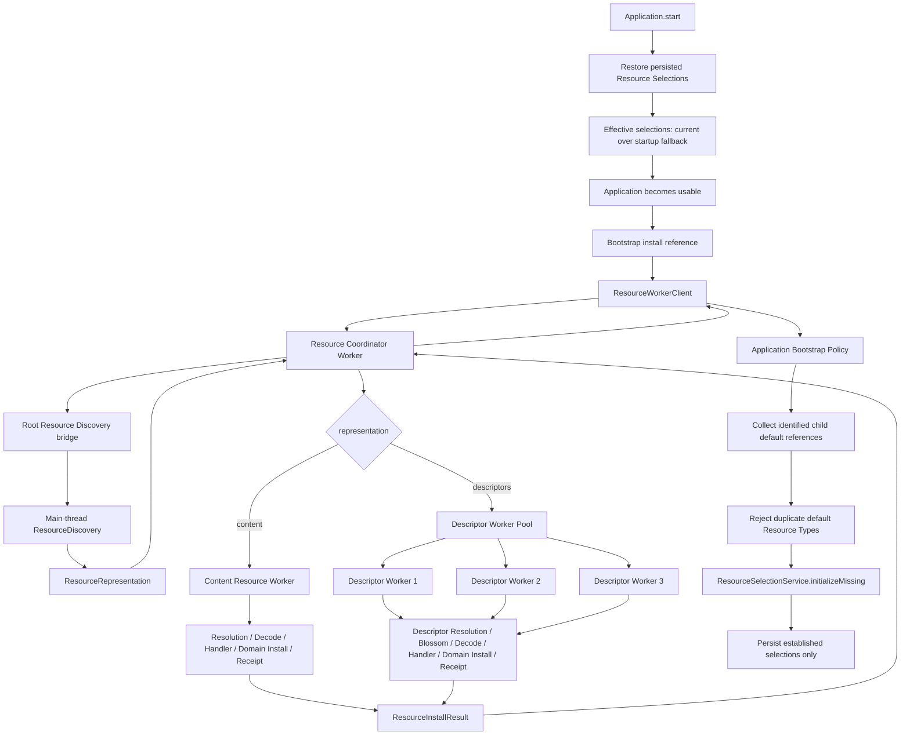
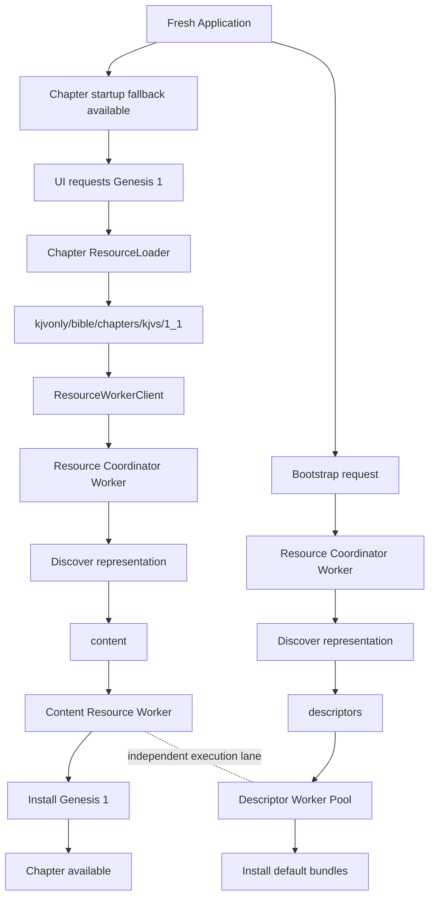

# Application Bootstrap, Default Resource Selection, and Resource Worker Execution Design

## Status

**Status:** Implemented and validated  
**Scope:** Application bootstrap policy, default Resource collection, Resource Selection initialization, startup fallback selections, Resource Worker execution, bootstrap reliability, fixed worker concurrency, and production validation  
**Application:** KJVOnly.bible  
**Date:** 2026-09-02

---

# 1. Purpose

This document captures the Application Bootstrap design and implementation work completed during the 2026-08-30 through 2026-09-02 implementation cycle.

The work began with a small application startup requirement:

> On application startup, install the application-provided default Resources without blocking the user interface.

That requirement expanded into several related problems that needed to be solved coherently:

- how the application identifies its bootstrap Resource,
- how a descriptor collection supplies application default Resource identities,
- how bootstrap installation remains part of the generic Resource lifecycle,
- how already-current Resources remain visible in bootstrap results,
- how bootstrap outcomes initialize Resource Selection,
- how existing user selections remain authoritative,
- how first startup can request Genesis 1 immediately,
- how provisional application defaults differ from durable Resource Selection,
- how duplicate in-flight Resource installs are handled,
- how Resource processing moves into a Web Worker,
- how worker failure propagates to callers,
- how large descriptor-backed bootstrap work avoids blocking latency-sensitive content Resources,
- how the Resource Worker became a small coordinator with representation-specific child workers,
- how post-discovery Resource processing was separated into `ResourceProcessor`,
- how Resource worker composition was centralized without turning worker entrypoints into composition roots,
- how fixed descriptor concurrency and content isolation were tested,
- how worker transport values are normalized into plain structured-cloneable DTOs,
- and how production-preview validation distinguished real runtime latency from Vite development-mode startup cost.

This document records the completed Application Bootstrap implementation, including the final Resource Worker coordinator / child-worker execution topology and the validation work that followed it.

The worker changes do not alter bootstrap semantics. They change only how Resource processing work is composed, routed, and executed inside the Resource worker subsystem.

---

# 2. Source and Design Context

This specification follows the style and level of detail established by:

```text
20260830-resource-descriptor-resolution-design-spec.md
```

That document established the descriptor collection, Resource Resolution, Blossom strategy, Resource receipt, and generic Resource Service model on which Application Bootstrap depends.

The related Resource Selection design is captured by:

```text
20260829-Resource Selection, Acquisition, Bundles, and Module Context.md
```

The implementation work described here refined that earlier Resource Selection design in one important area:

```text
application defaults
    ↓
provisional startup fallback
```

The application now has a narrow startup fallback mechanism so that required first-use Resources can be requested before the bootstrap descriptor collection has finished installing.

That fallback is not a general runtime fallback policy.

This distinction is defined precisely later in this document.

---

# 3. Architectural Context

The generic inbound Resource lifecycle remains:

```text
Published Resource
    ↓
Resource Discovery
    ↓
Resource Representation
    ↓
Resource Resolution
    ↓
Verified Resource Content
    ↓
Resource Content Decoding
    ↓
Resource Handler
    ↓
Domain Interpretation
    ↓
Domain Validation
    ↓
Domain Installation
    ↓
Resource Receipt
```

Application Bootstrap does not introduce another Resource lifecycle.

Bootstrap is an application workflow that decides:

```text
which Resource to request
and
when to request it
```

The generic Resource infrastructure continues to decide:

```text
how the Resource is discovered,
resolved,
decoded,
handled,
installed,
and recorded.
```

This separation is foundational.

---

# 4. Core Design Principle

Application Bootstrap is application policy implemented on top of the generic Resource architecture.

Conceptually:

```text
Application
    ↓
knows bootstrap PublishedResourceReference
    ↓
ResourceService.install(...)
    ↓
generic Resource lifecycle
```

The generic Resource infrastructure does not know:

```text
this Resource is "bootstrap"

this publisher is "the application publisher"

this descriptor collection contains "application defaults"

these Resources should become Resource Selections
```

Those are Application responsibilities.

---

# 5. Bootstrap Is Not a Special Resource Type

The bootstrap Resource currently uses:

```text
resourceId:
    kjvonly/resources/collections/default

resourceType:
    kjvonly/resources/collections

representation:
    descriptors
```

The `descriptors` representation is generic.

Another publisher may use the same descriptor machinery for:

- study collections,
- reading packages,
- imported data,
- shared collections,
- Bible datasets,
- notes packages,
- future user-defined Resource groups.

Therefore:

```text
descriptor collection
    ≠
bootstrap
```

Instead:

```text
bootstrap
    =
application policy that requests one descriptor collection
```

---

# 6. Bootstrap Resource Identity

The application knows one bootstrap reference:

```ts
const APPLICATION_BOOTSTRAP_RESOURCE:
    PublishedResourceReference = {

    publisher:
        KJVONLY_PUBKEY,

    resourceId:
        'kjvonly/resources/collections/default'
};
```

This is intentionally a normal `PublishedResourceReference`.

No bootstrap-specific identity model is introduced.

The stable identity remains:

```text
publisher + resourceId
```

---

# 7. Bootstrap Publication Shape

The development bootstrap publication is a kind `37770` Resource with:

```text
d:
    kjvonly/resources/collections/default

t:
    kjvonly/resources/collections

representation:
    descriptors

m:
    application/json
```

Its event content is a descriptor document describing the default child Resources.

Conceptually:

```text
Bootstrap Collection
    ↓
[
    Chapter source Resource descriptor,
    Strong's source Resource descriptor
]
```

---

# 8. Current Development Bootstrap Children

The current development bootstrap collection describes two child Resources:

```text
kjvonly/bible/chapters/kjvs

kjvonly/strongs/definitions/kjvs
```

These are source/bundle Resource identities.

They are not individual Domain Object identities.

---

# 9. Chapter Bootstrap Resource

The current development Chapter bootstrap Resource is:

```text
publisher:
    KJVOnly application publisher

resourceId:
    kjvonly/bible/chapters/kjvs

resourceType:
    kjvonly/bible/chapters
```

Its Blossom payload currently contains two Chapter candidates:

```text
kjvs/1_1
kjvs/1_2
```

Production is expected to contain the complete application-provided Chapter dataset.

The current small payload exists only to keep development bootstrap testing inexpensive.

---

# 10. Strong's Bootstrap Resource

The Strong's source Resource is:

```text
publisher:
    KJVOnly application publisher

resourceId:
    kjvonly/strongs/definitions/kjvs

resourceType:
    kjvonly/strongs/definitions
```

The current development payload contains only:

```text
H7225
```

but:

```text
H7225
```

is a Domain Object key inside the Strong's Resource.

It is not the Published Resource identity.

This distinction was corrected during bootstrap implementation.

---

# 11. Strong's Identity Correction

An earlier development seed represented the Strong's bootstrap child as:

```text
kjvonly/strongs/definitions/kjvs/H7225
```

That was incorrect for the intended source/bundle publication model.

The corrected identity is:

```text
kjvonly/strongs/definitions/kjvs
```

with payload:

```json
{
    "H7225": {
        "...": "..."
    }
}
```

The important invariant is:

```text
advertised Resource
    =
selected Resource
    =
installed Resource
    =
receipt Resource
```

The application must not infer a parent Resource identity by stripping path segments from an individual Domain object or Resource identifier.

---

# 12. Resource Selection Identity

Resource Selection identifies the selected source Resource.

For Bible Chapters:

```text
kjvonly/bible/chapters
    →
publisher A
kjvonly/bible/chapters/kjvs
```

Not:

```text
publisher A
kjvonly/bible/chapters/kjvs/1_1
```

For Strong's:

```text
kjvonly/strongs/definitions
    →
publisher A
kjvonly/strongs/definitions/kjvs
```

Not:

```text
publisher A
kjvonly/strongs/definitions/kjvs/H7225
```

The selected source answers:

> Which Resource source is this application or module using?

The Domain request answers:

> Which object inside that source is currently requested?

These remain separate concepts.

---

# 13. Default Collection Policy

A generic descriptor collection may contain multiple Resources of the same Resource Type.

For example, a user collection may validly advertise:

```text
kjvonly/bible/chapters/kjv
kjvonly/bible/chapters/kjvs
kjvonly/bible/chapters/asv
```

Application Bootstrap imposes a stricter policy:

> The application bootstrap collection may advertise at most one default Resource for each selectable Resource Type.

This rule belongs to Application policy.

It does not belong to:

```text
ResourceDescriptorValidator
DescriptorsRepresentationResolver
ResourceResolver
ResourceService
```

---

# 14. Why Bootstrap Requires Unique Resource Types

Application Bootstrap must be able to derive:

```text
Resource Type
    →
one PublishedResourceReference
```

without ambiguity.

Given:

```text
kjvonly/bible/chapters
```

the bootstrap collection may advertise one application default Chapter source.

If it advertises two Chapter sources, the application cannot silently choose one.

Therefore duplicate bootstrap Resource Types are an Application bootstrap configuration error.

---

# 15. Startup Lifecycle

The implemented startup sequence is:

```text
Application.start()
    ↓
restore Nostr signer state
    ↓
restore persisted Resource Selections
    ↓
configure Resource Client relays
    ↓
Application state = started
    ↓
start bootstrap Resource installation asynchronously
```

Bootstrap intentionally does not block `Application.start()`.

The application becomes usable before all bootstrap child Resources finish installing.

---

# 16. Why Bootstrap Is Non-Blocking

The bootstrap collection may eventually contain substantial datasets:

```text
Bible Chapters
Strong's definitions
paragraph overlays
pericopes
search indexes
book metadata
reading plans
other application-provided Resources
```

Waiting for every default Resource to download, decode, validate, and install before rendering the application would make first launch unnecessarily dependent on bulk installation.

Therefore:

```text
Application startup
    ≠
bootstrap completion
```

The application starts.

Bootstrap proceeds asynchronously.

---

# 17. Bootstrap Failure Does Not Fail Application Startup

The application treats bootstrap installation as recoverable startup work.

The following conditions produce diagnostics rather than a failed `Application.start()`:

- bootstrap Resource not found,
- child Resource unavailable,
- child Resource unsupported,
- child Resource decode failure,
- child Resource Domain validation failure,
- Blossom retrieval failure,
- receipt write failure,
- bootstrap selection initialization error.

The user should retain access to already-installed and on-demand Resources even when bootstrap is incomplete.

---

# 18. Bootstrap Install Result

Bootstrap consumes the normal:

```text
ResourceInstallResult
```

Conceptually:

```ts
interface ResourceInstallResult {
    requested:
        PublishedResourceReference;

    found:
        boolean;

    resources:
        readonly ResourceInstallOutcome[];
}
```

`found` refers only to the exact root Resource requested.

For bootstrap:

```text
found = false
```

means:

```text
kjvonly/resources/collections/default
```

was not discovered.

It does not mean that individual default Resources do or do not exist independently.

---

# 19. Per-Resource Bootstrap Outcomes

Child Resources may produce:

```text
handled
current
unsupported
failed
```

These statuses serve Resource lifecycle semantics first.

Application Bootstrap interprets them only after Resource processing has completed.

---

# 20. `handled`

`handled` means:

> The Resource was processed successfully by its registered Resource Handler during this install request.

For bootstrap completeness:

```text
handled
    =
complete
```

For Resource Selection initialization:

```text
identified handled child
    =
valid default candidate
```

---

# 21. `current`

`current` means:

> The Resource was checked and no processing was required because the existing Resource receipt already represents an equal or newer processed revision.

This is semantically different from `handled`.

Conceptually:

```text
handled
    → work performed now

current
    → work not required now
```

Both are successful bootstrap outcomes.

---

# 22. Why `current` Was Added

Before `current` was added, descriptor resolution behaved conceptually like:

```text
descriptor
    ↓
receiptService.needsProcessing(...)
    ↓
false
    ↓
continue
```

The child Resource disappeared from the result.

That was acceptable when the only question was:

```text
does this Resource need downloading?
```

It became incorrect when bootstrap also needed to answer:

```text
which default Resource identities did the collection advertise?
```

If the Resource was already current, its identity still mattered.

---

# 23. `ResourceResolutionResult.current`

The resolution result was expanded to preserve current Resource identity:

```ts
interface ResourceResolutionResult {
    readonly contents:
        readonly VerifiedResourceContent[];

    readonly current:
        readonly ResourceResolutionCurrent[];

    readonly failures:
        readonly ResourceResolutionFailure[];
}
```

A current entry preserves:

```text
publisher
resourceId
resourceType
```

without returning serialized Resource content.

---

# 24. Current Resource Retrieval Rule

For a descriptor child:

```text
validate descriptor
    ↓
check receipt
    ↓
receipt equal/newer?
    ├── yes
    │    ↓
    │  add identity to current[]
    │    ↓
    │  do not retrieve external content
    │
    └── no
         ↓
       resolve strategy
```

The optimization remains intact.

The only change is that the Resource no longer becomes invisible.

---

# 25. `current` at ResourceService Boundary

`ResourceService` folds `resolution.current` into:

```text
ResourceInstallOutcome {
    reference
    resourceType
    status: current
}
```

That gives Application Bootstrap enough information to initialize selections even when the default Resource was already installed before the current bootstrap run.

---

# 26. Bootstrap Completeness Rule

Application Bootstrap currently considers these statuses complete:

```text
handled
current
```

Everything else is incomplete:

```text
unsupported
failed
```

Conceptually:

```ts
resource.status !== 'handled' &&
resource.status !== 'current'
```

produces the incomplete set.

Incomplete bootstrap Resources are logged.

They do not fail application startup.

---

# 27. Why `unsupported` Is Incomplete

`unsupported` means:

> The Published Resource was resolved but the current application has no registered Resource Handler for its Resource Type.

Therefore the Resource is not locally usable through the current application implementation.

It is incomplete from an installation perspective.

However its identity may still be valid for default selection initialization.

Those two questions remain separate.

---

# 28. Why `failed` Is Incomplete

`failed` means some stage of Resource processing failed.

Examples:

```text
descriptor retrieval
integrity verification
content decoding
Domain interpretation
Domain validation
Domain installation
```

The Resource is incomplete from an installation perspective.

But a failure does not necessarily invalidate its already-validated Resource identity.

That distinction is important to Resource Selection.

---

# 29. Bootstrap Has Two Independent Responsibilities

Loading the application bootstrap collection serves two independent purposes:

```text
1. identify the application's default Resource references

2. begin normal installation of those Resources
```

These responsibilities are related, but they are not equivalent.

A Resource may be a valid advertised default even if its current download fails.

---

# 30. Installation Failure Does Not Invalidate Default Identity

Suppose the bootstrap collection advertises:

```text
Bible
    → Resource A

Strong's
    → Resource B
```

and Strong's retrieval fails.

The correct result is:

```text
Strong's install
    → failed

Strong's default identity
    → still Resource B
```

The application can later retry acquisition through the normal Resource loading path.

This is why identified failed child outcomes may still initialize missing Resource Selections.

---

# 31. Trusted Failure Identity Boundary

A failed outcome is usable for bootstrap selection initialization only when it contains:

```text
reference
resourceType
```

A failure may occur before trustworthy child identity is available.

For example:

```text
malformed descriptor entry
    ↓
descriptor validation fails before identity is trusted
```

Such a failure may have:

```text
reference = undefined
resourceType = undefined
```

It must not initialize a Resource Selection.

---

# 32. Identified Failure Rule

The Application bootstrap selection candidate rule is therefore:

```text
failed + complete trusted identity
    → may initialize missing selection

failed + incomplete identity
    → ignored for selection initialization
```

Installation completeness still reports both as failed.

---

# 33. Root Collection Failure Exclusion

A descriptor document failure may identify the containing bootstrap Resource itself:

```text
requested:
    kjvonly/resources/collections/default

failure:
    publisher = bootstrap publisher
    resourceId = kjvonly/resources/collections/default
    resourceType = kjvonly/resources/collections
```

That identity is not a selectable child default.

Therefore Application Bootstrap explicitly excludes the exact `result.requested` identity from Resource Selection candidates.

---

# 34. Bootstrap Selection Candidate Algorithm

Conceptually:

```text
for each ResourceInstallOutcome:
    ↓
does it have reference + resourceType?
    ├── no → ignore for selection initialization
    └── yes
         ↓
is it the requested bootstrap collection itself?
    ├── yes → ignore
    └── no
         ↓
has this Resource Type already appeared?
    ├── yes → bootstrap configuration error
    └── no
         ↓
collect PublishedResourceReference
```

Then:

```text
ResourceSelectionService.initializeMissing(
    collected references
)
```

---

# 35. Bootstrap Selection Initialization Is Application Policy

The generic Resource lifecycle does not perform:

```text
Resource Type
    →
global Resource Selection
```

That conversion belongs to Application Bootstrap.

This preserves the difference between:

```text
descriptor collection
    → which Resources should be resolved/installed?

Resource Selection
    → which Resource source should application context use?
```

Generic collections never automatically redefine global selections.

---

# 36. ResourceSelectionService Responsibility

`ResourceSelectionService` owns application-level current Resource Selection behavior.

Its responsibilities include:

```text
get effective selection

require effective selection

explicitly select Resource

restore persisted selections

initialize missing established selections

produce a detached effective snapshot
```

It does not know:

```text
which Resource is bootstrap

which defaults belong to KJVOnly

which Resource Type is Bible

which Resource Type is Strong's

how Resources are discovered

how Resources are installed
```

---

# 37. Selection State Has Two Layers

The implementation now distinguishes:

```text
established current selections

fallback selections
```

These are intentionally different states.

---

# 38. Established Current Selections

Established current selections come from:

```text
persisted state
bootstrap initialization
explicit user/application selection
```

They represent the actual current application preference.

They are persisted.

---

# 39. Fallback Selections

Fallback selections are application-provided startup references.

They exist to answer an early-startup question:

> If no established selection exists yet, what source may the application use immediately?

They are:

- available immediately,
- not persisted merely because they exist,
- replaceable by bootstrap initialization,
- lower precedence than restored or explicitly selected current values.

---

# 40. Why Fallback Selections Were Reintroduced

An earlier implementation removed hardcoded application defaults entirely and constructed:

```text
ResourceSelectionService([])
```

This correctly eliminated defaults from normal Resource Selection policy.

However it exposed a first-startup gap:

```text
fresh application
    ↓
no persisted selection
    ↓
bootstrap still installing
    ↓
UI requests Genesis 1
    ↓
no Chapter source selection exists yet
```

The application needs a Chapter source before bulk bootstrap installation completes.

The fallback layer solves that requirement without making built-in defaults durable current selections.

---

# 41. Fallback Is Not General Runtime Fallback

The word `fallback` is intentionally narrow here.

It does not mean:

```text
selected Resource unavailable
    ↓
silently switch to application fallback
```

That behavior remains forbidden.

Instead:

```text
no established current selection exists yet
    ↓
startup fallback may provide an effective reference
```

Once an established current selection exists:

```text
current
    >
fallback
```

If that current Resource later becomes unavailable, the application does not silently substitute the fallback.

---

# 42. Selection Precedence

The effective selection rule is:

```text
established current selection
    ??
startup fallback selection
```

Precedence:

```text
restored / bootstrap / explicit current
    >
application startup fallback
```

---

# 43. Fresh Startup Selection Flow

On a fresh application:

```text
Application constructed
    ↓
fallback Chapter source exists
fallback Strong's source exists
    ↓
no persisted selections restored
    ↓
effective selections use fallbacks
    ↓
application may request Genesis 1 immediately
    ↓
bootstrap eventually returns advertised defaults
    ↓
initializeMissing(...)
    ↓
fallback does not count as established current state
    ↓
bootstrap default becomes established current selection
    ↓
persist established selection
```

---

# 44. Returning User Selection Flow

For an existing user:

```text
Application constructed
    ↓
fallbacks exist
    ↓
restore()
    ↓
persisted Chapter selection becomes current
    ↓
current overrides fallback
    ↓
bootstrap returns
    ↓
initializeMissing(...)
    ↓
Chapter already has established current selection
    ↓
preserve user selection
```

The bootstrap collection does not overwrite existing user preference.

---

# 45. Updated Bootstrap Collection Rule

An updated application bootstrap collection does not automatically replace established current selections.

The rule remains:

```text
established selection exists
    → preserve

established selection missing
    → initialize from bootstrap
```

Automatic migration from one default Resource to another would be a separate Application policy.

It is not part of bootstrap initialization.

---

# 46. Fallback Persistence Rule

Fallback selections are never persisted merely because the service was constructed with them.

Persistence writes only:

```text
established current selections
```

This prevents:

```text
Application constructor
    ↓
built-in fallback
    ↓
localStorage
```

from accidentally turning a temporary startup value into durable user state before bootstrap has a chance to advertise the current application default.

---

# 47. Effective Snapshot Rule

`ResourceSelectionService.snapshot()` exposes effective selection state.

Conceptually:

```text
copy fallback selections
    ↓
overlay established current selections
```

This allows module/application context creation to see a usable source even during first startup.

Persistence does not use that effective snapshot directly.

Persistence writes only the established-current map.

---

# 48. Current Application Fallbacks

The current Application composition supplies:

```text
Bible Chapter:
    publisher = KJVONLY_PUBKEY
    resourceId = kjvonly/bible/chapters/kjvs

Strong's:
    publisher = KJVONLY_PUBKEY
    resourceId = kjvonly/strongs/definitions/kjvs
```

These references are deliberately small in number.

They exist for first-use startup continuity.

The long-term default collection remains the authoritative way to advertise the full set of application defaults.

Adding every future bootstrap Resource to the fallback list is not implied.

Only Resources required before bootstrap can reasonably complete need provisional startup references.

---

# 49. Genesis 1 First-Boot Requirement

A concrete startup requirement surfaced during implementation:

> On first application boot, the user should be able to request Genesis 1 immediately.

The local relay currently publishes individual Chapter Resources such as:

```text
kjvonly/bible/chapters/kjvs/1_1

kjvonly/bible/chapters/kjvs/1_2
```

Production is expected to publish all 1189 Chapters individually.

Therefore first-read acquisition does not need to wait for the complete Chapter bundle.

---

# 50. Individual Chapter Acquisition

Given effective Chapter selection:

```text
publisher:
    KJVOnly publisher

source:
    kjvonly/bible/chapters/kjvs
```

and requested Chapter:

```text
1_1
```

the normal Resource Loader may request:

```text
kjvonly/bible/chapters/kjvs/1_1
```

The discovered representation is:

```text
content
```

and the Resource can be installed independently.

The source selection remains:

```text
kjvonly/bible/chapters/kjvs
```

The individual Chapter Resource is only the acquisition unit.

---

# 51. Bundle and Individual Chapter Resources Coexist

The publication model supports both:

```text
source/bundle:
    kjvonly/bible/chapters/kjvs

individual:
    kjvonly/bible/chapters/kjvs/1_1
```

This allows:

```text
first user read
    → small individual content Resource

background bootstrap
    → larger source/bundle Resource
```

without changing application-facing Chapter identity.

---

# 52. Why First-Read Latency Still Appeared

After fallback selections were implemented, first startup correctly downloaded the individual Genesis 1 Resource.

A noticeable delay still appeared in development, which initially suggested that bulk descriptor processing and latency-sensitive content processing were contending inside one Resource worker execution lane.

That observation motivated the representation-specific worker topology described later in this document.

The final implementation and production-preview validation refined the diagnosis.

With bootstrap temporarily disabled, Genesis 1 was still slow on a cold Vite development load even though:

```text
relay discovery
    → completed within milliseconds

content-worker IndexedDB open
    → approximately 2–5 ms

Chapter installation transaction
    → approximately 5 ms on first install
    → approximately 2 ms on the next Chapter
```

The browser was still downloading and transforming application TypeScript modules near the two-second mark.

A production build removed that development-only module-loading pattern. After the worker transport clone issue described in Section 55 was corrected, production preview showed:

```text
bootstrap bundles
    → approximately 500 ms download/install window in the tested local environment

Genesis 1 individual Resource
    → rendered quickly
```

Therefore the final conclusion is:

```text
selection availability
    → fixed by startup fallback selections

content vs descriptor execution isolation
    → implemented and verified

IndexedDB cold-open / transaction cost
    → not the observed multi-second delay

remaining cold delay observed in development
    → Vite development-mode module loading / transformation cost
```

The worker topology remains valuable because it provides a real independent content execution lane, but production validation did not show Genesis blocked behind bootstrap descriptor work.

---

# 53. Current Resource Worker Boundary

The Application currently constructs one:

```text
ResourceWorkerClient
```

and exposes it through:

```text
ApplicationContext.resourceService
```

Application-facing Resource Loaders use the same client.

Bootstrap also uses the same client.

Therefore all Resource work currently enters one Resource Worker boundary.

---

# 54. ResourceWorkerClient Public Contract

The application-facing contract is intentionally simple:

```ts
install(
    reference:
        PublishedResourceReference
): Promise<ResourceInstallResult>
```

The caller does not know:

- representation type,
- worker topology,
- descriptor strategy,
- Domain handler,
- scheduling policy.

This is a useful boundary and should remain stable.

---

# 55. Current Worker Message Contract

The main thread sends:

```text
install {
    requestId
    reference
}
```

The Resource worker cannot know the representation yet.

It requests discovery back through the main-thread bridge:

```text
Resource Worker
    ↓
discovery {
    requestId
    reference
}
    ↓
main-thread ResourceDiscovery
    ↓
discovery-result {
    requestId
    representation
}
```

The representation becomes known before Resource Resolution begins.

## Plain transport DTO rule

A production-preview failure exposed an important worker-boundary requirement.

Passing the caller-owned `PublishedResourceReference` object directly to `Worker.postMessage(...)` produced:

```text
DataCloneError:
Failed to execute 'postMessage' on 'Worker'
```

The compile-time TypeScript shape was correct, but a caller may supply an object whose runtime representation is not structured-cloneable, such as a reactive/wrapped object.

`ResourceWorkerClient` therefore materializes a plain transport DTO before crossing the worker boundary:

```ts
reference: {
    publisher:
        reference.publisher,

    resourceId:
        reference.resourceId
}
```

The boundary rule is:

```text
application-owned object
    ↓
ResourceWorkerClient
    ↓
plain PublishedResourceReference DTO
    ↓
postMessage
```

Worker transport should depend on the serialized values required by the contract, not on the concrete runtime identity of the caller's object.

---

# 56. Why Discovery Remains on the Main Thread

Resource Discovery currently depends on browser/application Nostr infrastructure:

```text
NostrSigner
ResourceClient
rx-nostr
NIP-42 authentication
relay configuration
verification client
```

The Resource Worker does not recreate that stack.

The boundary remains:

```text
main thread
    → Nostr discovery

Resource worker subsystem
    → processing after ResourceRepresentation exists
```

---

# 57. Worker-Side Resource Processing

The final Resource worker subsystem is split into coordination and post-discovery processing responsibilities.

The Coordinator owns:

```text
ResourceService
ResourceWorkerDiscovery
ResourceWorkerProcessorRouter
Content ResourceChildWorkerClient
ResourceDescriptorWorkerPool
three Descriptor ResourceChildWorkerClients
```

Post-discovery processing is owned by `ResourceProcessor` instances inside the child workers.

`ResourceProcessor` owns the normal processing sequence after root discovery:

```text
ResourceRepresentation
    ↓
Resource Resolution
    ↓
Resource Content Decoding
    ↓
Resource Handler dispatch
    ↓
Domain interpretation / validation
    ↓
Domain installation
    ↓
Resource receipt
```

The processing object graph is assembled in one Resource-worker composition module:

```text
resource-worker-composition.ts
    ├── createContentResourceProcessor()
    └── createDescriptorResourceProcessor()
```

The Content processor is configured with:

```text
ContentRepresentationResolver
```

The Descriptor processor is configured with:

```text
DescriptorsRepresentationResolver
    ↓
ResourceDescriptorDocumentDecoder
ResourceDescriptorValidator
ResourceReceiptService
BlossomResourceResolutionStrategy
```

Both processors reuse the shared downstream decoding and Domain-handler infrastructure required after verified content exists.

The worker entry files remain thin transport hosts. They do not each recreate the knowledge of how Resource processing services are assembled.

This preserves one composition rule:

> Do not duplicate the knowledge of how Resource processing services are assembled across worker entrypoints.

---

# 58. Why Moving Processing to a Worker Was Important

Resource processing can include:

```text
SHA-256
gzip decompression
JSON parsing
descriptor iteration
Domain interpretation
Domain validation
large Domain installation transactions
```

These operations should not block Svelte rendering or interaction on the main thread.

The first Resource Worker move addressed UI-thread responsiveness.

The final coordinator topology additionally isolates representation-specific workloads:

```text
content
    → one dedicated Content Worker

descriptors
    → fixed pool of three Descriptor Workers
```

Focused concurrency tests and a real-browser nested-worker integration test now prove that content processing can begin while all three descriptor workers are occupied and another descriptor request is queued.

---

# 59. Worker Discovery Bridge

The worker uses a discovery proxy that communicates with main-thread `ResourceDiscovery`.

Conceptually:

```text
worker ResourceService
    ↓
worker discovery proxy
    ↓
message to main
    ↓
ResourceDiscovery.get(...)
    ↓
ResourceRepresentation
    ↓
message to worker
```

This preserves one Nostr implementation and keeps worker Resource processing transport-neutral after discovery.

---

# 60. Worker Request Correlation

The worker subsystem uses correlation IDs at two distinct transport boundaries.

## Outer correlation

`ResourceWorkerClient` correlates:

```text
Application / main thread
    ↔
Resource Coordinator Worker
```

This allows multiple outstanding installs to resolve out of order while preserving the correct caller Promise.

## Child correlation

`ResourceChildWorkerClient` independently correlates:

```text
Resource Coordinator Worker
    ↔
Content / Descriptor child worker
```

The child client generates its own request IDs.

The outer request ID is not propagated as the child transport ID.

Conceptually:

```text
outer install-7
    ↓
Coordinator
    ↓
child process-3
    ↓
child result process-3
    ↓
Coordinator completes outer install-7
```

This keeps transport correlation local to each message boundary and prevents child workers from depending on the main-thread request-ID scheme.

---

# 61. Worker Failure Semantics

Worker infrastructure failure must not leave application Promises pending forever.

The implemented Resource Worker Client handles failure by:

```text
worker error/messageerror
    ↓
reject pending install Promises
    ↓
prevent additional use of failed worker
    ↓
terminate failed worker
```

`dispose()` likewise rejects pending requests and terminates the worker.

No automatic Resource operation retry is introduced.

---

# 62. Why Worker Failure Is Different From Resource Failure

A normal Resource failure returns a normal Resource result or Resource error associated with the request.

A worker crash means:

```text
execution infrastructure disappeared
```

Pending callers cannot assume their operations completed.

Therefore they must be rejected.

This preserves explicit failure instead of silent hanging.

---

# 63. Exact-Reference In-Flight Deduplication

ResourceService now deduplicates concurrent requests for the same exact Published Resource identity.

The key is based on:

```text
publisher
resourceId
```

Conceptually:

```text
install(Resource A)
install(Resource A)
    ↓
same in-flight Promise
```

Only one actual install executes.

---

# 64. Why In-Flight Deduplication Was Added

Application Bootstrap and normal application loading can overlap.

Without deduplication:

```text
bootstrap requests Resource A

UI requests Resource A before receipt exists
```

could perform duplicate work.

Receipts do not solve that race because neither request may have written its receipt yet.

The in-flight map closes that narrow window.

---

# 65. In-Flight Deduplication Scope

The current rule is deliberately narrow:

```text
same publisher + same resourceId + concurrent
    → share work
```

Different Resources are not serialized.

A later request after completion is not permanently cached by the in-flight map.

Normal receipt freshness handles later requests.

No:

- general scheduler,
- global semaphore,
- retry queue,
- priority queue,
- cross-tab lock,
- distributed lock

was introduced.

---

# 66. In-Flight Failure Cleanup

If an in-flight install rejects:

```text
in-flight entry
    → removed
```

A later request may try again.

Concurrent callers share the same rejection for the active attempt.

This prevents a rejected Promise from permanently poisoning the Resource identity.

---

# 67. Blossom Integration

The bootstrap descriptor collection currently resolves child Resources through Blossom.

For each descriptor, the Blossom strategy owns:

```text
strategy data validation
HTTP retrieval
optional size verification
SHA-256 verification
raw Uint8Array return
```

It does not:

```text
decompress
parse JSON
interpret Domain data
install Domain Objects
write Resource receipts
```

Those remain downstream Resource lifecycle responsibilities.

---

# 68. Bootstrap Descriptor Payload

Each current development bootstrap descriptor contains:

```text
metadata:
    publisher
    resourceId
    category
    modifiedAt
    mediaType

strategy:
    type = blossom

    data:
        url
        sha256
        size
```

The descriptor is self-contained.

Child identity is not inherited from the containing bootstrap event.

---

# 69. Real Bootstrap Integration Flow

The tested integration flow is conceptually:

```text
Application
    ↓
ResourceWorkerClient
    ↓
Resource Worker
    ↓
main-thread Resource Discovery
    ↓
bootstrap descriptors Resource
    ↓
DescriptorsRepresentationResolver
    ↓
Resource receipts
    ↓
Blossom strategy
    ↓
SHA-256 verification
    ↓
raw gzip bytes
    ↓
ResourceContentDecoder
    ↓
Chapter / Strong's Resource Handler
    ↓
Domain validation
    ↓
IndexedDB installation
    ↓
Resource receipt
```

This is the same Resource lifecycle used by normal on-demand acquisition.

---

# 70. Receipt Behavior During Bootstrap

Descriptor child receipts prevent repeatedly downloading unchanged bootstrap Resources.

The freshness rule is:

```text
no receipt
    → process

incoming modifiedAt > receipt modifiedAt
    → process

incoming modifiedAt <= receipt modifiedAt
    → current
```

Receipt checks occur before Blossom retrieval.

---

# 71. Outer Bootstrap Collection Receipt

The bootstrap descriptor collection itself does not represent installed Domain data merely because its child Resources were processed.

Current bootstrap behavior records receipts for processed child Resources.

The important receipt identities are:

```text
kjvonly/bible/chapters/kjvs

kjvonly/strongs/definitions/kjvs
```

The outer collection is orchestration metadata, not a Domain installation.

---

# 72. Bootstrap Second-Run Behavior

After child Resources have already been processed:

```text
bootstrap descriptors
    ↓
receipt checks
    ↓
children current
    ↓
no external re-download
```

The outward bootstrap result still preserves child identities as:

```text
status: current
```

This allows both:

```text
bootstrap completeness
and
Resource Selection initialization
```

to remain correct on later runs.

---

# 73. Application Bootstrap Selection Tests

The Application bootstrap selection browser specification contains five focused policy tests.

They prove:

```text
1. missing Resource selections are initialized from bootstrap results

2. an existing Resource selection is preserved while another missing type is initialized

3. an identified failed bootstrap Resource still initializes its missing selection

4. duplicate bootstrap Resource Types are rejected without changing existing selections

5. current bootstrap Resources initialize selections
```

These are Application policy tests.

---

# 74. Why Bootstrap Selection Tests Mock ResourceWorkerClient

An initial standalone browser test attempted to depend on the actual bootstrap Resource already being present on the relay.

That produced:

```text
[Application bootstrap Resource not found]
```

followed by localStorage timeout failures when the relay was not seeded for that test.

That test mixed two concerns:

```text
real Resource acquisition fixture

Application selection policy
```

The corrected test isolates Application policy by mocking only:

```text
ResourceWorkerClient.install()
```

while keeping real:

```text
Application
ResourceSelectionService
LocalStorageResourceSelectionStore
localStorage
```

---

# 75. Test Layering

Bootstrap behavior is intentionally tested at multiple layers.

## Resource infrastructure tests

Prove:

```text
discovery
resolution
current semantics
receipt freshness
Blossom retrieval
integrity
decode
Domain handling
worker messaging
```

## Real integration tests

Prove:

```text
relay
→ Resource Client
→ worker bridge
→ descriptor resolution
→ Blossom
→ Domain installation
→ IndexedDB
```

## Application bootstrap policy tests

Prove:

```text
ResourceInstallResult
→ bootstrap candidate policy
→ ResourceSelectionService.initializeMissing(...)
→ localStorage
```

No single test needs to prove every layer at once.

---

# 76. ResourceSelectionService Test Responsibilities

The Resource Selection tests should preserve the following behavior:

```text
fallback is immediately readable

explicit current selection overrides fallback

restored persisted current selection overrides fallback

fallback construction does not persist

initializeMissing may replace fallback with established current state

initializeMissing does not replace restored/explicit current state

missing Resource Types are initialized independently

effective snapshot includes fallback where no current exists

persistence excludes fallback-only entries
```

These rules are part of startup correctness.

---

# 77. Performance Issue Surfaced by Real Startup

After first-start selection was fixed, the application correctly requested the individual Genesis 1 content Resource.

A lag still remained.

This revealed a different issue:

> bulk descriptor-backed Resource processing and latency-sensitive content Resource processing should not share one execution lane.

The problem becomes clearer in production.

---

# 78. Production Contention Example

Consider:

```text
bootstrap descriptor request
    ↓
Chapter source bundle
    ↓
large external file
    ↓
decode / validate / install many objects
```

While that work is active, the user navigates:

```text
Genesis 1
    ↓
Genesis 2
    ↓
John 3
```

Those individual Chapters are small `content` Resources.

They should not wait behind a large descriptor workload.

---

# 79. Representation Types Already Provide a Useful Execution Boundary

The Resource model has exactly two current representation types:

```text
content

descriptors
```

They have meaningfully different workload characteristics.

## `content`

Serialized Resource payload is carried in the Resource event.

Therefore it is naturally bounded by event transport constraints and expected to be comparatively small.

Typical user-facing example:

```text
individual Chapter
```

## `descriptors`

The event contains references to external Resource content.

A descriptor collection may resolve:

- large files,
- many Resources,
- expensive decompression,
- large JSON payloads,
- bulk Domain installations.

This naturally represents heavier work.

---

# 80. Final Worker Design Principle

The Application continues to see exactly one Resource worker/service boundary.

Internally, `resource.worker.ts` is the Resource Coordinator Worker.

Conceptually:

```text
Application
    ↓
ResourceWorkerClient
    ↓
Resource Coordinator Worker
    ↓
ResourceService
    ↓
ResourceWorkerProcessorRouter
    ├── content      → Content Resource Worker
    └── descriptors  → ResourceDescriptorWorkerPool
                           ├── Descriptor Worker 1
                           ├── Descriptor Worker 2
                           └── Descriptor Worker 3
```

This keeps execution topology hidden from Application and Domain code.

---

# 81. Why Application Should Not Own Multiple Resource Workers

An alternative would expose:

```text
contentResourceWorkerClient

descriptorResourceWorkerClient

backgroundResourceWorkerClient
```

to Application composition.

That would leak execution policy upward.

The Application would need to know which worker should process which Resource.

That is unnecessary because Resource infrastructure already knows the representation after discovery.

Therefore the single outer Resource worker boundary is retained.

---

# 82. Resource Coordinator Worker

The existing:

```text
resource.worker.ts
```

is the Resource Coordinator Worker.

Its responsibilities are:

```text
accept outer install(reference) requests

preserve outer request correlation

perform root Resource Discovery through the existing main-thread bridge

receive ResourceRepresentation

route post-discovery processing by representation

preserve exact-reference in-flight semantics through ResourceService

forward final ResourceInstallResult to ResourceWorkerClient
```

Heavy Resource processing is no longer performed in the Coordinator.

The Coordinator constructs one Content child client and a fixed three-slot Descriptor worker pool when its module initializes.

No custom Coordinator shutdown-message protocol or child-worker restart/replacement policy was introduced. The outer `ResourceWorkerClient.dispose()` terminates the Coordinator Worker. Additional child lifecycle policy remains out of scope unless runtime evidence requires it.

---

# 83. Child Worker Topology

The initial fixed topology is:

```text
Resource Coordinator Worker
    │
    ├── Content Resource Worker
    │
    ├── Descriptor Resource Worker 1
    ├── Descriptor Resource Worker 2
    └── Descriptor Resource Worker 3
```

The child workers are created when the Resource Coordinator Worker initializes.

No worker is created per Resource request.

---

# 84. Content Worker

There is initially one Content Resource Worker.

It handles root Resources where:

```text
representation = content
```

Typical workload:

```text
individual Chapter Resources
other small inline Resource payloads
```

This provides a dedicated latency-sensitive Resource execution lane.

---

# 85. Descriptor Worker Pool

There are initially three Descriptor Resource Workers.

They handle root Resources where:

```text
representation = descriptors
```

Typical workloads:

```text
bootstrap collection
manual study collection
large dataset collection
descriptor-backed install
```

Three workers prevent one large descriptor operation from monopolizing every descriptor execution slot.

---

# 86. Bootstrap Is Not Given a Special Worker

No dedicated:

```text
bootstrap worker
background bootstrap worker
application default worker
```

is introduced.

Bootstrap remains:

```text
ResourceService.install(
    APPLICATION_BOOTSTRAP_RESOURCE
)
```

After discovery:

```text
representation = descriptors
```

so the Resource Coordinator naturally routes it into the Descriptor Worker Pool.

This keeps bootstrap ordinary.

---

# 87. Genesis 1 With Final Worker Topology

The implemented fresh-start flow is:

```text
Application constructed
    ↓
Chapter startup fallback immediately available
    ↓
restore persisted selections
    ↓
Application starts
    ↓
bootstrap request begins
    ↓
Coordinator discovers bootstrap
    ↓
representation = descriptors
    ↓
Descriptor Worker Pool
```

At the same time:

```text
UI requests Genesis 1
    ↓
Chapter ResourceLoader
    ↓
.../kjvs/1_1
    ↓
Coordinator discovers Resource
    ↓
representation = content
    ↓
Content Resource Worker
```

The operations use separate child execution lanes.

This independence is covered both by focused worker tests and by a real-browser nested-worker integration test.

---

# 88. Why No Separate Background Resource Worker Is Required

An earlier possibility was:

```text
foreground Resource worker
background Resource worker
```

The representation-specific coordinator design is cleaner for the immediate problem.

The expensive bootstrap work is already a `descriptors` workload.

User-facing Chapter reads are `content` workloads.

Therefore:

```text
representation routing
```

provides the required isolation without adding application-specific priority concepts.

If a user intentionally requests a descriptor collection, it remains descriptor work and uses the descriptor pool.

---

# 89. Root Discovery Happens Before Child Routing

The outer install request contains only:

```text
PublishedResourceReference
```

Representation is not known until Resource Discovery succeeds.

Therefore the Coordinator must:

```text
install(reference)
    ↓
ResourceDiscovery bridge
    ↓
ResourceRepresentation
    ↓
inspect representation
    ↓
choose child worker
```

The Application and `ResourceWorkerClient` do not need to change their public request contract.

---

# 90. Child Workers Begin After Root Discovery

A child worker receives an already-discovered root representation.

The implemented internal child request is conceptually:

```text
process {
    requestId
    requested
    representation
}
```

where:

```text
requestId
    → child-transport correlation owned by ResourceChildWorkerClient

requested
    → PublishedResourceReference requested by the outer Resource operation

representation
    → already-discovered ResourceRepresentation
```

The child request does not perform root Resource Discovery again.

The child request ID is intentionally independent from the outer `ResourceWorkerClient` request ID.

---

# 91. ResourceService Internal Refactor Seam

The final implementation introduced a concrete post-discovery seam:

```text
ResourceProcessor
```

Responsibilities are now separated as:

```text
ResourceService
    → exact Published Resource in-flight deduplication
    → root Resource Discovery

ResourceProcessor
    → Resource Resolution
    → current/failure folding
    → Resource Content Decoding
    → Resource Handler dispatch
    → Domain installation
    → Resource receipt recording
```

`ResourceService` depends only on:

```text
ResourceDiscovery.get(...)
ResourceProcessor.process(...)
```

Conceptually:

```text
ResourceService.install(reference)
    ↓
exact-reference dedupe
    ↓
ResourceDiscovery.get(reference)
    ↓
not found
    → found:false

found
    ↓
ResourceProcessor.process(
    requested,
    representation
)
```

This was the minimum clean seam needed by the Coordinator because it can discover the root once and route the already-discovered representation to a child worker without creating a second Resource lifecycle.

---

# 92. Child Worker Processing Boundary

Once a child receives the discovered representation, it owns the normal post-discovery Resource lifecycle:

```text
ResourceRepresentation
    ↓
Resource Resolution
    ↓
ResourceResolutionResult
    ↓
Resource Content Decoding
    ↓
Resource Handler
    ↓
Domain Installation
    ↓
Resource Receipt
```

Descriptor child workers additionally own:

```text
descriptor document decoding
descriptor validation
receipt freshness checks
Blossom retrieval
integrity verification
```

---

# 93. Descriptor Child Resource Processing Remains Internal

A root `descriptors` representation may resolve many child Resource contents.

Those child contents do not bounce back through the Coordinator merely because they represent independently installable Resources.

The assigned Descriptor Resource Worker should process the entire root descriptor operation using the existing descriptor best-effort semantics.

Conceptually:

```text
root descriptor collection
    ↓
assigned descriptor worker
    ↓
descriptor A
descriptor B
descriptor C
...
    ↓
process outcomes
    ↓
one ResourceInstallResult
```

This preserves collection behavior and avoids unnecessary inter-worker chatter.

---

# 94. Descriptor Pool Scheduling

The implemented `ResourceDescriptorWorkerPool` uses a deliberately simple rule:

```text
descriptor request arrives
    ↓
first idle descriptor slot exists?
    ├── yes → assign request
    └── no  → enqueue FIFO
```

When a descriptor worker finishes or its assigned Promise rejects:

```text
mark slot idle
    ↓
shift oldest queued request
    ↓
dispatch it
```

The pool is Resource-specific and fixed at exactly three clients.

No generic `WorkerPool`, priority scheduler, size scheduler, work stealing, retry mechanism, or dynamic worker-count policy is introduced.

---

# 95. Why Three Descriptor Workers

A single descriptor worker still permits head-of-line blocking:

```text
1 GB descriptor-backed install
    ↓
4 MB descriptor-backed install
    ↓
small install waits
```

Three descriptor workers allow several independent descriptor workloads to progress concurrently.

This is a practical initial compromise between:

```text
one serialized heavy lane

and

unbounded parallel Resource processing
```

The count may be revisited only with performance evidence.

---

# 96. Why No Size-Aware Scheduling Yet

Descriptor strategy metadata may already contain:

```text
size
```

for integrity/retrieval purposes.

However scheduling by size is a separate concern.

The current implementation does not add a generic Resource-level:

```text
size
```

field merely for worker scheduling.

Reasons:

- Resource representation size and actual processing cost are not equivalent,
- descriptor collections can describe several differently sized Resources,
- decompression and Domain installation cost may dominate transfer size,
- the current problem is solved by execution-lane separation and a small pool,
- size-aware scheduling can be added behind the pool seam later if measurements justify it.

---

# 97. Descriptor Pool Is the Future Optimization Seam

The implemented routing seam is:

```text
ResourceWorkerProcessorRouter
    ├── content processor
    └── descriptor processor
```

The descriptor processor is currently:

```text
ResourceDescriptorWorkerPool
    = fixed pool of three ResourceChildWorkerClient instances
    + FIFO queue
```

This localizes execution policy without creating a generic worker framework.

Future internal implementations may change descriptor scheduling only if measurements justify it, without changing:

```text
Application
ResourceWorkerClient
Resource Loader
Domain services
Resource identities
Resource lifecycle
```

Possible future changes remain deliberately unimplemented:

```text
dynamic worker count
hardwareConcurrency tuning
size-aware assignment
work stealing
priority
cancellation
```

None are required for the current bootstrap architecture.

---

# 98. Exact-Reference Deduplication Must Remain an Outward Invariant

The current exact-reference in-flight rule remains important after child workers are introduced.

Two simultaneous outer requests for:

```text
same publisher
same resourceId
```

must not be dispatched to two different descriptor workers.

Therefore deduplication must occur before child selection.

Conceptually:

```text
Coordinator install(reference)
    ↓
exact reference already in flight?
    ├── yes → join existing operation
    └── no
         ↓
       discover
         ↓
       route
```

The implementation may move the current in-flight map to the Coordinator or preserve it through an equivalent outer Resource facade.

The semantic is locked.

---

# 99. Cross-Collection Child Races Remain Separate

Two different descriptor collections could theoretically describe the same child Resource concurrently.

Example:

```text
Collection A
    → Resource X

Collection B
    → Resource X
```

If the two root collections are assigned to different descriptor workers, child-level receipt checks may race.

This is not the same as exact root request deduplication.

The current bootstrap work does not introduce:

- shared cross-worker child locks,
- global Resource transaction schedulers,
- cross-tab coordination.

If real usage exposes this race as harmful, it should be addressed separately.

---

# 100. IndexedDB Concurrency

Different child workers may perform independent IndexedDB transactions.

Existing Domain installation atomicity remains per Published Resource.

Conceptually:

```text
Resource A
    → transaction A

Resource B
    → transaction B
```

The worker pool does not redefine Domain replacement policy.

It only allows independent Resource operations to execute on different worker threads.

---

# 101. Child Worker Failure Behavior

The implemented `ResourceChildWorkerClient` preserves the outward guarantee:

> No assigned Resource operation should remain pending because its child worker execution lane failed.

Normal child processing errors are correlated to the affected request and reject that request.

Fatal child `error` or `messageerror` events cause the child client to:

```text
record terminal client failure
    ↓
terminate the child worker
    ↓
reject every pending child request
    ↓
reject future process(...) calls
```

`dispose()` likewise terminates the child and rejects pending/future processing.

No automatic retry, restart, or replacement is implemented.

The Descriptor pool currently treats a rejected child operation as a completed slot assignment and releases the slot. A separate failed-slot disable/replacement policy was deliberately not introduced without a concrete runtime requirement.

---

# 102. Coordinator Failure Requirement

If the Resource Coordinator Worker itself fails, existing `ResourceWorkerClient` failure behavior remains applicable:

```text
reject pending installs
terminate failed worker
block additional use
```

The outer Application-facing failure semantics should not change merely because child workers now exist.

---

# 103. Other Application Workers Remain Separate

The Resource worker hierarchy is not an application-wide generic worker pool.

The application has other worker-owned subsystems, including examples such as:

```text
Bible/Search Worker
    → FlexSearch index

Notes Worker
    → Notes FlexSearch index
```

These remain separate and self-contained.

Target organization:

```text
Application
    │
    ├── Resource Coordinator Worker
    │     ├── Content Resource Worker
    │     ├── Descriptor Resource Worker
    │     ├── Descriptor Resource Worker
    │     └── Descriptor Resource Worker
    │
    ├── Search Worker
    │     └── search index state
    │
    └── Notes Worker
          └── notes search index state
```

There is no shared global worker scheduler.

---

# 104. Why Separate Worker Subsystems Are Preferred

Resource processing, Bible search, and Notes search have different:

- state,
- lifecycle,
- data ownership,
- latency characteristics,
- failure modes,
- initialization requirements.

Combining them into one generic application worker pool would increase coordination without solving a concrete architecture problem.

Worker ownership should follow subsystem ownership.

---

# 105. Bootstrap Completion Definition

Application Bootstrap is complete for the current architecture.

The implemented and tested milestone is:

```text
bootstrap Published Resource reference
    ✓

descriptor-backed application default collection
    ✓

Chapter source bundle
    ✓

Strong's source bundle identity
    ✓

generic Resource Worker boundary
    ✓

worker discovery bridge
    ✓

real Blossom descriptor integration
    ✓

worker crash/pending Promise handling
    ✓

exact-reference in-flight deduplication
    ✓

current Resource identity preservation
    ✓

bootstrap handled/current completeness rule
    ✓

bootstrap Resource Selection initialization
    ✓

existing selection preservation
    ✓

identified failed child default initialization
    ✓

duplicate bootstrap Resource Type rejection
    ✓

startup fallback selection layer
    ✓

Genesis 1 can identify/request individual Resource on first boot
    ✓

post-discovery ResourceProcessor seam
    ✓

centralized Resource worker composition
    ✓

representation-specific child Resource execution
    ✓

content Resource lane independent from descriptor work
    ✓

three-worker descriptor pool
    ✓

FIFO descriptor scheduling
    ✓

child worker transport/lifecycle coverage
    ✓

real-browser nested-worker concurrency proof
    ✓

plain structured-cloneable Resource reference transport
    ✓

production-preview startup validation
    ✓
```

No additional bootstrap-specific architecture work is currently required.

---

# 106. Implementation History

The bootstrap design evolved through the following commits.

| Commit | Date | Design / implementation significance |
| --- | --- | --- |
| `6f51b7c189a45e27ea90786f52465bb914021755` | 2026-08-30 23:52 | Added bootstrap settings and initial Application bootstrap code. |
| `28f410ed88b66e69190c0641619e89c663204d9d` | 2026-08-31 00:04 | Added a small bootstrap seed/file for development testing. |
| `3416e457bbec417c19ac8afe46d249c9f8924179` | 2026-08-31 00:23 | Added initial bootstrap bundle verification. |
| `b578d0f6e79babc9ed7dded7190ffe01cca76e02` | 2026-08-31 08:20 | Added Resource Worker Client and message contracts. |
| `ac9009976ca4f40dc5f2f6b52c59ffa29a0b258c` | 2026-08-31 08:27 | Added Resource Discovery worker bridge. |
| `8d2364031cdaf4e91ee0821c61e097aa9ef7c944` | 2026-08-31 08:32 | Implemented the Resource Worker. |
| `49accfe06ad1e14e6b62dd8429f4329afca76f9c` | 2026-08-31 08:41 | Added integration tests for worker discovery. |
| `374727e22f46a010028c63a66dcd07be5a96a77c` | 2026-08-31 09:07 | Unified Application/tests on the same Resource Worker Client and moved Resource Resolver/install composition out of Application into the worker. |
| `b56f719dce622c0ca67c042e682a9ae278c122e4` | 2026-08-31 17:13 | Added `.env.test`, real Blossom integration testing, and fixed the Blossom fetch default binding. |
| `a16c7473776b4c37bac8445a08bdb38970f71ad1` | 2026-08-31 17:26 | Added worker failure handling so pending install Promises reject if the worker crashes. |
| `dff166b576e3587c80596be0cf6c949b3072a740` | 2026-08-31 18:05 | Added exact-reference concurrent in-flight install deduplication. |
| `072609a6b737a6073ef3e2302e13b8e62191ecef` | 2026-08-31 18:54 | Added explicit `current` Resource outcomes so receipt-current Resources retain identity instead of disappearing. |
| `39fb3015b3ebb4941e742d435f1adc0a9cdbea4d` | 2026-08-31 19:25 | Treated `current` as complete in Application Bootstrap and updated bootstrap seed behavior to use a Strong's bundle. |
| `7cd046bfe6397071d0f232c3be675fb3aaa2f733` | 2026-08-31 19:37 | Removed application-default knowledge from ResourceSelectionService and made initialization accept generic Published Resource references. |
| `68983050972d98edbcfa12ed2c19505df645f3a6` | 2026-08-31 19:39 | Corrected integration tests to use the Strong's source/bundle Resource identity instead of the H7225 child identity. |
| `7917e27cee0fa902dc7546868d802b5239f5341c` | 2026-08-31 19:50 | Initialized missing Resource Selections from bootstrap-advertised default Resources. |
| `de38832530eb4dc7b35cf49c0ee6078b5bf1211f` | 2026-08-31 19:59 | Added Application startup coverage proving Resource Selection initialization. |
| `7728020d21184dfb2238eb85ccbac4afb29d221a` | 2026-08-31 20:17 | Added tests proving an identified failed bootstrap Resource may still initialize a missing Resource Selection. |
| `043d9c278cc0012ce6975126104f0cd18547b74c` | 2026-08-31 20:23 | Reintroduced application-provided defaults as non-persisted startup fallbacks so individual Chapters can be requested immediately on first application start. |

The worker-coordinator work continued on 2026-09-02 after the commit sequence above. Commit hashes for that continuation were not recorded in this document at update time.

That implementation cycle completed:

- `ResourceProcessor` extraction from `ResourceService`,
- worker-internal child message contracts,
- `ResourceChildWorkerClient`,
- one Content child worker,
- one Descriptor child worker entrypoint,
- centralized `resource-worker-composition.ts`,
- a fixed three-worker `ResourceDescriptorWorkerPool`,
- `ResourceWorkerProcessorRouter`,
- focused child lifecycle and concurrency tests,
- a real-browser nested-worker concurrency integration test,
- production-preview validation,
- and plain DTO normalization at the outer worker `postMessage` boundary.

---

# 107. Final Worker Implementation Record

The final worker work was implemented in small slices.

## Step 1 — Extract `ResourceProcessor`

`ResourceService` was reduced to:

```text
exact-reference in-flight deduplication
    +
root Resource Discovery
```

Post-discovery work moved into `ResourceProcessor`.

This became the seam used by child workers.

## Step 2 — Introduce internal child-worker message contracts

A separate internal protocol was added for:

```text
Coordinator → child
    process {
        requestId
        requested
        representation
    }

Child → Coordinator
    process-result
    process-error
```

The public `ResourceWorkerClient.install(reference)` contract did not change.

## Step 3 — Add `ResourceChildWorkerClient`

The child client owns:

```text
child request correlation
pending Promises
process-result/error deserialization
fatal worker error/messageerror handling
dispose behavior
```

It is Resource-specific rather than a generic worker client framework.

## Step 4 — Add Content and Descriptor child workers

Both entrypoints are thin message hosts.

They obtain processors through:

```text
resource-worker-composition.ts
```

rather than directly constructing all Resource and Domain dependencies in each entry file.

## Step 5 — Centralize worker processing composition

The composition module provides:

```text
createContentResourceProcessor()
createDescriptorResourceProcessor()
```

The Content processor is configured only for `content` root representations.

The Descriptor processor is configured only for `descriptors` root representations and retains Blossom/descriptor behavior.

## Step 6 — Add the fixed three-worker Descriptor pool

`ResourceDescriptorWorkerPool` owns exactly three descriptor child clients and FIFO scheduling.

## Step 7 — Add representation routing

`ResourceWorkerProcessorRouter` routes:

```text
content
    → Content child

descriptors
    → Descriptor pool
```

## Step 8 — Preserve ResourceService deduplication

Exact root identity deduplication remains before post-discovery child processing.

## Step 9 — Harden child lifecycle behavior

Tests cover:

```text
normal results
serialized processing errors
concurrent request correlation
fatal worker error
messageerror
dispose
postMessage failure
```

No retry/restart policy was added.

## Step 10 — Keep shutdown policy minimal

The earlier plan considered an explicit Coordinator shutdown protocol and a Descriptor-pool `dispose()` method.

Those were not added.

Current outer shutdown remains:

```text
ResourceWorkerClient.dispose()
    ↓
terminate Resource Coordinator Worker
```

No extra coordinator control message, child restart policy, or descriptor-slot replacement policy was introduced without a concrete requirement.

## Step 11 — Normalize the outer worker transport DTO

Production preview exposed a `DataCloneError` when a caller-owned reference object was passed directly to `postMessage`.

`ResourceWorkerClient` now constructs a plain object containing only:

```text
publisher
resourceId
```

before crossing the worker boundary.

---

# 108. Final Worker Test Coverage

The final worker slice added focused coverage at each boundary.

## Resource Worker processor routing

Tests prove:

```text
content representation
    → Content processor only

descriptors representation
    → Descriptor pool only
```

## Content isolation under descriptor saturation

Using the real `ResourceDescriptorWorkerPool` with controlled processors:

```text
Descriptor 1
    → busy

Descriptor 2
    → busy

Descriptor 3
    → busy

Descriptor 4
    → FIFO queued

Content request
    → starts and completes independently
```

This is the key concurrency property.

## Descriptor pool behavior

Tests prove:

```text
first three jobs occupy three slots
fourth job queues
completed/rejected slot releases capacity
oldest queued job dispatches first
FIFO order is preserved
```

## `ResourceChildWorkerClient`

Tests cover:

```text
process request serialization
process-result resolution
process-error rejection
concurrent result correlation
Resource failure error rehydration
fatal worker crash
messageerror
dispose
postMessage failure cleanup
```

## Existing outer coverage remains

The existing suite continues to cover:

```text
ResourceWorkerClient lifecycle
ResourceService exact-reference deduplication
Resource Discovery bridge
Resource processing integration
Application bootstrap selection policy
real relay + Blossom descriptor installation
```

The full focused unit/integration suite was green after the worker changes.

---

# 109. Final Concurrency and Production Validation

Two additional validation layers were used after the focused tests.

## Real-browser nested-worker concurrency integration

The integration test enters through the real `ResourceWorkerClient` and real nested worker topology.

To keep all three descriptor workers occupied long enough to observe the content lane, the test constructs four synthetic descriptor roots using a repeated known-good Blossom descriptor.

Conceptually:

```text
Descriptor root A
    → Descriptor Worker 1 busy

Descriptor root B
    → Descriptor Worker 2 busy

Descriptor root C
    → Descriptor Worker 3 busy

Descriptor root D
    → Descriptor FIFO queue

then

individual Chapter content Resource
    ↓
Content Worker
    ↓
handled before descriptor roots settle
```

The repeated descriptor work is intentionally artificial. A deterministic blocked-fetch injection would be cleaner, but worker-local Blossom construction makes main-test closure injection inappropriate without adding a production test hook. No test-only production seam was added.

The real-browser concurrency test passes and proves the nested-worker topology, not merely the router in isolation.

## Production-preview startup validation

A production build was then tested to distinguish real runtime behavior from Vite development-mode cold module loading.

The first preview attempt exposed a worker transport bug:

```text
DataCloneError
    → caller-owned PublishedResourceReference could not be structured-cloned
```

After `ResourceWorkerClient` began materializing a plain reference DTO before `postMessage`, preview behavior was:

```text
bootstrap bundles
    → approximately 500 ms in the tested local environment

Genesis 1
    → rendered quickly
```

This validates the intended runtime property:

```text
background descriptor work
    does not block
latency-sensitive individual Chapter content acquisition
```

It also showed that the earlier multi-second cold delay observed in Vite development mode was not caused by IndexedDB transaction cost.

---

# 110. What Is Deliberately Not Being Implemented

The final bootstrap worker slice does not include:

```text
size-aware descriptor scheduling

dynamic descriptor worker count

hardwareConcurrency tuning

worker work stealing

descriptor priority queues

Resource cancellation

automatic operation retry

persistent background job queue

cross-tab Resource locks

global application worker pool

streaming large Resource content

generic Resource size metadata
```

These remain future optimizations or independent features.

---

# 111. Large Descriptor Payloads

The descriptor architecture can point to very large external payloads.

The current strategy contract still permits:

```text
Promise<Uint8Array>
```

which means large content may be held in memory.

The three-worker pool increases possible concurrent memory pressure compared with fully sequential descriptor processing.

Therefore the fixed pool size should remain intentionally small.

If real production datasets show memory pressure, the appropriate future work may be:

```text
Blob staging
streaming
temporary storage
bounded pool sizing
```

rather than simply adding more workers.

---

# 112. Pool Size Is an Execution Policy, Not Resource Semantics

The number:

```text
3 descriptor workers
```

is not part of:

- Resource identity,
- Resource representation,
- descriptor schema,
- Domain semantics,
- Resource Selection.

It is a worker execution policy.

It may change later without affecting Published Resources.

---

# 113. No New Resource Representation Is Needed

The worker execution design does not add representations such as:

```text
background
large
bundle
priority
```

The existing representation model remains:

```ts
type ResourceRepresentationType =
    | 'content'
    | 'descriptors';
```

Execution topology follows the existing distinction.

---

# 114. No Generic Bundle Abstraction Is Introduced

The bootstrap collection may be described colloquially as a bundle or default bundle.

Architecturally:

```text
one Published Resource
representation = descriptors
```

describes independently resolvable child Resources.

No new generic:

```text
Bundle
BundleService
BundleWorker
```

is required for Application Bootstrap.

---

# 115. No Domain Bootstrap Handler Is Introduced

The bootstrap collection does not require:

```text
BootstrapDomainObject
BootstrapResourceHandler
DefaultBundleDomain
```

The collection is resolved generically.

The Application interprets only the resulting child Resource identities for selection policy.

---

# 116. No Bootstrap-Specific Receipt Type Is Introduced

Bootstrap uses normal Resource receipts.

There is no:

```text
BootstrapReceipt
DefaultResourceReceipt
BootstrapInstalledFlag
```

Freshness remains per Published Resource.

---

# 117. No Bootstrap-Specific Resource Service Is Introduced

The application continues to request:

```text
resourceService.install(reference)
```

The final worker pool does not create:

```text
BootstrapResourceService
BackgroundResourceService
ContentResourceService
DescriptorResourceService
```

as separate application abstractions.

There is still one generic application-facing Resource installation capability.

The worker subsystem may contain internal executors, but callers do not see separate Resource architectures.

---

# 118. Application Ownership Boundary

Application Bootstrap owns:

```text
bootstrap Resource reference

when bootstrap begins

bootstrap diagnostics

which child identities may initialize selections

unique-default-per-Resource-Type policy

startup fallback references
```

It does not own:

```text
Nostr Event parsing

descriptor decoding

Blossom retrieval

SHA-256

gzip

Domain interpretation

Domain validation

Domain persistence

Resource receipt policy
```

---

# 119. Resource Infrastructure Ownership Boundary

Resource infrastructure owns:

```text
Resource Discovery

representation conversion

Resource Resolution

descriptor processing

strategy dispatch

receipt freshness

content decoding

Resource Handler dispatch

install outcome construction

worker execution details
```

It does not know whether the root request came from:

```text
bootstrap

Chapter navigation

Strong's lookup

manual install

future sync
```

---

# 120. Domain Ownership Boundary

Domain handlers/installers own:

```text
interpret candidate data

validate Domain schema/invariants

construct Domain identities

apply Domain replacement policy

atomically persist Domain state
```

Bootstrap does not bypass Domain validation merely because content is application-provided.

---

# 121. Startup Fallback Ownership Boundary

Startup fallback references are an Application composition concern.

`ResourceSelectionService` accepts them generically as:

```text
PublishedResourceReference[]
```

It does not know why they exist.

This keeps:

```text
Bible
Strong's
KJVOnly publisher
```

out of ResourceSelectionService.

---

# 122. Bootstrap Diagnostics

Current bootstrap diagnostics distinguish:

```text
bootstrap root not found

bootstrap selection initialization failure

bootstrap Resources incomplete

bootstrap installation infrastructure failure
```

This is preferable to collapsing all failures into one startup error.

The application can remain usable while diagnostics provide operational visibility.

---

# 123. Duplicate Default Diagnostic

If the bootstrap collection produces two identified children with the same Resource Type:

```text
Application bootstrap Resource selection initialization failed
```

is emitted.

Existing selections remain unchanged because initialization does not proceed with an ambiguous map.

This prevents order-dependent default selection.

---

# 124. Selection Initialization Failure Does Not Hide Installation Diagnostics

Bootstrap selection initialization is wrapped separately from Resource completeness reporting.

Therefore a duplicate default configuration can produce:

```text
selection initialization warning
```

while the application may still inspect/log incomplete Resource outcomes.

Selection policy failure does not erase Resource processing results.

---

# 125. Bootstrap Not Found Behavior

If:

```text
ResourceDiscovery.get(
    APPLICATION_BOOTSTRAP_RESOURCE
)
```

returns no Resource:

```text
warn

return from bootstrap workflow
```

The Application remains started.

Startup fallbacks can still make essential known sources available.

This is another reason the startup fallback layer is useful.

---

# 126. First-Run Offline Behavior

On a completely fresh device with no installed Domain data and no reachable Resource source:

```text
startup fallback
    → provides identity only

Resource acquisition
    → may still fail
```

Fallback selection does not imply local content exists.

The application should distinguish:

```text
know which source to request

from

have the source content locally
```

---

# 127. Previously Installed Offline Behavior

If Domain data is already installed locally:

```text
ChapterStore
    → returns existing object
```

normal Domain reads do not require a network request merely because bootstrap is running.

Bootstrap receipts likewise allow background default processing to skip already-current Resources.

---

# 128. Bootstrap and Resource Selection Are Loosely Coupled

Bootstrap installation can succeed even if Resource Selection persistence fails.

Resource Selection can be initialized from an identified failed child Resource even if that Resource did not install.

This loose coupling is intentional.

Conceptually:

```text
Resource availability state

and

selected source identity
```

are separate pieces of application state.

---

# 129. Bootstrap and Receipts Are Loosely Coupled

A successful Domain installation remains successful even if receipt persistence fails.

The application may redownload later, but Domain state is not rolled back.

This is especially important for bootstrap because receipt storage should never convert successfully installed application data into a failed bootstrap outcome.

---

# 130. Bootstrap and User Choice

Once a user explicitly selects another source:

```text
ResourceSelectionService.select(...)
```

that becomes established current state and is persisted.

Later bootstrap runs preserve it.

The application default collection is not an enforcement mechanism.

It initializes missing state.

---

# 131. Bootstrap and Future New Resource Types

If a future application version adds a new default Resource Type to the bootstrap collection:

```text
existing user:
    Chapter selection already established
    Strong's selection already established
    New Type missing
```

bootstrap can initialize only:

```text
New Type
```

without modifying existing user preferences.

This is one of the main advantages of `initializeMissing(...)`.

---

# 132. Why Bootstrap Collection Remains Valuable Even With Startup Fallbacks

Startup fallbacks might appear to reintroduce a hardcoded defaults table.

They do not replace the bootstrap collection.

Fallbacks solve only:

```text
what must be usable before bootstrap result exists?
```

The bootstrap collection still solves:

```text
what are the application's current advertised defaults?

what additional default Resource Types exist?

what Resources should begin background installation?

what child revisions should be checked?
```

The default collection remains authoritative for initialization.

---

# 133. Minimal Fallback Principle

Fallback references should be kept minimal.

A Resource should be added to Application fallback composition only when:

```text
the application genuinely needs its source identity
before bootstrap can reasonably finish
```

For example:

```text
initial Bible Chapter source
```

has a concrete first-render requirement.

Future bulk-only Resources may not need startup fallback entries.

---

# 134. Resource Worker Coordinator Does Not Change Selection Semantics

The final worker topology is an execution optimization.

It does not change:

```text
bootstrap candidate rules

Resource Selection precedence

fallback semantics

receipt rules

current semantics

default uniqueness

Published Resource identity
```

Those are already implemented bootstrap semantics.

---

# 135. Resource Worker Coordinator Does Not Change Publication

No seed format change is required merely because child workers are introduced.

The bootstrap event remains:

```text
representation = descriptors
```

Individual Chapter events remain:

```text
representation = content
```

The existing publication model supplies the routing signal naturally.

---

# 136. Resource Worker Coordinator Does Not Change Application API

Application continues to depend on:

```text
Pick<ResourceService, 'install'>
```

or equivalent generic `install(reference)` capability.

Chapter and Strong's loaders do not select workers.

Bootstrap does not select workers.

The Resource worker subsystem owns routing.

---

# 137. Deferred: Size-Aware Descriptor Scheduling

A future descriptor executor could inspect known work metadata.

Potential examples:

```text
strategy.data.size
number of descriptors
historical processing cost
```

A future policy might send smaller jobs to an idle worker preferentially.

No such policy is currently justified by measurements.

The current design creates the seam without implementing the optimization.

---

# 138. Deferred: Dynamic Worker Count

A future implementation may consider:

```text
navigator.hardwareConcurrency
device memory
mobile constraints
```

when choosing descriptor pool size.

The initial design intentionally uses a fixed pool.

Determinism and simplicity are preferred until production evidence requires adaptation.

---

# 139. Deferred: Cancellation

The current Resource install API does not expose cancellation semantics.

A user navigating away from a Chapter or abandoning a descriptor install does not currently imply cancellation of the underlying Resource installation.

Adding cancellation would require explicit lifecycle semantics and should not be smuggled into the worker pool implementation.

---

# 140. Deferred: Retry

The worker pool must not silently retry failed Resource operations.

Retry policy belongs to higher-level workflows.

Potential future callers may choose:

```text
manual retry
background sync retry
network recovery retry
```

but Resource worker infrastructure reports the operation outcome it actually executed.

---

# 141. Deferred: Persistent Background Queue

Application Bootstrap is started each application lifecycle.

No persistent worker job queue is required for the current bootstrap flow.

Receipts provide Resource freshness.

If background synchronization later requires durable pending jobs, that should be designed separately.

---

# 142. Deferred: Cross-Tab Coordination

Multiple application tabs may theoretically request the same Resources concurrently.

The current exact in-flight dedupe is process/worker-local.

No browser-wide lock is introduced.

If cross-tab duplicate downloads become a real issue, coordination can be considered separately.

---

# 143. Deferred: Full Production Bootstrap Dataset

The development bootstrap payload deliberately uses:

```text
2 Chapters
1 Strong's definition
```

to prove architecture cheaply.

Production seed tooling will publish the full intended datasets.

Bootstrap architecture must not depend on development payload size.

---

# 144. Documentation Impact

This specification refines earlier implementation/design documentation in several areas:

1. `current` is now a first-class Resource install outcome rather than an invisible receipt skip.
2. Application bootstrap results initialize missing Resource Selections.
3. Identified failed child Resources may initialize missing selections.
4. Application startup defaults exist as provisional non-persisted fallback selections.
5. Those fallbacks are not general runtime outage fallbacks.
6. The Resource Worker is implemented as a Coordinator Worker with representation-specific child execution lanes.
7. Descriptor worker pooling is an execution optimization, not a Resource architecture change.
8. `ResourceService` now owns only exact-reference deduplication and root discovery, while `ResourceProcessor` owns post-discovery Resource processing.
9. Resource worker processing composition is centralized in `resource-worker-composition.ts`; worker entrypoints remain thin hosts.
10. Outer and child worker message transports own independent correlation IDs.
11. Worker-boundary Resource references are materialized as plain structured-cloneable DTOs.
12. No custom Coordinator shutdown protocol, child restart policy, or generic worker framework was introduced.
13. Production-preview validation confirms that the final worker topology provides fast individual Chapter acquisition while bootstrap descriptor work proceeds independently.

ADRs remain authoritative unless explicitly revised.

Where an older implementation document describes an earlier implementation state, this document records the completed current implementation for Application Bootstrap.

---

# 145. Locked Decisions Summary

The following decisions are considered locked for the completed Application Bootstrap implementation unless later implementation evidence reveals a contradiction.

1. Application Bootstrap is Application policy, not generic Resource behavior.
2. Bootstrap uses a normal `PublishedResourceReference`.
3. The current bootstrap Resource ID is `kjvonly/resources/collections/default`.
4. Bootstrap is represented using `descriptors`.
5. Generic descriptor collections remain independent of Application Resource Selection.
6. Application bootstrap may contain at most one default child per selectable Resource Type.
7. Chapter source selection identity is `kjvonly/bible/chapters/kjvs`.
8. Strong's source selection identity is `kjvonly/strongs/definitions/kjvs`.
9. `H7225` is a Strong's Domain object inside the source bundle, not the selected Resource identity.
10. Individual Chapter Resources such as `.../kjvs/1_1` may coexist with the Chapter source bundle.
11. Application startup does not wait for bootstrap completion.
12. Bootstrap failure does not fail `Application.start()`.
13. `handled` and `current` are complete bootstrap outcomes.
14. `unsupported` and `failed` are incomplete installation outcomes.
15. `current` preserves Resource identity even when receipt freshness prevents processing.
16. An identified failed child Resource may still initialize a missing Resource Selection.
17. An identity-less failed child may not initialize a selection.
18. The bootstrap root Resource itself is never treated as a selectable child default.
19. Duplicate child Resource Types are a bootstrap policy error.
20. `ResourceSelectionService` does not know which references are KJVOnly defaults.
21. `ResourceSelectionService` maintains established current selections separately from startup fallbacks.
22. Established current selections have precedence over fallback selections.
23. Fallback selections are not persisted merely because they exist.
24. `initializeMissing()` treats fallback-only Resource Types as missing established state.
25. Bootstrap initialization may replace a fallback with an established persisted selection.
26. Restored or explicitly selected current state is preserved against bootstrap initialization.
27. Fallback does not mean automatic runtime substitution when a selected Resource becomes unavailable.
28. Chapter and Strong's KJVOnly source references are current startup fallbacks.
29. First boot must be able to request Genesis 1 before bulk bootstrap installation completes.
30. Resource acquisition remains generic and on demand.
31. Exact concurrent installs of the same root Published Resource are deduplicated.
32. Different Published Resources are not globally serialized.
33. Resource processing remains off the main UI thread.
34. Nostr Resource Discovery remains bridged to main-thread Resource infrastructure.
35. Application continues to see one `ResourceWorkerClient`.
36. The existing outer `install(reference)` API remains stable.
37. `resource.worker.ts` is the Resource Coordinator Worker.
38. The Coordinator discovers the root representation before selecting a child worker.
39. One Content Resource Worker is created at Coordinator initialization.
40. Three Descriptor Resource Workers are created at Coordinator initialization.
41. `content` root representations route to the Content Worker.
42. `descriptors` root representations route to the Descriptor Worker Pool.
43. Bootstrap receives no special worker; it routes naturally as `descriptors`.
44. Descriptor pool scheduling is idle-slot assignment plus FIFO queue.
45. Exact root in-flight deduplication occurs before child assignment.
46. Child workers begin processing from an already-discovered root `ResourceRepresentation`.
47. `ResourceService` owns root discovery and exact-reference in-flight deduplication.
48. `ResourceProcessor` owns post-discovery Resource processing.
49. Resource worker processing dependency construction is centralized in `resource-worker-composition.ts`.
50. Content and Descriptor worker entrypoints remain thin transport hosts.
51. Descriptor child workers process their assigned root collection through completion rather than bouncing each descriptor child through the Coordinator.
52. Outer Coordinator transport IDs and child transport IDs are independent.
53. Worker-boundary `PublishedResourceReference` values are materialized as plain DTOs before `postMessage`.
54. No generic Resource `size` field is added for scheduling.
55. No size-aware scheduling is implemented now.
56. No dynamic worker-count policy is implemented now.
57. No automatic Resource operation retry is implemented.
58. No child auto-restart/replacement policy is implemented.
59. No generic application-wide worker pool is introduced.
60. Search and Notes workers remain self-contained subsystem workers.
61. No custom Coordinator shutdown-message protocol is required by the current bootstrap implementation.
62. The coordinator/content/three-descriptor topology is implemented and tested.
63. Production-preview validation confirms fast individual Chapter acquisition with bootstrap descriptor work active.

---

# 146. Implemented End State

The implemented Application Bootstrap and Resource execution architecture is:



The latency-sensitive first Chapter path operates simultaneously:



The key runtime property is:

```text
large bootstrap descriptor work
    must not block
small user-requested content Resources
```

while the key bootstrap policy property remains:

```text
startup fallback
    ↓
immediate usability

bootstrap advertised defaults
    ↓
initialize missing established selections

persisted user selection
    ↓
remains authoritative
```

---

# 147. Final Bootstrap State

Application Bootstrap is complete for the current architecture.

The resulting system has:

```text
one application-facing Resource install API

one bootstrap Published Resource reference

generic descriptor-based default discovery/install

durable Resource receipts

explicit handled/current/unsupported/failed outcomes

missing-selection initialization

preserved user selections

provisional first-start fallbacks

immediate individual Chapter acquisition

one Resource Coordinator Worker

one dedicated Content Resource Worker

three fixed Descriptor Resource Workers

FIFO descriptor scheduling

worker-isolated Resource processing

content latency isolation

bounded descriptor concurrency

centralized Resource worker composition

explicit post-discovery ResourceProcessor seam

plain structured-cloneable worker transport DTOs

a clean seam for later scheduling optimization
```

Focused tests, real-browser nested-worker integration, and production-preview validation all support the current implementation.

No additional bootstrap-specific service, Domain model, Resource representation, worker framework, or background architecture is required at this time.
