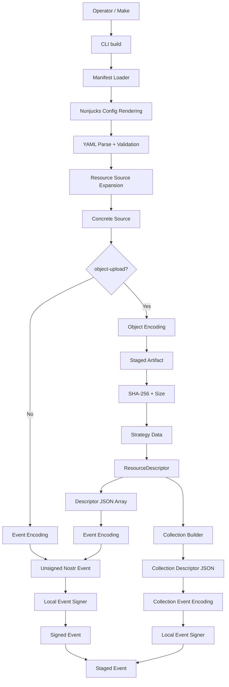
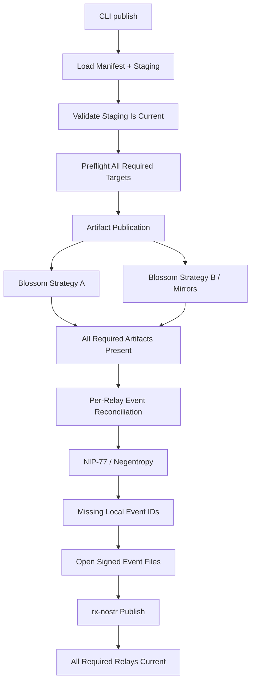
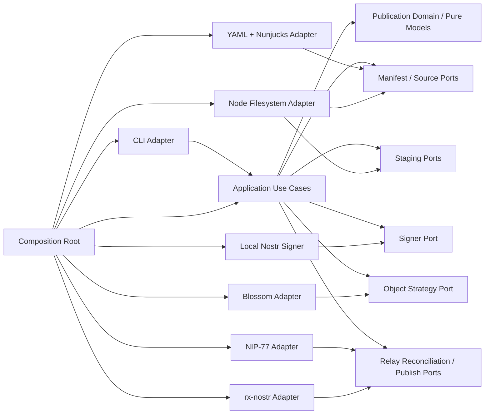

# KJVOnly Resource Publishing CLI Design and Implementation Specification

## Status

**Status:** Agreed Design — Implementation Pending  
**Scope:** Manifest-driven KJVOnly Resource authoring, local build/staging, Nostr event construction/signing, external object preparation, Blossom publication, Nostr synchronization, collection generation, architecture, testing, and definition of done  
**Application:** KJVOnly.bible  
**Date:** 2026-09-03

---

# 1. Purpose

This document defines the design and implementation requirements for the KJVOnly Resource Publishing CLI.

The CLI replaces the current Bash-oriented seed workflow with a scalable, manifest-driven Node/TypeScript tool.

The immediate operational requirement is seeding KJVOnly application Resources, but the CLI must not contain a special concept of:

```text
bootstrap
application defaults
Bible seeding
Strong's seeding
```

Those are repository/application workflows expressed through manifests and Make targets.

Conceptually:

```text
Make target / operator
        ↓
manifest
        ↓
KJVOnly CLI
        ↓
build signed deployment artifacts
        ↓
publish/synchronize artifacts
        ↓
Nostr relays + external object stores
```

The first major use case is replacing the current seed scripts, but the same tool must scale to Resources such as:

```text
Bible content
Strong's content
reading plans
dictionaries
notes
annotations
sermon audio/video
study collections
future KJVOnly Resource Types
```

The tool should scale primarily by adding source files and manifest definitions, not by adding one-off publishing scripts.

---

# 2. Source and Architectural Context

This specification builds on the KJVOnly Resource design captured in:

```text
20260829-Resource Selection, Acquisition, Bundles, and Module Context.md
20260830-resource-descriptor-resolution-design-spec.md
20260902-application-bootstrap-design-spec.md
```

Those specifications define the inbound Resource architecture.

This document defines the producer-side authoring/build/deployment workflow required to create Resources that the existing application can consume.

The CLI does not replace or redefine the inbound Resource lifecycle.

---

# 3. Existing Inbound Resource Lifecycle

The application consumes Resources through:

```text
Published Resource
    ↓
Resource Discovery
    ↓
Resource Representation
    ↓
Resource Resolution
    ↓
Verified Resource Content
    ↓
Resource Content Decoding
    ↓
Resource Handler
    ↓
Domain Interpretation
    ↓
Domain Validation
    ↓
Domain Installation
    ↓
Resource Receipt
```

The architecture separates:

```text
Discovery
    → which Published Resource exists?

Resolution
    → where/how are serialized bytes obtained?

Content Decoding
    → how are serialization/encoding layers removed?

Domain Interpretation
    → what Domain candidate does the decoded value represent?

Domain Validation
    → is that candidate valid?

Domain Installation
    → how should local Domain state change?
```

The publishing CLI operates on the opposite side of that boundary.

---

# 4. Producer-Side Resource Lifecycle

The CLI starts with source files and produces Published Resources.

```text
Source File
    ↓
Manifest Publication Definition
    ↓
Source Expansion
    ↓
Required Encoding
    ↓
Nostr Event Content
       or
External Object + ResourceDescriptor
    ↓
Nostr Event Construction
    ↓
NIP-01 Signing
    ↓
Signed Nostr Event
    ↓
Local Staging
    ↓
Publication
```

For external objects:

```text
Source File
    ↓
Object Encoding
    ↓
Artifact
    ↓
SHA-256
    ↓
External Publication Strategy
    ↓
ResourceDescriptor
    ↓
Descriptor Document
    ↓
Event Encoding
    ↓
Signed Nostr Event
```

---

# 5. CLI Is Not Bootstrap

Application bootstrap remains Application policy.

The CLI has no:

```text
kjvonly bootstrap
BootstrapPublisher
BootstrapResourceBuilder
ApplicationDefaultPublisher
```

Instead, the repository may define:

```make
seed-bootstrap:
	kjvonly sync ./zarf/manifests/bootstrap.yaml
```

The manifest defines the Resources used by bootstrap.

Therefore:

```text
bootstrap
    = repository/application meaning

CLI
    = generic manifest-driven build/publish mechanism
```

---

# 6. CLI Mission

The CLI owns generic mechanics for:

```text
loading publication manifests
expanding source files
encoding source content
constructing Nostr events
signing Nostr events
staging signed events
staging external artifacts
building ResourceDescriptor documents
building Resource collections
detecting local source changes
removing stale local build artifacts
publishing external objects
reconciling local Nostr events with relays
publishing missing Nostr events
```

The CLI does not own KJVOnly Domain interpretation or validation.

---

# 7. Runtime

The implementation uses:

```text
TypeScript
Node.js
```

This matches the wider project while remaining independent from browser-only Application services.

---

# 8. Reuse Boundary

Pure utilities may be reused where they fit, including:

```text
hex helpers
gzip helpers
Nostr types/crypto helpers
generic descriptor models
small Resource identifier helpers
serialization helpers
```

The CLI must not depend on browser/Application services such as:

```text
Application
ResourceWorkerClient
ResourceService
ResourceProcessor
IndexedDB stores
Domain installers
Workspace runtime
Resource Selection
application bootstrap orchestration
```

Do not force code reuse merely because both sides use TypeScript.

---

# 9. Protocol Compatibility Is More Important Than Service Reuse

The required symmetry is:

```text
CLI publishes valid Resource
        ↓
Application discovers/resolves/validates/installs it
```

The CLI and browser application do not need the same service graph.

The manifest author defines the publication contract.

The CLI faithfully builds it.

The application remains the consumer-side validator.

---

# 10. Resource Representations

KJVOnly currently recognizes:

```text
content
descriptors
```

## `content`

Serialized Resource content is carried directly by the Nostr Resource event.

Example:

```text
Chapter JSON
    ↓
gzip
    ↓
hex
    ↓
event.content
```

## `descriptors`

The event carries a descriptor document describing one or more independently resolvable Resources.

Example:

```text
large Chapter bundle
    ↓
Blossom
    ↓
ResourceDescriptor
    ↓
descriptor JSON
    ↓
hex
    ↓
event.content
```

A descriptor document is not Domain content.

---

# 11. ResourceDescriptor Context

A ResourceDescriptor conceptually contains:

```text
metadata
    publisher
    resourceId
    category
    modifiedAt
    mediaType

strategy
    type
    data
```

Generic strategy data remains opaque:

```ts
interface ResourceDescriptorStrategy {
    readonly type: string;
    readonly data: unknown;
}
```

Provider-specific location/integrity metadata belongs inside `strategy.data`.

---

# 12. Descriptor Is Self-Contained

A descriptor carries the Resource metadata required by Resolution.

The containing event publishes the descriptor document.

The descriptor itself identifies the Resource that will exist after resolution.

These identities must not be conflated.

---

# 13. Outer and Inner Media Types Are Different

A descriptors Resource has two media-type layers.

Example:

```text
outer event:
    m = application/json+hex

descriptor metadata:
    mediaType = application/json+gzip
```

The outer media type tells the application how to decode the descriptor document.

The inner media type tells it how to decode the resolved Resource bytes.

The CLI must keep them separate.

---

# 14. Manifest Is the Publisher Contract

The CLI does not infer KJVOnly Resource tags from a Resource-Type registry.

The manifest explicitly defines event tags.

Example:

```yaml
event:
  tags:
    - ["d", "kjvonly/bible/chapters/kjvs/${key}"]
    - ["m", "application/json+gzip+hex"]
    - ["t", "kjvonly/bible/chapters"]
    - ["representation", "content"]
```

The manifest author is responsible for those semantics.

---

# 15. Nostr Tag Naming

Inside an event the tag is:

```text
d
```

not:

```text
#d
```

`#d` is query/filter terminology.

Likewise event tags use:

```text
t
```

not `#t`.

---

# 16. Event Envelope Ownership

The manifest describes:

```text
event tags
event content encoding
```

The event builder/signer owns:

```text
pubkey
created_at
kind
content
tags
id
sig
```

The manifest must not directly provide:

```text
id
sig
pubkey
created_at
```

---

# 17. Kind Is Inherited

The manifest defines the Nostr kind once:

```yaml
kind: 37770
```

Resources and collections inherit it.

Per-Resource kind override is not required in v1.

---

# 18. Signing Key

The Nostr private key comes only from the runtime shell environment:

```text
NOSTR_SECRET_KEY
```

Example:

```bash
export NOSTR_SECRET_KEY='...'
kjvonly build ./bootstrap.yaml
```

It must never be persisted or templated.

---

# 19. `.env` Is Non-Secret Configuration

`.env` may contain non-secret operational values such as:

```text
relay URLs
Blossom URLs
paths
deployment configuration
```

The CLI must reject:

```text
NOSTR_SECRET_KEY
```

if it appears in an `.env` file.

The signer reads the secret directly from the runtime environment.

---

# 20. Jinja-Style Manifest Rendering

The manifest should have a Helm/Jinja feel.

Use Nunjucks or an equivalent Node-compatible Jinja-style renderer.

Example:

```yaml
nostr:
  relays:
    - "{{ env.NOSTR_RELAY_PRIMARY }}"
    - "{{ env.NOSTR_RELAY_SECONDARY }}"
```

This renderer is for manifest/configuration templating.

---

# 21. Nunjucks Does Not Enumerate Files

Filesystem enumeration is a CLI concern.

Nunjucks is not responsible for:

```text
walking Resource directories
deriving keys
producing one event per file
```

The documented lifecycle is:

```text
render configuration
    ↓
parse YAML
    ↓
CLI resolves path
    ↓
CLI expands concrete files
    ↓
CLI expands ${key}
```

---

# 22. `${key}` Is CLI Interpolation

Per-file interpolation uses:

```text
${key}
```

not Jinja syntax.

Example:

```yaml
- ["d", "kjvonly/bible/chapters/kjvs/${key}"]
```

For:

```text
1_1.json.gz
```

the CLI derives:

```text
key = 1_1
```

and emits:

```text
kjvonly/bible/chapters/kjvs/1_1
```

Nunjucks must leave `${key}` unchanged.

---

# 23. Safe Template Context

The renderer must not receive `process.env` blindly.

Its `env` object contains permitted non-secret configuration.

It must explicitly exclude:

```text
NOSTR_SECRET_KEY
```

The signer gets that value through a separate runtime path.

---

# 24. Manifest Load Order

```text
read manifest text
    ↓
load non-secret .env
    ↓
merge permitted runtime environment
    ↓
render Jinja/Nunjucks configuration
    ↓
parse YAML
    ↓
validate schema
    ↓
expand source paths
    ↓
apply ${key} per concrete source
```

---

# 25. Initial Manifest Root

```yaml
version: 1

kind: 37770

staging:
  path: ./.kjvonly

nostr:
  relays:
    - "{{ env.NOSTR_RELAY_PRIMARY }}"
    - "{{ env.NOSTR_RELAY_SECONDARY }}"

defaults:
  strategy: primary

strategies:
  primary:
    type: blossom
    urls:
      - "{{ env.BLOSSOM_PRIMARY }}"
      - "{{ env.BLOSSOM_SECONDARY }}"

  archive:
    type: blossom
    urls:
      - "{{ env.BLOSSOM_ARCHIVE }}"

resources:
  # Resource definitions

collections:
  # Collection definitions
```

---

# 26. Manifest Version

`version: 1` is required.

Unknown versions fail validation.

Do not silently interpret future manifests as v1.

---

# 27. Relative Paths

Relative manifest paths resolve relative to the manifest file directory, not the caller's current shell directory.

This applies to:

```text
staging.path
resource.path
```

This rule must be tested.

---

# 28. Staging Root

The CLI owns:

```text
<staging>/
├── events/
└── artifacts/
```

The manifest configures only the root path in v1.

---

# 29. Nostr Relays Are a List

```yaml
nostr:
  relays:
    - wss://relay-a.example
    - wss://relay-b.example
```

All Resources inherit this relay set.

No per-Resource relay override is required in v1.

---

# 30. Publication Is Strict Across Relays

Every configured relay is required.

Success means the required staged state is present/published across all configured relays.

No initial:

```text
quorum
best effort
preferred relay only
```

policy exists.

---

# 31. Named Strategies

External publication strategies are named:

```yaml
strategies:
  primary:
    type: blossom
    urls:
      - ...
```

The manifest name expresses deployment policy.

The explicit `type` selects implementation.

---

# 32. Strategy Type Is Explicit

The initial supported type is:

```yaml
type: blossom
```

This aligns with the application-side `ResourceDescriptorStrategy.type`.

Do not hardcode Blossom logic throughout application services.

---

# 33. One Strategy, Many Blossom URLs

A Resource chooses one strategy.

A Blossom strategy may contain many physical mirrors:

```yaml
urls:
  - https://blossom-a.example
  - https://blossom-b.example
```

This means:

```text
one logical resolution strategy
    ↓
multiple physical locations
```

It does not mean multiple generic ResourceDescriptor strategies.

---

# 34. Default Strategy

The manifest may declare:

```yaml
defaults:
  strategy: primary
```

An `object-upload` without an explicit strategy inherits it.

---

# 35. Named Strategies Express Storage Policy

Example:

```yaml
strategies:
  interactive:
    type: blossom
    urls:
      - "{{ env.FAST_BLOSSOM_1 }}"
      - "{{ env.FAST_BLOSSOM_2 }}"

  archive:
    type: blossom
    urls:
      - "{{ env.SLOW_ARCHIVE_BLOSSOM }}"
```

A sermon can use `archive`.

A Bible bundle can use `interactive`.

Generic code does not understand what those names mean.

---

# 36. Future Strategy Types

The manifest architecture must allow future:

```text
type: nostr
type: ...
```

without changing Resource definition shape.

A future descriptor may point to another Nostr content Resource.

The exact future strategy contract is out of scope.

Do not invent it during v1.

---

# 37. Basic Resource Definition

```yaml
resources:
  bible-chapters-kjvs:
    path: ./data/chapters

    event:
      encoding:
        - hex

      tags:
        - ["d", "kjvonly/bible/chapters/kjvs/${key}"]
        - ["m", "application/json+gzip+hex"]
        - ["t", "kjvonly/bible/chapters"]
        - ["representation", "content"]
```

The manifest Resource name is local authoring identity only.

---

# 38. Manifest Resource Name

Names such as:

```text
bible-chapters-kjvs
```

are used for:

```text
staging namespace
collection references
build reporting
dependency graph
local reconciliation
```

They are not published Resource identity.

---

# 39. `path` May Be a File

```yaml
path: ./data/kjvs.json.gz
```

A file expands to one source item.

The filename produces the key.

---

# 40. `path` May Be a Directory

```yaml
path: ./data/chapters
```

A directory expands every direct regular non-hidden file.

Example:

```text
1_1.json.gz → key 1_1
1_2.json.gz → key 1_2
1_3.json.gz → key 1_3
```

---

# 41. Directory Expansion Is Non-Recursive

v1 does not recursively traverse nested directories.

Do not invent nested-path Resource identity semantics.

---

# 42. Hidden Files

Dotfiles such as:

```text
.DS_Store
.gitkeep
```

must not become Resources.

---

# 43. Key Derivation

The filename is the Resource-source key.

The extension chain is stripped.

Examples:

```text
1_1.json.gz   → 1_1
H7225.json.gz → H7225
sermon-001.mp3 → sermon-001
```

Extensions have no Resource identity meaning.

---

# 44. Dots and Key Collisions

v1 treats dots as extension separators for file-backed keys.

Two files that strip to the same key are an error.

Never silently overwrite a colliding source.

---

# 45. Deterministic Ordering

Expanded directory files are processed in lexical order.

This stabilizes:

```text
logs
collections
tests
failure reporting
```

---

# 46. Event Block

Every Resource has:

```yaml
event:
  encoding: [...]
  tags: [...]
```

The event block describes how the Nostr Resource event is built.

---

# 47. Event Encoding Meaning

`event.encoding` means:

> transforms still required before bytes become `event.content`.

It does not describe transforms already present in the source.

---

# 48. Existing `.json.gz` Chapter Example

Given:

```text
1_1.json.gz
```

and:

```yaml
event:
  encoding:
    - hex

  tags:
    - ["m", "application/json+gzip+hex"]
```

the builder does:

```text
read gzip bytes
    ↓
hex encode
    ↓
event.content
```

It does not:

```text
gunzip
parse JSON
serialize
gzip again
```

---

# 49. Media Type Is Explicit

The CLI does not infer final media type from:

```text
extension
encoding list
source bytes
```

The manifest author writes the final `m` tag explicitly.

Example:

```yaml
- ["m", "application/json+gzip+hex"]
```

---

# 50. Encoding Order

```yaml
encoding:
  - gzip
  - hex
```

means:

```text
source bytes
    ↓
gzip
    ↓
hex
```

An empty list means no remaining transformation.

---

# 51. Initial Encoding Operations

v1 must support:

```text
gzip
hex
```

Use small composable encoders.

Do not build one Resource-Type-specific encoder.

---

# 52. Binary-Safe Source Reading

Sources are bytes, not assumed UTF-8 text.

Required inputs include:

```text
.json.gz
.mp3
.mp4
binary archives
```

---

# 53. Nostr Event Content Is Text

Binary inline Resource bytes need a textual transport encoding.

Current KJVOnly binary inline Resources use:

```text
hex
```

---

# 54. `object-upload` Block

Descriptor-backed Resources contain:

```yaml
object-upload:
```

This describes preparation/publication of the underlying Resource object.

The ResourceDescriptor is generated output.

---

# 55. Why `object-upload`

Lifecycle:

```text
source
    ↓
object-upload
    ↓
external artifact
    ↓
strategy publication
    ↓
ResourceDescriptor
```

The block configures the uploadable object, not the descriptor JSON itself.

---

# 56. Descriptor-Backed Example

```yaml
resources:
  bible-bundle-kjvs:
    path: ./data/kjvs.json.gz

    event:
      encoding:
        - hex

      tags:
        - ["d", "kjvonly/bible/chapters/kjvs"]
        - ["m", "application/json+hex"]
        - ["t", "kjvonly/bible/chapters"]
        - ["representation", "descriptors"]

    object-upload:
      mediaType: application/json+gzip
      encoding: []
      strategy: primary
```

Flow:

```text
kjvs.json.gz
    ↓
external bytes unchanged
    ↓
SHA-256
    ↓
Blossom strategy
    ↓
ResourceDescriptor
    ↓
JSON descriptor array
    ↓
hex
    ↓
event.content
```

---

# 57. Object Upload Media Type

`object-upload.mediaType` becomes:

```text
ResourceDescriptor.metadata.mediaType
```

It describes the bytes returned by Resource Resolution.

It is explicit and not extension-derived.

---

# 58. Object Upload Encoding

`object-upload.encoding` means transforms still required before the source becomes the externally published object.

Example:

```yaml
encoding: []
```

means already-final bytes.

Example:

```yaml
encoding:
  - gzip
```

means gzip before external publication.

---

# 59. Two Independent Encoding Pipelines

Descriptor-backed Resources have:

```text
source
    ↓
object-upload.encoding
    ↓
external artifact
```

and separately:

```text
ResourceDescriptor[]
    ↓
JSON
    ↓
event.encoding
    ↓
event.content
```

Do not conflate these.

---

# 60. Current Descriptor Event Encoding

Current KJVOnly descriptor documents should normally be:

```text
JSON
    ↓
hex
```

Typical event tags:

```yaml
- ["m", "application/json+hex"]
- ["representation", "descriptors"]
```

Descriptor documents normally do not need gzip.


---

# 61. Strategy Selection

`object-upload` selects a named strategy:

```yaml
object-upload:
  strategy: archive
```

If omitted, it inherits the manifest default strategy.

Unknown strategy names fail manifest validation.

---

# 62. Blossom Artifact Generation

For a Blossom strategy:

```text
prepared external bytes
    ↓
SHA-256
    ↓
artifact size
    ↓
configured Blossom mirrors
    ↓
ResourceDescriptorStrategy
```

SHA-256 is calculated when a new artifact must be built.

It is not used as the routine unchanged-source detector.

---

# 63. Multiple Blossom URLs in Descriptor Data

The generated Blossom strategy data must support multiple locations.

Conceptually:

```json
{
  "type": "blossom",
  "data": {
    "urls": [
      "https://blossom-a.example/<sha256>",
      "https://blossom-b.example/<sha256>"
    ],
    "sha256": "<sha256>",
    "size": 123456
  }
}
```

One descriptor still has one strategy object.

---

# 64. Consumer Compatibility Change

The existing application-side Blossom resolver historically used a singular:

```text
url
```

The consumer must be updated to understand:

```text
urls: string[]
```

before multi-Blossom descriptors are considered fully integrated.

This is a companion change to the CLI milestone.

Do not model each Blossom mirror as a separate generic ResourceDescriptor strategy.

---

# 65. Descriptor Metadata Derivation

When `object-upload` is present, the builder generates ResourceDescriptor metadata from the concrete publication.

Conceptually:

```text
publisher
    → pubkey derived from NOSTR_SECRET_KEY

resourceId
    → concrete rendered d tag

category
    → concrete rendered t tag

modifiedAt
    → new Resource revision time

mediaType
    → object-upload.mediaType
```

The builder must have enough concrete manifest data to produce a valid descriptor.

---

# 66. Concrete Tag Values Drive Descriptor Identity

If the manifest contains:

```yaml
- ["d", "kjvonly/bible/chapters/kjvs/${key}"]
```

then `1_1.json.gz` produces:

```text
descriptor.metadata.resourceId =
kjvonly/bible/chapters/kjvs/1_1
```

`${key}` must never remain unresolved in generated metadata.

---

# 67. Descriptor Category

The descriptor category comes from the concrete `t` tag.

Example:

```yaml
- ["t", "kjvonly/bible/chapters"]
```

becomes:

```text
descriptor.metadata.category =
kjvonly/bible/chapters
```

If descriptor metadata cannot be determined unambiguously, build fails.

---

# 68. Descriptor Revision Time

A newly built descriptor-backed Resource receives a new `modifiedAt`.

The outer Nostr event receives a new `created_at`.

When replacing a staged event within the same second, ensure the replacement is strictly later than the previous staged event.

Conceptually:

```text
created_at =
max(
    current epoch second,
    previous created_at + 1
)
```

The same revision may be used for descriptor `modifiedAt` where appropriate.

---

# 69. Filesystem Time Is Local Build Metadata

Source file:

```text
mtime
```

is used for incremental local change detection.

It is not the authoritative Resource revision published to consumers.

This avoids filesystem timestamp quirks accidentally producing older Resources.

---

# 70. Signed Events Are Staged Deployment Artifacts

`kjvonly build` produces fully signed Nostr event JSON files.

The deployment artifact is:

```text
signed Nostr event
```

not an unsigned template that is re-signed during publication.

This yields a clean two-phase workflow:

```text
BUILD
    → create current signed local deployment state

PUBLISH
    → synchronize that exact state to network targets
```

---

# 71. `build` Is Offline Publication Preparation

```bash
kjvonly build <manifest>
```

must not publish to:

```text
Nostr
Blossom
```

It may read:

```text
manifest
.env
runtime signing key
source filesystem
staging filesystem
```

and write:

```text
signed events
external artifacts
```

---

# 72. `publish` Publishes Existing Staging

```bash
kjvonly publish <manifest>
```

publishes the staged state.

It must not silently rebuild changed source files.

If source/manifest state no longer matches staging, publication should fail with a clear stale-build diagnostic.

---

# 73. `sync` Composes Build and Publish

```bash
kjvonly sync <manifest>
```

means:

```text
build
    ↓
publish
```

This is the expected command for Make seed targets.

The implementation must reuse the same `build` and `publish` use cases rather than duplicating their behavior inside `sync`.

---

# 74. Initial Command Surface

Required v1 commands:

```text
kjvonly build <manifest>
kjvonly publish <manifest>
kjvonly sync <manifest>
```

Possible future commands:

```text
get
download
inspect
verify
```

are not required for the initial milestone.

---

# 75. Staging Layout

The staging root uses:

```text
<staging>/
├── events/
└── artifacts/
```

Each manifest Resource name creates its own namespace.

Example:

```text
events/bible-chapters-kjvs/
artifacts/bible-bundle-kjvs/
```

This prevents local key collisions between unrelated Resource definitions.

---

# 76. Staged Event Filename

For a file-backed Resource, the event filename contains:

```text
key
source mtime
source size
definition revision
event ID
```

Conceptually:

```text
<key>--<mtimeMs>--<sourceSize>--<definitionRevision>--<eventId>.json
```

Example:

```text
1_1--1788461234123--18453--71a3cbd1--4de85ea7e103....json
```

A simple directory listing exposes the local event IDs.

---

# 77. Why Source Size Is Included

`mtime + size` is a cheap source revision signal.

It allows the builder to skip reading/hashing unchanged large files.

A changed source usually changes:

```text
mtime
size
or both
```

No full content hash is required merely to decide whether to attempt rebuild.

---

# 78. Manifest Changes Must Invalidate Staging

Source metadata alone is not enough.

A Resource must rebuild if build-affecting publication configuration changes, such as:

```text
kind
event.encoding
event.tags
object-upload.encoding
object-upload.mediaType
selected strategy data represented in the descriptor
publisher pubkey
```

The implementation therefore computes a small stable fingerprint of the relevant rendered definition.

This hashes small configuration data, not source payloads.

---

# 79. Definition Revision Fingerprint

The staged event filename includes a short:

```text
definitionRevision
```

derived from canonicalized build-affecting configuration.

This is local build metadata only.

It is not:

```text
Resource identity
event identity
descriptor integrity
```

The final signed event ID remains the Nostr identity.

---

# 80. Artifact Filename

Staged external artifacts contain:

```text
key
source mtime
source size
artifact-definition revision
SHA-256
source/readability extension
```

Conceptually:

```text
<key>--<mtimeMs>--<sourceSize>--<artifactRevision>--<sha256><extension>
```

Example:

```text
kjvs--1788461234123--4800000--34be4c21--a05b...9fc.json.gz
```

---

# 81. Artifact Definition Revision

Only configuration that changes external artifact bytes should invalidate the artifact.

Examples:

```text
object-upload.encoding
```

Changes to:

```text
Nostr relay list
outer event tags
outer event encoding
created_at
```

must not force a large unchanged object to be regenerated.

This separation allows event/descriptor changes while reusing the content-addressed artifact.

---

# 82. Artifact Extensions Are Informational

Artifact filename extensions exist only for human usability.

They are not used for:

```text
identity
media type inference
integrity
remote comparison
```

The manifest media type and SHA-256 remain authoritative.

---

# 83. Zero-Copy Artifact Staging

If:

```yaml
object-upload:
  encoding: []
```

the source bytes are already the final external bytes.

The CLI should avoid copying large files.

The staged artifact may be a symbolic link to the source.

This is especially important for future:

```text
MP3
MP4
large archives
```

---

# 84. Transformed Artifacts Are Materialized

If object encoding changes bytes:

```yaml
object-upload:
  encoding:
    - gzip
```

the generated artifact is a real staged file.

Rule:

```text
identity transform
    → symlink

byte-changing transform
    → materialized artifact
```

No extra manifest flag is needed.

---

# 85. Source Change Updates Symlink

When source metadata changes:

```text
find staged artifact by Resource name + key
    ↓
replace old current artifact entry
    ↓
build/relink current artifact
```

Normal build reconciliation therefore updates a symlink whenever the source changes.

---

# 86. Source Mutation Between Build and Publish

The remaining symlink race is:

```text
build
    ↓
source changes
    ↓
publish
```

Before uploading a symlink-backed artifact, publish validates that the target still matches the staged source revision metadata.

If not:

```text
staging is stale
    ↓
publish fails
```

It must never knowingly upload bytes that contradict the staged SHA/descriptor.

---

# 87. Current-State Staging, Not History

`events/` and `artifacts/` represent the current desired local deployment state.

They are not publication history.

For each:

```text
manifest Resource + key
```

there is at most one current staged event and one current staged artifact where applicable.

---

# 88. Local Event Replacement

When a Resource changes:

```text
find current event by Resource name + key
    ↓
create replacement successfully
    ↓
remove/replace old current entry
    ↓
write new signed event
```

Old event history is not retained in current staging.

---

# 89. Local Artifact Replacement

When an external object changes:

```text
find current artifact by Resource name + key
    ↓
create/link replacement
    ↓
remove/replace old current entry
```

A future archive feature is separate from current-state staging.

---

# 90. Removed Source Files Are Reconciled

Build maps:

```text
current source keys
vs
current staged keys
```

A staged key absent from the source set is removed locally:

```text
delete staged event
delete staged artifact/link if present
```

---

# 91. Local Removal Never Deletes Remote Data

Source deletion does not automatically cause:

```text
Nostr deletion event
Blossom deletion
remote tombstone
```

Remote deletion requires a separate explicit future workflow.

This protects against accidental destructive publication caused by local file deletion.

---

# 92. Incremental Build Decision

For each concrete source:

```text
key
    ↓
find current staged state
    ↓
mtime + size match?
    ↓
definition revision match?
    ├── yes → reuse
    └── no  → rebuild/replace
```

New key:

```text
build
```

Removed key:

```text
remove local staged state
```

---

# 93. Do Not Hash Every Unchanged Source

Routine incremental build must not SHA-256 all source files.

Cheap local change detection uses:

```text
key
mtime
size
definition revision
```

SHA-256 is computed for a new/changed external artifact because Blossom descriptor integrity requires it.

---

# 94. Reuse Unchanged Signed Events

If:

```text
source revision unchanged
definition revision unchanged
publisher unchanged
```

the existing signed event is reused.

Do not re-sign unchanged file-backed Resources on every build.

This preserves:

```text
event ID
created_at
minimal relay diff
```

---

# 95. Replaceable Resource Rebuild

When source/publication state changes:

```text
old staged event identified by key
    ↓
new event body constructed
    ↓
created_at advanced
    ↓
event signed
    ↓
new event ID produced
    ↓
current staged event replaced
```

Relay-side `d`-tagged replaceable/addressable event semantics handle network replacement later.

---

# 96. Event ID Is Relay Synchronization Identity

Nostr event IDs already commit to the event.

The publish phase uses event IDs directly.

```text
local staged IDs
    -
remote relay IDs
    =
events to publish
```

Do not create another remote publication fingerprint system.

---

# 97. Local Replacement Lookup Uses Key

Local replacement does not require knowing the prior event ID.

The builder looks up:

```text
manifest Resource name + key
```

then removes/replaces the currently staged file.

The event ID remains encoded in the filename for visibility and network synchronization.

---

# 98. Atomic Local Writes

Staged event files and generated artifacts should be written atomically where practical.

Preferred pattern:

```text
write temp
    ↓
close/finish
    ↓
rename into final location
```

A failed build should not leave a partially written file that `publish` later treats as valid.

---

# 99. Safe Replacement Ordering

Prefer:

```text
build replacement successfully
    ↓
atomically replace old current entry
```

rather than deleting known-good staging before the replacement exists.

Logical semantics remain one current entry per key.

---

# 100. Collections Are Root-Level Definitions

Collections live at:

```yaml
collections:
```

They do not live beside `event` and `object-upload` within a Resource definition.

A collection is an assembly operation.

It is not a third Resource representation.

---

# 101. Collection Is Not a Dedicated Domain

A collection assembles:

```text
ResourceDescriptor[]
```

and publishes the descriptor document as a normal Resource event.

It does not require a separate Bundle/Collection Domain Object merely to participate in Resource Resolution.

---

# 102. Collection Definition

Example:

```yaml
collections:
  application-defaults:
    event:
      encoding:
        - hex

      tags:
        - ["d", "kjvonly/resources/collections/default"]
        - ["m", "application/json+hex"]
        - ["t", "kjvonly/resources/collections"]
        - ["representation", "descriptors"]

    resources:
      - bible-bundle-kjvs
      - strongs-kjvs
```

---

# 103. Collections Reference Manifest Resource Names

A collection member:

```yaml
- bible-bundle-kjvs
```

means:

```text
resolve manifest Resource definition
    ↓
obtain its generated current ResourceDescriptor(s)
    ↓
include them in collection
```

Collections do not manually copy descriptor JSON or raw source paths.

---

# 104. Directory Resource in Collection

If a referenced manifest Resource expands a directory and every concrete Resource produces a descriptor, the collection includes all generated descriptors.

The order follows deterministic source ordering.

---

# 105. v1 Collection Members Must Produce Descriptors

The first collection implementation consumes generated ResourceDescriptors.

Therefore referenced v1 members must use an `object-upload`/strategy path that produces descriptors.

A future Nostr-backed descriptor strategy can expand what may participate without changing collection semantics.

---

# 106. Collection Dependency Order

Build ordering follows dependencies:

```text
build leaf Resources
    ↓
build external artifacts
    ↓
generate descriptors
    ↓
build collections
```

No hardcoded Bible/Strong's/bootstrap sequence exists.

---

# 107. Collections May Rebuild Every Build

Collection documents are small.

v1 may regenerate and re-sign collection events on every `build`.

This is an intentional simplification.

Do not add a complex collection cache merely to avoid a tiny replaceable event.

---

# 108. Collection Staging

Collections have no single source-file `mtime + size`.

A collection event may use:

```text
events/__collections__/<collection-name>--<eventId>.json
```

or an equivalent clearly namespaced path.

The collection manifest name is the local replacement key.

---

# 109. Collection Publication Churn Is Acceptable

Because collections are small and expected to be relatively few, a new collection event ID per build is acceptable in v1.

If future usage creates thousands of large collection documents, optimize based on measurements.

---

# 110. Collection Descriptor Data Reflects Current Strategy State

Collections consume the current generated descriptors.

Therefore they automatically capture:

```text
current publisher
current Resource IDs
current categories
current modifiedAt
current media types
current SHA-256
current size
current Blossom mirror URLs
```

Changing a Blossom URL should rebuild affected descriptor events/collections while reusing unchanged external bytes.

---

# 111. Build Result

The build application layer returns structured data such as:

```text
built events
reused events
removed events
built artifacts
reused artifacts
removed artifacts
built collections
warnings
failures
```

The use case does not print directly to stdout.

The CLI adapter formats the result.

---

# 112. Publish Result

The publish application layer returns per-target structured outcomes.

Example:

```text
artifact X
    Blossom A → already present
    Blossom B → uploaded

event Y
    relay A → already present
    relay B → published
```

Failure results identify the concrete target.

---

# 113. Publish Preflight

Before network mutation, `publish` checks every required endpoint.

Required endpoints include:

```text
all configured Nostr relays
all configured/referenced Blossom servers
```

If any required endpoint is unavailable:

```text
fail
publish nothing
```

---

# 114. Strict Target Policy

The initial policy is:

```text
every configured target required
```

There is no:

```text
quorum
best effort
one-of-many success
```

policy in v1.

This is especially important for seeding/bootstrap workflows.

---

# 115. Failure After Preflight

A network can fail after a successful preflight.

Partial remote mutation may therefore occur.

If that happens:

```text
command exits non-zero
```

A rerun safely reconciles already-present content and continues.

Do not implement distributed rollback.

---

# 116. Publication Order

Required order:

```text
1. external artifacts
2. Nostr events
```

A descriptor event must not be published before the CLI has ensured its referenced external object exists on every required object server.

---

# 117. Blossom Publication Flow

For each staged artifact:

```text
known SHA-256
    ↓
each configured strategy URL
    ↓
object already present?
    ├── yes → skip upload
    └── no  → upload
```

Use Blossom protocol behavior through a dedicated adapter.

---

# 118. Blossom Replication

The same content-addressed artifact is ensured at every URL of the chosen strategy.

```text
artifact SHA X

strategy:
    server A
    server B

publish:
    ensure X at A
    ensure X at B
```

The descriptor contains all locations.

---

# 119. Artifact Integrity During Publish

Before a symlink-backed upload, validate the source still matches the staged source revision.

The expected SHA is already known from build.

The publisher must not knowingly upload bytes that no longer correspond to that staged artifact.

Avoid an unconditional full rehash of every unchanged huge object unless correctness requires it for a concrete case.

---

# 120. Nostr Event Synchronization

The Nostr publish phase reconciles staged event IDs with each configured relay.

The intended efficient mechanism is:

```text
NIP-77 / Negentropy
```

for event-set synchronization.

Actual event transfer remains normal Nostr event publication.


---

# 121. Negentropy Responsibility

Conceptually:

```text
local event ID set
        ↕
relay event ID set
    Negentropy
        ↓
local IDs missing remotely
        ↓
publish corresponding signed events
```

The CLI must not invent its own generic set-reconciliation protocol.

If the selected implementation library cannot support the required NIP-77 flow with the current relay stack, stop and revisit that adapter rather than silently substituting a materially different synchronization policy.

---

# 122. Relay Event Transfer

After reconciliation, missing events are published as ordinary signed Nostr events.

The current expected Nostr client infrastructure is:

```text
rx-nostr
```

Reuse it for relay connection/publication behavior where it fits.

Do not recreate raw relay WebSocket/event publication logic inside application use cases.

---

# 123. Relay Authentication

The relay adapter must support the existing relay authentication requirements used by the project, including NIP-42 AUTH where required.

The local signer has the publisher secret available through the signer port.

Authentication mechanics remain inside the Nostr adapter.

---

# 124. Reconciliation Is Per Relay

Each relay has independent state.

A staged event may already exist on one relay and be missing from another.

The publish result tracks each relay independently.

Overall success requires all configured relays to reach the required state.

---

# 125. Replaceable Event Behavior

KJVOnly Resource events use `d`-tagged replaceable/addressable event semantics.

If:

```text
local staging:
    replacement event B

relay:
    older event A
```

then:

```text
event ID B missing remotely
    ↓
publish B
    ↓
relay replacement semantics make B current
```

The CLI does not need a network-side "delete/replace A" operation.

---

# 126. Remote-Only Events

Negentropy/query results may show events that exist remotely but not in the current manifest staging state.

Ordinary `publish`:

```text
does not delete them
does not download them
does not recreate them locally
```

Remote-only state is ignored unless a future explicit command gives it meaning.

---

# 127. Signed Event Files

Each staged event file contains one complete signed Nostr event.

Example shape:

```json
{
  "id": "...",
  "pubkey": "...",
  "created_at": 0,
  "kind": 37770,
  "tags": [],
  "content": "...",
  "sig": "..."
}
```

It must be publishable as-is.

`publish` must not modify or re-sign it.

---

# 128. Publisher Pubkey

The publisher pubkey is derived from:

```text
NOSTR_SECRET_KEY
```

The manifest does not need a second authoritative publisher field.

Generated ResourceDescriptor metadata uses the derived pubkey.

---

# 129. Signer Port

The application layer should depend on a narrow signer abstraction.

Conceptually:

```ts
interface EventSigner {
    getPublicKey(): Promise<string>;

    sign(
        event:
            UnsignedNostrEvent
    ): Promise<SignedNostrEvent>;
}
```

The exact type names may differ.

The initial adapter is local secret-key signing only.

---

# 130. No Additional Signer Types in v1

Do not implement:

```text
NIP-46
browser extension signer
hardware signer
bunker signer
```

as part of this milestone.

The architecture should not block future signer adapters, but no speculative implementation is required.

---

# 131. Complete Bootstrap-Oriented Manifest Example

A manifest that happens to define application bootstrap inputs may look like:

```yaml
version: 1

kind: 37770

staging:
  path: ./.kjvonly

nostr:
  relays:
    - "{{ env.NOSTR_RELAY_PRIMARY }}"
    - "{{ env.NOSTR_RELAY_SECONDARY }}"

defaults:
  strategy: primary

strategies:
  primary:
    type: blossom
    urls:
      - "{{ env.BLOSSOM_PRIMARY }}"
      - "{{ env.BLOSSOM_SECONDARY }}"

resources:
  bible-chapters-kjvs:
    path: ./data/chapters

    event:
      encoding:
        - hex

      tags:
        - ["d", "kjvonly/bible/chapters/kjvs/${key}"]
        - ["m", "application/json+gzip+hex"]
        - ["t", "kjvonly/bible/chapters"]
        - ["representation", "content"]

  bible-bundle-kjvs:
    path: ./data/kjvs.json.gz

    event:
      encoding:
        - hex

      tags:
        - ["d", "kjvonly/bible/chapters/kjvs"]
        - ["m", "application/json+hex"]
        - ["t", "kjvonly/bible/chapters"]
        - ["representation", "descriptors"]

    object-upload:
      mediaType: application/json+gzip
      encoding: []

  strongs-kjvs:
    path: ./data/strongs.json.gz

    event:
      encoding:
        - hex

      tags:
        - ["d", "kjvonly/strongs/definitions/kjvs"]
        - ["m", "application/json+hex"]
        - ["t", "kjvonly/strongs/definitions"]
        - ["representation", "descriptors"]

    object-upload:
      mediaType: application/json+gzip
      encoding: []

collections:
  application-defaults:
    event:
      encoding:
        - hex

      tags:
        - ["d", "kjvonly/resources/collections/default"]
        - ["m", "application/json+hex"]
        - ["t", "kjvonly/resources/collections"]
        - ["representation", "descriptors"]

    resources:
      - bible-bundle-kjvs
      - strongs-kjvs
```

The CLI does not know this manifest means bootstrap.

---

# 132. Example Sermon Resource

A large sermon set can use archive storage:

```yaml
resources:
  sermons:
    path: ./data/sermons

    event:
      encoding:
        - hex

      tags:
        - ["d", "kjvonly/sermons/audio/default/${key}"]
        - ["m", "application/json+hex"]
        - ["t", "kjvonly/sermons/audio"]
        - ["representation", "descriptors"]

    object-upload:
      mediaType: audio/mpeg
      encoding: []
      strategy: archive
```

For an MP3, the staged external artifact may be a symlink because no transform is required.

The event content is the generated descriptor JSON, not the MP3.

---

# 133. Supplemental Tags

Any additional publisher-required Nostr tags may be placed directly into `event.tags`.

Example:

```yaml
event:
  tags:
    - ["d", "..."]
    - ["m", "..."]
    - ["t", "..."]
    - ["representation", "content"]
    - ["language", "en"]
    - ["speaker", "example"]
```

The CLI does not need a separate supplemental-tag subsystem.

---

# 134. Duplicate Tags

Nostr permits repeated tag names in general.

Do not globally reject repeated names without a protocol-specific reason.

However, descriptor generation requires unambiguous concrete metadata for the fields it derives.

If the builder cannot determine a unique Resource identity/category needed for descriptor metadata, build fails.

---

# 135. Manifest Validation Philosophy

Manifest data starts as:

```text
unknown
```

and becomes a trusted typed model only after validation.

Do not use unchecked casts such as:

```ts
yaml.parse(...) as Manifest
```

Validation should fail early and identify the relevant manifest Resource/collection/strategy.

---

# 136. Structural Manifest Validation

Required validation includes:

```text
version exists and supported
kind exists and valid
staging path valid
Nostr relay list non-empty
strategy names unique
strategy type supported
Blossom URL list non-empty
default strategy exists
Resource names unique
collection names unique
Resource path exists
event block valid
encoding names supported
tag entries valid Nostr tag arrays
object-upload mediaType present
object-upload strategy exists
collection member exists
```

---

# 137. Concrete Build Validation

After source expansion, validate:

```text
no stripped-key collisions
no unresolved ${key}
staged filenames parse correctly
staged signed event JSON is valid
staged event publisher matches current signer when reused
descriptor metadata can be constructed
required collection descriptors exist
```

---

# 138. Protocol Validation Boundary

The CLI validates what it must know to build correctly.

It does not recreate full KJVOnly Domain validation.

It does not parse/validate:

```text
Bible Chapter schema
Strong's schema
Reading Plan schema
Dictionary schema
sermon metadata schema
```

unless a future publisher requirement explicitly adds that responsibility.

---

# 139. Manifest Author Owns Resource Semantics

The CLI must not have a hardcoded table such as:

```text
Bible Chapter:
    d prefix = ...
    t = ...
    m = ...
    representation = ...

Strong's:
    ...
```

The manifest supplies those contracts.

This is the primary extensibility mechanism.

---

# 140. CLI Output

Human-readable output should be concise and operational.

Example:

```text
Build

Resources
  built      12
  reused   1177
  removed     1

Artifacts
  built       2
  reused      8
  removed     0

Collections
  built       1
```

Publication should similarly summarize per-target outcomes.

---

# 141. No Interactive Confirmation by Default

Commands must be automation-friendly.

Do not require:

```text
Publish? [y/N]
```

for normal operation.

An explicit CLI command is sufficient operator intent.

---

# 142. Structured Use-Case Results

Build and publish use cases return structured results.

CLI formatting is an adapter concern.

This leaves room for later:

```text
--json
CI integration
machine-readable reporting
```

without changing core application behavior.

---

# 143. Error Categories

Useful failure categories include:

```text
manifest rendering
manifest validation
source expansion
encoding
artifact staging
descriptor generation
event construction
signing
stale staging
preflight
Blossom publication
relay reconciliation
Nostr publication
collection dependency
```

Avoid a huge speculative error hierarchy.

---

# 144. Process Failure

Any required operation failure produces a non-zero exit.

The CLI must not report success if:

```text
one required Resource failed
one required collection failed
one required Blossom server failed
one required Nostr relay failed
```

Exact numeric error-code taxonomy may stay simple initially.

---

# 145. No Silent Failure-to-Skip Conversion

`reused`/`skipped` means the CLI intentionally proved current staged/remote state is already acceptable.

It must not be used to hide errors.

---

# 146. Architectural Style

Implementation must follow:

```text
DDD-oriented boundaries
Hexagonal Architecture
SOLID principles
single responsibility
dependency inversion
explicit composition roots
small ports
external-system adapters
```

The goal is to prevent filesystem/network/publishing policy from collapsing into command-handler scripts.

---

# 147. Conceptual Layers

```text
CLI Interface
    ↓
Application Use Cases
    ↓
Publication Domain / Pure Models
    ↓
Ports
    ↓
Adapters
```

Infrastructure dependencies point inward through explicit contracts.

---

# 148. Domain / Pure Model Layer

Potential pure concepts include:

```text
Manifest
ResourceDefinition
ConcreteSource
EventDefinition
ObjectUploadDefinition
StrategyDefinition
CollectionDefinition
StagedEventMetadata
StagedArtifactMetadata
ResourceDescriptorBuildResult
BuildPlan
PublicationPlan
```

Exact names are implementation details.

Pure models should remain deterministic and IO-free where practical.

---

# 149. Application Layer

Primary use cases:

```text
BuildManifest
PublishManifest
SyncManifest
```

Focused services may include:

```text
SourceExpander
ResourceBuilder
ArtifactBuilder
CollectionBuilder
StagingReconciler
PublicationPreflight
ArtifactPublisher
EventPublisher
```

Do not create classes just to mirror nouns.

Create a service where a clear responsibility exists.

---

# 150. Ports

Useful external boundaries may include:

```text
ManifestLoader
SourceRepository
StagedEventRepository
StagedArtifactRepository
EventSigner
Clock
ContentHasher
ObjectPublicationStrategy
RelayEventSetSynchronizer
NostrEventPublisher
```

Do not create an interface merely to satisfy a pattern.

A port should represent a meaningful ownership/test boundary.

---

# 151. Adapters

Initial adapters include:

```text
Nunjucks renderer
YAML parser
Node filesystem
local secret-key signer
gzip/hex encoders
SHA-256
Blossom HTTP client
NIP-77/Negentropy client
rx-nostr relay client/publisher
```

Adapters own infrastructure mechanics, not application policy.

---

# 152. Single Responsibility Examples

```text
Manifest loader
    → load/render/parse manifest

Source expander
    → file/directory → concrete sources

Encoder pipeline
    → apply byte transforms

Artifact builder
    → create/link artifact + integrity metadata

Event builder
    → build unsigned event

Signer
    → sign event

Collection builder
    → assemble generated descriptors

Staging reconciler
    → reconcile source keys vs local staged keys

Blossom adapter
    → check/upload external objects

Relay synchronizer
    → compare event ID sets

CLI command
    → parse args, invoke use case, format result
```

---

# 153. Open/Closed Principle

New external strategy types should require:

```text
new strategy adapter
+
composition registration
```

not strategy conditionals throughout unrelated code.

New encodings should likewise fit a small encoder registry/pipeline.

---

# 154. Dependency Inversion

Application use cases depend on abstractions for:

```text
filesystem
clock
signing
hashing
external publication
relay reconciliation
```

Concrete Node/network implementations sit outside those use cases.

---

# 155. Interface Segregation

Avoid giant catch-all services such as:

```text
FileSystemService
NostrService
ResourceEverythingService
```

when narrower boundaries clarify ownership.

Do not over-fragment trivial utilities either.

---

# 156. Composition Root

The CLI must have one clear composition root.

Conceptually:

```text
CLI entrypoint
    ↓
composition root
    ↓
construct:
    manifest loader
    repositories
    encoders
    signer
    clock
    strategy registry
    relay adapters
    application use cases
    ↓
command handlers
```

Command modules must not reconstruct service graphs.

---

# 157. Thin Command Handlers

Command handlers should:

```text
parse arguments
    ↓
invoke use case
    ↓
format result
    ↓
set exit status
```

They must not directly implement:

```text
directory walking
gzip
hashing
tag interpolation
event signing
Blossom upload
Negentropy
```

---

# 158. No Hidden Composition

Do not create infrastructure singletons inside Domain/application modules.

Avoid hidden module-level construction of:

```text
signer
relay client
HTTP client
filesystem repository
```

External dependencies are assembled explicitly.

---

# 159. Pure `${key}` Interpolation

Given:

```text
tag template + concrete key
```

interpolation is a pure deterministic transform.

This should be unit-tested without filesystem/network access.

---

# 160. Dedicated Staging Filename Model

Do not scatter string splitting of staged names throughout code.

Provide explicit build/parse helpers for:

```text
StagedEventMetadata ↔ filename
StagedArtifactMetadata ↔ filename
```

Malformed staging names are explicit errors.

---

# 161. Large File Discipline

Do not load large media into memory unnecessarily.

Identity/no-transform objects should use symlinks.

Hashing and uploads should use streaming Node APIs where practical.

Transformed artifacts should use streaming transforms where supported.

Do not create a general streaming framework until required.

---

# 162. SHA-256 Ownership

SHA-256 describes the prepared external object bytes.

It is not:

```text
Resource identity
manifest Resource identity
source-file identity
```

Keep it within external artifact/strategy integrity concerns.

---

# 163. Security Boundary

`NOSTR_SECRET_KEY` is the critical secret.

Requirements:

```text
never log it
never template it
never persist it
never include it in staged metadata
never include it in errors
never include it in machine-readable output
never pass it as a child-process argument
```

Derived pubkey is not secret.

---

# 164. Manifest Trust Model

Manifests are trusted repository/operator configuration.

Nunjucks is not a sandbox for untrusted templates.

Do not treat arbitrary downloaded manifests as safe executable configuration without a separate security design.

---

# 165. CLI Parser

Use a mature Node CLI parser.

Do not hand-roll command parsing.

The parser library remains in the CLI/interface layer.

---

# 166. YAML Parser

Use a mature YAML implementation.

Do not create a custom YAML subset.

Validation occurs after parsing.

---

# 167. `.env` Loading

Use a mature environment-file parser.

Prefer parsing `.env` into a separate configuration object rather than blindly loading every value into global `process.env`.

This makes it possible to:

```text
reject NOSTR_SECRET_KEY in .env
construct safe template env
apply explicit precedence
```

---

# 168. Configuration Precedence

Recommended precedence for non-secret template configuration:

```text
runtime shell environment
    >
selected .env values
```

Literal YAML remains literal configuration.

`NOSTR_SECRET_KEY` is never added to the template environment.

---

# 169. No Premature Generic Build System

Do not turn the CLI into:

```text
generic workflow engine
generic package manager
generic deployment scheduler
generic object-store framework
```

Implement KJVOnly's concrete requirements through clean boundaries.

---

# 170. No Resource-Type-Specific CLI Code

At the same time, avoid:

```text
if Bible
if Strong's
if bootstrap
if sermon
```

in generic application services.

Those differences belong in source files/manifests.

---

# 171. Test Strategy

Use layered tests:

```text
pure unit tests
filesystem/build integration tests
network adapter integration tests
full publish/consume end-to-end tests
```

No single test must prove everything.

---

# 172. Manifest Tests

Prove:

```text
valid v1 manifest
unknown version rejected
missing kind rejected
empty relay list rejected
unknown default strategy rejected
unsupported strategy type rejected
empty Blossom URL list rejected
unknown Resource strategy rejected
invalid event structure rejected
invalid tag tuple rejected
unknown encoding rejected
unknown collection Resource rejected
NOSTR_SECRET_KEY in .env rejected
```

---

# 173. Template Tests

Prove:

```text
{{ env.NAME }} resolves
runtime non-secret env precedence works
NOSTR_SECRET_KEY absent from template context
missing required template configuration fails clearly
${key} survives Nunjucks unchanged
```

---

# 174. Source Expansion Tests

Prove:

```text
file → one concrete source
directory → direct file sources
no recursive traversal
hidden files ignored
extension chain stripped
duplicate key rejected
lexical ordering stable
relative paths resolved from manifest directory
```

---

# 175. Key Interpolation Tests

Prove:

```text
${key} expands correctly
multiple occurrences expand
unresolved reserved variable fails
Nunjucks does not perform key expansion
```

---

# 176. Encoding Tests

Prove byte-exact behavior:

```text
[] → unchanged
gzip → valid expected gzip
hex → canonical expected hex
gzip + hex → ordered result
already-gzip + hex-only → no decompression
```

---

# 177. Inline Chapter Build Test

Given:

```text
1_1.json.gz
```

prove:

```text
key = 1_1
d tag correct
t tag correct
m tag preserved exactly
representation tag preserved exactly
content = hex(raw gzip bytes)
kind inherited
pubkey derived
signature valid
event ID valid
```

---

# 178. Artifact Tests

Prove:

```text
object-upload encoding [] → symlink
byte transform → real file
new external artifact → SHA computed
unchanged source → artifact reused
unchanged large source → no source rehash for change detection
changed source → artifact replaced
```

---

# 179. Descriptor Generation Tests

Prove:

```text
publisher = signer pubkey
resourceId = concrete d
category = concrete t
modifiedAt generated
mediaType = object-upload.mediaType
strategy.type = blossom
strategy.data has all mirror URLs
strategy SHA correct
strategy size correct
```

---

# 180. Descriptor Event Tests

Prove:

```text
descriptor serialized as an array
descriptor JSON uses event.encoding
outer event tags remain manifest-authored
outer m tag not inferred
outer event signed correctly
```

---

# 181. Collection Tests

Prove:

```text
manifest Resource references resolve
unknown reference rejected
file-backed member contributes one descriptor
directory-backed member contributes all descriptors
member ordering deterministic
collection descriptor array generated
event encoding applied
collection signed/staged
prior staged collection event replaced
```

---

# 182. Incremental Build Tests

Prove:

```text
same key + mtime + size + definition → event reused
source change → event rebuilt
source size change → event rebuilt
event definition change → event rebuilt
object encoding change → artifact rebuilt
relay list change alone → source artifact not rebuilt
source removed → local staged state removed
source added → staged state created
```

---

# 183. Publisher Change Test

When `NOSTR_SECRET_KEY` changes:

```text
derived pubkey changes
    ↓
staged signed events must be rebuilt/re-signed
```

Unchanged external artifact bytes may be reused.

Descriptor metadata publisher must update.

---

# 184. Staging Filename Tests

Prove round-trip parsing/building of:

```text
event filename
artifact filename
event ID
SHA
source mtime/size
definition revision
```

Malformed filenames fail.

Same key in different manifest Resource namespaces does not collide.

---

# 185. Local Cleanup Tests

Prove:

```text
source removed → event removed locally
source removed → artifact removed locally
collection member removal reflected in rebuilt collection
no remote delete attempted
```

---

# 186. Blossom Integration Tests

Against a local/test Blossom service prove:

```text
preflight
missing object upload
already-present SHA skip
replication to every URL
one server failure fails publication
descriptor URLs correspond to configured mirrors
```

---

# 187. Nostr Integration Tests

Against local/test relays prove:

```text
all relays preflight
missing staged event published
already-present event not unnecessarily published
replacement event becomes current for same d address
one relay failure fails command
NIP-42 AUTH works where required
```

---

# 188. Negentropy Tests

Prove:

```text
local = remote → nothing to publish

local event missing remote
    → publish it

remote has old replaceable event
local has replacement
    → publish replacement

remote has unrelated event absent locally
    → ignore remote-only state
```

---

# 189. Publication Ordering Test

For descriptor-backed Resources:

```text
Blossom success
    ↓
then Nostr descriptor event
```

If Blossom fails:

```text
descriptor event not published
```

---

# 190. Preflight Tests

Prove:

```text
all endpoints reachable → publication begins
one relay unavailable → fail before mutation
one Blossom server unavailable → fail before mutation
```

---

# 191. Stale Symlink Test

Build a symlink-backed artifact.

Modify the source before publication.

Prove:

```text
publish detects stale staging
fails
does not upload mismatched source
```

---

# 192. End-to-End Compatibility Test

Strongest proof:

```text
source fixture
    ↓
CLI build
    ↓
staged artifact/event
    ↓
CLI publish
    ↓
local Blossom + relay
    ↓
existing KJVOnly ResourceClient
    ↓
Resource Worker
    ↓
Resolution/Decoding/Handler
    ↓
Domain installation
```

At least prove:

```text
one inline Chapter
one Blossom-backed descriptors Resource
one collection Resource
```

through the real consumer path.

---

# 193. Multi-Blossom Consumer Test

After the application resolver accepts `urls[]`, prove a descriptor can resolve from mirrors.

At minimum:

```text
descriptor has A + B

A available
    → resolves

A unavailable
B available
    → resolves according to consumer fallback behavior

bytes
    → SHA verified
```

The consumer fallback algorithm remains an application-side concern.

---

# 194. Makefile Integration

Make targets provide application workflow names.

Example:

```make
seed-bootstrap:
	kjvonly sync ./zarf/manifests/bootstrap.yaml

seed-kjvs:
	kjvonly sync ./zarf/manifests/kjvs.yaml
```

The CLI remains generic.

---

# 195. Bash Migration Principle

Do not translate:

```text
bootstrap.sh
chapters.sh
strongs.sh
```

into:

```text
bootstrap.ts
chapters.ts
strongs.ts
```

The purpose is to replace script-specific policy with:

```text
manifest data
+
generic build/publish use cases
```

---

# 196. Legacy Script Inventory Before Removal

Before deleting each old script, inventory:

```text
source paths
compression assumptions
tags
Resource IDs
media types
relay targets
Blossom targets
signing behavior
descriptor shapes
ordering
```

Every required behavior must be:

```text
represented by manifest
represented by generic CLI behavior
or intentionally retired
```

---

# 197. Architecture Definition of Done

Architecture is complete when:

```text
TypeScript/Node CLI package exists
one composition root exists
command handlers are thin
application use cases are separate from adapters
filesystem/network/signing boundaries are explicit
strategy dispatch is type-based
manifest validation starts from unknown
no Bible/Strong's/bootstrap special cases exist in generic CLI code
```

---

# 198. Manifest Definition of Done

Manifest support is complete when:

```text
versioning
kind inheritance
Nostr relay list
named strategies
explicit strategy type
default strategy inheritance
multiple Blossom URLs
file paths
directory paths
non-recursive expansion
extension stripping
${key}
Nunjucks env templating
secret exclusion
explicit event tags
explicit event encoding
object-upload mediaType
object-upload encoding
collections referencing manifest Resource names
```

are implemented and tested.

---

# 199. Build Definition of Done

`build` is complete when:

```text
inline Resources build signed events
descriptor-backed Resources build artifacts + descriptor events
identity artifacts use symlinks
transformed artifacts materialize
SHA computed when required
event IDs appear in filenames
artifact SHA appears in filenames
mtime/size + definition revisions drive incremental behavior
unchanged signed events are reused
changed sources replace local staging
removed sources remove local staging
collections build from current descriptors
```

---

# 200. Publish Definition of Done

`publish` is complete when:

```text
all targets preflight
failure aborts before normal publication starts
Blossom artifacts publish first
artifact exists on every required Blossom mirror
relay state reconciles per relay
missing staged event IDs publish
already-present IDs skip
replaceable updates work
remote-only IDs ignored
required target failure produces non-zero
rerun after partial failure is safe
```


---

# 201. Compatibility Definition of Done

The milestone is operationally complete when:

```text
new CLI can replace the bootstrap seed Bash workflow
new CLI can publish individual Chapter content Resources
new CLI can publish descriptor-backed bundle Resources
new CLI can publish collection Resources
application can discover/install those Resources
multi-Blossom descriptors are consumable by the application
```

---

# 202. Test Definition of Done

The final test suite includes:

```text
manifest unit tests
template tests
source expansion tests
encoding tests
event construction/signing tests
artifact staging tests
descriptor generation tests
collection tests
incremental build tests
local cleanup tests
Blossom integration tests
Nostr/Negentropy integration tests
strict multi-target failure tests
end-to-end application compatibility tests
```

All must pass before the old seed scripts are removed.

---

# 203. Deliberately Out of Scope

v1 does not require:

```text
NIP-46 signer
browser extension signer
hardware signer
remote Resource deletion
Blossom deletion
publication history/archive
recursive source traversal
generic workflow engine
dynamic scheduler
multi-strategy descriptor envelope
quorum publication
best-effort mirror policy
automatic remote-to-local sync
full download CLI
untrusted manifest sandboxing
```

These may be designed later from concrete requirements.

---

# 204. Future CLI Direction

The architecture should leave room for:

```text
kjvonly inspect
kjvonly get
kjvonly download
kjvonly verify
```

The same manifest/strategy/Nostr/Blossom/filesystem adapters may be reusable.

Do not implement these during the initial publisher milestone merely for future-proofing.

---

# 205. Locked Decisions Summary

The following decisions are locked unless implementation evidence exposes a contradiction.

1. The CLI is TypeScript + Node.
2. It is generic Resource publication tooling, not a bootstrap-specific tool.
3. Make targets/manifests assign application workflow meaning.
4. The manifest is the publisher contract.
5. Event tags are explicitly authored in the manifest.
6. The CLI does not hardcode Bible, Strong's, plans, dictionaries, notes, sermons, or bootstrap.
7. `kind` is inherited from the manifest root.
8. Nostr relays are an inherited list.
9. All configured Nostr relays are required for publication success.
10. External publication strategies are named.
11. Strategies have an explicit `type`.
12. Initial strategy type is `blossom`.
13. One Blossom strategy may contain multiple URLs.
14. All configured Blossom mirrors are required for success.
15. A descriptor still contains one generic strategy envelope.
16. Blossom mirrors do not become multiple Resource strategies.
17. `NOSTR_SECRET_KEY` comes only from runtime shell environment.
18. `NOSTR_SECRET_KEY` must not be stored in `.env`.
19. `NOSTR_SECRET_KEY` must never enter Nunjucks context.
20. Nunjucks/Jinja-style rendering is for manifest/configuration values.
21. Nunjucks does not enumerate source files.
22. `${key}` is CLI-owned per-source interpolation.
23. `path` may be a file or directory.
24. Directory expansion processes direct non-hidden files.
25. Directory expansion is non-recursive in v1.
26. Filename extension chains are stripped to create keys.
27. Duplicate stripped keys are errors.
28. Source files are read as bytes.
29. `event.encoding` means remaining transforms for Nostr `event.content`.
30. `object-upload.encoding` means remaining transforms for external object bytes.
31. Media types are explicit; the CLI does not infer them.
32. Existing `.json.gz` content may be read as binary and hexed directly.
33. Current inline binary Resources use hex for Nostr content.
34. Current descriptor documents are JSON + hex.
35. Descriptor documents normally do not need gzip.
36. Outer descriptor-event media type and resolved-object media type are independent.
37. `object-upload` describes external-object preparation/publication.
38. ResourceDescriptor JSON is generated by the CLI, not hand-authored for normal object uploads.
39. Descriptor metadata is derived from concrete publication data.
40. External Blossom artifacts use SHA-256 integrity.
41. Unchanged large source payloads are not rehashed for routine change detection.
42. Signed Nostr events are staged locally.
43. Staged event filenames expose the event ID.
44. Staged artifact filenames expose the SHA-256.
45. Source mtime/size plus definition revisions drive incremental build state.
46. Build-affecting manifest changes invalidate appropriate staging.
47. Identity/no-transform object uploads may be staged as symlinks.
48. Byte-changing transforms produce materialized artifacts.
49. Source removal removes associated local current staging.
50. Source removal never implicitly deletes remote data.
51. Staging represents current desired state, not history.
52. `build` performs local preparation only.
53. `publish` synchronizes existing staged state.
54. `sync` composes build then publish.
55. External artifacts publish before Nostr descriptor events.
56. Event IDs are the relay synchronization identity.
57. NIP-77/Negentropy is the intended event-set reconciliation mechanism.
58. Actual event transfer uses normal Nostr publication.
59. `d`-tagged replaceable event behavior handles remote replacement.
60. Remote-only relay events are ignored by ordinary publication.
61. Collections are root-level manifest assembly definitions.
62. Collections are not a third representation.
63. Collections reference manifest Resource names.
64. Collections consume generated ResourceDescriptors.
65. Collections may rebuild/re-sign every build in v1.
66. CLI development follows DDD/Hexagonal/SOLID discipline.
67. There is one explicit composition root.
68. Command handlers are thin.
69. External IO lives in adapters.
70. Resource-Type policy remains in manifests, not generic CLI source.

---

# 206. Target Build Architecture



The key property is:

```text
manifest
    → publication intent

CLI build
    → current signed local deployment state
```

---

# 207. Target Publish Architecture



The key ordering property is:

```text
external object state first
    ↓
Nostr descriptor/event state second
```

---

# 208. Target Hexagonal Architecture



The Application layer must not depend on concrete adapters.

---

# 209. New-Agent Implementation Guidance

A new chat implementing this specification should first read:

```text
this specification
current ResourceDescriptor models
current media-type/encoding utilities
current Nostr signer/client code
current Bash seed scripts
current Blossom seed/upload code
```

Then:

1. inventory old script behavior,
2. identify only the pure utilities worth reusing,
3. create the CLI package/composition root,
4. implement the slices below,
5. keep ADRs and existing Resource contracts authoritative,
6. avoid redesigning the Resource system unless an implementation contradiction is proven.

Do not begin by translating Bash line-for-line.

Do not create one giant `seed.ts`.

Do not create bootstrap-specific CLI services.

---

# 210. Recommended Implementation Sequence

## Slice 1 — Package + composition skeleton

Create:

```text
CLI entrypoint
command parser
composition root
BuildManifest boundary
PublishManifest boundary
SyncManifest composition
```

No real publication behavior yet.

## Slice 2 — Manifest rendering + validation

Implement:

```text
safe .env loading
NOSTR_SECRET_KEY rejection from .env
safe template environment
Nunjucks rendering
YAML parsing
v1 schema validation
```

## Slice 3 — Source expansion

Implement:

```text
file path
directory path
non-recursive traversal
hidden-file filtering
key derivation
collision detection
deterministic ordering
${key} interpolation
```

## Slice 4 — Event encoders + local signer

Implement:

```text
encoding registry
hex
gzip
unsigned event construction
local NOSTR_SECRET_KEY signer
signed-event staging repository
```

Prove one inline Bible Chapter.

## Slice 5 — Incremental signed-event staging

Implement:

```text
event filename model
source mtime/size checks
definition revision checks
reuse unchanged event
replace changed event
remove deleted source event
```

## Slice 6 — Object artifact staging

Implement:

```text
object-upload model
object encoding
symlink identity artifacts
materialized transformed artifacts
SHA-256
artifact filename model
artifact reuse/replacement
```

## Slice 7 — Blossom descriptor generation

Implement:

```text
strategy registry
type: blossom
multiple URLs
ResourceDescriptor metadata
strategy data
descriptor JSON
outer event encoding/signing
```

## Slice 8 — Collections

Implement:

```text
manifest Resource references
dependency ordering
descriptor aggregation
collection event build/sign/stage
```

## Slice 9 — Strict publication preflight

Implement required target checks for:

```text
all Nostr relays
all Blossom URLs
```

Fail before publication if any required endpoint is unavailable.

## Slice 10 — Blossom publication

Implement:

```text
existence checks
upload missing artifact
replication to every strategy URL
per-target result
```

## Slice 11 — Nostr reconciliation/publication

Implement:

```text
NIP-77/Negentropy reconciliation
event-ID diff
open files only for missing IDs
rx-nostr event publication
per-relay result
AUTH behavior
```

## Slice 12 — `sync`

Compose:

```text
build
publish
```

without duplicating either implementation.

## Slice 13 — Local deletion reconciliation

Prove removed source keys clean local staging and do not trigger remote deletion.

## Slice 14 — Consumer multi-Blossom compatibility

Update the application-side Blossom resolver from singular URL assumptions to the generated `urls[]` descriptor format.

## Slice 15 — First end-to-end seed replacement

Replace one Bash seed path with:

```text
manifest
+
Make target
+
kjvonly sync
```

Verify through the actual application Resource lifecycle.

## Slice 16 — Complete Bash migration

Migrate remaining seed workflows only after the generic paths are proven.

Remove old scripts when equivalent behavior and tests exist.

---

# 211. Definition of Done Checklist

The CLI milestone is complete only when all of the following are true.

## Architecture

- [ ] Node/TypeScript CLI package exists.
- [ ] One composition root constructs the graph.
- [ ] Command handlers are thin.
- [ ] Build/Publish/Sync are application use cases.
- [ ] External effects live behind meaningful ports/adapters.
- [ ] Strategy behavior dispatches by explicit strategy type.
- [ ] Generic CLI source contains no Bible/Strong's/bootstrap branching.
- [ ] Manifest input is validated from `unknown`.

## Configuration and Security

- [ ] Manifest v1 is validated.
- [ ] `.env` supports non-secret templating configuration.
- [ ] `NOSTR_SECRET_KEY` is rejected from `.env`.
- [ ] `NOSTR_SECRET_KEY` is read only from runtime environment.
- [ ] Template context excludes the signing secret.
- [ ] Nunjucks renders configuration values.
- [ ] `${key}` remains a separate CLI interpolation concept.

## Source Expansion

- [ ] File paths build one source.
- [ ] Directory paths build direct files.
- [ ] Directory processing is non-recursive.
- [ ] Hidden files are ignored.
- [ ] Extensions are stripped to derive keys.
- [ ] Key collisions fail.
- [ ] Ordering is deterministic.
- [ ] Relative paths resolve relative to manifest location.

## Event Build

- [ ] Explicit manifest tags are preserved.
- [ ] Explicit media types are not inferred/replaced.
- [ ] `event.encoding` supports required transforms.
- [ ] Existing `.json.gz` content can be hexed directly.
- [ ] Events are signed using `NOSTR_SECRET_KEY`.
- [ ] Event files contain complete publishable signed events.
- [ ] Event IDs are present in staged filenames.

## Artifact Build

- [ ] `object-upload.encoding` is independent from event encoding.
- [ ] Identity object uploads stage with symlinks.
- [ ] Transformed objects stage as materialized files.
- [ ] New external artifacts receive SHA-256.
- [ ] Artifact SHA is present in staged filenames.
- [ ] Unchanged large source files are not content-hashed for routine change detection.
- [ ] Stale symlink state is detected before publication.

## Incremental Build

- [ ] Source mtime/size is tracked.
- [ ] Build-affecting definition revisions are tracked.
- [ ] Unchanged signed events are reused.
- [ ] Changed sources replace local staged state.
- [ ] Manifest changes rebuild only the state they affect.
- [ ] Removed sources remove local event/artifact state.
- [ ] Local removal never triggers remote deletion.

## Descriptors

- [ ] `object-upload` generates valid ResourceDescriptor metadata.
- [ ] Publisher comes from signer pubkey.
- [ ] Resource identity/category come from concrete tags.
- [ ] Object media type comes from `object-upload.mediaType`.
- [ ] Blossom strategy data contains SHA, size, and mirror URLs.
- [ ] Descriptor arrays serialize to JSON.
- [ ] Descriptor event content is encoded using `event.encoding`.
- [ ] Outer and inner media types remain distinct.

## Collections

- [ ] Collections are root-level manifest definitions.
- [ ] Collections reference manifest Resource names.
- [ ] File-backed object Resources contribute descriptors.
- [ ] Directory-backed object Resources contribute all descriptors.
- [ ] Collection order is deterministic.
- [ ] Collection events are built/signed/staged.
- [ ] v1 may rebuild collection events every build.

## Blossom Publication

- [ ] Every required Blossom server is preflighted.
- [ ] Any failed server aborts publication before normal mutation begins.
- [ ] Missing artifacts upload.
- [ ] Existing artifacts skip.
- [ ] Every strategy mirror receives/contains the artifact.
- [ ] Per-target outcomes are reported.
- [ ] Artifact publication completes before Nostr event publication.

## Nostr Publication

- [ ] Every relay is preflighted.
- [ ] Event IDs are reconciled per relay.
- [ ] NIP-77/Negentropy is used for set reconciliation.
- [ ] Missing local event IDs publish.
- [ ] Already-present event IDs skip.
- [ ] Remote-only events are ignored.
- [ ] Replaceable `d`-tagged updates work.
- [ ] NIP-42 AUTH works where required.
- [ ] Any required relay failure returns non-zero.

## Compatibility

- [ ] Application-side Blossom strategy accepts generated multi-URL descriptors.
- [ ] One inline Chapter Resource is end-to-end consumable.
- [ ] One external descriptor Resource is end-to-end consumable.
- [ ] One collection Resource is end-to-end consumable.
- [ ] Make can replace the bootstrap Bash workflow with a manifest-driven sync.
- [ ] Old scripts are removed only after equivalent behavior is covered.

---

# 212. Final Completion Criterion

The project is complete when an operator can run:

```bash
export NOSTR_SECRET_KEY='...'
make seed-bootstrap
```

where the Make target invokes the generic CLI against a manifest and the system:

```text
reads source files
builds only missing/changed file-backed Resources
reuses unchanged signed events
removes staging for locally removed sources
creates external artifacts without unnecessary copies
computes SHA-256 only when required
generates valid ResourceDescriptors
builds collection events
signs all Nostr events
preflights every required relay/Blossom server
publishes every required external object
reconciles every relay by event ID
publishes missing current/replacement events
fails explicitly if any required target fails
```

and the running KJVOnly application can then:

```text
discover
resolve
decode
validate
install
```

those Resources through the existing Resource architecture.

---

# 213. Final Architectural Statement

After this migration:

```text
Bash scripts
    ≠ publication policy

CLI source code
    ≠ Resource-Type policy

manifest
    = publication intent

CLI build
    = deterministic/current local deployment state

CLI publish
    = network synchronization of staged state

KJVOnly application
    = consumer/validator/installer of Published Resources
```

The manifest becomes the scalable authoring surface.

The CLI becomes the reusable mechanism.

The Resource architecture remains the contract connecting publisher and consumer.
