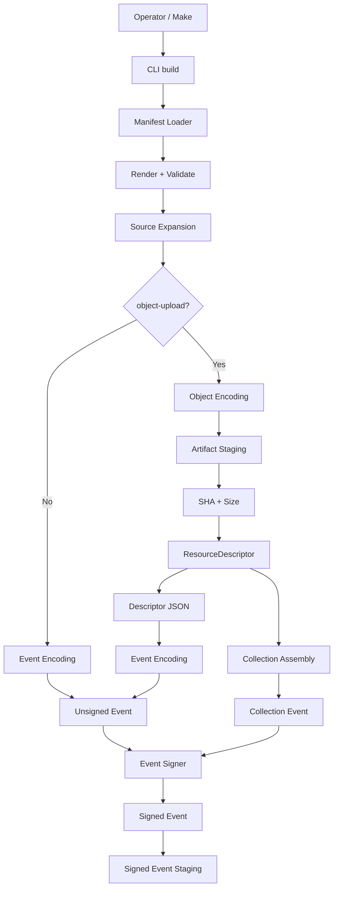
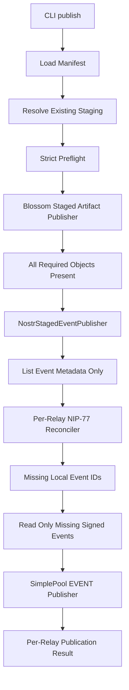
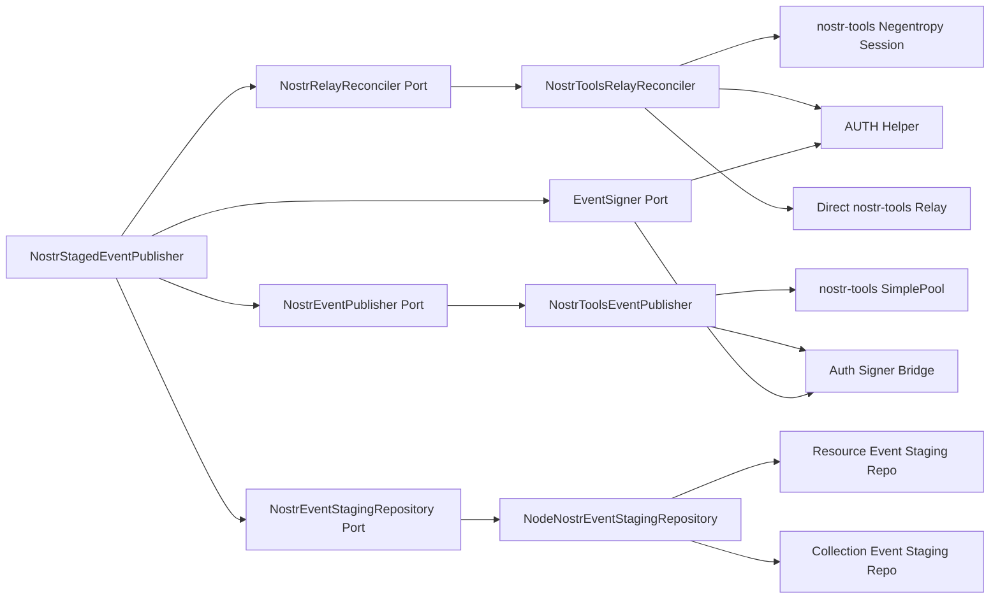
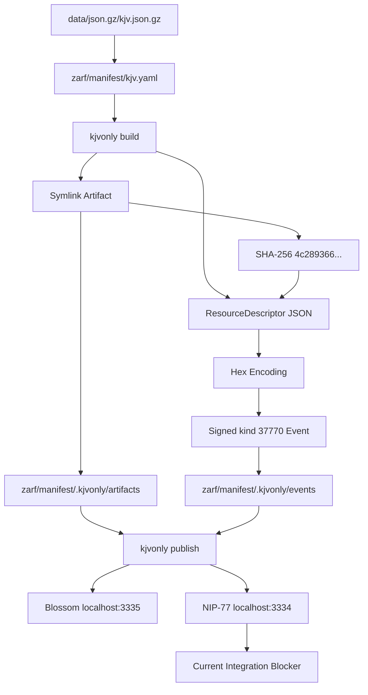

# KJVOnly Resource Publishing CLI Implementation and Integration Specification

## Status

**Status:** Implementation Current Through Slice 13 — Slice 14 Deferred — Slice 15 Build Proven, Network Publish Debug Pending  
**Scope:** Concrete implementation state of the KJVOnly Resource Publishing CLI; Nostr reconciliation/publication; staged-event indexing; AUTH behavior; publication orchestration; `sync`; local deletion reconciliation; first real KJV manifest; first real local build/staging proof; current end-to-end integration blocker; handoff guidance for continued implementation  
**Application:** KJVOnly.bible  
**Date:** 2026-09-05

---

# 1. Purpose

This document records the implementation state reached after executing the design defined in:

```text
20260903-kjvonly-resource-publishing-cli-design-spec.md
```

The September 3 specification remains the architectural design source.

This document is the implementation-state companion.

It answers:

```text
what was actually implemented?
what concrete boundaries now exist?
what library behavior is being reused?
what implementation choices changed after testing?
what invariants are now enforced by code?
what tests prove those invariants?
what real repository configuration was created?
what was proven against real KJV data?
where did the first live publication attempt stop?
what should the next developer or agent inspect first?
```

The intended handoff is:

```text
read September 3 design
        ↓
read this implementation specification
        ↓
inspect referenced files
        ↓
run current tests/build
        ↓
continue from the documented integration boundary
```

---

# 2. Relationship to the September 3 Design

The original design established:

```text
manifest
    = publication intent

build
    = current signed local deployment state

publish
    = synchronization of that staged state

sync
    = build then publish
```

That model remains intact.

No implementation work described here changes the fundamental producer/consumer Resource architecture.

The most important implementation refinement is in the Nostr adapter layer.

The original design expected `rx-nostr` where it fit.

Implementation evidence showed a cleaner split using `nostr-tools` directly for the concrete NIP-77 and EVENT behaviors required by this CLI.

The Application layer remains independent of that choice.

---

# 3. Current Milestone State

The implementation sequence currently stands at:

```text
Slice 1   complete
Slice 2   complete
Slice 3   complete
Slice 4   complete
Slice 5   complete
Slice 6   complete
Slice 7   complete
Slice 8   complete
Slice 9   complete
Slice 10  complete
Slice 11  complete
Slice 12  complete
Slice 13  complete
Slice 14  intentionally deferred
Slice 15  in progress
Slice 16  not started
```

Slice 15 has progressed through:

```text
legacy seed inventory
        ↓
real KJV manifest creation
        ↓
real CLI build
        ↓
staged artifact verification
        ↓
staged signed descriptor event verification
        ↓
first real publish attempt
        ↓
NIP-77 integration blocker discovered
```

No old seed script has been removed yet.

---

# 4. Repository Layout

Relevant repository shape:

```text
kjvonly.bible/
├── client/
│   ├── package.json
│   ├── package-lock.json
│   ├── kjvonly-pwa/
│   └── cli/
├── data/
├── relay/
├── zarf/
│   ├── manifest/
│   └── scripts/
│       └── seed/
└── Makefile
```

The CLI is a separate npm workspace:

```text
client/cli/
```

The browser application is a separate workspace:

```text
client/kjvonly-pwa/
```

Do not conflate them merely because both use TypeScript.

---

# 5. CLI Package

Current package identity:

```json
{
  "name": "@kjvonly/cli",
  "private": true,
  "version": "0.0.1",
  "type": "module",
  "bin": {
    "kjvonly": "./dist/main.js"
  }
}
```

Current commands are exposed through the compiled entrypoint:

```text
kjvonly build <manifest>
kjvonly publish <manifest>
kjvonly sync <manifest>
```

During development the executable may be run directly as:

```bash
node dist/main.js build <manifest>
node dist/main.js publish <manifest>
node dist/main.js sync <manifest>
```

---

# 6. CLI Build and Test Commands

From:

```text
client/cli/
```

use:

```bash
npm run test && npm run build
```

The package scripts are:

```json
{
  "scripts": {
    "build": "tsc -p tsconfig.build.json",
    "test": "vitest run --config vitest.config.ts"
  }
}
```

Do not confuse:

```text
npm run build
```

with:

```text
kjvonly build <manifest>
```

The former compiles TypeScript.

The latter performs offline publication preparation.

---

# 7. Current Dependencies Relevant to Publication

The CLI currently depends on:

```text
commander     ^14.0.0
dotenv        ^17.4.2
nostr-tools   ^2.25.1
nunjucks      ^3.2.4
ws            ^8.21.3
yaml          ^2.9.0
zod           ^4.5.4
```

The exact Nostr implementation work described below targets:

```text
nostr-tools 2.25.1
```

Do not assume another version exposes identical APIs.

---

# 8. Architectural Boundary Remains Hexagonal

The implemented runtime still follows:

```text
CLI Interface
    ↓
Application Use Cases
    ↓
Domain / Pure Models
    ↓
Ports
    ↓
Adapters
```

The network adapter details documented later do not leak into Application policy.

The main Application-level concepts remain:

```text
BuildManifest
PublishManifest
SyncManifest
NostrStagedEventPublisher
Blossom publication application service
publication preflight
```

---

# 9. One Composition Root

The CLI uses one explicit composition root.

Current file:

```text
src/composition/create-cli-composition.ts
```

The composition root owns concrete construction of:

```text
manifest loader
staging repositories
artifact repositories
encoders
signer
Blossom adapters
Nostr preflight adapter
Nostr reconciliation adapter
Nostr event publication adapter
application use cases
command-facing composition
```

Command handlers must not reconstruct that graph.

---

# 10. Slice 11 Was the Major Remaining Publication Boundary

Slice 11 implemented:

```text
NIP-77 / Negentropy reconciliation
        ↓
local missing event ID calculation per relay
        ↓
open only missing staged event JSON
        ↓
ordinary Nostr EVENT publication
        ↓
per-relay publication result
        ↓
NIP-42 AUTH support
```

The implementation intentionally separates:

```text
set reconciliation
```

from:

```text
event transfer
```

NIP-77 is not used to transfer events.

---

# 11. Generic Publication Result Envelope

A generic publication result envelope was introduced so `PublishManifest` can aggregate results from heterogeneous publication mechanisms without creating a registry hierarchy.

File:

```text
src/domain/publication-result.ts
```

Current shape:

```ts
export interface PublicationResult {
    readonly type:
        string;

    readonly data:
        unknown;
}
```

`PublishManifest.publish()` returns:

```ts
Promise<readonly PublicationResult[]>
```

Current result types include:

```text
blossom
nostr
```

The Application layer wraps concrete results.

No generic handler registry was introduced.

---

# 12. Why the Generic Result Is Intentionally Small

The publication result envelope exists only to aggregate distinct result families.

It is not intended to become:

```text
plugin event bus
visitor hierarchy
publication strategy registry
runtime serializer framework
```

The current rule is:

```text
concrete publisher owns concrete result
        ↓
PublishManifest wraps it
        ↓
CLI adapter may format it
```

Keep this boundary small until a real additional requirement appears.

---

# 13. Staged Event Filenames Now Include `createdAt`

The final normal staged event filename model is:

```text
<key>--<sourceMtimeMs>--<sourceSize>--<definitionRevision>--<createdAt>--<eventId>.json
```

This is an implementation refinement over the original design.

`createdAt` is now explicit local staging metadata.

`StagedEventMetadata` includes:

```ts
readonly createdAt: number;
```

The staging repository derives it from:

```ts
request.event.created_at
```

---

# 14. Source mtime and Nostr `created_at` Are Different Concepts

This distinction is locked:

```text
sourceMtimeMs
    = local incremental filesystem metadata

event.created_at
    = authoritative Nostr Resource event revision time
```

Never derive Nostr reconciliation timestamps from filesystem mtime.

Never use filesystem mtime as the NIP-77 timestamp.

This is especially important because NIP-77 storage ordering uses event timestamps.

---

# 15. Collection Event Filename

Collection events have no source-file mtime/size tuple.

Current collection filename shape is:

```text
<collectionName>--<createdAt>--<eventId>.json
```

Collection staging metadata therefore includes:

```text
collection name
createdAt
event ID
```

Collection `read()` verifies that the event's `created_at` agrees with filename metadata.

---

# 16. Staged Filename Byte Limits

Three byte limits are now enforced:

```text
Resource key       <= 128 UTF-8 bytes
collection name    <= 128 UTF-8 bytes
full staging name  <= 255 UTF-8 bytes
```

The implementation measures bytes with:

```ts
Buffer.byteLength(
    value,
    'utf8'
)
```

Do not use JavaScript string length for filesystem byte constraints.

---

# 17. Filename Limit Tests

Tests cover:

```text
ASCII values
multi-byte UTF-8 values
exactly 255-byte filename
256-byte filename rejection
```

This protects staging from platform filename limits while allowing Unicode keys.

---

# 18. Unified Nostr Staging Index

Nostr publication needs one view across:

```text
normal Resource events
collection events
```

A unified staging port was added.

File:

```text
src/ports/nostr-event-staging-repository.ts
```

Current entry model:

```ts
export interface StagedNostrEventEntry {
    readonly path:
        string;

    readonly eventId:
        string;

    readonly createdAt:
        number;
}
```

---

# 19. Unified Nostr Staging Port

Current port:

```ts
export interface NostrEventStagingRepository {
    list(
        stagingRoot:
            string
    ): Promise<
        readonly StagedNostrEventEntry[]
    >;

    read(
        entry:
            StagedNostrEventEntry
    ): Promise<
        SignedNostrEvent
    >;
}
```

The key API distinction is:

```text
list
    = metadata only

read
    = open one concrete signed event
```

That distinction enables efficient reconciliation.

---

# 20. Unified Staging Adapter

Concrete adapter:

```text
NodeNostrEventStagingRepository
```

It composes the existing:

```text
resource signed-event staging repository
collection event staging repository
```

It does not replace either specialized repository.

---

# 21. Unified Staging Discovery

The adapter discovers:

```text
<stagingRoot>/events/<resource-name>/
```

while treating:

```text
<stagingRoot>/events/__collections__/
```

as the collection namespace.

Hidden directories are excluded from normal Resource discovery.

Returned entries are sorted by path for deterministic behavior.

---

# 22. Listing Must Not Open Event JSON

A critical performance invariant is:

```text
NostrEventStagingRepository.list()
    must not open signed event JSON
```

Reconciliation needs only:

```text
event ID
createdAt
```

Opening every staged event would defeat the intended NIP-77 optimization.

Tests explicitly prove that listing metadata does not invoke event reads.

---

# 23. Event JSON Is Opened Only for Missing IDs

The publication flow is:

```text
list staged metadata
        ↓
reconcile IDs with relay
        ↓
receive local IDs missing remotely
        ↓
read only those staged event files
        ↓
publish them
```

This remains one of the most important Slice 11 invariants.

---

# 24. Nostr Reconciliation Domain Entry

File:

```text
src/domain/nostr-reconciliation-entry.ts
```

Current model:

```ts
export interface NostrReconciliationEntry {
    readonly eventId:
        string;

    readonly createdAt:
        number;
}
```

The timestamp is the signed event's Nostr `created_at`.

---

# 25. Nostr Relay Reconciliation Port

File:

```text
src/ports/nostr-relay-reconciler.ts
```

Current request:

```ts
export interface NostrRelayReconciliationRequest {
    readonly relay:
        string;

    readonly publisher:
        string;

    readonly kind:
        number;

    readonly events:
        readonly NostrReconciliationEntry[];
}
```

Current port:

```ts
export interface NostrRelayReconciler {
    reconcile(
        request:
            NostrRelayReconciliationRequest
    ): Promise<
        readonly string[]
    >;
}
```

The returned IDs mean:

```text
local staged event IDs missing on this relay
```

---

# 26. Reconciliation Is Publisher- and Kind-Scoped

The NIP-77 reconciliation filter uses:

```text
author = current signer pubkey
kind   = manifest.kind
```

This keeps reconciliation aligned with the staged publication set.

The Application layer obtains the publisher through the signer port.

The manifest does not carry a second publisher authority.

---

# 27. Nostr Publication Result

File:

```text
src/domain/nostr-publication-result.ts
```

Current statuses:

```ts
export type NostrPublicationStatus =
    | 'already-present'
    | 'published';
```

Result shape:

```ts
export interface NostrPublicationResult {
    readonly eventId:
        string;

    readonly relay:
        string;

    readonly status:
        NostrPublicationStatus;
}
```

Results are per event, per relay.

---

# 28. Nostr Event Publisher Port

File:

```text
src/ports/nostr-event-publisher.ts
```

Current port:

```ts
export interface NostrEventPublisher {
    publish(
        relay:
            string,

        event:
            SignedNostrEvent
    ): Promise<void>;
}
```

The publisher receives a complete staged signed event.

It does not receive an unsigned template.

---

# 29. Never Re-Sign During Publish

This invariant remains locked:

```text
build
    signs

publish
    sends exact staged signed event
```

`NostrEventPublisher` must not:

```text
reconstruct event tags
change created_at
change content
change pubkey
re-sign the Resource event
```

NIP-42 AUTH events are separate protocol events and may be signed at publication time.

---

# 30. NIP-77 Uses `nostr-tools`

The implemented Negentropy storage uses:

```text
nostr-tools/nip77
```

Concrete helper:

```text
src/adapters/nostr/nostr-tools-negentropy-storage.ts
```

It constructs:

```ts
new nip77.NegentropyStorageVector()
```

and inserts:

```text
createdAt
eventId
```

for each local staged event.

---

# 31. Negentropy Storage Must Be Sealed

After inserting local events the implementation calls:

```ts
storage.seal();
```

The returned sealed vector becomes the local set representation for NIP-77 reconciliation.

No custom set-diff protocol was implemented.

---

# 32. Thin NIP-77 Session Helper

A thin low-level session helper exists at:

```text
src/adapters/nostr/nostr-tools-negentropy-session.ts
```

This helper uses:

```text
nip77.Negentropy
```

from `nostr-tools`.

It does not implement the Negentropy algorithm itself.

---

# 33. Why the Low-Level Session Helper Exists

The higher-level library wrapper did not expose enough distinction for the CLI's required strict error behavior.

The CLI needs to distinguish:

```text
successful reconciliation
relay NEG-ERR
relay NEG-CLOSE
ordinary transport failure
auth-required rejection
```

The low-level helper therefore owns only the NIP-77 message exchange needed to use the library's Negentropy implementation correctly.

---

# 34. NIP-77 Session Abstraction

The helper works against a narrow relay contract similar to:

```ts
export interface NegentropyRelay {
    prepareSubscription(
        filters: Filter[],
        params: {
            readonly label: string;
        }
    ): NegentropySubscription;

    send(
        message: string
    ): Promise<void>;
}
```

The exact concrete relay remains outside the helper.

---

# 35. NIP-77 Open Message

A reconciliation begins by sending:

```text
NEG-OPEN
```

with:

```text
subscription ID
filter
initial Negentropy message
```

The subscription label is:

```text
negentropy
```

The helper then processes relay custom messages for that subscription.

---

# 36. NIP-77 Message Flow

Conceptually:

```text
local storage sealed
        ↓
Negentropy instance
        ↓
NEG-OPEN
        ↓
relay NEG-MSG
        ↓
negentropy.reconcile(...)
        ↓
optional next NEG-MSG
        ↓
null response means complete
        ↓
NEG-CLOSE
        ↓
resolve local IDs missing remotely
```

The algorithmic reconciliation remains inside `nostr-tools`.

---

# 37. Local-Have IDs

During reconciliation the library callback identifies event IDs present locally and absent remotely.

The adapter stores these in a `Set`.

This provides natural deduplication.

The final return is the set of local missing-remote IDs.

---

# 38. NIP-77 Completion

When `negentropy.reconcile()` returns no next message:

```text
send NEG-CLOSE
close subscription
resolve result
```

Completion is explicit.

The session should not leave a live subscription after successful reconciliation.

---

# 39. Structured NIP-77 Error

File contains:

```ts
export class NostrToolsNegentropyError
    extends Error {

    constructor(
        readonly reason:
            string
    ) {
        super(
            `Relay rejected Negentropy reconciliation: ${reason}`
        );

        this.name =
            'NostrToolsNegentropyError';
    }
}
```

This preserves the relay-provided reason.

---

# 40. `NEG-ERR` Behavior

When the relay sends:

```text
NEG-ERR
```

current expected behavior is:

```text
close subscription
        ↓
reject NostrToolsNegentropyError
```

Tests verify:

```text
reason preservation
error class/name
subscription close exactly once
```

---

# 41. Relay `NEG-CLOSE` Is Not Success

A relay-originated `NEG-CLOSE` before normal local completion is treated as failure.

The adapter does not silently interpret unexpected closure as successful reconciliation.

This supports strict publication semantics.

---

# 42. NIP-42 Authentication Is Reactive

Concrete reconciler:

```text
src/adapters/nostr/nostr-tools-relay-reconciler.ts
```

Authentication is not performed preemptively for every relay.

Instead:

```text
attempt reconciliation
        ↓
relay rejects with auth-required
        ↓
perform NIP-42 AUTH
        ↓
retry reconciliation once
```

---

# 43. Why Reactive AUTH

The CLI should not assume every relay requires authentication.

Reactive AUTH allows normal public relays to proceed without unnecessary signing/protocol traffic.

It also aligns with the relay's actual requirement rather than configuration guessing.

---

# 44. AUTH Retry Is Bounded

The reconciler allows:

```text
one initial reconciliation
one AUTH
one reconciliation retry
```

If the second attempt still reports `auth-required`, the error propagates.

There is no infinite AUTH loop.

---

# 45. Reconciler Connection Ownership

`NostrToolsRelayReconciler` owns the direct relay connection it opens.

Conceptually:

```text
connect relay
        ↓
reconcile
        ↓
optional AUTH + retry
        ↓
close relay in finally
```

The relay closes on both success and failure.

---

# 46. Reconciler Tests

Current reconciler tests prove at least:

```text
successful reconciliation closes relay
ordinary failure closes relay
ordinary success does not AUTH
ordinary failure does not AUTH
NEG-ERR auth-required triggers one AUTH
AUTH is followed by a fresh NEG-OPEN
retry success works
repeated auth-required fails
repeated auth-required does not loop
relay still closes
```

These are adapter tests, not merely Application mocks.

---

# 47. Signer Bridge for NIP-42

The CLI's signer port signs the project's own unsigned Nostr event model.

`nostr-tools` AUTH APIs expect an `EventTemplate -> VerifiedEvent` signer.

Adapter bridge:

```text
src/adapters/nostr/nostr-tools-auth-signer.ts
```

The bridge maps the `nostr-tools` event template to the narrow `EventSigner` port.

---

# 48. AUTH Signer Mapping

The bridge copies:

```text
kind
created_at
tags
content
```

into the CLI's signer request.

Tags are copied into mutable arrays at the adapter boundary.

The signed result is returned to `nostr-tools` as a `VerifiedEvent`.

---

# 49. Cast Is Confined to the Adapter Boundary

The signer bridge currently contains the type cast needed to satisfy `nostr-tools`' `VerifiedEvent` type.

That cast is intentionally localized.

Do not push `nostr-tools` concrete types into the signer port or Application layer just to remove one adapter cast.

The production signer uses `finalizeEvent`, so the signed event is cryptographically complete.

---

# 50. AUTH Helper Remains Useful

File:

```text
src/adapters/nostr/authenticate-nostr-tools-relay.ts
```

The helper simply calls:

```ts
relay.auth(signAuthEvent)
```

It remains used by the custom NIP-77 reconciler.

Do not remove it merely because normal EVENT publication can use `SimplePool`'s `onauth` callback.

---

# 51. Direct Relay Connector

File:

```text
src/adapters/nostr/connect-node-nostr-tools-relay.ts
```

Node WebSocket support is installed with:

```text
ws
```

and:

```text
nostr-tools/relay
```

The connector returns:

```text
Relay.connect(url)
```

This connector remains required by:

```text
Nostr preflight
NIP-77 reconciler
```

---

# 52. EVENT Publication Uses `SimplePool`

Ordinary signed event transfer uses:

```text
nostr-tools/pool
SimplePool
```

Concrete adapter:

```text
src/adapters/nostr/nostr-tools-event-publisher.ts
```

This differs from the original design's preliminary `rx-nostr` expectation.

The Application port is unchanged.

---

# 53. Why `SimplePool` Was Selected for EVENT Publication

`SimplePool.publish()` already provides the behavior needed for ordinary Nostr EVENT publication:

```text
connect
publish signed event
recognize auth-required
invoke onauth callback
perform relay AUTH
retry publication
```

Reimplementing that protocol behavior in the CLI would add no value.

Use the library default where it cleanly fits.

---

# 54. Event Publisher Construction

Current adapter accepts:

```text
EventSigner
pool factory
```

The pool factory is injectable for tests.

Production uses:

```ts
new SimplePool()
```

The signer is converted to the library AUTH signer through:

```text
createNostrToolsAuthSigner(...)
```

---

# 55. EVENT Publisher Sends the Exact Staged Event

Current flow:

```text
staged SignedNostrEvent
        ↓
SimplePool.publish([relay], event, { onauth })
        ↓
await publication promise(s)
```

The Resource event itself is not modified.

`onauth` is only for NIP-42 challenge signing.

---

# 56. Event Publisher Pool Lifetime

The current implementation creates a pool per `publish(relay, event)` call.

Then:

```text
publish
    ↓
finally
    ↓
pool.close([relay])
```

This is intentionally simple and leak-safe.

---

# 57. Known EVENT Publication Inefficiency

A pool per EVENT may create more relay connections than necessary when many events are missing.

This is currently accepted.

Do not optimize it by casually sharing connections across adapters.

A correct shared-connection design requires an explicit lifecycle owner spanning:

```text
reconciliation
publication of all missing events
cleanup
```

No such owner has been introduced yet.

---

# 58. Shared Nostr WebSocket Was Considered and Deferred

It is technically possible for reconciliation and EVENT publication to use the same relay connection.

The current architecture intentionally does not do that.

Why:

```text
reconciler currently owns direct Relay lifetime
publisher currently owns SimplePool lifetime
```

If each closes independently, sharing provides no real benefit.

If neither closes, the design leaks connections.

A future optimization should begin with lifecycle ownership, not connection reuse itself.

---

# 59. Event Publisher Tests

Current tests prove:

```text
exact signed staged event passed to pool
onauth signer passed to pool
pool closes after successful publish
pool closes after rejected publish
```

The test does not require a real relay.

Real network publication is covered later by integration work.

---

# 60. `NostrStagedEventPublisher`

Application service:

```text
src/application/nostr-staged-event-publisher.ts
```

This is the orchestration boundary between staged event metadata, per-relay reconciliation, and ordinary event transfer.

It depends on ports, not `nostr-tools`.

---

# 61. `NostrStagedEventPublisher` Dependencies

Current constructor dependencies:

```text
NostrEventStagingRepository
EventSigner
NostrRelayReconciler
NostrEventPublisher
```

Each dependency has one focused responsibility.

---

# 62. Staged Nostr Publication Flow

For one manifest:

```text
list staged event metadata
        ↓
get signer public key
        ↓
build reconciliation entries
        ↓
for each relay
        ↓
reconcile local entries
        ↓
validate returned IDs are known local IDs
        ↓
for each staged entry
        ├── missing → read + publish
        └── present → no read
        ↓
append per-relay results
```

---

# 63. Relay State Is Independent

For:

```text
relay A
relay B
```

reconciliation is run separately.

Example:

```text
event X

relay A → already present
relay B → missing
```

results in:

```text
A: already-present
B: published
```

The CLI does not assume relays have identical state.

---

# 64. Unknown Reconciliation IDs Are Rejected

After reconciliation, the Application service verifies every returned ID exists in the local staged ID set.

If the reconciler returns an unknown ID, publication fails with:

```text
Nostr reconciliation returned unknown staged event ID: <id>
```

This prevents an adapter bug from causing arbitrary file lookup or publication behavior.

---

# 65. All-Present Optimization

If every staged event is already present on a relay:

```text
reconcile
    ↓
missing IDs = []
    ↓
no staged event JSON reads
    ↓
no EVENT publication
```

Tests prove this behavior.

---

# 66. Missing-Only File Reads

If only one event is missing:

```text
only that event entry is read
```

The other staged event files remain unopened.

This is the intended benefit of the metadata index + NIP-77 design.

---

# 67. Staging Read Integrity

Normal Resource event staging reads verify filename metadata against the signed event.

Collection event reads do the same.

In particular:

```text
filename event ID
    must equal event.id

filename createdAt
    must equal event.created_at
```

A staged file that contradicts its filename is invalid.

---

# 68. `PublishManifestUseCase` Orchestration

The publish use case now executes:

```text
load manifest
        ↓
strict publication preflight
        ↓
resolve staging root
        ↓
Blossom staged artifact publication
        ↓
Nostr staged event publication
        ↓
wrap results
```

The external-artifact-first invariant is preserved.

---

# 69. Publication Result Wrapping

The use case currently maps results approximately as:

```ts
return [
    ...blossomResults.map(
        data => ({
            type: 'blossom',
            data
        })
    ),

    ...nostrResults.map(
        data => ({
            type: 'nostr',
            data
        })
    )
];
```

The generic envelope does not erase the concrete result object.

---

# 70. Publication Ordering Test

Current orchestration testing verifies:

```text
preflight
    before
Blossom publication
    before
Nostr publication
```

It also verifies the same loaded manifest/staging root are passed through the publication pipeline.

---

# 71. Potential Publish Hardening Tests

Two useful tests were identified but were not required to complete Slice 11:

```text
preflight failure prevents both publishers
Blossom failure prevents Nostr publication
```

The production orchestration already has the correct sequential structure.

These may be added as hardening tests later if desired.

---

# 72. Current Nostr Composition

Current intended graph:

```ts
const nostrRelayReconciler =
    new NostrToolsRelayReconciler(
        signer,
        connectNodeNostrToolsRelay
    );

const nostrEventPublisher =
    new NostrToolsEventPublisher(
        signer
    );

const nostrStagedEventPublisher =
    new NostrStagedEventPublisher(
        nostrEventStagingRepository,
        signer,
        nostrRelayReconciler,
        nostrEventPublisher
    );
```

This is constructed in the composition root.

---

# 73. `rx-nostr` Is Not Part of the Current CLI Publication Path

The current CLI source was checked with:

```bash
grep -R "rx-nostr\|RxNostr\|Nostr publication is not implemented" -n src package.json package-lock.json
```

No matches remained.

This was an intentional cleanup after completing the `nostr-tools` implementation.

Do not reintroduce `rx-nostr` merely because the September 3 design mentioned it as an expected client.

The important contract is the port, not the library brand.

---

# 74. Current Concrete Nostr Adapters Are Wired

The codebase was checked with:

```bash
grep -R "NostrToolsEventPublisher\|NostrToolsRelayReconciler" -n src
```

Production composition references both adapters.

Tests reference them independently.

This confirmed there was no stale temporary Nostr publication guard left in current source.

---

# 75. Slice 11 Completion Criterion

Slice 11 was considered complete after:

```text
NIP-77 adapter tests green
AUTH adapter tests green
EVENT publisher tests green
Nostr staged publisher tests green
PublishManifest orchestration tests green
composition root wired
stale rx-nostr/temporary guard references removed
full CLI tests green
TypeScript build green
```

At that point:

```bash
npm run test && npm run build
```

passed.

---

# 76. Slice 12 — `sync`

Production file:

```text
src/application/sync-manifest.ts
```

The existing implementation was already correct.

No production refactor was needed.

---

# 77. `SyncManifestUseCase`

Current behavior:

```ts
async sync(
    manifestPath: string
): Promise<void> {
    await this.buildManifest.build(
        manifestPath
    );

    await this.publishManifest.publish(
        manifestPath
    );
}
```

This directly expresses the design:

```text
build
    ↓
publish
```

---

# 78. `sync` Does Not Duplicate Either Use Case

`SyncManifestUseCase` does not contain:

```text
manifest loading
source expansion
artifact build
signing
preflight
Blossom logic
Negentropy
EVENT publication
```

It delegates to existing `BuildManifest` and `PublishManifest` boundaries.

This is the correct composition.

---

# 79. Existing `sync` Tests Were Already Sufficient

The existing spec already proved:

```text
build occurs before publish
publish is not called when build fails
```

No duplicate test file was added.

The implementation was left unchanged.

---

# 80. Slice 12 Completion

Slice 12 required no new production behavior.

It was completed by confirming:

```text
existing production code matches design
existing tests prove sequencing
existing tests prove failure short-circuit
```

Do not rewrite a correct use case merely to make the slice appear larger.

---

# 81. Slice 13 — Local Deletion Reconciliation

The September 3 design required proof that:

```text
removed source keys clean local staging
removed source keys do not trigger remote deletion
```

Most of this behavior already existed from earlier slices.

---

# 82. Existing Local Event Removal Test

Existing test:

```text
src/application/build-manifest.incremental.spec.ts
```

contains:

```text
removes staging when a source is removed
```

This proves deleted source keys remove their current staged signed-event state.

---

# 83. Existing Local Artifact Removal Test

Existing test:

```text
src/application/object-artifact-stager.spec.ts
```

contains:

```text
removes artifacts for removed source keys
```

This proves deleted source keys remove staged external artifact state.

---

# 84. No Remote Deletion Capability Exists

The current publication/application/adapter/port code was searched for remote deletion mechanisms using terms including:

```text
DELETE
tombstone
kind: 5
kind = 5
.delete(
```

No output was returned from the relevant publication source paths.

Therefore current source removal can only mutate local staging.

---

# 85. Remote Deletion Remains Out of Scope

The CLI currently has no:

```text
Nostr kind-5 deletion publisher
Blossom deletion API
remote tombstone service
remote cleanup use case
```

This is intentional.

Ordinary source deletion means:

```text
remove current local deployment state
```

not:

```text
destroy previously published remote data
```

---

# 86. Remote-Only Relay Events Are Ignored

The Nostr publication model reinforces local-only deletion semantics.

Reconciliation asks:

```text
which local staged IDs are missing remotely?
```

It does not ask:

```text
which remote IDs should be deleted because they are absent locally?
```

Remote-only event IDs therefore have no destructive meaning in ordinary `publish`.

---

# 87. Slice 13 Completion

Slice 13 required no new production code.

It was completed by confirming:

```text
local event removal already tested
local artifact removal already tested
no remote-delete port/adapter/use case exists
Nostr publication ignores remote-only state
```

This is stronger than adding an artificial mock test for a capability that does not exist.

---

# 88. Slice 14 — Consumer Multi-Blossom Compatibility

The PWA currently contains a Blossom resolution strategy at:

```text
client/kjvonly-pwa/src/lib/resource/resolution/blossom-resource-resolution-strategy.ts
```

Its historical provider contract currently uses:

```ts
interface BlossomStrategyData {
    readonly url: string;
    readonly sha256: string;
    readonly size?: number;
}
```

The CLI now generates:

```text
strategy.data.urls[]
```

for one or more physical Blossom mirrors.

---

# 89. PWA and CLI Remain Separate

This compatibility gap does not imply the PWA should depend on the CLI.

The correct relationship is:

```text
CLI publishes protocol-valid descriptor
        ↓
PWA consumes protocol-valid descriptor
```

There should be no browser-to-CLI service dependency.

---

# 90. Slice 14 Was Intentionally Deferred

The singular PWA `url` contract was recognized as an earlier application-side oversight.

It does not affect correctness of the current CLI's generated publication model.

The decision for this implementation session was:

```text
do not refactor PWA now
record compatibility follow-up
continue proving CLI
```

Therefore Slice 14 is not complete.

It is deferred.

---

# 91. Future PWA Compatibility Requirement

When Slice 14 is resumed, the PWA should accept:

```json
{
  "urls": [
    "https://blossom-a.example/<sha256>",
    "https://blossom-b.example/<sha256>"
  ],
  "sha256": "...",
  "size": 123
}
```

At minimum the consumer should prove:

```text
first mirror available → resolve
first mirror unavailable + later mirror available → resolve
returned bytes still SHA-verified
```

The detailed fallback algorithm remains an application concern.

---

# 92. Slice 15 — First End-to-End Seed Replacement

The first chosen migration target is:

```text
seed-kjv
```

from the repository Makefile.

This was chosen because it is one concrete external bundle rather than a broad multi-source workflow.

---

# 93. Current Seed Make Targets

Relevant legacy targets include:

```text
seed-chapters
seed-chapters-relay
seed-chapters-blossom
seed-kjv
seed-kjvs
seed-strongs
seed-strongs-relay
seed-strongs-blossom
seed-strongs-all-file
seed-plans-relay
seed-bootstrap
```

No target has been removed yet.

---

# 94. Legacy `seed-kjv`

Current Make target:

```make
seed-kjv:
    cd zarf/scripts/seed && \
    ./chapters.sh file ../../../data/json.gz/kjv.json.gz "KJV Bible"
```

This invokes the `file` mode of:

```text
zarf/scripts/seed/chapters.sh
```

---

# 95. Legacy `chapters.sh file` Behavior

The old Bash path:

```text
input file
    ↓
SHA-256
    ↓
nak blossom upload
    ↓
Nostr event kind 37778
```

Legacy event behavior included tags such as:

```text
x=<sha256>
type=chapters
m=json.gz
url=<blossom>/<sha>.gz
```

and content containing the title.

---

# 96. Migration Does Not Reproduce the Legacy Event Shape

The new CLI intentionally does not treat legacy kind `37778` metadata as the target architecture.

The replacement uses the current Resource architecture:

```text
kind 37770 Resource event
representation=descriptors
ResourceDescriptor[] in event.content
Blossom object externally stored
```

This is a semantic migration, not a line-for-line Bash translation.

---

# 97. First Real Manifest Directory

No existing manifest/config directory existed for this workflow.

The chosen repository location is:

```text
zarf/manifest/
```

Singular `manifest` is the current path used in this implementation session.

---

# 98. First Real Manifest

File created:

```text
zarf/manifest/kjv.yaml
```

Current content:

```yaml
version: 1

kind: 37770

staging:
  path: ./.kjvonly

nostr:
  relays:
    - ws://localhost:3334

defaults:
  strategy: local

strategies:
  local:
    type: blossom
    urls:
      - http://localhost:3335

resources:
  bible-bundle-kjv:
    path: ../../data/json.gz/kjv.json.gz

    event:
      encoding:
        - hex

      tags:
        - ["d", "kjvonly/bible/chapters/kjv"]
        - ["m", "application/json+hex"]
        - ["t", "kjvonly/bible/chapters"]
        - ["representation", "descriptors"]

    object-upload:
      mediaType: application/json+gzip
      encoding: []

collections: {}
```

---

# 99. Manifest Relative Paths

The manifest lives at:

```text
zarf/manifest/kjv.yaml
```

Therefore:

```yaml
path: ../../data/json.gz/kjv.json.gz
```

resolves to:

```text
data/json.gz/kjv.json.gz
```

and:

```yaml
staging:
  path: ./.kjvonly
```

resolves to:

```text
zarf/manifest/.kjvonly/
```

This confirms manifest-relative path ownership in a real repository workflow.

---

# 100. First Real Build Command

From:

```text
client/cli/
```

the real build was run with:

```bash
npm run build && node dist/main.js build ../../zarf/manifest/kjv.yaml
```

This first compiles the CLI and then runs the CLI `build` command.

The command completed without error.

---

# 101. First Real Build Produced One Artifact

Generated artifact:

```text
../../zarf/manifest/.kjvonly/artifacts/bible-bundle-kjv/
kjv--1787005598872--8205456--79928ee7--4c289366a89815f5db1fb0ec7a9850888780e36105c79af87c9c90c8e6e22d1d.json.gz
```

The filename encodes:

```text
key                kjv
source mtime        1787005598872
source size         8205456
artifact revision   79928ee7
SHA-256             4c289366...e22d1d
extension           .json.gz
```

---

# 102. First Real Artifact Is Zero-Copy

The staged artifact is a symbolic link:

```text
zarf/manifest/.kjvonly/artifacts/bible-bundle-kjv/<artifact>.json.gz
    ->
/Users/macbook/git/kjvonly.bible/data/json.gz/kjv.json.gz
```

This confirms real `object-upload.encoding: []` behavior uses zero-copy artifact staging.

The large 8.2 MB bundle was not duplicated.

---

# 103. First Real Build Produced One Signed Event

Generated event:

```text
../../zarf/manifest/.kjvonly/events/bible-bundle-kjv/
kjv--1787005598872--8205456--9a059fc1--1788653965--3e7147b1806700504c35d32b8425b9c68300a975fd8bb41a58aa7c9f84df2f03.json
```

The filename includes:

```text
key                kjv
source mtime        1787005598872
source size         8205456
definition revision 9a059fc1
createdAt           1788653965
event ID            3e7147b1...f2f03
```

---

# 104. First Real Signed Event Envelope

Decoded signed event metadata:

```json
{
  "id": "3e7147b1806700504c35d32b8425b9c68300a975fd8bb41a58aa7c9f84df2f03",
  "pubkey": "1b84c5567b126440995d3ed5aaba0565d71e1834604819ff9c17f5e9d5dd078f",
  "created_at": 1788653965,
  "kind": 37770,
  "tags": [
    ["d", "kjvonly/bible/chapters/kjv"],
    ["m", "application/json+hex"],
    ["t", "kjvonly/bible/chapters"],
    ["representation", "descriptors"]
  ]
}
```

This is the expected current Resource event shape.

---

# 105. First Real Descriptor Content

The event content was hex-decoded into:

```json
[
  {
    "metadata": {
      "publisher": "1b84c5567b126440995d3ed5aaba0565d71e1834604819ff9c17f5e9d5dd078f",
      "resourceId": "kjvonly/bible/chapters/kjv",
      "category": "kjvonly/bible/chapters",
      "modifiedAt": 1788653965,
      "mediaType": "application/json+gzip"
    },
    "strategy": {
      "type": "blossom",
      "data": {
        "urls": [
          "http://localhost:3335/4c289366a89815f5db1fb0ec7a9850888780e36105c79af87c9c90c8e6e22d1d"
        ],
        "sha256": "4c289366a89815f5db1fb0ec7a9850888780e36105c79af87c9c90c8e6e22d1d",
        "size": 8205456
      }
    }
  }
]
```

---

# 106. Outer and Inner Media Types Were Proven in Real Data

The signed event carries:

```text
m = application/json+hex
```

because the event content is a hex-encoded descriptor JSON document.

The descriptor carries:

```text
mediaType = application/json+gzip
```

because Resource Resolution returns the original compressed Bible bundle bytes.

The two layers remained correctly independent.

---

# 107. Descriptor Identity Was Derived Correctly

The manifest-authored event tags were:

```text
d = kjvonly/bible/chapters/kjv
t = kjvonly/bible/chapters
```

The generated descriptor metadata became:

```text
resourceId = kjvonly/bible/chapters/kjv
category   = kjvonly/bible/chapters
```

This proves the concrete tag-to-descriptor identity derivation against real repository input.

---

# 108. Descriptor Publisher Was Derived Correctly

The outer event pubkey is:

```text
1b84c5567b126440995d3ed5aaba0565d71e1834604819ff9c17f5e9d5dd078f
```

The descriptor publisher is the same pubkey.

No publisher field was authored in the manifest.

This confirms signer-derived publisher metadata.

---

# 109. Descriptor Revision Was Consistent

The outer event:

```text
created_at = 1788653965
```

The descriptor:

```text
modifiedAt = 1788653965
```

For this freshly built single descriptor-backed Resource, the same revision was used consistently.

---

# 110. Artifact SHA Was Verified Against Source

Expected SHA from staged metadata and descriptor:

```text
4c289366a89815f5db1fb0ec7a9850888780e36105c79af87c9c90c8e6e22d1d
```

Hashing the staged symlink target produced the same value.

Hashing the original source file produced the same value.

Therefore:

```text
source bytes
=
staged artifact bytes
=
descriptor integrity target
```

---

# 111. Artifact Size Was Verified

The staged artifact filename records:

```text
8205456
```

The generated descriptor records:

```json
"size": 8205456
```

This is the real byte size of the external object.

---

# 112. Descriptor URL Was Verified Raw

The raw decoded descriptor URL is:

```text
http://localhost:3335/4c289366a89815f5db1fb0ec7a9850888780e36105c79af87c9c90c8e6e22d1d
```

Any Markdown rendering seen while pasting output into chat was display formatting only.

The staged descriptor contains a normal URL string.

---

# 113. First Real Build Is an Important Milestone

The CLI has now proven with real KJV repository data:

```text
manifest loading
relative path resolution
binary source handling
zero-copy artifact staging
SHA-256 generation
ResourceDescriptor generation
publisher derivation
Resource identity derivation
outer/inner media-type separation
JSON descriptor serialization
hex event encoding
Nostr signing
staged filename metadata
```

This is stronger than fixture-only validation.

---

# 114. First Real Publish Attempt

After local staging verification, publication was attempted from:

```text
client/cli/
```

with:

```bash
node dist/main.js publish ../../zarf/manifest/kjv.yaml
```

The command did not complete.

---

# 115. Observed Relay Output

The relay emitted:

```text
NOTICE from ws://localhost:3334/: failed to parse envelope: unknown envelope label
```

The CLI then remained waiting rather than terminating with a clear error.

The process required manual interruption.

---

# 116. This Is the Current Integration Boundary

The implementation session intentionally stopped before debugging the relay/Negentropy issue.

Therefore the following are observations, not settled conclusions:

```text
NEG-OPEN is not being accepted by the current local relay path
relay emits NOTICE rather than a successful NIP-77 exchange
current client session does not convert that condition into completion/failure
publish waits indefinitely
```

Do not document an unproven root cause as fact.

---

# 117. Root Cause Has Not Yet Been Proven

Possible areas to inspect next include:

```text
local relay NIP-77/Negentropy support
relay configuration enabling that support
exact envelope form accepted by the relay implementation
nostr-tools custom-message integration
NOTICE handling in the relay/session adapter
reconciliation timeout/termination behavior
```

The next developer should inspect the actual relay code/configuration before changing the CLI protocol design.

---

# 118. The Hang Is Independently a Robustness Concern

Even if the relay is simply misconfigured or lacks NIP-77 support, the CLI should not wait forever after the relay has clearly reported an incompatible/rejected envelope.

The adapter currently handles:

```text
NEG-MSG
NEG-ERR
NEG-CLOSE
```

but the real integration exposed a relay-level:

```text
NOTICE
```

path that may need explicit terminal handling or bounded failure behavior.

The correct fix should be based on actual `nostr-tools` relay event capabilities and relay semantics.

---

# 119. Do Not Bypass NIP-77 Just to Make the Test Pass

The September 3 design explicitly chose NIP-77/Negentropy for relay event-set reconciliation.

The current implementation also has substantial tests around that contract.

Therefore an integration failure must not be "fixed" by silently replacing reconciliation with:

```text
REQ all events
manual set diff
publish everything
```

without a deliberate architectural decision.

First determine why the intended local relay path rejects the envelope.

---

# 120. Preflight vs Protocol Capability

Current strict preflight proves endpoint reachability/availability before normal mutation.

The real publish attempt demonstrates that:

```text
reachable relay
```

is not necessarily equivalent to:

```text
relay supports required NIP-77 publication workflow
```

A future refinement may need to distinguish transport preflight from protocol-capability failure.

Do not add speculative capability probing until the real relay behavior is understood.

---

# 121. First Publish Has Not Yet Proven Blossom Upload

Because the command later entered the Nostr reconciliation path, some earlier publication work may have occurred.

However this session did not yet inspect remote Blossom state after the hung command.

Therefore this document does not claim that the first real KJV artifact was successfully uploaded during that attempt.

Verify remote object state explicitly before relying on it.

---

# 122. First Publish Has Not Yet Proven Relay EVENT Transfer

The NIP-77 reconciliation did not complete.

Therefore the real KJV descriptor event has not yet been proven as published through the CLI against the local relay.

The staged event itself is complete and publishable by design.

Network transfer remains the current integration task.

---

# 123. Slice 15 Is Not Complete Yet

Slice 15 ultimately requires:

```text
manifest
+
Make target
+
kjvonly sync
+
actual publication
+
actual application Resource lifecycle verification
```

Current status is only:

```text
manifest created
real build proven
staging verified
first publish attempted
network blocker found
```

No Make target replacement has been committed yet in this documented flow.

---

# 124. Makefile Migration Should Wait for Publish Proof

Do not replace:

```make
seed-kjv:
    ...chapters.sh file...
```

with the CLI until the real CLI publication path succeeds.

The correct order remains:

```text
prove generic CLI build
        ↓
prove generic CLI publish
        ↓
prove consumer compatibility where required
        ↓
replace Make target
        ↓
remove old script path only after equivalent coverage
```

---

# 125. Current Legacy Script Is Still the Operational Fallback

Because Slice 15 publication is not yet complete, the existing Bash `seed-kjv` workflow remains in the repository.

This is intentional.

Do not delete or disable it yet.

---

# 126. Current Test Discipline

The implementation process used small slices and required:

```text
write/adjust one focused behavior
        ↓
run tests
        ↓
run TypeScript build
        ↓
fix exact failure
        ↓
only then continue
```

This should remain the development style for the remaining integration work.

---

# 127. Do Not Rewrite Proven Components During Integration Debugging

The following components are already independently tested and should not be casually redesigned while investigating the live relay issue:

```text
staged event filename model
staged artifact filename model
unified staged Nostr index
Resource event signer
Blossom descriptor generation
NostrStagedEventPublisher
SimplePool EVENT publisher
AUTH signer bridge
reactive AUTH retry bound
SyncManifestUseCase
local deletion reconciliation
```

Debug at the narrowest failing boundary first.

---

# 128. Likely First Debug Boundary

The first focused investigation should be around:

```text
NostrToolsRelayReconciler
        ↓
nostr-tools-negentropy-session
        ↓
local Relay custom-message behavior
```

and the local relay's NIP-77 support/configuration.

Do not begin by changing `PublishManifestUseCase`.

Its orchestration is not where the observed failure occurred.

---

# 129. Useful Files for NIP-77 Debugging

Start with:

```text
src/adapters/nostr/nostr-tools-relay-reconciler.ts
src/adapters/nostr/nostr-tools-relay-reconciler.spec.ts
src/adapters/nostr/nostr-tools-negentropy-session.ts
src/adapters/nostr/nostr-tools-negentropy-storage.ts
src/adapters/nostr/connect-node-nostr-tools-relay.ts
src/adapters/nostr/authenticate-nostr-tools-relay.ts
relay/
```

Also inspect the exact `nostr-tools@2.25.1` implementation rather than relying on current online docs for a different version.

---

# 130. Useful Files for EVENT Publication

If reconciliation succeeds but ordinary EVENT publication later fails, inspect:

```text
src/adapters/nostr/nostr-tools-event-publisher.ts
src/adapters/nostr/nostr-tools-event-publisher.spec.ts
src/adapters/nostr/nostr-tools-auth-signer.ts
src/ports/nostr-event-publisher.ts
```

Do not conflate a Negentropy failure with an EVENT publication failure.

They are separate adapters by design.

---

# 131. Useful Files for Application-Level Nostr Publication

Application orchestration lives in:

```text
src/application/nostr-staged-event-publisher.ts
```

Use this file when debugging:

```text
wrong event IDs
wrong per-relay result
unexpected staged JSON read
unknown reconciler ID
wrong publisher/kind passed to reconciler
```

It should not own WebSocket protocol mechanics.

---

# 132. Useful Files for Full Publish Orchestration

Use:

```text
src/application/publish-manifest.ts
```

when debugging:

```text
preflight ordering
Blossom-before-Nostr ordering
staging-root propagation
result aggregation
```

Do not put relay protocol handling here.

---

# 133. Useful Files for First Real KJV Workflow

Repository-side files:

```text
zarf/manifest/kjv.yaml
zarf/scripts/seed/chapters.sh
Makefile
data/json.gz/kjv.json.gz
zarf/manifest/.kjvonly/
```

These provide both old and new workflow representations for comparison.

---

# 134. Current KJV Staging Is Valuable Debug Evidence

Do not delete the current staging tree before inspecting integration behavior unless a clean rebuild is specifically required.

It contains the exact signed deployment state used for the first live publish attempt.

The event ID is:

```text
3e7147b1806700504c35d32b8425b9c68300a975fd8bb41a58aa7c9f84df2f03
```

The artifact SHA is:

```text
4c289366a89815f5db1fb0ec7a9850888780e36105c79af87c9c90c8e6e22d1d
```

---

# 135. Build Should Reuse Current KJV Staging When Unchanged

A repeated:

```bash
node dist/main.js build ../../zarf/manifest/kjv.yaml
```

with unchanged:

```text
source mtime
source size
build-affecting manifest definition
publisher
```

should reuse the current signed event and artifact where applicable.

Do not expect a new Resource event ID on every unchanged build.

---

# 136. `publish` Must Not Rebuild the KJV Resource

When debugging publication, use:

```bash
node dist/main.js publish ../../zarf/manifest/kjv.yaml
```

if the goal is to test network synchronization of the already-staged state.

Do not use `sync` until you intentionally want a fresh build pass first.

This preserves the ability to distinguish build bugs from publish bugs.

---

# 137. `sync` Becomes the Final Make Target Operation

After the publication path is proven, the repository workflow should eventually become conceptually:

```make
seed-kjv:
    cd client/cli && node dist/main.js sync ../../zarf/manifest/kjv.yaml
```

or an equivalent stable package/bin invocation.

The final invocation mechanism may be cleaned up later.

The important application semantics are:

```text
Make target gives workflow name
manifest gives publication intent
CLI gives generic mechanics
```

---

# 138. Do Not Put KJV Special Cases in CLI Source

The fact that the first real manifest is KJV-specific does not justify code such as:

```text
if resource is kjv
if bible bundle
if seed-kjv
```

inside generic CLI services.

All KJV-specific identity and media-type information belongs in:

```text
zarf/manifest/kjv.yaml
```

---

# 139. The Legacy Title Is Not Part of the New Resource Contract

Legacy `seed-kjv` passed:

```text
"KJV Bible"
```

as Nostr event content.

The new descriptor-backed Resource event content is the generated descriptor document.

Do not add a `title` field or compatibility tag merely to preserve an implementation detail of the old script unless the application contract requires it.

No such requirement was established in this session.

---

# 140. The Legacy Kind Is Not the New Resource Kind

Legacy bundle publication used:

```text
kind 37778
```

The current Resource architecture manifest uses:

```text
kind 37770
```

and:

```text
representation=descriptors
```

Do not attempt to make the generic CLI reproduce the old kind solely for migration symmetry.

---

# 141. Current Resource Identity for KJV Bundle

The first manifest publishes the descriptor Resource at:

```text
kjvonly/bible/chapters/kjv
```

with category:

```text
kjvonly/bible/chapters
```

The actual resolved bytes are:

```text
data/json.gz/kjv.json.gz
```

served through the Blossom strategy.

---

# 142. Current KJV Blossom Strategy

The first development manifest defines:

```yaml
strategies:
  local:
    type: blossom
    urls:
      - http://localhost:3335
```

The generated ResourceDescriptor expands the server base into the content-addressed object URL.

The descriptor currently contains one URL because the local manifest has one mirror.

The schema still uses `urls[]`.

---

# 143. Multiple Mirrors Are Still a CLI Invariant

Even though the current development manifest has one Blossom server, the generated provider data is:

```text
urls: string[]
```

not:

```text
url: string
```

Do not regress the CLI to singular URL data merely to match the current PWA's old resolver.

The PWA compatibility issue is separate.

---

# 144. Strict Publication Target Semantics Remain

The CLI still treats every configured target as required.

For Nostr:

```text
every configured relay required
```

For Blossom:

```text
every configured mirror required
```

No best-effort or quorum semantics were added during implementation.

---

# 145. Partial Remote Mutation Is Still Possible After Preflight

The first live integration attempt is a practical reminder that failures may occur after preflight.

The design remains:

```text
preflight all targets
        ↓
begin publication
        ↓
network/protocol failure may still occur
        ↓
command fails
        ↓
rerun reconciles already-present state
```

Do not attempt distributed rollback.

---

# 146. Current Blossom-Then-Nostr Ordering Is Important During Retry

If a descriptor-backed artifact has already reached Blossom but Nostr reconciliation later fails:

```text
rerun publish
```

should detect/skip the already-present object and continue toward Nostr synchronization.

This is the intended idempotent recovery model.

Verify this behavior during the real Slice 15 integration work.

---

# 147. Current Event Identity Is Stable Across Retry

Because `publish` uses the staged signed event:

```text
same staging
    → same event ID
```

A retry after a network failure does not create a new Nostr revision.

This is why signing belongs to `build`.

---

# 148. Current Artifact Identity Is Stable Across Retry

The external object is content-addressed by SHA-256.

For the first KJV bundle:

```text
SHA-256 = 4c289366...e22d1d
```

A retry should not create a distinct external object identity.

---

# 149. Real Build Validated the Zero-Copy Design Decision

The KJV bundle is approximately 8.2 MB.

With:

```yaml
object-upload:
  encoding: []
```

staging used a symlink rather than a full copy.

This validates the intended scaling path for future larger:

```text
archives
audio
video
```

without introducing a special large-file mode.

---

# 150. Current Known Cleanup / Refactor Candidates

Do not treat these as required fixes before completing Slice 15:

```text
shared Nostr connection lifecycle
SimplePool reuse across many EVENT publishes
centralized Node WebSocket setup
extra publication result typing
additional preflight/publisher short-circuit tests
PWA multi-Blossom fallback
CLI human-readable output improvements
```

Complete the real network path before broad cleanup.

---

# 151. Explicitly Deferred Connection Optimization

Current Nostr Node WebSocket implementation setup appears in more than one adapter path.

This duplication is accepted for now.

Do not extract a generic networking singleton unless a clear ownership boundary emerges.

The architecture values explicit lifecycle over superficial DRYness.

---

# 152. Explicitly Deferred Generic Result Registry

The current:

```text
PublicationResult { type, data }
```

is enough.

Do not add:

```text
PublicationResultRegistry
PublicationResultHandler
PublicationResultVisitor
```

without a real consumer requirement.

---

# 153. Explicitly Deferred Remote Deletion

Still out of scope:

```text
Nostr deletion event generation
Blossom deletion
remote tombstones
remote garbage collection
```

If a future operator wants destructive cleanup, design an explicit command/workflow with separate safety semantics.

Do not overload `build`, `publish`, or `sync` with implicit destruction.

---

# 154. Explicitly Deferred PWA Resolver Refactor

Known file:

```text
client/kjvonly-pwa/src/lib/resource/resolution/blossom-resource-resolution-strategy.ts
```

Known mismatch:

```text
PWA expects data.url
CLI generates data.urls[]
```

This should be addressed before declaring multi-Blossom end-to-end compatibility complete.

It does not block debugging current CLI NIP-77 behavior.

---

# 155. Testing Philosophy Going Forward

Continue to distinguish:

```text
unit proof
adapter proof
filesystem integration proof
real network integration proof
full application lifecycle proof
```

The first real KJV build is filesystem/integration proof.

The failed publish attempt is valuable network integration evidence.

Do not weaken a failing real integration test merely because all mocks are green.

---

# 156. Current Test Baseline Before Further Changes

Before changing NIP-77 integration code, establish the baseline:

```bash
cd client/cli
npm run test && npm run build
```

This should be green based on the completed slices.

Any debugging change should preserve that baseline or deliberately update a test to reflect newly proven real behavior.

---

# 157. Add a Regression Test for the Real Hang Once Understood

After identifying why the relay emits:

```text
failed to parse envelope: unknown envelope label
```

add a focused regression test at the narrowest adapter boundary.

The test should prove the final intended behavior, for example:

```text
unsupported/rejected Negentropy exchange
    → deterministic error
    → subscription/relay cleanup
    → no indefinite promise
```

Do not write the expected behavior until relay semantics are confirmed.

---

# 158. Avoid Arbitrary Timeout Policy During First Debug Pass

A timeout could prevent an infinite wait, but it may also hide the actual protocol event that should terminate reconciliation.

First inspect whether `nostr-tools` exposes relay NOTICE/custom-message callbacks suitable for deterministic rejection.

Add timeout behavior only if it represents a real required transport safety boundary.

Do not use timeout as a substitute for understanding the protocol path.

---

# 159. Preserve NIP-42 Behavior While Fixing NIP-77 Failure Handling

The current reactive AUTH behavior is already tested.

Any changes to message handling must preserve:

```text
NEG-ERR auth-required
    ↓
AUTH once
    ↓
fresh reconciliation
```

A general NOTICE handler must not accidentally swallow a proper NIP-42 path.

---

# 160. Preserve Per-Relay Independence

When NIP-77 integration is fixed, keep reconciliation inside the per-relay loop.

Do not collapse multiple relay state into one shared set.

Each relay remains an independent required target.

---

# 161. Preserve Missing-Only Reads

Any debug workaround must preserve:

```text
list metadata first
reconcile IDs
read only missing signed-event JSON
```

Do not regress to reading every staged event file before reconciliation.

This invariant is already tested and central to the design.

---

# 162. Preserve Exact Staged EVENT Publication

Any relay integration change must continue sending:

```text
the exact SignedNostrEvent read from staging
```

Do not rebuild the event from filename metadata or descriptor source during publish.

---

# 163. Preserve `createdAt` as Reconciliation Timestamp

NIP-77 local storage entries must continue using:

```text
StagedNostrEventEntry.createdAt
```

which originates from:

```text
event.created_at
```

Do not switch to:

```text
source mtime
filesystem ctime
staging file mtime
current time
```

---

# 164. Preserve Current Manifest as Debug Fixture

`zarf/manifest/kjv.yaml` is now a valuable real-world integration fixture.

It exercises:

```text
one file source
one identity object artifact
one Blossom strategy
one descriptor Resource
one relay
one signed event
```

This makes it ideal for debugging publication before expanding to all seed workflows.

---

# 165. Why KJV Is the Right First Real Workflow

The chosen workflow avoids unrelated complexity:

```text
no directory expansion during this test
no collections
no multiple artifacts
no multiple relays
no multiple Blossom mirrors
no Domain-specific CLI branching
```

Yet it still exercises the complete descriptor-backed publication architecture.

---

# 166. Do Not Jump to `seed-bootstrap` Yet

`seed-bootstrap` combines multiple Resource types and publication paths.

Until one simple real descriptor-backed KJV Resource can:

```text
build
publish
resolve
install
```

there is little value in adding more moving parts.

Finish Slice 15 before Slice 16.

---

# 167. Slice 16 Remains Full Bash Migration

After the first path is proven, remaining workflows can be migrated through manifests.

Potential targets include:

```text
KJVS bundle
chapter directory Resources
Strong's bundle/content
reading plans
bootstrap collection/defaults
```

The order should be driven by dependency and application boot requirements, not by script filename order.

---

# 168. Old Scripts Should Be Inventoried, Not Translated

For each remaining Bash workflow capture:

```text
source path
published Resource ID
category
event media type
representation
object media type
encoding
relay targets
Blossom targets
legacy behavior intentionally retired
```

Then express the required current Resource contract in a manifest.

Do not port shell control flow into TypeScript classes.

---

# 169. Manifest Naming Convention Is Not Yet Globally Locked

The first manifest is:

```text
zarf/manifest/kjv.yaml
```

No global naming scheme for future manifests was finalized during this session.

Possible future files may include:

```text
kjvs.yaml
strongs.yaml
plans.yaml
bootstrap.yaml
```

Use concrete repository workflows rather than inventing a complex manifest hierarchy prematurely.

---

# 170. Staging Location Is Currently Per Manifest Directory

The first real manifest uses:

```text
zarf/manifest/.kjvonly/
```

because `staging.path` is:

```text
./.kjvonly
```

and is resolved relative to the manifest.

This keeps deployment state near publication configuration.

No repository-wide staging relocation was decided during this session.

---

# 171. `.kjvonly` Is Current Deployment State, Not Source

The staging tree should be treated as generated deployment state.

It contains:

```text
signed Nostr event JSON
artifact symlinks/materialized files
```

It is not authoring source.

Repository ignore/retention policy should reflect that intent.

This session did not change `.gitignore` policy.

---

# 172. Current KJV Artifact Path Is Deterministic from State

The artifact path combines:

```text
manifest Resource name namespace
key
source revision metadata
artifact-definition revision
SHA
extension
```

This allows direct inspection of current staged object identity without opening a metadata database.

---

# 173. Current KJV Event Path Is Deterministic from State

The event path combines:

```text
manifest Resource name namespace
key
source revision metadata
definition revision
createdAt
event ID
```

This supports:

```text
incremental lookup
human inspection
metadata-only Nostr index
network reconciliation
```

---

# 174. No Separate Staging Database Was Added

Current deployment state remains filesystem-based.

There is no SQLite/IndexedDB/local database for CLI staging metadata.

Filename metadata + signed JSON + artifact paths remain sufficient for current requirements.

Do not add a database solely because publication now has more adapters.

---

# 175. No Additional Resource Version Abstraction Was Added

The implementation continues to rely on:

```text
Nostr event created_at
event ID
replaceable d-tag semantics
```

for published event revisions.

Local definition revisions are build-cache metadata only.

Do not expose them as Resource versions.

---

# 176. Definition Revision and Artifact Revision Are Different

The real KJV build demonstrates different revisions:

```text
event definition revision    9a059fc1
artifact definition revision 79928ee7
```

This is correct.

The event definition includes publication concerns that do not change external object bytes.

The artifact revision only tracks configuration affecting object bytes.

---

# 177. Changing Relay Configuration Must Not Rebuild Artifact Bytes

A future change such as:

```yaml
nostr:
  relays:
    - ws://relay-a
    - ws://relay-b
```

may affect publication configuration and event staging decisions.

It must not regenerate an unchanged 8.2 MB KJV artifact merely because a relay URL changed.

Maintain the current event/artifact revision separation.

---

# 178. Changing Blossom Mirror URLs May Rebuild Descriptor Event Only

If external bytes remain unchanged but strategy locations change:

```text
artifact SHA remains valid
artifact bytes reusable
descriptor strategy data changes
outer descriptor event changes
```

The event should rebuild as required while the external object bytes may be reused.

This remains a core incremental design objective.

---

# 179. Current Application Compatibility Gap Does Not Invalidate Published Descriptor Shape

The CLI-generated `urls[]` field is the intended producer contract.

The PWA's singular `url` validator is older consumer code.

Do not alter publication output to preserve the consumer bug.

The consumer must eventually catch up to the descriptor contract.

---

# 180. Current Security Invariants Remain

`NOSTR_SECRET_KEY` must remain:

```text
runtime-only
not logged
not templated
not persisted
not staged
not placed in .env
```

The real KJV manifest does not contain a publisher secret.

The pubkey is derived and safe to include in signed events/descriptors.

---

# 181. Makefile Currently Reads Development Secret

The repository Makefile currently contains development behavior similar to:

```make
NOSTR_SECRET_KEY := $(shell cat ~/.config/nostr/dev.key)
export NOSTR_SECRET_KEY
```

This is repository workflow behavior, not CLI manifest behavior.

The CLI continues to consume the secret only through its runtime environment.

Do not copy the key path into manifest configuration.

---

# 182. Current Preflight Is Separate from Reconciliation

Nostr endpoint preflight uses its own adapter.

NIP-77 reconciliation uses `NostrToolsRelayReconciler`.

This separation is intentional:

```text
preflight
    = can required endpoint be reached/checked?

reconciliation
    = what staged IDs are missing?
```

The newly discovered protocol issue may motivate better capability handling, but do not merge these responsibilities casually.

---

# 183. Current EVENT Publisher Is Separate from Reconciliation

Likewise:

```text
NostrRelayReconciler
    = compare state

NostrEventPublisher
    = transfer one exact signed event
```

Do not make the reconciler publish EVENTs internally merely because it already owns a Relay connection.

That would collapse clear application boundaries for a local optimization.

---

# 184. Current Signer Is Shared by Multiple Nostr Concerns

The signer supports:

```text
Resource event signing during build
publisher pubkey derivation
NIP-42 AUTH signing during publication
```

These are legitimate uses of one signing boundary.

Resource events are not signed during publication; only AUTH challenge events are.

---

# 185. Current NIP-77 Error Model Is Useful but Incomplete for Real Relay Behavior

`NostrToolsNegentropyError` correctly models explicit:

```text
NEG-ERR
```

rejection.

The first live relay instead emitted:

```text
NOTICE
```

The next integration refinement should determine whether a separate structured error is useful or whether the relay library already maps NOTICE into an existing error/event mechanism.

Avoid speculative error-class proliferation.

---

# 186. Current Error Handling Goal

The desired operational behavior remains:

```text
required relay cannot satisfy reconciliation
        ↓
clear error
        ↓
relay/subscription cleanup
        ↓
non-zero command exit
```

The current indefinite wait violates that operational goal even if the underlying relay configuration is the primary cause.

---

# 187. Do Not Report Slice 15 Success Until Consumer Proof Exists

Even after network publish succeeds, the strongest Slice 15 proof is:

```text
CLI build
    ↓
CLI publish
    ↓
relay + Blossom
    ↓
existing Resource discovery/resolution path
    ↓
resolved KJV bundle bytes
    ↓
validation/installation as applicable
```

The PWA singular `url` issue may need to be addressed before this exact descriptor can flow through the current consumer.

That dependency should be handled explicitly when the integration reaches it.

---

# 188. Slice 14 and Slice 15 May Intersect at Consumer Verification

Although Slice 14 was deferred for CLI-focused work, Slice 15's final application-side proof may require the multi-URL consumer update because the new descriptor uses:

```text
urls[]
```

even when only one URL is present.

Therefore:

```text
CLI network publication can be debugged first
```

but:

```text
full PWA consumption may require returning to Slice 14
```

before Slice 15 can be declared end-to-end complete.

---

# 189. Recommended Immediate Continuation Sequence

The next session should proceed in this order:

```text
1. run CLI unit/build baseline
2. inspect local relay NIP-77 support/configuration
3. inspect exact nostr-tools NEG-OPEN exchange
4. reproduce NOTICE + hang in focused way
5. identify deterministic termination condition
6. add regression test
7. fix narrow adapter behavior
8. rerun full CLI tests/build
9. rerun real KJV publish
10. inspect Blossom remote object state
11. inspect relay event state
12. verify rerun idempotency
13. return to PWA urls[] compatibility if needed
14. prove consumer lifecycle
15. replace seed-kjv Make target
```

Do not skip directly to bulk Bash migration.

---

# 190. Useful Baseline Command Set

From repository root:

```bash
cd client/cli
npm run test && npm run build
```

Real KJV build:

```bash
node dist/main.js build ../../zarf/manifest/kjv.yaml
```

Real KJV publish:

```bash
node dist/main.js publish ../../zarf/manifest/kjv.yaml
```

Final workflow after publication is proven:

```bash
node dist/main.js sync ../../zarf/manifest/kjv.yaml
```

---

# 191. Useful Staging Inspection Commands

List current KJV staging:

```bash
find ../../zarf/manifest/.kjvonly -maxdepth 5 \( -type f -o -type l \) -print | sort
```

Inspect signed event envelope:

```bash
EVENT=$(find ../../zarf/manifest/.kjvonly/events/bible-bundle-kjv -type f -name '*.json' | head -1)
jq '{id,pubkey,created_at,kind,tags}' "$EVENT"
```

Decode descriptor content:

```bash
jq -r '.content' "$EVENT" | xxd -r -p | jq .
```

---

# 192. Useful Artifact Integrity Commands

From `client/cli/`:

```bash
ARTIFACT=$(find ../../zarf/manifest/.kjvonly/artifacts/bible-bundle-kjv \( -type f -o -type l \) | head -1)
ls -l "$ARTIFACT"
sha256sum "$ARTIFACT"
sha256sum ../../data/json.gz/kjv.json.gz
```

Expected SHA for the current source revision:

```text
4c289366a89815f5db1fb0ec7a9850888780e36105c79af87c9c90c8e6e22d1d
```

---

# 193. Useful Raw Descriptor URL Check

```bash
EVENT=$(find ../../zarf/manifest/.kjvonly/events/bible-bundle-kjv -type f -name '*.json' | head -1)
jq -r '.content' "$EVENT" | xxd -r -p | jq -r '.[0].strategy.data.urls[0]'
```

Expected current local value:

```text
http://localhost:3335/4c289366a89815f5db1fb0ec7a9850888780e36105c79af87c9c90c8e6e22d1d
```

---

# 194. Useful Local Deletion Verification Context

Existing tests already cover:

```text
src/application/build-manifest.incremental.spec.ts
    removes staging when a source is removed

src/application/object-artifact-stager.spec.ts
    removes artifacts for removed source keys
```

Do not duplicate these tests unless a new behavior boundary is being introduced.

---

# 195. Current Completion Matrix

## Architecture

```text
[complete] Node/TypeScript CLI workspace
[complete] one explicit composition root
[complete] thin command handlers
[complete] Build/Publish/Sync application boundaries
[complete] external IO behind focused ports/adapters
[complete] generic CLI contains no KJV-specific branching
```

## Build

```text
[complete] manifest render/validation
[complete] source expansion
[complete] encoding/signing
[complete] incremental event staging
[complete] artifact staging
[complete] descriptor generation
[complete] collections
[complete] local deletion reconciliation
[proven real] KJV descriptor-backed bundle build
```

## Publication

```text
[complete/tested] strict preflight implementation
[complete/tested] Blossom publisher implementation
[complete/tested] NIP-77 adapter behavior in tests
[complete/tested] reactive NIP-42 behavior in tests
[complete/tested] SimplePool EVENT publisher
[complete/tested] staged Nostr publication application flow
[pending real proof] local relay NIP-77 integration
[pending real proof] real KJV EVENT publication
```

## Consumer

```text
[known gap] PWA Blossom resolver still expects singular url
[deferred] urls[] fallback implementation
[pending] end-to-end KJV Resource consumption
```

## Migration

```text
[complete] first real KJV manifest authored
[complete] first real KJV build/staging verified
[in progress] first real publish
[pending] seed-kjv Make target replacement
[pending] remaining Bash migration
```

---

# 196. Locked Implementation Decisions

The following implementation decisions should be treated as current unless new evidence proves a contradiction.

1. The CLI remains a separate Node/TypeScript workspace.
2. The CLI remains generic; KJV-specific policy belongs in manifests/Make targets.
3. Build signs Resource events; publish never re-signs them.
4. Normal staged event filenames include `createdAt` and event ID.
5. Collection staged filenames include `createdAt` and event ID.
6. Source mtime is local incremental metadata only.
7. Nostr `created_at` is the NIP-77 timestamp.
8. Resource keys and collection names are capped at 128 UTF-8 bytes.
9. Full generated staging filenames are capped at 255 UTF-8 bytes.
10. Nostr staging has a metadata-only unified index across Resources and collections.
11. NIP-77 reconciliation uses event ID + `created_at` metadata without opening all event JSON files.
12. Event JSON files are opened only for IDs missing on a specific relay.
13. NIP-77 algorithm behavior comes from `nostr-tools`; the CLI only owns session orchestration.
14. Reconciliation is independently performed for every relay.
15. Reconciler-returned unknown local IDs are rejected.
16. NIP-42 reconciliation AUTH is reactive and retried once.
17. Ordinary EVENT publication uses `nostr-tools` `SimplePool`.
18. `SimplePool`'s native `onauth` behavior is reused rather than recreated.
19. Direct relay connections remain appropriate for custom NIP-77 and preflight behavior.
20. A pool per EVENT is currently accepted despite possible connection overhead.
21. Shared relay-session lifecycle is deferred until a real lifecycle owner is designed.
22. `PublishManifest` publishes Blossom before Nostr.
23. `PublicationResult` remains a small `{ type, data }` envelope.
24. `sync` delegates to existing build then publish use cases.
25. Local source deletion removes local staging only.
26. There is no remote deletion/tombstone behavior in ordinary publication.
27. CLI-generated Blossom descriptors use `urls[]`, even if the current PWA has a singular `url` assumption.
28. PWA/CLI code reuse is not required; protocol compatibility is.
29. The first real migration manifest lives at `zarf/manifest/kjv.yaml`.
30. The first real KJV descriptor Resource uses kind `37770`, not the legacy bundle kind `37778`.
31. The first real KJV build has been proven against actual repository data.
32. The first real KJV network publication has not yet been proven.
33. The current relay `NOTICE ... unknown envelope label` issue must be investigated rather than bypassed.
34. NIP-77 must not be silently replaced with manual REQ/diff logic to avoid the integration issue.
35. Old seed scripts remain until equivalent CLI behavior is proven end-to-end.

---

# 197. Things the Next Agent Should Not Do

Do not:

```text
rewrite SyncManifestUseCase
add KJV-specific conditions to CLI source
change urls[] back to singular url
use source mtime for Negentropy timestamps
re-sign staged Resource events during publish
replace NIP-77 with manual event querying without design review
introduce remote deletion as part of local cleanup
merge reconciler and EVENT publisher solely to reuse one socket
remove authenticate-nostr-tools-relay.ts
remove connect-node-nostr-tools-relay.ts
add a giant NostrService abstraction
add a generic publication-result registry
translate chapters.sh line-for-line into TypeScript
replace seed-kjv before real publish succeeds
claim Slice 15 complete before consumer verification
assume the NOTICE root cause without inspecting relay support/configuration
```

---

# 198. Things the Next Agent Should Preserve

Preserve:

```text
small slices
exact failing-boundary debugging
full test + TypeScript build baseline
manifest-as-policy architecture
one composition root
ports between Application and adapters
metadata-only Nostr staging list
missing-only signed-event reads
strict per-relay reconciliation
reactive bounded AUTH
Blossom-before-Nostr publication
local-only deletion reconciliation
zero-copy identity artifacts
current real KJV manifest/staging as integration evidence
```

---

# 199. Recommended Reading Order for a New Agent

Read in this order:

```text
1. docs/.../20260903-kjvonly-resource-publishing-cli-design-spec.md
2. this document
3. src/application/publish-manifest.ts
4. src/application/nostr-staged-event-publisher.ts
5. src/ports/nostr-event-staging-repository.ts
6. src/ports/nostr-relay-reconciler.ts
7. src/ports/nostr-event-publisher.ts
8. src/adapters/nostr/nostr-tools-relay-reconciler.ts
9. src/adapters/nostr/nostr-tools-negentropy-session.ts
10. src/adapters/nostr/nostr-tools-event-publisher.ts
11. src/adapters/nostr/nostr-tools-auth-signer.ts
12. src/composition/create-cli-composition.ts
13. zarf/manifest/kjv.yaml
14. zarf/scripts/seed/chapters.sh
15. relay implementation/configuration
```

Then run the test/build baseline before modifying code.

---

# 200. Current High-Level Build Architecture



The first real KJV bundle has successfully traveled this entire build path.

---

# 201. Current High-Level Publish Architecture



The current live integration failure occurs at the NIP-77 reconciliation step with the local relay.

---

# 202. Current Nostr Adapter Architecture



This separation should remain visible during debugging.

---

# 203. Current First-Seed Architecture



---

# 204. Current Implementation Definition of Done

The work documented here is considered successfully implemented where all of the following are true:

```text
Slice 11 Nostr publication architecture exists behind ports
NIP-77 library integration has focused tests
NIP-42 AUTH retry behavior has focused tests
EVENT publisher reuses SimplePool auth behavior
staged event index avoids eager JSON reads
publish opens only missing events
per-relay state is independent
unknown reconciliation IDs fail
PublishManifest preserves artifact-before-event ordering
sync composes build then publish
local deletion removes local event/artifact state only
full CLI test suite passes
TypeScript build passes
real KJV manifest builds successfully
real KJV artifact integrity matches source
real KJV descriptor content is correct
real KJV signed event structure is correct
```

---

# 205. Current Integration Definition of Done

The next integration milestone is complete only when:

```text
local relay accepts/intentionally handles required NIP-77 flow
unsupported/rejected flow cannot hang indefinitely
real KJV reconciliation completes
real KJV artifact is present on Blossom
real staged KJV event reaches relay if missing
second publish recognizes already-present state
no unnecessary re-sign occurs
no unnecessary artifact upload occurs
required failures return non-zero
```

---

# 206. Slice 15 Definition of Done

Slice 15 is complete only when:

```text
zarf/manifest/kjv.yaml is the authoritative seed-kjv publication contract
        ↓
kjvonly sync successfully builds + publishes it
        ↓
Make seed-kjv invokes that manifest-driven workflow
        ↓
application can consume the resulting Resource through the real Resource lifecycle
        ↓
legacy seed-kjv path can be retired with confidence
```

Current progress has not yet reached the final three steps.

---

# 207. Slice 16 Definition of Done

Complete Bash migration requires repeating the manifest-driven process for the remaining required seed workflows.

Do not remove:

```text
chapters.sh
strongs.sh
plans.sh
bootstrap.sh
```

until their required behaviors are either:

```text
represented by manifests + generic CLI
```

or:

```text
explicitly retired as obsolete behavior
```

---

# 208. Final Architectural Statement

The implementation now demonstrates the intended separation in real code:

```text
repository workflow
    = Make target + manifest

manifest
    = Resource publication intent

CLI build
    = current signed local deployment state

CLI publish
    = strict synchronization of staged artifacts/events

NIP-77
    = event-set reconciliation

Nostr EVENT
    = actual signed event transfer

Blossom
    = external object storage

PWA
    = independent consumer of the published Resource protocol
```

The first real KJV build proves the producer architecture is no longer theoretical.

The remaining work is now concentrated at the real network/consumer integration boundary rather than in the core authoring/build model.

---

# 209. Handoff Summary

A developer or agent continuing from this point should understand the following before changing code:

```text
The CLI core is implemented and green through local deletion reconciliation.

The Nostr publication path is split intentionally:
    direct Relay + nostr-tools Negentropy for reconciliation
    SimplePool for ordinary EVENT publication

AUTH behavior is reactive and bounded.

Signed Resource events are immutable deployment artifacts after build.

The unified Nostr staging index exists specifically to avoid opening all event JSON before reconciliation.

The PWA singular Blossom URL model is a known deferred consumer issue; do not regress CLI urls[].

A real zarf/manifest/kjv.yaml now builds the actual KJV bundle successfully.

That build produced a verified symlink artifact, SHA, ResourceDescriptor, and signed kind-37770 descriptor event.

The first real publish attempt exposed a relay NOTICE:
    failed to parse envelope: unknown envelope label

The CLI then hung in NIP-77 reconciliation.

The root cause has not yet been proven.

The next task is to investigate the local relay's NIP-77 support/configuration and the adapter's handling of relay-level rejection/NOTICE behavior, add the narrow regression test, and rerun the real KJV publish.

Do not bypass NIP-77, do not rewrite proven layers, and do not migrate additional seed workflows until this first end-to-end path works.
```

That is the exact implementation boundary at the end of 2026-09-05.
