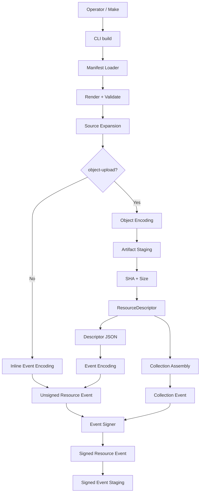
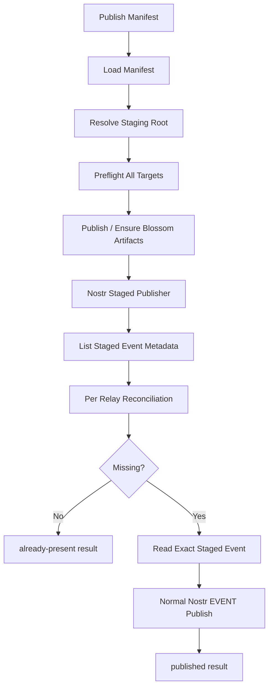
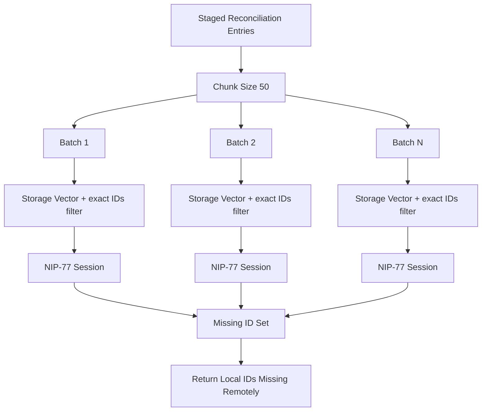
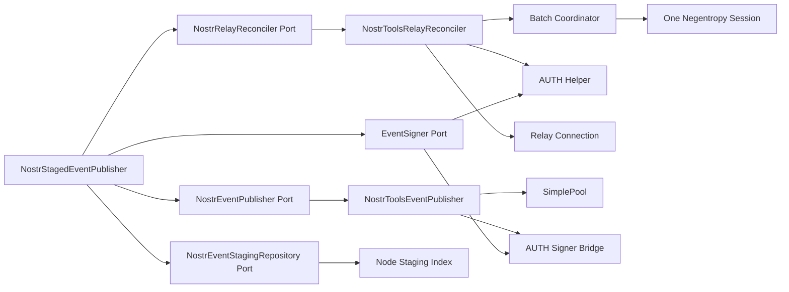
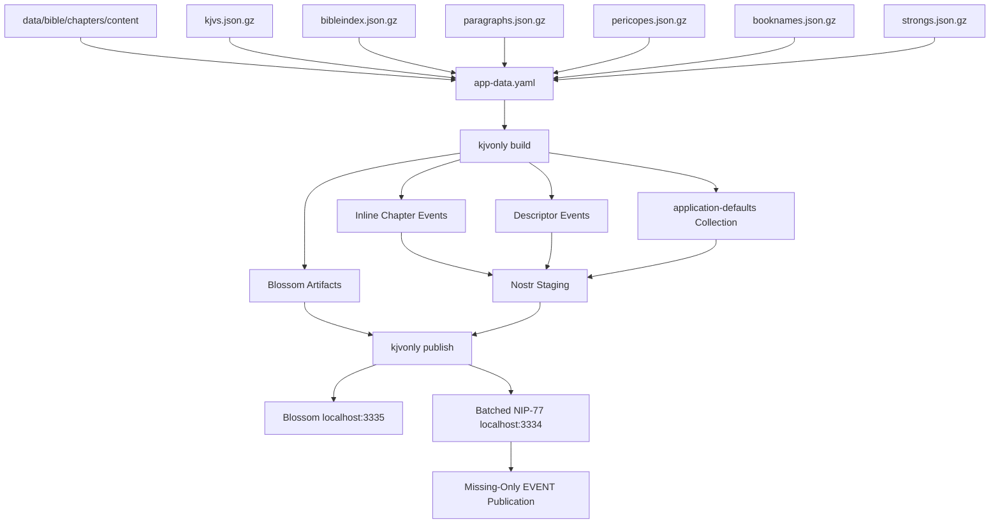

# KJVOnly Resource Publishing CLI Implementation and Integration Specification

## Status

**Status:** Current implementation state through successful large-set app-data publication and batched NIP-77 reconciliation  
**Scope:** KJVOnly Resource Publishing CLI architecture, manifest model, build/staging behavior, Blossom publication, Nostr reconciliation/publication, structured logging, real `app-data.yaml` integration, PWA Blossom consumer compatibility, tests, operational commands, and handoff guidance  
**Application:** KJVOnly.bible  
**Date:** 2026-09-08

---

# 1. Purpose

This document is the current implementation companion to:

```text
20260903-kjvonly-resource-publishing-cli-design-spec.md
```

It supersedes the implementation-state snapshot previously recorded in:

```text
20260905-kjvonly-resource-publishing-cli-implementation-and-integration-spec.md
```

The September 3 document remains the architectural design source.

This document records what the code now actually does after the subsequent integration work.

It is written for:

```text
another implementation agent
another developer joining the project
future maintenance/debugging sessions
code review against the intended architecture
```

The reader should be able to:

```text
read this specification
        ↓
inspect the referenced code
        ↓
understand why each boundary exists
        ↓
understand the real publication workflow
        ↓
understand the current integration evidence
        ↓
continue implementation without reopening settled design decisions
```

---

# 2. Relationship to the Design Specification

The core model has not changed:

```text
manifest
    = publication intent

build
    = prepare the current signed local deployment state

publish
    = reconcile/publish that exact staged state

sync
    = build then publish
```

The CLI remains generic.

It does not know:

```text
KJV
KJVS
Bible bootstrap policy
Strong's application policy
search semantics
paragraph semantics
pericope semantics
```

Those meanings are expressed through:

```text
manifest definitions
resource identities
resource classifications
repository-side Make targets
consumer/application policy
```

The major implementation refinements since the original design are:

```text
nostr-tools is the concrete CLI Nostr implementation

NIP-77 reconciliation is performed in bounded exact-ID batches

structured verbose logging exists across the publication pipeline

Blossom descriptors use urls[] rather than singular url

the PWA Blossom resolver now understands urls[] and failover

real app data is published through zarf/manifest/app-data.yaml
```

---

# 3. Current Milestone State

The earlier slice-oriented implementation work has effectively reached the following state:

```text
CLI workspace                    complete
manifest loader/validation       complete
build pipeline                   complete
incremental staging              complete
artifact staging                 complete
ResourceDescriptor generation    complete
Collections                      complete
strict preflight                 complete
Blossom publication              complete
Nostr EVENT publication          complete
NIP-77 reconciliation            complete
reactive NIP-42 AUTH             complete
sync                             complete
local deletion reconciliation    complete
structured verbose logging       complete
PWA Blossom urls[] compatibility complete
real app-data manifest           implemented
large Nostr reconciliation       proven against local relay
```

The earlier September 5 snapshot stopped at a real NIP-77 integration blocker.

That blocker is no longer current.

The live integration now proves that a large staged event set can be reconciled without re-uploading already-present chapter events.

The observed rerun behavior was:

```text
unchanged chapter Resource events
    → reused locally
    → recognized as already present remotely
    → not republished

Collection event
    → rebuilt/re-signed under current v1 Collection behavior
    → new event ID
    → published as the current addressable replacement
```

---

# 4. Repository Context

Relevant top-level shape:

```text
kjvonly.bible/
├── client/
│   ├── package.json
│   ├── package-lock.json
│   ├── kjvonly-pwa/
│   └── cli/
├── data/
├── relay/
├── zarf/
│   ├── docker/
│   ├── manifest/
│   └── scripts/
└── Makefile
```

The CLI and PWA are separate workspaces:

```text
client/cli/
client/kjvonly-pwa/
```

Do not treat the PWA as part of the CLI implementation merely because both are TypeScript.

The producer/consumer relationship is:

```text
CLI
    publishes Resources

PWA
    discovers/resolves/consumes Resources
```

---

# 5. Current CLI Source Organization

The CLI source has been reorganized into explicit logical subfolders.

Current conceptual shape:

```text
client/cli/src/
├── main.ts
├── cli/
├── composition/
├── application/
│   ├── build/
│   │   ├── artifact/
│   │   ├── collection/
│   │   ├── descriptor/
│   │   ├── encoding/
│   │   ├── inline/
│   │   └── source/
│   ├── publish/
│   │   ├── blossom/
│   │   ├── nostr/
│   │   └── preflight/
│   └── sync/
├── domain/
├── ports/
└── adapters/
    ├── blossom/
    ├── encoding/
    ├── logging/
    ├── manifest/
    ├── source/
    ├── staging/
    ├── strategy/
    ├── time/
    └── nostr/
        ├── auth/
        ├── negentropy/
        ├── publication/
        ├── relay/
        └── signer/
```

The organization rule is:

```text
folder structure should communicate responsibility
```

Do not collapse these areas back into one large `application/`, `adapters/nostr/`, or infrastructure directory.

---

# 6. Absolute Import Aliases

Cross-boundary imports use stable package aliases.

Current package import mapping is conceptually:

```json
{
  "imports": {
    "#adapters/*": "./dist/adapters/*",
    "#application/*": "./dist/application/*",
    "#cli/*": "./dist/cli/*",
    "#composition/*": "./dist/composition/*",
    "#domain/*": "./dist/domain/*",
    "#ports/*": "./dist/ports/*"
  }
}
```

TypeScript source imports retain `.js` suffixes because the project targets Node ESM/NodeNext behavior.

Example from current Nostr code:

```ts
import { Logger } from "#ports/logging/logger.js";
import { EventSigner } from "#ports/nostr/event-signer.js";
```

The motivation is structural stability:

```text
moving a file within a layer/domain
    should not require rewriting long relative import chains
```

---

# 7. Architectural Boundary

The CLI remains hexagonal:

```text
CLI Interface
    ↓
Application Use Cases
    ↓
Domain / Pure Models
    ↓
Ports
    ↓
Adapters
```

A useful ownership rule is:

```text
Application
    owns workflow and policy

Ports
    describe required capabilities

Adapters
    own libraries, filesystem, network, protocol mechanics

Domain
    owns stable data concepts and invariants
```

This is especially important in the Nostr code.

Application code must not own:

```text
WebSocket frames
NEG-OPEN / NEG-MSG protocol handling
NIP-42 relay challenge mechanics
SimplePool lifecycle
PostgreSQL relay behavior
```

---

# 8. Composition Root

The CLI has one explicit composition root.

It constructs concrete implementations for:

```text
manifest loading
manifest validation/rendering
source discovery
encoders
staging repositories
artifact repositories
clock/time
signer
logger
Blossom preflight/publication
Nostr preflight
Nostr reconciliation
Nostr EVENT publication
build use cases
publish use cases
sync use case
CLI command handlers
```

Command handlers remain thin.

They should not manually reconstruct adapter graphs.

---

# 9. CLI Commands

The public command model remains:

```text
kjvonly build <manifest>
kjvonly publish <manifest>
kjvonly sync <manifest>
```

Development invocation:

```bash
node dist/main.js build <manifest>
node dist/main.js publish <manifest>
node dist/main.js sync <manifest>
```

Verbose execution:

```bash
node dist/main.js sync -v <manifest>
```

The semantic distinction is locked:

```text
build
    may mutate local staging
    must not publish network state

publish
    reads existing staging
    must not rebuild or re-sign Resources

sync
    invokes build
    then publish
```

---

# 10. TypeScript Build vs CLI Build

Do not confuse:

```bash
npm run build
```

with:

```bash
node dist/main.js build <manifest>
```

The first means:

```text
compile TypeScript
```

The second means:

```text
prepare Resource publication staging from a manifest
```

Standard verification remains:

```bash
npm run test && npm run build
```

from:

```text
client/cli/
```

---

# 11. Manifest Is Publication Policy

The CLI manifest is the repository/operator-facing publication contract.

It determines:

```text
kind
staging root
relays
strategies
Blossom mirrors
source paths
event encodings
event tags
object upload behavior
Collections
```

The CLI must not infer application-specific policy that belongs in the manifest.

---

# 12. Manifest Version

Current manifests require:

```yaml
version: 1
```

Unknown/invalid structure is rejected during manifest validation.

The CLI does not silently accept malformed publication intent.

---

# 13. Manifest Rendering and Environment Values

Manifest rendering supports environment-driven values.

Example production-oriented pattern:

```yaml
nostr:
  relays:
    - "{{ env.NOSTR_RELAY_PRIMARY }}"
    - "{{ env.NOSTR_RELAY_SECONDARY }}"

strategies:
  primary:
    type: blossom
    urls:
      - "{{ env.BLOSSOM_PRIMARY }}"
      - "{{ env.BLOSSOM_SECONDARY }}"
```

The current local development `app-data.yaml` intentionally uses explicit localhost endpoints instead.

The publisher private key is not stored in the manifest.

It comes from:

```text
NOSTR_SECRET_KEY
```

---

# 14. Manifest Relative Path Semantics

Relative paths resolve relative to the manifest file directory.

They do not resolve relative to the operator's shell working directory.

For:

```text
zarf/manifest/app-data.yaml
```

this:

```yaml
staging:
  path: ./.kjvonly
```

resolves to:

```text
zarf/manifest/.kjvonly/
```

and:

```yaml
path: ../../data/bible/chapters/content
```

resolves to:

```text
data/bible/chapters/content
```

This behavior is important because Make runs the CLI from `client/cli/`.

---

# 15. Resource Definitions

Each `resources` entry describes one publication definition.

A Resource may represent:

```text
one source file
many source files discovered under a directory
inline event content
descriptor-backed external content
```

The manifest Resource name is a build/publication definition name.

It is not necessarily the Resource Identifier.

Example:

```text
manifest name:
    bible-chapters-kjvs

concrete Resource ID:
    kjvonly/bible/chapters/kjvs/1_1
```

---

# 16. Resource Identity

Current KJVOnly Resource events use kind:

```text
37770
```

Resource identity is addressable Nostr identity:

```text
publisher pubkey
+
kind
+
d tag
```

The event ID identifies one signed publication revision.

It is not the long-lived Resource identity.

---

# 17. Classification

The `t` tag provides Resource classification.

Examples:

```text
kjvonly/bible/chapters
kjvonly/search/bible
kjvonly/overlays/paragraphs
kjvonly/overlays/pericopes
kjvonly/bible/booknames
kjvonly/strongs/definitions
kjvonly/resources/collections
```

The CLI does not maintain a second category registry.

Concrete tags are authoritative publication metadata.

---

# 18. Representation Tag

Current representations include:

```text
content
descriptors
```

Typical inline Resource:

```yaml
- ["representation", "content"]
```

Typical descriptor-backed Resource or Collection:

```yaml
- ["representation", "descriptors"]
```

The representation describes what `event.content` contains.

---

# 19. Inline Resource Pipeline

For an inline binary Resource such as an individual compressed Bible chapter:

```text
source .json.gz
    ↓
event.encoding
    ↓
hex
    ↓
event.content
    ↓
signed kind-37770 event
```

Typical tags:

```yaml
- ["d", "kjvonly/bible/chapters/kjvs/${key}"]
- ["m", "application/json+gzip+hex"]
- ["t", "kjvonly/bible/chapters"]
- ["representation", "content"]
```

The source bytes are already gzip-compressed.

The event pipeline only adds hex in this configuration.

---

# 20. Descriptor-Backed Resource Pipeline

For descriptor-backed external content:

```text
source
    ↓
object-upload.encoding
    ↓
external artifact bytes
    ↓
SHA-256 + size
    ↓
Blossom locations
    ↓
ResourceDescriptor[]
    ↓
JSON
    ↓
event.encoding
    ↓
signed Nostr event
```

The two encoding pipelines are independent.

Do not conflate:

```text
object-upload.encoding
```

with:

```text
event.encoding
```

---

# 21. Current Descriptor Encoding

Current descriptor events normally use:

```text
ResourceDescriptor[]
    ↓
JSON
    ↓
hex
```

Typical outer event media type:

```text
application/json+hex
```

Typical external artifact media type:

```text
application/json+gzip
```

The outer event describes the descriptor document.

The descriptor's media type describes the resolved external bytes.

---

# 22. Object Upload Encoding

Current bundle artifacts are already gzip-compressed source files.

Therefore they commonly use:

```yaml
object-upload:
  mediaType: application/json+gzip
  encoding: []
```

An empty encoding pipeline means:

```text
source bytes are already final external bytes
```

---

# 23. Zero-Copy Artifact Staging

When no object transform is required, the Node artifact staging adapter may use a symbolic link rather than copy large source bytes.

Conceptually:

```text
source bundle
    ↓
symlink-backed staged artifact
```

This preserves:

```text
artifact identity
SHA calculation
publication behavior
```

without duplicating large files locally.

---

# 24. Artifact Integrity

Descriptor-backed artifacts record:

```text
SHA-256
size
source revision metadata
```

Before publication, the implementation must not knowingly upload bytes that no longer correspond to the staged artifact state.

The build phase is the authority that established the current artifact identity.

---

# 25. Incremental Build Model

The staging tree represents current desired local publication state.

For normal Resource source files, unchanged source state reuses existing staging.

The intended invariant is:

```text
unchanged source
    ↓
reuse staged signed event
    ↓
same created_at
    ↓
same signature
    ↓
same event ID
```

A rebuild must not create a new event ID merely because `sync` was invoked again.

---

# 26. Source Revision Metadata

Filesystem source revision metadata is used for incremental build decisions.

It is distinct from Nostr event revision time.

Conceptually:

```text
source mtime/size
    = local build cache/revision input

event.created_at
    = signed Nostr publication timestamp
```

Never substitute one for the other.

---

# 27. Staged Event Metadata

Normal staged event filenames include enough metadata to list event identity without opening the JSON payload.

The implementation tracks at least:

```text
Resource key
source revision metadata
definition revision
createdAt
event ID
```

The exact signed event remains stored as JSON and must be publishable as-is.

---

# 28. Unified Nostr Staging View

Nostr publication needs one metadata view across:

```text
normal Resource events
Collection events
```

The unified staging repository exposes the conceptual API:

```ts
interface NostrEventStagingRepository {
    list(stagingRoot: string): Promise<readonly StagedNostrEventEntry[]>;
    read(entry: StagedNostrEventEntry): Promise<SignedNostrEvent>;
}
```

The important distinction is:

```text
list
    = metadata only

read
    = open one complete signed event
```

---

# 29. Metadata-Only Listing Is a Performance Invariant

`list()` must not open every staged signed-event JSON file.

Reconciliation requires only:

```text
event ID
createdAt
```

This allows thousands of staged events to be reconciled without loading all event content into memory or reading every file.

---

# 30. Missing-Only Reads

After reconciliation:

```text
missing event ID
    ↓
locate staged metadata entry
    ↓
read exact signed event file
    ↓
publish
```

Already-present events are not opened.

This is a central efficiency property of the publication design.

---

# 31. Signed Events Are Immutable Deployment Artifacts

Each staged Nostr event contains:

```json
{
  "id": "...",
  "pubkey": "...",
  "created_at": 0,
  "kind": 37770,
  "tags": [],
  "content": "...",
  "sig": "..."
}
```

`publish` must not:

```text
change tags
change content
change created_at
change pubkey
re-sign the Resource event
```

NIP-42 AUTH events are separate protocol events and may be signed during network interaction.

---

# 32. Local Deletion Reconciliation

If a source key disappears:

```text
source removed
    ↓
next build
    ↓
remove local staged event state
    ↓
remove associated local staged artifact state when applicable
```

This is local desired-state reconciliation.

It is not remote deletion.

---

# 33. Remote Deletion Is Not Part of Build/Publish/Sync

Current commands do not implicitly delete remote state.

If a source is removed:

```text
build
    cleans local staging

publish
    publishes current desired staging

remote old event/object
    remains untouched
```

This is intentional safety behavior.

---

# 34. Future `prune` Command

A future explicit remote cleanup workflow has been designed conceptually as:

```bash
kjvonly prune <manifest>
kjvonly prune <manifest> --apply
```

The intended model is:

```text
current desired staging
    compared with
previously managed published ledger
    ↓
remote managed state no longer desired
```

That command is not part of the current implemented CLI command set.

Do not add remote deletion behavior to `build`, `publish`, or `sync` as a shortcut.

---

# 35. Publication Preflight

Before normal remote mutation, publication performs preflight checks for all configured targets.

The strict policy is:

```text
all configured targets are required
```

There is no quorum or best-effort success model.

Preflight occurs before ordinary artifact/event publication.

---

# 36. Required Publication Order

The order remains:

```text
1. external artifacts
2. Nostr events
```

A descriptor event must not be published before its referenced external object has been ensured at every required object target.

---

# 37. Blossom Strategy Model

A named Blossom strategy contains one or more base URLs:

```yaml
strategies:
  local:
    type: blossom
    urls:
      - http://localhost:3335
```

Production may contain multiple URLs:

```yaml
urls:
  - https://blossom-a.example
  - https://blossom-b.example
```

`object-upload.strategy` may explicitly name a strategy.

If omitted, it inherits `defaults.strategy`.

---

# 38. Blossom Descriptor Data

Generated descriptor strategy data uses:

```json
{
  "type": "blossom",
  "data": {
    "urls": [
      "https://blossom-a.example/<sha256>",
      "https://blossom-b.example/<sha256>"
    ],
    "sha256": "<64 hex chars>",
    "size": 123456
  }
}
```

The plural `urls` field is the current contract.

Do not regress it to singular `url`.

---

# 39. Blossom Replication Semantics

Publication ensures the same content-addressed object at every URL in the selected strategy.

Conceptually:

```text
artifact SHA X
    ↓
Blossom A → ensure X
Blossom B → ensure X
Blossom C → ensure X
```

A failure at a required target causes publication failure.

---

# 40. PWA Blossom Consumer Compatibility Is Implemented

The earlier implementation spec documented a consumer compatibility gap because the PWA expected:

```text
url
```

while the CLI generated:

```text
urls[]
```

That gap has now been addressed.

The PWA strategy data interface now uses:

```ts
urls: string[]
```

---

# 41. PWA Blossom Strategy Validation

The PWA Blossom strategy validator now requires:

```text
value is an object
urls is an array
urls is non-empty
every URL is a non-empty string
every URL passes URL validation
sha256 is exactly 64 lowercase hexadecimal characters
size, when present, is a non-negative safe integer
```

Conceptually:

```ts
if (
    !Array.isArray(urls) ||
    urls.length === 0 ||
    !urls.every(
        url =>
            typeof url === 'string' &&
            url.length > 0 &&
            isValidUrl(url)
    )
) {
    throw new Error(
        'Invalid Blossom strategy URLs.'
    );
}
```

The validated value returns:

```ts
{
    urls,
    sha256,
    size
}
```

---

# 42. PWA Blossom Retrieval Failover

Blossom resolution now tries locations sequentially.

Required behavior:

```text
URL 1
    ├── network error → next URL
    ├── HTTP non-2xx → next URL
    └── HTTP 2xx → select response and stop

URL 2
    ...
```

Native `fetch()` does not reject on HTTP 404/500.

Therefore the implementation must check:

```ts
response.ok
```

A successful response exits the loop immediately.

If every URL fails, the existing Blossom retrieval failure path is used.

---

# 43. Why PWA Failover Is Sequential

The current resolver intentionally uses sequential fallback rather than racing every mirror.

This provides:

```text
simple deterministic behavior
no duplicate bandwidth for successful first mirror
preserved URL priority
small implementation surface
```

No speculative health-scoring or parallel mirror race has been introduced.

---

# 44. Logger Port

Verbose diagnostics are behind a narrow port.

Current conceptual interface:

```ts
export interface Logger {
    verbose(
        event: string,
        context?: Readonly<Record<string, unknown>>
    ): void;
}
```

The application/adapters emit structured events.

They do not directly format human-readable indentation.

---

# 45. Logger Lifetime

One logger instance is constructed per CLI invocation and passed through composition.

There is no global mutable logging singleton.

This keeps:

```text
verbosity policy
formatting policy
runtime ownership
```

at the CLI/composition boundary.

---

# 46. Logging Safety

Verbose logs must not include:

```text
NOSTR_SECRET_KEY
private key material
source payload bytes
event.content
AUTH signatures
complete signed AUTH events
complete signed Resource events
raw Negentropy protocol payloads
```

Useful metadata may include:

```text
Resource name
source key
event ID
artifact SHA
relay URL
Blossom URL
batch index/count
missing count
already-present count
```

---

# 47. Structured Log Event Naming

Log names represent execution boundaries rather than prose messages.

Examples now visible in live runs include:

```text
build.resource.reused
nostr.connect.start
nostr.connect.complete
nostr.reconcile.start
nostr.reconcile.batch.start
negentropy.open
negentropy.message
negentropy.complete
nostr.reconcile.batch.complete
nostr.reconcile.complete
nostr.relay.reconciled
nostr.event.read
nostr.event.publish.start
nostr.event.transport.start
nostr.event.transport.complete
nostr.event.publish.complete
```

This makes the verbose stream useful as an architectural execution trace.

---

# 48. Structured Log Formatter

A standalone formatter exists at:

```text
client/cli/scripts/format-verbose-log.mjs
```

It consumes structured verbose output and produces a more readable indented trace.

Example direct use from `client/cli/`:

```bash
node dist/main.js sync -v ../../zarf/manifest/app-data.yaml \
    | node scripts/format-verbose-log.mjs
```

The formatter is deliberately separate from the logger.

The logger emits structured events.

The script owns display formatting.

---

# 49. Persistent Verbose Logs

The repository Make workflow pipes verbose sync output through the formatter and tees it into a persistent log directory.

The important path rule is:

```text
once Make executes `cd $(CLI_DIR)`
relative CLI script paths are relative to client/cli/
```

Therefore the formatter path from inside the CLI directory is:

```text
scripts/format-verbose-log.mjs
```

not:

```text
cli/scripts/format-verbose-log.mjs
```

The log output path should be absolute or rooted from `$(CURDIR)` so the CLI `cd` does not redirect it unexpectedly.

---

# 50. Make Pipeline Must Preserve Failures

The verbose Make pipeline uses shell `pipefail` semantics.

Without it:

```text
CLI fails
formatter succeeds
tee succeeds
    ↓
Make may incorrectly report success
```

The current pattern uses:

```bash
bash -o pipefail -c '...'
```

around the pipeline.

This is important operational behavior, not cosmetic shell syntax.

---

# 51. Current App-Data Make Workflow

Repository-level targets conceptually include:

```text
app-data-build
app-data-publish
app-data-sync
app-data-sync-verbose
```

Their semantics are:

```text
app-data-build
    compile CLI
    build/stage app-data manifest

app-data-publish
    compile CLI executable
    publish existing manifest staging

app-data-sync
    ensure normal Docker stack is up
    compile CLI
    sync app-data manifest

app-data-sync-verbose
    same as sync
    plus structured trace formatting
    plus persistent logs
```

Compiling the TypeScript CLI before `publish` does not violate the rule that CLI `publish` must not rebuild Resource staging.

---

# 52. Nostr Publication Architecture

The Nostr publication path remains intentionally split:

```text
NostrStagedEventPublisher
    ↓
NostrRelayReconciler
    ↓
NostrToolsRelayReconciler
    ↓
NIP-77 session helper

and separately

NostrStagedEventPublisher
    ↓
NostrEventPublisher
    ↓
NostrToolsEventPublisher
    ↓
normal EVENT publication
```

Set reconciliation and event transfer are different responsibilities.

---

# 53. Nostr Ports

The application-facing reconciliation request contains:

```text
relay
publisher
kind
events[]
```

Each event entry contains:

```text
eventId
createdAt
```

The reconciler returns:

```text
local staged event IDs missing on that relay
```

The event publisher port receives:

```text
relay
complete SignedNostrEvent
```

---

# 54. Negentropy Storage

The adapter uses:

```text
nostr-tools/nip77
```

and creates:

```ts
new nip77.NegentropyStorageVector()
```

Each local reconciliation entry inserts:

```text
createdAt
eventId
```

The storage vector is sealed before reconciliation.

The CLI does not implement the Negentropy algorithm itself.

---

# 55. Low-Level Negentropy Session Has One Responsibility

The low-level helper lives conceptually under:

```text
src/adapters/nostr/negentropy/
```

Its responsibility is one NIP-77 protocol session:

```text
sealed local storage
+ filter
+ relay connection
    ↓
NEG-OPEN
    ↓
NEG-MSG exchange
    ↓
nostr-tools reconcile()
    ↓
NEG-CLOSE
    ↓
local-have IDs
```

It does not own:

```text
batch partitioning
manifest policy
AUTH retry policy
per-relay outer lifecycle
EVENT publication
```

---

# 56. Negentropy Error Model

The session preserves structured relay rejection through:

```ts
NostrToolsNegentropyError
```

The `reason` remains available to the outer reconciler.

The implementation accepts both:

```text
NEG-ERR
NEG-ERROR
```

because the local relay stack exposed both canonical and implementation-specific forms during integration.

Unexpected relay `NEG-CLOSE` before normal client completion is treated as failure rather than success.

---

# 57. Reactive NIP-42 Authentication

The outer relay reconciler does not authenticate eagerly.

Current flow:

```text
connect
    ↓
attempt reconciliation
    ↓
auth-required?
    ├── no  → return result
    └── yes
          ↓
       perform AUTH
          ↓
       retry reconciliation once
```

This keeps public relays free from unnecessary AUTH traffic.

---

# 58. AUTH Retry Is Bounded

The reconciler permits:

```text
one initial reconciliation attempt
one AUTH operation
one full reconciliation retry
```

If the retry again fails with `auth-required`, the error propagates.

There is no infinite authentication loop.

---

# 59. Reconciler Owns Its Relay Connection

`NostrToolsRelayReconciler` owns the direct relay connection it creates.

Conceptually:

```text
connect
    ↓
reconcile
    ↓
optional AUTH + retry
    ↓
finally
    ↓
close relay
```

Connection closure occurs on success and failure.

---

# 60. EVENT Publication Uses Normal Nostr EVENT

NIP-77 is only for set reconciliation.

Actual missing events are transferred as ordinary signed Nostr events.

The current concrete event publication adapter uses `nostr-tools` `SimplePool` behavior.

The staged Resource event is passed unchanged.

---

# 61. EVENT Publisher and AUTH

`SimplePool.publish()` is given the exact staged signed event and an AUTH signer bridge.

Conceptually:

```text
staged signed Resource event
    ↓
SimplePool.publish(...)
    ↓
relay accepts
```

If EVENT publication requires NIP-42:

```text
relay challenge
    ↓
AUTH signer bridge
    ↓
AUTH event
    ↓
retry normal EVENT publication
```

The Resource event itself is never re-signed.

---

# 62. Event Publisher Connection Simplicity

The event publisher currently favors simple explicit lifecycle ownership rather than trying to share the reconciler WebSocket.

A pool-per-publication pattern may create more connections when many events are genuinely missing.

That inefficiency remains accepted.

Do not merge reconciler and publisher solely to optimize connections without first designing an explicit shared lifecycle owner.

---

# 63. `NostrStagedEventPublisher`

The application-level Nostr publication service coordinates:

```text
staged metadata
publisher identity
per-relay reconciliation
unknown-ID validation
missing-only event reads
ordinary EVENT publication
per-event/per-relay results
logging
```

It depends only on ports.

It does not contain NIP-77 frame logic.

---

# 64. Nostr Staged Publication Flow

For one manifest:

```text
list staged event metadata
        ↓
get signer public key
        ↓
map to reconciliation entries
        ↓
for each relay
        ↓
reconcile
        ↓
validate returned missing IDs belong to local staging
        ↓
for each staged entry
        ├── missing → read exact event → publish
        └── present → do not read event
        ↓
record result
```

---

# 65. Per-Relay Independence

Each relay has independent state.

For example:

```text
event X

relay A → already present
relay B → missing
```

results in:

```text
A → already-present
B → published
```

A successful state on one relay does not satisfy another required relay.

---

# 66. Unknown Reconciliation IDs Fail

The application validates that every ID returned as missing is part of the local staged set.

If a reconciler returns an unknown ID, publication fails.

This protects the application from adapter corruption or protocol interpretation bugs.

---

# 67. Original Broad Negentropy Filter

The initial implementation reconciled the full staged set with a broad relay filter:

```json
{
  "authors": ["<publisher>"],
  "kinds": [37770]
}
```

For small sets, this behaved correctly.

For the real app-data set, the implementation exposed an important interoperability problem.

---

# 68. Large-Set Failure Evidence

A live app-data run showed approximately:

```text
missingCount: 1098
presentCount: 99
```

while local build logs showed unchanged chapter events were being reused with the same event IDs.

Example pattern:

```text
build.resource.reused
    eventId = X

nostr.event.read
    eventId = X

nostr.event.publish.start
    eventId = X
```

This proved that the same staged ID was being classified as missing and republished.

---

# 69. PostgreSQL Proof

The relay database was queried directly for the configured publisher and kind.

It contained:

```text
1197 matching rows
```

for:

```text
kind = 37770
publisher = 4de85ea7e103b98e4ea7aedefa53177f3349b1640e5951ae764cb403696477fd
```

Therefore the problem was not:

```text
staging regenerated new event IDs
missing database rows
wrong publisher
wrong kind
```

The mismatch existed between relay-side Negentropy set construction and actual stored relay state.

---

# 70. Why the Relay Could Report Only a Small Set

The local relay stack uses Khatru plus a PostgreSQL eventstore adapter.

Khatru's Negentropy implementation obtains matching events through relay query handlers to construct its server-side Negentropy vector.

The PostgreSQL adapter has normal query-limit behavior.

The observed `99`/roughly-100 present events strongly indicated that the broad publisher/kind Negentropy set was being truncated by the relay/storage query path.

The CLI must not assume every relay implementation can enumerate an arbitrarily large publisher/kind result set for one Negentropy session.

---

# 71. Why the Fix Belongs in the Client Reconciler

The CLI may publish to relays it does not control.

Changing only the local relay's query limit would make the local test pass but would leave the CLI dependent on unknown third-party relay limits.

The publication question is narrower:

> Which of these exact staged event IDs does this relay not have?

Therefore the client now bounds reconciliation itself.

---

# 72. Exact-ID Batch Reconciliation

`NostrToolsRelayReconciler` now partitions staged reconciliation entries into bounded batches.

Current constant:

```ts
const NEGENTROPY_BATCH_SIZE =
    50;
```

For each batch, the adapter creates:

```text
local Negentropy storage
    containing only batch events
```

and a filter containing:

```text
exact batch event IDs
publisher
kind
```

---

# 73. Current Batch Filter Shape

For a non-empty batch:

```ts
{
    ids:
        events.map(
            event =>
                event.eventId
        ),

    authors: [
        request.publisher
    ],

    kinds: [
        request.kind
    ]
}
```

The full 64-character event IDs make this an exact staged-event scope.

---

# 74. Why Keep Author and Kind with IDs

The IDs alone identify concrete events, but the current filter also retains:

```text
author
kind
```

This keeps the relay query semantically aligned with the reconciliation request and provides defense against accidental cross-scope behavior.

The filter therefore means:

```text
these exact event IDs
from this publisher
of this kind
```

---

# 75. Batch Coordinator Responsibility

The outer `NostrToolsRelayReconciler` owns batching.

Conceptually:

```text
request.events
    ↓
chunk into 50
    ↓
for each batch
    ↓
reconcileBatch(...)
    ↓
collect missing IDs
    ↓
return combined unique missing IDs
```

Missing IDs are accumulated in a `Set<string>`.

This naturally deduplicates results.

---

# 76. One Batch Still Uses the Existing Negentropy Session

The low-level `reconcileNostrToolsNegentropy()` helper was not rewritten for batching.

For one batch it still receives:

```text
relay
sealed storage
filter
logger
```

and performs exactly one normal NIP-77 session.

This preserves SRP:

```text
relay reconciler
    = coordination/batching/auth/lifecycle

Negentropy session helper
    = one NIP-77 exchange
```

---

# 77. Current Empty-Set Behavior

The current batch coordinator preserves one reconciliation pass even when `request.events` is empty.

In that case the filter falls back to:

```ts
{
    authors: [request.publisher],
    kinds: [request.kind]
}
```

Normal app-data publication has a non-empty staged set, so the exact-ID path is the operationally relevant behavior.

Do not casually change empty-set semantics merely while working on large-set batching.

---

# 78. Batch Logging

Each batch has explicit structured boundaries:

```text
nostr.reconcile.batch.start
nostr.reconcile.batch.complete
```

Context includes:

```text
relay
batchIndex
batchCount
eventCount
missingCount on completion
```

For roughly 1,200 staged events and batch size 50, a run produces roughly two dozen reconciliation sessions rather than one unbounded session.

---

# 79. Authentication Semantics with Batching

The outer `reconcile()` still owns one bounded AUTH retry.

The current flow is effectively:

```text
reconcile all batches
    ↓
if auth-required from any batch
    ↓
AUTH once
    ↓
rerun reconciliation from the beginning
    ↓
if auth-required again
    fail
```

This may repeat already-completed batch reconciliation work after AUTH.

It does not republish events during reconciliation.

The simplicity is intentional.

---

# 80. Why Batching Is Relay-Independent

The new design does not require the operator to know:

```text
relay query limit
relay database implementation
Khatru eventstore settings
third-party relay configuration
```

Each session asks the relay about a bounded explicit set.

That makes large publication reconciliation more portable across relays.

---

# 81. Batching Does Not Download Full Events

The fix did not replace NIP-77 with ordinary event retrieval.

The CLI still uses set reconciliation.

It does not run a large `REQ` and download all matching event bodies just to compare IDs.

The protocol goal remains:

```text
compare event identity/state efficiently
then transfer only genuinely missing events
```

---

# 82. Unit-Test Boundary for Batching

The reconciler batching test should not emulate the entire Negentropy wire protocol.

That behavior belongs to the Negentropy-session tests.

The batching unit test therefore mocks:

```ts
reconcileNostrToolsNegentropy(...)
```

and proves the coordinator behavior independently.

---

# 83. Large-Set Unit Test

The key batching unit test uses 51 events.

Expected behavior:

```text
51 staged entries
    ↓
first batch  = 50
second batch = 1
```

The test verifies:

```text
session helper called exactly twice
first filter contains first 50 exact IDs
second filter contains final exact ID
publisher is retained
kind is retained
missing results from both batches are combined
relay closes once
AUTH is not invoked on ordinary success
```

---

# 84. Why the First Batch Test Timed Out

An initial test implementation simulated only `NEG-OPEN` responses with a fake relay.

For a larger local storage vector, `nostr-tools` required additional `NEG-MSG` round trips.

The fake relay ignored those messages.

The unit test therefore hung until Vitest's 5-second timeout.

The production batching implementation was not the cause.

The lesson is:

```text
unit-test the boundary owned by the class
```

not:

```text
reimplement another component's protocol behavior inside the test
```

---

# 85. Module Mock Reset

The reconciler spec uses a module-level mock for the Negentropy session helper.

That mock must be reset before each test.

Otherwise call history and queued results leak across test cases, producing failures such as:

```text
expected 2 calls, got 3
expected 2 calls, got 6
expected 2 calls, got 8
```

The correct pattern is conceptually:

```ts
beforeEach(
    () => {
        mockedReconcileNegentropy
            .mockReset();
    }
);
```

`mockReset()` is preferred over only clearing calls because it also clears queued mock implementations/results.

---

# 86. Live Batch Integration Proof

After the batching implementation and tests were corrected, the real app-data events were seeded/synced again.

The batching worked correctly against the local relay.

Unchanged chapter events were not treated as missing.

The large-set reconciliation problem is therefore considered resolved for the current local integration.

---

# 87. Collection Event Was the Only Expected Update

On the successful rerun, the Resource events were already present and only the Collection event required update/publication.

This is consistent with current v1 Collection behavior.

Collections may rebuild/re-sign during build even when their effective descriptor membership is unchanged.

That creates:

```text
new created_at
new signature
new event ID
```

for the Collection event.

Because the Collection is addressable, publishing the new event replaces the current revision according to Nostr semantics.

This is an accepted v1 behavior, not evidence that normal Resource reuse is broken.

---

# 88. Collection Optimization Is Deferred

A future optimization could make Collection staging incrementally stable when membership/descriptor content is unchanged.

That is not required for correctness today.

Do not complicate the working build system merely to avoid one Collection replacement event per build unless the optimization becomes operationally important.

---

# 89. Current Data Repository Shape

The application `data/` directory is a submodule checkout of the KJVOnly data repository.

Inside the data repository itself, the domain-first hierarchy is conceptually:

```text
<kjvonly-data repo root>/
├── bible/
│   ├── chapters/
│   │   ├── content/
│   │   └── bundles/
│   │       ├── kjv.json.gz
│   │       └── kjvs.json.gz
│   ├── overlays/
│   │   ├── paragraphs/
│   │   │   └── bundles/
│   │   │       └── paragraphs.json.gz
│   │   └── pericopes/
│   │       └── bundles/
│   │           └── pericopes.json.gz
│   ├── indexes/
│   │   └── bible/
│   │       └── bundles/
│   │           └── bibleindex.json.gz
│   └── metadata/
│       └── booknames/
│           └── bundles/
│               └── booknames.json.gz
├── strongs/
│   └── definitions/
│       ├── content/
│       └── bundles/
│           └── strongs.json.gz
├── plans.gz
├── scripts/
└── shasum
```

The application checkout prefixes these paths with:

```text
data/
```

because the repository is mounted as the `data` submodule.

---

# 90. Data Repository Uses Git LFS

Large/binary data artifacts were migrated to Git LFS.

This changes repository storage mechanics but not CLI publication semantics.

The CLI sees normal checked-out source files.

It does not need Git LFS-specific code.

---

# 91. Current App Data Manifest

The main development publication manifest is:

```text
zarf/manifest/app-data.yaml
```

Its meaning is:

```text
publication intent for application data
```

The CLI does not interpret the filename or know that one Collection is used for application bootstrap/defaults.

---

# 92. Current Development App-Data Scope

The current development manifest intentionally focuses on KJVS and the resources needed around it.

It currently publishes:

```text
KJVS individual Bible chapters
KJVS Bible chapter bundle
KJVS Bible search index bundle
paragraph overlay bundle
pericope overlay bundle
booknames bundle
Strong's definitions bundle
application-defaults Collection
```

It intentionally does not currently publish:

```text
KJV Resources
plans
individual Strong's entries
```

---

# 93. Why Individual Strong's Entries Are Omitted in Development

The Strong's content set contains roughly fourteen thousand individual entries.

Publishing every entry is useful for production completeness but adds unnecessary volume during current development iteration.

Therefore the development manifest publishes only:

```text
strongs-kjvs bundle
```

The CLI itself has no special Strong's exclusion.

This is manifest/repository policy.

---

# 94. Current App-Data Resource Definitions

Current manifest Resource names are:

```text
bible-chapters-kjvs
bible-bundle-kjvs
bible-search-kjvs
bible-paragraphs
bible-pericopes
bible-booknames
strongs-kjvs
```

Collection:

```text
application-defaults
```

---

# 95. Individual KJVS Chapter Resource

Source path:

```text
../../data/bible/chapters/content
```

Resource ID pattern:

```text
kjvonly/bible/chapters/kjvs/${key}
```

Classification:

```text
kjvonly/bible/chapters
```

Representation:

```text
content
```

Media type:

```text
application/json+gzip+hex
```

---

# 96. KJVS Chapter Bundle Resource

Source:

```text
../../data/bible/chapters/bundles/kjvs.json.gz
```

Resource ID:

```text
kjvonly/bible/chapters/kjvs
```

Classification:

```text
kjvonly/bible/chapters
```

Representation:

```text
descriptors
```

External media type:

```text
application/json+gzip
```

The bundle is stored externally through Blossom.

---

# 97. KJVS Bible Search Resource

Source:

```text
../../data/bible/indexes/bible/bundles/bibleindex.json.gz
```

Resource ID:

```text
kjvonly/search/bible/kjvs
```

Classification:

```text
kjvonly/search/bible
```

The search Resource identity is version-specific even if physical index bytes may later be shared across Bible versions.

---

# 98. Paragraph Overlay Resource

Source:

```text
../../data/bible/overlays/paragraphs/bundles/paragraphs.json.gz
```

Resource ID:

```text
kjvonly/overlays/paragraphs/default
```

Classification:

```text
kjvonly/overlays/paragraphs
```

The overlay Resource remains version-neutral in identity.

---

# 99. Pericope Overlay Resource

Source:

```text
../../data/bible/overlays/pericopes/bundles/pericopes.json.gz
```

Resource ID:

```text
kjvonly/overlays/pericopes/default
```

Classification:

```text
kjvonly/overlays/pericopes
```

---

# 100. Book Names Resource

Source:

```text
../../data/bible/metadata/booknames/bundles/booknames.json.gz
```

Resource ID:

```text
kjvonly/bible/booknames/default
```

Classification:

```text
kjvonly/bible/booknames
```

---

# 101. Strong's Bundle Resource

Source:

```text
../../data/strongs/definitions/bundles/strongs.json.gz
```

Resource ID:

```text
kjvonly/strongs/definitions/kjvs
```

Classification:

```text
kjvonly/strongs/definitions
```

Strong's is its own application Domain and is not placed beneath the Bible namespace.

---

# 102. Application Defaults Collection

Collection name:

```text
application-defaults
```

Resource ID:

```text
kjvonly/resources/collections/default
```

Classification:

```text
kjvonly/resources/collections
```

Representation:

```text
descriptors
```

The Collection currently includes:

```text
bible-bundle-kjvs
bible-search-kjvs
bible-paragraphs
bible-pericopes
bible-booknames
strongs-kjvs
```

---

# 103. Why Individual Chapters Are Not in the Defaults Collection

The Collection points to the efficient KJVS bundle Resource rather than every individual chapter Resource.

The manifest still publishes individual chapter Resources for direct Resource access.

These are separate concerns:

```text
individual chapter Resources
    = directly addressable publication units

KJVS bundle
    = efficient bootstrap/source bundle

application-defaults Collection
    = declares which source/bundle Resources constitute defaults
```

---

# 104. Default Collection Policy

The application-default workflow should contain at most one default Resource for each selectable Resource Type.

The generic Collection model itself may support more flexible membership.

The stricter uniqueness rule belongs to application bootstrap/default policy, not generic CLI Collection mechanics.

---

# 105. Current Local Endpoints

The development app-data manifest currently targets the normal local stack:

```text
Nostr relay:
    ws://localhost:3334

Blossom:
    http://localhost:3335
```

These are intentionally not the disposable test-stack ports.

---

# 106. Current App-Data Manifest

The current development manifest is conceptually:

```yaml
version: 1

kind: 37770

staging:
  path: ./.kjvonly

nostr:
  relays:
    - ws://localhost:3334

defaults:
  strategy: local

strategies:
  local:
    type: blossom
    urls:
      - http://localhost:3335

resources:

  bible-chapters-kjvs:
    path: ../../data/bible/chapters/content

    event:
      encoding:
        - hex

      tags:
        - ["d", "kjvonly/bible/chapters/kjvs/${key}"]
        - ["m", "application/json+gzip+hex"]
        - ["t", "kjvonly/bible/chapters"]
        - ["representation", "content"]

  bible-bundle-kjvs:
    path: ../../data/bible/chapters/bundles/kjvs.json.gz

    event:
      encoding:
        - hex

      tags:
        - ["d", "kjvonly/bible/chapters/kjvs"]
        - ["m", "application/json+hex"]
        - ["t", "kjvonly/bible/chapters"]
        - ["representation", "descriptors"]

    object-upload:
      mediaType: application/json+gzip
      encoding: []

  bible-search-kjvs:
    path: ../../data/bible/indexes/bible/bundles/bibleindex.json.gz

    event:
      encoding:
        - hex

      tags:
        - ["d", "kjvonly/search/bible/kjvs"]
        - ["m", "application/json+hex"]
        - ["t", "kjvonly/search/bible"]
        - ["representation", "descriptors"]

    object-upload:
      mediaType: application/json+gzip
      encoding: []

  bible-paragraphs:
    path: ../../data/bible/overlays/paragraphs/bundles/paragraphs.json.gz

    event:
      encoding:
        - hex

      tags:
        - ["d", "kjvonly/overlays/paragraphs/default"]
        - ["m", "application/json+hex"]
        - ["t", "kjvonly/overlays/paragraphs"]
        - ["representation", "descriptors"]

    object-upload:
      mediaType: application/json+gzip
      encoding: []

  bible-pericopes:
    path: ../../data/bible/overlays/pericopes/bundles/pericopes.json.gz

    event:
      encoding:
        - hex

      tags:
        - ["d", "kjvonly/overlays/pericopes/default"]
        - ["m", "application/json+hex"]
        - ["t", "kjvonly/overlays/pericopes"]
        - ["representation", "descriptors"]

    object-upload:
      mediaType: application/json+gzip
      encoding: []

  bible-booknames:
    path: ../../data/bible/metadata/booknames/bundles/booknames.json.gz

    event:
      encoding:
        - hex

      tags:
        - ["d", "kjvonly/bible/booknames/default"]
        - ["m", "application/json+hex"]
        - ["t", "kjvonly/bible/booknames"]
        - ["representation", "descriptors"]

    object-upload:
      mediaType: application/json+gzip
      encoding: []

  strongs-kjvs:
    path: ../../data/strongs/definitions/bundles/strongs.json.gz

    event:
      encoding:
        - hex

      tags:
        - ["d", "kjvonly/strongs/definitions/kjvs"]
        - ["m", "application/json+hex"]
        - ["t", "kjvonly/strongs/definitions"]
        - ["representation", "descriptors"]

    object-upload:
      mediaType: application/json+gzip
      encoding: []

collections:

  application-defaults:
    event:
      encoding:
        - hex

      tags:
        - ["d", "kjvonly/resources/collections/default"]
        - ["m", "application/json+hex"]
        - ["t", "kjvonly/resources/collections"]
        - ["representation", "descriptors"]

    resources:
      - bible-bundle-kjvs
      - bible-search-kjvs
      - bible-paragraphs
      - bible-pericopes
      - bible-booknames
      - strongs-kjvs
```

---

# 107. App-Data Manifest Is Not a Special CLI Mode

The CLI sees `app-data.yaml` as an ordinary manifest.

There is no code branch such as:

```ts
if (manifestName === 'app-data.yaml') {
    // special behavior
}
```

Likewise there is no CLI concept called:

```text
bootstrap manifest
```

Bootstrap is application policy represented by the `application-defaults` Collection.

---

# 108. Build of Individual Chapters

The chapter directory expands into many concrete Resource keys.

A key such as:

```text
1_1
```

renders:

```text
kjvonly/bible/chapters/kjvs/1_1
```

The staged event is independently addressable and independently reconcilable.

---

# 109. Real Reuse Evidence

Verbose build output showed entries such as:

```text
build.resource.reused
    resourceName = bible-chapters-kjvs
    key          = 24_21
    eventId      = 0f6babd0...
```

The same exact event ID was later visible in reconciliation/publication logs.

This confirmed the incremental build path was preserving signed Resource event identity.

---

# 110. Why Stable Event IDs Matter

Nostr event IDs are derived from the signed event contents, including:

```text
pubkey
created_at
kind
tags
content
```

Changing `created_at` alone changes the event ID.

Therefore incremental reuse must preserve the previously signed event rather than rebuild an equivalent event with a new timestamp.

---

# 111. Addressable Replacement Behavior

If a Resource legitimately changes:

```text
staging has event B
relay has older event A
```

then:

```text
B is missing by event ID
    ↓
publish B
    ↓
relay addressable-event semantics select B as current revision
```

No explicit delete/replace operation is required for the older event.

---

# 112. Remote-Only Events

Exact-ID batch filters now naturally exclude unrelated remote-only events from reconciliation.

Ordinary publish does not:

```text
download remote-only events
delete remote-only events
recreate them locally
```

This aligns the implementation more directly with the desired-state publication question.

---

# 113. `sync` Idempotency Goal

For unchanged Resources already present remotely:

```text
build
    → reuse exact staged event

reconcile
    → already present

publish
    → no event file read
    → no EVENT transfer
```

Descriptor-backed artifacts similarly should not be uploaded again when already present at required Blossom targets.

---

# 114. Current Collection Exception to Full Idempotency

The current Collection build behavior can create a new Collection event on each build.

Therefore an otherwise no-op sync may still publish one Collection replacement event.

This does not invalidate the idempotency of ordinary Resource event staging.

It is a known accepted v1 distinction.

---

# 115. Publication Failure Semantics

Preflight happens before normal mutation, but a network can still fail after successful preflight.

Therefore partial remote mutation is possible.

Example:

```text
Blossom A success
Blossom B success
relay A events success
relay B failure
```

The command exits non-zero.

No distributed rollback is attempted.

---

# 116. Retry Safety

The recovery model is:

```text
rerun sync/publish
    ↓
Blossom objects already present → skip
Nostr events already present    → skip
missing remaining state         → publish
```

This is why stable staged event identity and content-addressed artifact identity are important.

---

# 117. Strict Target Semantics

All configured relays and Blossom URLs are required.

The CLI does not define:

```text
minimum quorum
first successful relay only
best-effort publish success
```

A deployment manifest expresses required publication targets.

---

# 118. Development vs Production Manifest Policy

The current `app-data.yaml` is development-oriented:

```text
localhost relay
localhost Blossom
KJVS only
Strong's bundle only
plans deferred
```

Production may later use:

```text
multiple relays
environment-rendered endpoints
multiple Blossom mirrors
individual Strong's Resources
KJV Resources
plans
```

Those are manifest changes, not reasons to fork the CLI implementation.

---

# 119. Production Strong's Expansion

A production manifest may add individual Strong's Resources using a pattern like:

```text
kjvonly/strongs/definitions/kjvs/${key}
```

The current batch reconciliation design is especially important for that future scale because thousands of additional events must not rely on one unbounded relay query.

---

# 120. Search Version Identity

The Bible search Resource uses Bible version in its Resource ID:

```text
kjvonly/search/bible/kjvs
```

A later KJV Resource may be:

```text
kjvonly/search/bible/kjv
```

Even if both identities reference the same physical index bytes, they remain distinct logical Resources.

---

# 121. Overlay Version Policy

Paragraph/pericope overlay identities remain version-neutral:

```text
kjvonly/overlays/paragraphs/default
kjvonly/overlays/pericopes/default
```

The architecture previously anticipated applicability metadata such as:

```text
appliesTo
```

Do not invent version-specific overlay Resource IDs merely because the current app-data manifest focuses on KJVS.

Application support for applicability metadata should be verified before expanding multi-version behavior.

---

# 122. Useful App-Data Commands

From repository root:

```bash
make app-data-build
make app-data-publish
make app-data-sync
make app-data-sync-verbose
```

From `client/cli/` directly:

```bash
npm run build
node dist/main.js build ../../zarf/manifest/app-data.yaml
node dist/main.js publish ../../zarf/manifest/app-data.yaml
node dist/main.js sync -v ../../zarf/manifest/app-data.yaml
```

---

# 123. Useful Genesis Chapter Query

A direct KJVS Genesis 1 chapter event can be requested with:

```bash
nak req \
    -k 37770 \
    -t d=kjvonly/bible/chapters/kjvs/1_1 \
    --auth \
    ws://localhost:3334
```

Because the content is gzip bytes encoded as hex, decode with:

```bash
nak req -k 37770 -t d=kjvonly/bible/chapters/kjvs/1_1 --auth ws://localhost:3334 \
    | jq -r '.content' \
    | xxd -r -p \
    | gunzip -c \
    | jq .
```

The decode pipeline is:

```text
hex
    ↓
gzip bytes
    ↓
gunzip
    ↓
JSON
```

---

# 124. Useful Relay Database Verification

For the current publisher/kind, direct PostgreSQL verification can use:

```sql
SELECT COUNT(*)
FROM event
WHERE kind = 37770
  AND pubkey = '4de85ea7e103b98e4ea7aedefa53177f3349b1640e5951ae764cb403696477fd';
```

During the large-set investigation this returned:

```text
1197
```

For one event ID:

```sql
SELECT *
FROM event
WHERE id = '<event-id>';
```

This was useful to distinguish actual relay storage from Negentropy's view of the relay set.

---

# 125. Integration Debugging Principle

When a live publication run behaves unexpectedly, verify the narrow boundary before changing architecture.

The large-set investigation followed this progression:

```text
suspect event IDs changing
    ↓
inspect build.resource.reused
    ↓
confirm same event ID
    ↓
confirm exact ID exists in PostgreSQL
    ↓
confirm reconciler still marks it missing
    ↓
identify broad relay set/query limitation
    ↓
fix reconciler scope with exact-ID batches
```

This is the preferred debugging style.

---

# 126. Do Not Diagnose from Aggregate Counts Alone

A reconciliation count such as:

```text
missingCount = 1098
presentCount = 99
```

is useful evidence but not enough by itself.

The decisive evidence was the same exact event ID appearing in:

```text
build reuse
relay database
reconciler missing path
EVENT publication path
```

Future debugging should similarly correlate exact identities across layers.

---

# 127. Current Test Philosophy

Tests should prove responsibilities at the narrowest useful boundary.

Examples:

```text
Negentropy session tests
    → protocol message behavior

Relay reconciler tests
    → batching/auth/lifecycle

NostrStagedEventPublisher tests
    → missing-only reads + publication orchestration

PublishManifest tests
    → preflight/order/result aggregation

integration verifier
    → real relay/Blossom round trip
```

Do not build giant tests that duplicate every lower layer.

---

# 128. Unit Tests Must Not Depend on Network

Normal Vitest unit tests should mock network/protocol boundaries where appropriate.

The reconciler batching test is not supposed to hit:

```text
local relay
PostgreSQL
Blossom
external network
```

Real network behavior belongs in explicit integration tests or real workflow verification.

---

# 129. Existing Bootstrap Integration Verifier

A small integration verifier exists under the CLI integration area for a bootstrap-oriented fixture.

Conceptually:

```text
client/cli/integration/bootstrap/
├── README.md
├── verify-bootstrap.mjs
├── lib/
├── fixture/
└── .tmp/
```

The verifier treats:

```text
manifest
    = expected publication contract

Nostr + Blossom
    = actual publication

reconstructed files
    = downloaded publication

SHA-256
    = exact-byte proof
```

---

# 130. Integration Verifier Responsibilities

The verifier can:

```text
query the relay
handle NIP-42 when required
identify expected events
reconstruct inline bytes from event.content
decode descriptor-backed content
download Blossom objects
rebuild source-like file hierarchy
compare exact serialized bytes using SHA-256
verify Collection existence
aggregate verification failures
```

This is intentionally separate from production CLI code.

---

# 131. Real App-Data Integration Is Stronger Than Fixture-Only Tests

The successful app-data run adds evidence beyond the small fixture:

```text
real repository data
roughly 1.2k staged Nostr events
real Khatru relay
real PostgreSQL eventstore
real NIP-42 path
real NIP-77 sessions
real missing/present decisions
real ordinary EVENT publication
real Blossom publication state
```

The batch fix was not accepted solely because unit tests passed.

It was accepted after the real seeded event set reconciled correctly.

---

# 132. Current Nostr Adapter Folder Responsibilities

The Nostr adapter is intentionally split:

```text
adapters/nostr/auth/
    AUTH signer/helper behavior

adapters/nostr/negentropy/
    storage + one-session protocol behavior

adapters/nostr/publication/
    ordinary EVENT transport

adapters/nostr/relay/
    relay connection + reconciliation coordination/batching

adapters/nostr/signer/
    concrete signing implementation
```

This structure should be preserved.

---

# 133. Current Logger Folder Responsibility

Logging adapter code lives separately from protocol adapters.

Conceptually:

```text
ports/logging/
    logger contract

adapters/logging/
    console/structured implementation

scripts/format-verbose-log.mjs
    post-processing/display formatter
```

Do not make the formatter part of the domain/application logger interface.

---

# 134. Current Build Folder Responsibilities

The build layer is split by problem:

```text
artifact
    staged external object work

collection
    Collection assembly/signing/staging

descriptor
    ResourceDescriptor construction

encoding
    encoding pipeline coordination

inline
    inline event content building

source
    source expansion/revision handling
```

The goal is not maximum folder count.

The goal is to avoid unrelated responsibilities accumulating in one large build directory.

---

# 135. Current Publish Folder Responsibilities

Publication is split conceptually into:

```text
publish/blossom
    artifact publication orchestration

publish/nostr
    staged event reconciliation/publication orchestration

publish/preflight
    target readiness checks
```

Network library details remain below the ports in adapters.

---

# 136. ResourceDescriptor Metadata Derivation

For descriptor-backed Resources, metadata comes from the concrete publication definition.

Conceptually:

```text
publisher
    → current signer pubkey

resourceId
    → rendered d tag

category
    → rendered t tag

modifiedAt
    → Resource revision time

mediaType
    → object-upload.mediaType
```

The filesystem path is not Resource identity.

---

# 137. Descriptor URLs Are Fully Materialized

A generated Blossom descriptor contains full content-addressed object URLs.

Conceptually:

```text
base strategy URL
    +
SHA-256
    ↓
https://blossom.example/<sha256>
```

Consumers should not need access to the producer manifest to resolve the object.

---

# 138. Artifact and Event Revisions Are Different

A descriptor-backed Resource has at least two relevant identities/revisions:

```text
external artifact
    content-addressed by SHA-256

signed Resource event
    identified by Nostr event ID
```

A strategy URL change can require a new descriptor event without changing artifact bytes.

Do not merge these concepts into one generic revision number.

---

# 139. Relay Configuration Must Not Rebuild Artifact Bytes

Changing:

```text
relay URL
```

is publication-target configuration.

It should not change:

```text
source bytes
artifact SHA
artifact staging identity
```

It may affect where the staged event must be synchronized.

---

# 140. Blossom Mirror Configuration Can Change Descriptor Content

Changing Blossom mirror URLs can legitimately change the descriptor document because the descriptor contains resolution locations.

Therefore:

```text
same external bytes
same SHA
new Blossom location set
    ↓
new descriptor event content
    ↓
new signed event ID
```

This is expected.

---

# 141. Security Invariants

The current implementation preserves:

```text
publisher private key comes from environment
manifest does not duplicate publisher authority
staged signed events are immutable during publish
remote IDs returned by reconciliation are validated
artifact integrity uses SHA-256
logs do not expose private key/content payloads
AUTH signing is adapter-local
```

These should remain explicit during future refactors.

---

# 142. No Giant Nostr Service

Do not combine:

```text
signing
AUTH
Negentropy
EVENT publication
relay connection management
Resource discovery
logging
```

into a single `NostrService` merely because they share a protocol family.

The current focused ports/adapters are intentional.

---

# 143. No Manual REQ/Diff Replacement for NIP-77

The large-set fix did not abandon NIP-77.

Do not replace the current implementation with:

```text
REQ all events
extract IDs
manual JavaScript Set diff
```

unless a future architecture decision explicitly changes the synchronization design.

The exact-ID batch approach preserves the intended protocol while avoiding relay enumeration limits.

---

# 144. No KJVS-Specific CLI Branches

Do not add code such as:

```ts
if (resourceName === 'bible-chapters-kjvs') {
    ...
}
```

The chapter workflow is an instance of generic Resource behavior.

Scaling problems should be solved generically at the appropriate boundary, as the Negentropy batching fix demonstrates.

---

# 145. No Strong's-Specific Batch Logic

Future individual Strong's publication may dramatically increase staged event count.

Do not create a separate Strong's publication path.

The generic exact-ID batch reconciler is intended to scale that same workflow.

---

# 146. No Remote Cleanup Hidden in Build

Local staging cleanup is safe and automatic.

Remote deletion is destructive and must remain explicit.

Never infer:

```text
missing local source
    = authorization to delete all matching remote data
```

---

# 147. No Consumer-Specific Bootstrap Logic in CLI

The CLI publishes the `application-defaults` Collection.

The PWA/application decides that this Collection is its default bootstrap/discovery input.

The CLI should not contain:

```text
startup selection
installation policy
current Bible version state
module loading logic
```

---

# 148. Current Operational Docker Environments

The normal development stack and disposable test stack use separate Compose project names/ports.

Normal relevant endpoints:

```text
relay    3334
Blossom  3335
```

Disposable test endpoints include:

```text
relay    13334
Blossom  13335
```

`app-data.yaml` currently targets the normal development stack, not the disposable test stack.

---

# 149. Make `app-data-sync` Depends on Normal `up`

The repository Make target intentionally depends on the normal `up` target.

This ensures:

```text
relay
Blossom
supporting local services
```

are available before the real app-data sync runs.

It should not accidentally start or target the `kjvonly-test` Compose project.

---

# 150. Verbose Logs Are Integration Evidence

The structured log stream is not only for debugging failures.

It can prove invariants such as:

```text
Resource reused
same event ID retained
batch count and size
relay reconciliation result
already-present count
only missing event read
only missing event published
artifact skipped/published
Collection replacement behavior
```

For future integration changes, preserve logs that make important decisions observable.

---

# 151. Expected Large Reconcile Trace

A healthy large rerun should conceptually look like:

```text
nostr.reconcile.start
    eventCount ≈ large staged set

nostr.reconcile.batch.start 1/N
negentropy...
nostr.reconcile.batch.complete

...

nostr.reconcile.batch.start N/N
negentropy...
nostr.reconcile.batch.complete

nostr.reconcile.complete
    missingCount ≈ only truly changed/new events
```

A large count of supposedly missing unchanged Resource events is no longer expected.

---

# 152. Expected Resource Reuse Trace

For an unchanged chapter:

```text
build.resource.reused
    eventId = X
```

and if already present remotely there should be no later:

```text
nostr.event.read eventId=X
nostr.event.publish.start eventId=X
```

This is a useful diagnostic invariant.

---

# 153. Expected Changed Resource Trace

For a legitimately changed source:

```text
build Resource
    ↓
new signed event ID
    ↓
reconciliation marks new ID missing
    ↓
read staged signed event
    ↓
publish exact event
```

The previous relay event may still exist historically, but addressable-event semantics select the new revision.

---

# 154. Current Completion Matrix

## Architecture

```text
[complete] separate CLI workspace
[complete] explicit composition root
[complete] hexagonal boundaries
[complete] logical subfolder organization
[complete] absolute package import aliases
[complete] generic manifest-driven behavior
```

## Build

```text
[complete] manifest render/validation
[complete] relative path resolution
[complete] source expansion
[complete] inline encoding
[complete] descriptor-backed encoding
[complete] zero-copy artifact staging
[complete] SHA/size descriptor metadata
[complete] signed event staging
[complete] incremental Resource reuse
[complete] Collection construction
[complete] local deletion reconciliation
```

## Blossom

```text
[complete] strategy urls[]
[complete] descriptor mirror list
[complete] required-target artifact ensure
[complete] PWA urls[] validation
[complete] PWA sequential mirror failover
```

## Nostr

```text
[complete] metadata-only staged event index
[complete] missing-only event reads
[complete] per-relay reconciliation
[complete] nostr-tools Negentropy storage
[complete] low-level NIP-77 session helper
[complete] NEG-ERR / NEG-ERROR handling
[complete] reactive bounded NIP-42
[complete] exact staged EVENT publication
[complete] exact-ID reconciliation batches
[complete] large real event-set proof
```

## Operations

```text
[complete] structured verbose logging
[complete] readable formatter script
[complete] persistent timestamped log workflow
[complete] pipefail-preserving Make pipeline
[complete] app-data build/publish/sync targets
```

## App Data

```text
[complete] KJVS individual chapter publication
[complete] KJVS bundle publication definition
[complete] KJVS search Resource
[complete] paragraph overlay Resource
[complete] pericope overlay Resource
[complete] booknames Resource
[complete] Strong's bundle Resource
[complete] application-defaults Collection
[deferred] KJV app-data publication
[deferred] plans update/publication
[deferred] individual Strong's production publication
```

---

# 155. Locked Implementation Decisions

The following should be treated as established unless a real new requirement justifies revisiting them:

1. The CLI is manifest-driven and application-domain agnostic.
2. `build`, `publish`, and `sync` remain separate semantics.
3. `publish` never rebuilds/re-signs Resource events.
4. Signed staged events are immutable deployment artifacts.
5. Nostr event reconciliation uses NIP-77.
6. Actual event transfer uses normal Nostr EVENT publication.
7. `nostr-tools` is the concrete CLI Nostr library.
8. NIP-42 authentication is reactive and bounded.
9. Relay reconciliation is independent per relay.
10. Reconciliation timestamps come from signed event `created_at`.
11. Source filesystem mtime is not Nostr `created_at`.
12. Staged event listing is metadata-only.
13. Event JSON is opened only for missing IDs.
14. Reconciliation results containing unknown staged IDs fail.
15. Large reconciliation uses bounded exact-ID batches.
16. Current Negentropy batch size is 50.
17. Batching belongs in the relay reconciler, not the one-session helper.
18. Missing IDs from batches are accumulated/deduplicated.
19. AUTH retry remains outside/around the batch run.
20. Blossom descriptors use `urls[]`.
21. Blossom publication ensures every configured mirror.
22. PWA Blossom resolution tries URLs until the first successful `response.ok`.
23. Artifact publication precedes Nostr event publication.
24. All configured publication targets are required.
25. Local source deletion cleans local staging only.
26. Remote deletion requires a future explicit workflow.
27. Zero-transform artifacts may be symlink-staged.
28. Collections may currently be re-signed each build in v1.
29. The Collection behavior is accepted and separate from Resource incremental reuse.
30. Structured verbose logging is part of the operational debugging contract.
31. Private keys/content/raw protocol payloads must not be logged.
32. The CLI does not know that `application-defaults` means bootstrap.
33. Development omission of individual Strong's entries is manifest policy.
34. KJV/plans can be added without CLI branching.

---

# 156. Things the Next Agent Should Not Do

Do not:

```text
replace exact-ID NIP-77 batching with one broad publisher/kind session

increase only the local relay QueryLimit and call the client problem solved

replace NIP-77 with manual REQ/set-diff logic

move batching into the low-level Negentropy session helper

make the Negentropy session helper understand manifests

make NostrStagedEventPublisher understand WebSocket messages

re-sign Resource events during publish

use filesystem mtime as Nostr reconciliation timestamp

open every staged event JSON before reconciliation

change Blossom urls[] back to url

race all Blossom mirrors without an explicit requirement

add KJVS-specific publication code

add Strong's-specific batching code

implicitly delete remote state when local source disappears

merge reconciliation and EVENT publication just to reuse a connection

log event.content or secret-key material

remove pipefail from the verbose Make pipeline

assume a changing Collection event means Resource incremental reuse is broken
```

---

# 157. Things the Next Agent Should Preserve

Preserve:

```text
small focused implementation slices

SRP boundaries

explicit logical folder organization

stable absolute import aliases

manifest-as-policy architecture

one composition root

ports between Application and adapters

metadata-only staging list

missing-only signed-event reads

strict per-relay state

reactive bounded AUTH

exact-ID batch reconciliation

Blossom-before-Nostr ordering

local-only automatic deletion reconciliation

zero-copy artifact staging where valid

structured verbose logs

real integration verification after unit tests
```

---

# 158. Recommended Reading Order for a New Developer/Agent

Read in this order:

```text
1.  20260903-kjvonly-resource-publishing-cli-design-spec.md
2.  this document
3.  zarf/manifest/app-data.yaml
4.  src/application/build/...
5.  src/application/publish/preflight/...
6.  src/application/publish/blossom/...
7.  src/application/publish/nostr/...
8.  src/ports/nostr/nostr-relay-reconciler.ts
9.  src/ports/nostr/nostr-event-publisher.ts
10. src/ports/nostr/nostr-event-staging-repository.ts
11. src/adapters/nostr/relay/nostr-tools-relay-reconciler.ts
12. src/adapters/nostr/negentropy/nostr-tools-negentropy-session.ts
13. src/adapters/nostr/negentropy/nostr-tools-negentropy-storage.ts
14. src/adapters/nostr/auth/...
15. src/adapters/nostr/publication/...
16. src/adapters/staging/...
17. src/composition/create-cli-composition.ts
18. scripts/format-verbose-log.mjs
19. Makefile app-data targets
20. client/kjvonly-pwa Blossom strategy resolver/validator
```

Then run:

```bash
cd client/cli
npm run test && npm run build
```

before changing production behavior.

---

# 159. High-Level Build Architecture



---

# 160. High-Level Publish Architecture



---

# 161. Current Batched Reconciliation Architecture



---

# 162. Current Nostr SRP Diagram



---

# 163. Current App-Data Publication Architecture



---

# 164. Current End-to-End Mental Model

The complete producer flow is:

```text
repository source data
        ↓
manifest publication intent
        ↓
CLI build
        ↓
current local staged deployment state
        ↓
preflight
        ↓
ensure external objects
        ↓
reconcile staged event IDs per relay in exact-ID batches
        ↓
read only missing signed event files
        ↓
publish exact staged events
        ↓
relay / Blossom state
```

The consumer flow is separate:

```text
PWA discovery
        ↓
Resource event
        ↓
representation
        ↓
inline decode OR descriptor resolution
        ↓
Blossom URL failover when external
        ↓
integrity validation
        ↓
Domain Object creation/install
```

---

# 165. Current Definition of Done for the CLI Core

The CLI core should be considered implemented when the following remain true:

```text
all unit tests pass
TypeScript build passes
manifest-driven build works
unchanged Resource events reuse exact IDs
artifacts are staged correctly
Collections are generated correctly
preflight blocks unsafe partial start
Blossom targets are ensured before Nostr events
NIP-77 reconciliation works for small and large sets
NIP-42 retry remains bounded
only missing event JSON is read
exact staged events are published
per-relay results are independent
sync composes build then publish
local deletions remove local staging only
verbose logs expose the execution path safely
```

The current implementation satisfies this set for the development app-data workflow.

---

# 166. Current Integration Definition of Done

The real app-data integration now proves:

```text
normal local services start
manifest resolves from repository workflow
KJVS chapter staging is built/reused
Blossom descriptor-backed objects are published/ensured
NIP-42-authenticated relay reconciliation works
large staged sets are handled in bounded exact-ID batches
already-present chapter IDs are recognized correctly
missing-only EVENT publication works
Collection replacement works
rerun does not re-upload all chapter events
```

This closes the main integration blocker documented in the September 5 spec.

---

# 167. Remaining Application/Data Work

The following are outside the now-proven large-reconciliation fix and remain future work as needed:

```text
add KJV to app-data policy
update/add plans Resources
publish individual Strong's Resources for production
complete application bootstrap/default consumption if not already wired
verify overlay applicability behavior for multi-version use
consider Collection incremental reuse optimization
implement explicit prune/remote cleanup if desired
production endpoint/mirror configuration
```

These should be taken one requirement at a time.

---

# 168. Handoff Summary

A developer or agent continuing from this point should understand:

```text
The CLI is no longer blocked on real NIP-77 publication.

The large reconciliation failure was not caused by Resource events being rebuilt.
Resource events were reusing the exact same signed event IDs.

The relay database contained the expected large event set, but one broad
publisher/kind Negentropy session observed only a small subset through the
relay query path.

The CLI now avoids dependence on relay enumeration limits by reconciling
bounded batches of exact staged event IDs.

Batching belongs in NostrToolsRelayReconciler.
The low-level Negentropy helper remains one-session-only.

The current batch size is 50.
Each non-empty batch filter contains ids + author + kind.
Missing IDs are accumulated into one Set and returned to the Application layer.

Reactive AUTH behavior remains unchanged: one AUTH and one full retry maximum.

The batching unit test mocks the Negentropy-session boundary rather than
simulating the whole NIP-77 protocol. Module-level mocks are reset before each test.

The real seeded app-data workflow confirmed batching works. Unchanged chapter
Resources are recognized as already present. The Collection event was the only
expected update because current v1 Collection building re-signs it.

The development publication contract is zarf/manifest/app-data.yaml.
It currently publishes KJVS chapters, the KJVS bundle, search, overlays,
booknames, the Strong's bundle, and the application-defaults Collection.
KJV, plans, and individual Strong's Resources remain deferred by manifest policy.

Blossom descriptors use urls[]. The PWA consumer has been updated to validate
urls[] and try mirrors sequentially until the first HTTP-successful response.

Verbose logging is structured, formatted through
client/cli/scripts/format-verbose-log.mjs, and persisted through the Make workflow.
Pipefail must remain enabled so the logging pipeline cannot hide CLI failures.

Do not replace NIP-77 with manual REQ/diff logic, do not change urls[] back to
url, do not re-sign staged Resource events during publish, and do not add
application-specific branches to the generic CLI.
```

That is the current implementation boundary as of **2026-09-08**.
