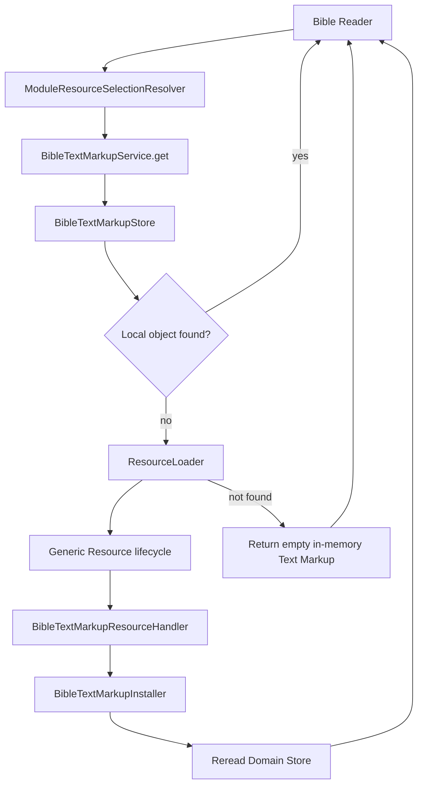
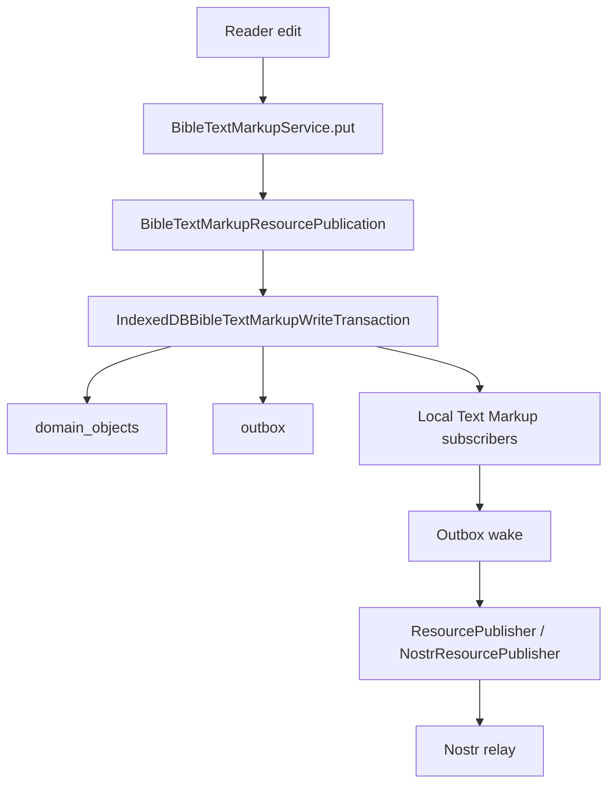

# Bible Text Markup Implementation

## Status

Current

**Date:** 2026-09-12  
**Application:** KJVOnly.bible  
**Domain:** Bible  
**Resource namespace:** `kjvonly/overlays/text-markup`

---

# Purpose

This document describes the current Bible Text Markup implementation.

Text Markup replaces the legacy Reader "annotations" concept for visual Bible-text formatting such as:

* highlighting,
* text color,
* underline/decoration,
* and other CSS-class-based word or verse markup.

The feature is implemented as a Bible Domain Object backed by an overlay Resource.

It supports both:

```text
inbound read/install
```

and:

```text
local write/outbound publication
```

through the new Resource and Outbox architecture.

The central design distinction is:

> **Text Markup is a Bible application Domain Object, but its externally published Resource belongs to the overlays Resource namespace.**

---

# Scope

This document describes:

* Text Markup naming and terminology,
* Domain Object shape,
* application identity,
* Resource identity,
* selected Resource source identity,
* default Text Markup selection,
* Resource interpretation,
* validation,
* installation,
* Domain persistence,
* the local-first `get()` flow,
* empty-state behavior,
* local writes,
* Resource publication mapping,
* Outbox integration,
* Reader integration,
* same-Resource local subscriptions,
* word/verse markup editing,
* Resource worker composition,
* Nostr publication representation,
* testing,
* legacy annotation cleanup boundaries,
* and intentionally deferred synchronization work.

This document does not define:

* synchronization/conflict resolution,
* migration of legacy annotation data,
* a final chapter-menu Resource picker,
* complete authentication redesign,
* generic Notes markup,
* or import/export refactoring.

---

# Naming

The previous feature was called "annotations."

That name was misleading.

The stored object does not represent explanatory notes, comments, or textual annotations.

It represents visual markup applied to Bible text.

Examples include:

```text
background highlight
text color
underline / decoration
```

The new concept is therefore named:

```text
Text Markup
```

This also avoids confusion with the separate Notes Domain.

---

# Resource Namespace vs Application Domain Namespace

Text Markup demonstrates an important Resource boundary rule.

The code lives under the Bible Domain because Bible owns the application meaning.

The Resource is an overlay because it is not Bible text content itself.

Therefore:

```text
Application objectType
    bible/text-markup

Resource Type
    kjvonly/overlays/text-markup
```

These names are intentionally different.

Do not infer Resource namespace from implementation folder location.

---

# Comparison With Paragraphs and Pericopes

Text Markup follows the same general boundary pattern as Paragraphs and Pericopes.

Paragraphs example:

```text
Resource Type
    kjvonly/overlays/paragraphs

Application objectType
    bible/paragraphs
```

Text Markup:

```text
Resource Type
    kjvonly/overlays/text-markup

Application objectType
    bible/text-markup
```

The Resource side describes external published information.

The application side describes how the Bible Domain thinks about the installed object.

---

# Domain Object

The Domain model is implemented at:

```text
src/lib/domains/bible/models/
    bible-text-markup.model.ts
```

Current shape:

```ts
interface BibleTextMarkup {
    readonly id: string;
    readonly chapterRef: string;
    readonly markings: BibleTextMarkupMap;
}
```

A marking is:

```ts
interface BibleTextMarkupMarking {
    class: string[];
}
```

The map is conceptually:

```text
markings
    ↓
verse number
    ↓
word index
    ↓
class[]
```

---

# Example Domain Value

Conceptually:

```json
{
  "id": "<publisher>/kjvs/50_3",
  "chapterRef": "50_3",
  "markings": {
    "2": {
      "1": {
        "class": ["bg-highlighta"]
      },
      "2": {
        "class": ["bg-highlighta"]
      }
    }
  }
}
```

The `class` array is designed to support more than one CSS class for a word.

For example, decoration may involve classes such as:

```text
underline
decoration-solid
```

in addition to the selected color/markup class.

---

# Verse and Word Index Semantics

Verse keys must be canonical positive integers represented as strings.

Examples:

```text
1
2
10
```

Word indexes must be canonical non-negative integers represented as strings.

Word index `0` is valid.

The Reader uses word index `0` for verse-number / whole-verse editing behavior.

Therefore validation must not require word indexes to start at `1`.

---

# Legacy `version` Field Removed

The old annotation object contained a numeric `version` field.

The new `BibleTextMarkup` Domain Object does not.

That legacy field belonged to the old direct Nostr/offline synchronization behavior and is not part of the intrinsic Text Markup Domain model.

Synchronization/version conflict policy is intentionally deferred.

---

# Application Identity

Text Markup application identity is:

```text
<publisher>/<name>/<chapterRef>
```

Created by:

```text
createBibleTextMarkupId(
    publisher,
    name,
    chapterRef
)
```

Example:

```text
4de85e.../kjvs/50_3
```

The components mean:

```text
publisher
    owner/publisher identity

name
    Text Markup set name
    default = current Bible version

chapterRef
    bookId_chapter
```

---

# Stored Domain Object Identity

The application persistence envelope uses:

```text
objectType
    bible/text-markup

objectId
    <publisher>/<name>/<chapterRef>

id
    bible/text-markup:<publisher>/<name>/<chapterRef>
```

For example:

```text
id
    bible/text-markup:4de85e.../kjvs/50_3

objectId
    4de85e.../kjvs/50_3

objectType
    bible/text-markup

value.id
    4de85e.../kjvs/50_3
```

The `value.id` is the application Domain Object ID.

---

# Resource Identity

Text Markup uses:

```text
Resource Type
    kjvonly/overlays/text-markup
```

A selected/base Text Markup source has:

```text
kjvonly/overlays/text-markup/<name>
```

Example:

```text
kjvonly/overlays/text-markup/kjvs
```

An individual chapter Resource has:

```text
kjvonly/overlays/text-markup/<name>/<chapterRef>
```

Example:

```text
kjvonly/overlays/text-markup/kjvs/50_3
```

Publisher is carried separately by the `PublishedResourceReference` / Resource publication.

---

# Resource Identity Is Not Domain Identity

Do not conflate:

```text
bible/text-markup:<publisher>/kjvs/50_3
```

with:

```text
kjvonly/overlays/text-markup/kjvs/50_3
```

The first is an application persistence identity.

The second is a Resource identity.

Mapping between them belongs to Text Markup Resource code.

---

# `name`

The Resource model intentionally calls the middle identity component `name`, not `version`.

The default current behavior uses the Bible version as the name:

```text
kjvs
kjv
```

but the identity model can support other named markup sets later without changing the Resource structure.

Examples could include:

```text
study
personal
sermon
```

No such additional UI/policy is implemented yet.

---

# Default Text Markup Source

Text Markup is a required Resource Type for the Bible module.

Its default selection is derived from:

```text
current authenticated user's pubkey
        +
selected Bible Chapter Resource version/name
```

For example:

```text
current user
    <user pubkey>

selected Bible Chapter source
    kjvonly/bible/chapters/kjvs
```

produces:

```text
publisher
    <user pubkey>

resourceId
    kjvonly/overlays/text-markup/kjvs
```

The policy lives in:

```text
src/lib/domains/bible/resources/text-markup/
    bible-text-markup-default-selection.ts
```

rather than in the generic application Resource-selection builder.

---

# Bible Module Requirement

The Bible Resource-selection contributor includes Text Markup with:

```text
Bible Chapters
Paragraphs
Pericopes
Booknames
Strong's
Text Markup
```

Text Markup is not modeled as an optional module requirement.

The module needs Text Markup Resource-selection context even though future UI may allow the user to change or hide the selected markup.

---

# Resource Source Parsing

Selected Text Markup sources are parsed by:

```text
bible-text-markup-resource-source.ts
```

A valid selected source must be exactly:

```text
kjvonly/overlays/text-markup/<name>
```

The parser rejects:

```text
kjvonly/overlays/text-markup
```

because it has no name.

It also rejects an individual chapter Resource such as:

```text
kjvonly/overlays/text-markup/kjvs/50_3
```

because services expect the selected base source and append chapter identity when loading.

---

# Inbound Resource Contract

The inbound Text Markup Resource implementation is organized under:

```text
src/lib/domains/bible/resources/text-markup/
```

Current components include:

```text
BibleTextMarkupCandidate
BibleTextMarkupInterpreter
BibleTextMarkupValidator
ValidatedBibleTextMarkupCandidate
BibleTextMarkupInstaller
BibleTextMarkupResourceHandler
```

This mirrors the established Resource lifecycle used by other Bible Resources.

---

# Resource Interpreter

`BibleTextMarkupInterpreter` owns Resource identity interpretation.

Resource Type:

```text
kjvonly/overlays/text-markup
```

It supports two Resource shapes.

## Individual chapter Resource

Path:

```text
<name>/<chapterRef>
```

Example:

```text
kjvs/50_3
```

The entire decoded `resource.value` becomes the candidate value for that chapter.

## Named bundle Resource

Path:

```text
<name>
```

Example:

```text
kjvs
```

The decoded Resource value must be an object keyed by chapter reference.

Each chapter entry becomes one candidate.

---

# Interpreter Validation of Identity Shape

The interpreter rejects:

* the Resource Type root with no path,
* Resource Types other than Text Markup,
* invalid Resource Identifier paths,
* invalid chapter references,
* and bundle values that are not objects.

A chapter reference must have canonical form:

```text
<positive book id>_<positive chapter number>
```

Example:

```text
50_3
```

---

# Candidate vs Validated Candidate

The interpreter produces a candidate containing:

```text
name
chapterRef
value
```

The candidate is not yet accepted Domain state.

`BibleTextMarkupValidator` validates Domain meaning and produces a validated candidate containing:

```text
name
chapterRef
markings
```

---

# Text Markup Validation

Validation uses a strict schema for each marking:

```ts
{
    class: string[]
}
```

Extra properties are rejected by the strict marking schema.

The validator also validates the map keys.

## Verse key

Must be a canonical positive integer.

Invalid examples include:

```text
0
-1
01
abc
```

## Word index

Must be a canonical non-negative integer.

Valid:

```text
0
1
2
```

Invalid examples include:

```text
-1
01
abc
```

---

# Resource Handler

`BibleTextMarkupResourceHandler` performs the standard Domain Resource pipeline:

```text
DecodedResourceContent
    ↓
BibleTextMarkupInterpreter
    ↓
BibleTextMarkupCandidate[]
    ↓
BibleTextMarkupValidator
    ↓
ValidatedBibleTextMarkupCandidate[]
    ↓
BibleTextMarkupInstaller
```

The handler is registered with the generic Resource worker.

---

# Resource Worker Registration

The Resource worker composition registers Text Markup alongside:

```text
Bible Chapters
Bible Booknames
Paragraphs
Pericopes
Bible Search Index
Strong's
```

The generic worker remains responsible for:

```text
Resource Resolution
    ↓
content decoding
    ↓
ResourceHandler dispatch
```

Text Markup Domain interpretation and installation remain in the Bible Domain.

---

# Installation

`BibleTextMarkupInstaller` receives:

```text
DecodedResourceContent
ValidatedBibleTextMarkupCandidate[]
```

For each candidate it builds the application Domain identity:

```text
<publisher>/<name>/<chapterRef>
```

using the Resource publisher, candidate name, and candidate chapter reference.

It then creates:

```text
BibleTextMarkup
ResourceInstallation
```

inside one installation transaction.

---

# Installation Persistence

Installation writes:

```text
domain_objects
resource_installations
```

atomically through:

```text
IndexedDBBibleTextMarkupInstallationTransaction
```

The stored Domain Object uses:

```text
objectType = bible/text-markup
```

The `ResourceInstallation` records inbound provenance including:

```text
objectType
objectId
publisher
resourceId
modifiedAt
```

---

# Existing Local Text Markup Is Not Replaced

The current installer intentionally checks for an existing Text Markup Domain Object before installing a candidate.

If the object already exists:

```text
continue
```

The installer does not compare `modifiedAt` and overwrite existing accepted local state.

This differs intentionally from static reference Resources such as Paragraphs/Pericopes.

Why:

```text
Text Markup is locally writable user state.
```

Remote-vs-local synchronization/conflict policy is not yet defined.

Installation therefore supports the initial/missing-object inbound path without inventing synchronization behavior.

---

# `BibleTextMarkupStore`

The Domain store contract is:

```text
BibleTextMarkupStore
```

with current operations:

```text
get(id)
put(textMarkup)
```

Concrete implementation:

```text
IndexedDBBibleTextMarkupStore
```

It reads/writes the shared application:

```text
domain_objects
```

store.

---

# Read/Get Flow

`BibleTextMarkupService.get()` follows the same local-first read pattern as other Resource-backed Domain services.

Inputs:

```text
selected PublishedResourceReference
Bible location reference
```

Flow:

```text
parse selected Text Markup source
    ↓
extract name
    ↓
extract chapterRef from Bible location
    ↓
create application Text Markup id
    ↓
Domain Store.get(id)
```

On local hit:

```text
return Domain Object
```

---

# Read Miss Flow

On a local miss:

```text
BibleTextMarkupService
    ↓
ResourceLoader.load(
    selected source,
    chapterRef
)
```

The `ResourceLoader` appends the chapter key to the selected source and executes the generic Resource install lifecycle.

Conceptually:

```text
selected source
    kjvonly/overlays/text-markup/kjvs
        +
chapterRef
    50_3
        ↓
individual Resource
    kjvonly/overlays/text-markup/kjvs/50_3
```

---

# Reread After Installation

If Resource loading reports success, the service rereads the Domain store.

It does not return a downloaded/interpreted object directly from the Resource loader.

Flow:

```text
local miss
    ↓
ResourceLoader
    ↓
Resource lifecycle installs Domain Object
    ↓
Domain Store.get(id) again
    ↓
return installed Domain Object
```

The Domain store remains the read-side source of truth.

---

# No Published Text Markup Is Normal

A new user may have no published Text Markup Resource for a chapter.

That is not an error.

When Resource loading reports no Resource found, `get()` returns an empty in-memory Domain Object:

```ts
{
    id: '<publisher>/<name>/<chapterRef>',
    chapterRef: '<chapterRef>',
    markings: {}
}
```

This empty object is not persisted merely because it was read.

Persistence occurs when the user actually writes Text Markup.

---

# Installation Contract Failure

If Resource loading reports success but the expected Domain Object is still absent from the Domain store, the service throws.

This protects the invariant:

```text
successful Resource processing
    ↓
expected Domain installation must exist
```

---

# Local Write Flow

The Reader writes only a `BibleTextMarkup` Domain Object.

API:

```ts
bibleTextMarkupService.put(textMarkup)
```

The caller does not provide:

* Resource Type,
* Resource ID,
* selected Resource source,
* publisher separately,
* Nostr kind,
* tags,
* or relay information.

The Domain Object already contains the application identity required by the Domain Resource publication mapper.

---

# Resource Publication Mapping

Outbound mapping is owned by:

```text
BibleTextMarkupResourcePublication
```

under:

```text
src/lib/domains/bible/resources/text-markup/
```

It parses:

```text
textMarkup.id
    <publisher>/<name>/<chapterRef>
```

and verifies:

```text
textMarkup.chapterRef == chapterRef encoded in id
```

---

# Outbound Resource Created by Text Markup

The mapper creates:

```text
publisher
    parsed publisher

resourceType
    kjvonly/overlays/text-markup

resourceId
    kjvonly/overlays/text-markup/<name>/<chapterRef>

representation
    content

mediaType
    application/json+gzip+hex

value
    textMarkup.markings
```

The mapping is Domain-specific and intentionally not implemented in generic Outbox code.

---

# Why `value` Is Only `markings`

The Resource content does not need to duplicate identity already carried by Resource metadata.

Therefore outbound content is:

```text
markings
```

not:

```text
{
    id,
    chapterRef,
    markings
}
```

Publisher/name/chapter are represented by:

```text
publisher
resourceId
```

The inbound interpreter reconstructs candidate identity from those Resource fields.

---

# Atomic Local Write + Outbox

`BibleTextMarkupService.put()` coordinates:

```text
create ResourcePublication
    ↓
write transaction
```

The transaction writes:

```text
domain_objects
outbox
```

atomically.

The Outbox row uses the same local persistence ID as the stored Domain Object.

For example:

```text
bible/text-markup:<publisher>/kjvs/50_3
```

The Outbox stores the complete Resource publication.

It does not store only a pointer back to the Domain Object.

---

# Save Completion Order

The current logical save order is:

```text
BibleTextMarkupResourcePublication.create(...)
    ↓
atomic Domain Object + Outbox transaction
    ↓
notify local Text Markup subscribers
    ↓
Outbox wake()
```

The UI sees accepted local state without waiting for relay publication.

---

# Local Subscription Model

`BibleTextMarkupService` maintains local in-memory subscribers.

A subscription is keyed by:

```text
subscriberId
textMarkupId
```

The key uses the full Text Markup application ID:

```text
<publisher>/<name>/<chapterRef>
```

not only the chapter reference.

This matters because two panes may display:

* different publishers,
* different named Text Markup sets,
* or different Bible-version defaults

for the same chapter.

---

# Same-Text-Markup Propagation

After a successful local `put()`:

```text
BibleTextMarkupService.notify(textMarkup)
```

notifies subscribers whose `textMarkupId` exactly matches `textMarkup.id`.

This restores the useful behavior that had previously been entangled with the removed legacy sync service.

Example:

```text
Pane A shows user/kjvs/50_3
Pane B shows user/kjvs/50_3

Pane A saves highlight
    ↓
local Domain write commits
    ↓
Pane B receives updated Text Markup
```

No relay round-trip is required for same-application propagation.

---

# Local Subscription vs Synchronization

Local subscriptions are not synchronization.

They solve:

```text
multiple currently open module instances
sharing the same accepted local Domain Object
```

Synchronization will later solve:

```text
remote publications arriving after local state exists
startup/reconnect remote updates
conflict/update policy
```

Do not rebuild the old sync service merely to provide local UI reactivity.

---

# Reader Integration

The Bible Reader now consumes Text Markup through `BibleTextMarkupService`.

The Reader no longer owns the legacy annotation read/write path.

In `chapter.svelte`:

```text
pane.id
    ↓
ModuleResourceSelectionResolver.require(
    pane.id,
    BIBLE_TEXT_MARKUP_RESOURCE_TYPE
)
    ↓
selected Text Markup source
    ↓
BibleTextMarkupService.get(...)
```

The returned Domain Object is copied into Reader state for editing.

---

# Reader Load Flow

When chapter context changes, the Reader:

```text
unsubscribe previous Text Markup
    ↓
reset local Text Markup state
    ↓
resolve selected Text Markup Resource
    ↓
load/get Text Markup
    ↓
copy installed/empty object into Svelte state
    ↓
subscribe using full Text Markup id
```

This prevents a Pane from remaining subscribed to markup for a previous chapter/source.

---

# Editing Model

`word.svelte` works directly against:

```text
textMarkup.markings[verse][wordIndex]
```

If a marking does not exist, it creates:

```ts
{
    class: []
}
```

The existing Reader editing behavior is preserved while the persistence architecture changes underneath it.

---

# Whole-Verse Editing

Word index `0` represents the verse-number / whole-verse operation.

When markup is applied to the verse number, the Reader determines whether the markup already exists and applies or clears the selected markup across the verse's word indexes.

This is why Text Markup validation explicitly permits word index `0`.

---

# Markup Classes

Current UI behavior supports class families such as:

```text
bg-highlighta
bg-highlightb
...

text-highlighta
text-highlightb
...

decoration-highlighta
...
underline
decoration-solid
```

The Domain model intentionally stores generic `class: string[]` rather than a hardcoded enum of current presentation classes.

This preserves existing Reader behavior and leaves presentation-specific evolution outside the generic Resource lifecycle.

---

# Saving From the Reader

The edit UI saves through:

```text
BibleTextMarkupService.put(...)
```

It sends a copied `BibleTextMarkup` Domain Object.

The edit component does not:

* create Resource IDs,
* build Nostr events,
* call relay services,
* gzip content,
* hex encode content,
* or write IndexedDB directly.

---

# Cancel / Close Behavior

Closing/canceling edit mode without saving rereads Text Markup using:

```text
selected module Text Markup source
    ↓
BibleTextMarkupService.get(...)
```

The Reader replaces its mutable edit state with the currently accepted local Domain state.

---

# Outbound Nostr Representation

After the local write commits, the generic Outbox publishes the Text Markup Resource.

Current Nostr representation:

```text
kind
    37770

d
    kjvonly/overlays/text-markup/<name>/<chapterRef>

t
    kjvonly/overlays/text-markup

m
    application/json+gzip+hex

representation
    content
```

The event content is:

```text
JSON(markings)
    ↓ gzip
    ↓ hex
```

---

# Example End-to-End Identity

Assume:

```text
publisher
    4de85e...

name
    kjvs

chapterRef
    50_3
```

Application Domain Object:

```text
objectType
    bible/text-markup

objectId
    4de85e.../kjvs/50_3

stored id
    bible/text-markup:4de85e.../kjvs/50_3
```

Outbound Resource:

```text
publisher
    4de85e...

resourceType
    kjvonly/overlays/text-markup

resourceId
    kjvonly/overlays/text-markup/kjvs/50_3
```

Nostr:

```text
kind 37770
#d = kjvonly/overlays/text-markup/kjvs/50_3
#t = kjvonly/overlays/text-markup
```

---

# Full Read Flow



---

# Full Write Flow



---

# Read and Write Boundaries

The Text Markup service intentionally has asymmetric inputs.

## `get()`

```text
selected Resource source
    +
Bible location
```

because read acquisition begins from module Resource selection.

## `put()`

```text
BibleTextMarkup Domain Object
```

only.

The write caller does not need to know Resource identity.

`BibleTextMarkupResourcePublication` owns Domain→Resource mapping.

This asymmetry is intentional and should be preserved.

---

# Application Composition

`Application` composes:

```text
IndexedDBBibleTextMarkupStore
ResourceLoader
IndexedDBBibleTextMarkupWriteTransaction
BibleTextMarkupResourcePublication
BibleTextMarkupService
OutboxProcessor
```

`ApplicationContext` exposes:

```text
bibleTextMarkupService
```

and the generic:

```text
moduleResourceSelectionResolver
```

The Reader depends on those application-facing capabilities.

---

# Resource Worker Composition

The worker constructs:

```text
IndexedDBBibleTextMarkupInstallationTransaction
BibleTextMarkupInstaller
BibleTextMarkupInterpreter
BibleTextMarkupValidator
BibleTextMarkupResourceHandler
```

and registers the handler with the generic `ResourceProcessor`.

The main-thread Reader does not construct or call these inbound lifecycle components directly.

---

# Legacy Annotation Architecture

Text Markup replaces the Reader's legacy annotation architecture.

The Reader should not depend on:

```text
AnnotsService
nostr/events/annots.nostr
old direct relay annotation calls
old syncService annotation subscriptions
```

The root legacy `src/lib/nostr` area is intentionally being left for later wholesale cleanup.

Do not rebuild new Text Markup behavior on top of that legacy event API.

---

# Legacy Annotation Data Migration

There is no requirement to migrate old annotation/highlight data into Text Markup.

The new Text Markup implementation may begin with new Resource-backed/local state.

Do not add a legacy annotation migration unless requirements change explicitly.

---

# Import / Export

Legacy import/export and deep-merge services remain for future refactoring.

They were intentionally not treated as part of the completed Text Markup vertical slice.

Future import/export work should operate through current Domain persistence and Resource boundaries rather than reviving legacy annotation/Nostr ownership.

---

# Synchronization Is Deferred

The current implementation deliberately does not define Text Markup synchronization.

Specifically unresolved:

```text
startup remote update discovery
reconnect remote update discovery
remote-vs-local conflict policy
newer remote publication selection
pending local Outbox vs remote publication interaction
remote installation when local accepted Text Markup already exists
```

The current installer therefore does not replace existing local Text Markup.

This must remain a separate design slice.

---

# Chapter Menu Resource Selection Is Deferred

The Bible chapter menu is expected to expose Resource selection for overlays including Text Markup.

The default currently selects:

```text
current user
+
current Bible version
```

Future UI should allow selection changes without bypassing the module Resource-selection architecture.

This should be treated consistently with other selectable overlays such as Paragraphs and Pericopes.

---

# Viewing Other Publishers

The identity model supports Text Markup from publishers other than the current user.

A selected Text Markup source may therefore point at another publisher.

Read behavior is compatible with this model.

Write authorization/policy is not fully modeled in the Reader yet.

The Nostr publisher currently protects the transport boundary by requiring:

```text
resource.publisher == configured signer pubkey
```

A future UI/application policy may prevent editing another publisher's markup earlier in the flow.

---

# Important Files

Domain model:

```text
src/lib/domains/bible/models/
    bible-text-markup.model.ts
```

Resource implementation:

```text
src/lib/domains/bible/resources/text-markup/
    bible-text-markup-candidate.ts
    validated-bible-text-markup-candidate.ts
    bible-text-markup-interpreter.ts
    bible-text-markup-validator.ts
    bible-text-markup-installer.ts
    bible-text-markup-resource-handler.ts
    bible-text-markup-resource-source.ts
    bible-text-markup-default-selection.ts
    bible-text-markup-resource-publication.ts
    bible-text-markup-write-stores.ts
```

Persistence:

```text
src/lib/domains/bible/persistence/
    bible-text-markup-store.ts
    indexeddb-bible-text-markup-store.ts
    bible-text-markup-installation-transaction.ts
    bible-text-markup-write-transaction.ts
```

Domain service:

```text
src/lib/domains/bible/services/
    bible-text-markup.service.ts
```

Module Resource selection:

```text
src/lib/domains/bible/resources/
    bible-module-resource-selection-contributor.ts
```

Reader integration:

```text
src/lib/domains/bible/modules/reader/
    bibleContainer.svelte
    chapter/chapter.svelte
    chapter/verse.svelte
    chapter/word.svelte
    chapter/editOptions.svelte
```

Generic publication path:

```text
src/lib/resource/publication/
src/lib/resource/outbox/
src/lib/resource/nostr/
src/lib/resource/content/
```

---

# Testing Strategy

Text Markup has focused tests for each boundary.

## Domain model

Verify identity creation.

## Default Resource selection

Verify current user + selected Bible version mapping.

## Interpreter

Verify:

* individual chapter Resource,
* bundle Resource,
* invalid Resource Type,
* invalid path,
* invalid chapter reference,
* and invalid bundle shape.

## Validator

Verify:

* marking shape,
* strict object validation,
* verse key rules,
* word index rules,
* and word index `0` support.

## Installer

Verify:

* Domain identity construction,
* Domain Object persistence,
* ResourceInstallation persistence,
* atomic installation transaction,
* multiple-name rejection,
* and preservation of existing local Text Markup.

## Resource handler

Verify interpreter → validator → installer composition.

## Service read path

Verify:

* local hit,
* local miss → Resource load → reread,
* no remote Resource → empty object,
* Resource processing success without installation → error,
* invalid source rejection,
* and load failure propagation.

## Service write path

Verify:

* Domain Object + Outbox Resource transaction,
* outbound Resource derivation from Domain identity,
* subscriber notification,
* and Outbox wake after commit.

## Resource publication

Verify:

* publisher parsing,
* name/chapter parsing,
* chapter identity consistency,
* Resource Type,
* individual Resource ID,
* representation,
* gzip+hex media type,
* and published value.

---

# Verification

Normal project verification:

```bash
npm run test && npm run build
```

Manual relay verification can query the chapter Resource by `d` tag and decode the content.

Example:

```bash
nak req \
  -k 37770 \
  -a <publisher> \
  -t d=kjvonly/overlays/text-markup/kjvs/50_3 \
  ws://localhost:3334 \
  | jq -r '.content' \
  | xxd -r -p \
  | gzip -dc \
  | jq
```

The decoded JSON should contain the `markings` value that was written locally.

---

# Implementation Invariants

A compatible continuation of this implementation should preserve:

```text
Text Markup application type is bible/text-markup.

Text Markup Resource Type is kjvonly/overlays/text-markup.

Application identity and Resource identity remain distinct.

Text Markup is chapter-scoped.

The default name is the selected Bible version.

The default publisher is the current user.

get() begins from a selected Resource source.

put() accepts a Domain Object only.

Domain→Resource mapping lives in Bible Text Markup Resource code.

Resource installation rereads through the Domain store.

No published Text Markup is a normal empty state.

Existing local Text Markup is not overwritten by inbound installation
until synchronization policy is explicitly designed.

Local writes atomically persist Domain state and Outbox publication intent.

Reader components do not construct Nostr events or access relays.

Local cross-pane propagation does not depend on relay synchronization.
```

---

# Anti-Patterns

Do not reintroduce:

```text
annotations as the primary Reader Domain model
```

Do not store new Text Markup in old:

```text
bible.db / ANNOTATIONS / UNSYNCED_ANNOTATIONS
```

Do not make `BibleTextMarkupService` depend on:

```text
Pane
Buffer
ModuleResourceSelectionResolver
```

Do not make Reader components derive:

```text
kjvonly/overlays/text-markup/...
```

Do not pass Resource identity into `put()`.

Do not make the Outbox reconstruct Text Markup Resources from Domain stores.

Do not use `modifiedAt` as an implicit Text Markup conflict-resolution rule.

Do not rebuild the removed sync service as part of ordinary Text Markup reads/writes.

---

# Deferred Work

## Synchronization

Separate design phase.

## Chapter menu Resource picker

Add UI for selecting/changing Text Markup source consistently with Paragraphs/Pericopes.

## Authentication

Replace current nsec-only identity implementation with the broader authentication model while preserving the current-user pubkey capability.

## Other-publisher edit policy

Define UI/application behavior when a user is viewing Text Markup owned by another publisher.

## Import/export

Refactor legacy import/export/deep-merge behavior onto current Domain persistence when that work begins.

## Legacy root Nostr cleanup

The old `src/lib/nostr` tree is expected to be removed later as Notes, Plans, and other remaining consumers migrate.

---

# Future Agent Checklist

When changing Text Markup:

1. Keep Resource and Domain identity namespaces separate.
2. Keep the Resource Type under `kjvonly/overlays/text-markup`.
3. Keep the application object type `bible/text-markup`.
4. Use the full `<publisher>/<name>/<chapterRef>` Domain identity.
5. Preserve word index `0` semantics.
6. Resolve read source from the module Buffer.
7. Keep `BibleTextMarkupService.get()` local-first with install-on-miss.
8. Keep `BibleTextMarkupService.put()` Domain-object-only.
9. Map Domain→Resource through `BibleTextMarkupResourcePublication`.
10. Keep Domain + Outbox persistence atomic.
11. Notify local subscribers after local acceptance.
12. Do not implement synchronization accidentally inside installation.
13. Do not reuse the old direct Nostr annotation API.
14. Run focused Text Markup tests and full `npm run test && npm run build`.

---

# Big Takeaway

Bible Text Markup is now a complete vertical slice across the new architecture:

```text
Module Resource selection
    ↓
BibleTextMarkupService.get()
    ↓
local Domain Store
    ↓ miss
Resource lifecycle / installation
    ↓
accepted BibleTextMarkup
    ↓
Reader editing
    ↓
BibleTextMarkupService.put()
    ↓
Domain Resource publication mapping
    ↓
atomic Domain + Outbox persistence
    ↓
ResourcePublisher
    ↓
Nostr Resource publication
```

The Reader works with a Bible Domain Object.

The Resource layer owns external Resource identity and representation.

The Outbox owns durable asynchronous publication.

Nostr remains the current transport implementation rather than a Reader/Domain dependency.
