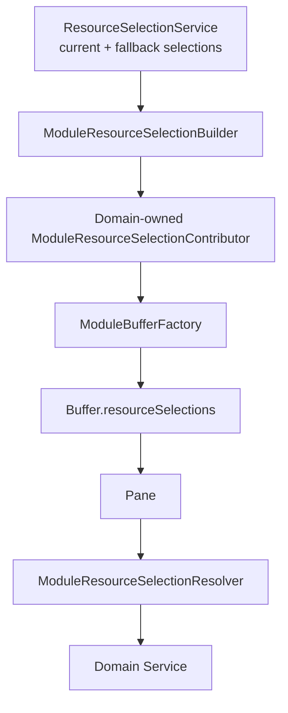
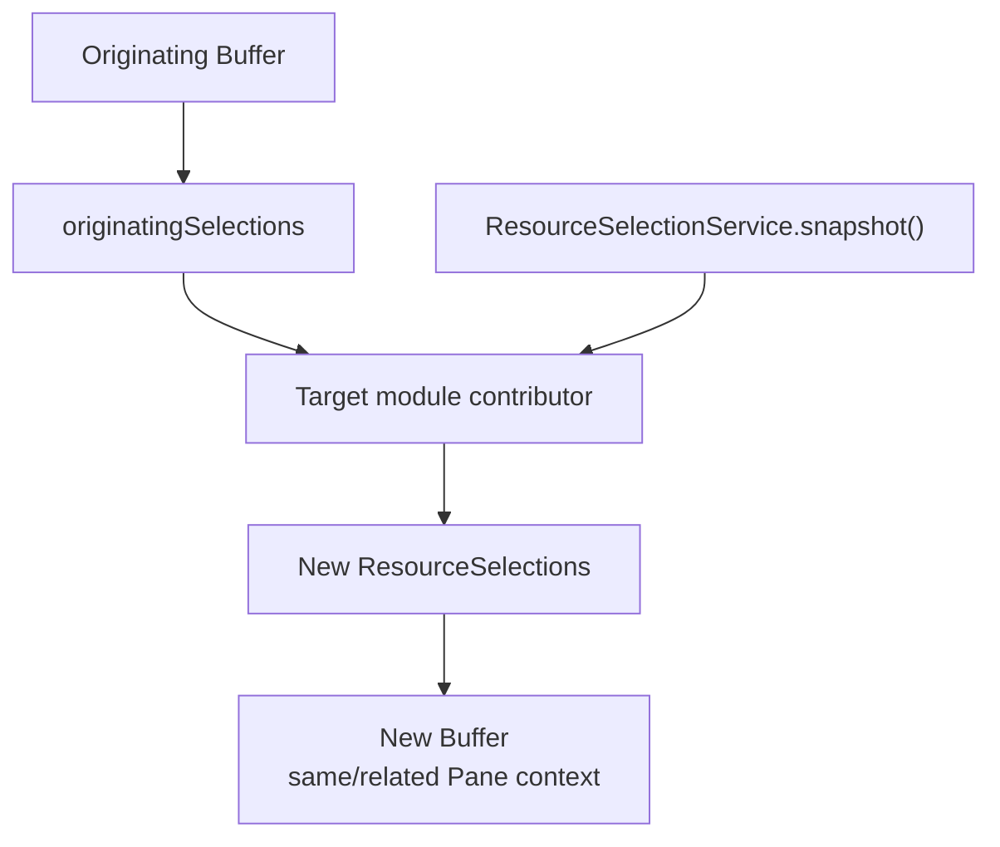
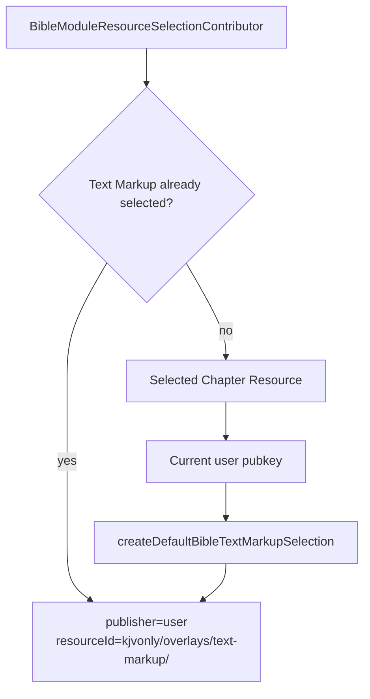

# Module Resource Selection Implementation

## Status

Current

**Date:** 2026-09-12  
**Application:** KJVOnly.bible  
**Area:** Application Runtime / Resource Selection

---

# Purpose

This document describes the current implementation of module-scoped Resource selection in the KJVOnly PWA.

The implementation solves a specific runtime problem:

> A running module instance must consume the Resource selections that were captured for that module instance, rather than repeatedly consulting mutable global application selection state or deriving sources from unrelated values such as a Bible version string.

The current implementation introduces and composes:

```text
ResourceSelectionService
    ↓
ModuleResourceSelectionContributor
    ↓
ModuleResourceSelectionBuilder
    ↓
ModuleBufferFactory
    ↓
Buffer.resourceSelections
    ↓
Pane
    ↓
ModuleResourceSelectionResolver
    ↓
PublishedResourceReference
    ↓
Domain service
```

The central rule is:

> **Resource selection is application/runtime context. Domain services receive selected Resource references, but do not know about Pane, Buffer, Workspace, or module selection policy.**

---

# Scope

This document describes:

* application-wide Resource selections,
* fallback Resource selections,
* persisted current Resource selections,
* module-specific Resource requirements,
* module-owned Resource-selection contributors,
* Buffer Resource-selection snapshots,
* related vs independent module creation,
* module Resource-selection resolution by `paneID`,
* Bible Text Markup default selection,
* the temporary current-user authentication dependency used by that default,
* contributor composition in `Application`,
* current Resource requirements for Bible, Search, Strong's, Notes, and Reading Plans,
* invariants and dependency direction,
* testing boundaries,
* and deferred Resource-selection UI work.

This document does not define:

* Resource Discovery,
* Resource Resolution,
* Resource Installation,
* Domain Resource interpretation,
* Outbox publication,
* Nostr event construction,
* synchronization,
* conflict resolution,
* or the complete authentication architecture.

Those responsibilities are documented separately.

---

# Background

Earlier application code commonly selected Bible-related data using one of several problematic patterns:

```text
component
    ↓
ResourceSelectionService.require(...)
```

or:

```text
component
    ↓
current bibleVersion
    ↓
derive Resource ID
```

or:

```text
parent component
    ↓
chapterSource prop
    ↓
child component
    ↓
more Resource-source props
```

These patterns made module behavior depend on mutable global state and encouraged Resource-source prop drilling.

That becomes incorrect as soon as the application supports:

* multiple Panes,
* multiple instances of the same module,
* changing Resource selections,
* different Bible versions in different Panes,
* different overlay publishers,
* user-owned Resource sources,
* or module transitions that preserve navigation context while changing Resource context.

The runtime therefore now treats Resource selections as part of the Module Buffer.

A Buffer represents one module instance's runtime context.

Its Resource selections are a snapshot captured when that Buffer is created.

---

# Architectural Context

The application has two related but distinct selection concepts.

## Application selection state

`ResourceSelectionService` represents the application's effective current selections.

It is used when creating new module Resource context.

## Module selection state

`Buffer.resourceSelections` represents the Resource context captured for one running module instance.

Once a module has a Buffer, module consumers should read from that Buffer rather than from global selection state.

Conceptually:

```text
Application Resource selections
        ↓
new module Buffer is created
        ↓
module-owned selection contributor
        ↓
Resource selection snapshot
        ↓
Buffer.resourceSelections
        ↓
module lifetime
```

This distinction is intentional.

```text
ResourceSelectionService
    = application-wide current/default selection policy

Buffer.resourceSelections
    = selection context for one concrete module instance
```

A later global selection change must not silently change the meaning of an already-running module instance unless application behavior explicitly replaces or updates that module Buffer.

---

# Core Types

## `PublishedResourceReference`

A module selection resolves to a Resource source represented by:

```ts
{
    publisher: string;
    resourceId: string;
}
```

The Resource Type is encoded in `resourceId` and validated when Resource selections are parsed.

Examples:

```text
Bible Chapters
publisher  = <KJVOnly publisher>
resourceId = kjvonly/bible/chapters/kjvs

Paragraphs
publisher  = <publisher>
resourceId = kjvonly/overlays/paragraphs/default

Text Markup
publisher  = <current user pubkey>
resourceId = kjvonly/overlays/text-markup/kjvs
```

---

## `ResourceSelections`

Resource selections are stored as:

```ts
Record<string, PublishedResourceReference>
```

The key is the Resource Type.

For example:

```ts
{
    'kjvonly/bible/chapters': {
        publisher: '...',
        resourceId: 'kjvonly/bible/chapters/kjvs'
    },

    'kjvonly/overlays/paragraphs': {
        publisher: '...',
        resourceId: 'kjvonly/overlays/paragraphs/default'
    }
}
```

`parseResourceSelections()` validates that the key Resource Type matches the Resource Type parsed from the selected `resourceId`.

This prevents a selection from being stored under an unrelated Resource Type key.

---

# `ResourceSelectionService`

The application-wide selection service is implemented in:

```text
src/lib/application/resources/resource-selection.service.ts
```

It owns two maps.

## Current selections

Current selections come from:

* restored persisted state,
* bootstrap initialization,
* explicit user/application selection.

These selections are persisted.

## Fallback selections

Fallback selections are application-provided startup defaults.

They make Resource Types immediately usable before bootstrap installation/discovery finishes.

Fallback selections are not persisted merely because the application started with them.

Conceptually:

```text
get(resourceType)
    ↓
current selection if present
    ↓ otherwise
fallback selection
```

---

# Why Fallbacks and Current Selections Are Separate

The application needs immediate startup defaults, but bootstrap Resources may advertise the real application defaults.

If fallbacks were persisted immediately, they could accidentally become durable current selections before bootstrap policy had an opportunity to initialize the intended values.

Therefore:

```text
fallback selection
    ≠ persisted current selection
```

`initializeMissing()` only refuses bootstrap initialization when a true current selection already exists.

A fallback alone does not block bootstrap initialization.

---

# Snapshot Behavior

`ResourceSelectionService.snapshot()` returns the effective selection state used to create module Buffers.

The snapshot contains:

```text
fallback selections
    overlaid by
current selections
```

Returned Resource references are copied.

The snapshot is not a live view into `ResourceSelectionService`.

---

# Module-Owned Resource Selection

The previous centralized implementation used a table similar to:

```text
MODULE_RESOURCE_REQUIREMENTS
```

That design was removed.

It created a code-organization problem:

```text
generic application Resource code
    knows
Bible module semantics
Search module semantics
Strong's semantics
Notes semantics
Plans semantics
```

It also encouraged special cases such as:

```ts
if (module === Modules.BIBLE) {
    // Bible-specific selection behavior
}
```

That violates the desired ownership model and makes the generic builder progressively harder to extend.

The current implementation uses one Resource-selection contributor per module.

---

# `ModuleResourceSelectionContributor`

The generic contributor contract is defined under:

```text
src/lib/application/resources/module-resource-selection-contributor.ts
```

Conceptually:

```ts
interface ModuleResourceSelectionContributor {
    readonly module: Modules;

    build(
        context: ModuleResourceSelectionBuildContext
    ): ResourceSelections;
}
```

The build context provides:

```text
originatingSelections
currentSelections
```

The contributor returns the completed Resource-selection snapshot for its module.

---

# Contributor Ownership

Module-specific contributors live with the Domain that owns the module semantics.

Current placement:

```text
src/lib/domains/bible/resources/
    bible-module-resource-selection-contributor.ts

src/lib/domains/bible/resources/search/
    search-module-resource-selection-contributor.ts

src/lib/domains/strongs/resources/
    strongs-module-resource-selection-contributor.ts

src/lib/domains/notes/resources/
    notes-module-resource-selection-contributor.ts

src/lib/domains/reading-plans/resources/
    plans-module-resource-selection-contributor.ts
```

This placement is intentional.

The contributor may use generic application mechanics, but the Domain owns the meaning of:

* which Resource Types the module requires,
* which selection should be inherited,
* which defaults need Domain-specific derivation,
* and how future module-specific Resource behavior evolves.

---

# Generic Selection Mechanism

The generic helper:

```text
buildRequiredResourceSelections(...)
```

implements the normal selection rule for a Resource Type:

```text
originating module selection
        ↓ if absent
current application selection
```

The selected reference is copied into the result.

This helper is mechanism, not module policy.

The contributor decides which Resource Types use the mechanism.

---

# Why Originating Selections Win

When one module transitions to another module in the same Pane, related Resource context should generally follow the navigation relationship.

For example:

```text
Bible Reader using KJVS
    ↓
open Strong's in related Pane/module context
```

The related module should first inherit compatible selections from the originating Buffer.

Only missing selections fall back to the current application snapshot.

This avoids silently replacing related module context with unrelated newer global selections.

---

# Current Module Resource Requirements

The current contributors define the following Resource requirements.

## Bible Reader

```text
Bible Chapters
Paragraphs
Pericopes
Booknames
Strong's
Text Markup
```

Resource Types:

```text
kjvonly/bible/chapters
kjvonly/overlays/paragraphs
kjvonly/overlays/pericopes
kjvonly/bible/booknames
kjvonly/strongs/definitions
kjvonly/overlays/text-markup
```

The Bible contributor also contains the Domain-specific default rule for Text Markup.

---

## Bible Search

```text
Bible Search Index
Bible Chapters
Bible Booknames
```

---

## Strong's

```text
Strong's Definitions
Bible Chapters
Bible Search Index
Bible Booknames
```

---

## Notes

```text
Bible Chapters
Bible Booknames
```

This reflects the current partial Notes migration.

Notes Resource ownership itself is not yet modeled by this contributor.

---

## Reading Plans

```text
Bible Booknames
```

The Reading Plans Resource architecture remains incomplete.

Default plan definitions are expected to become Resource-backed/bootstrap-installed later.

---

## Resource-free modules

Modules without Resource requirements use:

```text
NoResourceModuleResourceSelectionContributor
```

Current explicit registrations include modules such as:

```text
Modules.MODULES
Modules.USER_GUIDE
Modules.LOGIN
Modules.SETTINGS
Modules.NULL
Modules.PROFILE
```

The contributor returns an empty Resource-selection object.

Explicit registration is preferred over silently treating an unregistered module as resource-free.

---

# `ModuleResourceSelectionBuilder`

The generic builder is implemented at:

```text
src/lib/application/resources/module-resource-selection-builder.ts
```

Its responsibility is intentionally small.

It does not know module Resource requirements.

It does not know Bible Resource IDs.

It does not know Text Markup defaults.

It does not contain `if module === ...` logic.

Its flow is:

```text
module
    ↓
find registered contributor
    ↓
obtain current ResourceSelectionService snapshot
    ↓
pass current + originating selections to contributor
    ↓
return completed ResourceSelections
```

If a module has no registered contributor, the builder fails fast:

```text
No Resource selection contributor registered for module: ...
```

This makes module Resource ownership explicit.

---

# Open/Closed Principle

The contributor architecture exists specifically to preserve this rule:

> Adding or changing one module's Resource-selection semantics should normally require changing that module's contributor, not the generic application builder.

For example, adding another Bible overlay should generally involve:

```text
Bible Domain
    ↓
BibleModuleResourceSelectionContributor
```

not:

```text
ModuleResourceSelectionBuilder
    ↓
new Bible special case
```

---

# `ModuleBufferFactory`

`ModuleBufferFactory` converts module selection policy into runtime Buffer state.

It supports two creation modes.

## Independent Buffer

```text
ModuleBufferFactory.independent(module)
    ↓
ModuleResourceSelectionBuilder.independent(module)
    ↓
contributor receives empty originating selections
    ↓
new Buffer
```

This is appropriate when a module is created without an originating module context.

## Related Buffer

```text
ModuleBufferFactory.related(module, originatingBuffer)
    ↓
ModuleResourceSelectionBuilder.related(...)
    ↓
contributor receives originatingBuffer.resourceSelections
    ↓
new Buffer
```

This is appropriate when navigation changes module content while preserving relationship to the originating module.

---

# New Buffer on Module Transition

A significant runtime rule is:

> A module transition creates a new Buffer while remaining associated with the same Pane when that is the intended navigation operation.

The implementation must not regress to only mutating:

```text
buffer.componentName
```

A new module instance needs a new Resource-selection snapshot.

This is especially important when module semantics depend on Resource context.

---

# Buffer Resource Snapshot

`Buffer` contains:

```ts
resourceSelections: ResourceSelections;
```

This state is part of module runtime context alongside:

* `componentName`,
* navigation `bag`,
* selection/focus state,
* and other Buffer runtime information.

Conceptually:

```text
Pane
    ↓
Buffer
    ├── module identity
    ├── navigation bag
    └── Resource-selection snapshot
```

---

# Module Resource Resolution

Consumers resolve module Resource selections using:

```text
ModuleResourceSelectionResolver
```

The preferred module/UI pattern is:

```ts
const source =
    moduleResourceSelectionResolver.require(
        paneID,
        RESOURCE_TYPE
    );
```

The resolver performs:

```text
paneID
    ↓
Pane lookup
    ↓
Pane.buffer
    ↓
Buffer.resourceSelections
    ↓
require selected Resource Type
    ↓
PublishedResourceReference
```

It fails when:

* the Pane does not exist,
* the Pane has no Buffer,
* or the Buffer has no selection for the required Resource Type.

---

# Why Module Consumers Use the Resolver

Module/UI code should not normally do this:

```ts
resourceSelectionService.require(...)
```

because that asks for mutable application selection state.

Module/UI code should also not normally do this:

```ts
requireResourceSelection(
    pane.buffer.resourceSelections,
    RESOURCE_TYPE
)
```

because the resolver is the application-facing runtime boundary for module selection access.

The uniform pattern is:

```text
module component
    ↓
ModuleResourceSelectionResolver
    ↓
selected PublishedResourceReference
    ↓
Domain service
```

---

# Domain Services Must Not Depend on the Resolver

This dependency direction is important.

Correct:

```text
Svelte / module application code
    ↓
ModuleResourceSelectionResolver
    ↓
PublishedResourceReference
    ↓
Domain service
```

Incorrect:

```text
Domain service
    ↓
Pane service
    ↓
ModuleResourceSelectionResolver
```

Domain services must not learn about:

* Pane IDs,
* Workspace structure,
* Buffers,
* module transitions,
* or runtime selection snapshots.

---

# Text Markup Default Selection

Text Markup is a normal required Resource Type for the Bible module.

It is not modeled as an optional Resource requirement.

The user may later enable, disable, or change which Text Markup Resource is presented in the chapter menu, but the module itself knows that Text Markup is one of its Resource concepts.

The default source is derived by Bible-owned policy.

Implementation:

```text
src/lib/domains/bible/resources/text-markup/
    bible-text-markup-default-selection.ts
```

---

# Default Text Markup Rule

The default source uses:

```text
current authenticated user's pubkey
        +
selected Bible Chapter Resource version/name
```

For example:

```text
selected Chapter source
    publisher  = <Bible publisher>
    resourceId = kjvonly/bible/chapters/kjvs

current user
    pubkey = <user pubkey>
```

produces:

```text
publisher  = <user pubkey>
resourceId = kjvonly/overlays/text-markup/kjvs
```

The selected Chapter Resource is parsed to obtain the Bible version/name.

The Chapter Resource source must be a base selected source:

```text
kjvonly/bible/chapters/kjvs
```

not an individual chapter Resource:

```text
kjvonly/bible/chapters/kjvs/1_1
```

---

# Existing Text Markup Selection Wins

The Bible contributor first performs normal required-selection inheritance.

If a Text Markup selection already exists in the originating/current context, that selection is preserved.

The user/version default is derived only when no Text Markup selection exists.

Conceptually:

```text
existing selected Text Markup?
    yes → preserve it
    no
      ↓
selected Chapter source exists?
    no → no default can be derived
    yes
      ↓
current user pubkey exists?
    no → no default can be derived
    yes
      ↓
derive default Text Markup source
```

This is important for future chapter-menu selection.

A user-selected alternate Text Markup publisher/source must not be replaced every time a Buffer is built.

---

# Authentication Boundary Used by Selection

The current application composes:

```text
AuthenticationService
```

at:

```text
src/lib/application/services/authentication.service.ts
```

Its current implementation is deliberately limited.

It reads:

```text
localStorage['KJVonly:login']
```

and currently supports only saved `nsec` authentication.

It derives and exposes the canonical hex Nostr pubkey.

The Bible selection contributor depends on the narrow capability:

```text
tryGetPubkey(): string | undefined
```

The contributor does not receive or expose the private key.

---

# Authentication Is Temporary Infrastructure

The current `AuthenticationService` is not the final authentication architecture.

The application previously supported or experimented with:

```text
nsec
NIP-07
NIP-46
npub/read-only identity
```

Future authentication work should preserve the application-facing identity capability while allowing different authentication implementations.

Resource-selection consumers should not be rewritten when the authentication mechanism changes.

The desired stable concept is:

```text
current authenticated identity
    ↓
canonical pubkey
```

not:

```text
current nsec in localStorage
```

---

# Application Composition

`Application` creates and registers all module contributors.

Conceptually:

```text
ResourceSelectionService
        ↓
ModuleResourceSelectionBuilder(
    Bible contributor,
    Search contributor,
    Strong's contributor,
    Notes contributor,
    Plans contributor,
    explicit no-resource contributors...
)
        ↓
ModuleBufferFactory
```

The generic application layer composes contributors but does not own their Domain semantics.

---

# Resource Selection and the Chapter Menu

The next UI phase is expected to expose Resource selection from the Bible chapter/module menu.

This is broader than Text Markup.

The same general behavior applies to selectable overlays such as:

```text
Paragraphs
Pericopes
Text Markup
```

A module may require a Resource Type as part of its context while still allowing the user to select which Resource instance/publisher should satisfy that type.

Therefore:

```text
required Resource Type
    ≠ hardcoded Resource source
```

The module requirement says:

> This module needs selection context for this Resource Type.

The selection UI determines which Resource source currently fills that context.

---

# Selection vs Presentation Toggle

Future UI work should distinguish two different ideas when necessary:

```text
which Resource is selected?
```

and:

```text
is this overlay currently rendered?
```

For example, a Text Markup Resource may remain selected in module context even if the UI temporarily hides Text Markup rendering.

Likewise Paragraphs and Pericopes may have selected sources independent of presentation settings.

Do not use module requirement presence/absence as a substitute for view visibility.

---

# Resource Selection vs Write Ownership

The selection architecture describes module read/use context.

It does not automatically define who owns writes.

This distinction will matter especially for Notes and other user data.

Example:

```text
Notes read context
    may eventually include
    another publisher / all installed notes / personal notes

Notes write context
    should normally use
    current authenticated user
```

These are separate policies.

Do not overload module `required` vs `optional` semantics to represent write ownership.

---

# Resource Selection Invariants

The current implementation should preserve these rules:

```text
Module Resource semantics are owned by module/domain contributors.

The generic ModuleResourceSelectionBuilder contains no
module-specific Resource IDs or module-specific branching.

Each Modules value has an explicitly registered contributor.

A Buffer captures a Resource-selection snapshot for one
module instance.

Related module creation prefers originating Buffer selections.

Missing related selections fall back to the current application snapshot.

Module/UI reads use ModuleResourceSelectionResolver.

Domain services receive PublishedResourceReference values.

Domain services do not depend on Pane/Buffer/runtime selection objects.

A Bible version string is not a substitute for a selected
PublishedResourceReference.
```

---

# Anti-Patterns

Do not reintroduce:

```text
if (module === Modules.BIBLE)
```

inside the generic builder.

Do not recreate:

```text
MODULE_RESOURCE_REQUIREMENTS
```

as a centralized table owned by application code.

Do not resolve module Resource context through:

```text
ResourceSelectionService.require(...)
```

inside normal module components.

Do not derive a Resource source directly from:

```text
bibleVersion
```

when the Buffer already contains the selected Resource.

Do not push Resource selection into Domain services.

Do not prop-drill Resource sources through unrelated component trees when `paneID` is already available.

---

# Important Files

Generic application mechanics:

```text
src/lib/application/resources/
    resource-selection.service.ts
    resource-selections.ts
    resource-selection-store.ts
    local-storage-resource-selection-store.ts
    module-resource-selection-contributor.ts
    module-resource-selection-builder.ts
    module-resource-selection-resolver.ts
    no-resource-module-resource-selection-contributor.ts
```

Runtime Buffer integration:

```text
src/lib/application/runtime/buffer/
    module-buffer-factory.ts
    models/buffer.model.ts
```

Domain-owned contributors:

```text
src/lib/domains/bible/resources/
    bible-module-resource-selection-contributor.ts

src/lib/domains/bible/resources/search/
    search-module-resource-selection-contributor.ts

src/lib/domains/strongs/resources/
    strongs-module-resource-selection-contributor.ts

src/lib/domains/notes/resources/
    notes-module-resource-selection-contributor.ts

src/lib/domains/reading-plans/resources/
    plans-module-resource-selection-contributor.ts
```

Text Markup default policy:

```text
src/lib/domains/bible/resources/text-markup/
    bible-text-markup-default-selection.ts
```

Current identity capability:

```text
src/lib/application/services/
    authentication.service.ts
```

Composition:

```text
src/lib/application/runtime/
    application.ts
    application-context.ts
```

---

# High-Level Flow



---

# Related Module Flow



---

# Bible Text Markup Default Flow



---

# Testing Strategy

Tests should remain focused on policy boundaries.

## Generic builder tests

Verify:

* contributor dispatch,
* independent vs related context,
* fail-fast behavior when a contributor is missing,
* and absence of module-specific semantics in the generic builder.

## Contributor tests

Each Domain contributor owns tests for its Resource requirements.

Examples:

```text
Bible contributor
    → Chapter, Paragraphs, Pericopes, Booknames, Strong's, Text Markup

Search contributor
    → Search Index, Chapter, Booknames

Notes contributor
    → Chapter, Booknames
```

## Bible Text Markup default tests

Verify:

* current user is used as Text Markup publisher,
* selected Chapter version becomes the Text Markup name,
* invalid Chapter Resource Type is rejected,
* an individual Chapter Resource cannot be used as the base selected source,
* and an existing Text Markup selection is preserved.

## Resolver tests

Verify:

* Pane lookup,
* Buffer lookup,
* required Resource lookup,
* missing Pane failure,
* missing Buffer failure,
* and missing selection failure.

---

# Verification

Normal project verification remains:

```bash
npm run test && npm run build
```

Focused tests currently exist beside the generic builder, resolver, no-resource contributor, and each Domain-owned contributor.

---

# Deferred Work

The following work is intentionally not completed by this implementation.

## Chapter menu Resource selection

The Bible chapter menu should eventually allow the user to change selected Resources such as:

```text
Paragraphs
Pericopes
Text Markup
```

This should update module/application selection through Resource-selection APIs rather than directly mutating arbitrary component state.

## Authentication redesign

The current `AuthenticationService` supports only saved `nsec` values.

Future work must support the intended login methods without changing callers that only need current identity.

## Notes Resource context

Notes currently requires Bible Chapter and Booknames Resources.

Future Notes work must distinguish:

* read selection,
* installed Notes from other publishers,
* current-user write ownership,
* and synchronization/publication behavior.

## Reading Plans Resource context

Plan definitions are expected to become Resource-backed and bootstrap-installed.

The Plans contributor will need to evolve when that Resource Type is implemented.

---

# Future Agent Checklist

When modifying module Resource selection:

1. Identify which Domain owns the module semantics.
2. Modify that Domain's contributor rather than the generic builder.
3. Keep `ModuleResourceSelectionBuilder` free of module-specific branches.
4. Use originating selections before application selections for related module creation.
5. Preserve Buffer snapshot semantics.
6. Resolve module selections through `ModuleResourceSelectionResolver`.
7. Pass only `PublishedResourceReference` into Domain services.
8. Do not derive Resource sources from Bible version strings in consumers.
9. Keep selection policy separate from write ownership.
10. Run focused tests plus `npm run test && npm run build`.

---

# Big Takeaway

The Resource-selection implementation establishes one clear runtime rule:

```text
Application chooses defaults/current selections
        ↓
Domain-owned contributor builds module selection context
        ↓
Buffer captures that context
        ↓
module resolves from its Buffer
        ↓
Domain service receives the selected Resource reference
```

The generic application runtime coordinates this process.

Each module/domain owns what its Resource context means.
