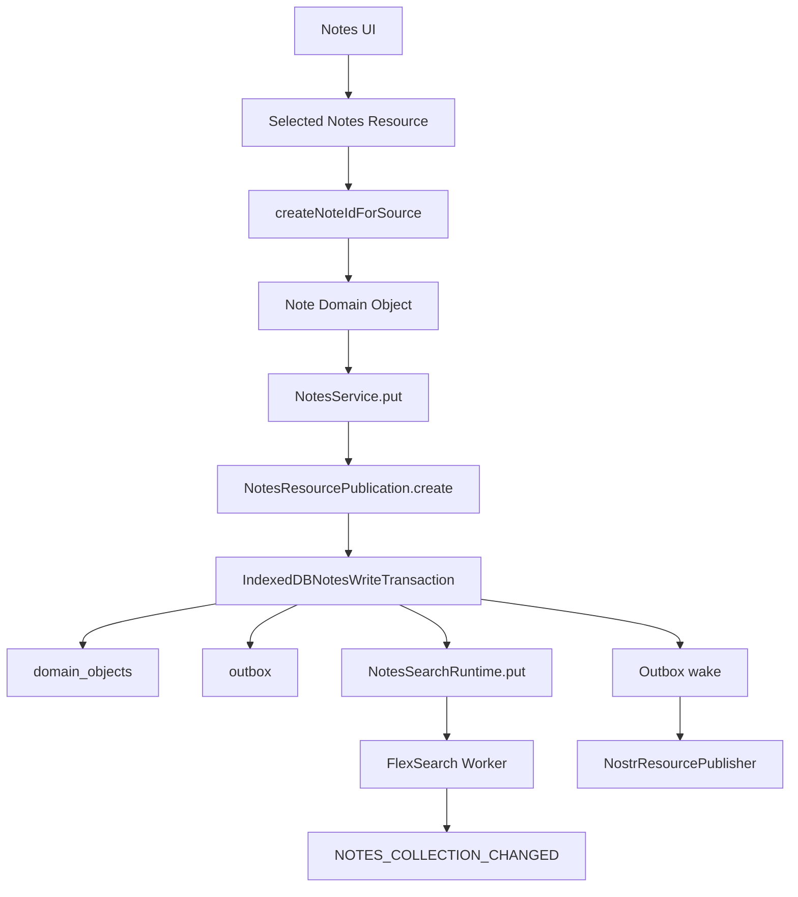
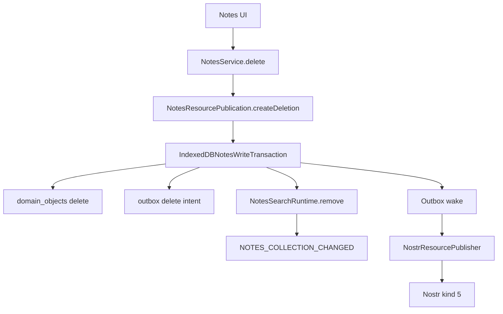
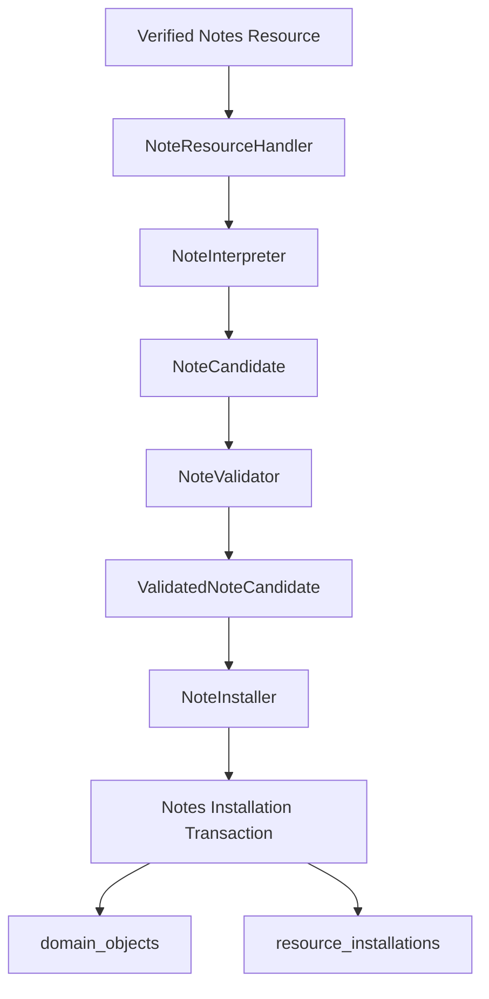
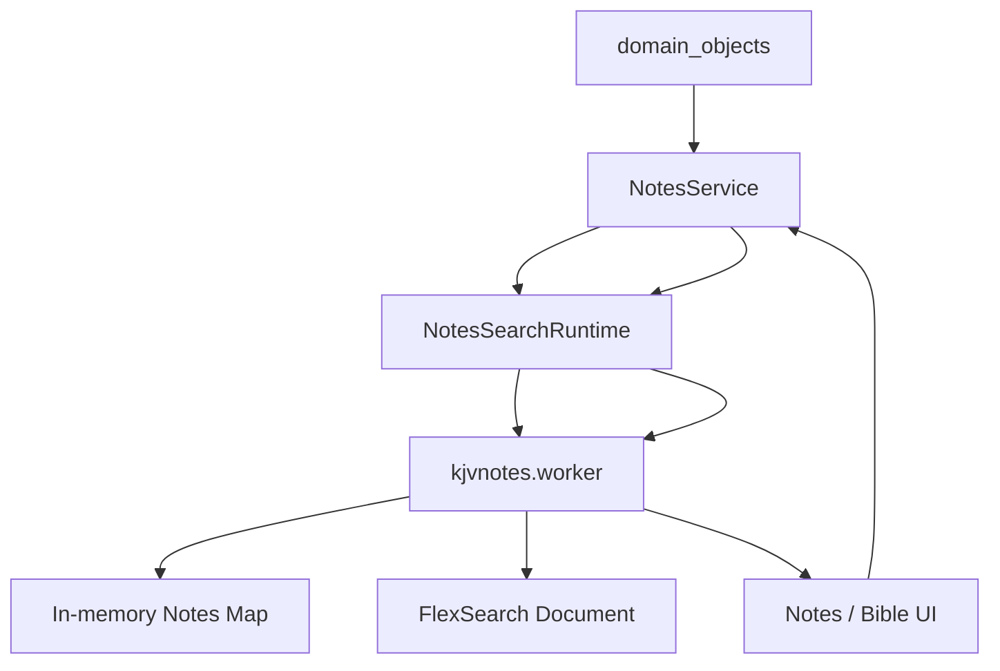

# Notes Implementation

## Status

Current

**Date:** 2026-09-12  
**Application:** KJVOnly.bible  
**Domain:** Notes  
**Application object type:** `notes/note`  
**Resource namespace:** `kjvonly/notes/entries`

---

# Purpose

This document describes the current Notes implementation in the KJVOnly PWA after the Notes Domain was migrated away from the legacy Notes-specific Nostr and persistence path.

The current implementation establishes Notes as writable application Domain Objects with:

* typed Domain models,
* application-owned Note identity,
* module-scoped Resource selection,
* persistence in the shared `domain_objects` store,
* a local FlexSearch-backed search runtime,
* local publish/subscribe propagation,
* inbound Resource interpretation, validation, and installation,
* local-first create and update behavior,
* durable Outbox publication,
* explicit Resource deletion intent,
* Nostr Resource publication,
* and Nostr deletion publication.

The central architectural relationship is:

```text
Notes UI
    ↓
NotesService
    ↓
accepted Note Domain Object
    ↓
shared domain_objects store
    ↓
local Notes search runtime
```

For writable changes:

```text
Notes UI
    ↓
NotesService
    ↓
NotesResourcePublication
    ↓
ONE IndexedDB transaction
    ├── domain_objects
    └── outbox
    ↓
local search runtime update
    ↓
local subscriber propagation
    ↓
Outbox wake
    ↓
ResourcePublisher
    ↓
NostrResourcePublisher
```

For inbound external Notes:

```text
verified Notes Resource
    ↓
NoteResourceHandler
    ↓
NoteInterpreter
    ↓
NoteValidator
    ↓
NoteInstaller
    ↓
domain_objects
    +
resource_installations
```

The defining rule is:

> **Notes are application Domain Objects first. Nostr is a Resource transport. Normal Notes UI behavior operates on accepted local state rather than directly querying or constructing Nostr events.**

---

# Scope

This document describes:

* the Note Domain model,
* standalone and Bible-linked Notes,
* Note application identity,
* Note Resource identity,
* Notes Resource source identity,
* module Resource selection,
* default Notes selection,
* persistence in the shared Domain Object store,
* collection reads through the `objectType` index,
* Resource interpretation,
* Resource validation,
* Resource installation,
* installation provenance,
* installation overwrite policy,
* `NotesService`,
* Application composition,
* local search runtime behavior,
* FlexSearch indexing,
* local Notes publish/subscribe behavior,
* Note creation,
* Bible-reference enrichment,
* Note update/save behavior,
* Domain-to-Resource publication mapping,
* atomic Domain Object + Outbox persistence,
* Nostr Resource publication,
* Note deletion,
* explicit Resource deletion publication,
* Outbox delete/update coalescing,
* dormant Resource-acquisition infrastructure,
* the synchronization boundary,
* testing boundaries,
* legacy Notes cleanup status,
* and pending work.

This document does not define a completed implementation for:

* multi-device synchronization,
* synchronization scheduling,
* remote-vs-local conflict resolution,
* Last Write Wins application to Notes,
* multiple simultaneous Notes Resource selections,
* subscriber/follow-based Notes aggregation,
* final Notes Resource-selection UI,
* read-only vs writable publisher ownership policy,
* import/export redesign,
* migration of legacy Notes data,
* or complete removal of the legacy root `src/lib/nostr/` implementation.

---

# Architectural Background

Before this refactor, Notes mixed several responsibilities:

```text
Notes UI
    ↓
legacy Notes service
    ↓
notesApi
    ↓
Nostr-specific code
    ↓
legacy bible.db stores
```

The Notes worker also mixed:

```text
persistence loading
+
local Notes state
+
FlexSearch
+
legacy database dependencies
```

This caused application behavior to depend directly on:

* Notes-specific Nostr APIs,
* legacy persistence stores,
* transport-specific behavior,
* and hidden worker initialization behavior.

The refactor separates those concerns.

The current responsibility split is:

```text
Notes Domain
    = Note meaning, identity, validation,
      local mutation, search semantics

Resource Boundary
    = external Resource identity,
      interpretation, installation,
      publication representation

Persistence
    = shared domain_objects,
      resource_installations,
      outbox

Notes Search Runtime
    = local derived search/index projection

Outbox
    = durable outbound Resource publication

Nostr
    = Resource transport implementation

Synchronization
    = future remote enumeration/update policy
```

---

# Core Architectural Model

The current Notes implementation has four separate flows.

## 1. Local accepted-state read

```text
Application startup
    ↓
NotesStore.getAll()
    ↓
domain_objects
    ↓
NotesService
    ↓
NotesSearchRuntime.initialize()
    ↓
FlexSearch worker
```

Normal UI queries then operate against the local runtime:

```text
Notes UI / Bible Reader
    ↓
NotesService.searchNotes()
or
NotesService.getAllNotes()
    ↓
NotesSearchRuntime
    ↓
worker
    ↓
local results
```

No relay query is part of this normal read path.

## 2. Inbound Resource installation

```text
Resource lifecycle
    ↓
decoded Notes Resource
    ↓
NoteResourceHandler
    ↓
NoteInterpreter
    ↓
NoteValidator
    ↓
NoteInstaller
    ↓
domain_objects
    +
resource_installations
```

This path accepts verified external Resource information into local application state.

## 3. Local Note create/update

```text
Note Domain Object
    ↓
NotesService.put()
    ↓
NotesResourcePublication.create()
    ↓
atomic transaction
    ├── domain_objects.put
    └── outbox.put
    ↓
NotesSearchRuntime.put()
    ↓
NOTES_COLLECTION_CHANGED
    ↓
Outbox wake
```

## 4. Local Note delete

```text
Note application id
    ↓
NotesService.delete()
    ↓
NotesResourcePublication.createDeletion()
    ↓
atomic transaction
    ├── domain_objects.delete
    └── outbox.put(delete intent)
    ↓
NotesSearchRuntime.remove()
    ↓
NOTES_COLLECTION_CHANGED
    ↓
Outbox wake
```

---

# Directory Layout

The Notes implementation is organized under:

```text
src/lib/domains/notes/
```

Current important structure:

```text
domains/notes/
├── models/
│   ├── note.model.ts
│   ├── note-id.ts
│   └── note-id.spec.ts
│
├── modules/
│   ├── note/
│   │   └── note.svelte
│   ├── notesList/
│   │   └── notesList.svelte
│   ├── notes.svelte
│   └── notesContainer.svelte
│
├── persistence/
│   ├── notes-store.ts
│   ├── indexeddb-notes-store.ts
│   ├── indexeddb-notes-store.spec.ts
│   ├── notes-installation-transaction.ts
│   ├── notes-write-transaction.ts
│   └── notes-write-transaction.spec.ts
│
├── resources/
│   ├── note-candidate.ts
│   ├── validated-note-candidate.ts
│   ├── note-interpreter.ts
│   ├── note-interpreter.spec.ts
│   ├── note-validator.ts
│   ├── note-validator.spec.ts
│   ├── note-installer.ts
│   ├── note-installer.spec.ts
│   ├── note-resource-handler.ts
│   ├── note-resource-handler.spec.ts
│   ├── notes-installation-stores.ts
│   ├── notes-write-stores.ts
│   ├── notes-resource-source.ts
│   ├── notes-resource-source.spec.ts
│   ├── notes-resource-publication.ts
│   ├── notes-resource-publication.spec.ts
│   ├── notes-default-selection.ts
│   ├── notes-default-selection.spec.ts
│   ├── notes-module-resource-selection-contributor.ts
│   ├── notes-module-resource-selection-contributor.spec.ts
│   ├── notes-resource-acquisition.ts
│   └── notes-resource-acquisition.spec.ts
│
├── runtime/
│   └── search/
│       ├── notes-search-runtime.ts
│       ├── notes-search-runtime.spec.ts
│       └── notes-search-worker-message.ts
│
├── services/
│   ├── notes.service.ts
│   └── notes.service.spec.ts
│
└── workers/
    └── kjvnotes.worker.ts
```

The implementation intentionally avoids a generic writable-entity framework.

Notes owns its own Domain-specific boundaries while reusing generic Resource, persistence, Outbox, and Nostr infrastructure.

---

# Note Domain Model

The application-facing Note model is:

```ts
export interface NoteTag {
    id: string;
    created: number;
    modified: number;
    tag: string;
}

export interface Note {
    id: string;

    bibleLocationRef:
        string | undefined;

    bibleReferenceText:
        string | undefined;

    text: string;
    html: string;
    title: string;

    dateCreated: number;
    dateUpdated: number;

    tags: NoteTag[];
}
```

Collection results use:

```ts
export type NotesById =
    Record<string, Note>;
```

---

# Standalone Notes

A Note does not need to belong to a Bible location.

Standalone Notes use:

```ts
bibleLocationRef:
    undefined

bibleReferenceText:
    undefined
```

The previous synthetic sentinel:

```text
0_0_0_0
```

is no longer part of the Note Domain model.

This is intentional.

Consumers should test:

```ts
if (note.bibleLocationRef) {
    // Bible-linked behavior
}
```

rather than interpreting a magic location value.

---

# Bible-Linked Notes

A Bible-linked Note can contain:

```text
bibleLocationRef
bibleReferenceText
```

Example:

```text
bibleLocationRef:
    43_3_16_0

bibleReferenceText:
    John 3:16
```

The location is application-facing structured Bible identity.

The human-readable reference text exists for display and Note content context.

The old abbreviated field:

```text
bcv
```

was replaced with:

```text
bibleReferenceText
```

because the new name exposes its actual meaning.

---

# Fields Removed From the New Model

The new Note Domain model intentionally does not contain the legacy:

```text
version
```

field.

That field belonged to the old synchronization/Nostr implementation rather than intrinsic Note Domain state.

The Resource validator is strict and rejects legacy content containing fields such as:

```text
id
version
```

inside Resource content.

Identity is derived from Resource/application identity rather than trusted from external Note content.

---

# Note Application Identity

Application Note identity is represented by:

```text
<publisher>/<name>/<noteId>
```

Example:

```text
4de85ea7.../default/550e8400-e29b-41d4-a716-446655440000
```

The identity helper lives in:

```text
models/note-id.ts
```

Important functions:

```ts
createNoteId(
    publisher,
    name,
    noteId
)

parseNoteId(
    id
)
```

`parseNoteId()` returns:

```ts
{
    publisher,
    name,
    noteId
}
```

Each identity segment must:

* be non-empty,
* and not contain `/`.

The application ID is not the external Resource ID.

---

# Notes Application Object Type

All accepted Notes use:

```text
objectType:
    notes/note
```

The constant is:

```ts
NOTE_OBJECT_TYPE =
    'notes/note'
```

This type identifies Note records inside the shared Domain Object persistence store.

---

# Resource Namespace

The Notes Resource Type is:

```text
kjvonly/notes/entries
```

The constant is:

```ts
NOTES_RESOURCE_TYPE =
    'kjvonly/notes/entries'
```

The three-segment Resource Type follows the application's Resource identifier convention:

```text
namespace / domain / resource-type
```

For Notes:

```text
kjvonly / notes / entries
```

---

# Selected Notes Resource Source

A Notes Resource selection identifies a named Notes collection boundary.

Example default source:

```text
publisher:
    <user pubkey>

resourceId:
    kjvonly/notes/entries/default
```

The source contains:

```text
Resource Type:
    kjvonly/notes/entries

Resource name:
    default
```

`parseNotesResourceSource()` validates that:

* the Resource Type is `kjvonly/notes/entries`,
* and exactly one path segment follows the Resource Type.

Therefore:

```text
kjvonly/notes/entries/default
```

is a valid selected source.

An individual Note Resource:

```text
kjvonly/notes/entries/default/<noteId>
```

is not itself a selected collection source.

---

# Domain Identity vs Resource Identity

The application Note identity and Resource identity intentionally differ.

Example application Note:

```text
Note.id:
    <publisher>/default/note-1
```

Stored application identity:

```text
objectType:
    notes/note

objectId:
    <publisher>/default/note-1

stored id:
    notes/note:<publisher>/default/note-1
```

External Resource identity:

```text
publisher:
    <publisher>

resourceType:
    kjvonly/notes/entries

resourceId:
    kjvonly/notes/entries/default/note-1
```

This mapping belongs to the Notes Resource code.

Generic persistence and Outbox infrastructure must not derive Notes Resource identity from string conventions on its own.

---

# Default Notes Resource Selection

The default Notes source is:

```text
publisher:
    current authenticated user pubkey

resourceId:
    kjvonly/notes/entries/default
```

The helper is:

```ts
createDefaultNotesSelection(
    publisher
)
```

The default collection name is:

```ts
DEFAULT_NOTES_RESOURCE_NAME =
    'default'
```

The current authentication dependency supplies the publisher pubkey.

If no current user pubkey is available, the contributor does not invent a Notes source.

---

# Notes Module Resource Selection

`NotesModuleResourceSelectionContributor` owns the Resource requirements for:

```text
Modules.NOTES
```

The Notes module currently requires:

```text
Bible Chapters
Bible Booknames
Notes
```

Conceptually:

```text
BIBLE_CHAPTER_RESOURCE_TYPE
BIBLE_BOOKNAMES_RESOURCE_TYPE
NOTES_RESOURCE_TYPE
```

The contributor:

1. preserves inherited/current Resource selections,
2. preserves an existing Notes selection if one exists,
3. otherwise asks the current-user provider for a pubkey,
4. and derives the default Notes source.

Generic module selection code does not know how Notes defaults work.

---

# Bible Module Notes Selection

The Bible module also includes:

```text
NOTES_RESOURCE_TYPE
```

because the Bible Reader consumes Notes for:

* chapter Note markers,
* Bible-linked Note display,
* embedded Notes views,
* and Note creation.

The Bible contributor follows the same policy:

```text
existing Notes selection
    → preserve it

missing Notes selection
+
authenticated user
    → current-user default Notes source
```

This means the Notes and Bible module instances carry explicit Notes Resource context even though normal local Notes querying is currently collection-wide.

This context is already used when creating a new Note.

---

# Current Single-Selection Limitation

The current module Resource-selection representation maps:

```text
Resource Type
    → one PublishedResourceReference
```

Therefore the current runtime supports one selected Notes source per module instance.

Future behavior may require simultaneously selecting:

```text
my Notes
+
subscribed publisher A
+
subscribed publisher B
+
shared collection C
```

That is not implemented yet.

The current search runtime does not prevent multi-source aggregation because it indexes Notes by full application identity.

However, module Resource-selection representation and synchronization/materialization policy will need to evolve before multiple simultaneous Notes sources are available.

---

# Creating a Note ID From Module Resource Context

New Note creation resolves the selected Notes Resource using:

```ts
moduleResourceSelectionResolver.require(
    paneID,
    NOTES_RESOURCE_TYPE
)
```

Then:

```ts
createNoteIdForSource(
    notesSource,
    uuid
)
```

produces:

```text
<publisher>/<name>/<uuid>
```

This is important.

The UI does not:

* use a bare UUID as application identity,
* derive publisher from a global variable,
* hardcode `default`,
* or construct a Resource ID directly.

The selected Resource source establishes the application identity namespace for the new Note.

---

# Bible Dependencies During Note Creation

Creating a Bible-linked Note requires application-selected Bible Resources.

The Notes UI resolves:

```text
Bible Chapter Resource
Bible Booknames Resource
```

from the current module's Resource context.

It then uses:

```text
VerseService
BibleBooknamesService
```

to construct display/context data.

Conceptually:

```text
Notes module Buffer
    ↓
selected Chapter source
selected Booknames source
selected Notes source
    ↓
VerseService
BibleBooknamesService
    ↓
new Note Domain Object
```

This preserves the application rule:

> **Domain consumers use the Resource selections captured for their module instance rather than reconstructing Resource choices from unrelated state.**

---

# Standalone Note Creation

A standalone Note is initialized conceptually as:

```ts
{
    id:
        createNoteIdForSource(
            notesSource,
            uuid
        ),

    bibleLocationRef:
        undefined,

    bibleReferenceText:
        undefined,

    text:
        '',

    html:
        '',

    title:
        'Note',

    dateCreated:
        now,

    dateUpdated:
        now,

    tags:
        []
}
```

No synthetic Bible reference is created.

---

# Bible-Linked Note Creation

A Bible-linked Note is initialized from the current Bible location.

The UI:

1. reads `mode.bibleLocationRef`,
2. resolves the selected Chapter Resource,
3. resolves the selected Booknames Resource,
4. loads the verse,
5. loads Booknames,
6. derives the short book name,
7. constructs `bibleReferenceText`,
8. constructs initial text/HTML/title,
9. and creates the application Note ID from the selected Notes source.

This keeps Bible content/metadata lookup separate from Notes persistence and publication.

---

# Resource Content Shape

The external Resource content does not include the application Note `id`.

For create/update publication:

```ts
ResourcePublication.value =
    {
        bibleLocationRef,
        bibleReferenceText,
        text,
        html,
        title,
        dateCreated,
        dateUpdated,
        tags
    }
```

The Notes Resource publication mapper uses:

```ts
Omit<Note, 'id'>
```

for Resource content.

Identity comes from:

```text
publisher
+
resourceId
```

rather than duplicated content fields.

---

# Resource Representation

Normal Note create/update publication uses:

```text
representation:
    content

mediaType:
    application/json+gzip+hex
```

The generic Resource content encoder performs:

```text
JSON
    ↓
gzip
    ↓
hex
```

The Notes Domain does not implement compression or hexadecimal encoding itself.

---

# `NotesResourcePublication`

`NotesResourcePublication` is the outbound Notes Resource boundary.

It exposes:

```ts
create(
    note
)

createDeletion(
    noteId
)
```

## Create/update mapping

Given:

```text
Note.id:
    publisher/default/note-1
```

`create()` produces:

```text
publisher:
    publisher

resourceType:
    kjvonly/notes/entries

resourceId:
    kjvonly/notes/entries/default/note-1

representation:
    content

mediaType:
    application/json+gzip+hex

value:
    Note content without id
```

## Delete mapping

Given:

```text
publisher/default/note-1
```

`createDeletion()` produces:

```ts
{
    operation:
        'delete',

    publisher:
        'publisher',

    resourceType:
        'kjvonly/notes/entries',

    resourceId:
        'kjvonly/notes/entries/default/note-1'
}
```

Deletion is an explicit Notes Resource decision.

---

# Resource Interpretation

`NoteInterpreter` implements the inbound Notes Resource interpreter.

It supports two Resource forms.

## Individual Note Resource

Example:

```text
kjvonly/notes/entries/default/note-1
```

The path is interpreted as:

```text
name:
    default

noteId:
    note-1

value:
    resource.value
```

## Notes bundle Resource

Example:

```text
kjvonly/notes/entries/default
```

The Resource value is expected to be an object keyed by Note ID:

```json
{
  "note-1": {
    "...": "..."
  },
  "note-2": {
    "...": "..."
  }
}
```

The interpreter produces one candidate per entry.

Bundle support is inbound compatibility/capability.

Current local create/update publication emits individual Note Resources.

---

# Resource Paths Rejected by the Interpreter

The Resource root:

```text
kjvonly/notes/entries
```

is not itself installable Notes content.

The interpreter rejects it.

The interpreter also rejects arbitrary deeper paths.

Supported paths after the Resource Type are:

```text
<name>
```

or:

```text
<name>/<noteId>
```

---

# Note Candidates

Interpretation produces:

```ts
interface NoteCandidate {
    name: string;
    noteId: string;
    value: unknown;
}
```

At this point the value is still untrusted external data.

The candidate is not an accepted Domain Object.

---

# Resource Validation

`NoteValidator` validates a Note candidate using a strict Zod schema.

Required Resource content fields:

```text
text
html
title
dateCreated
dateUpdated
tags
```

Optional Resource content fields:

```text
bibleLocationRef
bibleReferenceText
```

A Note tag requires:

```text
id
created
modified
tag
```

The schema is strict.

Unexpected properties fail validation.

This intentionally rejects old transport/application fields such as:

```text
id
version
```

inside Note Resource content.

---

# Validated Note Candidate

Validation produces a structure conceptually equivalent to:

```ts
{
    name,
    noteId,
    note: {
        bibleLocationRef,
        bibleReferenceText,
        text,
        html,
        title,
        dateCreated,
        dateUpdated,
        tags
    }
}
```

The final application Note `id` is still not trusted from content.

It is constructed during installation using:

```text
resource.publisher
+
candidate.name
+
candidate.noteId
```

---

# Resource Handler

`NoteResourceHandler` owns the standard Resource processing sequence:

```text
DecodedResourceContent
    ↓
NoteInterpreter
    ↓
NoteCandidate[]
    ↓
NoteValidator
    ↓
ValidatedNoteCandidate[]
    ↓
NoteInstaller
```

The handler's Resource Type is:

```text
kjvonly/notes/entries
```

It is registered with the generic Resource worker composition.

The generic Resource processor therefore knows how to dispatch decoded Notes Resources without the Resource worker containing Notes-specific conditional logic.

---

# Resource Worker Composition

The Resource worker composes:

```text
IndexedDBNotesInstallationTransaction
    ↓
NoteInstaller
    ↓
NoteResourceHandler(
    NoteInterpreter,
    NoteValidator,
    NoteInstaller
)
```

The Notes handler is included in the same Resource-handler list as:

* Bible Chapters,
* Booknames,
* Paragraphs,
* Pericopes,
* Text Markup,
* Bible Search Index,
* Strong's,
* and other supported Resource types.

Notes therefore use the common inbound Resource processing infrastructure.

---

# Inbound Installation

`NoteInstaller` converts validated candidate information into accepted Note Domain Objects.

For each candidate:

```text
resource.publisher
+
candidate.name
+
candidate.noteId
    ↓
createNoteId(...)
    ↓
application Note.id
```

Then:

```ts
const note = {
    id: noteId,
    ...candidate.note
}
```

is the accepted candidate Domain state.

---

# Installation Transaction

Inbound Note installation is atomic across:

```text
domain_objects
+
resource_installations
```

The transaction implementation is:

```text
IndexedDBNotesInstallationTransaction
```

It exposes narrow transaction-scoped capabilities:

```text
stores.notes.get()
stores.notes.put()

stores.resourceInstallations.get()
stores.resourceInstallations.put()
```

The installer does not directly open IndexedDB.

---

# Installation Provenance

When a missing Note is installed, a Resource installation record is created containing:

```text
objectType:
    notes/note

objectId:
    <publisher>/<name>/<noteId>

publisher:
    Resource publisher

resourceId:
    Resource identifier

modifiedAt:
    Resource modifiedAt
```

The installation ID is derived from:

```text
objectType
+
objectId
```

The Domain Object and provenance record are committed together.

---

# Existing Local Note Installation Policy

Notes are writable application state.

The current installer therefore follows a conservative policy:

```text
missing accepted local Note
    → install external Note

existing accepted local Note
    → do not overwrite it
```

A newer remote `modifiedAt` does not currently replace an existing accepted local Note.

This is deliberate.

Synchronization/conflict policy is not implemented inside the installer.

The installer answers only:

> Should this candidate external information become accepted local state under the current installation policy?

It does not decide multi-device authority.

---

# Shared Domain Object Persistence

Notes do not have a new physical IndexedDB object store.

Accepted Notes are stored in:

```text
kjvonly-application
    ↓
domain_objects
```

The Domain envelope is:

```ts
{
    id,
    objectType,
    objectId,
    value
}
```

For a Note:

```text
id:
    notes/note:<publisher>/<name>/<noteId>

objectType:
    notes/note

objectId:
    <publisher>/<name>/<noteId>

value:
    Note
```

Example:

```text
id:
    notes/note:4de85ea7.../default/abc123

objectType:
    notes/note

objectId:
    4de85ea7.../default/abc123

value.id:
    4de85ea7.../default/abc123
```

---

# `NotesStore`

The Domain persistence contract is:

```ts
interface NotesStore {
    get(id)
    getAll()
    put(note)
    delete(id)
}
```

The concrete implementation is:

```text
IndexedDBNotesStore
```

This is a typed Domain persistence abstraction.

It is not another physical persistence store.

---

# Collection Reads

`IndexedDBNotesStore.getAll()` reads all Notes using one query against the shared:

```text
objectType
```

index.

Conceptually:

```ts
db.getAllFromIndex(
    DOMAIN_OBJECTS,
    OBJECT_TYPE_INDEX,
    NOTE_OBJECT_TYPE
)
```

where:

```text
NOTE_OBJECT_TYPE =
    notes/note
```

This is an important persistence rule.

Do not add a dedicated Notes object store merely to list Notes.

---

# Application Composition

Application owns the runtime Notes service.

The composition root creates:

```text
IndexedDBNotesStore
IndexedDBNotesWriteTransaction
NotesResourcePublication
NotesService
```

Conceptually:

```text
notesStore =
    new IndexedDBNotesStore(
        getApplicationDB
    )

notesWriteTransaction =
    new IndexedDBNotesWriteTransaction(
        getApplicationDB
    )

notesResourcePublication =
    new NotesResourcePublication()

notesService =
    new NotesService(
        notesStore,
        notesWriteTransaction,
        notesResourcePublication,
        outboxProcessor
    )
```

The existing shared:

```text
OutboxProcessor
```

is injected through its narrow `OutboxWakeup` behavior.

---

# Application Context

`ApplicationContext` exposes:

```ts
readonly notesService:
    NotesService
```

Notes UI and Bible Reader consumers obtain the same Application-owned instance with:

```ts
useApplicationContext()
```

There is no longer a separate global singleton Notes service used by normal runtime consumers.

This prevents multiple independent Notes workers/search projections from being created accidentally.

---

# `NotesService` Responsibilities

`NotesService` is the application-facing Notes capability.

It currently owns:

* loading accepted local Notes into the runtime,
* waiting for runtime initialization before queries,
* local search dispatch,
* local collection queries,
* local subscriber routing,
* local Note create/update coordination,
* local Note deletion coordination,
* Domain-to-Resource publication mapping invocation,
* atomic Domain + Outbox writes,
* runtime incremental updates,
* and Outbox wakeup.

It intentionally does not own:

* Resource discovery,
* relay enumeration,
* synchronization scheduling,
* conflict resolution,
* Nostr event construction,
* signing,
* or direct IndexedDB transaction construction.

---

# Notes Service Startup

The service constructor starts:

```text
loadAcceptedNotes()
```

which performs:

```text
NotesStore.getAll()
    ↓
NotesSearchRuntime.initialize(
    accepted Notes
)
```

The resulting promise is stored as:

```text
ready
```

All local search/query operations wait for that initialization promise.

This avoids querying an uninitialized worker.

---

# Notes Search Runtime

The Notes search runtime is:

```text
NotesSearchRuntime
```

It is a thin typed bridge to:

```text
kjvnotes.worker.ts
```

The runtime understands:

```text
initialize
put
remove
search
get-all
```

It does not understand:

* Nostr,
* Resource discovery,
* IndexedDB,
* Domain installation,
* the Outbox,
* Pane,
* Buffer,
* or module Resource selection.

---

# Search Worker as Derived Data

The worker is a local derived projection of accepted Notes.

Authoritative state is:

```text
domain_objects
```

The worker's in-memory state and FlexSearch index are derived from that accepted state.

Conceptually:

```text
domain_objects
    ↓
NotesService startup
    ↓
NotesSearchRuntime.initialize
    ↓
worker local map
    +
FlexSearch index
```

On local accepted mutations:

```text
NotesService.put/delete
    ↓
worker incremental update
```

The worker can be rebuilt from Domain Objects.

It is not itself authoritative persistence.

---

# FlexSearch Index

The worker creates a `FlexSearch.Document` with Note `id` as the document identity.

Indexed fields are:

```text
title
text
tags[]:tag
bookChapter
bibleLocationRef
```

`bookChapter` is derived data.

It is not persisted in the Note Domain Object.

---

# Derived `bookChapter`

For a Bible-linked Note:

```text
bibleLocationRef
    ↓
BibleLocationReferenceService.extractBookIDChapter()
    ↓
bookChapter
```

Example:

```text
bibleLocationRef:
    43_3_16_0

bookChapter:
    43_3
```

This lets the Bible Reader efficiently search Notes associated with the current chapter.

Standalone Notes do not receive `bookChapter`.

---

# Search Runtime Requests

The worker protocol supports:

```text
initialize
put
remove
search
get-all
```

## `initialize`

Rebuilds:

```text
in-memory Note map
+
FlexSearch Document
```

from accepted Notes.

## `put`

Adds or updates one Note in the runtime projection.

## `remove`

Removes one Note from both:

```text
in-memory map
FlexSearch
```

## `search`

Searches specified indexes.

## `get-all`

Returns the current runtime Note collection.

---

# Notes Collection Change Event

The old Notes pub/sub magic value:

```text
*
```

was removed.

The explicit collection-change event is:

```ts
NOTES_COLLECTION_CHANGED =
    'notes:collection-changed'
```

This event means:

> The local Notes collection/search projection changed and collection consumers should refresh their view.

It does not mean:

> A specific Note with this ID changed.

---

# Local Publish/Subscribe

`NotesService` maintains subscribers with:

```text
subID
id
callback
```

`subID` identifies the subscriber so all registrations for one consumer can be removed together.

`id` identifies the result/event stream that consumer wants.

Example subscriptions:

```text
NOTES_COLLECTION_CHANGED
```

or:

```text
a unique search request ID
```

The service receives worker results and invokes only subscribers whose:

```text
subscriber.id === response.id
```

---

# Incremental Collection Propagation

Normal create/update behavior:

```text
NotesService.put(note)
    ↓
runtime.put(note)
    ↓
worker updates local map
    ↓
worker updates FlexSearch
    ↓
worker emits:
    NOTES_COLLECTION_CHANGED
    ↓
collection subscribers refresh
```

Delete behavior:

```text
NotesService.delete(noteId)
    ↓
runtime.remove(noteId)
    ↓
worker removes local map entry
    ↓
worker removes FlexSearch document
    ↓
worker emits:
    NOTES_COLLECTION_CHANGED
```

This preserves the old useful cross-pane behavior without making UI components manually broadcast updates.

---

# Why UI No Longer Calls `addNote()`

The old Notes UI explicitly performed behavior similar to:

```text
save Note
    ↓
notesService.addNote(...)
```

to update the worker and notify subscribers.

That propagation is now part of:

```text
NotesService.put()
```

Therefore the UI should not separately:

* add the Note to the worker,
* publish a collection-change event,
* or notify subscribers.

The service boundary coordinates local acceptance and local projection updates.

---

# Notes UI Collection Behavior

`notes.svelte` subscribes to:

```text
NOTES_COLLECTION_CHANGED
```

and a unique search ID.

On mount it requests:

```text
getAllNotes(
    NOTES_COLLECTION_CHANGED
)
```

The collection-change result populates the local Notes map.

When filters are active, `notes.svelte` issues a search using the dedicated search request ID.

This separates:

```text
collection changed
```

from:

```text
specific search response
```

---

# Notes Search Filters

The Notes UI currently exposes local search over:

```text
title
text
tags[]:tag
```

The Bible Reader separately searches:

```text
bookChapter
```

to locate Notes associated with the current chapter.

The worker supports both through the same local search projection.

---

# Bible Reader Notes Subscription

The Bible Reader subscribes to:

```text
NOTES_COLLECTION_CHANGED
```

When the collection changes, it reruns the local chapter Notes query.

Conceptually:

```text
Note create/update/delete
    ↓
NOTES_COLLECTION_CHANGED
    ↓
Bible Reader loadNotes()
    ↓
search:
    current bookChapter
```

This is local application propagation.

It is not remote synchronization.

---

# Local Note Save Flow

The editor saves through:

```ts
await notesService.put(note)
```

The UI no longer calls:

```text
notesApi.put()
```

or directly performs worker propagation.

`NotesService.put()` first waits for Notes initialization.

Then it constructs the Resource publication:

```text
NotesResourcePublication.create(note)
```

before opening the write transaction.

---

# Atomic Create/Update Persistence

`IndexedDBNotesWriteTransaction` opens one read/write IndexedDB transaction over:

```text
domain_objects
outbox
```

`NotesService.put()` performs:

```text
stores.notes.put(note)
stores.outbox.put(note.id, publication)
```

inside that transaction.

Conceptually:

```text
BEGIN

domain_objects.put(
    accepted Note Domain Object
)

outbox.put(
    complete Resource publication
)

COMMIT
```

If either operation fails, the transaction aborts.

This preserves the durability invariant:

```text
accepted local Note
+
required outbound publication intent
```

cannot become durably inconsistent.

---

# Create/Update Storage Identity

For:

```text
Note.id:
    publisher/default/note-1
```

the shared storage key is:

```text
notes/note:publisher/default/note-1
```

The Outbox uses the same local persistence key.

Therefore:

```text
Domain Object row
and
Outbox row
```

are associated by the same application storage identity.

---

# Post-Commit Ordering

After the atomic transaction succeeds:

```text
runtime.put(note)
    ↓
local subscribers update
    ↓
outbox.wake()
```

The worker projection is not updated before durable local acceptance.

The Outbox is not woken before durable publication intent exists.

This ordering prevents UI state from getting ahead of accepted durable state.

---

# Outbound Create/Update Resource

The Outbox receives a complete Resource publication.

It does not receive:

```text
Note pointer
Domain object type only
Note ID to reconstruct later
```

The Notes Resource mapper has already converted the Domain Object into the external Resource representation before the Outbox stores it.

This keeps the Outbox Domain-agnostic.

---

# Nostr Create/Update Mapping

The generic `NostrResourcePublisher` maps a normal Notes Resource publication to the generic Resource event kind:

```text
kind:
    37770
```

Tags include:

```text
d:
    resourceId

m:
    mediaType

t:
    resourceType

representation:
    representation type
```

For a Note:

```text
d:
    kjvonly/notes/entries/default/note-1

t:
    kjvonly/notes/entries

m:
    application/json+gzip+hex

representation:
    content
```

The publisher verifies:

```text
resource.publisher
===
configured signer pubkey
```

before signing.

---

# Note Delete Flow

Note deletion is now part of the new local-first Resource publication model.

The UI invokes:

```ts
await notesService.delete(
    note.id
)
```

No normal Notes UI code calls the legacy:

```text
notesApi.delete()
```

path.

---

# Why Delete Is an Explicit Resource Operation

The generic architecture does not assume:

```text
local Domain delete
    =
Nostr kind 5
```

Instead, Notes deliberately creates a Resource deletion publication.

This is represented by:

```ts
ResourceDeletionPublication
```

with:

```text
operation:
    delete

publisher
resourceType
resourceId
```

The Domain-specific mapper decides that deleting a Note implies deleting that published Notes Resource.

---

# Atomic Delete Persistence

`NotesService.delete()` creates the deletion publication first.

Then one transaction performs:

```text
domain_objects.delete(
    Note
)

outbox.put(
    deletion intent
)
```

Conceptually:

```text
BEGIN

remove accepted local Note

queue durable external Resource deletion

COMMIT
```

If the Outbox write fails, the local deletion also aborts.

If the local deletion fails, the deletion publication is not committed.

---

# Post-Delete Local Behavior

After the delete transaction commits:

```text
runtime.remove(noteId)
    ↓
NOTES_COLLECTION_CHANGED
    ↓
subscribers update
    ↓
outbox.wake()
```

The Note disappears locally without waiting for relay acknowledgement.

This preserves offline-first behavior.

---

# Nostr Delete Mapping

`NostrResourcePublisher` recognizes:

```text
ResourceDeletionPublication
```

and maps it to a Nostr deletion event.

Current mapping:

```text
kind:
    5
```

with tags:

```text
a:
    37770:<publisher>:<resourceId>

k:
    37770
```

Example:

```text
a:
    37770:4de85ea7...:kjvonly/notes/entries/default/note-1
```

The deletion event content is empty.

The publisher still verifies that the configured signer pubkey equals the Resource publisher.

---

# Delete Without Relay Lookup

The delete publication addresses the Resource using its addressable Resource coordinate.

Therefore the delete path does not need to:

* query the relay,
* discover the current event ID,
* or load the current event before creating deletion intent.

The Domain Note identity is enough to derive:

```text
publisher
+
Resource ID
```

which is enough to construct the addressable Resource deletion request.

---

# Outbox Update/Delete Coalescing

Create/update and delete use the same Outbox persistence key:

```text
notes/note:<publisher>/<name>/<noteId>
```

This gives useful replacement behavior.

Example:

```text
pending update A
    ↓
local delete
    ↓
delete intent overwrites A
under same Outbox key
```

If update A was already being published:

```text
publish A begins
    ↓
delete replaces pending row
    ↓
A succeeds
    ↓
deleteIfCurrent(A)
```

`deleteIfCurrent()` compares the actual current publication intent.

Because the current intent is now a deletion, the older update is not allowed to remove it.

The next Outbox pass can publish the delete.

---

# Generic Outbox Intent Type

The generic outbound type is now:

```ts
type ResourcePublicationIntent =
    | ResourcePublication
    | ResourceDeletionPublication;
```

The Outbox therefore persists either:

```text
publish/update Resource content
```

or:

```text
delete Resource
```

without learning Notes Domain semantics.

---

# Outbox Failure Behavior

Create, update, and delete preserve the same local-first behavior.

## Relay unavailable after commit

```text
local Note state
    = accepted

Outbox intent
    = pending
```

The user-facing operation remains locally valid.

## Browser closes after commit

The Outbox survives in IndexedDB.

Application startup can wake the processor later.

## All relays reject publication

The Outbox intent remains durable.

Local Domain state is not rolled back.

---

# Search Runtime and Publication Are Separate

A useful separation is:

```text
NotesSearchRuntime
    = local derived projection

Outbox
    = durable external publication queue
```

Neither owns the other.

A local Note write first becomes durable through the Domain + Outbox transaction.

Then:

```text
runtime update
```

and:

```text
publication processing
```

continue independently.

---

# Inbound Resource Acquisition Infrastructure

The codebase currently contains:

```text
NotesResourceAcquisition
```

This class can:

1. enumerate Resource representations by Notes Resource Type,
2. filter those Resources to one selected Notes source,
3. install matching exact Resources through the generic Resource lifecycle,
4. and reread accepted Note Domain Objects from `NotesStore`.

This capability was implemented while exploring Notes acquisition.

It is intentionally **not composed into the normal Notes runtime**.

---

# Synchronization Boundary

Normal Notes reads must not enumerate the relay.

Current intended boundary:

```text
Notes UI
    ↓
NotesService
    ↓
accepted local Notes
```

not:

```text
Notes UI
    ↓
listByType()
    ↓
relay
```

Relay enumeration belongs to synchronization.

This distinction is important.

The current generic:

```text
ResourceDiscovery.listByType(
    publisher,
    resourceType
)
```

exists and may support future synchronization.

But normal `NotesService` does not call it.

---

# `ResourceDiscovery.listByType()`

The generic discovery helper can query Resource events by:

```text
kind:
    37770

author:
    publisher

#t:
    resourceType
```

It collapses multiple discovered versions of the same:

```text
resourceId
```

to the newest `modifiedAt`.

For Notes, a synchronization workflow could request:

```text
publisher:
    selected publisher

resourceType:
    kjvonly/notes/entries
```

and then filter to a selected Notes name such as:

```text
default
```

This is infrastructure.

It is not current normal Notes read behavior.

---

# Current `NotesResourceAcquisition` Behavior

`NotesResourceAcquisition.acquire(source)` currently:

1. parses the selected Notes source,
2. calls `listByType()` for the source publisher and Notes Resource Type,
3. filters discovered Resources to the selected name,
4. accepts either:
   * `<name>` bundle Resources,
   * or `<name>/<noteId>` individual Resources,
5. asks the generic Resource installer to install each exact Resource,
6. verifies installation outcomes,
7. rereads accepted Note Domain Objects,
8. and returns the accepted Notes.

The class remains useful as a possible synchronization building block.

However, it must not be called automatically from Notes UI mount or ordinary local reads.

---

# Explicit Resource Miss vs Synchronization

Two concepts must remain separate.

## Explicitly requested known Resource

If the application has a specific Resource reference and local Domain information is missing:

```text
known Resource reference
    ↓
Domain Store miss
    ↓
Resource lifecycle
    ↓
Resource discovery/resolution if needed
    ↓
install
    ↓
Domain Store reread
```

This is the established Resource lifecycle pattern.

## Unknown remote Note enumeration

If the application does not know individual Note IDs and wants to discover what a remote publisher currently has:

```text
publisher/source selection
    ↓
enumerate remote Resources
    ↓
compare/select updates
    ↓
install accepted publications
```

That is synchronization/discovery policy.

Do not hide this enumeration inside normal Notes reads.

---

# Synchronization Is Pending

The Notes migration intentionally does not complete synchronization.

Pending synchronization work includes:

* deciding when Notes synchronization runs,
* choosing the selected source or sources to synchronize,
* enumerating remote Note Resources,
* handling remote deletions,
* comparing remote and accepted local state,
* deciding update authority,
* integrating pending local Outbox state,
* conflict resolution,
* Last Write Wins policy if retained,
* reconnect behavior,
* startup behavior,
* synchronization cursors or timestamps if needed,
* and targeted local search-runtime updates after accepted remote changes.

The old synchronization implementation should not simply be recreated.

---

# Search Runtime Updates After Future Synchronization

Future synchronization should preserve the existing separation.

A synchronization workflow may:

```text
discover external publication
    ↓
Resource lifecycle installs accepted Note
    ↓
read accepted Note
    ↓
hand that Note to Notes application/runtime boundary
```

The `NoteInstaller` itself should not gain a direct dependency on:

```text
NotesSearchRuntime
NotesService
Svelte
subscriber callbacks
```

Installation remains a Resource/Domain acceptance boundary.

The application runtime updates its derived search projection after accepted state changes.

---

# Future Multiple Notes Sources

The user requirement anticipates Notes from multiple sources at once, for example:

```text
current user's Notes
+
subscribed publisher Notes
+
shared study Notes
```

The current implementation is compatible at the Domain identity level because every Note ID contains:

```text
publisher/name/noteId
```

The search runtime can index Notes from many publishers simultaneously because IDs remain unique.

What is not yet implemented is the application policy for:

* representing multiple active selections of the same Resource Type,
* synchronizing each selection,
* deciding which selections are writable,
* filtering/searching by source,
* adding/removing subscription sources,
* and uninstalling or hiding Notes when a source is deselected.

---

# Publisher Ownership and Write Policy

Current default Notes selection is owned by the authenticated user's pubkey.

This is the expected writable case.

However, Resource selection can preserve an existing Notes selection from another publisher.

That creates an important future policy question.

If a user opens another publisher's Note and calls:

```text
NotesService.put(note)
```

the local Domain + Outbox transaction can succeed because Note identity is valid.

But publication will later reach:

```text
NostrResourcePublisher
```

which requires:

```text
resource.publisher
===
configured signer pubkey
```

If they differ, publication fails and the Outbox remains pending.

Therefore future multi-publisher Notes support must explicitly distinguish:

```text
readable selected Notes
```

from:

```text
writable owned Notes
```

Do not silently allow editing another publisher's Note as though the user owns that Resource.

---

# Legacy Notes Data Migration

Legacy Note migration is explicitly out of scope.

The current implementation does not migrate existing user data from the old Notes stores.

This was an accepted project decision for this refactor.

Do not add migration code unless requirements change.

---

# Legacy Notes Stores

The migrated Notes runtime does not use the old:

```text
NOTES
UNSYNCED_NOTES
```

stores.

Those legacy stores may still exist because legacy code under:

```text
src/lib/nostr/
```

still references them.

They should be removed only when the remaining root Nostr implementation is cleaned up.

Do not reintroduce those stores into new Notes code.

---

# Legacy `notesApi`

Normal Notes application code no longer depends on:

```text
notesApi
```

Create/update/delete now use:

```text
NotesService
```

The final Notes audit confirmed the remaining `notesApi` dependency is confined to the legacy Nostr tree.

That legacy tree is scheduled for later cleanup.

---

# Import / Export

Import/export remains intentionally outside the completed Notes migration.

Existing import/export code still contains legacy assumptions and naming.

Examples include annotation-oriented export structures and old import/deep-merge behavior.

Those services were intentionally retained for a later focused refactor.

Do not treat current import/export behavior as the canonical Notes Resource serialization format.

The canonical outbound Notes Resource representation is defined by:

```text
NotesResourcePublication
```

not by legacy export JSON.

---

# Application Database

The Notes implementation uses the shared:

```text
kjvonly-application
```

database.

Relevant stores are:

```text
domain_objects
resource_installations
resource_receipts
outbox
```

Notes do not introduce another physical IndexedDB store.

---

# Persistence Responsibility Summary

```text
domain_objects
    = authoritative accepted local Note state

resource_installations
    = inbound Resource provenance/installation state

resource_receipts
    = generic Resource receipt infrastructure

outbox
    = durable outbound Resource publication intent

FlexSearch worker
    = derived local query projection
```

These responsibilities must remain separate.

---

# High-Level Create Flow



---

# High-Level Delete Flow



---

# High-Level Inbound Installation Flow



---

# High-Level Local Search Flow



---

# Important Types

## `Note`

Application-facing Note Domain Object.

```ts
interface Note {
    id: string;
    bibleLocationRef:
        string | undefined;
    bibleReferenceText:
        string | undefined;
    text: string;
    html: string;
    title: string;
    dateCreated: number;
    dateUpdated: number;
    tags: NoteTag[];
}
```

## `NoteTag`

```ts
interface NoteTag {
    id: string;
    created: number;
    modified: number;
    tag: string;
}
```

## `NotesStore`

Typed persistence capability over the shared `domain_objects` store.

```ts
interface NotesStore {
    get(id)
    getAll()
    put(note)
    delete(id)
}
```

## `NoteCandidate`

Untrusted interpreted external content.

## `ValidatedNoteCandidate`

Validated candidate content plus Resource-derived identity parts.

## `NotesWriteTransaction`

Atomic Notes Domain + Outbox transaction boundary.

## `NotesResourcePublication`

Domain-specific mapping from Note application identity to external Resource identity.

## `NotesSearchRuntime`

Typed worker bridge for local derived search.

## `NotesSearchResult`

```ts
interface NotesSearchResult {
    id: string;
    notes: NotesById;
}
```

## `ResourceDeletionPublication`

Explicit external Resource delete intent.

---

# Important Constants

```text
NOTE_OBJECT_TYPE
    = notes/note

NOTES_RESOURCE_TYPE
    = kjvonly/notes/entries

DEFAULT_NOTES_RESOURCE_NAME
    = default

NOTES_COLLECTION_CHANGED
    = notes:collection-changed

generic Resource Nostr kind
    = 37770

Nostr deletion kind
    = 5
```

---

# Testing Strategy

The current implementation has focused tests around each boundary.

## Note identity tests

Verify:

* create/parse round trip,
* invalid identity rejection.

## Interpreter tests

Verify:

* bundle interpretation,
* individual Note interpretation,
* Resource name preservation,
* unsupported root rejection,
* invalid bundle rejection.

## Validator tests

Verify:

* Bible-linked Notes,
* standalone Notes,
* strict content validation,
* rejection of `id`,
* rejection of legacy `version`.

## Store tests

Verify:

* shared Domain Object reads,
* one-query `objectType` collection lookup,
* shared envelope writes,
* deletion.

## Installation tests

Verify:

* missing Note installation,
* provenance creation,
* one installation transaction,
* existing local Note preservation,
* invalid mixed-name candidate rejection.

## Resource handler tests

Verify:

```text
interpret
    ↓
validate
    ↓
install
```

dependency sequence.

## Resource-selection tests

Verify:

* Notes module owns its requirements,
* default current-user selection,
* existing Notes selection preservation,
* no default when no authenticated user exists,
* Bible module Notes selection.

## Search runtime tests

Verify:

* worker initialization,
* local `put`,
* local `remove`,
* search forwarding,
* collection-change signaling.

## Notes service tests

Verify:

* accepted Domain Notes load before runtime queries,
* local put transaction ordering,
* runtime update after commit,
* Outbox wake after commit,
* delete transaction behavior,
* subscriber routing.

## Write transaction tests

Verify:

* `domain_objects` and `outbox` are in one transaction,
* shared application storage key,
* put behavior,
* delete behavior,
* abort semantics.

## Resource publication tests

Verify:

* publisher mapping,
* Resource Type,
* Resource ID,
* media type,
* Resource content value,
* delete publication mapping.

## Nostr publisher tests

Verify:

* signer/publisher ownership,
* Resource event tags,
* encoded Resource content,
* deletion event construction,
* relay success requirements.

## Outbox tests

Verify:

* persistence,
* pending selection,
* safe `deleteIfCurrent`,
* update/delete replacement races.

---

# Manual End-to-End Verification

The Notes refactor was manually exercised end to end.

The verified application behavior included:

```text
create Note
edit Note
save Note
local list/search update
cross-consumer update
Outbox processing
relay Resource publication
delete Note
local deletion propagation
```

This manual verification supplements, rather than replaces, unit tests.

---

# Failure Scenarios

## Domain write fails

The Domain + Outbox transaction aborts.

The search runtime is not updated.

## Outbox write fails

The same transaction aborts.

The Domain Note does not commit without required publication intent.

## Worker update fails after durable commit

The Domain Object remains authoritative.

The worker is derived state and can be rebuilt from `domain_objects`.

## Relay publication fails

The accepted local state remains usable.

The Outbox intent remains durable.

## Application closes after commit

The accepted Domain state and pending Outbox intent survive.

## Remote publication exists but synchronization has not run

Normal Notes views continue to show accepted local Notes only.

This is expected.

---


# Current UI Behavior and Known Limitations

The architecture migration is complete for this phase, but a few presentation/runtime details remain as current implementation behavior rather than finalized policy.

## `dateUpdated` is not automatically advanced on save

The Note model contains:

```text
dateCreated
dateUpdated
```

and the Notes list sorts using:

```text
dateUpdated
```

However, the current Note editor updates:

```text
text
html
title
```

during Quill edits and then calls:

```text
NotesService.put(note)
```

without automatically setting:

```text
note.dateUpdated = Date.now()
```

Therefore the current implementation does not guarantee that editing a Note changes its sort timestamp.

A future cleanup should decide whether:

* the UI updates `dateUpdated`,
* `NotesService.put()` updates it,
* or the Domain exposes a dedicated edit/update operation that owns timestamp policy.

Do not assume timestamp mutation is currently automatic.

## New Notes are transient until saved

Creating a new Note from the list:

```text
constructs Note object
    ↓
adds it to current UI state
    ↓
opens editor
```

The Note is not persisted merely by clicking "Add."

Durable acceptance occurs when the editor calls:

```text
NotesService.put(note)
```

If the user creates a Note and closes it without saving, no Domain Object/Outbox transaction is performed.

This is current UI behavior.

## Notes module subscription cleanup

The Bible Reader explicitly unsubscribes from Notes subscriptions when its chapter component is destroyed or reconfigured.

The current `notes.svelte` component establishes collection/search subscriptions on mount but does not currently contain a corresponding explicit `onDestroy()` unsubscribe in that component.

A future UI lifecycle cleanup should confirm whether component replacement can leave stale Notes subscribers and, if necessary, call:

```ts
notesService.unsubscribe(
    NOTE_SUBSCRIPTION_ID
)
```

on destruction.

This is a UI lifecycle concern, not a reason to move subscription ownership back into the worker or transport layer.

## Empty search-result behavior

The current worker posts a search response only when the filtered result set contains at least one Note.

Therefore a search that transitions from non-empty results to zero results may require UI behavior review to ensure stale filtered state is cleared correctly.

If changed, preserve the worker/service boundary and return an explicit empty `NotesById` result rather than adding UI-specific behavior to the worker.

---

# Current Invariants

A future implementation must preserve these rules.

```text
Notes are application Domain Objects.

Normal Notes reads are local.

Accepted Notes live in shared domain_objects.

Notes collection loading uses the objectType index.

The Notes search worker is derived state.

The worker does not own persistence.

The worker does not know Nostr.

UI does not call legacy Notes Nostr APIs.

A new Note ID is derived from selected Notes Resource context.

Domain Note identity differs from Resource identity.

Domain-specific Notes Resource code owns that mapping.

Create/update commits Domain state and Outbox intent atomically.

Delete commits Domain deletion and Outbox delete intent atomically.

Runtime propagation occurs after durable local commit.

Outbox wake occurs after durable publication intent exists.

The Outbox stores complete Resource publication intent.

The Outbox does not reread Notes Domain state.

NostrResourcePublisher owns Nostr event mapping.

Generic local delete does not automatically imply Nostr deletion.

Notes deliberately creates its Resource deletion intent.

Resource installation does not overwrite an existing accepted local Note.

Synchronization does not belong inside NotesService normal reads.

Relay enumeration does not belong in UI mount/read behavior.
```

---

# Anti-Patterns

Do not reintroduce:

```text
Notes UI
    → notesApi

Notes UI
    → relayService

Notes UI
    → ResourceDiscovery.listByType()

Notes worker
    → IndexedDB

Notes worker
    → Nostr

NoteInstaller
    → NotesSearchRuntime

NotesService
    → ModuleResourceSelectionResolver

generic Outbox
    → NotesStore

generic Outbox
    → Notes-specific handler

new physical IndexedDB Notes store

0_0_0_0 standalone Note sentinel

bcv field

legacy Note version field

"*" collection-change magic string
```

---

# Resource Selection vs Synchronization

Resource selection answers:

> Which Notes source or sources does this module mean?

Synchronization answers:

> What remote publications for those source selections should be discovered, compared, accepted, updated, or removed locally?

These are separate concerns.

Current module Resource context already captures one Notes selection.

Future synchronization should consume that context or an appropriate synchronization configuration.

It must not make UI reads implicitly network-dependent.

---

# Future Synchronization Design Questions

Before implementing Notes synchronization, explicitly decide:

1. What initiates synchronization?
2. Does startup synchronize Notes automatically?
3. Does reconnect trigger synchronization?
4. How are multiple selected/subscribed publishers represented?
5. Does synchronization enumerate by Resource Type?
6. Are bundle Resources supported alongside individual Resources?
7. How are remote deletions discovered?
8. What timestamp/version determines authority?
9. How does pending local Outbox state affect remote acceptance?
10. Is Last Write Wins still the intended Notes policy?
11. How are local-only Notes protected from older remote publications?
12. How does synchronization update the local search runtime incrementally?
13. What happens when a selected publisher is removed?
14. Does deselection uninstall Notes or merely hide them?
15. How are read-only publisher selections represented?
16. How is synchronization failure surfaced without breaking local Notes?

These questions belong to synchronization design, not the current local Notes service.

---

# Pending Multi-Source Work

The future Notes experience may include:

```text
My Notes
Subscribed Notes
Publisher Notes
Shared study Notes
```

The current identity and runtime model are compatible with this because publisher and collection name are part of Note identity.

Still required:

* Resource-selection representation for multiple same-type selections,
* aggregation policy,
* source filtering in the UI,
* source filtering in local search,
* per-source synchronization,
* ownership permissions,
* subscription lifecycle,
* and source removal/uninstallation policy.

---

# Pending Ownership Work

Current write behavior derives Resource publisher from `Note.id`.

This is correct for owned Notes.

Future read-only sources require explicit policy.

Potential desired behavior:

```text
selected current-user source
    → readable + writable

selected other-publisher source
    → readable

editing other-publisher Note
    → blocked
or
    → fork/copy into current-user source
```

That policy is not yet implemented.

Do not solve it by weakening signer/publisher verification.

---

# Pending Import / Export Work

The current import/export implementation predates the new Notes model.

Future refactoring should decide:

* whether export uses Domain Notes,
* whether export preserves Resource provenance,
* how multiple publishers/sources are represented,
* whether imports become locally owned Notes,
* whether imported Notes receive new IDs,
* whether Resource publication is queued after import,
* and how legacy annotation-shaped exports are handled.

This should be a separate focused design.

---

# Pending Legacy Cleanup

After remaining application consumers have migrated, the project can remove obsolete Notes code from:

```text
src/lib/nostr/
```

and remove old persistence constants/stores if nothing else depends on them.

Before deletion:

```bash
grep -Rni \
    "notesApi\|UNSYNCED_NOTES\|NOTES" \
    client/kjvonly-pwa/src/lib
```

Classify each result.

Keep generic Resource/Nostr infrastructure.

Delete only dead Notes-specific legacy paths.

---

# Relationship to Text Markup

Notes intentionally mirrors several proven Text Markup patterns:

```text
typed Domain Object
Domain-specific Resource mapper
shared domain_objects persistence
atomic Domain + Outbox transaction
local runtime/subscriber propagation
generic ResourcePublisher
NostrResourcePublisher
```

Important differences:

```text
Text Markup
    = one chapter-scoped object
      for a selected overlay source

Notes
    = collection of independently identified objects
      with local full-text search
```

Therefore Notes requires:

* collection persistence,
* a search projection,
* collection-change propagation,
* individual Note Resource identity,
* and future enumeration/synchronization policy.

---

# Relationship to Module Resource Selection

The Notes implementation relies on the module Resource-selection architecture for:

```text
Notes source
Bible Chapter source
Bible Booknames source
```

The Notes Domain service itself does not know about:

```text
Pane
Buffer
Workspace
ModuleResourceSelectionResolver
```

The UI/application layer resolves those dependencies before constructing or enriching Note Domain Objects.

---

# Relationship to Outbox Architecture

Notes is a concrete writable-Domain implementation of the generic Outbox architecture.

The Note Domain decides:

```text
what application change is accepted
```

Notes Resource code decides:

```text
what Resource publication represents that change
```

The Outbox decides:

```text
how publication intent remains durable
```

The Resource publisher decides:

```text
how that Resource is transported
```

Nostr decides:

```text
the current transport event representation
```

Synchronization remains separate from all of the above.

---

# Important Files

## Domain model and identity

```text
src/lib/domains/notes/models/
    note.model.ts
    note-id.ts
```

## Persistence

```text
src/lib/domains/notes/persistence/
    notes-store.ts
    indexeddb-notes-store.ts
    notes-installation-transaction.ts
    notes-write-transaction.ts
```

## Resource boundary

```text
src/lib/domains/notes/resources/
    note-candidate.ts
    validated-note-candidate.ts
    note-interpreter.ts
    note-validator.ts
    note-installer.ts
    note-resource-handler.ts
    notes-resource-source.ts
    notes-resource-publication.ts
    notes-installation-stores.ts
    notes-write-stores.ts
    notes-default-selection.ts
    notes-module-resource-selection-contributor.ts
```

## Synchronization-oriented acquisition infrastructure

```text
src/lib/domains/notes/resources/
    notes-resource-acquisition.ts
```

## Application service

```text
src/lib/domains/notes/services/
    notes.service.ts
```

## Search runtime

```text
src/lib/domains/notes/runtime/search/
    notes-search-runtime.ts
    notes-search-worker-message.ts
```

## Worker

```text
src/lib/domains/notes/workers/
    kjvnotes.worker.ts
```

## UI

```text
src/lib/domains/notes/modules/
    notesContainer.svelte
    notes.svelte
    notesList/notesList.svelte
    note/note.svelte
```

## Generic infrastructure used by Notes

```text
src/lib/infrastructure/persistence/
    application.db.ts

src/lib/resource/outbox/
    outbox-entry.ts
    indexeddb-outbox-store.ts
    outbox-processor.ts
    outbox-wakeup.ts

src/lib/resource/publication/
    resource-publication.ts
    resource-publisher.ts

src/lib/resource/nostr/
    nostr-resource-publisher.ts
    resource-discovery.ts

src/lib/resource/worker/
    resource-worker-composition.ts
```

---

# Future Agent Checklist

Before changing Notes, a future developer or AI agent should answer:

```text
Am I changing accepted Domain state,
derived search state,
Resource representation,
publication,
synchronization,
or UI selection?
```

Then use the owning boundary.

## If changing Note fields

Inspect:

```text
note.model.ts
note-validator.ts
notes-resource-publication.ts
worker indexed fields
UI creation/editor
```

## If changing Note identity

Inspect:

```text
note-id.ts
notes-resource-source.ts
notes-resource-publication.ts
NotesStore storage ids
Outbox ids
deletion mapping
```

Identity changes are high-impact.

## If changing persistence

Preserve:

```text
shared domain_objects
objectType = notes/note
objectType index collection query
```

Do not create a separate Notes physical store without a new architectural decision.

## If changing writes

Preserve:

```text
Domain + Outbox atomicity
runtime update after commit
Outbox wake after commit
```

## If changing inbound Resources

Preserve:

```text
interpret
validate
install
Domain Store
```

Do not return raw decoded Resource content directly to application consumers.

## If changing local search

Remember:

```text
search worker = derived projection
domain_objects = authoritative state
```

## If implementing synchronization

Do not put relay enumeration into:

```text
Notes UI
NotesService normal reads
NoteInstaller
NotesSearchRuntime
```

Use a dedicated synchronization workflow.

## If enabling multiple publishers

Resolve write ownership explicitly before allowing edits.

---

# Definition of Complete for This Phase

The Notes migration completed in this phase provides:

```text
typed Note Domain model
    ✓

standalone Note semantics without sentinel
    ✓

descriptive Bible reference field
    ✓

application Note identity
    ✓

Notes Resource identity
    ✓

module Notes Resource selection
    ✓

current-user default Notes selection
    ✓

shared domain_objects persistence
    ✓

objectType-index collection reads
    ✓

local FlexSearch runtime
    ✓

named local collection-change event
    ✓

Application-owned NotesService
    ✓

create/update Domain + Outbox write
    ✓

delete Domain + Outbox write
    ✓

generic Resource publication
    ✓

Nostr Resource publication
    ✓

explicit Resource deletion intent
    ✓

Nostr kind-5 deletion mapping
    ✓

inbound Resource interpreter
    ✓

inbound Resource validator
    ✓

inbound Resource installer
    ✓

Resource worker registration
    ✓

legacy notesApi removed from normal runtime
    ✓

normal Notes relay enumeration removed
    ✓

manual create/edit/delete end-to-end verification
    ✓
```

Intentionally pending:

```text
synchronization
multiple simultaneous Notes sources
subscriptions/follows
remote conflict resolution
read-only publisher ownership policy
import/export redesign
legacy Notes data migration
root nostr Notes cleanup
```

---

# Final Mental Model

For local Notes reads:

```text
domain_objects
    ↓
NotesService
    ↓
NotesSearchRuntime
    ↓
Notes/Bible UI
```

For local Notes writes:

```text
UI
    ↓
NotesService
    ↓
Note Domain Object
    ↓
NotesResourcePublication
    ↓
atomic domain_objects + outbox
    ↓
local runtime update
    ↓
Outbox publication
```

For inbound external Notes:

```text
Resource lifecycle
    ↓
Note Resource handler
    ↓
interpret
    ↓
validate
    ↓
install
    ↓
domain_objects
```

For future synchronization:

```text
selected Notes source(s)
    ↓
Synchronization policy
    ↓
Resource discovery
    ↓
choose external publications
    ↓
Resource lifecycle installation
    ↓
accepted local Notes
    ↓
incremental runtime update
```

The main architectural takeaway is:

> **Notes are local-first application Domain Objects. The shared Domain Store is authoritative locally, the search worker is derived state, the Outbox represents durable publication intent, Nostr is transport, and synchronization is a separate future workflow that must not be hidden inside ordinary Notes reads.**
