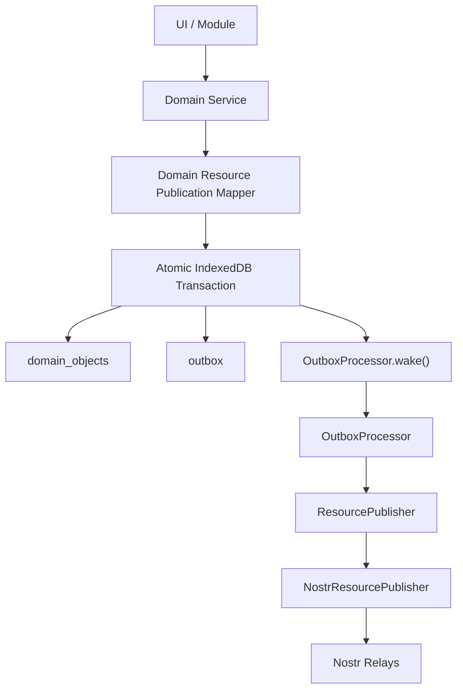
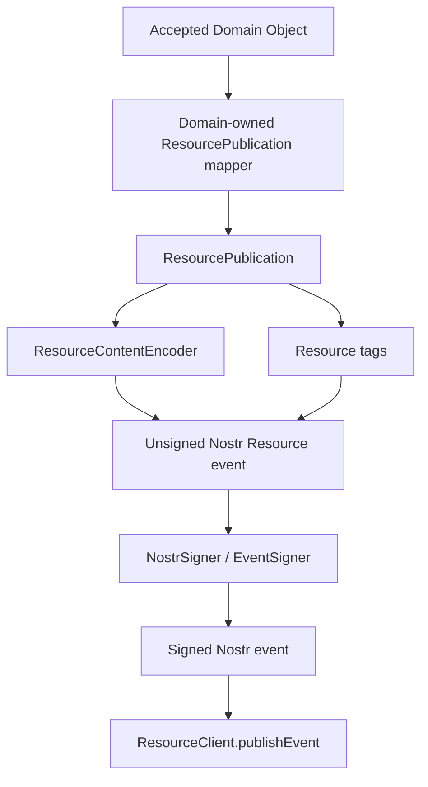

# Outbox and Resource Publication Implementation

## Status

Current

**Date:** 2026-09-12  
**Application:** KJVOnly.bible  
**Area:** Resource Boundary / Persistence / Outbound Publication

---

# Purpose

This document describes the current implementation of the KJVOnly outbound Resource publication path.

The implementation realizes the accepted Outbox architecture for locally created or modified Domain information.

The core relationship is:

```text
Accepted Local Domain Object
        ↓
Domain-specific Resource publication mapping
        ↓
Complete outbound ResourcePublication
        ↓
atomic local persistence
    Domain Object + Outbox Resource
        ↓
Outbox wakeup
        ↓
OutboxProcessor
        ↓
ResourcePublisher
        ↓
NostrResourcePublisher
        ↓
signed Resource event
        ↓
Nostr relay
```

The defining rule is:

> **The Domain operates on Domain Objects. The Domain Resource boundary converts a Domain Object into a complete Resource publication. The Outbox durably stores and publishes that Resource without reaching back into Domain storage.**

---

# Scope

This document describes:

* the outbound `ResourcePublication` contract,
* Domain-to-Resource publication mapping,
* the persistent Outbox entry,
* application database Outbox storage,
* atomic Domain Object + Outbox persistence,
* Outbox coalescing by shared application storage ID,
* `OutboxStore`,
* `IndexedDBOutboxStore`,
* `OutboxProcessor`,
* wakeup semantics,
* the generic `ResourcePublisher` transport port,
* the current `NostrResourcePublisher`,
* Resource content encoding,
* JSON + gzip + hex publication,
* Nostr Resource event tags,
* application startup composition,
* failure and concurrency behavior,
* and current limitations.

This document does not define:

* inbound Resource Installation,
* synchronization,
* remote-vs-local conflict resolution,
* Resource deletion semantics,
* application-specific write authorization policy,
* backoff/retry scheduling,
* or a REST/RPC publisher implementation.

---

# Architectural Basis

The accepted Outbox architecture requires local application behavior and external publication to remain independent.

For any accepted local change that must be published, the application must durably establish both:

```text
Accepted Local Change
        +
Durable Publication Intent
```

before the write is considered durably complete.

The implementation therefore commits the Domain Object and the Outbox Resource in one IndexedDB transaction.

Relay publication occurs after that commit.

---

# Inbound and Outbound Resource Boundaries Are Different

Inbound Resource Installation answers:

```text
Should verified external Resource information
become accepted local Domain state?
```

Outbound publication answers:

```text
How should accepted local Domain information
be represented and published externally?
```

These are not the same lifecycle in reverse at the implementation level.

The current outbound flow begins from accepted Domain state and creates a Resource publication explicitly.

It does not route a local write through inbound Resource Installation.

---

# Domain Identity and Resource Identity

A central implementation rule is that application Domain identity and Resource identity are different namespaces.

They must not be conflated.

For Bible Text Markup, for example:

```text
Application objectType
    bible/text-markup

Application objectId
    <publisher>/kjvs/50_3

Stored Domain Object id
    bible/text-markup:<publisher>/kjvs/50_3
```

while the outbound Resource uses:

```text
Resource Type
    kjvonly/overlays/text-markup

Resource ID
    kjvonly/overlays/text-markup/kjvs/50_3

publisher
    <publisher>
```

There is no generic Resource-layer rule that can infer one namespace from the other.

The mapping belongs to Domain Resource code.

---

# Why the Outbox Does Not Reconstruct Resources

An earlier design direction considered storing only:

```text
objectType
objectId
```

and allowing the Outbox to reread the Domain Object later.

That direction was rejected.

It caused several problems:

* the Outbox would need Domain-store access,
* the Outbox would need Resource-Type-specific handlers,
* Resource identity would have to be reconstructed later,
* generic publication code would acquire Domain knowledge,
* and the Resource boundary would become unclear.

The current design instead performs all Domain-specific Resource mapping before the Resource enters the Outbox.

Therefore:

```text
Domain Object
    ↓
Domain-owned ResourcePublication mapper
    ↓
complete ResourcePublication
    ↓
Outbox
```

---

# `ResourcePublication`

The generic outbound Resource publication contract is implemented at:

```text
src/lib/resource/publication/resource-publication.ts
```

Current shape:

```ts
interface ResourcePublication {
    publisher: string;
    resourceType: string;
    resourceId: string;
    representation: ResourceRepresentationType;
    mediaType: string;
    value: unknown;
}
```

The object contains Resource-side information only.

It does not contain:

```text
objectType
objectId
Pane ID
Buffer ID
module information
Nostr event id
Nostr kind
relay state
```

---

# Why `ResourcePublication` Has No `id`

A Resource publication already has canonical Resource identity through:

```text
publisher
resourceId
```

and its Resource Type through:

```text
resourceType
```

The generic publication object does not introduce another Resource identity.

The Outbox has a local persistence key, but that local key is an Outbox/application-storage concern rather than a field callers must put into the Resource object.

---

# `value` Is the Resource Content Value

The `value` field is the logical Resource payload.

For a `content` representation, it becomes event content after media-type encoding.

For Bible Text Markup:

```text
ResourcePublication.value
    = BibleTextMarkup.markings
```

The Domain envelope is not published.

The following application fields do not become Resource content:

```text
BibleTextMarkup.id
BibleTextMarkup.chapterRef
StoredDomainObject.objectType
StoredDomainObject.objectId
```

Those values participate in application identity or Resource ID derivation, not serialized content.

---

# Domain-Specific Resource Publication Mapping

Each publishable Domain Resource owns the mapping between its Domain Object and outbound Resource.

For Bible Text Markup this is:

```text
src/lib/domains/bible/resources/text-markup/
    bible-text-markup-resource-publication.ts
```

`BibleTextMarkupResourcePublication` accepts only a `BibleTextMarkup` Domain Object.

The caller does not pass:

* Resource Type,
* Resource ID,
* selected Resource source,
* Nostr kind,
* or tags.

The mapper derives Resource identity from the Domain Object's application identity.

This keeps the caller on the Domain side of the boundary.

---

# Outbox Entry

The Outbox entry is implemented at:

```text
src/lib/resource/outbox/outbox-entry.ts
```

Current shape:

```ts
interface OutboxEntry {
    id: string;
    resource: ResourcePublication;
    status: OutboxStatus;
    attempts: number;
}
```

Supported status values are currently declared as:

```text
pending
publishing
published
failed
```

The current runtime primarily uses `pending` entries and deletes the current entry after successful publication.

More detailed status transitions are not yet implemented.

---

# Outbox Storage ID

The Outbox uses the same local persistence ID as the corresponding stored Domain Object.

For example:

```text
bible/text-markup:<publisher>/kjvs/50_3
```

This is the same ID used by the `domain_objects` record.

The Outbox ID is not:

```text
kind:publisher:resourceId
```

and it does not contain Nostr kind.

Nostr kind is transport representation knowledge.

---

# Why the Same Domain Storage ID Is Useful

Using the same storage ID gives simple coalescing behavior.

If the same Domain object is written repeatedly before publication:

```text
Text Markup state A
    ↓
outbox.put(id, Resource A)

Text Markup state B
    ↓
outbox.put(same id, Resource B)

Text Markup state C
    ↓
outbox.put(same id, Resource C)
```

only the newest pending Resource remains under that Outbox key.

No extra coalescing index or Resource-kind-derived key is required.

This behavior matches replaceable/addressable Resource semantics for the current use case.

---

# Application Database

The application database is:

```text
kjvonly-application
```

Current version:

```text
2
```

Current object stores include:

```text
domain_objects
resource_installations
resource_receipts
outbox
```

The Outbox store uses:

```text
keyPath = id
```

and has a status index:

```text
status
```

---

# Domain Object Storage Envelope

Domain Objects use the established application persistence envelope:

```ts
{
    id: '<objectType>:<objectId>',
    objectType: '<application object type>',
    objectId: '<application object id>',
    value: <Domain Object>
}
```

For Text Markup:

```text
id
    bible/text-markup:<publisher>/kjvs/50_3

objectType
    bible/text-markup

objectId
    <publisher>/kjvs/50_3

value.id
    <publisher>/kjvs/50_3
```

This storage envelope is intentionally application-facing.

The Resource publication is separate.

---

# Atomic Local Write

A publishable Domain write must persist both:

```text
Domain Object
Outbox Resource
```

inside one IndexedDB transaction.

For Bible Text Markup this is implemented by:

```text
IndexedDBBibleTextMarkupWriteTransaction
```

The transaction opens:

```text
domain_objects
outbox
```

in the same read/write transaction.

Conceptually:

```text
BEGIN
    domain_objects.put(stored Domain Object)
    outbox.put(pending ResourcePublication)
COMMIT
```

If either operation fails, the transaction aborts.

This prevents:

```text
Domain Object saved
    +
publication intent lost
```

---

# Transaction Store Pattern

The Text Markup write transaction follows the same structural style used by Resource installation transactions.

The transaction exposes store capabilities to the service callback:

```text
stores.textMarkup
stores.outbox
```

The Domain service coordinates the logical operation.

The persistence adapter owns:

* IndexedDB transaction creation,
* Domain Object storage envelopes,
* Outbox entry construction,
* Outbox storage IDs,
* commit,
* and abort behavior.

This avoids teaching Domain services IndexedDB details.

---

# `OutboxStore`

The generic Outbox persistence contract lives at:

```text
src/lib/resource/outbox/outbox-store.ts
```

Current operations:

```text
get(id)
put(entry)
listByStatus(status)
deleteIfCurrent(entry)
```

The concrete implementation is:

```text
IndexedDBOutboxStore
```

---

# `deleteIfCurrent()`

A subtle concurrency problem exists because multiple writes use the same Outbox ID.

Example:

```text
Resource A is read from Outbox
    ↓
publication A begins
    ↓
new local write stores Resource B under same Outbox ID
    ↓
publication A succeeds
```

The processor must not blindly delete the key, because that would delete Resource B.

`deleteIfCurrent(entry)` therefore performs a read/write transaction and deletes only when the stored entry is still the same pending Resource that was published.

The comparison checks Resource publication identity and value.

If a newer Resource replaced it, deletion returns `false` and the newer pending entry remains.

---

# `OutboxProcessor`

The processor is implemented at:

```text
src/lib/resource/outbox/outbox-processor.ts
```

Its publication flow is deliberately small:

```text
list pending Outbox entries
    ↓
for each entry
    ↓
ResourcePublisher.publish(entry.resource)
    ↓ success
deleteIfCurrent(entry)
```

On publication failure:

```text
catch
    ↓
leave durable pending entry in Outbox
```

The Outbox does not reconstruct a Resource.

The Outbox does not access Domain stores.

The Outbox does not dispatch Resource-Type-specific Domain handlers.

---

# Wakeup Semantics

`OutboxProcessor` implements:

```text
OutboxWakeup
```

with:

```ts
wake(): void
```

A wake is only a scheduling hint.

The durable Outbox entry is the source of truth.

The correct ordering is:

```text
atomic transaction commits
    ↓
Outbox Resource is durable
    ↓
wake()
```

Never:

```text
send an in-memory message
    ↓
hope publication intent is persisted later
```

If a wake is lost, pending entries still survive in IndexedDB.

---

# Serialized Wake Processing

The processor serializes wake processing.

State:

```text
processing
wakeRequested
```

If `wake()` is called while publication is already running:

```text
wakeRequested = true
return
```

After the current pass finishes, another pass runs.

This matters for replaceable Resources.

A newer local write should not accidentally allow an older Resource to be the last event published merely because asynchronous operations completed out of order.

Conceptually:

```text
publish A in progress
    ↓
write B replaces pending Outbox row
    ↓
wake requested
    ↓
A finishes
    ↓
second pass publishes B
```

---

# Startup Wakeup

`Application.startInternal()` wakes the Outbox after:

```text
signer restoration
Resource selection restoration
relay configuration
```

This allows durable pending publications to resume after application restart.

The application does not need to recreate the original user action.

---

# `ResourcePublisher`

The transport-facing publication port is:

```text
src/lib/resource/publication/resource-publisher.ts
```

Contract:

```ts
interface ResourcePublisher {
    publish(
        resource: ResourcePublication
    ): Promise<void>;
}
```

This boundary receives a complete Resource publication.

It does not receive a Domain Object.

---

# Why `ResourcePublisher` Is Transport-Oriented

Everything above this boundary is Resource/application behavior.

Everything below this boundary may be transport-specific.

Conceptually:

```text
Domain
    ↓
ResourcePublication
    ↓
Outbox
    ↓
---------------- publication transport boundary ----------------
    ↓
ResourcePublisher
    ↓
Nostr today
REST/RPC/other implementation later if desired
```

The Outbox does not need to know how a transport represents Resources.

---

# `NostrResourcePublisher`

The current concrete publisher is:

```text
src/lib/resource/nostr/nostr-resource-publisher.ts
```

It depends on:

```text
EventSigner
ResourceClient.publishEvent()
ResourceContentEncoder
```

Its responsibilities are:

* verify that the configured signer pubkey matches `resource.publisher`,
* encode Resource content according to `resource.mediaType`,
* construct the Nostr Resource event,
* add Resource representation tags,
* sign the event,
* publish through `ResourceClient`,
* and require acceptance by at least one configured relay.

---

# Publisher Identity Check

Before event construction, the publisher obtains the signer's public key.

It requires:

```text
signer pubkey == resource.publisher
```

Otherwise publication fails.

This prevents a Resource publication from silently being signed by the wrong identity.

It also means that viewing a Resource from another publisher does not automatically grant authority to publish updates under that publisher.

Higher-level UI/write policy can become stricter later, but the transport already rejects mismatched signing identity.

---

# Nostr Resource Event Mapping

The Nostr publisher uses the generic Resource kind:

```text
37770
```

The Resource Type determines application meaning.

The Outbox entry does not persist kind.

Current tags:

```text
d
    Resource ID

m
    media type / encoding chain

t
    Resource Type

representation
    Resource representation type
```

For Text Markup:

```text
d = kjvonly/overlays/text-markup/kjvs/50_3
m = application/json+gzip+hex
t = kjvonly/overlays/text-markup
representation = content
```

---

# Resource Content Encoding

Outbound content encoding is implemented by:

```text
ResourceContentEncoder
```

It uses the existing:

```text
ResourceContentDecoratorBuilder
```

so outbound encoding and inbound decoding share the same media-type transformation vocabulary.

For Text Markup:

```text
application/json+gzip+hex
```

means:

```text
ResourcePublication.value
    ↓ JSON encode
JSON bytes/value
    ↓ gzip
compressed bytes
    ↓ hex
string
    ↓
Nostr event.content
```

---

# Why Encoding Comes From the Resource Metadata

The Nostr publisher does not hardcode Text Markup encoding.

It asks:

```text
resource.mediaType
```

and the generic encoder builds the appropriate chain.

This keeps transport publication reusable for other Resource Types and media types.

---

# Relay Success Policy

`NostrResourcePublisher` calls:

```text
ResourceClient.publishEvent(...)
```

Publication is considered successful only when:

```text
acceptedByAnyRelay == true
```

If all configured relays reject/fail the publication, the publisher throws.

The Outbox processor catches that failure and leaves the pending entry durable.

---

# Current Retry Model

Current retry behavior is intentionally minimal.

A failed entry remains `pending`.

It may be retried when the Outbox is woken again, including:

* later local writes,
* application restart,
* or future explicit wake triggers.

The current implementation does not yet provide:

```text
backoff schedule
nextAttemptAt
lastError
per-relay retry state
connectivity event integration
```

Those are future implementation concerns.

---

# Resource Installations Are Not Updated by Local Writes

A local Domain write does not create or rewrite a `ResourceInstallation` record.

This is intentional.

`resource_installations` records inbound installation/provenance relationships.

The Outbox records outbound publication intent.

These are different concepts.

Conceptually:

```text
ResourceInstallation
    = external Resource accepted into local Domain state

Outbox
    = accepted local Domain state needs external publication
```

Do not make one record represent both directions.

---

# End-to-End Local Write Flow



---

# Publication Representation Flow



---

# Concurrency Example

Consider two quick Text Markup writes.

```text
Write A
    ↓
Domain A + Outbox Resource A commit
    ↓
publish A begins

Write B
    ↓
Domain B + Outbox Resource B commit under same id
    ↓
wake requested while A is running
```

When A succeeds:

```text
deleteIfCurrent(A)
```

checks the stored Outbox row.

Because Resource B is now current, A does not delete it.

The wake loop then performs another pass and publishes B.

This is the current protection against losing or incorrectly deleting newer coalesced state.

---

# Failure Scenarios

## Domain write fails

The atomic transaction aborts.

Neither Domain Object nor Outbox Resource becomes durable.

## Outbox write fails

The same transaction aborts.

The Domain Object does not commit without its required publication intent.

## Browser closes after commit but before publication

The Outbox entry remains durable.

Startup wakes the processor later.

## Relay rejects publication

The Outbox entry remains pending.

Local Domain state remains accepted and usable.

## New write occurs during publication

The same Outbox key is overwritten with the new Resource.

The older publish completion cannot delete the newer pending entry.

---

# Application Composition

The current Composition Root creates:

```text
ResourceContentDecoratorBuilder
    ↓
ResourceContentEncoder

NostrSigner
ResourceClient
    ↓
NostrResourcePublisher

IndexedDBOutboxStore
    ↓
OutboxProcessor
```

The same `OutboxProcessor` is injected into `BibleTextMarkupService` through the narrow `OutboxWakeup` capability.

This allows the service to request processing after commit without knowing publication transport details.

---

# Important Files

Generic Resource publication:

```text
src/lib/resource/publication/
    resource-publication.ts
    resource-publisher.ts
```

Outbox:

```text
src/lib/resource/outbox/
    outbox-entry.ts
    outbox-store.ts
    indexeddb-outbox-store.ts
    outbox-processor.ts
    outbox-wakeup.ts
```

Nostr publication:

```text
src/lib/resource/nostr/
    nostr-resource-publisher.ts
```

Content encoding:

```text
src/lib/resource/content/
    resource-content-encoder.ts
    resource-content-decorator-builder.ts
    json-resource-content-decorator.ts
    gzip-resource-content-decorator.ts
    hex-resource-content-decorator.ts
```

Persistence:

```text
src/lib/infrastructure/persistence/
    application.db.ts
```

Composition:

```text
src/lib/application/runtime/
    application.ts
```

---

# Testing Strategy

## Resource publication tests

Domain-specific tests should verify that publication mapping produces the correct:

```text
publisher
resourceType
resourceId
representation
mediaType
value
```

without requiring Nostr.

## Atomic transaction tests

Verify:

* Domain Object and Outbox Resource are both written,
* both use the expected shared storage ID,
* and transaction behavior is atomic.

## Outbox store tests

Verify:

* pending entry persistence,
* status lookup,
* current-resource comparison,
* and conditional deletion.

## Outbox processor tests

Verify:

* pending Resources are passed directly to `ResourcePublisher`,
* successful current entries are removed,
* failed publications remain durable,
* newer overwritten entries are preserved,
* and wake processing serializes publication passes.

## Nostr publisher tests

Verify:

* signer pubkey must match Resource publisher,
* Resource tags are correct,
* kind is the generic Resource kind,
* encoded content is passed to the event,
* signing occurs before publication,
* and at least one relay must accept the event.

## Content encoder tests

Verify JSON + gzip + hex round-trip behavior.

---

# Manual Integration Verification

A published Resource can be queried by its Nostr `d` tag.

Example:

```bash
nak req \
  -k 37770 \
  -a <publisher-hex-pubkey> \
  -t d=kjvonly/overlays/text-markup/kjvs/50_3 \
  ws://localhost:3334 | jq
```

To decode current Text Markup content:

```bash
nak req \
  -k 37770 \
  -a <publisher-hex-pubkey> \
  -t d=kjvonly/overlays/text-markup/kjvs/50_3 \
  ws://localhost:3334 \
  | jq -r '.content' \
  | xxd -r -p \
  | gzip -dc \
  | jq
```

The decoded JSON should equal the published Resource `value`.

---

# Anti-Patterns

Do not make the Outbox:

* read the latest Domain Object to reconstruct a Resource,
* parse application object IDs to infer Resource Types,
* maintain a registry of Domain-specific publication handlers,
* know Bible Text Markup semantics,
* build Resource IDs from generic Domain IDs,
* update `resource_installations` for ordinary local writes,
* or depend directly on Reader/UI code.

Do not make Domain services:

* construct Nostr events,
* know kind `37770`,
* build Nostr tags,
* gzip/hex content themselves,
* call relays,
* or persist publication intent outside the atomic Domain write transaction.

---

# Deferred Work

## Retry/backoff policy

Current failures remain pending and retry on later wakes.

A future implementation may add controlled backoff and failure metadata.

## Connectivity-triggered wakeup

The current implementation wakes on local writes and application startup.

Reconnect/network events may later trigger wakeup.

## Publication diagnostics

The Outbox status model has room for richer diagnostics, but the current processor does not persist detailed attempt/error state.

## Additional transports

`ResourcePublisher` is intentionally a transport port.

A future REST/RPC implementation may be added without changing Domain Resource publication mapping.

## Deletion semantics

Generic deletion has not been defined.

Do not assume a local delete automatically maps to a Nostr deletion event.

---

# Future Agent Checklist

When adding another publishable Domain Resource:

1. Keep the Domain service API in Domain Objects.
2. Add a Domain-owned Resource publication mapper.
3. Produce a complete `ResourcePublication` before entering the Outbox.
4. Put Resource-side metadata in the Resource publication, not application object metadata.
5. Persist Domain Object + Outbox Resource in one transaction.
6. Use the same local Outbox ID as the stored Domain Object when replacement/coalescing semantics match.
7. Wake the Outbox only after the transaction commits.
8. Do not make the Outbox reread the Domain Object.
9. Do not add Resource-Type-specific handlers to the Outbox.
10. Let `ResourcePublisher` own transport representation.
11. Keep Nostr kind/tags/signing below the publication transport boundary.
12. Run focused tests plus `npm run test && npm run build`.

---

# Big Takeaway

The implementation establishes a very small, durable outbound seam:

```text
Domain Object
    ↓
Domain-owned Resource publication mapping
    ↓
complete ResourcePublication
    ↓
Outbox
    ↓
ResourcePublisher
    ↓
transport
```

The Domain knows what Resource it is publishing.

The Outbox knows that the Resource must be published reliably.

The transport implementation knows how to send that Resource externally.

Those responsibilities remain separate.
