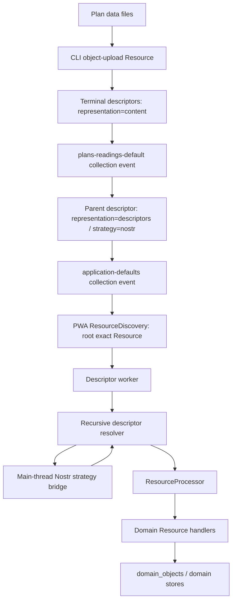

# Nested Resource Collections and Recursive Descriptor Resolution Implementation

**Status:** Implemented / current as of 2026-09-13  
**Application:** KJVOnly.bible  
**Scope:** Resource publishing CLI + PWA Resource discovery/resolution/worker runtime  

**Source basis:** Current CLI source plus the accepted nested-collection and descriptor-representation patches; current PWA Resource worker source plus the accepted recursive descriptor resolution, Nostr resolution-strategy, strategy-worker bridge, and bootstrap multiple-Resource-Type changes; current `app-data.yaml`. Rejected superseded patches are not treated as implementation.  

---

## 1. Purpose

This document describes the implementation that allows a Resource collection to contain another Resource collection and allows the PWA to recursively resolve that hierarchy until terminal Resource content is reached.

The implementation spans two major systems:

```text
KJVOnly Resource Publishing CLI
    ↓
publishes nested collection Resources
    ↓
Nostr / external object storage
    ↓
KJVOnly PWA Resource runtime
    ↓
recursively resolves descriptor Resources
    ↓
installs terminal Domain Objects
```

The feature was introduced to support application bootstrap data that is naturally grouped into a nested collection rather than flattened into one large root descriptor document.

The first production use is Reading Plans:

```text
application-defaults
    ↓
plans-readings-default collection
    ↓
individual Plan Definition Resources
```

The design is generic. Nothing in the CLI collection implementation or recursive PWA resolver is specific to Reading Plans.

---

## 2. Scope

This specification covers:

- manifest support for collection-to-collection references;
- manifest validation of nested collection references;
- recursive CLI collection build ordering;
- collection cycle detection;
- creation of a Resource Descriptor for a child collection;
- `representation` metadata on Resource Descriptors;
- publication of nested collection events;
- PWA Resource Descriptor validation;
- recursive descriptor-document resolution;
- terminal `content` versus nested `descriptors` representations;
- Nostr-backed descriptor resolution;
- the main-thread/worker Nostr strategy bridge;
- descriptor worker pooling;
- receipt behavior during recursive resolution;
- flattened `ResourceInstallResult` behavior;
- bootstrap Resource-selection behavior when a nested collection installs multiple Resources of one type;
- current tests and invariants.

This document does not redesign:

- Nostr Resource identity;
- Blossom object publication;
- Domain Resource handlers;
- Resource Outbox publication;
- module Resource-selection policy.

---

## 3. Architectural Background

Before nested collections, a collection could contain only Resource descriptors produced by manifest Resource definitions.

Conceptually:

```text
Collection
    ↓
Resource Descriptor
Resource Descriptor
Resource Descriptor
```

That was sufficient while the application bootstrap root directly enumerated all bootstrap Resources.

Reading Plans introduced a useful grouping boundary:

```text
application-defaults
    ↓
Reading Plans default collection
    ↓
individual Plan Definition Resources
```

The grouping itself is a Published Resource.

Therefore a collection member can now be either:

```text
terminal Resource descriptor
```

or:

```text
nested collection descriptor
```

The PWA must distinguish these by the descriptor metadata's `representation` field.

---

## 4. Core Mental Model

The implementation has two recursive-looking layers, but they own different concerns.

### 4.1 CLI recursion

The CLI recursively builds collection dependencies.

```text
parent collection definition
    ↓
child collection name
    ↓
build signed child event first
    ↓
construct descriptor pointing at child event
    ↓
include descriptor in parent event
```

### 4.2 PWA recursion

The PWA recursively resolves descriptor documents.

```text
root descriptor document
    ↓
descriptor metadata.representation
    ├── content      → terminal bytes
    └── descriptors  → decode another descriptor document
                           ↓
                       recurse
```

The CLI's recursive dependency graph and the PWA's recursive descriptor traversal are complementary implementations of the same Resource hierarchy.

---

# Part I — Publishing CLI

## 5. Relevant CLI Files

The main implementation lives in:

```text
client/cli/src/domain/manifest/
    manifest.ts
    manifest.spec.ts

client/cli/src/domain/resource/
    resource-descriptor.ts

client/cli/src/application/build/
    build-manifest.ts

client/cli/src/application/build/collection/
    collection-builder.ts
    collection-builder.spec.ts
    collection-event-builder.ts

client/cli/src/application/build/descriptor/
    descriptor-backed-resource-builder.ts
    resource-descriptor-builder.ts
    resource-descriptor-builder.spec.ts
    descriptor-event-builder.ts
    descriptor-event-builder.spec.ts

client/cli/src/application/publish/
    publish-manifest.ts

client/cli/src/application/publish/nostr/
    nostr-staged-event-publisher.ts

client/cli/src/application/sync/
    sync-manifest.ts
```

---

## 6. Manifest Collection Contract

A collection definition now supports both Resource members and child Collection members.

Conceptually:

```ts
interface CollectionDefinition {
    event: EventDefinition;
    resources: string[];
    collections: string[];
}
```

The actual Zod schema gives both arrays defaults:

```text
resources:   []
collections: []
```

This means a collection can contain:

- Resources only;
- Collections only;
- both Resources and Collections.

The manifest remains version `1`; nested collections did not require a new manifest version.

---

## 7. Manifest Validation

Manifest validation resolves names before the build phase.

For every collection:

```text
collection.resources[]
    ↓
must name an existing manifest Resource
    ↓
that Resource must produce descriptors
```

A Resource produces descriptors when it has an `object-upload` definition.

For every nested collection reference:

```text
collection.collections[]
    ↓
must name an existing manifest Collection
```

Unknown child collections are rejected with an error equivalent to:

```text
Unknown Collection: <name>
```

The schema does not attempt full dependency-cycle analysis. Cycle detection belongs to the recursive builder because cycles are graph behavior rather than simple local schema shape.

---

## 8. Resource Descriptor Representation

Resource Descriptor metadata now explicitly says what the resolved bytes contain.

The CLI model is:

```ts
interface ResourceDescriptorMetadata {
    publisher: string;
    resourceId: string;
    category: string;
    modifiedAt: number;
    representation: 'content' | 'descriptors';
    mediaType: string;
}
```

This distinction is fundamental.

### 8.1 Terminal object-backed Resource

A descriptor generated by `ResourceDescriptorBuilder` uses:

```text
representation = content
```

The strategy resolves bytes that are the terminal Resource payload.

### 8.2 Nested collection Resource

A descriptor generated for a child collection uses:

```text
representation = descriptors
```

The strategy resolves bytes that decode into another array of Resource Descriptors.

---

## 9. Descriptor Meaning

The descriptor separates Resource identity/content semantics from retrieval mechanics.

```text
metadata.publisher
metadata.resourceId
metadata.category
metadata.modifiedAt
metadata.representation
metadata.mediaType
```

describe the Resource.

```text
strategy.type
strategy.data
```

describe how serialized bytes are retrieved.

The resulting rule is:

```text
metadata.representation = what the resolved bytes contain
metadata.mediaType       = how those bytes are encoded
strategy                  = where/how those bytes are retrieved
```

This separation is also enforced by the PWA runtime.

---

## 10. Normal Descriptor-Backed Resource Build

`BuildManifestUseCase` processes manifest Resources before Collections.

For an object-upload Resource:

```text
manifest Resource
    ↓
SourceExpander
    ↓
ObjectArtifactStager
    ↓
DescriptorStrategyRegistry
    ↓
DescriptorEventBuilder
    ↓
ResourceDescriptorBuilder
    ↓
descriptorsByResource
```

`ResourceDescriptorBuilder` derives descriptor metadata from the expanded source and staged artifact.

Terminal descriptors receive:

```text
representation: content
```

The resulting descriptors are stored in:

```ts
Map<string, readonly ResourceDescriptor[]>
```

keyed by manifest Resource name.

That map is then passed into `CollectionBuilder`.

---

## 11. Collection Build Entry Point

After Resources are built, `BuildManifestUseCase` calls:

```text
CollectionBuilder.build({
    manifest,
    stagingRoot,
    descriptorsByResource
})
```

`CollectionBuilder` loads previously staged collection events and creates:

```text
stagedByName
builtEvents
visiting
```

### `stagedByName`

Maps manifest collection name to its previously staged collection event entry.

This supports incremental rebuilding and monotonic `created_at` behavior.

### `builtEvents`

Caches child collection events that have already been built during the current traversal.

This prevents rebuilding the same collection multiple times when referenced from more than one parent.

### `visiting`

Tracks the currently active dependency path for cycle detection.

---

## 12. Order-Independent Recursive Collection Build

Manifest collection declaration order does not need to be dependency order.

For every manifest collection, the builder calls:

```text
buildCollection(collectionName)
```

When a collection contains:

```yaml
collections:
  - child
```

`buildCollection(parent)` recursively calls:

```text
buildCollection(child)
```

before the parent event is created.

Therefore:

```text
parent declared first
child declared later
```

still produces:

```text
build child
    ↓
sign child event
    ↓
construct child descriptor
    ↓
build parent
```

This is required because the parent descriptor contains identity and revision information derived from the actual signed child event.

---

## 13. Collection Dependency Cycle Detection

`CollectionBuilder` maintains a path-local `visiting` set.

Before building a collection:

```text
if collectionName is already in visiting
    → dependency cycle
```

The builder also carries the human-readable traversal path.

A cycle such as:

```text
A → B → C → A
```

fails with an error containing the dependency path.

The collection is removed from `visiting` in `finally`, so unrelated branches are not incorrectly treated as cycles.

---

## 14. Resource Members of a Collection

For each name in:

```yaml
resources:
```

`CollectionBuilder` looks up:

```text
descriptorsByResource.get(resourceName)
```

All descriptors produced by that Resource definition are appended to the collection descriptor array.

This means one manifest Resource entry may contribute multiple terminal descriptors if its path expands into multiple concrete sources.

For example:

```text
plans-readings-default-items
    ↓
data/plans/readings/default/*
    ↓
five Resource Descriptors
```

---

## 15. Nested Collection Members

For each name in:

```yaml
collections:
```

`CollectionBuilder`:

1. recursively builds the child collection;
2. receives its signed Nostr event;
3. derives a Resource Descriptor from that signed event;
4. appends the descriptor to the parent descriptor document.

This descriptor is not a duplicate serialization of the child's descriptors.

It points at the child collection Resource itself.

---

## 16. Child Collection Descriptor Construction

`createCollectionDescriptor()` extracts required Resource metadata from the child event.

The child event must contain exactly one non-empty value for each of:

```text
d
m
t
representation
```

Their meanings are:

```text
d               → child resourceId
m               → child mediaType
t               → child category/resourceType
representation  → child representation
```

The nested child must use:

```text
representation = descriptors
```

A child collection event using another representation is rejected.

---

## 17. Child Collection Descriptor Shape

A nested collection descriptor has the following logical form:

```json
{
  "metadata": {
    "publisher": "<child event pubkey>",
    "resourceId": "<child d tag>",
    "category": "<child t tag>",
    "modifiedAt": "<child created_at>",
    "representation": "descriptors",
    "mediaType": "<child m tag>"
  },
  "strategy": {
    "type": "nostr",
    "data": {
      "kind": "<child event kind>",
      "relays": ["<manifest relays>"]
    }
  }
}
```

The child descriptor intentionally uses the child event's actual signed values.

The parent does not independently invent:

- child publisher;
- revision timestamp;
- kind;
- Resource identity.

---

## 18. Why Nested Collection Strategy Is Nostr

A collection is itself represented as a signed Nostr Resource event.

Therefore the parent needs enough retrieval information to fetch that exact child collection Resource.

The CLI emits:

```text
strategy.type = nostr
strategy.data.kind = child event kind
strategy.data.relays = manifest Nostr relays
```

This strategy data is intentionally transport-specific.

It belongs inside the descriptor strategy rather than generic Resource metadata.

---

## 19. Collection Event Content

`CollectionEventBuilder` serializes the complete descriptor array as JSON:

```text
ResourceDescriptor[]
    ↓
JSON.stringify
    ↓
UTF-8 bytes
    ↓
collection event encoding pipeline
    ↓
event.content
```

The event's encoding is controlled by the collection's manifest `event.encoding` list.

For the current application bootstrap and Plans collections:

```text
application/json
    + hex
```

is represented by:

```yaml
event:
  encoding:
    - hex
  tags:
    - ["m", "application/json+hex"]
```

---

## 20. Collection Revision Behavior

If a collection had a previously staged event, `CollectionEventBuilder` ensures the replacement event has a `created_at` greater than the previous event:

```text
createdAt = max(now, previousCreatedAt + 1)
```

This preserves replaceable-Resource revision ordering even when rebuilds occur quickly.

---

## 21. Staging Behavior

Every built collection is staged through the collection staging repository.

The builder also removes staged collection entries that no longer exist in the manifest.

Therefore the staging area reflects the current manifest collection set rather than accumulating deleted collection definitions.

---

## 22. Publish and Sync Behavior

`SyncManifestUseCase` remains simple:

```text
build manifest
    ↓
publish manifest
```

Nested collections do not need special publish semantics after the build phase.

`NostrStagedEventPublisher` loads all staged Nostr events from the staging repository, reconciles them with each configured relay, and publishes missing events.

Because child and parent collections are both staged events, both are published through the same generic Nostr staged-event publisher.

The dependency ordering requirement is a build concern, not a publish concern.

---

## 23. Production Manifest Example

The current Reading Plans configuration demonstrates the feature.

### Individual Plan Definition Resources

```yaml
resources:
  plans-readings-default-items:
    path: ../../data/plans/readings/default

    event:
      encoding:
        - hex

      tags:
        - ["d", "kjvonly/plans/readings/default/${key}"]
        - ["m", "application/json+hex"]
        - ["t", "kjvonly/plans/readings"]
        - ["representation", "descriptors"]

    object-upload:
      mediaType: application/json+gzip
      encoding: []
```

The event is a descriptor Resource pointing at external terminal content.

The descriptor generated for the external bytes uses:

```text
metadata.representation = content
metadata.mediaType = application/json+gzip
```

### Plans child collection

```yaml
collections:
  plans-readings-default:
    event:
      encoding:
        - hex

      tags:
        - ["d", "kjvonly/plans/readings/default"]
        - ["m", "application/json+hex"]
        - ["t", "kjvonly/plans/readings"]
        - ["representation", "descriptors"]

    resources:
      - plans-readings-default-items
```

### Application root collection

```yaml
  application-defaults:
    event:
      encoding:
        - hex

      tags:
        - ["d", "kjvonly/resources/collections/default"]
        - ["m", "application/json+hex"]
        - ["t", "kjvonly/resources/collections"]
        - ["representation", "descriptors"]

    resources:
      - bible-bundle-kjvs
      - bible-search-kjvs
      - bible-paragraphs
      - bible-pericopes
      - bible-booknames
      - strongs-kjvs

    collections:
      - plans-readings-default
```

The resulting graph is:

```text
kjvonly/resources/collections/default
    ├── Bible descriptors
    ├── Strong's descriptors
    └── Nostr descriptor
         → kjvonly/plans/readings/default
              ├── kjvonly/plans/readings/default/mcheyne
              ├── kjvonly/plans/readings/default/nt-5-year-plan
              ├── kjvonly/plans/readings/default/nt-in-a-month
              ├── kjvonly/plans/readings/default/proverbs
              └── kjvonly/plans/readings/default/wisdom
```

---

# Part II — PWA Recursive Resolution

## 24. Relevant PWA Files

The central runtime files are:

```text
src/lib/resource/descriptors/
    resource-descriptor.ts
    resource-descriptor-validator.ts
    resource-descriptor-document-decoder.ts

src/lib/resource/resolution/
    resource-resolution-strategy.ts
    content-representation-resolver.ts
    descriptors-representation-resolver.ts
    blossom-resource-resolution-strategy.ts
    nostr-resource-resolution-strategy.ts
    resource-resolver.ts

src/lib/resource/services/
    resource.service.ts
    resource-processor.ts
    resource-install-result.ts

src/lib/resource/receipts/
    resource-receipt.service.ts

src/lib/resource/worker/
    resource.worker.ts
    resource-content.worker.ts
    resource-descriptor.worker.ts
    resource-worker-client.ts
    resource-worker-discovery.ts
    resource-worker-strategy-resolver.ts
    resource-worker-strategy-message.ts
    resource-child-worker-client.ts
    resource-child-worker-message.ts
    resource-descriptor-worker-pool.ts
    resource-worker-processor-router.ts
    resource-worker-composition.ts
```

Application composition is in:

```text
src/lib/application/runtime/application.ts
```

---

## 25. PWA Resource Descriptor Contract

The PWA descriptor model mirrors the published descriptor shape:

```ts
interface ResourceDescriptor {
    metadata: ResourceDescriptorMetadata;
    strategy: ResourceDescriptorStrategy;
}
```

with metadata:

```ts
interface ResourceDescriptorMetadata {
    publisher: string;
    resourceId: string;
    category: string;
    modifiedAt: number;
    representation: 'content' | 'descriptors';
    mediaType: string;
}
```

and strategy:

```ts
interface ResourceDescriptorStrategy {
    type: string;
    data: unknown;
}
```

---

## 26. Descriptor Validation

`ResourceDescriptorValidator` validates generic Resource descriptor structure.

It requires:

```text
metadata object
strategy object
```

Metadata rules include:

```text
publisher
    lower-case 64-character hex

resourceId
    non-empty string

category
    non-empty string
    must equal extractResourceType(resourceId)

modifiedAt
    safe integer >= 0

representation
    content | descriptors

mediaType
    non-empty string
```

Strategy rules include:

```text
type
    non-empty string

data
    property must exist
```

The generic validator intentionally does not understand provider-specific strategy-data schemas.

For example:

```text
Nostr strategy validates kind + relays
Blossom strategy validates its own URLs/hash/size information
```

---

## 27. Descriptor Document Decoder

`ResourceDescriptorDocumentDecoder` has one responsibility:

```text
encoded Resource content
    + mediaType
    ↓
ResourceContentDecoratorBuilder
    ↓
decoded value
    ↓
must be an array
```

Its output is:

```ts
readonly unknown[]
```

It does not validate each descriptor.

That remains the responsibility of `ResourceDescriptorValidator` during traversal.

This separation allows malformed members to be reported individually while continuing to process later valid members.

---

## 28. Resource Resolution Strategy Contract

The strategy port is intentionally narrow:

```ts
interface ResourceResolutionStrategy {
    readonly type: string;

    resolve(
        descriptor: ResourceDescriptor
    ): Promise<Uint8Array>;
}
```

The strategy returns serialized bytes only.

It does not return:

- `ResourceRepresentation`;
- `VerifiedResourceContent`;
- Domain Objects;
- decoded JSON;
- receipt information.

This is a critical boundary.

Provider-specific retrieval is below the strategy port; Resource meaning stays above it.

---

## 29. Why Strategies Return Bytes

A strategy answers:

> Given this descriptor's provider-specific retrieval information, what serialized bytes does it identify?

The resolver answers:

> What do those bytes mean according to Resource metadata?

Therefore:

```text
strategy.resolve()
    ↓
Uint8Array
    ↓
resolver examines metadata.representation
```

This prevents Blossom or Nostr implementations from manufacturing generic Resource objects and duplicating Resource semantics.

---

## 30. Blossom Strategy

`BlossomResourceResolutionStrategy` remains a local descriptor-worker strategy.

Its job is external byte retrieval and integrity validation.

Conceptually:

```text
descriptor.strategy.data
    ↓
validate Blossom locations/integrity fields
    ↓
fetch bytes
    ↓
verify expected size/hash
    ↓
Uint8Array
```

It does not need the main-thread Nostr infrastructure.

---

## 31. Nostr Strategy

`NostrResourceResolutionStrategy` uses:

```text
strategy.type = nostr
```

Its strategy data is:

```ts
{
    kind: number;
    relays: readonly string[];
}
```

Validation requires:

```text
kind
    safe integer >= 0

relays
    non-empty array
    every item non-empty
    every URL uses ws: or wss:
```

---

## 32. Nostr Descriptor Query

The strategy performs an exact Nostr query based on the descriptor:

```text
kind    = strategy.data.kind
author  = descriptor.metadata.publisher
#d      = descriptor.metadata.resourceId
relays  = strategy.data.relays
```

The query is deliberately assembled by the Nostr strategy rather than by generic Resource code.

---

## 33. Nostr Event Verification

Receiving an event is not enough.

The Nostr strategy validates that the returned event matches the descriptor exactly.

It verifies:

```text
event.kind
    == strategy kind

event.pubkey
    == descriptor publisher

event.created_at
    == descriptor modifiedAt

d tag
    == descriptor resourceId

t tag
    == descriptor category

representation tag
    == descriptor representation

m tag
    == descriptor mediaType
```

Only after those checks does it return:

```text
TextEncoder(event.content)
```

as `Uint8Array`.

---

## 34. Root Resource Discovery Is Still Separate

Nested collection support did not change the public Resource Discovery contract.

Root discovery remains:

```ts
ResourceDiscovery.get(
    PublishedResourceReference
)
```

The input is still only:

```text
publisher
resourceId
```

It does not accept:

- relay overrides;
- strategy data;
- arbitrary transport configuration.

This is intentional.

---

## 35. Root Discovery vs Nested Nostr Resolution

There are two Nostr queries with different architectural ownership.

### Root query

```text
Application / ResourceWorkerClient
    ↓
ResourceDiscovery
    ↓
exact root PublishedResourceReference
```

### Nested descriptor query

```text
DescriptorsRepresentationResolver
    ↓
ResourceResolutionStrategy(type = nostr)
    ↓
NostrResourceResolutionStrategy
    ↓
query exact descriptor Resource using strategy relays
```

Nested traversal therefore does **not** call `ResourceDiscovery.get()` recursively.

This distinction keeps root application discovery and descriptor-directed retrieval separate.

---

## 36. Resource Service

`ResourceService` still owns:

```text
exact Published Resource in-flight deduplication
+
root Resource Discovery
```

The install flow is:

```text
install(reference)
    ↓
in-flight identity key publisher/resourceId
    ↓
discovery.get(reference)
    ↓
ResourceRepresentation
    ↓
processor.process(reference, representation)
```

If discovery returns `null`:

```text
found = false
resources = []
```

---

## 37. Representation Routing

The coordinator worker routes a root Resource by representation type.

```text
ResourceRepresentation.representation
    ├── content
    │    ↓
    │  content worker
    │
    └── descriptors
         ↓
       descriptor worker pool
```

The router is `ResourceWorkerProcessorRouter`.

---

## 38. Descriptor Worker Pool

Descriptor processing uses three child descriptor workers.

```text
ResourceDescriptorWorkerPool
    ├── descriptor worker 1
    ├── descriptor worker 2
    └── descriptor worker 3
```

Each top-level descriptor Resource occupies one worker slot while being processed.

Jobs beyond the three active slots are queued.

When a worker completes or fails its job, the slot is released and the next queued job is dispatched.

---

## 39. Important Recursion Boundary

Nested descriptors are **not** submitted as new top-level jobs to the descriptor worker pool.

Once a descriptor worker begins resolving one descriptor Resource, recursive nested traversal stays inside that same worker call:

```text
descriptor worker
    ↓
DescriptorsRepresentationResolver.resolve()
    ↓
resolveEntries()
    ↓
nested descriptor document
    ↓
resolveEntries() recursively
```

This keeps recursion context—especially depth and visited identities—local to one traversal.

---

## 40. Recursive Resolver Entry

`DescriptorsRepresentationResolver.resolve()` first decodes the top-level Resource representation as a descriptor document.

If top-level descriptor-document decoding fails, it returns a failure associated with the containing Resource.

Otherwise it calls `resolveEntries()` with:

```text
depth = 0
visited = { root publisher/resourceId }
```

---

## 41. Per-Descriptor Resolution Algorithm

For every descriptor entry:

```text
validate descriptor
    ↓
check Resource receipt freshness
    ↓
select strategy by descriptor.strategy.type
    ↓
branch on descriptor.metadata.representation
```

Failures are accumulated rather than aborting the entire descriptor document.

This makes collection processing best-effort across siblings.

---

## 42. Receipt Freshness Check

Before retrieving descriptor bytes, the resolver asks:

```text
ResourceReceiptService.needsProcessing(
    publisher,
    resourceId,
    modifiedAt
)
```

If the terminal Resource is already current:

```text
no strategy retrieval
    ↓
current outcome
```

The outcome records:

```text
publisher
resourceId
resourceType
status = current
```

---

## 43. Terminal `content` Descriptor

When:

```text
metadata.representation = content
```

the resolver:

1. executes the selected strategy;
2. receives serialized bytes;
3. creates `VerifiedResourceContent` from descriptor metadata + bytes.

Conceptually:

```ts
{
    publisher,
    resourceId,
    resourceType: category,
    modifiedAt,
    mediaType,
    content
}
```

The descriptor resolver does not decode Domain content itself.

---

## 44. Nested `descriptors` Descriptor

When:

```text
metadata.representation = descriptors
```

the resolver:

1. checks cycle identity;
2. checks maximum depth;
3. executes the selected strategy;
4. decodes returned bytes using the descriptor's `mediaType`;
5. creates a new path-local visited set;
6. recursively resolves the decoded entries;
7. merges nested contents/current/failures into the parent result.

The nested collection itself is therefore traversal structure rather than terminal Domain content.

---

## 45. Cycle Detection

Descriptor identity is represented internally by the pair:

```text
publisher
resourceId
```

serialized as a stable identity key.

The resolver seeds the set with the root Resource identity.

Before entering a nested descriptor Resource:

```text
if identity already exists in current path
    → Resource descriptor cycle
```

The visited set is copied for each recursive branch.

Therefore reuse in a DAG is valid:

```text
root
  ├── A → shared
  └── B → shared
```

provided `shared` is not encountered twice on one active path.

---

## 46. Maximum Nesting Depth

The current implementation defines:

```text
MAX_DESCRIPTOR_NESTING_DEPTH = 3
```

The check occurs before descending from a descriptor document into another `descriptors` Resource.

The limit is an implementation guard against unbounded traversal.

It is not currently manifest-configurable.

---

## 47. Failure Isolation

A bad member does not automatically prevent later siblings from resolving.

The resolver records failures for conditions including:

- invalid descriptor structure;
- unsupported strategy type;
- strategy retrieval failure;
- recursive cycle;
- maximum depth exceeded;
- nested descriptor-document decode failure.

Then it continues with later entries when possible.

If descriptor validation itself failed, the failure can be identity-less because trustworthy Resource identity was never established.

---

## 48. Resolution Result

Recursive resolution produces three collections:

```ts
{
    contents,
    current,
    failures
}
```

### `contents`

Terminal verified Resource content requiring Domain processing.

### `current`

Terminal Resources skipped because their receipt is already current.

### `failures`

Descriptor or retrieval failures.

The hierarchy is intentionally flattened at this boundary.

---

## 49. Resource Processor

`ResourceProcessor` turns the resolution result into a flat `ResourceInstallResult`.

It first creates failed outcomes, then current outcomes, then processes each terminal content item.

For terminal content:

```text
VerifiedResourceContent
    ↓
ResourceContentDecoder
    ↓
DecodedResourceContent
    ↓
ResourceHandler by resourceType
    ↓
Domain interpretation / validation / installation
```

---

## 50. Terminal Resource Receipts

After a terminal handler succeeds, `ResourceProcessor` calls:

```text
receipts.markProcessed(
    publisher,
    resourceId,
    modifiedAt
)
```

A receipt write failure is logged but does not convert a successfully handled Resource into a failed installation.

---

## 51. Collections Are Not Receipted Merely for Traversal

A nested collection descriptor is not passed through a Domain Resource handler just because its descriptor document was successfully traversed.

Therefore the resolver does not call `markProcessed()` for the containing collection itself.

The current invariant is:

```text
terminal/domain Resource successfully handled
    → receipt may be marked

collection traversed to reach children
    → no handler receipt merely for traversal
```

This prevents traversal structure from being mistaken for accepted terminal Domain state.

---

# Part III — Worker / Main-Thread Strategy Bridge

## 52. Why a Strategy Bridge Is Needed

The descriptor resolver runs in a descriptor worker.

Blossom retrieval can run there directly.

The application's Nostr Resource client, signer, and rx-nostr transport infrastructure live on the main thread.

The implementation therefore cannot simply instantiate another Nostr client inside every descriptor worker.

Instead it proxies strategy resolution.

---

## 53. Main Application Composition

The application creates:

```text
NostrSigner
    ↓
ResourceClient
```

then:

```text
ResourceDiscovery(resourceClient)
```

and:

```text
NostrResourceResolutionStrategy(resourceClient)
```

The browser worker client is created with:

```text
createBrowserResourceWorkerClient(
    resourceDiscovery,
    [NostrResourceResolutionStrategy]
)
```

Thus the main thread owns both:

- root Nostr discovery;
- Nostr descriptor-strategy execution.

They remain distinct capabilities.

---

## 54. Coordinator Worker Composition

`resource.worker.ts` is the coordinator.

It creates:

```text
ResourceWorkerDiscovery
ResourceWorkerStrategyResolver
content child worker
descriptor worker pool (3)
ResourceWorkerProcessorRouter
ResourceService
```

The coordinator does not itself recreate Resource handlers or Nostr transport.

---

## 55. Root Discovery Bridge

`ResourceWorkerDiscovery` sends a discovery request from the coordinator to `ResourceWorkerClient` on the main thread.

The main-thread client delegates to:

```text
ResourceDiscovery.get(reference)
```

and sends the resulting `ResourceRepresentation | null` back to the coordinator.

This bridge is used for root installation requests.

---

## 56. Descriptor Strategy Bridge

Nested Nostr descriptor retrieval follows a separate bridge.

```text
Descriptor worker
    ↓
ResourceWorkerStrategyResolver.resolve(descriptor)
    ↓
strategy-resolve message
    ↓
ResourceChildWorkerClient in coordinator
    ↓
coordinator ResourceWorkerStrategyResolver
    ↓
strategy-resolve message
    ↓
main ResourceWorkerClient
    ↓
registered strategy map
    ↓
NostrResourceResolutionStrategy
    ↓
Uint8Array
    ↓
result travels back through same bridge
```

Only the descriptor and serialized bytes cross the strategy boundary.

---

## 57. Descriptor Worker Strategy Registration

`createDescriptorResourceProcessor()` constructs:

```text
BlossomResourceResolutionStrategy
```

and a proxy strategy:

```ts
{
    type: 'nostr',
    resolve(descriptor) {
        return remoteStrategyResolver.resolve(descriptor);
    }
}
```

These are registered with `DescriptorsRepresentationResolver`:

```text
[
    blossomStrategy,
    nostrStrategy
]
```

The descriptor worker therefore knows the generic strategy name `nostr` but does not know rx-nostr, relays, signing, or `ResourceClient` implementation details.

---

## 58. Main-Thread Strategy Registry

`ResourceWorkerClient` receives a list of main-thread `ResourceResolutionStrategy` implementations.

It builds a map by `strategy.type` and rejects duplicate registrations.

When it receives:

```text
strategy-resolve
```

it selects the registered strategy by:

```text
descriptor.strategy.type
```

and executes it.

An unsupported type produces a strategy-resolution error response.

---

## 59. Strategy Message Contract

The strategy bridge transports only:

```text
requestId
ResourceDescriptor
```

and one of:

```text
Uint8Array result
```

or:

```text
serialized Error
```

There are no separate message fields for:

- relay list;
- Nostr filter;
- event kind;
- publisher;
- Resource ID.

Those remain encapsulated inside the descriptor and the strategy implementation.

---

## 60. Worker Error Rehydration

Worker boundaries serialize errors into DTOs and reconstruct them on the receiving side.

Strategy-resolution failures therefore propagate back to the descriptor resolver as normal exceptions, where they are converted into per-descriptor failures rather than necessarily crashing the whole Resource worker.

---

# Part IV — Bootstrap Integration

## 61. Flattened Install Results

Recursive resolution intentionally returns terminal outcomes as a flat list.

For the Plans collection:

```text
application defaults
    ↓
plans collection
    ↓
five Plan Definition Resources
```

`ResourceInstallResult.resources` contains five terminal Plan outcomes.

It does not contain a nested tree object describing their collection ancestry.

---

## 62. Bootstrap Selection Consequence

The original bootstrap selection initialization assumed:

```text
one bootstrap Resource Type
    → one bootstrap Resource selection
```

Nested collections invalidated that assumption.

For example, the five Plan Definition Resources all have:

```text
resourceType = kjvonly/plans/readings
```

but distinct Resource IDs.

They are valid members of one installed catalog, not five competing global defaults.

---

## 63. Current Bootstrap Selection Rule

The application now builds bootstrap selections using this rule:

```text
one distinct Resource for a Resource Type
    → initialize selection

same exact Resource repeated
    → harmless duplicate

multiple distinct Resources for one Resource Type
    → do not initialize a global selection for that type
```

All terminal Resources remain installed.

Only global selection initialization is omitted for the ambiguous flat type.

Module/domain policy can then establish any domain-specific source selection it needs.

---

## 64. Why Bootstrap Does Not Reconstruct Collection Hierarchy

The fix deliberately did not add Plans-specific knowledge to generic bootstrap initialization.

It also did not add an `ambiguousResourceTypes` API or infer that a particular collection path should become a selection.

The generic bootstrap layer only knows what its flattened Resource installation result can prove.

That preserves the boundary:

```text
Resource installation
    ≠
module/domain selection policy
```

---

# Part V — End-to-End Flow

## 65. Producer-to-Consumer Flow



---

## 66. Concrete Plans Flow

```text
CLI
    data/plans/readings/default/mcheyne.json.gz
    data/plans/readings/default/proverbs.json.gz
    ...
        ↓
    individual object-upload descriptors
        ↓
    kjvonly/plans/readings/default collection
        ↓
    signed Nostr collection event
        ↓
    application-defaults contains Nostr descriptor to child

PWA
    discover kjvonly/resources/collections/default
        ↓
    decode root descriptor document
        ↓
    see Plans descriptor:
        representation = descriptors
        strategy = nostr
        ↓
    proxy Nostr retrieval to main thread
        ↓
    fetch exact kjvonly/plans/readings/default event
        ↓
    verify event against descriptor metadata
        ↓
    decode child descriptor document
        ↓
    resolve five terminal Plan descriptors
        ↓
    PlanDefinitionResourceHandler
        ↓
    five installed Plan Definition Domain Objects
```

---

# Part VI — Tests

## 67. CLI Manifest Tests

Manifest tests cover:

- accepting a collection that references another collection;
- default/parsed nested collection arrays;
- rejecting an unknown nested collection;
- rejecting unknown Resource collection members;
- requiring descriptor-producing Resource members.

---

## 68. CLI Collection Builder Tests

Collection builder tests cover:

- deterministic Resource descriptor aggregation;
- building child collections before parents;
- handling manifest order independently of dependency order;
- emitting a Nostr child-collection descriptor;
- preserving child Resource metadata;
- setting nested descriptor representation to `descriptors`;
- embedding Nostr strategy `kind` and `relays`;
- rejecting dependency cycles;
- failing when a collection Resource member did not produce descriptors.

---

## 69. PWA Descriptor Resolver Tests

Resolver tests cover:

- representation type ownership;
- duplicate strategy rejection;
- descriptor document decoding;
- terminal child content retrieval;
- recursive nested descriptor retrieval;
- cycle detection;
- maximum depth enforcement;
- current receipt behavior;
- unsupported strategy failure isolation;
- invalid descriptor isolation;
- strategy retrieval failure isolation;
- top-level descriptor-document decode failure.

---

## 70. Worker Strategy Bridge Tests

The strategy resolver tests cover:

- sending a `strategy-resolve` request;
- correlating responses by request ID;
- returning `Uint8Array` content;
- error serialization/rehydration.

Child-worker tests cover forwarding nested strategy requests without conflating them with normal process responses.

---

## 71. Browser Integration Tests

Browser Resource installation tests cover:

- installing different Resource Types from one descriptor collection;
- continuing collection installation when one strategy is unsupported;
- skipping retrieval for terminal Resources whose receipts are current.

Reading Plans then provided the production nested-collection end-to-end verification.

---

# Part VII — Invariants

## 72. Collection Invariants

The following invariants should be preserved:

```text
A collection Resource has representation=descriptors.
```

```text
A nested child collection is referenced by a Resource Descriptor,
not by copying its descriptor array into the parent at build time.
```

```text
The child collection is built before the parent that references it.
```

```text
Collection dependency cycles are invalid.
```

```text
Nested collection descriptor metadata is derived from the signed child event.
```

---

## 73. Descriptor Invariants

```text
metadata.resourceId + publisher identify the Published Resource.
```

```text
metadata.category must match the Resource Type derived from resourceId.
```

```text
metadata.representation says what strategy-resolved bytes contain.
```

```text
strategy implementations return bytes only.
```

```text
provider-specific schema validation belongs to the provider strategy.
```

---

## 74. Discovery / Strategy Invariants

```text
Root ResourceDiscovery remains exact-reference discovery.
```

```text
Nested descriptor traversal does not recursively call ResourceDiscovery.
```

```text
Nested Nostr relay configuration stays inside Nostr strategy data.
```

```text
Generic Resource APIs do not gain relay parameters.
```

```text
Descriptor workers do not instantiate the application's Nostr transport stack.
```

---

## 75. Worker Invariants

```text
Nostr root discovery executes on the main thread.
```

```text
Nostr descriptor-strategy execution executes through the main-thread strategy registry.
```

```text
Descriptor traversal itself executes in descriptor workers.
```

```text
Recursive descendants stay within the same descriptor-worker traversal.
```

---

## 76. Receipt Invariants

```text
Receipt freshness may skip terminal Resource retrieval.
```

```text
A terminal Resource is marked processed only after its handler succeeds.
```

```text
A collection is not marked processed merely because it was traversed.
```

---

# Part VIII — Known Current Constraints

## 77. Maximum Depth Is Fixed

The current recursive resolver uses:

```text
MAX_DESCRIPTOR_NESTING_DEPTH = 3
```

This is a code-level constant rather than manifest/application configuration.

Any change should be deliberate because depth limits are part of recursion safety.

---

## 78. CLI Nested Collections Use Nostr Retrieval

The CLI currently synthesizes nested collection descriptors with:

```text
strategy.type = nostr
```

This reflects the current representation of collection Resources as Nostr events.

The generic PWA resolver can support other strategies if descriptors use them and a strategy implementation is registered.

---

## 79. Install Results Are Flat

The PWA does not preserve collection ancestry in `ResourceInstallResult`.

This is why generic bootstrap selection logic cannot reconstruct a nested collection as a selected source from terminal outcomes alone.

The current behavior deliberately handles this by omitting a global selection when multiple distinct terminal Resources share one type.

---

## 80. Collection Receipt Optimization Is Not Implemented

The runtime currently re-enters descriptor collections in order to decide whether children need processing.

Only terminal Resource receipts drive the existing skip optimization.

A future collection-level caching/receipt mechanism would be a separate architectural change and must not cause child freshness to be skipped incorrectly.

---

# Part IX — Failure Modes

## 81. Unknown Nested Collection at Manifest Load

```text
manifest references missing child collection
    ↓
manifest validation fails
```

No build begins.

---

## 82. Collection Dependency Cycle

```text
A → B → A
    ↓
CollectionBuilder visiting-set detection
    ↓
build fails with dependency path
```

---

## 83. Invalid Child Collection Tags

If the signed child event does not contain exactly one required:

```text
d / t / m / representation
```

parent collection construction fails.

---

## 84. Unsupported Descriptor Strategy

```text
descriptor.strategy.type not registered
    ↓
per-descriptor failure
    ↓
later siblings continue
```

The entire root Resource install does not have to abort.

---

## 85. Nostr Nested Event Mismatch

If the returned nested event does not match descriptor metadata:

```text
kind / pubkey / created_at / d / t / representation / m mismatch
    ↓
Nostr strategy rejects
    ↓
child failure outcome
```

This protects the descriptor's exact Resource statement.

---

## 86. Recursive Cycle

```text
publisher/resourceId already in active path
    ↓
cycle failure
```

Other sibling branches can continue.

---

## 87. Depth Limit

```text
next nested descent exceeds supported depth
    ↓
child failure
```

Other siblings can continue.

---

# Part X — Maintenance Guidance

## 88. If Changing Manifest Collection Semantics

Inspect together:

```text
manifest.ts
manifest.spec.ts
collection-builder.ts
collection-builder.spec.ts
```

Do not update only the schema or only the recursive builder.

---

## 89. If Changing Descriptor Metadata

Inspect both producer and consumer models:

```text
CLI ResourceDescriptor
CLI ResourceDescriptorBuilder
CLI CollectionBuilder child descriptor
PWA ResourceDescriptor
PWA ResourceDescriptorValidator
provider strategies
```

Producer/consumer drift will fail at Resource resolution time.

---

## 90. If Adding a New Nested Retrieval Provider

The correct extension point is:

```text
ResourceResolutionStrategy
```

Decide where that provider can run:

```text
worker-safe provider
    → register directly in descriptor worker composition

main-thread-only provider
    → register main-thread strategy + use strategy bridge
```

Do not add provider-specific conditionals to `DescriptorsRepresentationResolver`.

---

## 91. If Changing Nostr Nested Retrieval

Preserve the distinction:

```text
ResourceDiscovery
    = root exact Resource discovery

NostrResourceResolutionStrategy
    = descriptor-directed nested byte retrieval
```

Do not move relay configuration into generic Resource Discovery or `ResourceService.install()`.

---

## 92. If Changing Worker Topology

Preserve behavior, not necessarily the exact number of workers:

- root discovery must stay behind its bridge;
- descriptor strategies must remain provider-separated;
- recursion context must not be lost when moving between jobs;
- worker failures must reject correlated requests;
- serialized errors must remain usable by callers.

---

# Part XI — Current Definition of Complete

The nested collection implementation currently provides:

```text
manifest collection-to-collection references
    ✓

unknown child validation
    ✓

order-independent recursive CLI build
    ✓

collection dependency cycle detection
    ✓

child collection Resource Descriptor generation
    ✓

content/descriptors representation metadata
    ✓

staging and normal Nostr publication of child collections
    ✓

PWA descriptor representation validation
    ✓

recursive descriptor traversal
    ✓

path-local cycle protection
    ✓

maximum-depth protection
    ✓

best-effort sibling failure handling
    ✓

Blossom terminal/nested retrieval support through strategy abstraction
    ✓

Nostr nested collection retrieval
    ✓

main-thread Nostr strategy bridge
    ✓

descriptor worker pool integration
    ✓

terminal handler installation
    ✓

terminal Resource receipts
    ✓

bootstrap multiple-terminal-same-type handling
    ✓

production use by Reading Plans bootstrap
    ✓
```

---

## 93. Final Mental Model

For publishing:

```text
manifest hierarchy
    ↓
CLI recursively builds signed child collections
    ↓
parents contain descriptors pointing to child Resources
```

For installation:

```text
root Published Resource
    ↓
main-thread Resource Discovery
    ↓
descriptor worker
    ↓
recursive descriptor resolver
    ↓
strategy retrieves serialized bytes
    ↓
representation determines content vs more descriptors
    ↓
terminal Resource handlers
    ↓
Domain installation
```

The central architectural rule is:

> **A nested collection is a Published Resource whose content is another descriptor document. The CLI expresses that relationship with `representation: descriptors`; the PWA follows it recursively while keeping Resource meaning, provider retrieval, main-thread Nostr access, worker processing, and Domain installation as separate boundaries.**
