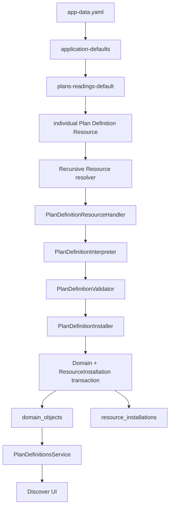
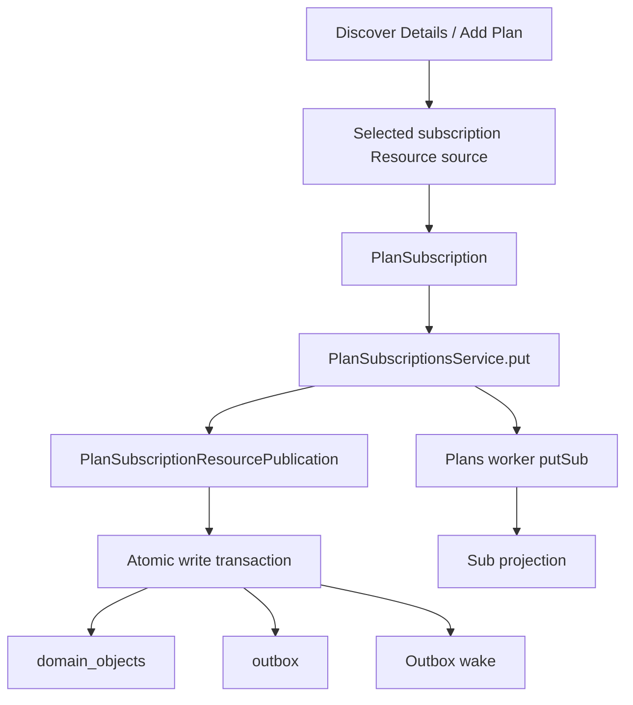
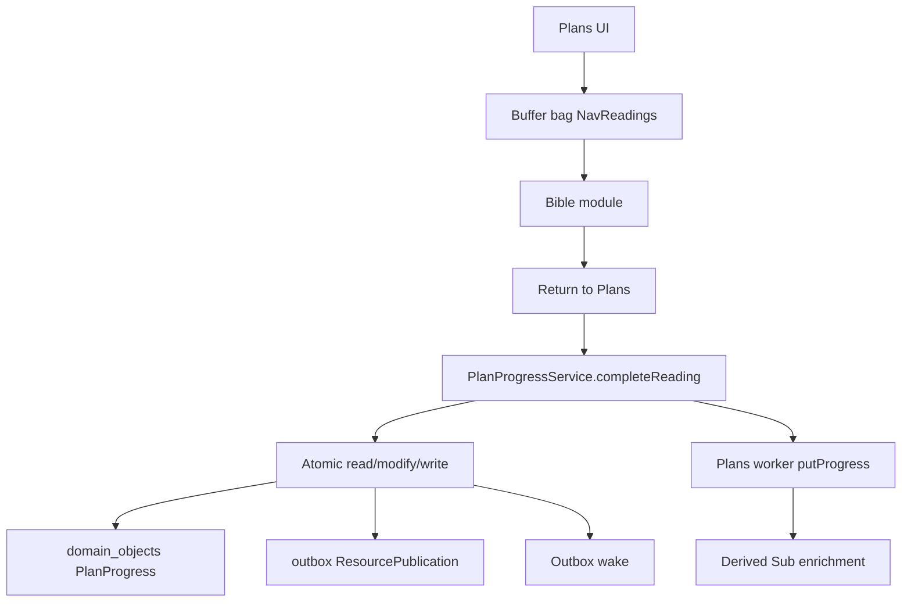
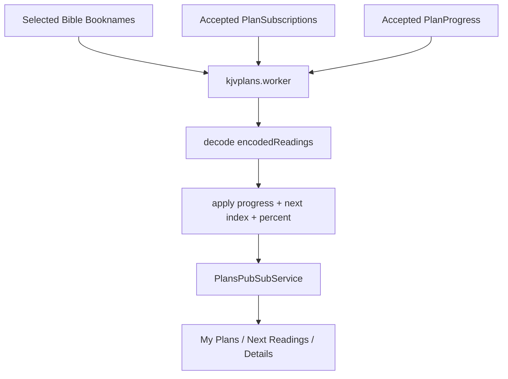

# Reading Plans Implementation

**Status:** Implemented / current as of 2026-09-13  
**Application:** KJVOnly.bible PWA  
**Scope:** Reading Plans Domain models, Resource lifecycle, persistence, Outbox publication, module Resource selection, worker/runtime projections, and UI integration  

**Source basis:** The latest uploaded Reading Plans source was reconstructed with the accepted subscription runtime cutover, Plan Progress Domain/store, Plan Progress write/Outbox/service, and latest Plan Progress runtime cutover changes, plus the current Application composition. This spec therefore describes the post-cutover implementation state immediately before the requested legacy audit. Old JSON/Nostr code is treated only as reference unless still named as pending cleanup.  

---

## 1. Purpose

This document describes the Reading Plans implementation as it exists after the September 2026 Resource/Domain refactor.

The implementation intentionally separates three different lifecycle concepts:

```text
Plan Definitions
Plan Subscriptions
Plan Progress
```

They are related, but they are not one persistence object and they do not share one lifecycle.

The current architecture is:

```text
Plan Definitions
    = bootstrap/reference Resources

Plan Subscriptions
    = writable user Domain state

Plan Progress
    = writable user Domain state
```

All three are consumed by the Plans UI, but they enter the application through different boundaries.

---

## 2. Core Architectural Rule

The central rule is:

> **Plan definitions are reference/published data. Subscriptions and progress are user-owned mutable application state. Do not collapse those concerns into one generic Plans persistence or transport layer.**

The implementation reuses generic infrastructure only where the lifecycle matches:

```text
Resource installation
shared domain_objects
Resource publication
Outbox
module Resource selection
Nostr transport
```

It does not introduce a generic `PlansEntity` abstraction.

---

## 3. Current High-Level Flows

### 3.1 Plan Definition bootstrap/read flow

```text
app-data.yaml
    ↓
application-defaults Collection
    ↓
plans-readings-default nested Collection
    ↓
individual Plan Definition Resources
    ↓
Resource worker
    ↓
PlanDefinitionResourceHandler
    ↓
PlanDefinitionInterpreter
    ↓
PlanDefinitionValidator
    ↓
PlanDefinitionInstaller
    ↓
domain_objects + resource_installations
    ↓
PlanDefinitionsService
    ↓
Discover UI
```

### 3.2 Subscription write flow

```text
Discover Details / Add Plan
    ↓
selected Plan Subscription Resource source
    ↓
PlanSubscription Domain Object
    ↓
PlanSubscriptionsService.put()
    ↓
PlanSubscriptionResourcePublication
    ↓
ONE IndexedDB transaction
    ├── domain_objects
    └── outbox
    ↓
Outbox wake
    ↓
Plans worker projection update
```

### 3.3 Progress write flow

```text
user returns from Bible reading
    ↓
PlanProgressService.completeReading()
    ↓
read existing PlanProgress inside write transaction
    ↓
append reading index if missing
    ↓
PlanProgressResourcePublication
    ↓
ONE IndexedDB transaction
    ├── domain_objects
    └── outbox
    ↓
Outbox wake
    ↓
Plans worker projection update
```

---

## 4. Important Boundary Distinctions

The implementation preserves these distinctions:

```text
Plan Definition Resource
    ≠
Plan Definition UI projection
```

```text
Plan Definition
    ≠
Plan Subscription
```

```text
Plan Subscription
    ≠
Plan Progress
```

```text
accepted Domain state
    ≠
derived worker state
```

```text
local read
    ≠
remote synchronization
```

```text
module Resource selection
    ≠
Domain store query filtering
```

```text
Resource publication
    ≠
Resource synchronization
```

---

# Part I — Directory Layout

## 5. Reading Plans Domain Layout

The implementation is organized under:

```text
client/kjvonly-pwa/src/lib/domains/reading-plans/
```

The important current structure is:

```text
reading-plans/
├── models/
│   ├── plan-definition.ts
│   ├── plan-definition-id.ts
│   ├── plan-subscription.ts
│   ├── plan-subscription-id.ts
│   ├── plan-progress.ts
│   └── plans.model.ts
│
├── persistence/
│   ├── plan-definitions-store.ts
│   ├── indexeddb-plan-definitions-store.ts
│   ├── plan-definition-installation-transaction.ts
│   ├── plan-subscriptions-store.ts
│   ├── indexeddb-plan-subscriptions-store.ts
│   ├── plan-subscription-write-transaction.ts
│   ├── plan-progress-store.ts
│   ├── indexeddb-plan-progress-store.ts
│   └── plan-progress-write-transaction.ts
│
├── resources/
│   ├── plans-module-resource-selection-contributor.ts
│   │
│   ├── definitions/
│   │   ├── plan-definition-candidate.ts
│   │   ├── validated-plan-definition-candidate.ts
│   │   ├── plan-definition-interpreter.ts
│   │   ├── plan-definition-validator.ts
│   │   ├── plan-definition-installer.ts
│   │   ├── plan-definition-resource-handler.ts
│   │   ├── plan-definition-installation-stores.ts
│   │   └── plan-definition-default-selection.ts
│   │
│   ├── subscriptions/
│   │   ├── plan-subscription-resource-source.ts
│   │   ├── plan-subscription-resource-publication.ts
│   │   └── plan-subscription-write-stores.ts
│   │
│   └── progress/
│       ├── plan-progress-resource.ts
│       ├── plan-progress-resource-publication.ts
│       └── plan-progress-write-stores.ts
│
├── services/
│   ├── plan-definitions.service.ts
│   ├── plan-subscriptions.service.ts
│   ├── plan-progress.service.ts
│   ├── encodedReadingsDecoder.service.ts
│   ├── subsEnricher.service.ts
│   └── plansPubSub.service.ts
│
├── workers/
│   └── kjvplans.worker.ts
│
└── modules/plans/
    ├── plansContainer.svelte
    ├── discover/
    ├── subscription/
    ├── nextReadings/
    └── components/
```

Legacy JSON files remain under the module data directory as historical/reference material.

They are not the authoritative runtime persistence model.

---

# Part II — Shared Persistence Model

## 6. One Physical Domain Store

Reading Plans does not create separate physical IndexedDB stores for definitions, subscriptions, or progress.

All accepted Domain Objects use:

```text
kjvonly-application
    ↓
domain_objects
```

The shared stored envelope is conceptually:

```ts
{
    id,
    objectType,
    objectId,
    value
}
```

Typed Reading Plans store classes provide Domain-specific access over that shared physical store.

---

## 7. Object-Type Index Reads

Collection reads use the existing:

```text
objectType
```

index.

Each typed store performs one query equivalent to:

```text
db.getAllFromIndex(
    DOMAIN_OBJECTS,
    OBJECT_TYPE_INDEX,
    <objectType>
)
```

There are currently three Reading Plans object types:

```text
reading-plans/plan-definition
reading-plans/plan-subscription
reading-plans/plan-progress
```

---

# Part III — Plan Definitions

## 8. Plan Definition Meaning

A `PlanDefinition` describes a reading schedule that can be discovered/installed and later subscribed to.

The accepted Domain model is:

```ts
interface PlanDefinition {
    readonly id: string;
    readonly name: string;
    readonly description: string;
    readonly encodedReadings: readonly string[];
}
```

The model intentionally does not include Resource transport fields.

---

## 9. Fields Removed from the Canonical Plan Definition

The current canonical payload does not contain legacy fields such as:

```text
id
userID
version
dateCreated
```

inside external Resource content.

The validator is strict and rejects unexpected fields.

`id` is created from accepted Resource/application identity rather than trusted from external content.

---

## 10. Plan Definition Application Identity

A Plan Definition application ID is:

```text
<publisher>/<group>/<planKey>
```

Example:

```text
4de85ea7.../default/mcheyne
```

Helpers:

```ts
createPlanDefinitionId(
    publisher,
    group,
    planKey
)

parsePlanDefinitionId(id)
```

The parsed form is:

```ts
{
    publisher,
    group,
    planKey
}
```

Every segment must be non-empty and may not contain `/`.

---

## 11. Plan Definition Resource Type

The external Resource Type is:

```text
kjvonly/plans/readings
```

The constant is:

```ts
PLAN_DEFINITION_RESOURCE_TYPE
```

This follows the application's three-segment Resource Type convention:

```text
namespace / domain / resource-type
```

---

## 12. Individual Plan Definition Resource ID

An individual Plan Definition Resource uses:

```text
kjvonly/plans/readings/<group>/<planKey>
```

Examples:

```text
kjvonly/plans/readings/default/mcheyne
kjvonly/plans/readings/default/proverbs
kjvonly/plans/readings/default/wisdom
```

The group collection itself is a different Resource:

```text
kjvonly/plans/readings/default
```

The collection Resource must not be confused with an individual Plan Definition.

---

## 13. Plan Definition Object Type

Accepted Plan Definitions use:

```text
objectType = reading-plans/plan-definition
```

For example:

```text
objectId
    4de85ea7.../default/mcheyne

stored id
    reading-plans/plan-definition:4de85ea7.../default/mcheyne
```

---

# Part IV — Plan Definition Producer / Bootstrap

## 14. Default Plan Source Data

Default Plan Definition files live under:

```text
data/plans/readings/default/
```

Current files include:

```text
mcheyne.json.gz
nt-5-year-plan.json.gz
nt-in-a-month.json.gz
proverbs.json.gz
wisdom.json.gz
```

Each file contains only the canonical Plan payload:

```text
name
description
encodedReadings
```

---

## 15. Individual Resource Manifest Entry

`app-data.yaml` defines:

```yaml
plans-readings-default-items:
  path: ../../data/plans/readings/default

  event:
    encoding:
      - hex

    tags:
      - ["d", "kjvonly/plans/readings/default/${key}"]
      - ["m", "application/json+hex"]
      - ["t", "kjvonly/plans/readings"]
      - ["representation", "descriptors"]

  object-upload:
    mediaType: application/json+gzip
    encoding: []
```

This means the published Nostr Resource event is a descriptor Resource while the terminal object bytes are gzip JSON content.

---

## 16. Plan Group Collection

The Plans Resource set is grouped by:

```yaml
plans-readings-default:
  event:
    encoding:
      - hex

    tags:
      - ["d", "kjvonly/plans/readings/default"]
      - ["m", "application/json+hex"]
      - ["t", "kjvonly/plans/readings"]
      - ["representation", "descriptors"]

  resources:
    - plans-readings-default-items
```

This collection contains descriptors for the individual plans.

---

## 17. Application Bootstrap Collection

The root application defaults collection contains the Plans collection as a nested collection:

```yaml
application-defaults:
  ...

  resources:
    - bible-bundle-kjvs
    - bible-search-kjvs
    - bible-paragraphs
    - bible-pericopes
    - bible-booknames
    - strongs-kjvs

  collections:
    - plans-readings-default
```

The resulting graph is:

```text
kjvonly/resources/collections/default
    ↓
kjvonly/plans/readings/default
    ↓
five individual kjvonly/plans/readings/default/<planKey> Resources
```

---

## 18. Bootstrap Result Semantics

Recursive Resource installation returns terminal Plan Definition outcomes as a flat list.

All five plans have:

```text
resourceType = kjvonly/plans/readings
```

The application therefore does not initialize one global Resource selection for that type when multiple distinct Resource IDs are returned.

The Resources are still installed.

This is a selection concern, not an installation failure.

---

# Part V — Plan Definition Inbound Lifecycle

## 19. Interpreter

`PlanDefinitionInterpreter` owns:

```text
resourceType = kjvonly/plans/readings
```

It validates that:

- `DecodedResourceContent.resourceType` matches;
- the Resource ID parses to the same Resource Type;
- the Resource path contains exactly two segments after the Resource Type.

Those segments are:

```text
group
planKey
```

The interpreter returns one candidate:

```ts
{
    group,
    planKey,
    value: resource.value
}
```

A group collection Resource does not reach this handler as terminal content because its representation is `descriptors`.

---

## 20. Validator

`PlanDefinitionValidator` uses a strict Zod object:

```ts
{
    name: string(min 1),
    description: string,
    encodedReadings: string(min 1)[]
}
```

The object is `.strict()`.

Therefore unexpected legacy fields are rejected rather than silently ignored.

The validated candidate separates identity path information from content:

```ts
{
    group,
    planKey,
    definition: {
        name,
        description,
        encodedReadings
    }
}
```

---

## 21. Installer

`PlanDefinitionInstaller` requires exactly one validated candidate per terminal Plan Resource.

It creates application identity from:

```text
resource.publisher
+
candidate.group
+
candidate.planKey
```

using:

```text
createPlanDefinitionId(...)
```

---

## 22. Plan Definition Freshness Policy

The installer reads the current Resource installation provenance for:

```text
objectType = reading-plans/plan-definition
objectId   = definitionId
```

The current policy is:

```text
no current installation
    → install

incoming modifiedAt > current modifiedAt
    → replace

incoming modifiedAt <= current modifiedAt
    → skip
```

This is appropriate for bootstrap/reference Plan Definition data.

---

## 23. Plan Definition Installation Transaction

Inbound Plan Definition installation uses one read/write transaction over:

```text
domain_objects
resource_installations
```

The installer writes:

```text
PlanDefinition Domain Object
+
ResourceInstallation provenance
```

atomically.

If either operation fails, the transaction aborts and the original operation error is preserved.

---

## 24. Installation Provenance

The Resource installation record contains:

```text
objectType
    reading-plans/plan-definition

objectId
    <publisher>/<group>/<planKey>

publisher
    Resource publisher

resourceId
    individual Plan Definition Resource ID

modifiedAt
    Resource modifiedAt
```

This provenance remains separate from Plan Definition content.

---

## 25. Plan Definition Resource Handler

`PlanDefinitionResourceHandler` composes:

```text
PlanDefinitionInterpreter
    ↓
PlanDefinitionValidator
    ↓
PlanDefinitionInstaller
```

The handler advertises:

```text
kjvonly/plans/readings
```

and is registered in generic Resource worker composition alongside other Domain Resource handlers.

The generic Resource worker therefore dispatches by Resource Type rather than containing a Plans-specific conditional.

---

# Part VI — Plan Definition Persistence and Reads

## 26. PlanDefinitionsStore

The typed store contract is:

```ts
interface PlanDefinitionsStore {
    get(id): Promise<PlanDefinition | undefined>;
    getAll(): Promise<readonly PlanDefinition[]>;
    put(definition): Promise<void>;
}
```

`IndexedDBPlanDefinitionsStore` maps this contract to the shared `domain_objects` store.

---

## 27. PlanDefinitionsService

`PlanDefinitionsService` is deliberately local-only:

```ts
get(id)
list()
```

`get(id)` directly calls the typed store's `get()`.

`list()` directly calls `getAll()`.

It does not:

- query a relay;
- enumerate a publisher;
- run Resource discovery;
- merge remote plans;
- filter by selected Plan source.

This implements the rule:

```text
normal local read
    ≠
remote synchronization
```

---

## 28. Definition Catalog Behavior

`PlanDefinitionsService.list()` returns every installed Plan Definition regardless of publisher or group.

The Discover UI currently uses this complete installed catalog.

The selected Plan Definition Resource source is not currently used as a catalog filter.

That behavior is intentional in the present implementation and should not be changed accidentally by treating selection as query scope.

---

# Part VII — Plan Reading Encoding

## 29. Encoded Reading Format

A Plan Definition stores readings compactly as strings.

A reading group example is:

```text
1/1/1-31;47/1/1-25;15/1/1-11;51/1/1-26
```

Semantics:

```text
bookID/chapter/verse-range
```

with semicolons separating multiple Bible passages that belong to the same reading unit.

The `encodedReadings` array order is the plan sequence.

---

## 30. BookNameLookup Boundary

The decoder receives a narrow injected dependency:

```ts
type BookNameLookup =
    (bookID: string) => string;
```

It does not access a global Booknames singleton.

This is an important existing boundary.

Booknames come from the selected Bible Booknames Resource through application/module context.

---

## 31. Decoded Reading Model

The decoder creates `Readings` values containing:

```ts
{
    bcvs: BCV[],
    totalVerses: number
}
```

Each BCV contains data such as:

```text
bookName
bookID
chapter
verses
bibleLocationRef
```

`bibleLocationRef` is initially derived from the encoded reading by replacing `/` with `_`.

---

## 32. Total Verse Count

`EncodedReadingsDecoderService` calculates `totalVerses` for each reading group by summing verse ranges.

For a range:

```text
start-end
```

count is:

```text
end - start + 1
```

If a verse range cannot be parsed, `parseVerseRange()` returns zero values and contributes zero verses.

---

# Part VIII — Plan Definition UI Projection

## 33. PlanDefinitionView

Persisted Plan Definitions do not contain decoded runtime readings.

The UI projection is:

```ts
interface PlanDefinitionView extends PlanDefinition {
    nestedReadings: Readings[];
}
```

`nestedReadings` is derived from:

```text
PlanDefinition.encodedReadings
+
selected Booknames
```

The persisted Domain Object remains authoritative.

---

## 34. Discover Startup

`discover.svelte` resolves the selected Booknames source through:

```text
ModuleResourceSelectionResolver.require(
    paneID,
    BIBLE_BOOKNAMES_RESOURCE_TYPE
)
```

Then:

```text
BibleBooknamesService.get(source)
    ↓
booknamesById
```

It creates a `BookNameLookup`, loads definitions from:

```text
PlanDefinitionsService.list()
```

and maps each definition to `PlanDefinitionView`.

No normal Discover relay query is performed.

---

# Part IX — Module Resource Selection

## 35. Plans Resource Requirements

`PlansModuleResourceSelectionContributor` currently owns these required Resource Types:

```text
Bible Booknames
Plan Definitions
Plan Subscriptions
```

Concretely:

```text
kjvonly/bible/booknames
kjvonly/plans/readings
kjvonly/plans/subscriptions
```

Plan Progress is not a selected Resource requirement.

Its identity is derived from the Plan Subscription identity.

---

## 36. Selection Mechanism vs Policy

The generic module Resource-selection helper provides mechanism only.

Plans-specific defaults are derived inside:

```text
PlansModuleResourceSelectionContributor
```

This preserves the architectural ownership rule:

```text
generic module selection infrastructure
    = copy/merge required selections

Plans contributor
    = Plans-specific default policy
```

---

## 37. Default Plan Definition Selection

If no Plan Definition selection exists and a current authenticated pubkey is available, the contributor creates:

```text
publisher
    current user

resourceId
    kjvonly/plans/readings/default
```

Existing/inherited Plan Definition selections are preserved.

If there is no current user, the contributor leaves the selection missing.

---

## 38. Default Plan Subscription Selection

If no Plan Subscription selection exists and a current authenticated pubkey is available, the contributor creates:

```text
publisher
    current user

resourceId
    kjvonly/plans/subscriptions/default
```

This selected source is used when creating a new subscription.

Existing/inherited selections are preserved.

---

## 39. Important Current Selection Behavior

The current implementation should be understood precisely:

```text
Plan Definition selection
    does not filter PlanDefinitionsService.list()
```

```text
Plan Subscription selection
    supplies publisher/group identity for new subscriptions
```

```text
Plan Progress
    has no independent selected source
    because progress identity follows subscription identity
```

---

# Part X — Plan Subscriptions

## 40. Subscription Meaning

A `PlanSubscription` means the user has chosen a Plan Definition and owns a durable snapshot of that plan.

The snapshot prevents an active subscription from depending on the continued availability or immutability of the original Plan Definition.

---

## 41. PlanSubscription Model

The accepted Domain model is:

```ts
interface PlanSubscription {
    readonly id: string;
    readonly planDefinitionId: string;
    readonly name: string;
    readonly description: string;
    readonly encodedReadings: readonly string[];
    readonly dateSubscribed: number;
}
```

There is no `userID` field.

There is no legacy subscription `version` field.

Publisher ownership is encoded by the application ID.

---

## 42. Subscription Snapshot

A subscription copies:

```text
Plan Definition id
name
description
encodedReadings
```

plus:

```text
dateSubscribed
```

This allows:

```text
source Plan Definition changes or disappears
    ↓
existing subscription remains usable
```

The source definition ID is retained as provenance/reference through `planDefinitionId`.

---

## 43. Subscription Application Identity

The subscription ID is:

```text
<publisher>/<group>/<subscriptionId>
```

Example:

```text
4de85ea7.../default/<uuid>
```

Helpers:

```ts
createPlanSubscriptionId(...)
parsePlanSubscriptionId(...)
```

Parsed form:

```ts
{
    publisher,
    group,
    subscriptionId
}
```

---

## 44. Subscription Object Type

Accepted Plan Subscriptions use:

```text
objectType = reading-plans/plan-subscription
```

Stored ID:

```text
reading-plans/plan-subscription:<publisher>/<group>/<subscriptionId>
```

---

## 45. Subscription Resource Type

Outbound subscription Resources use:

```text
kjvonly/plans/subscriptions
```

The selected collection source is:

```text
kjvonly/plans/subscriptions/<group>
```

An individual subscription Resource is:

```text
kjvonly/plans/subscriptions/<group>/<subscriptionId>
```

---

## 46. Subscription Resource Source Helper

`parsePlanSubscriptionResourceSource()` requires exactly one path segment after the Resource Type.

Valid selected source:

```text
kjvonly/plans/subscriptions/default
```

Invalid selected source:

```text
kjvonly/plans/subscriptions/default/subscription-1
```

because the latter is an individual object, not a collection source.

---

## 47. Creating Subscription Identity from Selection

The UI uses:

```text
createPlanSubscriptionIdForSource(
    selectedSource,
    subscriptionId
)
```

This:

1. parses the selected group;
2. uses `source.publisher`;
3. creates the application subscription ID.

Thus Pane/Buffer Resource selection policy stays outside `PlanSubscriptionsService`.

---

# Part XI — Subscription Resource Publication

## 48. PlanSubscriptionResourcePublication

The Domain-specific mapper accepts only a `PlanSubscription`.

It parses:

```text
subscription.id
```

into:

```text
publisher
group
subscriptionId
```

and derives the complete outbound Resource publication.

---

## 49. Subscription Publication Identity

The mapper creates:

```text
publisher
    parsed publisher

resourceType
    kjvonly/plans/subscriptions

resourceId
    kjvonly/plans/subscriptions/<group>/<subscriptionId>

representation
    content

mediaType
    application/json+gzip+hex
```

The Resource content value is:

```json
{
  "planDefinitionId": "...",
  "name": "...",
  "description": "...",
  "encodedReadings": ["..."],
  "dateSubscribed": 0
}
```

The application `id` is not duplicated into Resource content.

---

## 50. Why Publisher Is Not a Payload Field

Publisher is derived from:

```text
PlanSubscription.id
```

It therefore does not appear as:

```text
userID
publisher
```

inside the Resource payload.

This matches the broader application identity rule:

```text
application identity
    → Resource identity mapping

payload
    → intrinsic object value only
```

---

# Part XII — Subscription Persistence / Outbox

## 51. PlanSubscriptionsStore

The typed store exposes:

```ts
get(id)
getAll()
put(subscription)
```

`IndexedDBPlanSubscriptionsStore` stores values in the shared Domain envelope.

---

## 52. Subscription Write Transaction

`IndexedDBPlanSubscriptionWriteTransaction` opens one transaction over:

```text
domain_objects
outbox
```

The transaction-scoped store capabilities are intentionally narrow:

```text
subscriptions.put()
outbox.put()
```

---

## 53. Shared Persistence Key

For one subscription:

```text
stored Domain id
    reading-plans/plan-subscription:<subscription.id>
```

The Outbox entry uses the same local persistence key.

This follows the established Outbox identity rule:

```text
same accepted Domain object
    → same durable local Outbox key
```

---

## 54. Atomicity

The service does not first write Domain state and later enqueue publication.

Instead:

```text
Domain Object put
+
Outbox ResourcePublication put
```

occur in the same transaction.

If the Outbox write fails, the Domain write aborts.

The application cannot durably accept a subscription that is required to publish without also durably recording publication intent.

---

## 55. PlanSubscriptionsService

The application-facing service exposes:

```ts
get(id)
list()
put(subscription)
```

Normal reads are local.

`put()` performs:

```text
subscription
    ↓
PlanSubscriptionResourcePublication.create()
    ↓
write transaction
    ├── subscriptions.put(subscription)
    └── outbox.put(subscription.id, publication)
    ↓
commit
    ↓
outbox.wake()
```

Wake occurs only after commit.

---

## 56. Subscription Add UI Flow

`discoverDetails.svelte` handles Add Plan.

It resolves:

```text
PLAN_SUBSCRIPTION_RESOURCE_TYPE
```

through the pane's `ModuleResourceSelectionResolver`.

It creates a new UUID and then:

```text
createPlanSubscriptionIdForSource(
    selected subscription source,
    uuid
)
```

The new subscription snapshots the selected Plan Definition.

Then:

```text
await planSubscriptionsService.put(subscription)
plansPubSubService.putSub(subscription)
```

The first line changes authoritative state.

The second updates the worker's derived projection.

---

# Part XIII — Plan Progress

## 57. Progress Meaning

Progress is intentionally separate from the subscription snapshot.

A `PlanProgress` represents completed reading indexes for exactly one accepted Plan Subscription.

The aggregate is one object per subscription rather than one Domain object per completed reading.

---

## 58. PlanProgress Model

The Domain model is:

```ts
interface PlanProgress {
    readonly id: string;
    readonly completedReadingIndexes: readonly number[];
}
```

`id` is the corresponding Plan Subscription application ID.

Therefore:

```text
PlanSubscription.id
    ==
PlanProgress.id
```

while object types differ.

---

## 59. Why Progress Reuses Subscription Identity

A progress object has no meaning without its subscription.

The existing subscription identity already contains:

```text
publisher
group
subscriptionId
```

Therefore progress does not introduce another UUID or an extra `subID` payload field.

---

## 60. Progress Fields Removed from Legacy Shape

The new Domain model does not use the old per-reading structure:

```text
id
subID
index
version
```

Instead one aggregate contains:

```text
completedReadingIndexes: [0, 1, 4, ...]
```

There is no legacy `version` field.

---

## 61. Progress Object Type

Accepted progress uses:

```text
objectType = reading-plans/plan-progress
```

Stored ID:

```text
reading-plans/plan-progress:<subscription-id>
```

Although subscription and progress share `objectId`, their stored IDs are distinct because their `objectType` values differ.

---

# Part XIV — Progress Resource Publication

## 62. Progress Resource Type

Outbound progress Resources use:

```text
kjvonly/plans/progress
```

There is currently no independent module-selected progress Resource source.

The Resource identity is derived from the subscription application ID.

---

## 63. Progress Resource ID

Parsing:

```text
PlanProgress.id
    <publisher>/<group>/<subscriptionId>
```

produces:

```text
Resource ID
    kjvonly/plans/progress/<group>/<subscriptionId>
```

Publisher is the publisher segment from the Domain ID.

---

## 64. Progress Resource Payload

`PlanProgressResourcePublication` produces:

```text
representation
    content

mediaType
    application/json+gzip+hex
```

with payload:

```json
{
  "completedReadingIndexes": [0, 1, 4]
}
```

It does not publish:

```text
id
subID
version
publisher
```

inside content.

---

# Part XV — Progress Persistence / Outbox

## 65. PlanProgressStore

The typed persistence contract exposes:

```ts
get(id)
getAll()
put(progress)
```

`IndexedDBPlanProgressStore` uses the shared `domain_objects` store and `objectType` index.

---

## 66. Progress Write Transaction

`IndexedDBPlanProgressWriteTransaction` opens one read/write transaction over:

```text
domain_objects
outbox
```

The transaction-scoped capabilities are:

```text
progress.get()
progress.put()
outbox.put()
```

The read capability is important because progress updates are aggregate read-modify-write operations.

---

## 67. Read-Modify-Write Inside One Transaction

`completeReading()` must not perform:

```text
read outside transaction
    ↓
compute
    ↓
open transaction to write
```

because two nearby completions could both read stale state and overwrite each other.

The current implementation instead performs:

```text
open read/write transaction
    ↓
read current PlanProgress
    ↓
compute updated aggregate
    ↓
write Domain Object
    ↓
write Outbox entry
    ↓
commit
```

This keeps the accepted aggregate mutation and publication intent atomic.

---

## 68. PlanProgressService Reads

`PlanProgressService` exposes:

```ts
get(subscriptionId)
list()
```

Both read directly from accepted local Domain state.

There is no relay enumeration in normal progress reads.

---

## 69. completeReading()

The write operation is:

```ts
completeReading(
    subscriptionId,
    readingIndex
)
```

It first validates that `readingIndex` is:

```text
safe integer
>= 0
```

Invalid input is rejected before opening the write transaction.

---

## 70. Progress Creation

If no progress exists for the subscription:

```text
existing = undefined
```

then completing reading index `n` creates:

```ts
{
    id: subscriptionId,
    completedReadingIndexes: [n]
}
```

---

## 71. Progress Update

If progress exists and the index is new:

```text
existing completed indexes
    + new index
    ↓
sort ascending
    ↓
updated PlanProgress
```

The service then creates the outbound Resource publication and writes both state and publication intent in the same transaction.

---

## 72. Progress Idempotency

If the reading index already exists:

```text
return existing progress
```

The current implementation performs:

```text
no Domain put
no Outbox put
no Outbox wake
```

This makes `completeReading()` idempotent for a reading already marked complete.

---

## 73. Progress Outbox Wake

The service tracks whether the transaction actually changed progress.

Only when changed:

```text
outbox.wake()
```

is called.

A failed transaction also does not wake the Outbox.

---

# Part XVI — Application Composition

## 74. Reading Plans Application Services

The `Application` composition root creates:

```text
IndexedDBPlanDefinitionsStore
    ↓
PlanDefinitionsService
```

```text
IndexedDBPlanSubscriptionsStore
IndexedDBPlanSubscriptionWriteTransaction
PlanSubscriptionResourcePublication
    ↓
PlanSubscriptionsService
```

```text
IndexedDBPlanProgressStore
IndexedDBPlanProgressWriteTransaction
PlanProgressResourcePublication
    ↓
PlanProgressService
```

The writable services receive the shared application `OutboxProcessor` through its narrow wake behavior.

---

## 75. ApplicationContext

The application-facing context exposes:

```text
planDefinitionsService
planSubscriptionsService
planProgressService
```

Plans UI components consume these capabilities through:

```text
useApplicationContext()
```

They do not instantiate independent store/service graphs.

---

# Part XVII — Plans Worker

## 76. Worker Role After Refactor

`kjvplans.worker.ts` is no longer authoritative persistence or Nostr ownership.

Its current role is a local derived projection.

Conceptually:

```text
domain_objects accepted subscriptions
+
domain_objects accepted progress
+
selected Booknames
    ↓
Plans worker
    ↓
Sub runtime projections
```

---

## 77. Worker Initialization Inputs

The worker initializes from three explicit inputs:

```text
booknamesById
subscriptions
progress
```

These are passed by `plansContainer.svelte` through `PlansPubSubService.initialize()`.

The worker no longer loads subscriptions or completed-reading records through legacy Nostr APIs at startup.

---

## 78. Plans Container Startup

`plansContainer.svelte` performs:

```text
resolve selected Bible Booknames source
    ↓
BibleBooknamesService.get()
    ↓
PlanSubscriptionsService.list()
    ↓
PlanProgressService.list()
    ↓
PlansPubSubService.initialize(
    booknamesById,
    subscriptions,
    progress
)
    ↓
worker acknowledgement
    ↓
workerReady = true
```

The Plans UI is gated until worker initialization completes.

---

## 79. Worker BookNameLookup

Inside the worker:

```ts
bookNameLookup =
    (bookID) =>
        booknamesById[bookID] ?? ''
```

This preserves the explicit Booknames dependency and avoids a hidden global singleton.

---

## 80. Worker Authoritative Inputs vs Derived State

The worker keeps:

```text
Map<string, Sub> subs
Map<string, PlanProgress> progressBySubscriptionId
```

The `PlanSubscription` and `PlanProgress` values are accepted application state supplied from the main thread.

`Sub` is derived runtime state.

---

# Part XVIII — Sub Runtime Projection

## 81. Sub Model

The runtime/UI `Sub` projection is:

```ts
interface Sub {
    id: string;
    planDefinitionId: string;
    dateSubscribed: number;

    name: string;
    description: string;
    nestedReadings: Readings[];
    completedReadingIndexes: Set<number>;

    nextReadingsIndex: number;
    percentCompleted: number;
}
```

This object is not the persisted Plan Subscription Domain model.

---

## 82. Subscription-to-Sub Conversion

`planSubscriptionToSub()`:

1. decodes the subscription snapshot's `encodedReadings`;
2. uses the injected `BookNameLookup`;
3. initializes an empty completed-reading `Set`;
4. initializes next-reading/progress metadata.

Later enrichment applies accepted `PlanProgress`.

---

## 83. Progress Projection

For each Sub, the worker looks up:

```text
progressBySubscriptionId.get(sub.id)
```

and sets:

```ts
sub.completedReadingIndexes =
    new Set(progress?.completedReadingIndexes ?? [])
```

This removes the old need for per-reading `CompletedReadings` runtime objects.

---

## 84. Next Reading Calculation

`SubsEnricherService.getNextReadingIndex()` finds the lowest incomplete reading index.

It sorts completed indexes and looks for the first gap in the zero-based sequence.

If there is no gap, the next index becomes:

```text
completedReadingIndexes.length
```

---

## 85. Percent Complete

Percent complete is derived as:

```text
ceil(
    completed count
    /
    total nested readings
    * 100
)
```

It is not persisted in `PlanProgress` or `PlanSubscription`.

---

## 86. Why Derived Values Stay Out of Domain Persistence

The following are currently runtime-derived:

```text
nestedReadings
completedReadingIndexes Set representation
nextReadingsIndex
percentCompleted
totalVerses
bookName text
```

Persisting these would duplicate information already derivable from:

```text
subscription snapshot
progress aggregate
selected Booknames
```

---

# Part XIX — PlansPubSubService

## 87. Purpose

`PlansPubSubService` is a typed-ish main-thread bridge to the Plans worker and a local UI subscription router.

It does not persist accepted Plans state.

It does not publish Nostr Resources.

---

## 88. Worker Initialization Handshake

Initialization sends:

```text
action: init
booknamesById
subscriptions
progress
```

The worker responds with:

```text
plans-worker-initialized
```

`PlansPubSubService.initialize()` resolves only after that acknowledgement.

---

## 89. Current Worker Message IDs

The enum preserves the current numeric IDs:

```text
GET_ALL_SUBS = 2
PUT_SUB     = 3
PUT_PROGRESS = 4
```

The old reading-specific message was replaced by aggregate progress updates.

---

## 90. Incremental Subscription Update

After a successful local subscription write:

```text
plansPubSubService.putSub(subscription)
```

sends the accepted `PlanSubscription` to the worker.

The worker converts it to a `Sub`, enriches it with any matching progress, and republishes the subscription map to local UI subscribers.

---

## 91. Incremental Progress Update

After a successful local progress write:

```text
plansPubSubService.putProgress(progress)
```

sends the accepted aggregate progress object.

The worker updates:

```text
progressBySubscriptionId
```

then re-enriches the affected Sub and republishes the subscription map.

---

## 92. UI Subscription Routing

UI consumers subscribe to worker publications with:

```text
id
callback
subscriber id
```

`GET_ALL_SUBS` is currently the main local collection-change/publication channel.

The subscriber ID is used for later unsubscription.

---

# Part XX — Plans UI Views

## 93. Top-Level View Groups

The module uses view ID ranges:

```text
Plan Definition / Discover views
    < PLANS_MAX_VIEW_ID

Subscription views
    < SUBS_MAX_VIEW_ID

Next Reading views
    < NEXT_MAX_VIEW_ID
```

`plansContainer.svelte` selects the appropriate component group after worker initialization.

---

## 94. Discover List

The Discover path presents installed `PlanDefinitionView` values.

It does not perform remote follow-list enumeration or direct Nostr reads.

Selecting a Plan opens its details view.

---

## 95. Discover Details

The details view:

- displays Plan name and description;
- lazily renders reading groups in batches;
- shows decoded Bible references;
- exposes Add Plan.

Add Plan creates accepted subscription state as described above.

---

## 96. My Plans List

`SubsView` subscribes to worker `GET_ALL_SUBS` publications.

It converts the returned `Map<string, Sub>` to a UI array and sorts subscriptions by:

```text
dateSubscribed ascending
```

Each row displays:

```text
name
description
percentCompleted
```

---

## 97. Subscription Details

`subsDetails.svelte` displays the reading sequence for a selected subscription.

Completed readings are identified by:

```text
selectedSub.completedReadingIndexes.has(index)
```

The user can toggle whether completed readings are shown.

The view does not query persisted progress directly; it consumes the worker projection.

---

## 98. Next Readings View

The Next Readings view derives one candidate next reading from each current `Sub`.

It consumes worker-produced:

```text
nextReadingsIndex
percentCompleted
```

and constructs `NextReadings` UI values.

---

# Part XXI — Navigation to the Bible Module

## 99. NavReadings

When the user selects a subscription reading, the Plans module creates:

```ts
interface NavReadings {
    subID: string;
    subNestedReadingsIndex: number;
    readings: Readings;
    currentNavReadingsIndex: number;
    returnView: PLANS_VIEWS;
}
```

This is transient application navigation state.

---

## 100. Buffer Bag Handoff

Before switching to the Bible module, Plans writes:

```text
pane.buffer.bag.navReadings
```

and:

```text
pane.buffer.bag.bibleLocationRef
```

Then:

```text
pane.updateBuffer(Modules.BIBLE)
```

The Bible module therefore receives reading-navigation context through the existing Buffer bag mechanism.

---

## 101. Completion on Return

When Plans becomes active again, `SubsView` or `NextReadings` checks:

```text
pane.buffer.bag.navReadings
```

If present, it treats that navigation as the reading completion event.

It calls:

```text
PlanProgressService.completeReading(
    nr.subID,
    nr.subNestedReadingsIndex
)
```

then deletes:

```text
pane.buffer.bag.navReadings
```

and updates the worker with the accepted `PlanProgress`.

---

# Part XXII — Persistence Matrix

## 102. Current Accepted State

| Concept | objectType | objectId | Physical store | Read service |
| --- | --- | --- | --- | --- |
| Plan Definition | `reading-plans/plan-definition` | `<publisher>/<group>/<planKey>` | `domain_objects` | `PlanDefinitionsService` |
| Plan Subscription | `reading-plans/plan-subscription` | `<publisher>/<group>/<subscriptionId>` | `domain_objects` | `PlanSubscriptionsService` |
| Plan Progress | `reading-plans/plan-progress` | subscription ID | `domain_objects` | `PlanProgressService` |

No new dedicated physical Plans stores were added.

---

# Part XXIII — Resource Matrix

## 103. Current Resource Identities

| Concept | Resource Type | Resource ID |
| --- | --- | --- |
| Plan Definition | `kjvonly/plans/readings` | `kjvonly/plans/readings/<group>/<planKey>` |
| Plan Definition group Collection | `kjvonly/plans/readings` | `kjvonly/plans/readings/<group>` |
| Plan Subscription | `kjvonly/plans/subscriptions` | `kjvonly/plans/subscriptions/<group>/<subscriptionId>` |
| Plan Progress | `kjvonly/plans/progress` | `kjvonly/plans/progress/<group>/<subscriptionId>` |

---

## 104. Current Resource Representations

Plan Definition terminal content:

```text
representation = content
mediaType = application/json+gzip
```

Plan Definition descriptor event / collections:

```text
representation = descriptors
```

Plan Subscription outbound publication:

```text
representation = content
mediaType = application/json+gzip+hex
```

Plan Progress outbound publication:

```text
representation = content
mediaType = application/json+gzip+hex
```

---

# Part XXIV — Outbox Semantics

## 105. Subscription Outbox Entry

A subscription write stores complete Resource publication intent before waking the publisher.

Conceptually:

```text
reading-plans/plan-subscription:<id>
    ↓
OutboxEntry.resource = complete subscription ResourcePublication
```

The Outbox does not reread `PlanSubscription` later to reconstruct the Resource.

---

## 106. Progress Outbox Entry

Progress uses:

```text
reading-plans/plan-progress:<subscription-id>
```

as its durable Outbox key.

Repeated progress writes for the same subscription overwrite/coalesce under the same local key.

This fits replaceable Resource behavior: the newest aggregate progress state is the publication intent that matters.

---

## 107. Wake Ordering

For both subscriptions and progress:

```text
atomic transaction commits
    ↓
Outbox entry is durable
    ↓
outbox.wake()
```

Never the reverse.

If publication fails, accepted local state remains available and the pending Outbox entry remains durable for retry.

---

# Part XXV — What Is No Longer in the Active Subscription/Progress Runtime

## 108. Removed Legacy Subscription Concepts

The active Reading Plans subscription path no longer depends on:

```text
CachedSub
cachedSubToSub
PlanDefinitionToCachedSub
subsApi.gets()
subsApi.put()
userID
subscription version
legacy planID naming
```

`planDefinitionId` is the descriptive field in the new subscription/runtime models.

---

## 109. Removed Legacy Progress Concepts

The active progress path no longer depends on:

```text
CompletedReadings Domain-like row
completedReadingsApi
completedReadingsService
subID payload persistence
per-reading version
PUT_READING worker message
```

The worker now receives aggregate `PlanProgress` values.

---

## 110. Legacy Files as Reference Only

Old JSON fixtures and old Nostr-specific source may still exist in the repository while cleanup is pending.

The current decision is:

```text
no migration of old subscription/progress data
```

Legacy code/data is reference material only.

The new implementation does not attempt to import old rows into the new Domain model.

---

# Part XXVI — Synchronization Boundary

## 111. Normal Local Reads

Current normal reads are:

```text
PlanDefinitionsService.list()
PlanSubscriptionsService.list()
PlanProgressService.list()
```

All consume accepted local Domain state.

They do not enumerate Nostr relays.

---

## 112. Future Synchronization

Remote discovery/synchronization is intentionally pending.

Future work may need to handle:

```text
remote Plan Definition discovery
remote subscription enumeration
remote progress enumeration
remote deletions
revision comparison
multi-device conflict behavior
publisher/follow policy
```

These responsibilities must not be hidden inside ordinary local read methods.

---

# Part XXVII — Current Inbound/Outbound Coverage

## 113. Plan Definitions

Current coverage:

```text
producer/bootstrap publishing
    ✓

inbound Resource interpretation
    ✓

validation
    ✓

installation
    ✓

Resource installation provenance
    ✓

local read service
    ✓

Discover UI
    ✓

local Plan Definition write/publication service
    not implemented
```

Plan Definitions are currently treated as installed reference data.

---

## 114. Plan Subscriptions

Current coverage:

```text
Domain model
    ✓

shared local persistence
    ✓

local read service
    ✓

Domain → Resource publication mapping
    ✓

atomic Domain + Outbox write
    ✓

Outbox wake
    ✓

worker/UI incremental update
    ✓

normal startup from domain_objects
    ✓

inbound subscription Resource handler/install
    not implemented

remote synchronization
    not implemented

unsubscribe/delete publication flow
    not implemented
```

---

## 115. Plan Progress

Current coverage:

```text
Domain aggregate model
    ✓

shared local persistence
    ✓

local read service
    ✓

completeReading mutation
    ✓

Domain → Resource publication mapping
    ✓

atomic read-modify-write + Outbox
    ✓

idempotent completion
    ✓

worker/UI incremental update
    ✓

normal startup from domain_objects
    ✓

inbound progress Resource handler/install
    not implemented

remote synchronization
    not implemented

uncomplete/remove-reading mutation
    not implemented
```

---

# Part XXVIII — Tests

## 116. Plan Definition Identity Tests

Tests verify:

- create/parse publisher/group/plan-key identity;
- invalid empty segments;
- invalid slash-containing segments;
- malformed serialized IDs.

---

## 117. Plan Definition Contract Tests

Interpreter tests verify:

- correct Resource Type;
- grouped individual Resource path interpretation;
- mismatched Resource Type rejection;
- invalid Resource Identifier rejection.

Validator tests verify:

- canonical payload acceptance;
- strict rejection of legacy fields;
- non-empty Plan name;
- encoded readings type validation.

---

## 118. Plan Definition Installation Tests

Tests verify:

- new definition installation;
- Resource Installation provenance;
- newer Resource replacement;
- older/equal Resource skip;
- exactly one Plan Definition candidate requirement;
- atomic Domain + provenance transaction behavior.

---

## 119. Definition Store / Service Tests

Tests verify:

- shared Domain store lookup;
- one `objectType` index collection query;
- correct stored Domain envelope;
- direct `get(id)` without catalog scanning;
- listing definitions across publishers/groups;
- empty local catalog behavior.

---

## 120. Subscription Tests

Tests verify:

- subscription application identity parsing;
- selected subscription source validation;
- current-user default source;
- Domain ID creation from selected source;
- Resource publication identity;
- application ID omission from Resource payload;
- shared Domain store behavior;
- one `objectType` index query;
- atomic Domain + Outbox transaction;
- same Domain Object storage key for Outbox;
- Outbox failure abort behavior;
- wake only after successful commit.

---

## 121. Progress Tests

Tests verify:

- shared Domain store lookup/list/put;
- progress Resource identity derivation;
- application ID omission from Resource payload;
- invalid subscription identity rejection;
- one atomic read-modify-write transaction;
- sorted completed-reading indexes;
- creation when progress is missing;
- idempotency for an already completed index;
- invalid reading-index rejection before transaction;
- no Outbox wake on failed atomic write.

---

## 122. Worker / Enrichment Tests

Existing tests cover:

- Plans local pub/sub subscription behavior;
- next-reading index gap calculation;
- percent-complete calculation;
- encoded reading decoding with injected Booknames;
- verse total calculation.

Some older test files still contain utility/generation-style tests and should be reviewed during cleanup rather than treated as architectural contracts.

---

# Part XXIX — Current Known Constraints / Cleanup Notes

## 123. Worker Singleton Initialization

`PlansPubSubService` maintains one worker and one cached initialization Promise.

Therefore the first initialization supplies:

```text
booknamesById
subscriptions
progress
```

Subsequent Plans panes reuse that initialized worker rather than reinitializing it with another pane's Booknames selection.

This is current behavior.

It may matter if future Plans panes intentionally use different Booknames Resources.

---

## 124. Worker Still Contains Some Legacy-Shaped Helpers

The worker still contains helper functions such as:

```text
addSubs
deleteSub
search
FlexSearch.Document
```

that are not central to the new authoritative state flow.

These should be classified during the planned legacy audit rather than removed as part of the Domain lifecycle refactor without checking callers.

---

## 125. Next-Reading Filter Behavior

The current Next Readings filter is:

```ts
s.nestedReadings.length - 1 > s.nextReadingsIndex
```

This is the current implementation and should be audited separately.

When `nextReadingsIndex` equals the last valid reading index, this condition is false, so the final unread reading may not appear in Next Readings.

This document records the behavior; it does not change it.

---

## 126. No Unsubscribe/Delete Lifecycle Yet

The current UI allows adding a Plan subscription but does not implement the new Domain/Outbox equivalent of unsubscribe/delete.

There is no current:

```text
PlanSubscriptionsService.delete()
```

or explicit Resource deletion publication for subscriptions.

That is pending work if unsubscribe becomes a supported user action.

---

## 127. Progress Is Completion-Only

The current progress API supports:

```text
completeReading()
```

It does not currently support:

```text
uncompleteReading()
resetProgress()
deleteProgress()
```

Any such behavior should be designed as Domain mutation first, followed by the corresponding Resource publication intent.

---

## 128. Plan Definition Writes Are Not Implemented

The default definition path is bootstrap/reference data.

There is currently no application service that creates or updates user-authored Plan Definitions through the Outbox.

If custom Plan creation is added later, the implementation must also decide how individual Plan publication relates to membership in a group collection such as:

```text
kjvonly/plans/readings/default
```

That membership/synchronization policy is not currently implemented.

---

## 129. No Inbound Subscription/Progress Resource Handlers Yet

Outbound Resource publication exists for subscriptions and progress.

The generic Resource worker does not yet have equivalent:

```text
PlanSubscriptionResourceHandler
PlanProgressResourceHandler
```

for accepting verified remote subscription/progress Resources into local state.

That work belongs with synchronization/conflict policy rather than being inferred from the outbound mapper alone.

---

## 130. `userID` Status

`userID` is not part of the active Plan Subscription or Progress production models.

It may still appear in:

- legacy JSON reference files;
- tests that explicitly verify old Plan Definition fields are rejected.

Those occurrences do not mean the new Domain model carries `userID`.

---

## 131. `version` Status

Legacy subscription/progress `version` values are not part of the new Domain models.

Unrelated UI/application version strings may still exist elsewhere in the module.

Do not grep for the word `version` and assume every occurrence belongs to the old subscription model.

---

# Part XXX — End-to-End Diagrams

## 132. Plan Definition Installation



---

## 133. Subscription Add Flow



---

## 134. Reading Completion Flow



---

## 135. Worker Projection Flow



---

# Part XXXI — Maintenance Guidance

## 136. If Changing Plan Definition Fields

Inspect together:

```text
models/plan-definition.ts
resources/definitions/plan-definition-validator.ts
resources/definitions/plan-definition-installer.ts
Discover UI projection
source data files
```

Do not add identity/transport fields to payload merely because they existed in legacy Nostr objects.

---

## 137. If Changing Definition Identity

Inspect:

```text
plan-definition-id.ts
PlanDefinitionInterpreter
PlanDefinitionInstaller
PlanDefinitionsStore keys
ResourceInstallation provenance
PlanDefinition Resource IDs
```

Identity changes affect both application storage and inbound Resource mapping.

---

## 138. If Changing Subscription Identity

Inspect:

```text
plan-subscription-id.ts
plan-subscription-resource-source.ts
plan-subscription-resource-publication.ts
PlanSubscriptionsStore storage IDs
Outbox storage IDs
PlanProgress.id semantics
PlanProgress Resource mapping
```

Because progress reuses subscription identity, subscription identity changes are especially high impact.

---

## 139. If Changing Subscription Payload

Remember that the subscription is a durable snapshot.

Inspect:

```text
plan-subscription.ts
Discover Add Plan construction
plan-subscription-resource-publication.ts
planSubscriptionToSub()
worker projection
```

Do not silently replace snapshot semantics with a live pointer to the current Plan Definition.

---

## 140. If Changing Progress Semantics

Inspect:

```text
plan-progress.ts
plan-progress.service.ts
plan-progress-write-transaction.ts
plan-progress-resource-publication.ts
worker progress enrichment
SubsEnricherService
SubsDetails / NextReadings UI
```

Preserve read-modify-write atomicity for aggregate mutations.

---

## 141. If Adding Remote Synchronization

Do not put relay enumeration into:

```text
PlanDefinitionsService.list()
PlanSubscriptionsService.list()
PlanProgressService.list()
kjvplans.worker
normal Svelte views
```

Use a dedicated synchronization workflow that installs/accepts remote Resources under explicit policy.

---

## 142. If Adding Inbound Subscription/Progress Installation

Outbound Resource publication mapping is useful reference, but inbound installation requires its own lifecycle:

```text
Decoded Resource
    ↓
interpreter
    ↓
validator
    ↓
installer
    ↓
accepted local Domain state
```

It must also define conflict/ownership policy for writable user state.

Do not simply reuse outbound code in reverse.

---

## 143. If Removing Old Plans Code

Run a focused audit after every active consumer has migrated.

Classify matches for terms such as:

```text
plansApi
plans.nostr
completedReadings
SUBS
userID
planID
version
```

as:

```text
active new code
legitimate generic infrastructure
intentional validation/reference data
dead legacy code
```

Then delete only dead legacy code.

---

# Part XXXII — Current Definition of Complete

## 144. Plan Definitions

```text
canonical Domain model
    ✓

application identity
    ✓

bootstrap Resource data
    ✓

nested Collection integration
    ✓

strict inbound Resource validation
    ✓

Domain installation
    ✓

Resource provenance
    ✓

shared domain_objects persistence
    ✓

local catalog read service
    ✓

Discover UI local read
    ✓

selected Booknames decoding
    ✓
```

---

## 145. Plan Subscriptions

```text
new Domain model without userID/version
    ✓

application identity
    ✓

selected current-user subscription source
    ✓

durable Plan snapshot
    ✓

shared domain_objects persistence
    ✓

local reads
    ✓

Domain-specific Resource publication
    ✓

atomic Domain + Outbox write
    ✓

Outbox wake
    ✓

UI Add Plan cutover
    ✓

worker startup from accepted local Domain state
    ✓

worker incremental projection update
    ✓

legacy subscription Nostr write/read removed from active runtime
    ✓
```

---

## 146. Plan Progress

```text
separate aggregate Domain model
    ✓

no legacy subID/version row model
    ✓

shared domain_objects persistence
    ✓

local reads
    ✓

Domain-specific Resource publication
    ✓

atomic read-modify-write + Outbox
    ✓

idempotent completeReading
    ✓

UI completion cutover
    ✓

worker startup from accepted PlanProgress
    ✓

worker incremental projection update
    ✓

legacy completed-readings Nostr write/read removed from active runtime
    ✓
```

---

## 147. Explicitly Pending

```text
legacy Plans code audit / deletion

subscription unsubscribe/delete Domain + Outbox lifecycle

progress uncomplete/reset behavior

inbound Subscription Resource lifecycle

inbound Progress Resource lifecycle

remote synchronization

multi-device conflict policy

custom Plan Definition write/publication

Plan Definition group membership/update policy for custom plans

multiple simultaneous Plans worker Booknames contexts

Next Readings final-reading filter audit
```

---

# Part XXXIII — Final Mental Model

## 148. Plan Definitions

```text
Published reference data
    ↓
Resource lifecycle
    ↓
PlanDefinition Domain Object
    ↓
domain_objects
    ↓
PlanDefinitionsService
    ↓
PlanDefinitionView
```

---

## 149. Plan Subscriptions

```text
User chooses installed Plan Definition
    ↓
copy durable snapshot
    ↓
PlanSubscription Domain Object
    ↓
Domain-specific Resource publication
    ↓
atomic domain_objects + outbox
    ↓
worker derived Sub projection
```

---

## 150. Plan Progress

```text
User completes reading
    ↓
PlanProgress aggregate for subscription
    ↓
atomic read-modify-write
    ├── domain_objects
    └── outbox
    ↓
worker applies completed indexes
    ↓
next reading + percent derived locally
```

---

## 151. Final Rule

> **The Plans module is now organized around accepted Domain state rather than legacy Nostr-shaped cache objects. Plan Definitions enter through the inbound Resource lifecycle; Plan Subscriptions and Plan Progress are local-first writable Domain objects with complete Resource publication intent stored atomically in the Outbox; the Plans worker consumes those accepted objects only to build UI/navigation projections.**
