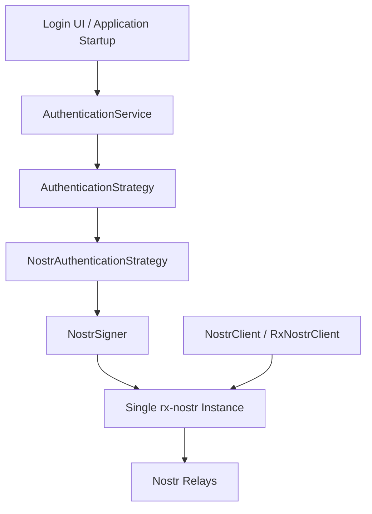
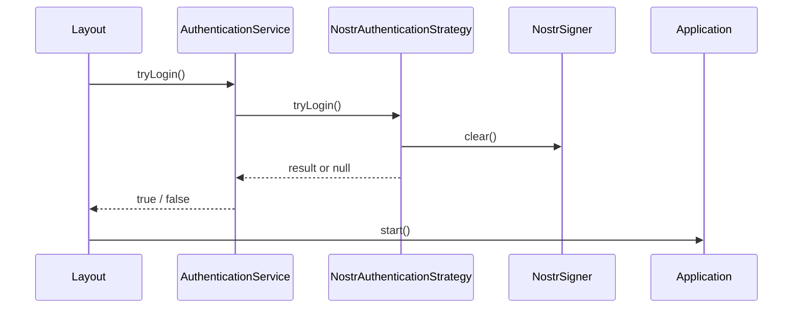
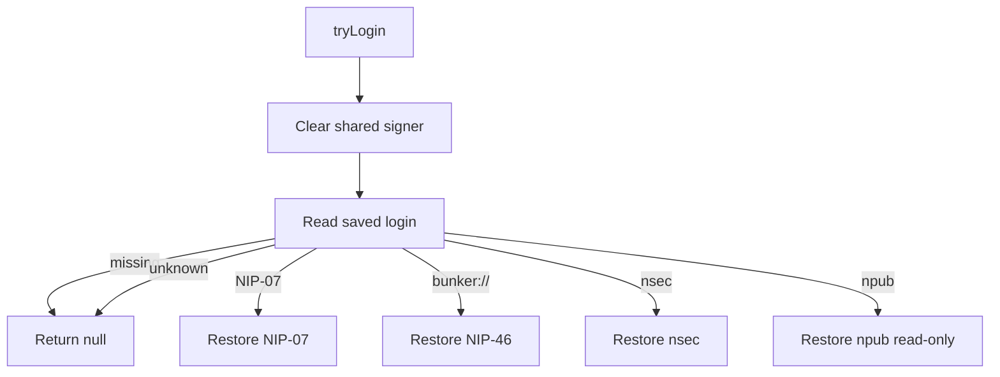
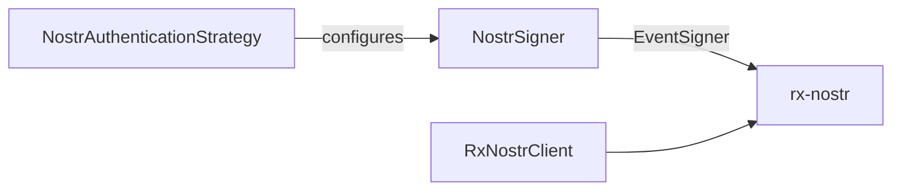

# KJVOnly.bible Authentication Implementation Specification

**Date:** 2026-09-14  
**Status:** Implemented for the current refactor phase  
**Scope:** Application authentication state, Nostr authentication infrastructure, signer ownership, startup restoration, Login UI integration, and account/profile startup integration.

---

# 1. Purpose

This document describes the authentication architecture implemented in the KJVOnly.bible PWA after removal of the legacy `src/lib/nostr` subsystem.

The implementation separates application authentication concepts from Nostr protocol mechanics.

The application knows:

```text
signed out
authenticated user
read-only user
current user id
authentication state changes
```

The Nostr infrastructure knows:

```text
nsec
npub
NIP-07
NIP-46
Nostr public keys
Nostr signing
saved Nostr login values
relay AUTH signing
```

The central design goal is that application code does not own raw Nostr signing state and does not duplicate signer/authentication state.

A single `NostrSigner` instance is created by `Application` and is shared with the Nostr authentication implementation and the single Nostr client.

---

# 2. High-Level Architecture



The important ownership rules are:

```text
AuthenticationService
    = application authentication state and policy

AuthenticationStrategy
    = application-facing authentication contract

NostrAuthenticationStrategy
    = Nostr-specific login restoration and credential interpretation

NostrSigner
    = active signing identity

NostrClient
    = Nostr reads, subscriptions, publication, and relay transport

Application
    = composition root and owner of the singleton instances
```

---

# 3. Application Composition

Authentication is composed in:

```text
client/kjvonly-pwa/src/lib/application/runtime/application.ts
```

The relevant composition is conceptually:

```ts
const nostrSigner =
    new NostrSigner();

const nostrAuthenticationStrategy =
    new NostrAuthenticationStrategy(
        localStorage,
        nostrSigner,
        {
            onNip46Auth: (url) => {
                window.open(url, '_blank');
            }
        }
    );

const authenticationService =
    new AuthenticationService(
        nostrAuthenticationStrategy
    );

const nostrClient =
    createBrowserNostrClient(
        nostrSigner
    );
```

`Application` retains `NostrSigner` privately.

It is deliberately **not exposed through `ApplicationContext`**.

This prevents UI/application code from bypassing `AuthenticationService` and manipulating the signer directly.

---

# 4. Application Authentication Contract

The application contract lives under:

```text
src/lib/application/services/authentication/
```

The key files are:

```text
authentication-state.ts
authentication-strategy.ts
../authentication.service.ts
```

## 4.1 AuthenticationState

The application represents only generic authentication concepts:

```ts
type AuthenticationState =
    | {
        status: 'signed-out';
    }
    | {
        status:
            'authenticated' |
            'read-only';
        userId: string;
    };
```

There are no Nostr-specific mode values such as:

```text
nsec
npub
nip07
nip46
```

in application state.

The application therefore does not need to know how the identity was established.

## 4.2 AuthenticationResult

Authentication strategies return:

```ts
interface AuthenticationResult {
    status:
        'authenticated' |
        'read-only';

    userId: string;
}
```

For the current Nostr implementation, `userId` is the Nostr hex public key.

The rest of the application consumes it only as the current user identity.

This allows Resource-selection code to use the same value as a Resource publisher without depending on Nostr-specific authentication APIs.

## 4.3 AuthenticationStrategy

The application-facing strategy contract is:

```ts
interface AuthenticationStrategy {
    tryLogin():
        Promise<AuthenticationResult | null>;

    login(
        credentials: string
    ): Promise<AuthenticationResult>;
}
```

`AuthenticationService` depends on this interface rather than `NostrAuthenticationStrategy` directly.

This is the application boundary that permits another authentication implementation to replace Nostr authentication without rewriting application consumers.

---

# 5. AuthenticationService

`AuthenticationService` is the authoritative application authentication state owner.

File:

```text
src/lib/application/services/authentication.service.ts
```

It owns:

```text
current AuthenticationState
current user id
signed-out failure reason
state subscribers
login orchestration
saved-login restoration orchestration
```

It does **not** own:

```text
Nostr keys
Nostr login modes
NIP-07 objects
NIP-46 objects
Nostr relay state
profile metadata
follow lists
relay lists
Resource transport
```

## 5.1 State access

The service exposes:

```text
getState()
getUserId()
tryGetUserId()
subscribe()
```

`getUserId()` throws while signed out.

`tryGetUserId()` converts that into `undefined`, which is useful for optional current-user behavior such as default Resource selection.

## 5.2 Reactivity

`AuthenticationService` owns a subscriber set.

A subscriber immediately receives the current state when subscribing and is then notified on subsequent state changes.

This replaces the old global `Author`/pubkey stores.

The resulting state ownership is:

```text
Application
    owns AuthenticationService instance
        ↓
AuthenticationService
    owns authentication state
        ↓
UI / module contributors subscribe or query
```

There is no exported global authentication store.

---

# 6. Startup Authentication Flow

Authentication restoration is triggered from:

```text
src/routes/+layout.svelte
```

The startup sequence is:



The important ordering is:

```text
attempt saved-login restoration
    ↓
configure signer when possible
    ↓
Application.start()
    ↓
configure Nostr relay defaults
    ↓
load account cache
    ↓
wake Outbox
```

This ordering ensures that durable Outbox publications are not attempted until authentication restoration and relay configuration have had a chance to establish the active Nostr identity.

A missing or failed saved login does not prevent application startup.

`AuthenticationService.tryLogin()` returns `false` and moves to `signed-out` state.

---

# 7. NostrAuthenticationStrategy

The Nostr implementation lives at:

```text
src/lib/infrastructure/nostr/authentication/nostr-authentication-strategy.ts
```

It implements `AuthenticationStrategy`.

This class owns the Nostr-specific interpretation of saved credentials and configures the shared `NostrSigner`.

The strategy recognizes four saved-login representations:

```text
nsec1...
NIP-07
bunker://...
npub1...
```

---

# 8. Saved Authentication Storage

Authentication/session configuration uses `localStorage`.

Raw Nostr account events do not use localStorage; those live in the `nostr_events` IndexedDB store described in the Outbox/publication implementation.

## 8.1 Saved login key

The current login key is:

```text
${VITE_APP_NAME}:login
```

Constant:

```ts
NOSTR_LOGIN_STORAGE_KEY
```

## 8.2 NIP-46 client secret key

NIP-46 additionally persists the reusable client secret key under:

```text
${VITE_APP_NAME}:login:bunker:client-seckey
```

Constant:

```ts
NOSTR_NIP46_CLIENT_SECRET_STORAGE_KEY
```

The value is stored as hex.

This allows a NIP-46 connection to reuse the same client identity rather than generating a new client secret on every startup.

---

# 9. `tryLogin()` Behavior

`tryLogin()` is the saved-login restoration path.

The Nostr strategy first reads:

```text
${VITE_APP_NAME}:login
```

It then clears the shared signer before interpreting the saved value.

This is deliberate.

A signer left configured from a previous identity must never survive a failed restoration or a transition to a read-only identity.

The control flow is:



`AuthenticationService` converts the result into application state.

---

# 10. nsec Authentication

A fresh migrated Login UI currently supports nsec credentials.

The flow is:

```text
nsecLogin.svelte
    ↓
AuthenticationService.login(nsec)
    ↓
AuthenticationStrategy.login(credentials)
    ↓
NostrAuthenticationStrategy.login(credentials)
    ↓
nip19.decode()
    ↓
NostrSigner.useNsec()
    ↓
NostrSigner.getPublicKey()
    ↓
persist nsec as saved login
    ↓
AuthenticationService state = authenticated
```

The strategy rejects any credential passed to `login()` that does not decode as `nsec`.

The secret key is owned by `NostrSigner` after login.

`NostrSigner.useSecretKey()` clones the byte array before storing it so external code cannot mutate the active signing key after configuration.

---

# 11. NIP-07 Restoration

Saved value:

```text
NIP-07
```

The strategy dynamically imports:

```text
nip07-awaiter
```

and waits up to:

```text
10,000 ms
```

for a browser NIP-07 provider.

If no provider appears within the wait period:

```text
tryLogin() → null
AuthenticationService → signed-out
application startup continues
```

If a provider is available:

```text
NostrAuthenticationStrategy
    ↓
NostrSigner.useNip07(provider)
    ↓
provider.getPublicKey()
    ↓
authenticated userId
```

The current migrated Login UI does **not** initiate a new NIP-07 login.

This phase retains NIP-07 restoration infrastructure for a saved `NIP-07` login value.

---

# 12. NIP-46 Restoration

Saved value:

```text
bunker://...
```

The strategy:

```text
loads or creates the NIP-46 client secret
    ↓
NostrSigner.connectNip46()
    ↓
parse bunker URL
    ↓
create BunkerSigner
    ↓
connect
    ↓
resolve remote public key
    ↓
replace active signer state
```

If the remote signer provides an authorization URL, `Application` supplies an `onNip46Auth` callback that opens the URL in a new browser tab/window.

The `NostrSigner` owns the live `BunkerSigner` and closes the previous signer when switching identities or clearing state.

The current migrated Login UI does **not** initiate a new NIP-46 login.

This phase retains NIP-46 saved-login restoration.

---

# 13. npub Read-Only Restoration

Saved value:

```text
npub1...
```

The strategy decodes the npub and returns:

```ts
{
    status: 'read-only',
    userId: <hex pubkey>
}
```

No `NostrSigner` state is established.

This distinction is important:

```text
known/read-only identity
    ≠
authenticated signing identity
```

Because `tryLogin()` clears the signer before saved-login interpretation, a read-only npub cannot accidentally inherit signing capability from a previously configured account.

The current migrated Login UI does **not** initiate a new npub read-only login.

---

# 14. NostrSigner

File:

```text
src/lib/infrastructure/nostr/nostr-signer.ts
```

`NostrSigner` is the sole retained signing abstraction.

It implements rx-nostr's `EventSigner` contract.

Supported signer modes are:

```text
nip07
nsec
nip46
```

It owns exactly one active mode at a time.

## 14.1 Responsibilities

`NostrSigner` is responsible for:

```text
configuring the active signing identity
returning the current public key
signing event parameters
switching signing implementations
closing/disconnecting replaced signer state
clearing signer state at application shutdown
```

## 14.2 Sign event behavior

`signEvent()` fills:

```text
tags = [] when omitted
created_at = current clock value when omitted
```

and delegates by mode:

```text
nsec
    → nostr-tools finalizeEvent

NIP-07
    → browser provider signEvent

NIP-46
    → BunkerSigner.signEvent
```

---

# 15. Relationship Between Authentication and NostrClient

The same `NostrSigner` instance is passed to:

```text
NostrAuthenticationStrategy
NostrClient / rx-nostr
```

This is a critical invariant.



The result is that:

```text
AuthenticationService current user
    ==
NostrSigner current public key
    ==
identity used for relay AUTH
    ==
identity used for publication signing
```

for signer-capable accounts.

This eliminates the old split-brain state where UI identity and Resource signing could represent different users.

---

# 16. NIP-42 Relay Authentication

`createNostrClient()` constructs the single rx-nostr instance with:

```ts
createRxNostr({
    verifier,
    signer,
    authenticator: 'auto',
    ...
});
```

The same `NostrSigner` therefore participates in automatic relay authentication handled by rx-nostr.

Authentication code does not manually construct NIP-42 AUTH events.

This is infrastructure behavior owned by rx-nostr and the shared signer.

---

# 17. Publication Signing

Application/domain publication code does **not** call `NostrSigner.signEvent()` directly.

Publication follows:

```text
publication intent
    ↓
Outbox
    ↓
Nostr publication strategy
    ↓
NostrClient.publishEvent(EventParameters)
    ↓
rxNostr.send()
    ↓
shared NostrSigner exactly once
    ↓
relay
```

This single-signing design is important for NIP-07 and NIP-46 because external/remote signers should not receive duplicate signing requests for one application publication.

---

# 18. Account Loading After Authentication

Authentication establishes identity.

Profile/account state is a separate responsibility.

During `Application.startInternal()`:

```text
AuthenticationService.tryGetUserId()
    ↓
if user exists
    ↓
AccountService.load(userId)
    ↓
load cached account state
    ↓
AccountService.refresh(userId) asynchronously
```

Authentication does not own:

```text
profile metadata
contact/follow events
relay-list events
account event persistence
```

Those responsibilities belong to the account/Nostr event infrastructure.

This keeps authentication and profile/account management separate even though both use the same Nostr identity.

---

# 19. Fresh NSEC Login and Account Setup

The current Login module is under:

```text
src/lib/application/modules/login/
```

The NSEC form performs:

```text
AuthenticationService.login(nsec)
    ↓
AccountService.setup(userId, name)
    ↓
switch current pane to PROFILE
```

`AccountService.setup()` is separate from authentication.

This is intentional because publishing profile metadata, account relay lists, and contacts is account setup—not proof of identity.

---

# 20. Resource Selection Dependency

Bible Text Markup, Notes, and Reading Plans use authentication as the current-user identity provider.

They consume:

```text
AuthenticationService.tryGetUserId()
```

rather than reading localStorage or a Nostr signer.

This means writable Resource defaults derive their publisher from application authentication state rather than transport state.

Existing Domain Objects retain their original publisher identity when the active account changes.

---

# 21. Application Shutdown

`Application.stop()` performs the relevant Nostr shutdown sequence:

```text
stop Resource worker
    ↓
dispose NostrClient / rx-nostr
    ↓
NostrSigner.clear()
```

`NostrSigner` is private to `Application`, so shutdown does not require exposing the signer through `ApplicationContext`.

For NIP-46, clearing signer state closes the bunker signer connection.

---

# 22. Error Behavior

## 22.1 Saved-login restoration failure

`AuthenticationService.tryLogin()` catches strategy exceptions.

Result:

```text
state = signed-out
reason = "Saved login could not be restored."
return false
```

Application startup continues.

## 22.2 No saved login

Result:

```text
state = signed-out
reason = "No saved login is available."
return false
```

## 22.3 Invalid fresh credential

`NostrAuthenticationStrategy.login()` rejects a credential that does not decode as nsec.

The caller receives the error.

## 22.4 Signer absent

`NostrSigner.getPublicKey()` and `signEvent()` throw when no signer-capable identity is configured.

This prevents read-only identities from silently publishing.

---

# 23. Current UI Support vs Infrastructure Support

The implementation intentionally distinguishes current UI capability from retained infrastructure capability.

| Authentication form | Saved-login restoration | Fresh migrated UI initiation | Signing capable |
| --- | --- | --- | --- |
| nsec | Yes | Yes | Yes |
| NIP-07 | Yes | No current UI | Yes |
| NIP-46 | Yes | No current UI | Yes |
| npub | Yes | No current UI | No, read-only |

This phase did not implement new UI for NIP-07, NIP-46, or npub login.

The infrastructure paths remain available for restoration and future UI work.

---

# 24. Current Non-Goals / Known Product Gaps

The following are not implemented by this refactor phase:

```text
logout UI/API
account switching UI
fresh NIP-07 login UI
fresh NIP-46 login UI
fresh npub read-only login UI
Create Account implementation in loginOptions.svelte
```

These are product/UI additions rather than unresolved legacy-Nostr migration dependencies.

The legacy Nostr authentication architecture has been removed without requiring those features to be designed now.

---

# 25. Removed Legacy Architecture

The refactor removed the old `src/lib/nostr` tree.

The retained implementation no longer depends on:

```text
global Author authentication state
global pubkey store
legacy Signer
legacy Login class
MainTimeline singleton/rx-nostr instance
legacy WebStorage wrapper
legacy event-specific authentication API
legacy bearer-token auth.service.ts
```

The obsolete legacy-only dependencies were also removed, including:

```text
@rust-nostr/nostr-sdk
rx-nostr-crypto
dexie
escape-string-regexp
svelte-persisted-store
twitter-text
@types/twitter-text
```

`nip07-awaiter` remains because the NIP-07 restoration path uses it.

---

# 26. Important Source Files

## Application authentication

```text
src/lib/application/services/authentication.service.ts
src/lib/application/services/authentication/authentication-state.ts
src/lib/application/services/authentication/authentication-strategy.ts
```

## Nostr authentication/signing

```text
src/lib/infrastructure/nostr/authentication/nostr-authentication-strategy.ts
src/lib/infrastructure/nostr/nostr-signer.ts
```

## Nostr transport

```text
src/lib/infrastructure/nostr/client/nostr-client.ts
src/lib/infrastructure/nostr/client/rx-nostr-client.ts
src/lib/infrastructure/nostr/client/create-nostr-client.ts
```

## Composition/startup

```text
src/lib/application/runtime/application.ts
src/lib/application/runtime/application-context.ts
src/routes/+layout.svelte
```

## Login UI

```text
src/lib/application/modules/login/
```

## Account boundary

```text
src/lib/application/services/account/
src/lib/infrastructure/nostr/account/
```

---

# 27. Architectural Invariants

The authentication implementation should preserve these invariants:

1. `AuthenticationService` is the authoritative application authentication state.
2. Application authentication types do not expose Nostr login modes.
3. Only Nostr infrastructure interprets nsec, npub, NIP-07, and NIP-46.
4. `Application` owns exactly one `NostrSigner` instance.
5. The signer is not exposed directly to UI/application modules.
6. The same signer is supplied to authentication infrastructure and the single rx-nostr instance.
7. Read-only identities do not retain signing state.
8. Resource-selection code obtains current identity through `AuthenticationService`.
9. Account/profile state remains separate from authentication state.
10. Application publication signing occurs once through rx-nostr and the shared signer.

---

# 28. Final Mental Model

```text
Login UI / Application Startup
            ↓
    AuthenticationService
            ↓
    AuthenticationStrategy
            ↓
 NostrAuthenticationStrategy
            ↓
        NostrSigner
            ↓
      single rx-nostr
            ↓
        Nostr Relays
```

The application owns **who the current user is**.

Nostr infrastructure owns **how that identity is established and how it signs**.

The transport owns **how signed/verified Nostr communication reaches relays**.

That separation is the defining result of the authentication refactor.
