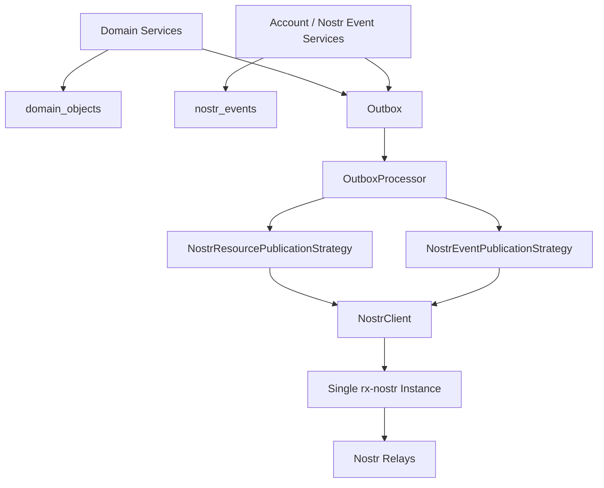
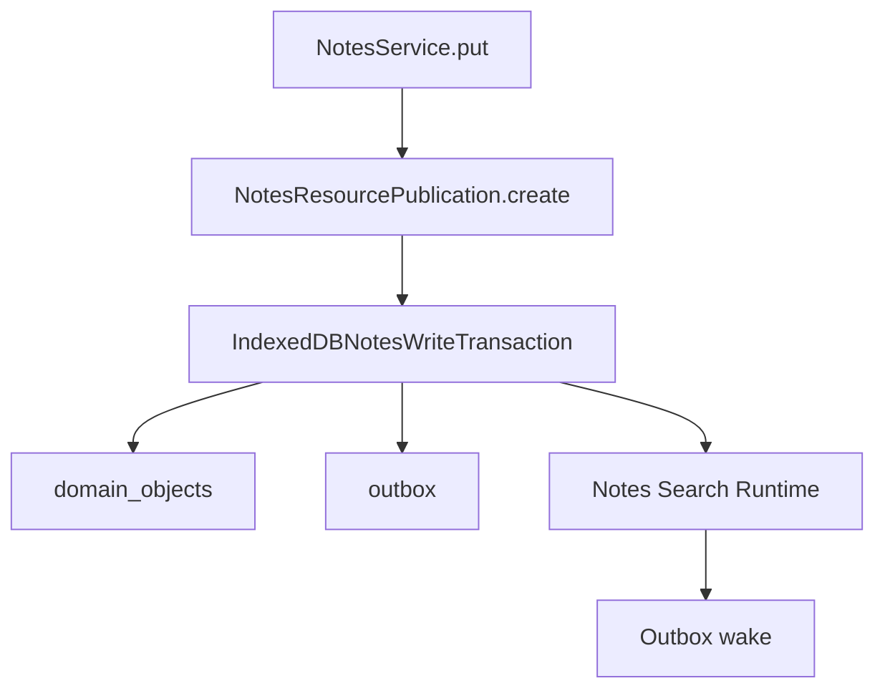
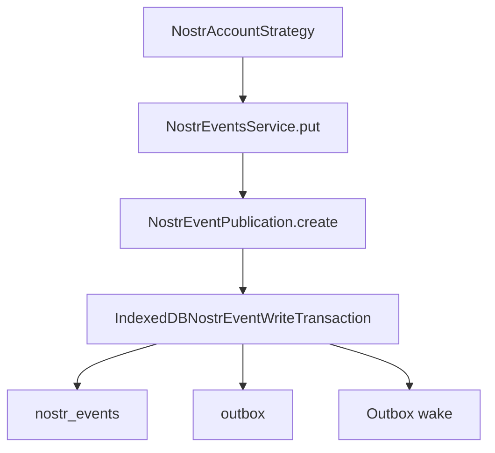

# KJVOnly.bible Outbox and Nostr Publication Implementation Specification

**Date:** 2026-09-14  
**Status:** Implemented for the current refactor phase  
**Scope:** Generalized application Outbox, publication strategies, Resource publication, native Nostr event publication, single Nostr client/signing path, `nostr_events` persistence, account event caching/refresh, and associated IndexedDB changes.

---

# 1. Purpose

This document describes the redesigned publication architecture in the KJVOnly.bible PWA.

The Outbox began as a Resource-specific publication queue used by writable application domains such as Notes, Bible Text Markup, and Reading Plans.

It has been generalized into the durable publication boundary for **all application-owned outbound data**.

The central rule is:

> If the application intentionally publishes durable user/application data, the write goes through the Outbox.

This includes:

```text
Resource publications
Resource deletions
profile metadata
contact/follow lists
account relay lists
future durable application-owned Nostr events
```

It does **not** include protocol traffic owned by Nostr infrastructure, such as:

```text
relay subscription requests
NIP-42 AUTH protocol handling
NIP-46 signer communication
relay connection management
```

---

# 2. Architectural Goals

The redesign establishes the following principles:

1. Local state is committed before network publication is required.
2. Local state and its pending publication are atomic where appropriate.
3. Outbound application data survives temporary relay/network failure.
4. Resource publication and native Nostr event publication share one durable Outbox.
5. Outbox processing follows the Open/Closed Principle through publication strategies.
6. One `NostrClient` owns the single rx-nostr instance.
7. Publication is signed exactly once through rx-nostr and the shared `NostrSigner`.
8. Resource semantics remain Resource-specific.
9. Native Nostr account events remain Nostr-specific and are not forced into the Resource model.
10. Raw selected Nostr events are persisted in `nostr_events`, not localStorage.

---

# 3. High-Level Architecture



The write-side model is intentionally symmetrical:

```text
Resource-backed application data
    local Domain Object + Resource publication intent

Native Nostr application data
    local Nostr event state + Nostr event publication intent
```

Both converge at the same Outbox.

---

# 4. Persistence Categories

The application database now deliberately separates four persistence concerns.

## 4.1 `domain_objects`

Stores installed or locally-authored application Domain Objects.

Examples:

```text
Notes
Bible Text Markup
Plan Subscriptions
Plan Progress
other Resource-derived domain state
```

## 4.2 `nostr_events`

Stores selected raw Nostr event state used by application features that are not modeled as Resources.

Initial account event kinds are:

```text
0      profile metadata
3      contacts/follows
10002  relay list
```

Locally authored events may be stored before signing.

Fetched events enter this store as signed/verified Nostr events after the Nostr client read pipeline has accepted them.

## 4.3 `outbox`

Stores durable pending application publications.

It is no longer a Resource-only queue.

## 4.4 Resource lifecycle stores

Resource installation/receipt state remains separate:

```text
resource_installations
resource_receipts
```

---

# 5. IndexedDB Schema

Database:

```text
kjvonly-application
```

Current schema version:

```text
3
```

Relevant object stores are:

```text
domain_objects
resource_installations
resource_receipts
outbox
nostr_events
```

## 5.1 `outbox`

Key path:

```text
id
```

Index:

```text
status
```

## 5.2 `nostr_events`

Key path:

```text
key
```

Indexes:

```text
kind
pubkey
[kind, pubkey]
```

The compound index supports efficient retrieval of the current cached replaceable event for one user and one kind.

---

# 6. Generalized Outbox Publication Intent

The common base contract is:

```ts
interface OutboxPublicationIntent {
    type: string;
    [key: string]: unknown;
}
```

The intent owns its runtime type.

Outbox infrastructure does not know the domain-specific fields carried by the intent.

Current intent types are:

```text
resource
nostr-event
```

No extra wrapper such as:

```text
{ type, intent }
```

is used.

The publication intent itself carries `type`.

---

# 7. OutboxEntry

An Outbox entry contains:

```ts
interface OutboxEntry {
    id: string;
    publication: OutboxPublicationIntent;
    status: OutboxStatus;
    attempts: number;
}
```

Current statuses are defined as:

```text
pending
publishing
published
failed
```

The current processor uses durable `pending` entries and deletes the current entry after successful publication.

`createPendingPublication(id, publication)` produces:

```text
status = pending
attempts = 0
```

---

# 8. Stable Outbox Identity and Last-Write-Wins

The Outbox key represents the logical publication target, not a generated network event ID.

This allows repeated local updates to overwrite a still-pending publication.

Examples include:

```text
Domain Object id for Notes / Plans / Text Markup
nostr/event:0:<pubkey>
nostr/event:3:<pubkey>
nostr/event:10002:<pubkey>
```

The Outbox therefore implements last-write-wins behavior for replaceable application state.

If a user changes profile metadata several times before successful relay publication, only the current pending entry for that logical event needs to survive.

---

# 9. `deleteIfCurrent()` Race Protection

A publication may be replaced while an older version is in flight.

The processor must not delete the newer pending entry when the older publication finishes.

`IndexedDBOutboxStore.deleteIfCurrent(entry)` performs a read/write transaction and deletes only when:

```text
stored entry still exists
stored status is pending
stored publication intent equals the processed intent
```

Intent equality is currently structural JSON equality.

This preserves last-write-wins behavior across concurrent publication/replacement.

---

# 10. OutboxPublicationStrategy

Outbox publication is strategy-based.

Contract:

```ts
interface OutboxPublicationStrategy {
    type: string;

    publish(
        publication:
            OutboxPublicationIntent
    ): Promise<void>;
}
```

Current implementations are:

```text
NostrResourcePublicationStrategy
NostrEventPublicationStrategy
```

The strategy name is explicit because this is intentionally a Strategy pattern.

---

# 11. Strategy Registration

`Application` registers publication strategies in the composition root:

```text
OutboxProcessor(
    outboxStore,
    [
        resourcePublicationStrategy,
        nostrEventPublicationStrategy
    ]
)
```

The processor builds a map keyed by `strategy.type`.

Duplicate strategy types fail during construction.

Adding another publication type therefore requires:

```text
new publication intent
new publication strategy
registration in Application
```

It does not require adding a `switch` to `OutboxProcessor`.

---

# 12. OutboxProcessor

`OutboxProcessor` implements `OutboxWakeup`.

Its key responsibilities are:

```text
receive wake requests
load pending entries
resolve the publication strategy by intent.type
publish the intent
remove it only if the processed entry is still current
retain failed entries for a later retry
```

## 12.1 Wake behavior

`wake()` is non-blocking.

If processing is already active, it records another wake request rather than launching another processor concurrently.

The internal wake loop continues until no wake request remains.

This prevents concurrent drain loops while still ensuring writes that arrive during processing receive another pass.

## 12.2 Failure behavior

Publication errors are intentionally swallowed at the processor boundary.

The pending entry remains durable.

A later wake can retry it.

The current Outbox is therefore retry-oriented without requiring the originating application service to wait for relay success.

---

# 13. Application Startup and Outbox

During startup:

```text
restore Resource selections
    ↓
configure default Nostr relays
    ↓
load cached account state
    ↓
start asynchronous account refresh
    ↓
wake Outbox
```

The comment in `Application.startInternal()` is important:

```text
Pending application publications are durable.
Startup only needs to wake the Outbox after
signing and relay configuration are ready.
```

The Outbox can therefore resume previously pending publication after application restart.

---

# 14. Resource Write Flow

Writable Resource-backed domains retain the established local-write pattern.

For example, Notes:



More precisely:

```text
NotesService.put(note)
    ↓
create ResourcePublication
    ↓
ONE IndexedDB transaction
    ├── write Note Domain Object
    └── write pending Resource publication
    ↓
update local runtime
    ↓
outbox.wake()
```

The same pattern is used by:

```text
Bible Text Markup
Notes
Plan Subscriptions
Plan Progress
```

---

# 15. Atomicity of Resource Writes

The write transaction spans:

```text
domain_objects
outbox
```

This means the application should not end up with:

```text
local Domain Object committed
but no publication intent
```

or:

```text
publication intent committed
but local Domain Object missing
```

when the operation fails part-way through the transaction.

The local object and outbound intent are one application write.

---

# 16. ResourcePublicationIntent

Resource publication intents implement the generalized Outbox base contract.

Current Resource intent variants are:

```text
ResourcePublication
ResourceDeletionPublication
```

Both carry:

```text
type = resource
publisher
resourceType
resourceId
```

A normal publication additionally carries:

```text
representation
mediaType
value
```

A deletion carries:

```text
operation = delete
```

The Resource Domain owns creation of these intents.

Local deletion does not automatically imply remote deletion; the Domain deliberately creates a deletion publication intent.

---

# 17. NostrResourcePublicationStrategy

`NostrResourcePublicationStrategy` owns the mapping from Resource publication intent to Nostr event parameters.

It is responsible for:

```text
asserting active signer identity == Resource publisher
encoding Resource content
mapping Resource metadata to Nostr tags
mapping Resource deletion to NIP-09-style deletion event parameters
publishing through NostrClient
requiring acceptance by at least one relay
```

## 17.1 Resource publication

Resource kind:

```text
37770
```

Tags include:

```text
d               resourceId
m               mediaType
t               resourceType
representation  Resource representation
```

Content is produced by `ResourceContentEncoder`.

## 17.2 Resource deletion

Deletion kind:

```text
5
```

The deletion references the replaceable Resource address using `a` and `k` tags.

---

# 18. General Nostr Event Write Flow

Native Nostr application data follows the same pattern as other services.

The important intent is that a developer looking at the code sees a familiar lifecycle rather than a special direct-Nostr side path.



The flow is:

```text
service/strategy creates local event state
    ↓
NostrEventsService.put()
    ↓
create NostrEventPublicationIntent
    ↓
ONE IndexedDB transaction
    ├── nostr_events
    └── outbox
    ↓
outbox.wake()
```

This deliberately mirrors the Notes/Plans/Text Markup write pattern.

---

# 19. NostrEvent Local Model

Locally stored Nostr event state is represented as:

```ts
interface NostrEvent {
    key: string;
    pubkey: string;
    kind: number;
    content: string;
    tags: readonly string[][];
    created_at?: number;
    id?: string;
    sig?: string;
}
```

A locally authored event may legitimately have no:

```text
created_at
id
sig
```

before publication.

This is trusted local application state because the application itself authored it.

The application does **not** accept arbitrary unsigned fetched relay data into this store.

---

# 20. Stable Nostr Event Key

Current replaceable event key format:

```text
nostr/event:<kind>:<pubkey>
```

Created by:

```ts
createReplaceableNostrEventKey(
    kind,
    pubkey
)
```

Examples:

```text
nostr/event:0:<pubkey>
nostr/event:3:<pubkey>
nostr/event:10002:<pubkey>
```

The local key is deliberately separate from the final signed Nostr event ID.

This permits local replaceable state to be written durably before signing.

---

# 21. NostrEventPublicationIntent

`NostrEventPublication.create(event)` converts local Nostr event state into an Outbox publication intent:

```ts
{
    type: 'nostr-event',
    publisher: event.pubkey,
    event: {
        kind,
        content,
        tags
    }
}
```

The queued intent remains unsigned.

It does not persist a relay override.

The eventual publication uses the Nostr client's current default write relay configuration.

---

# 22. NostrEventPublicationStrategy

The Nostr event strategy handles `type: 'nostr-event'` intents.

It:

```text
reads active Nostr public key from NostrClient
    ↓
asserts publisher identity matches
    ↓
passes unsigned EventParameters to NostrClient.publishEvent()
    ↓
requires acceptance by at least one relay
```

It does not call `NostrSigner` directly.

---

# 23. Single Nostr Client

The old Resource-specific client was generalized to:

```text
NostrClient
RxNostrClient
createNostrClient
createBrowserNostrClient
```

Files live under:

```text
src/lib/infrastructure/nostr/client/
```

The client supports:

```text
setDefaultRelays
authenticated getPublicKey
getEvent
getEvents
subscribe
publishEvent
dispose
```

It owns communication through one rx-nostr instance.

---

# 24. One rx-nostr Instance

`createNostrClient()` is the retained production construction boundary for rx-nostr.

It creates one instance configured with:

```text
verification client verifier
shared Nostr signer
automatic relay authentication
lazy-keep connections
read/write/auth timeouts
retry policy
```

Resource discovery, Resource publication, Resource resolution, account reads, and account publications all share this client.

Strategies do not construct their own rx-nostr instances.

---

# 25. Single Publication Signing Path

The publication refactor removed pre-signing from Resource and account publication strategies.

`NostrClient.publishEvent()` accepts unsigned `EventParameters`.

`RxNostrClient` delegates publication to:

```text
rxNostr.send(event)
```

rx-nostr uses the configured shared `NostrSigner` to sign the event.

Therefore the path is:

```text
Outbox publication intent
    ↓
publication strategy
    ↓
unsigned EventParameters
    ↓
NostrClient.publishEvent()
    ↓
rxNostr.send()
    ↓
NostrSigner
    ↓
signed event
    ↓
relay
```

There is no second direct `signEvent()` call in publication strategies.

This is particularly important for NIP-07 and NIP-46, where double signing could create duplicate browser/remote signer authorization requests.

---

# 26. NostrClient Relay Behavior

The client supports:

```text
default relay configuration
per-operation read relay overrides
per-operation write relay overrides
```

`Application.startInternal()` currently sets default relays from:

```text
ApplicationConfig.resourceRelays
```

`ApplicationConfig` also contains a separate:

```text
accountBootstrapRelays
```

Although both currently parse from the same environment variable, they are separate configuration concepts.

Account bootstrap relays are used for account reads/refreshes.

Queued Outbox writes intentionally carry no relay override and therefore use the current default write relay configuration at publication time.

---

# 27. Why Relay Overrides Are Not Stored in Outbox

Publication intent describes **what** should be published.

Transient relay routing policy remains transport/application configuration.

This means:

```text
publication can wait in Outbox
    ↓
relay configuration may change
    ↓
publication uses current default write relays when processed
```

This keeps durable intent independent of relay topology.

Descriptor-specific Resource reads may still use explicit relay overrides because Resource resolution can legitimately specify where a Resource should be found.

---

# 28. Native Nostr Account Events

The current account implementation uses native Nostr events for:

```text
kind 0      profile metadata
kind 3      contacts/follows
kind 10002  relay preferences
```

These are intentionally **not Resources**.

They share Outbox infrastructure without being forced through `ResourcePublication`.

This preserves the architectural distinction:

```text
Resource data
    → Resource semantics + Outbox

native Nostr account data
    → Nostr event semantics + Outbox
```

---

# 29. Account Setup Write Flow

`NostrAccountStrategy.setup()` currently:

```text
asserts userId matches active Nostr identity
    ↓
reads existing kind 3 contact event
    ↓
creates local kind 0 metadata
    ↓
NostrEventsService.put()
    ↓
creates local kind 10002 relay list
    ↓
NostrEventsService.put()
    ↓
creates updated kind 3 contacts
    ↓
NostrEventsService.put()
```

Each `put()` performs the local `nostr_events + outbox` atomic write and wakes the Outbox.

The account strategy does not publish directly.

---

# 30. Account Relay Event Semantics

Kind `10002` relay tags use NIP-65-style semantics.

A tag such as:

```text
['r', 'ws://localhost:3334']
```

means both read and write.

Markers may specialize a relay as:

```text
read
write
```

The Nostr-specific relay representation stays below the generic `AccountService` boundary.

`NostrAccountRelayProvider` and `NostrAccountStrategy` own this Nostr-specific state.

---

# 31. AccountState Boundary

Generic application account state currently contains:

```ts
{
    name?: string
}
```

It does not expose:

```text
Nostr relay URLs
Nostr read/write flags
Nostr kinds
raw Nostr events
```

The Profile relay UI explicitly consumes the Nostr-specific `NostrAccountStrategy` relay API through `ApplicationContext` because that UI is specifically presenting Nostr relay configuration.

This prevents Nostr concepts from leaking into generic account state merely to support one Nostr-specific presentation.

---

# 32. Nostr Event Cache Read Flow

Account startup is cache-first.

`Application.startInternal()` obtains the authenticated/read-only user ID and invokes:

```text
AccountService.load(userId)
```

`NostrAccountStrategy.load()` reads from `nostr_events`:

```text
kind 0
kind 3
kind 10002
```

This allows account/profile state to be available offline from local persistence.

---

# 33. Account Relay Refresh Flow

After local account load, startup launches an asynchronous refresh:

```text
AccountService.refresh(userId)
```

The Nostr strategy queries account bootstrap read relays for kinds:

```text
0
3
10002
```

It selects the current event per kind and passes each signed event to:

```text
NostrEventsService.cache()
```

After caching, the strategy reloads account state from `nostr_events`.

This is important because relay responses may be partial and the local store may contain newer locally-authored state.

The local event store is the account-state source after merge.

---

# 34. Nostr Event Cache Replacement Policy

`NostrEventsService.cache()` handles the relationship between local unsigned state and fetched signed state.

## 34.1 Current event is locally authored and unsigned

The fetched signed event replaces it only when:

```text
content matches
and
tags match
```

This prevents an older/different relay event from overwriting a local change that is still pending publication.

## 34.2 Current event is signed

A fetched event replaces it when the incoming `created_at` is newer.

## 34.3 Missing current `created_at`

A signed incoming event may replace it.

This gives local pending application state precedence without preventing the successfully published/verified equivalent from eventually becoming the cached signed representation.

---

# 35. Verification Boundary for Fetched Events

The application does not write arbitrary fetched unsigned events into `nostr_events`.

Nostr reads go through the shared `NostrClient`, whose rx-nostr instance is configured with the browser verification client/verifier.

The cache path receives `Event` values from that verified client boundary.

Locally authored unsigned events are a separate trusted case because the application itself created them.

---

# 36. Resource Reads vs Native Nostr Reads

The generalized Nostr client is shared, but higher-level semantics remain separate.

```text
ResourceDiscovery / ResourceResolution
    ↓
NostrClient

NostrAccountStrategy
    ↓
NostrClient
```

The client handles Nostr communication.

The callers decide what the events mean.

This keeps:

```text
infrastructure/nostr/client
    = how to communicate using Nostr

resource/nostr
    = how Resources are represented using Nostr

infrastructure/nostr/account
    = how account behavior maps to native Nostr events
```

---

# 37. Publication Acceptance

Both current publication strategies require:

```text
acceptedByAnyRelay == true
```

If no configured relay accepts the event, the strategy throws.

`OutboxProcessor` catches the failure and leaves the entry pending.

A later wake retries it.

This means application services do not need to synchronously recover from relay rejection in their local write path.

---

# 38. Outbox and Offline-First Behavior

The core offline-first guarantee is:

```text
network availability is not required for local write durability
```

For Resource-backed state:

```text
Domain Object + publication intent are committed locally
```

For native Nostr account state:

```text
Nostr event state + publication intent are committed locally
```

Relay publication is deferred to the Outbox.

This produces a consistent application mental model:

```text
service accepts local write
    ↓
local persistence is authoritative immediately
    ↓
network synchronization/publication follows
```

---

# 39. Important Source Files

## General Outbox

```text
src/lib/application/outbox/outbox-publication-intent.ts
src/lib/application/outbox/outbox-publication-strategy.ts
src/lib/application/outbox/outbox-entry.ts
src/lib/application/outbox/outbox-store.ts
src/lib/application/outbox/indexeddb-outbox-store.ts
src/lib/application/outbox/outbox-processor.ts
src/lib/application/outbox/outbox-wakeup.ts
```

## Resource publication

```text
src/lib/resource/publication/resource-publication.ts
src/lib/resource/nostr/nostr-resource-publication-strategy.ts
```

## Nostr event lifecycle

```text
src/lib/infrastructure/nostr/events/models/nostr-event.ts
src/lib/infrastructure/nostr/events/services/nostr-events.service.ts
src/lib/infrastructure/nostr/events/publication/nostr-event-publication.ts
src/lib/infrastructure/nostr/events/publication/nostr-event-publication-strategy.ts
src/lib/infrastructure/nostr/events/persistence/nostr-events-store.ts
src/lib/infrastructure/nostr/events/persistence/indexeddb-nostr-events-store.ts
src/lib/infrastructure/nostr/events/persistence/nostr-event-write-transaction.ts
```

## Nostr transport

```text
src/lib/infrastructure/nostr/client/nostr-client.ts
src/lib/infrastructure/nostr/client/rx-nostr-client.ts
src/lib/infrastructure/nostr/client/create-nostr-client.ts
```

## Account Nostr mapping

```text
src/lib/infrastructure/nostr/account/nostr-account-strategy.ts
src/lib/infrastructure/nostr/account/nostr-account-relay-provider.ts
```

## Persistence schema

```text
src/lib/infrastructure/persistence/application.db.ts
```

## Composition

```text
src/lib/application/runtime/application.ts
```

---

# 40. Extension Pattern

A new durable publication type should follow this model:

```text
1. Define an intent that extends OutboxPublicationIntent.
2. Give the intent a unique `type` value.
3. Create an OutboxPublicationStrategy for that type.
4. Register the strategy in Application.
5. Write local state and Outbox intent atomically where the local state is durable.
6. Wake the Outbox only after the local transaction commits.
```

No change should be required in `OutboxProcessor`.

This is the purpose of the publication strategy registry.

---

# 41. Architectural Invariants

The redesigned publication system should preserve these invariants:

1. Durable application writes publish through Outbox.
2. Protocol-only Nostr traffic does not need Outbox.
3. `OutboxProcessor` does not switch on domain publication types.
4. Every publication intent identifies its strategy through `type`.
5. Application composition registers publication strategies.
6. Local durable state and publication intent are atomic where they represent one application write.
7. A failed relay publication leaves the current Outbox entry pending.
8. Replacing a pending logical publication uses the same Outbox key.
9. Completion of an older in-flight publication must not delete a newer pending replacement.
10. Resource publication semantics stay in Resource code.
11. Native Nostr account semantics stay in Nostr infrastructure.
12. One Nostr client owns the single rx-nostr instance.
13. Publication strategies pass unsigned event parameters to the Nostr client.
14. rx-nostr and the shared signer produce one signature per publication.
15. `nostr_events` stores selected native Nostr state; it is not a cache of every event seen by the transport.
16. Locally authored unsigned Nostr state is allowed because the application authored it.
17. Fetched Nostr state enters the cache only through the verified Nostr read path.
18. Outbox intents do not currently persist relay overrides.

---

# 42. Final Mental Model

```text
                        APPLICATION WRITE
                              │
               ┌──────────────┴──────────────┐
               │                             │
        Resource Domain                 Native Nostr
               │                             │
       Domain Object                  Nostr Event State
               │                             │
               └──────────────┬──────────────┘
                              │
                      local transaction
                              │
                 local state + Outbox intent
                              │
                              ↓
                            Outbox
                              │
                       OutboxProcessor
                              │
                    strategy selected by type
                              │
               ┌──────────────┴──────────────┐
               │                             │
 NostrResourcePublicationStrategy   NostrEventPublicationStrategy
               │                             │
               └──────────────┬──────────────┘
                              ↓
                         NostrClient
                              ↓
                    single rx-nostr instance
                              ↓
                      shared NostrSigner
                              ↓
                            relay
```

The redesign makes publication a consistent application lifecycle rather than a collection of feature-specific relay calls.

A developer adding another writable feature should be able to recognize the same pattern immediately:

```text
service
    → local write
    → Outbox intent
    → wake
    → publication strategy
    → NostrClient
```

That consistency is the primary architectural outcome of the Outbox redesign.
