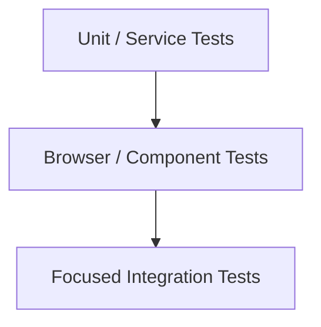
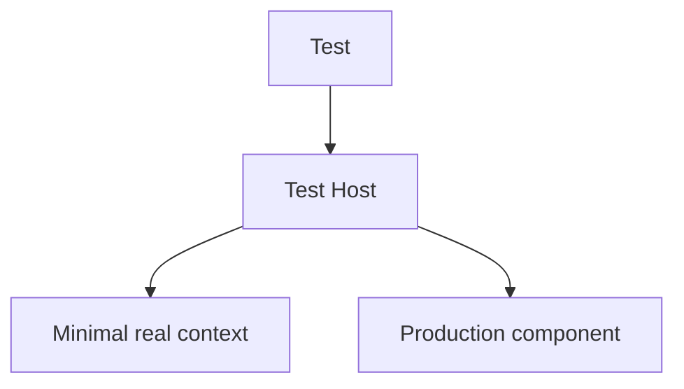
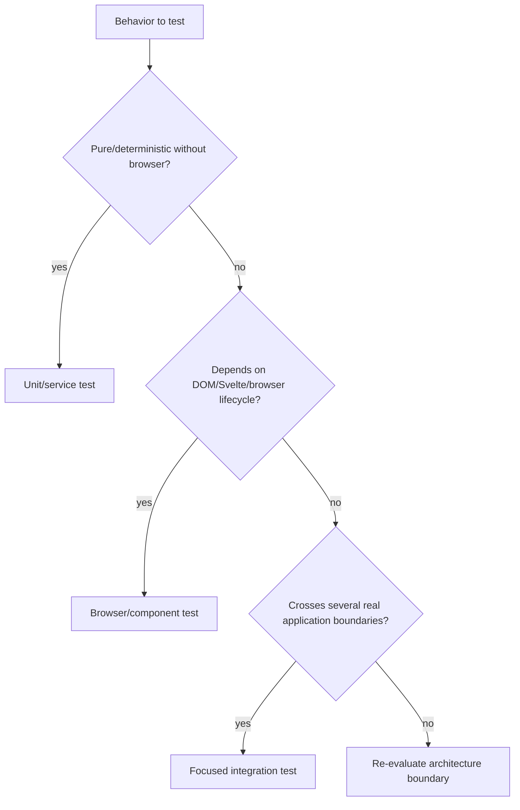

# Testing Strategy and Browser Harnesses

## Status

**Application Standard / Engineering Guidance**

Suggested repository path:

```text
docs/03_implementation/testing/001-testing-strategy-browser-harnesses.md
```

---

# 1. Purpose

This document defines the preferred testing strategy for KJVOnly.bible.

The goal is not:

```text
maximize test count
```

The goal is:

> **Protect important behavior and architecture boundaries at the cheapest test level that can faithfully exercise them.**

The Settings/navigation work demonstrated that some contracts belong in ordinary unit tests while others require a real browser/Svelte runtime.

A consistent testing strategy makes debugging faster and tests more reliable.

---

# 2. Testing Layers

Use three broad layers:



They are not a strict pyramid by count.

Choose the layer based on the behavior being tested.

---

# 3. Unit / Service Tests

Use normal Vitest/unit tests for deterministic logic that does not require a real browser lifecycle.

Good candidates:

```text
models
normalizers
parsers
resolvers
factories
services
definition validation
search indexing
search matching
navigation mapping
domain logic
resource-selection policy
Buffer factory behavior
pure transformations
```

These tests should be fast and precise.

---

# 4. Browser Tests

Use browser tests when the actual browser/Svelte runtime is part of the contract.

Examples:

```text
component mounting
component unmounting
Svelte context propagation
ownership warnings/behavior
DOM identity
focus
scrollIntoView
actual browser events
localStorage behavior across mounted components
IndexedDB
matchMedia
window/document APIs
persistent navigation
multiple mounted module instances
```

If a unit test would need to fake most of the environment, a browser test may be clearer and more trustworthy.

---

# 5. Focused Integration Tests

A focused integration test connects several real application boundaries without launching the whole application.

Example:

```text
real SettingsContainer
real SettingsService
minimal ApplicationContext
real NavigationContainer
browser DOM
```

This is often preferable to:

```text
full application bootstrap
```

because it gives strong confidence with fewer unrelated failure sources.

---

# 6. Regression-First Workflow

For a bug:

```text
1. identify failure boundary
2. check for existing test
3. add smallest regression test if missing
4. reproduce failure
5. implement fix
6. run focused test
7. run broader relevant suite
8. run build
```

When practical, establish the failing behavioral test before changing implementation.

If the user explicitly requests investigation only, stop before implementation.

---

# 7. Test Behavior, Not Implementation Trivia

Prefer:

```text
Back reveals the same mounted view
```

over:

```text
private array length changed exactly this way
```

Prefer:

```text
second Settings module updates
```

over:

```text
specific internal subscriber function was called twice
```

Internal implementation assertions are appropriate when the internal contract itself is the architecture being protected.

---

# 8. Contract-Oriented Test Names

Good:

```text
preserves the previous navigation view while a nested view is active

updates another mounted Settings module after a user change

preserves the root search state after navigating to a result and back

uses the originating Buffer selections when creating a related Module
```

Avoid vague names such as:

```text
works
test settings
renders component
```

The test name should state the contract.

---

# 9. Unit Test Decision Rule

Ask:

```text
Can this behavior be expressed entirely as inputs → outputs/state transition without relying on browser lifecycle?
```

If yes, prefer a unit/service test.

Examples:

```text
search query matching
definition resolver
normalization
ModuleBufferFactory.related()
SettingsNavigationService mapping
```

---

# 10. Browser Test Decision Rule

Ask:

```text
Would a fake DOM/runtime hide the exact class of bug we care about?
```

If yes, use a browser test.

Examples:

```text
Svelte component stays mounted
same DOM node survives navigation
context resolves nearest provider
focus/scroll behavior
event dispatch reaches real handler
browser storage affects mounted components
```

---

# 11. Minimal Browser Harness

A browser harness should mount the production component under test with the smallest valid environment.

Conceptually:



Avoid bootstrapping unrelated application infrastructure.

---

# 12. Use Real Services When Cheap

If a service is lightweight and deterministic, prefer the real service.

Examples:

```text
SettingsService
NavigationService
small resolver/factory
```

A real service often makes the integration test simpler than a large mock.

Mock boundaries that are:

```text
expensive
external
nondeterministic
irrelevant to the behavior
```

---

# 13. Minimal ApplicationContext

When a production component calls:

```text
useApplicationContext()
```

the test host should provide the smallest valid context required by that path.

Do not automatically construct the full Application.

Example:

```ts
provideApplicationContext({
    settingsService: new SettingsService(),
    navigationServiceFactory: ...
} as ApplicationContext);
```

Only include what the production path actually needs.

---

# 14. Why Minimal Harnesses Matter

Minimal harnesses provide:

```text
faster tests
clearer failure messages
less setup
fewer unrelated dependencies
more precise architecture coverage
```

They also reveal hidden dependencies.

If a supposedly simple component requires ten unrelated application services just to mount, that may indicate an architectural coupling worth reviewing.

---

# 15. Test Hosts Are Composition Fixtures

A test host is useful when production code expects ambient context.

Its job is:

```text
compose context
mount real component
expose minimal stable DOM boundary
```

It should not reimplement production behavior.

---

# 16. Persistent Navigation Tests

Persistent navigation requires browser tests.

A strong contract is:

```text
mount view A
change local/browser state
push B
A remains mounted but hidden
pop B
same A instance returns
state remains
```

The identity assertion matters:

```ts
expect(restoredInput).toBe(originalInput);
```

Value equality alone cannot prove persistence.

---

# 17. DOM Identity Assertions

Use:

```ts
toBe()
```

when the architecture promises the same DOM object.

Use:

```ts
toEqual()
```

only when structural equality is the contract.

This distinction is important for:

```text
persistent navigation
cached DOM state
component preservation
```

---

# 18. Svelte Context Tests

When testing context behavior, mount:

```text
provider
    ↓
real descendant consumer
```

Useful contracts:

```text
nearest provider wins
two mounted module instances do not share context
missing provider fails clearly
navigation action affects only owning instance
```

---

# 19. Multi-Instance Tests

If the architecture claims multiple instances are supported, test two instances.

Examples:

```text
two Settings modules
two Bible panes
same Module twice in navigation stack
two Pane navigation contexts
```

Single-instance tests cannot prove isolation.

---

# 20. Shared-State Synchronization Tests

A useful pattern is:

```text
mount instance A
mount instance B
perform user action in A
assert A updates
assert B updates
assert persisted authority updates
```

This verifies the complete synchronization boundary.

Settings is the reference example.

---

# 21. Command Versus Synchronization Tests

Where the architecture distinguishes user writes from subscriber synchronization, test both.

Example:

```text
user action
    → service update
    → persist/broadcast

subscriber snapshot
    → local projection update
    → no republish
```

A feedback-loop regression test can protect this boundary.

---

# 22. Browser API Patching

Sometimes tests need to patch browser APIs such as:

```text
scrollIntoView
matchMedia
ResizeObserver
```

Patch the smallest surface possible.

Always restore the original implementation in cleanup.

---

# 23. Cleanup Is Part of the Test Contract

Browser tests must clean up:

```text
mounted Svelte components
temporary DOM nodes
localStorage
IndexedDB data/databases
patched browser APIs
subscriptions
timers
observers
workers
```

A passing test that leaks state into the next test is not robust.

---

# 24. Use `try/finally` for Browser Cleanup

A useful pattern:

```ts
const component = mount(...);

try {
    // assertions
} finally {
    await unmount(component);
    target.remove();
}
```

This ensures cleanup still runs when assertions fail.

---

# 25. Storage Cleanup

When a test uses:

```text
localStorage
```

clear only the keys owned by the test where practical.

For IndexedDB tests:

```text
use isolated database names when possible
delete/close test databases
avoid depending on data created by another test
```

---

# 26. Tests Must Be Order-Independent

Do not rely on:

```text
another test having run first
shared browser state
implicit localStorage leftovers
global mutation order
```

Every test should establish its own preconditions.

---

# 27. Test Fixtures Should Be Small

Avoid fixture components that become miniature applications.

A fixture should ideally do only:

```text
provide context
accept test props
render production component
```

If a fixture contains substantial business logic, the test may no longer be exercising production behavior.

---

# 28. Query Stable Semantic Hooks

Prefer intentional hooks such as:

```text
data-settings-row-id
data-navigation-view
data-module-entry
```

when the semantic identity is part of the application architecture.

Avoid brittle selectors based on incidental Tailwind class order.

---

# 29. Accessible Queries Versus Semantic IDs

Use accessible labels/roles where they naturally identify behavior.

Use stable data IDs when testing application semantic identity.

Examples:

```text
button named Back
    accessible query

specific Settings row ID
    data-settings-row-id
```

Both are valid for different contracts.

---

# 30. Focus Tests

Focus is browser behavior.

Tests may verify:

```text
element received focus
destination scrolled
correct row was targeted
reduced-motion path used
```

Do not try to prove focus behavior solely from unit-level method calls.

---

# 31. Event Tests

When the contract depends on real browser events, dispatch actual events.

Examples:

```text
input
change
click
keydown
```

This catches mismatches between:

```text
Svelte handler
DOM property
actual event type
```

---

# 32. Ownership Regression Tests

Svelte ownership warnings often represent real data-flow smells.

Tests should favor architecture that avoids:

```text
child mutating unbound props
shared mutable objects without ownership
```

When a warning exposes a contract issue, fix the ownership boundary rather than suppressing the warning by default.

---

# 33. Resource Snapshot Tests

Resource-selection behavior should be tested at the factory/resolver layer.

Important contracts:

```text
related Buffer gets new key
related Buffer inherits compatible originating selections
global selection changes do not silently rewrite existing Buffer snapshot
missing required selection fails clearly
```

---

# 34. Persistent Cross-Module Resource Test

For future app-wide navigation, browser coverage should prove:

```text
Module A mounted with Buffer A
push Module B with Buffer B
A remains mounted
A performs resource lookup while B is active
A still resolves Buffer A resources
```

This is a critical architectural regression test.

---

# 35. Definition Validation Tests

Static data registries deserve tests.

Examples:

```text
IDs unique
root exists
destinations resolve
icons resolve
custom views resolve
required option types valid
```

These tests allow renderers to assume valid configuration.

---

# 36. Resolver Tests

For every meaningful resolver, test:

```text
successful lookup
missing lookup
wrong-type lookup if applicable
```

`require...` functions should have explicit failure behavior.

---

# 37. Search Tests

Pure search tests should cover:

```text
normalization
case
whitespace
multiple tokens
keywords
option labels
hidden entries
destination IDs
```

Do not use a browser test merely to verify a pure text-matching function.

---

# 38. Navigation Service Tests

Generic/service navigation tests should cover state transitions:

```text
push
pop
root behavior
view identity preservation
destination mapping
independent instances
```

Browser tests then cover mounted DOM consequences.

---

# 39. Layered Testing Example

For Settings search:

## Unit

```text
query "pericopes"
    → expected semantic search result
```

## Service

```text
result
    → navigateToPage(pageID, focusRowID)
```

## Browser

```text
click result
    → page mounts
    → row scrolls/pulses
    → Back returns same search input
```

Each layer protects a different contract.

---

# 40. Failure-First Debugging

When a suite fails, identify the first meaningful failure boundary.

Avoid immediately changing production code for:

```text
fixture typo
missing dependency in test host
incorrect selector
stale test assumption
```

Likewise, do not dismiss a browser failure as "just the test" until the production contract is understood.

---

# 41. Build Is Not a Test Substitute

`npm run build` catches:

```text
TypeScript/compiler issues
Svelte compile issues
bundling problems
worker graph problems
```

but does not prove runtime behavior.

Tests and build are complementary.

---

# 42. Standard Validation Flow

Typical focused workflow:

```bash
npm run test -- <focused test>
```

or the project's equivalent.

For browser-specific work:

```bash
npm run test:browser
```

Then broader validation:

```bash
npm run test && npm run build
```

Keep patch application commands separate from validation commands.

---

# 43. Browser-Test Cost

Browser tests are more expensive than pure tests.

Do not use them for logic that can be accurately tested without the browser.

Bad browser-test targets:

```text
simple formatter
pure resolver map
string normalization
static registry validation
```

Use browser tests where their realism adds value.

---

# 44. Mocking Policy

Prefer:

```text
real deterministic internal code
small fake external boundaries
```

over:

```text
mock every collaborator
```

Excessive mocking can produce tests that prove the mock setup rather than application behavior.

---

# 45. Test Doubles Should Match the Boundary

If mocking is necessary, mock at an architectural boundary.

Good examples:

```text
network transport
external browser permission API
expensive external service
clock when deterministic time matters
```

Avoid mocking internal helper after helper inside the same feature.

---

# 46. Timeouts and Async Behavior

Do not add arbitrary timeouts to make tests pass unless the production behavior itself is time-based.

Prefer waiting for:

```text
Svelte tick
promise completion
specific DOM condition
event completion
```

For intentional UI timeouts such as a pulse duration, isolate what needs timer behavior.

---

# 47. `tick()` Usage

Use `tick()` when Svelte needs to flush reactive/DOM changes.

Do not scatter multiple `tick()` calls without understanding why.

A test should communicate the lifecycle transition:

```text
dispatch event
await tick
assert updated DOM
```

---

# 48. Test the Cleanup Path

Services/containers that subscribe on mount should have tests proving they unsubscribe when destroyed when that behavior is important.

Leaks can otherwise remain invisible in happy-path tests.

---

# 49. Browser Test Naming / Organization

Keep browser tests under the established browser-test configuration/folder.

Use fixtures when context composition is required.

Suggested structure:

```text
tests/browser/
    fixtures/
        feature-host.svelte
    feature-behavior.spec.ts
```

Avoid placing browser-only imports into Node-only test suites.

---

# 50. Node-Safe Boundaries

The project deliberately keeps domain root entrypoints Node-safe.

Tests should preserve that contract.

Do not accidentally import Svelte/browser code through Node-safe barrels merely because a browser test makes it work.

Browser/Svelte imports belong through UI/browser entrypoints.

---

# 51. Worker Tests

For workers:

```text
test pure worker logic separately when possible
test client/worker boundary where messaging matters
avoid circular import paths between worker entry and worker client
```

Browser tests may be appropriate when worker construction itself is part of the bug.

---

# 52. IndexedDB Tests

Use browser tests for real IndexedDB behavior.

Good targets:

```text
schema/index behavior
transaction behavior
archive exportIds collection
browser persistence integration
```

Keep DB state isolated.

---

# 53. Test Data Should Be Minimal

Use the smallest data that proves the behavior.

Avoid loading entire Bible datasets for tests whose contract can be proved with two records.

Large fixtures slow iteration and obscure intent.

---

# 54. Architectural Regression Tests

Some tests exist specifically to prevent accidental architectural regression.

Examples:

```text
domain root remains Node-safe
same-domain import boundary
Buffer identity changes on related creation
previous navigation view stays mounted
multiple Settings instances synchronize correctly
malformed Workspace grids are rejected
```

These tests are valuable even when the user-facing behavior appears unchanged.

---

# 55. Test Invariants, Not Current Incidental Shape

Example:

Good:

```text
all Settings row IDs are globally unique
```

Brittle:

```text
Settings has exactly 9 rows forever
```

Only assert exact counts when the count itself is a requirement.

---

# 56. JSDoc and Tests Complement Each Other

JSDoc explains:

```text
why this boundary exists
```

Tests prove:

```text
the boundary still behaves that way
```

For important architecture, both are useful.

Example:

```text
SettingsService.updateSetting()
```

JSDoc explains stale-snapshot protection.

Tests prove concurrent/multi-instance updates behave correctly.

---

# 57. Test Review Checklist

Before accepting a new test, ask:

```text
What contract does this protect?
Is this the cheapest correct layer?
Does it use real production code where practical?
Is the setup smaller than the behavior being tested?
Does it clean up?
Is it order-independent?
Would the test fail for the original bug?
Would a meaningless implementation change break it?
```

---

# 58. Browser Harness Review Checklist

For a browser fixture:

```text
Does it mount the actual production component?
Does it provide only required context?
Can a real lightweight service replace a mock?
Does it avoid app-wide bootstrap?
Does it expose stable semantic selectors?
Does the test unmount it?
```

---

# 59. Anti-Patterns

Avoid:

## Browser tests for pure functions

Use unit tests.

## Unit tests pretending to prove DOM identity

Use browser tests.

## Full application bootstrap for one component contract

Use a focused host.

## Mocking every internal dependency

Prefer real deterministic services.

## Leaking localStorage/DOM/observers

Clean up.

## Equality assertion when identity is the contract

Use `toBe`.

## Sleeping arbitrary milliseconds for reactivity

Wait on real lifecycle boundaries.

## Tests coupled to Tailwind class order

Use semantic hooks/behavior.

## Shared mutable fixture state

Isolate each test.

---

# 60. Minimum Coverage Philosophy

The preferred goal is not superficial percentage chasing.

Prioritize:

```text
critical domain behavior
architecture boundaries
persistence
navigation
synchronization
resource context
historically fragile regressions
```

A small set of strong tests can provide more confidence than many trivial render assertions.

---

# 61. Testing Decision Tree



---

# 62. Summary

The testing strategy is:

```text
pure logic
    → unit/service tests

Svelte/browser lifecycle
    → browser tests

several real boundaries
    → focused integration harness

full application
    → only when the feature truly requires it
```

The most important lessons from the Settings/navigation session are:

```text
assert identity when persistence of an instance matters
mount multiple instances when isolation/synchronization matters
use minimal real context
prefer real lightweight services
clean browser state aggressively
test architecture boundaries directly
layer pure/search/navigation tests beneath browser behavior
```

This keeps tests fast enough for iterative development while still protecting the behaviors most likely to regress.
