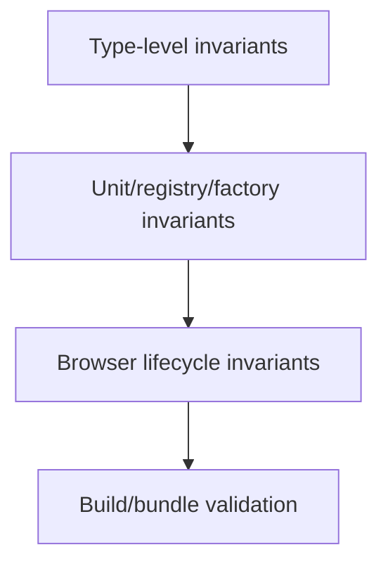

# Architecture Invariants and Validation

## Status

**Application Standard / Testing Guidance**

Save in the repository as:

```text
docs/03_implementation/testing/002-architecture-invariants-validation.md
```

---

# 1. Purpose

This document defines how KJVOnly.bible should convert important architecture rules into executable validation.

The codebase has many rules that are more important than one specific UI rendering.

Examples:

```text
row IDs are unique
domain root entrypoints remain Node-safe
related Buffers receive new identities
Pane identity remains stable
Resource selections belong to Buffer snapshots
group destinations resolve
custom view IDs resolve
navigation views remain mounted
```

The central rule is:

> **If an architecture rule is important enough to document and cheap enough to test, encode it as an invariant test.**

---

# 2. What Is an Architecture Invariant?

An invariant is a condition that should remain true across valid application states.

Examples:

```text
Settings definition root page exists
every Settings group points to a real page
Buffer key changes on related Module creation
Domain root barrel does not import browser-only Svelte code
```

These are not one-time implementation details.

They define the architecture.

---

# 3. Why Invariant Tests Matter

Feature tests answer:

```text
Does this behavior work now?
```

Invariant tests answer:

```text
Is the architecture still shaped correctly?
```

They prevent future cleanup/refactors from accidentally undoing important boundaries.

---

# 4. Static Registry Invariants

Definition-driven systems should validate their registries.

Example Settings invariants:

```text
root page ID resolves
page IDs unique
section IDs unique within page
row IDs globally unique
group destination page exists
icon ID resolves
custom view ID resolves
```

These tests allow generic runtime code to remain simpler.

---

# 5. Identity Invariants

Examples:

```text
related Module creation creates new Buffer key
same Pane can receive new Buffer without changing paneID
same Module type can have multiple distinct Buffer instances
```

These tests protect the identity model.

---

# 6. Resource Invariants

Examples:

```text
Buffer Resource-selection key matches Resource Type
required Resource selection fails when missing
related Buffer inherits compatible selections
existing Buffer snapshot does not silently follow global changes
```

These are architecture-level contracts.

---

# 7. Domain Boundary Invariants

Examples:

```text
domain root index is Node-safe
browser/Svelte exports live under /ui
cross-domain imports use public entrypoints
domain service does not depend on Workspace runtime
```

Some of these can be tested mechanically.

Others may remain review/documentation rules until tooling is worthwhile.

---

# 8. Navigation Invariants

Examples:

```text
previous entry remains mounted when new entry is pushed
Back reveals same previous DOM instance
Pane-local navigation services are isolated
root stack cannot accidentally become empty
hidden Module retains its own Buffer context
```

Some require browser tests.

---

# 9. Persistence Invariants

Examples:

```text
Settings writes normalize before persistence
Outbox entry ID equals Domain Object ID
same Outbox ID uses last-write-wins
Workspace persistence excludes transient pane.toggle
```

These rules should have focused tests at their owning layer.

---

# 10. Mutation Invariants

Examples:

```text
subscriber synchronization does not republish
single-setting update merges against current authority
destroyed subscriber is unsubscribed
```

These prevent feedback/stale-write regressions.

---

# 11. UI Ownership Invariants

Not every visual rule needs a test.

But important shell behavior may warrant browser coverage:

```text
previous navigation view hidden but mounted
one visible navigation entry
Back preserves input DOM identity
```

Avoid brittle pixel assertions.

---

# 12. Invariant Types

Useful categories:

```text
structural
identity
dependency
lifecycle
persistence
synchronization
resource
definition/configuration
```

Classifying tests helps ensure coverage of architecture rather than just output.

---

# 13. Structural Invariants

Structural invariants validate shape.

Examples:

```text
Workspace grid parser rejects malformed tree
Settings definition has valid hierarchy
Buffer contains required runtime properties
```

These are usually unit tests.

---

# 14. Identity Invariants

Identity tests verify what is preserved and what must change.

Examples:

```text
paneID preserved
Buffer key replaced
DOM node preserved
Domain Object ID stable
```

Be explicit about whether the contract is:

```text
same semantic identity
```

or:

```text
same object instance
```

---

# 15. Dependency Invariants

Dependency tests protect layer boundaries.

Potential examples:

```text
domain root import can execute in Node
browser-only code not re-exported from domain root
generic Resource builder contains no Module-specific branch
```

These can sometimes be enforced with:

```text
compile tests
import tests
static analysis
lint rules
```

---

# 16. Lifecycle Invariants

Examples:

```text
hidden view not destroyed
popped view destroyed
subscriber cleanup runs
worker terminates on destroy
```

Use browser/integration tests where runtime lifecycle matters.

---

# 17. Configuration Validation

Any static semantic registry should fail early when malformed.

Examples:

```text
Settings definitions
Module component map
icon map
custom view map
Resource contributor registrations
```

A registry can often have one generic validation suite.

---

# 18. Fail at Test Time Instead of Runtime

A configuration bug such as:

```text
group points to missing page
```

should ideally fail:

```text
during tests
```

rather than only after a user taps the row.

Validation shifts errors earlier.

---

# 19. Invariants Versus Exact Counts

Prefer:

```text
all IDs are unique
```

over:

```text
there are exactly 9 rows
```

unless exact count is part of the requirement.

Invariant tests should survive legitimate extension.

---

# 20. Invariants Versus Snapshots

Architecture tests should generally avoid large serialized snapshots.

Snapshots often encode:

```text
ordering
formatting
incidental markup
```

rather than the actual rule.

Prefer focused assertions.

---

# 21. Property-Like Tests

Some invariants can be expressed over every registry item.

Example:

```ts
for (const page of settingsDefinition.pages) {
    // validate unique IDs/destinations
}
```

This gives broad coverage with little duplication.

---

# 22. Test Helpers for Invariants

Reusable test helpers are appropriate when they express a clear architecture rule.

Example conceptual helpers:

```text
assertUniqueIDs()
assertResolverCoverage()
assertNoMissingDestinations()
```

Do not create generic assertion frameworks that obscure test intent.

---

# 23. Resolver Coverage Invariant

If a union defines semantic IDs:

```text
SettingsIconID
```

and a resolver maps them to components, tests should ensure every allowed ID resolves.

This prevents:

```text
type says valid
runtime resolver missing
```

drift.

---

# 24. Contributor Registration Invariant

Resource-aware Modules should have explicit registered contributors.

Resource-free Modules should also be explicitly registered with:

```text
NoResourceModuleResourceSelectionContributor
```

Unregistered Modules should fail.

This protects Module Resource ownership.

---

# 25. Node-Safe Domain Root Invariant

Domain root barrels must remain Node-safe.

A focused test can import:

```text
$lib/domains/<domain>
```

under the Node test environment.

If the barrel begins re-exporting Svelte/browser-only code, the test fails.

This is a strong boundary test.

---

# 26. Cross-Domain Import Validation

Static analysis/linting may eventually enforce:

```text
same domain
    relative import

cross domain
    public domain root or /ui entrypoint
```

Until then, review and focused tests/scripts may protect high-risk boundaries.

---

# 27. Buffer Construction Invariants

Tests for ModuleBufferFactory should protect:

```text
new key every new Buffer
componentName set correctly
bag copied at top level
ResourceSelections produced by contributor
related creation receives originating selections
```

These are stronger than testing the constructor alone.

---

# 28. Navigation Service Invariants

Generic NavigationService tests should protect:

```text
push preserves previous view object
pop returns to same previous object
different service instances have independent stacks
```

Browser tests then protect mounted DOM behavior.

---

# 29. Settings Synchronization Invariants

Tests should verify:

```text
two subscribers receive update
unsubscribe removes observer
single-field updates do not overwrite unrelated newer fields
multi-instance UI stays synchronized
```

---

# 30. Search Invariants

Settings search should protect:

```text
every result has valid pageID/rowID
hidden rows excluded
option labels searchable
normalization stable
```

These are semantic contracts independent from visual rendering.

---

# 31. Archive Invariants

Potential architecture tests:

```text
empty export returns valid empty archive structure
import commits before ArchiveImported event
explicit exportIds includes requested objects/resources
```

These protect workflow ordering.

---

# 32. Outbox Invariants

Potential tests:

```text
entry identity is Domain Object ID
same ID overwrites previous final publication entry
publisher receives final entry
```

---

# 33. Invariant Test Placement

Place tests near the architecture they protect.

Examples:

```text
settings.definition.spec.ts
module-buffer-factory.spec.ts
navigation.service.spec.ts
domain index Node-safe spec
```

Avoid one enormous global "architecture.spec.ts" unless the rule genuinely spans the whole application.

---

# 34. Browser Invariant Placement

Runtime invariants requiring browser behavior belong in:

```text
tests/browser/
```

Examples:

```text
persistent navigation
multi-instance context isolation
IndexedDB behavior
focus/scroll
DOM identity
```

---

# 35. Build-Time Validation

Some invariants are naturally enforced by:

```text
TypeScript
Svelte compiler
Vite build
```

Examples:

```text
type relationships
missing imports
worker circular imports
browser bundle compatibility
```

Build is part of architecture validation but not a replacement for behavioral tests.

---

# 36. Type-Level Invariants

TypeScript can encode invariants such as:

```text
toggle rows only reference boolean Settings keys
select option value matches Settings key type
semantic ID unions restrict valid values
```

Prefer compile-time prevention when practical.

---

# 37. Runtime Validation Still Matters

TypeScript cannot protect:

```text
persisted JSON
localStorage
archive input
IndexedDB records
network Resources
```

These boundaries still need runtime normalization/parsing.

---

# 38. Validation at Trust Boundaries

Validate aggressively where data crosses:

```text
storage
network
file/archive
worker message
untyped bag
external Resource
```

Inside strongly typed trusted code, avoid redundant validation everywhere.

---

# 39. Invariant Documentation

Each important invariant should ideally have one home:

```text
implementation doc
JSDoc
test name
```

Not every rule needs all three, but critical architecture benefits from reinforcement.

---

# 40. Failure Messages

Invariant tests should fail with semantic detail.

Good:

```text
Duplicate Settings row ID: show-pericopes
```

Better than:

```text
expected false to be true
```

Readable failures shorten debugging.

---

# 41. Architecture Regression Workflow

When a refactor breaks an invariant:

```text
1. decide whether architecture changed intentionally
2. if no, fix implementation
3. if yes, update architecture doc
4. update invariant test deliberately
5. avoid weakening test merely to make suite pass
```

---

# 42. Avoid Test Cargo Culting

Do not keep an invariant test after its architecture rule has been intentionally removed.

Tests should protect current accepted architecture, not historical accidents.

---

# 43. Invariant Audit Checklist

For a new subsystem, ask:

```text
What must always be true?
Which IDs must be unique?
Which mappings must be complete?
Which dependencies must not exist?
Which identities must remain stable?
Which identities must change?
Which cleanup must always occur?
Which ordering is required?
```

Turn high-value answers into tests.

---

# 44. Architecture Validation Pyramid



Each layer catches a different category of architecture regression.

---

# 45. Anti-Patterns

Avoid:

## Exact-count tests for extensible registries

Brittle.

## Large snapshots as architecture tests

Too incidental.

## Silent fallback for invalid configuration

Hides errors.

## Weakening tests after refactor without revisiting architecture

Masks regression.

## Browser tests for purely static registry validation

Too expensive.

## Relying only on TypeScript for persisted/untrusted data

Insufficient.

## One giant architecture test file

Poor ownership.

---

# 46. Architecture Invariants

1. Important structural rules are encoded in tests when practical.
2. Extensible registries are validated by properties, not fixed counts.
3. Identity contracts explicitly distinguish semantic identity from object identity.
4. Dependency boundaries are protected by compile/import/static tests where useful.
5. Runtime lifecycle contracts use browser tests.
6. Persisted/external data is runtime-validated.
7. Type-level invariants are preferred when they prevent invalid construction.
8. Invalid configuration fails early and clearly.
9. Tests live near the architecture they protect.
10. Architecture changes require deliberate doc/test updates.
11. Tests protect current accepted architecture, not historical implementation accidents.
12. Failure messages should expose semantic context.

---

# 47. Summary

Architecture documents describe:

```text
what should remain true
```

Invariant tests make those rules executable.

The most valuable invariant tests are those that prevent future refactors from accidentally undoing foundational decisions such as:

```text
stable identity
Domain boundaries
Buffer snapshots
persistent navigation
definition validity
subscriber cleanup
Node-safe entrypoints
```

The goal is not more tests.

The goal is to make important architecture difficult to regress accidentally.
