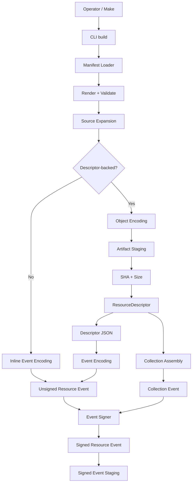
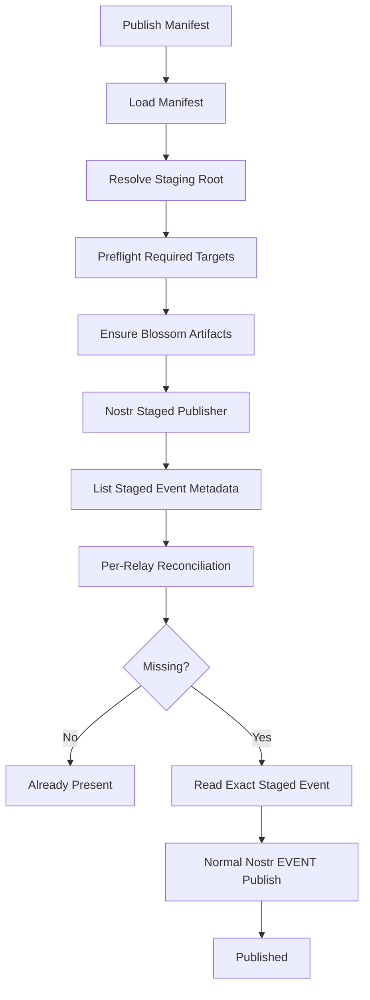
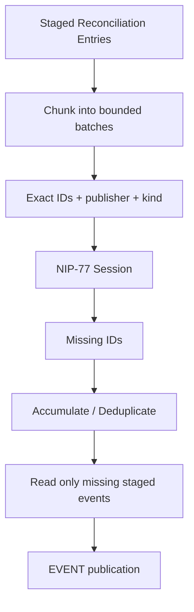

# Resource Publishing CLI

## Status

**Status:** Captured Implementation Record
**Last source-verified capture:** 2026-09-08
**Current-source verification:** Not available in the PWA handoff archive
**Scope:** Manifest-driven Resource build, staging, Blossom publication, Nostr reconciliation/publication, Collections, logging, and repository integration

This document consolidates the captured Resource Publishing CLI design and implementation state from:

```text
20260903-kjvonly-resource-publishing-cli-design-spec.md
20260905-kjvonly-resource-publishing-cli-implementation-and-integration-spec.md
20260908-kjvonly-resource-publishing-cli-implementation-and-integration-spec.md
```

The September 8 capture explicitly superseded the September 5 implementation snapshot and is therefore the primary source for the implementation details below.

The CLI source workspace is not present in the current PWA handoff archive used to maintain these implementation docs. Therefore this document records the last captured implementation state rather than claiming present-day source verification.

When the CLI workspace is available again, validate this document against the source before changing its status to **Current**.

---

# 1. Purpose

The Resource Publishing CLI is the producer-side companion to the application's inbound Resource architecture.

The application consumes published Resources through discovery, resolution, decoding, interpretation, validation, and installation.

The CLI works in the opposite direction:

```text
repository source data
    ↓
manifest publication intent
    ↓
Resource build
    ↓
signed local deployment artifacts
    ↓
external artifact publication
    ↓
Nostr reconciliation/publication
    ↓
published Resource state
```

Its core purpose is to replace one-off Bash seed workflows with a generic, manifest-driven Node/TypeScript publishing tool.

The CLI is intentionally not aware of application concepts such as:

```text
bootstrap
application defaults
Bible seeding
Strong's seeding
Reading Plans policy
```

Those meanings belong to repository manifests, Make targets, and application policy.

The CLI owns generic publication mechanics.

---

# 2. Producer / Consumer Boundary

The producer and consumer architectures are intentionally separate.

Producer side:

```text
Source File
    ↓
Manifest Resource Definition
    ↓
Build Pipeline
    ↓
Signed Resource Event
       or
External Artifact + Descriptor Event
    ↓
Publication
```

Consumer side:

```text
Published Resource
    ↓
Resource Discovery
    ↓
Resource Resolution
    ↓
Content Decoding
    ↓
Domain Interpretation
    ↓
Domain Validation
    ↓
Domain Installation
```

The CLI must not contain consumer-side Domain interpretation or installation behavior.

The PWA must not know how publisher staging, manifest rendering, NIP-77 reconciliation, or external artifact upload is implemented.

---

# 3. Repository / Workspace Boundary

The captured implementation used a separate CLI workspace:

```text
client/cli/
```

The browser application remained separate:

```text
client/kjvonly-pwa/
```

The captured repository shape was:

```text
kjvonly.bible/
├── client/
│   ├── cli/
│   └── kjvonly-pwa/
├── data/
├── relay/
├── zarf/
│   ├── docker/
│   ├── manifest/
│   └── scripts/
└── Makefile
```

The relationship is:

```text
CLI
    publishes Resources

PWA
    discovers/resolves/consumes Resources
```

Do not merge the CLI and PWA merely because both use TypeScript.

---

# 4. Runtime and Package

The captured implementation used:

```text
TypeScript
Node.js
Node ESM / NodeNext
```

The CLI package identity was captured as:

```json
{
  "name": "@kjvonly/cli",
  "private": true,
  "version": "0.0.1",
  "type": "module",
  "bin": {
    "kjvonly": "./dist/main.js"
  }
}
```

The captured development validation command was:

```bash
cd client/cli
npm run test && npm run build
```

This is distinct from the Resource build command described below.

---

# 5. Command Model

The CLI exposed three primary commands:

```text
kjvonly build <manifest>
kjvonly publish <manifest>
kjvonly sync <manifest>
```

Their semantics are intentionally distinct.

## 5.1 `build`

`build` prepares the current local deployment state.

It may:

```text
load/render/validate the manifest
expand Resource sources
encode Resource content
stage external artifacts
calculate artifact hashes/sizes
build ResourceDescriptor documents
build Collections
construct Nostr events
sign events
reuse unchanged staged state
remove stale local staged state
```

It does not require publication to remote targets.

## 5.2 `publish`

`publish` publishes/reconciles the exact state produced by `build`.

A key captured invariant is:

> `publish` must not rebuild or re-sign Resource events.

The signed staged event is an immutable deployment artifact.

## 5.3 `sync`

`sync` composes:

```text
build
    ↓
publish
```

The manifest remains the publication policy for both phases.

---

# 6. Source Organization

The September 8 capture described this conceptual source organization:

```text
client/cli/src/
├── main.ts
├── cli/
├── composition/
├── application/
│   ├── build/
│   │   ├── artifact/
│   │   ├── collection/
│   │   ├── descriptor/
│   │   ├── encoding/
│   │   ├── inline/
│   │   └── source/
│   ├── publish/
│   │   ├── blossom/
│   │   ├── nostr/
│   │   └── preflight/
│   └── sync/
├── domain/
├── ports/
└── adapters/
    ├── blossom/
    ├── encoding/
    ├── logging/
    ├── manifest/
    ├── source/
    ├── staging/
    ├── strategy/
    ├── time/
    └── nostr/
        ├── auth/
        ├── negentropy/
        ├── publication/
        ├── relay/
        └── signer/
```

The organizing principle was:

> Folder structure should communicate responsibility.

The capture explicitly discouraged collapsing these areas into one large application or infrastructure folder.

---

# 7. Architectural Boundary

The captured CLI architecture was hexagonal:

```text
CLI Interface
    ↓
Application Use Cases
    ↓
Domain / Pure Models
    ↓
Ports
    ↓
Adapters
```

Responsibilities were separated as follows.

## Application

Application code owns workflow and policy such as:

```text
build orchestration
publication orchestration
sync composition
preflight ordering
batch coordination
staging reconciliation
```

## Domain

Domain code owns stable publishing concepts and invariants.

## Ports

Ports define required capabilities without binding application code to concrete libraries.

Examples include:

```text
logging
signing
staging repositories
relay reconciliation
event publication
artifact publication
manifest/source access
```

## Adapters

Adapters own concrete mechanics such as:

```text
filesystem
Nostr protocol/library behavior
Blossom HTTP behavior
manifest parsing/rendering
encoding
logging output
clock/time
```

The captured implementation explicitly rejected a giant Nostr service.

---

# 8. Composition Root

The CLI had one explicit composition root.

It assembled concrete implementations for:

```text
manifest loading/rendering/validation
source discovery
encoders
staging repositories
artifact repositories
clock/time
signer
logger
Blossom preflight/publication
Nostr preflight
Nostr reconciliation
Nostr EVENT publication
build use cases
publish use cases
sync use case
CLI handlers
```

Command handlers were intended to remain thin.

They should not rebuild the dependency graph themselves.

---

# 9. Stable Import Aliases

The captured implementation used package aliases for cross-boundary imports, conceptually:

```json
{
  "imports": {
    "#adapters/*": "./dist/adapters/*",
    "#application/*": "./dist/application/*",
    "#cli/*": "./dist/cli/*",
    "#composition/*": "./dist/composition/*",
    "#domain/*": "./dist/domain/*",
    "#ports/*": "./dist/ports/*"
  }
}
```

TypeScript source imports used `.js` suffixes for Node ESM / NodeNext compatibility.

The intent was structural stability: moving a file inside a layer should not require rewriting long relative import chains across the codebase.

---

# 10. Manifest as Publication Policy

The manifest is the repository/operator-facing publication contract.

The captured implementation required:

```yaml
version: 1
```

The manifest determined things such as:

```text
Resource kind
staging root
Nostr relays
publication strategies
Blossom mirrors
source paths
event encodings
event tags
object-upload behavior
Collections
```

The CLI must not infer application-specific policy that belongs in the manifest.

The publisher secret key is not manifest data.

The captured implementation read it from:

```text
NOSTR_SECRET_KEY
```

---

# 11. Manifest Rendering

Manifest values could be environment-driven.

Captured design example:

```yaml
nostr:
  relays:
    - "{{ env.NOSTR_RELAY_PRIMARY }}"
    - "{{ env.NOSTR_RELAY_SECONDARY }}"

strategies:
  primary:
    type: blossom
    urls:
      - "{{ env.BLOSSOM_PRIMARY }}"
      - "{{ env.BLOSSOM_SECONDARY }}"
```

The September 8 local-development `app-data.yaml` capture intentionally used explicit localhost endpoints instead.

---

# 12. Relative Path Semantics

Relative manifest paths were resolved relative to the manifest file, not the operator's current shell directory.

For example, from:

```text
zarf/manifest/app-data.yaml
```

this:

```yaml
staging:
  path: ./.kjvonly
```

resolved to:

```text
zarf/manifest/.kjvonly/
```

and repository data could be referenced consistently using paths relative to the manifest.

This behavior matters because the CLI may be invoked from a different working directory, including Make targets that run from `client/cli`.

---

# 13. Resource Definitions

Each manifest `resources` entry describes one publication definition.

A definition may expand to:

```text
one source file
many source files in a directory
inline Resource events
descriptor-backed external Resources
Collections
```

The manifest definition name is not necessarily the Resource Identifier.

Example from the capture:

```text
manifest definition:
    bible-chapters-kjvs

concrete Resource ID:
    kjvonly/bible/chapters/kjvs/1_1
```

---

# 14. Resource Identity

The captured implementation published KJVOnly Resources using kind:

```text
37770
```

Long-lived Resource identity was addressable Nostr identity:

```text
publisher pubkey
+
kind
+
d tag
```

The signed event ID represented one publication revision, not the long-lived Resource identity.

The `t` tag supplied Resource classification.

Captured examples included:

```text
kjvonly/bible/chapters
kjvonly/search/bible
kjvonly/overlays/paragraphs
kjvonly/overlays/pericopes
kjvonly/bible/booknames
kjvonly/strongs/definitions
kjvonly/resources/collections
```

The CLI did not maintain a second category registry.

---

# 15. Representation Model

The captured implementation used Resource representation tags such as:

```text
content
descriptors
```

An inline Resource typically used:

```text
representation = content
```

A descriptor-backed Resource or Collection typically used:

```text
representation = descriptors
```

The representation describes the meaning of `event.content`.

---

# 16. Inline Resource Pipeline

For already-compressed inline content, the captured pipeline was:

```text
source bytes
    ↓
event encoding
    ↓
event.content
    ↓
signed kind-37770 event
```

For example, an existing `.json.gz` chapter could be hex-encoded for Nostr without recompressing it.

Typical metadata from the capture included:

```text
d = kjvonly/bible/chapters/kjvs/<key>
m = application/json+gzip+hex
t = kjvonly/bible/chapters
representation = content
```

---

# 17. Descriptor-Backed Pipeline

Descriptor-backed publication has two distinct encoding pipelines.

External object pipeline:

```text
source
    ↓
object-upload.encoding
    ↓
external artifact bytes
    ↓
SHA-256 + size
    ↓
publication locations
```

Descriptor-event pipeline:

```text
ResourceDescriptor[]
    ↓
JSON
    ↓
event.encoding
    ↓
signed Nostr event
```

Do not conflate:

```text
object-upload.encoding
```

with:

```text
event.encoding
```

The captured implementation commonly used:

```text
outer descriptor event:
    application/json+hex

resolved external artifact:
    application/json+gzip
```

---

# 18. Artifact Staging and Integrity

Descriptor-backed artifacts recorded:

```text
SHA-256
size
source revision metadata
```

When no object transformation was required, the Node staging adapter could use a symbolic link instead of copying large source files.

Conceptually:

```text
source artifact
    ↓
symlink-backed staging entry
```

This preserved artifact identity and hashing behavior without unnecessary local duplication.

Build established the artifact bytes that publication was allowed to upload.

Publication must not knowingly upload bytes that differ from staged identity.

---

# 19. Incremental Build

The staging tree represented the desired local deployment state.

The captured invariant was:

```text
unchanged source
    ↓
reuse staged signed event
    ↓
same created_at
    ↓
same signature
    ↓
same event ID
```

Invoking `sync` again must not create a new event revision merely because time passed.

Filesystem source revision metadata and Nostr event timestamps remained separate concepts:

```text
filesystem mtime / size
    = local incremental-build input

event.created_at
    = signed Nostr publication timestamp
```

Never substitute one for the other.

---

# 20. Signed Events as Deployment Artifacts

A central captured rule is:

> Signed staged events are immutable deployment artifacts.

Once built and staged, the exact JSON event should be publishable without rebuilding or re-signing.

That property makes reconciliation meaningful because the staged event ID is stable.

---

# 21. Staging Index

The captured Nostr staging repository supported a metadata-only view across normal Resource events and Collection events.

The publication path was designed so reconciliation can inspect event identity without opening every event JSON file.

Conceptually:

```text
list staged event metadata
    ↓
reconcile IDs
    ↓
read exact JSON only for missing IDs
```

This metadata-only listing was treated as a performance invariant.

---

# 22. Local Deletion Reconciliation

Build reconciled the local staging tree with current source definitions.

If a previously staged source disappeared locally, stale local staging could be removed.

The captured architecture explicitly separated this from remote deletion.

```text
local source deletion
    → local staged-state cleanup

remote Resource deletion
    → separate explicit future workflow
```

Build/publish/sync must not hide remote deletion behavior.

A future explicit `prune` workflow was discussed but not part of the captured core implementation.

---

# 23. Publication Preflight

The captured publisher performed strict preflight before partial publication began.

The goal was to avoid starting a deployment that could not satisfy all required targets.

Configured targets were treated as required rather than best-effort mirrors unless manifest policy said otherwise.

---

# 24. Publication Order

The captured required publication order was:

```text
external artifacts
    ↓
Nostr Resource events that reference them
```

This ensures a descriptor-backed Resource is not published before the referenced bytes are available.

---

# 25. Blossom Publication

The September 8 capture used Blossom strategies with:

```text
urls[]
```

rather than one singular URL.

A descriptor could therefore record multiple mirrors.

Captured semantics:

```text
artifact
    ↓
ensure on every configured Blossom target
    ↓
descriptor urls[]
```

The captured PWA work also updated the Blossom consumer to understand `urls[]` and try mirrors sequentially until one returned a successful response.

That PWA behavior should be validated separately against current source if this CLI document is promoted to Current.

---

# 26. Nostr Publication Architecture

The CLI used Nostr for signed Resource-event publication.

The captured architecture separated:

```text
relay reconciliation
EVENT publication
signing
AUTH
relay connection mechanics
```

The CLI's concrete Nostr implementation had moved to `nostr-tools` by the September 8 capture.

The architecture did not require the PWA to use the same Nostr library.

---

# 27. NIP-77 Reconciliation

Publication did not blindly resend every staged event.

Instead, the captured implementation used NIP-77 reconciliation to determine which staged event IDs were missing from each relay.

Conceptually:

```text
staged event metadata
    ↓
per-relay reconciliation
    ↓
missing event IDs
    ↓
read only corresponding staged JSON
    ↓
normal EVENT publication
```

Actual event transfer remained ordinary Nostr `EVENT` publication.

NIP-77 was used to reconcile set membership, not as a replacement event-transfer protocol.

---

# 28. Exact-ID Reconciliation Batching

A large-set integration issue led to a captured implementation refinement: reconciliation used bounded exact-ID batches rather than one broad publisher/kind session.

The September 8 capture documented batch size:

```text
50
```

This is a captured implementation value, not verified against present CLI source.

The architecture was:

```text
staged reconciliation entries
    ↓
chunk into bounded batches
    ↓
exact IDs + author + kind filter per batch
    ↓
existing one-session NIP-77 helper
    ↓
accumulate missing IDs
```

Batch coordination belonged in the relay reconciler, not the low-level Negentropy session helper.

---

# 29. Why Author and Kind Remained in Batch Filters

The captured implementation retained publisher and kind context alongside exact IDs.

The intent was to keep reconciliation scoped to the expected publication namespace while still avoiding the broad-set behavior that had failed at larger scale.

The low-level NIP-77 session remained responsible for one reconciliation session only.

---

# 30. Per-Relay Independence

Each configured relay was reconciled independently.

A Resource event could therefore be:

```text
already present on relay A
missing on relay B
```

Only the missing relay required EVENT publication.

The publication result should preserve per-relay outcomes rather than collapse all relay state into one global flag.

---

# 31. NIP-42 Authentication

The captured Nostr adapter supported reactive NIP-42 AUTH behavior.

AUTH retry was bounded.

The CLI should not enter an unbounded challenge/retry loop.

The captured implementation kept AUTH behavior around the reconciliation/publication operation rather than teaching the low-level Negentropy session about application/manifests.

---

# 32. EVENT Publication

Once reconciliation identified a missing event ID, the publisher:

```text
looked up the exact staged signed event
    ↓
published it using ordinary Nostr EVENT
```

It did not reconstruct the event.

It did not re-sign the event.

This preserves the deployment artifact that reconciliation evaluated.

---

# 33. Unknown Reconciliation IDs

The captured implementation treated a reconciliation result containing an unknown staged event ID as an error.

The publisher should not attempt to fabricate or infer a staged event that the current local deployment state does not contain.

---

# 34. Collections

The CLI could build Resource Collections in addition to ordinary Resources.

Collections used the same signed staging/publication machinery.

The September 8 capture recorded one accepted v1 limitation:

```text
Collection events may be rebuilt/re-signed each build
```

This was explicitly considered separate from ordinary Resource incremental event reuse.

Collection incremental reuse was deferred optimization work.

---

# 35. App-Data Manifest

The captured repository integration used:

```text
zarf/manifest/app-data.yaml
```

The manifest was not a special CLI mode.

It was an ordinary manifest expressing KJVOnly repository publication policy.

The captured development scope included definitions for:

```text
KJVS individual Bible chapters
KJVS Bible chapter bundle
KJVS Bible search index
Paragraph overlay
Pericope overlay
Bible book names
Strong's bundle
application-defaults Collection
```

The captured implementation intentionally omitted some production expansion, such as individual Strong's publications, through manifest policy rather than CLI branching.

---

# 36. Application Defaults Are Manifest Policy

The CLI did not know that a Collection named `application-defaults` was special.

That meaning belonged to the application/repository.

The same CLI mechanism could build any other Collection described by a manifest.

This is a core separation rule:

```text
application meaning
    = manifest/repository policy

publication mechanics
    = CLI
```

---

# 37. Make Integration

The captured repository exposed app-data build/publish/sync workflows through Make.

An important operational rule was that pipelines preserve process failures.

Logging/formatting pipelines must not accidentally turn a failed CLI command into a successful Make target.

The exact Make targets should be verified against current repository source before being documented as present-day commands.

---

# 38. Structured Logging

Structured verbose logging was treated as part of the integration/debugging contract.

The captured implementation had:

```text
Logger port
structured event names
human-readable formatter
persistent verbose logs
```

Logs could provide evidence for:

```text
source reuse
artifact reuse
preflight
Blossom ensure/upload
reconciliation batches
AUTH
missing-event publication
per-relay outcomes
```

Logging must not expose:

```text
private keys
secret material
raw sensitive content
unnecessarily verbose protocol payloads
```

---

# 39. Security Invariants

The captured CLI design established several security boundaries:

1. secret keys do not belong in manifests;
2. signed staged events are immutable deployment artifacts;
3. artifact integrity is checked against staged hash/size identity;
4. publication preflight occurs before partial deployment;
5. all configured required publication targets must succeed according to manifest policy;
6. logs must not expose secret signing material;
7. Nostr protocol mechanics remain in adapters rather than leaking through application code.

---

# 40. Testing Philosophy

Unit tests were intended to remain network-independent.

Protocol adapters could be tested with controlled fakes/mocks while real repository integration was validated separately.

The captured implementation considered real app-data integration stronger evidence than fixture-only tests because it exercised:

```text
large Resource sets
real manifest expansion
incremental staging
Blossom publication
NIP-42
NIP-77 reconciliation
missing-only EVENT publication
Collection replacement
```

---

# 41. Captured Integration Evidence

The September 8 document recorded successful large-set publication/reconciliation against local infrastructure.

The important captured rerun behavior was:

```text
unchanged chapter Resource events
    → reused locally
    → recognized as already present remotely
    → not republished

Collection event
    → rebuilt/re-signed under current v1 behavior
    → new event ID
    → published as current addressable replacement
```

The September 8 capture therefore considered the previous September 5 large-set NIP-77 blocker resolved.

This is historical integration evidence, not a substitute for re-running current integration tests when the CLI source is available.

---

# 42. Idempotency Goal

The intended `sync` behavior was:

```text
same source + same definition + same staged state
    ↓
same Resource event IDs
    ↓
remote reconciliation sees them already present
    ↓
no duplicate publication
```

The captured exception was v1 Collection rebuilding/re-signing.

---

# 43. Failure Semantics

Publication failures should fail the operation visibly.

The CLI must not silently continue after a required target fails.

Because staged events are immutable, retrying publication should reuse the same signed event rather than generating a replacement revision.

This supports safe retry behavior.

---

# 44. Development vs Production Policy

The CLI is generic across environments.

Differences between development and production belong in manifests/environment values.

Examples from the captured design included:

```text
local relay vs production relays
local Blossom vs production mirrors
reduced development Resource scope
production Strong's expansion
additional Bible versions
```

Do not add environment-specific branches to the core CLI when the difference can be expressed as publication policy.

---

# 45. Locked Captured Decisions

The September 8 implementation record treated the following as established decisions:

1. The CLI is manifest-driven and application-domain agnostic.
2. `build`, `publish`, and `sync` have separate semantics.
3. `publish` does not rebuild or re-sign events.
4. Signed staged events are immutable deployment artifacts.
5. Nostr reconciliation uses NIP-77.
6. Event transfer uses ordinary Nostr EVENT publication.
7. The captured CLI Nostr adapter uses `nostr-tools`.
8. NIP-42 authentication is reactive and bounded.
9. Relay reconciliation is independent per relay.
10. Reconciliation timestamps come from signed event `created_at`, not filesystem mtime.
11. Staged event listing is metadata-only.
12. Event JSON is opened only for IDs identified as missing.
13. Unknown reconciliation IDs fail.
14. Large reconciliation uses bounded exact-ID batches.
15. The captured batch size was 50.
16. Batching belongs in the relay reconciler, not the low-level session helper.
17. Blossom descriptors use `urls[]`.
18. Artifact publication precedes Resource-event publication.
19. Local source deletion cleans local staging only.
20. Remote cleanup requires an explicit workflow.
21. Zero-transform artifacts may be symlink-staged.
22. Collections may be re-signed each build under the captured v1 behavior.
23. Structured verbose logging is part of operational debugging.
24. The CLI does not know that `application-defaults` means bootstrap.
25. Resource-specific development omissions are manifest policy, not CLI branching.

These decisions should be revalidated against current CLI source before being treated as present-day implementation invariants.

---

# 46. Explicit Non-Goals

The captured design explicitly avoided:

```text
KJVS-specific branches
Strong's-specific batch logic
consumer bootstrap logic in the CLI
manual REQ/set-diff replacement for NIP-77
one giant Nostr service
remote deletion hidden inside build
re-signing events during publish
using filesystem mtime as Nostr event revision time
opening every staged event JSON before reconciliation
```

These are useful architectural guardrails even when the CLI source is later refactored.

---

# 47. High-Level Build Flow



---

# 48. High-Level Publish Flow



---

# 49. Captured Reconciliation Flow



The captured batch size was 50.

That value requires current-source verification before being described as current.

---

# 50. End-to-End Mental Model

Producer:

```text
repository source data
    ↓
manifest publication intent
    ↓
CLI build
    ↓
current staged deployment state
    ↓
preflight
    ↓
ensure external artifacts
    ↓
reconcile event IDs per relay
    ↓
read only missing signed events
    ↓
publish exact staged events
    ↓
relay / Blossom state
```

Consumer:

```text
PWA discovery
    ↓
Published Resource
    ↓
inline decode OR descriptor resolution
    ↓
integrity validation
    ↓
Domain interpretation/validation
    ↓
Domain installation
```

The producer and consumer share Resource contracts, not runtime implementation ownership.

---

# 51. Source-Verification Checklist

When the CLI workspace is next included in a handoff, verify at least:

```text
client/cli still exists at the documented path
commands are still build/publish/sync
manifest version remains 1
current source organization matches this document
import aliases remain valid
nostr-tools remains the Nostr implementation
NIP-77 remains the reconciliation protocol
exact-ID batching still exists
current reconciliation batch size
Blossom descriptor shape remains urls[]
Collections still have the documented incremental behavior
app-data.yaml still represents the current repository publication policy
current Make targets and local endpoints
current tests/build commands
```

Then change the status from:

```text
Captured Implementation Record
```

to:

```text
Current
```

only after that source review.

---

# 52. Historical Capture Disposition

This document consolidates the unique implementation/design material from the three dated CLI captures.

Those dated files were useful during active implementation because they represented successive checkpoints:

```text
2026-09-03
    design baseline

2026-09-05
    intermediate implementation/integration snapshot

2026-09-08
    later implementation state after resolving the large-set reconciliation blocker
```

The consolidated implementation record should now be the primary reference under `docs/03_implementation/tooling/`.

The dated captures can be recovered from version control if historical slice-by-slice detail is needed.
