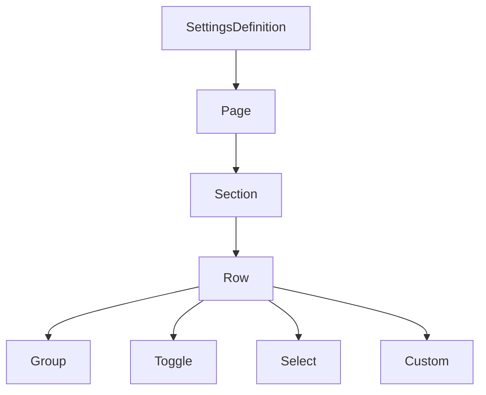
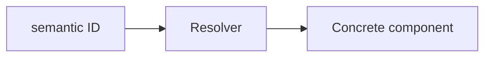
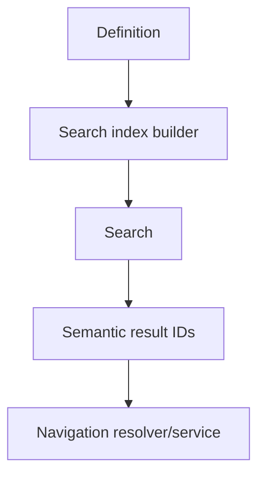
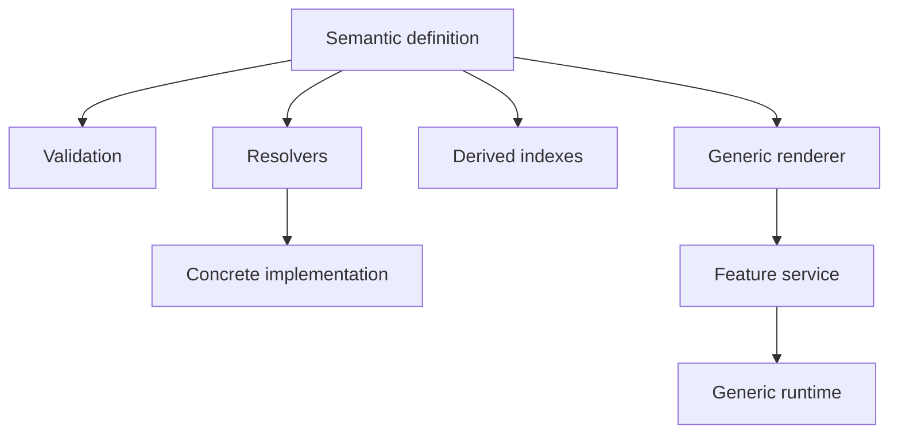

# Data-Driven UI and Resolver Architecture

## Status

**Application Standard / Architecture Guidance**

Suggested repository path:

```text
docs/03_implementation/ui/003-data-driven-ui-resolver-architecture.md
```

---

# 1. Purpose

This document defines a reusable application pattern proven during the Settings refactor:

```text
Declarative Definition
    ↓
Stable Semantic IDs
    ↓
Resolvers
    ↓
Generic Rendering / Behavior
    ↓
Specialized escape hatch only when required
```

The purpose is to reduce:

```text
duplicated components
large conditional renderers
hard-coded navigation branches
parallel metadata lists
fragile lookups
framework objects embedded in persisted/configuration data
```

The architecture is useful when multiple UI items share structure but differ in metadata or semantic behavior.

---

# 2. Settings as the Reference Example

Before the refactor, Settings contained bespoke components for concepts such as:

```text
Light/Dark Mode
Color Theme
Font Families
Font Weights
Paragraphs
Pericopes
Bible Version
Maximum Width
```

Many of those components implemented the same broad interaction:

```text
label
secondary information
icon
selection/toggle
navigation
```

The refactor replaced most of them with one declarative model.

Conceptually:



Only genuinely specialized behavior remains custom.

---

# 3. When to Use a Definition-Driven UI

Use this pattern when:

```text
many UI items share structure
items differ mostly by data
items need stable semantic identity
the same metadata feeds rendering/search/navigation/tests
adding a new item should not require a new component
```

Good candidates include:

```text
Settings
module launchers
resource selectors
toolbar actions
menus
discovery actions
filter definitions
command palettes
configuration editors
```

Do not force the pattern onto highly unique workflows with little structural repetition.

---

# 4. Definition Is Information Architecture

A definition should express:

```text
what exists
what it is called
how it is grouped
which semantic behavior it represents
which stable IDs identify it
```

It should avoid owning:

```text
runtime service instances
DOM nodes
Svelte component instances
mutable application state
```

The definition is a semantic model.

---

# 5. Stable Semantic IDs

Use stable IDs for things that participate in:

```text
navigation
lookup
search
testing
DOM targeting
persistence
analytics
migration
```

Examples from Settings:

```text
settings
appearance
bible
font-size
color-theme
show-pericopes
```

Stable IDs allow generic systems to communicate without passing concrete framework objects.

---

# 6. IDs Versus Labels

Labels are presentation.

IDs are identity.

Do not use:

```text
"Font size"
```

as a lookup key.

Use:

```text
font-size
```

The label may change for UX reasons without changing the semantic identity.

---

# 7. Discriminated Unions

When several item types share a base shape but differ in behavior, use discriminated unions.

Conceptually:

```ts
type RowDefinition =
    | GroupRow
    | ToggleRow
    | SelectRow
    | CustomRow;
```

with:

```ts
type: 'group' | 'toggle' | 'select' | 'custom'
```

Benefits:

```text
type-safe branching
exhaustive behavior
clear contracts
less optional-field ambiguity
```

---

# 8. Type Relationships Should Be Encoded

Definitions should preserve important type relationships.

Example:

```text
Settings key
    determines
valid option value type
```

A boolean setting should not accept a string option merely because the UI is generic.

Use TypeScript generics/mapped types when they meaningfully prevent invalid definitions.

---

# 9. Avoid Over-Narrow Literal Registries

One lesson from Settings was that:

```ts
as const satisfies ...
```

can sometimes preserve a registry's current literal contents so narrowly that generic consumers no longer see the full declared union.

When a registry is intended to be consumed generically, prefer an exported type that exposes the complete contract.

The goal is:

```text
definition construction checked
+
generic consumers see full model
```

not maximum literal narrowing at all costs.

---

# 10. Semantic IDs Instead of Svelte Constructors

Prefer:

```ts
{
    icon: {
        name: 'font-size'
    },
    view: 'font-size'
}
```

over:

```ts
{
    icon: FontSizeIcon,
    view: FontSizeComponent
}
```

The resolver owns the implementation mapping.



This keeps definition data:

```text
inspectable
testable
less framework-coupled
potentially serializable
```

---

# 11. Resolver Role

A resolver translates semantic identity into implementation.

Examples:

```text
icon ID → SVG component
custom view ID → Svelte component
formatter ID → formatting function
page ID → page definition
row ID → row definition
Module ID → Module component
```

Resolvers should centralize lookup rules that would otherwise be duplicated.

---

# 12. Find Versus Require

Use two resolver styles when useful.

## `find...`

Returns:

```text
value | undefined
```

Use when absence is an expected possibility.

## `require...`

Returns:

```text
value
```

or fails clearly.

Use at architectural boundaries where missing configuration represents an invariant violation.

Example:

```ts
requireSettingsSelectRow(rowID)
```

is better than:

```text
scan everything
maybe undefined
silently render blank UI
```

---

# 13. Fail Fast on Invalid Definitions

Configuration errors should fail near their consumption boundary.

Examples:

```text
unknown page ID
unknown custom view ID
unknown icon ID
row ID resolves to wrong row type
group points to missing page
```

Do not silently fall back to unrelated UI unless fallback is part of the explicit product behavior.

---

# 14. Definition Validation Tests

Static registries should have structural validation tests.

Useful invariants include:

```text
root exists
IDs unique
destinations resolve
resolver IDs resolve
custom views resolve
option IDs unique
required fields present
type-specific constraints valid
```

This lets runtime renderers remain simpler.

---

# 15. Generic Renderer Responsibilities

A generic renderer should know structural behavior.

Example SettingsRow knows:

```text
how a group row looks
how a toggle row looks
how a select row looks
how a custom row looks
```

It should not know domain-specific item names.

Avoid:

```ts
if (row.id === 'font-family') {
    ...
}

if (row.id === 'pericopes') {
    ...
}
```

unless a true exceptional behavior exists.

---

# 16. Custom Escape Hatch

Generic systems need a deliberate escape hatch.

Settings uses:

```text
custom row
```

for Font Size.

The correct pattern is:

```text
generic by default
custom when interaction genuinely differs
```

not:

```text
force every interaction into one generic abstraction
```

A healthy generic architecture makes custom behavior explicit rather than impossible.

---

# 17. Avoid One Component Per Data Item

A common anti-pattern is:

```text
FontFamilySetting.svelte
FontWeightSetting.svelte
ColorThemeSetting.svelte
ParagraphsSetting.svelte
PericopesSetting.svelte
```

when each file mostly contains metadata plus the same layout.

This creates:

```text
duplicated markup
inconsistent fixes
more imports
more tests
more dead files after redesign
```

Definitions remove the accidental component count.

---

# 18. One Source of Truth

The same definition should feed as many related systems as appropriate.

Settings uses one definition for:

```text
rendering
search
navigation
lookup
validation
focus destinations
```

Avoid maintaining:

```text
render list
search list
navigation list
icon list
```

independently if they represent the same information architecture.

---

# 19. Derived Search Index

Search metadata should be generated from the definition when possible.

Conceptually:



A search result should identify:

```text
semantic destination
```

not a framework component instance.

---

# 20. Search Metadata

Useful searchable data can include:

```text
title
secondary text
keywords
page title
section label
option labels
option secondary text
```

Explicit keywords should supplement, not duplicate, ordinary semantic text.

---

# 21. Definition-Driven Navigation

Definitions should express semantic destinations.

Example:

```ts
{
    type: 'group',
    pageID: 'appearance'
}
```

The navigation service resolves that semantic destination.

The definition should not directly push Svelte components.

---

# 22. Service as Semantic Adapter

Settings uses:

```text
SettingsNavigationService
```

as an adapter between:

```text
semantic row
```

and:

```text
generic NavigationService
```

This is a broadly useful pattern.


The feature service knows feature semantics.

The generic service stays generic.

---

# 23. Resolver Versus Service

Use a resolver when the operation is primarily:

```text
semantic ID → value/implementation
```

Use a service when behavior includes:

```text
state transitions
orchestration
side effects
navigation
persistence
```

Example:

```text
resolveSettingsIconComponent()
    resolver

SettingsNavigationService.navigate()
    service
```

---

# 24. Component Maps

A component map can keep constructors outside declarative data.

Example:

```ts
interface SettingsNavigationComponents {
    group: NavigationComponent;
    select: NavigationComponent;
    custom: NavigationComponent;
}
```

This allows tests to substitute simple components and keeps the semantic definition framework-light.

---

# 25. Formatter Resolvers

Formatting differences are another useful resolver boundary.

Example:

```text
font-size
    ↓
16
    ↓
"16 px"
```

Avoid making a generic row renderer aware of every individual setting's formatting rules.

---

# 26. Icon Resolvers

Semantic icon IDs provide several benefits:

```text
definition stays semantic
icons can be swapped centrally
validation can prove mapping exists
feature code avoids repeated imports
```

Be careful with build systems such as Tailwind when classes are generated dynamically.

Static resolver maps can also make classes visible to the compiler.

---

# 27. Data Versus Runtime State

Definitions should describe static/semi-static structure.

Do not embed current runtime values directly in the registry when they belong elsewhere.

Example:

```text
definition says:
    setting = fontSize

SettingsContext says:
    current fontSize = 16
```

The renderer combines them.

---

# 28. Read Definitions, Do Not Mutate Them

Treat definitions as configuration.

Runtime interaction should mutate:

```text
application state
module state
domain state
```

not the definition object itself.

This makes definitions safe to reuse across:

```text
multiple module instances
search indexing
validation
tests
```

---

# 29. Definition Ownership

A definition should live close to the feature/domain that owns its semantics.

Avoid one massive global registry containing every feature-specific rule unless it is genuinely the application-level source of truth.

Examples:

```text
Settings definition
    owned by Settings module

Bible resource contributor
    owned by Bible domain
```

---

# 30. Generic Infrastructure Must Not Learn Feature Semantics

Avoid:

```ts
if (row.id === 'pericopes') ...
if (module === BIBLE) ...
if (view === FONT_SIZE) ...
```

inside generic infrastructure.

The Open/Closed direction should be:

```text
add feature semantic data/mapping
rather than
edit central runtime switch
```

---

# 31. Migration Pattern: Bespoke to Generic

A safe migration sequence is:

```text
1. identify repeated behavior
2. model the shared data
3. add stable semantic IDs
4. introduce generic renderer
5. introduce resolvers
6. migrate one behavior category
7. add structural validation tests
8. migrate remaining simple cases
9. preserve custom escape hatch
10. remove dead bespoke components
```

Do not delete the old implementation before the generic path is proven.

---

# 32. Start With the Smallest Common Language

Do not design a giant universal schema up front.

Settings began with a useful vocabulary:

```text
group
toggle
select
custom
```

That was enough.

Add new row/item types only when real use cases cannot fit existing semantics cleanly.

---

# 33. Definition Review Checklist

For every new definition item, ask:

```text
Does it have stable identity?
Is the label presentation-only?
Does its destination resolve?
Does its icon/view/formatter ID resolve?
Is its state key type-safe?
Should it be searchable?
Is it generic or truly custom?
Can multiple module instances consume the same definition safely?
```

---

# 34. Testing Strategy

## Model/type tests

Ensure invalid combinations are rejected by TypeScript where possible.

## Definition validation tests

Verify registry invariants.

## Resolver tests

Test:

```text
valid ID
missing ID
wrong semantic type
```

## Generic renderer tests

Test behavior by row/item type, not every data item individually.

## Browser tests

Use when behavior depends on:

```text
DOM
Svelte context
focus
scroll
persistent mounting
real events
```

---

# 35. Test the Language, Not Every Instance

If 20 toggle rows use the same generic renderer, do not write 20 identical renderer tests.

Test:

```text
toggle behavior contract
```

Then separately test the definition contains the intended entries.

This gives better coverage with less brittle test code.

---

# 36. Architectural Tests

High-value architecture tests include:

```text
all row IDs unique
all group destinations valid
all icons resolve
all custom views resolve
search result destination resolves
generic renderer does not require item-specific callback wiring
```

These protect the abstraction itself.

---

# 37. Avoid `Reflect.set` as a Type Escape Hatch

When generic code becomes hard to type, first inspect whether the model or registry typing has lost information.

Do not immediately bypass TypeScript with:

```text
Reflect.set
any
unknown casts everywhere
```

The Settings refactor showed that fixing the registry type often restores normal typed assignment.

---

# 38. Semantic IDs Enable Future Refactors

A semantic definition can survive implementation replacement.

Example:

```text
view: font-size
```

can later map to a completely different Svelte component without changing:

```text
search destinations
definition IDs
navigation payloads
tests of semantic structure
```

This decoupling is valuable.

---

# 39. Data-Driven Does Not Mean Logic-Free

Feature-specific logic still exists.

It simply lives in clearer places:

```text
definition
    semantic metadata

resolver
    semantic → implementation mapping

service
    feature orchestration

generic renderer
    shared interaction

custom component
    exceptional interaction
```

The goal is separation, not removal of logic.

---

# 40. Anti-Patterns

Avoid:

## Parallel registries

```text
one list for rendering
one list for search
one list for navigation
```

## Labels as IDs

Presentation text should not be identity.

## Component constructors in semantic configuration

Use stable IDs + resolver.

## Huge conditional generic components

Feature semantics belong in definition/resolvers/services.

## Custom component for every row

Use the shared language.

## Generic abstraction with no escape hatch

Keep specialized behavior possible.

## Silent resolver fallback

Fail clearly when configuration is invalid.

## Untested static registry

Definitions deserve validation tests.

---

# 41. Architecture Invariants

1. Stable IDs identify semantic items.
2. Labels are presentation, not identity.
3. Definitions describe structure/semantics, not runtime service instances.
4. Generic renderers operate on discriminated semantic types.
5. Concrete framework implementations are selected through resolvers/maps.
6. Definitions are not mutated during runtime interaction.
7. Search/navigation derive from the same semantic source when possible.
8. Feature-specific services adapt semantic actions to generic runtime services.
9. Custom behavior is explicit and exceptional.
10. Definition invariants are tested.
11. Generic infrastructure does not accumulate feature-specific branches.
12. Type relationships are encoded when they prevent invalid configuration.

---

# 42. Candidate Future Uses

This pattern may be useful for:

```text
Modules launcher
Bible header/action menus
Plans actions
Discovery roots
resource-selection menus
toolbar configuration
Archive filters/actions
Outbox actions
command/search palette
content-reader actions
```

Each candidate should be evaluated independently.

Do not convert a feature merely for consistency if its behavior is not actually data-driven.

---

# 43. Summary

The core pattern is:



The main payoff is not fewer files by itself.

The payoff is:

```text
one source of truth
stronger type safety
stable semantic identity
less duplicated markup
less conditional branching
simpler search/navigation
better validation
easier extension
more focused tests
```

Use data-driven architecture where behavior is genuinely repetitive and semantic differences can be modeled cleanly.
