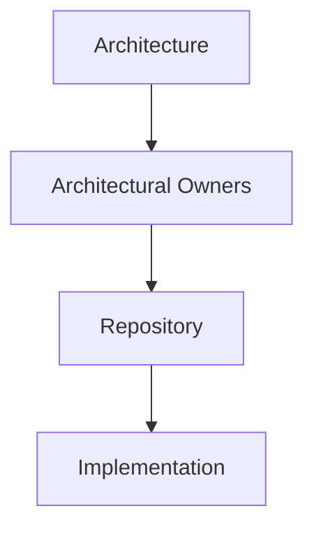
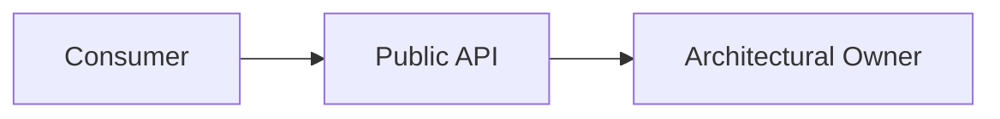
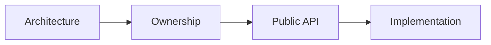

# Repository Organization

## Status

Target

---

# Purpose

This document defines how the application source code should be organized.

Repository organization should reflect the architectural ownership model established by the Application Architecture.

Its purpose is to make architectural ownership immediately visible to developers working within the codebase.

The repository should answer one question before any other:

> **Who owns this responsibility?**

---

# Scope

This document defines:

* repository organization,
* architectural ownership,
* Public APIs,
* cross-owner dependencies,
* and repository evolution.

It does not define:

* implementation technologies,
* coding style,
* naming conventions,
* or programming language features.

Those responsibilities belong to the Developer Guide and Implementation documentation.

---

# Background

The application is composed of independently owned architectural subsystems.

Examples include:

* the Workspace Runtime,
* Domains,
* the User Interface,
* Resource Integration,
* Background Processing,
* and Technical Infrastructure.

Each subsystem owns a distinct set of responsibilities.

The repository should make those ownership boundaries visible.

Conceptually:



Repository organization exists to communicate architectural ownership rather than implementation patterns.

---

# Architectural Owners

The highest level of repository organization should represent architectural owners.

Conceptually:

```text
src/lib/

    runtime/

    domains/

    ui/

    resource/

    background/

    infrastructure/
```

Each top-level directory represents a distinct architectural responsibility.

Repository organization should be determined by ownership rather than by technical role.

The directory structure should make the application's architecture visible without requiring knowledge of the implementation.

---

# Owners Organize Their Own Implementation

Each architectural owner is responsible for organizing the implementation required to fulfill its responsibilities.

For example:

```text
domains/

    bible/

    notes/

    reading-plans/
```

Each owner may organize its internal implementation however best supports that responsibility.

Typical implementation structures may include:

* Domain Objects,
* Services,
* Stores,
* Factories,
* Events,
* Modules,
* Serialization,
* or other implementation concepts.

These implementation details remain internal to the owner.

Architectural ownership determines the top-level organization.

Implementation determines the internal organization.

---

# Public APIs

Every architectural owner should expose a deliberate Public API.

The Public API defines the concepts other architectural owners may depend upon.

Conceptually:



Consumers should collaborate through another owner's Public API rather than depending upon its internal implementation.

Repository organization should make this boundary obvious.

---

# Cross-Owner Dependencies

Dependencies between architectural owners should occur through Public APIs.

For example:

```text
Notes Domain

        ↓

Bible Public API

        ↓

Bible Domain
```

Consumers should not depend upon another owner's internal implementation.

This preserves ownership while allowing collaboration between independently evolving architectural subsystems.

---

# Technical Roles

Technical roles exist within architectural owners.

Examples include:

* Services,
* Stores,
* Factories,
* Components,
* Events,
* Workers,
* Serializers,
* and other implementation mechanisms.

These concepts organize implementation.

They do not define architectural ownership.

Repository organization should therefore follow this progression:

```text
Architectural Owner

        ↓

Public API

        ↓

Implementation

        ↓

Technical Roles
```

---

# Adding New Code

When introducing new code, determine its owner before determining its implementation.

A useful checklist is:

```text
What concept does this represent?

↓

Who owns that concept?

↓

Does that owner already exist?

↓

Should the capability be part of the owner's Public API?

↓

How should the owner implement it?
```

Repository organization should naturally emerge from these questions.

---

# Repository Evolution

The repository should evolve with the architecture.

New architectural owners may introduce new top-level directories.

Existing owners may reorganize their internal implementation without affecting other parts of the application, provided their Public API remains stable.

The repository should optimize for architectural clarity rather than structural uniformity.

Consistency should exist at the architectural level.

Implementation should remain free to evolve within those boundaries.

---

# Migration Strategy

Existing repository organization does not need to be rewritten in a single refactor.

Migration should occur incrementally as code evolves.

When modifying existing code:

1. identify the architectural owner,
2. determine whether the current location reflects that ownership,
3. move the implementation when doing so improves architectural clarity,
4. preserve the owner's Public API whenever practical.

The objective is gradual convergence toward the architectural model rather than immediate structural perfection.

---

# Big Takeaway

Repository organization should make architectural ownership visible.

Conceptually:



Organize by architectural owner first.

Expose collaboration through deliberate Public APIs.

Allow each owner to organize its own implementation internally.

Technical roles support architectural ownership.

They do not replace it.
