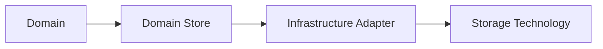
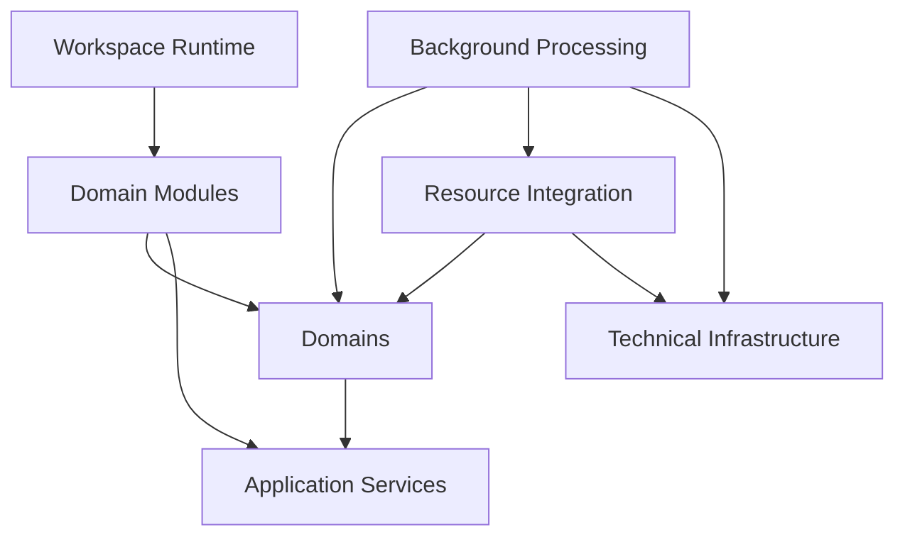
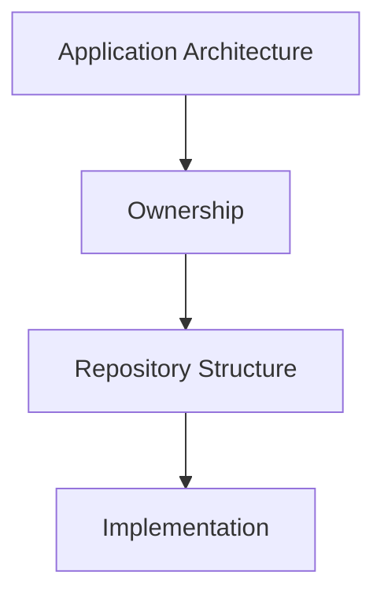

# Repository Organization

## Status

Target

---

# Purpose

This document defines the preferred organization of the KJVOnly application source code.

Repository structure should reflect the ownership boundaries defined by the Application Architecture.

The purpose of this structure is to make it possible for a developer to determine where code belongs by understanding its responsibility rather than by memorizing the existing repository layout.

---

# Principle

Repository organization should follow architectural ownership.

Code should live as close as practical to the responsibility that owns it.

The repository should therefore reflect the primary ownership models defined by the Application Architecture:

* Workspace Runtime,
* Domains,
* Application Services,
* Technical Infrastructure,
* Resource Integration,
* Background Processing,
* and shared presentation infrastructure.

Physical organization is an implementation decision.

Architectural ownership determines that organization.

---

# Target Structure

The client should evolve toward a structure similar to:

```text
src/lib/

    runtime/

    domains/

    application/

    infrastructure/

    resources/

    background/

    presentation/

    components/
```

Each directory represents a distinct architectural responsibility.

The exact directory names may evolve.

The ownership boundaries they represent should remain stable.

---

# Runtime

The `runtime/` directory contains the implementation of the Workspace Runtime.

It owns infrastructure required to compose and coordinate the visible application.

Conceptually:

```text
runtime/

    workspace/
    panes/
    buffers/
    rendering/
```

Runtime code may include:

* Workspace state,
* Pane-tree operations,
* Buffer behavior,
* layout generation,
* Module placement,
* runtime persistence coordination,
* and rendering coordination.

Runtime code should not contain:

* Bible behavior,
* Notes behavior,
* Reading Plan behavior,
* Resource Resolution,
* persistence technology,
* or other Domain-specific logic.

The Runtime should remain independent from the capabilities it presents.

---

# Domains

The `domains/` directory contains application behavior owned by individual Domains.

Each Domain should contain the code required to understand and operate on its own concepts.

Conceptually:

```text
domains/

    bible/

    notes/

    reading-plans/
```

A Domain may contain:

```text
bible/

    objects/
    services/
    stores/
    factories/
    serializers/
    modules/
    search/
    events/
```

The exact subdirectories should exist only when the Domain requires them.

Empty architectural layers should not be introduced merely for symmetry.

---

# Domain Objects

Domain Objects belong inside their owning Domain.

For example:

```text
domains/
    bible/
        objects/
            chapter.ts
            annotation.ts

    notes/
        objects/
            note.ts

    reading-plans/
        objects/
            reading-plan.ts
            completed-reading.ts
```

Domain Objects should not be collected into a global `models/` directory solely because they share a technical role.

Their Domain ownership is more important than the fact that they are all models.

---

# Domain Services

Services used exclusively by one Domain should remain inside that Domain.

For example:

```text
domains/
    bible/
        services/
            chapter.service.ts
            annotation.service.ts
            search.service.ts

    notes/
        services/
            notes.service.ts

    reading-plans/
        services/
            progress.service.ts
```

A service should move outside its Domain only when the concept it represents is genuinely shared across multiple Domains.

The ownership heuristic remains:

> Would another Domain naturally depend upon this capability?

If not, the service belongs to its Domain.

---

# Domain Stores

Every Domain owns the Store interfaces required by its Domain Objects.

Store interfaces should therefore live with their owning Domain.

For example:

```text
domains/
    bible/
        stores/
            chapter.store.ts
            annotation.store.ts

    notes/
        stores/
            note.store.ts
```

The Store interface represents Domain persistence semantics.

The technology used to implement that interface belongs to Technical Infrastructure.

Conceptually:



This keeps IndexedDB, SQLite, filesystem storage, or future persistence technologies outside Domain behavior.

---

# Domain Modules

Modules belong to the Domain capability they present.

For example:

```text
domains/
    bible/
        modules/
            chapter/
            search/
            references/

    notes/
        modules/
            list/
            editor/
            search/

    reading-plans/
        modules/
            reader/
            list/
```

A Module is the presentation of one Domain capability.

It should therefore live inside the Domain that owns that capability.

Reusable visual components used only by that Module may remain colocated with it.

For example:

```text
domains/
    bible/
        modules/
            chapter/
                chapter.module.svelte
                verse.svelte
                word.svelte
                toolbar.svelte
```

This keeps implementation details close to the capability that gives them meaning.

---

# Domain Features

Not every Domain capability requires its own Module.

Features used within a Domain may remain grouped by their Domain responsibility.

For example:

```text
domains/
    bible/
        annotations/
        search/
        references/
```

Annotations may participate in the Bible Chapter Module without becoming an independent Module.

Repository organization should follow ownership rather than forcing every feature into the same structural pattern.

---

# Application Services

The `application/` directory contains shared application concepts used across multiple Domains or presentation components.

Conceptually:

```text
application/

    services/
    identifiers/
    settings/
    navigation/
    events/
```

Examples may include:

```text
application/
    services/
        bible-location-reference.service.ts
        pane.service.ts
        theme.service.ts
        settings.service.ts
```

The important distinction is not that these files are called services.

They belong here because the capabilities they represent are shared across the application.

Application Services should not become a miscellaneous location for code that does not have an obvious owner.

If a responsibility belongs to one Domain, it should remain in that Domain.

---

# Technical Infrastructure

The `infrastructure/` directory contains implementations of technical capabilities.

Conceptually:

```text
infrastructure/

    persistence/
    networking/
    workers/
    serialization/
    compression/
    platform/
```

Examples include:

```text
infrastructure/
    persistence/
        indexeddb/

    networking/
        nostr/
        http/

    workers/

    compression/
```

Technical Infrastructure should not define Domain behavior.

A useful ownership test is:

> Would this capability still exist if the application solved a completely different business problem?

If yes, it is likely Technical Infrastructure.

---

# Resource Integration

The `resources/` directory contains the application-facing implementation of the Resource Architecture.

Conceptually:

```text
resources/

    resolution/
    installation/
    publication/
    discovery/
    outbox/
```

This layer coordinates Published Resources and Domain-owned integration components.

Domain-specific factories and serializers remain inside their Domains.

For example:

```text
domains/
    bible/
        factories/
            chapter.factory.ts

        serializers/
            chapter.serializer.ts
```

while generic Resource lifecycle behavior belongs under:

```text
resources/
    resolution/
    installation/
    publication/
```

This preserves the boundary:

```text
Resource Architecture
        ↓
Domain Factory / Serializer
        ↓
Domain Object
```

---

# Background Processing

The `background/` directory contains coordination of long-running application maintenance.

Conceptually:

```text
background/

    installation/
    refresh/
    verification/
    indexes/
    maintenance/
```

Background Processing may invoke Domain Services, Resource Integration, or Technical Infrastructure.

It should not absorb their behavior.

For example:

```text
background/
    refresh/
        resource-refresh.task.ts
```

may coordinate resource discovery and installation.

The Resource Architecture still owns discovery.

The Domain still owns installation decisions.

The background task owns only the coordination of deferred maintenance.

---

# Presentation Infrastructure

The `presentation/` directory contains shared presentation mechanisms used by many Modules.

Examples may include:

```text
presentation/

    module/
    buffer/
    overlays/
    stack/
    layout/
```

This is where reusable presentation abstractions may live when they are not owned by a specific Domain.

Examples include:

* the common Module container,
* Buffer presentation contracts,
* presentation stacks,
* overlays,
* shared sizing behavior,
* and other Module-independent presentation infrastructure.

Domain-specific presentation remains colocated with its Module.

---

# Shared Components

The `components/` directory should contain genuinely reusable visual components.

Examples may include:

* buttons,
* inputs,
* icons,
* generic toolbar elements,
* loading indicators,
* and other application-wide visual primitives.

Components used by only one Domain or Module should normally remain with their owner rather than being promoted into a global component directory.

Reuse should be demonstrated before ownership is generalized.

---

# Events

Application Events should be defined near the subsystem that gives the event meaning.

For example, an event representing a created Note is owned by the Notes Domain.

Conceptually:

```text
domains/
    notes/
        events/
            note-created.event.ts
```

Generic event communication infrastructure belongs to the appropriate shared application or infrastructure layer.

This preserves the distinction between:

* the meaning of an event,
* and the technology used to communicate it.

---

# Import Direction

Repository structure should reinforce architectural dependency direction.

Conceptually:



Dependencies should follow architectural responsibilities.

Physical directory placement should make inappropriate dependencies easier to recognize during development and code review.

---

# Avoid Technical-Role Organization

The repository should avoid organizing all application code globally by technical role.

For example:

```text
models/
services/
modules/
stores/
workers/
```

places unrelated Domains together merely because their implementations share a technical shape.

Prefer:

```text
domains/
    bible/
        objects/
        services/
        stores/
        modules/

    notes/
        objects/
        services/
        stores/
        modules/
```

This keeps related behavior together and makes Domain ownership visible from the repository structure.

Technical-role directories remain appropriate within an owner when they improve readability.

The difference is scope.

Organize by owner first.

Organize by technical role second.

---

# Colocation

Code should generally live near the responsibility that gives it meaning.

A useful rule is:

> Keep code local until a genuinely shared ownership boundary emerges.

Do not move something into a shared directory merely because two files currently use it.

Shared ownership should reflect a shared application concept, not incidental reuse.

This reduces premature abstractions and keeps Domain boundaries understandable.

---

# Migration Strategy

The repository does not need to be reorganized in a single refactor.

Existing code may continue functioning from its current location while ownership is identified and new architecture is implemented.

Migration should occur incrementally.

When code is modified:

1. identify its architectural owner,
2. determine whether its current location reflects that ownership,
3. move it when doing so improves the surrounding implementation,
4. update dependencies toward the architectural boundary.

The goal is convergence rather than immediate structural perfection.

New code should generally follow the target organization.

Existing code should move toward it as part of normal implementation work.

---

# Target Example

A mature client structure may resemble:

```text
src/lib/

    runtime/
        workspace/
        panes/
        buffers/
        rendering/

    domains/
        bible/
            objects/
            services/
            stores/
            factories/
            serializers/
            modules/
                chapter/
                search/
                references/

        notes/
            objects/
            services/
            stores/
            factories/
            serializers/
            modules/
                list/
                editor/
                search/

        reading-plans/
            objects/
            services/
            stores/
            factories/
            serializers/
            modules/

    application/
        services/
        identifiers/
        settings/
        events/

    resources/
        discovery/
        resolution/
        installation/
        publication/
        outbox/

    background/
        installation/
        refresh/
        verification/
        indexes/

    infrastructure/
        persistence/
            indexeddb/
        networking/
            nostr/
            http/
        workers/
        serialization/
        compression/
        platform/

    presentation/
        module/
        buffer/
        overlays/
        stack/
        layout/

    components/
```

This structure is a target rather than a rigid schema.

Directories should exist because responsibilities require them.

The architecture should drive the repository structure rather than forcing the architecture to conform to a predefined directory tree.

---

# Big Takeaway

Repository organization should make architectural ownership visible.

Conceptually:



Domains should contain Domain behavior.

Application Services should contain shared application concepts.

Technical Infrastructure should contain technology-specific implementations.

Resource Integration should contain Resource lifecycle coordination.

Background Processing should contain maintenance coordination.

Runtime and Presentation should contain the infrastructure required to compose and present Modules.

The repository should help developers answer one question simply by looking at its structure:

> **Who owns this code?**

Organize by owner first.

Organize by technical role second.
