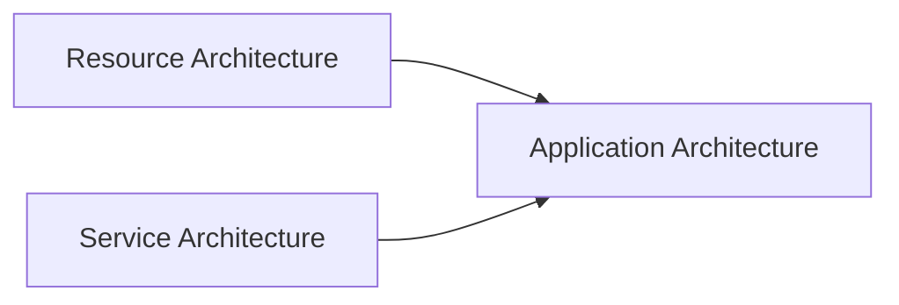
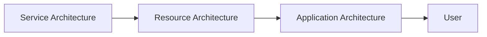

# KJVOnly

# Introduction

Welcome to the KJVOnly project.

This document is intended to provide the context required to understand the application as a whole before reading its source code.

The project contains a significant amount of architectural, implementation, and developer documentation. Each document describes one aspect of the system in detail. This document exists to connect those pieces together into a single mental model.

It is written for anyone who needs to understand how the application is organized, why particular architectural decisions were made, and how future development should proceed.

Whether you are a new contributor, returning to the project after some time away, or using an AI assistant to help implement new features, this document should be the first thing you read.

---

## What This Document Is

This document is not intended to replace the architecture documentation.

Instead, it explains how the architecture fits together.

The architecture documents define individual concepts such as Resource Resolution, Persistence, Workspace Runtime, Public APIs, and Repository Organization.

This document explains how those concepts relate to one another and why they exist.

Think of it as the guide that explains how to think about the project rather than how individual pieces are implemented.

---

## What This Document Is Not

This document is not a specification.

It does not attempt to describe every class, every function, or every implementation detail.

Those responsibilities belong to the architecture documents, implementation documents, and ultimately the source code itself.

Whenever detailed behavior is required, the individual architecture documents should be considered the authoritative reference.

This document focuses on the larger picture.

---

## The Goal

The goal of this document is to build a complete mental model of the application before discussing implementation.

By the time you finish reading, you should understand:

* what the application is trying to accomplish,
* how the major architectural systems fit together,
* why the repository is organized the way it is,
* how different parts of the application collaborate,
* how new functionality should be designed,
* and how future development should evolve without compromising the architecture.

The intent is that the architecture becomes understandable before the source code is explored.

---

## How To Read This Repository

The repository is organized into several layers of documentation.

Each layer answers a different set of questions.

### Project Context

This document.

Explains the overall philosophy of the project, introduces the major architectural concepts, and provides the mental model required to understand the system.

### Principles

The Principles describe the design philosophy used throughout the project.

They explain how architectural decisions are made and establish the rules that guide future development.

These documents should be understood before evaluating implementation decisions.

### Application Architecture

The Application Architecture describes the client application.

It explains concepts such as:

* Workspace Runtime,
* Module Presentation,
* Persistence,
* Background Processing,
* User Interface,
* Public APIs,
* Repository Organization,
* and the relationships between those systems.

These documents describe how the application behaves.

### Resource Architecture

The Resource Architecture defines how application content exists independently of the client.

It explains concepts such as:

* Published Resources,
* Resource Identity,
* Resource Resolution,
* Installation,
* Discovery,
* Persistence,
* Synchronization,
* and Domain Object creation.

These documents describe how application data exists independently of the application itself.

### Implementation

The Implementation documents describe how the current application realizes the architecture.

They bridge the gap between architectural concepts and source code without redefining the architecture itself.

### Developer Guide

The Developer Guide provides implementation guidance, coding conventions, repository practices, and other information useful when contributing to the project.

---

## Reading Order

The recommended reading order is:

1. Project Context
2. Principles
3. Application Architecture
4. Resource Architecture
5. Implementation
6. Developer Guide
7. Source Code

Each layer builds upon the previous one.

Reading the repository in this order establishes the architectural reasoning before introducing implementation details.

---

## A Different Way Of Thinking

Many software projects are organized around technologies.

They begin with frameworks, libraries, patterns, or implementation techniques.

This project intentionally takes a different approach.

The architecture begins with meaning.

Meaning establishes ownership.

Ownership establishes responsibility.

Responsibilities define the Public APIs through which architectural owners collaborate.

Only after those concepts are understood does implementation become important.

Throughout this repository you will see the same pattern repeated consistently:

Meaning

↓

Ownership

↓

Responsibility

↓

Public API

↓

Implementation

This progression is the foundation upon which the rest of the architecture is built.

---

## Why This Matters

Software evolves.

Frameworks change.

Storage technologies change.

Networking changes.

Programming languages change.

Implementation techniques change.

The concepts represented by the application generally change much more slowly.

The purpose of the architecture is to organize software around those enduring concepts rather than around the technologies currently used to implement them.

This makes the application easier to understand, easier to evolve, and easier to maintain over time.

---

## Key Takeaways

* This document explains how to think about the project.
* The architecture documents define the project.
* The implementation documents explain how the architecture is realized.
* The source code implements those ideas.
* The project is organized around meaning and architectural ownership rather than implementation patterns.
* Understanding the architecture first makes every implementation decision easier to reason about.

# Project Overview

The KJVOnly project is a collection of systems that together provide a decentralized, offline-first application platform.

Although these systems are developed together, they each have distinct responsibilities and evolve independently.

Understanding the separation between these responsibilities is fundamental to understanding the architecture.

The project is intentionally organized around these architectural boundaries rather than around technologies or deployment models.

---

## The Three Architectures

The project consists of three primary architectural systems:

1. Application Architecture
2. Resource Architecture
3. Service Architecture

Each architecture solves a different problem.

Conceptually:

The Application consumes capabilities provided by the other two architectures.

Neither the Resource Architecture nor the Service Architecture depends upon the Application.

This separation allows each system to evolve independently while remaining conceptually aligned.

---

## Application Architecture

The Application Architecture describes the client application itself.

Its responsibility is to present Domain capabilities to the user while coordinating the interaction between Runtime, Domains, User Interface, Persistence, Background Processing, and Resource Integration.

The Application is responsible for:

* presenting information,
* responding to user interaction,
* managing application state,
* coordinating background work,
* and providing a consistent user experience.

The Application does not define how content exists outside of the application.

Instead, it consumes Domain Objects produced by the Resource Architecture.

---

## Resource Architecture

The Resource Architecture defines how application content exists independently of the client application.

It describes how information is identified, published, discovered, resolved, installed, updated, and transformed into Domain Objects.

The Resource Architecture is intentionally independent of the Application.

Any application capable of understanding the Resource Architecture could consume the same published content.

This separation allows application behavior and published content to evolve independently.

The Application does not own Resources.

It owns the Domain Objects created from those Resources.

---

## Service Architecture

The Service Architecture describes the external systems that support the application.

Examples include:

* Nostr Relays,
* Blossom servers,
* storage providers,
* synchronization services,
* and other supporting infrastructure.

These services provide capabilities to the Resource Architecture.

The Application communicates with these services through Resource Integration rather than directly coupling application behavior to individual service implementations.

The Service Architecture intentionally remains replaceable.

Supporting technologies may evolve without changing the Application Architecture.

---

## How The Architectures Collaborate

Each architecture has a clearly defined responsibility.

Conceptually:

Service Architecture enables Resource Architecture.

Resource Architecture provides Domain Objects to the Application.

The Application presents those Domain Objects to the user.

Each architecture remains focused on its own responsibilities.

No architecture attempts to absorb the responsibilities of another.

---

## Architectural Independence

Although the three architectures collaborate closely, they should be understood independently.

Changes within one architecture should minimize their impact on the others.

For example:

* introducing a new storage provider should primarily affect the Service Architecture,
* extending Resource Resolution should primarily affect the Resource Architecture,
* redesigning Module Presentation should primarily affect the Application Architecture.

Well-defined boundaries allow each architecture to evolve without unnecessary coupling.

---

## The Documentation

The repository documentation mirrors the architecture.

Each architectural system has its own documentation describing:

* its responsibilities,
* its concepts,
* its boundaries,
* and the decisions that govern its evolution.

Together, these documents form a complete description of the project.

This Project Context document connects those architectural systems into a single mental model.

---

## The Source Code

The repository implementation reflects these architectural boundaries.

The source code should progressively evolve so that repository organization, Public APIs, and implementation responsibilities correspond to the architectural ownership model described throughout the documentation.

Architecture drives repository organization.

Repository organization should not redefine the architecture.

---

## Long-Term Vision

The project is designed so that the three architectures remain useful beyond a single application.

The Resource Architecture should be capable of supporting multiple applications.

The Service Architecture should support different Resource implementations.

The Application Architecture should remain focused on providing the best possible user experience while consuming those capabilities.

This separation encourages reuse, independent evolution, and long-term maintainability.

---

## Key Takeaways

* The project consists of three independent architectural systems.
* The Application consumes Domain Objects produced by the Resource Architecture.
* The Resource Architecture uses capabilities provided by the Service Architecture.
* Each architecture owns a distinct set of responsibilities.
* Architectural boundaries are intentional and should remain visible throughout the repository.
* Repository organization and implementation should reinforce these architectural boundaries rather than obscure them.
