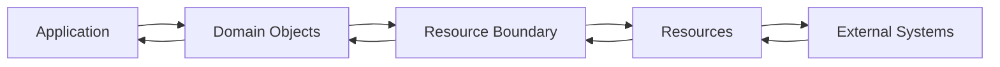
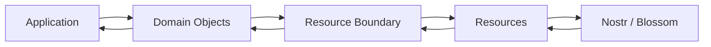

# KJVOnly

# Introduction

Welcome to the KJVOnly project.

This document provides the context required to understand the application before exploring its source code.

The repository contains architecture documents, implementation guides, developer documentation, and source code. Each describes a different aspect of the project. This document connects those pieces together into a single mental model so that the overall design can be understood before individual implementation details are examined.

Whether you are contributing to the project, returning after some time away, or using an AI assistant to assist with development, this document should be your starting point.

Rather than explaining every implementation detail, it explains how the application is organized, why particular architectural decisions were made, and how those decisions relate to one another.

The goal is to understand the architecture first, allowing the source code to become significantly easier to navigate and reason about.

---

## What This Document Is

This document is a guide to the project's architecture.

It does not replace the architecture documentation.

Instead, it explains how the various architectural concepts fit together into a cohesive application.

The architecture documents define individual concepts such as the Workspace Runtime, Domain Resource Model, Resource Boundary, Repository Organization, Public APIs, and Background Processing.

This document explains how those concepts collaborate and why they exist.

Think of it as the guide that teaches you how to think about the project before learning how each individual part is implemented.

---

## What This Document Is Not

This document is not a specification.

It does not attempt to describe every class, function, protocol, or implementation detail.

Those responsibilities belong to the architecture documents, implementation guides, and ultimately the source code itself.

Whenever detailed behavior is required, those documents should be considered the authoritative reference.

This document focuses on the larger architectural picture.

---

## The Goal

The goal of this document is to build a complete mental model of the application before discussing implementation.

By the time you finish reading, you should understand:

* what the application is trying to accomplish,
* how the major architectural concepts fit together,
* why the repository is organized the way it is,
* how different parts of the application collaborate,
* how new functionality should be designed,
* and how the project can continue evolving without compromising its architecture.

The intent is that the architecture becomes understandable before the source code is explored.

---

## How To Read This Repository

The repository is organized into several layers of documentation.

Each layer answers a different set of questions.

### Project Context

This document.

It introduces the application, explains the overall architectural model, and provides the mental framework required to understand the rest of the repository.

### Principles

The Principles establish the design philosophy used throughout the project.

They explain how architectural decisions are made and define the rules that guide future development.

These documents should be understood before evaluating implementation decisions.

### Application Architecture

The Application Architecture describes how the application behaves.

It defines concepts such as:

* Workspace Runtime
* Module Presentation
* Persistence
* Background Processing
* User Interface
* Public APIs
* Repository Organization
* and the relationships between those systems

These documents describe the application's runtime behavior.

### Domain Resource Model

The Domain Resource Model defines the conceptual model used at the application's Resource Boundary.

It explains concepts such as:

* Resources
* Resource Identity
* Resource Representations
* Discovery
* Resolution
* Installation
* Publication
* Synchronization
* Resource Lifecycle
* and Domain Object reconstruction

These documents describe how Domain Objects are represented outside the application and reconstructed back into the application's internal model.

### Implementation

The Implementation documents describe how the current application realizes the documented architecture.

They bridge the gap between architectural concepts and the source code without redefining the architecture itself.

### Developer Guide

The Developer Guide provides implementation guidance, repository conventions, coding standards, migration strategy, and other information useful when contributing to the project.

---

## Reading Order

The recommended reading order is:

1. Project Context
2. Principles
3. Application Architecture
4. Domain Resource Model
5. Implementation
6. Developer Guide
7. Source Code

Each layer builds upon the previous one.

Following this order establishes the architectural reasoning before introducing implementation details.

---

## A Different Way Of Thinking

Many software projects are organized around technologies.

They begin with frameworks, protocols, libraries, or implementation techniques.

This project intentionally takes a different approach.

The architecture begins with meaning.

Meaning establishes ownership.

Ownership establishes responsibility.

Responsibilities define the Public APIs through which architectural owners collaborate.

Only after those concepts are understood does implementation become important.

Throughout this repository the same progression is followed consistently:

```text
Meaning
    ↓
Ownership
    ↓
Responsibility
    ↓
Public API
    ↓
Implementation
```

This progression forms the foundation upon which the rest of the architecture is built.

---

## Why This Matters

Software changes continuously.

Frameworks evolve.

Protocols evolve.

Storage technologies evolve.

Programming languages evolve.

Implementation techniques evolve.

The concepts represented by the application generally change much more slowly.

The purpose of the architecture is to organize software around those enduring concepts rather than around the technologies currently used to implement them.

This makes the application easier to understand, easier to evolve, and easier to maintain over time.

---

## Key Takeaways

* This document explains how to think about the project.
* The architecture documents define the project.
* The implementation documents explain how the architecture is realized.
* The source code implements those ideas.
* The project is organized around meaning, ownership, and architectural responsibility rather than implementation technologies.
* Understanding the architecture first makes every implementation decision easier to reason about.

# Project Overview

The KJVOnly project is an offline-first application built around a single Application Architecture.

The Application Architecture defines the application's runtime behavior, user experience, and Domain model.

Applications operate exclusively on Domain Objects.

Whenever Domain Objects need to exist outside the application, they cross the application's Resource Boundary where they become portable Resources suitable for communication, publication, synchronization, storage, and reconstruction.

This separation allows the application to evolve independently from the technologies used to communicate with external systems while preserving a consistent application model.

---

## A Single Application Architecture

The project intentionally organizes the application around a single architecture.

That architecture defines:

* the Runtime,
* Domains,
* User Interface,
* Background Processing,
* Persistence,
* Public APIs,
* Repository Organization,
* and every other concept required to build and operate the application.

The Application Architecture owns the application's behavior.

Everything inside the application works with Domain Objects.

Those Domain Objects represent the application's internal understanding of the world and remain independent of any particular communication protocol, storage technology, or external service.

---

## Crossing The Resource Boundary

Applications rarely exist in isolation.

Information must eventually be stored, synchronized, shared, imported, exported, or published.

Rather than exposing Domain Objects directly, the application represents them as portable Resources when they cross the Resource Boundary.

This boundary separates the application's internal model from the external representations used to communicate with other systems.

Conceptually:



The Application continues to operate exclusively on Domain Objects.

Only Resources cross the Resource Boundary.

This separation allows the application's internal design to remain stable while external communication mechanisms evolve independently.

---

## The Domain Resource Model

The Domain Resource Model defines the conceptual model used at the Resource Boundary.

It describes how Domain Objects become Resources and how Resources are reconstructed back into Domain Objects.

The model establishes concepts including:

* Resource Identity,
* Resource Representations,
* Discovery,
* Resolution,
* Installation,
* Publication,
* Synchronization,
* Persistence,
* and Resource Lifecycle.

Together these concepts provide a consistent way for applications to communicate Domain Objects without exposing their internal implementation.

The Domain Resource Model defines the boundary.

Individual communication technologies implement it.

---

## Boundary Implementations

The Resource Boundary intentionally remains independent of any particular protocol.

This application primarily implements the boundary using the Nostr protocol together with compatible decentralized services such as Blossom.

Nostr provides decentralized identities, replaceable events, relay infrastructure, and decentralized discovery.

The Domain Resource Model defines how those capabilities are used to represent portable Resources.

Alternative implementations could communicate using technologies such as REST, RPC, GraphQL, local files, or other communication mechanisms while preserving the same Application Architecture and Domain Resource Model.

Changing the communication technology should not require changes to the application's internal Domain model.

---

## Independent Evolution

Separating the Application Architecture from the Resource Boundary allows each to evolve independently.

The Application may introduce new runtime capabilities, presentation models, and user experiences without affecting external communication.

Likewise, boundary implementations may adopt new protocols, storage technologies, or synchronization mechanisms without requiring changes to the application's internal architecture.

This separation reduces coupling while allowing both sides of the boundary to evolve at their own pace.

---

## Repository Organization

The repository mirrors these responsibilities.

The Application Architecture documents describe how the application behaves.

The Domain Resource Model documents describe the concepts used at the Resource Boundary.

Implementation documents describe how this application realizes those concepts using Nostr and compatible decentralized services.

Together these documents describe the complete system while keeping architectural responsibilities clearly separated.

---

## Long-Term Vision

The architecture is designed so that application behavior remains independent of communication technology.

Future versions of the application may introduce additional Resource Boundary implementations without changing the application's internal architecture.

Likewise, the Domain Resource Model may evolve independently while preserving compatibility with existing applications.

The goal is to ensure that Domain Objects remain the central concept of the application while allowing communication technologies to evolve naturally over time.

---

## Key Takeaways

* The project is built around a single Application Architecture.
* Applications operate exclusively on Domain Objects.
* Domain Objects cross the Resource Boundary as portable Resources.
* The Domain Resource Model defines the concepts used at the Resource Boundary.
* The Resource Boundary can be implemented using different communication technologies.
* This application primarily implements the boundary using Nostr together with compatible decentralized services.
* Separating the Application Architecture from the Resource Boundary allows both to evolve independently.

# Design Philosophy

Every software project eventually accumulates complexity.

New features are added.

Requirements evolve.

Technologies change.

Over time, maintaining a system becomes less about implementing new functionality and more about understanding how existing functionality fits together.

The architecture of this project was designed with that observation in mind.

Rather than organizing the application around frameworks, libraries, protocols, or implementation techniques, the architecture is organized around stable application concepts that are expected to remain meaningful throughout the lifetime of the project.

The goal is not simply to produce working software.

The goal is to produce software whose structure continues to make sense as it evolves.

---

## Architecture Before Implementation

Implementation changes continuously.

Architecture should change much more slowly.

Programming languages evolve.

Frameworks are replaced.

Communication protocols evolve.

Storage technologies improve.

User interface libraries come and go.

These changes are expected.

The architecture intentionally separates these implementation concerns from the responsibilities they fulfill.

For this reason, architectural discussions should begin without reference to specific technologies whenever practical.

The implementation exists to realize the architecture.

The architecture should not emerge from the implementation.

---

## Organizing Around Meaning

The project is organized around concepts that represent application meaning rather than technical implementation.

Examples include:

* Workspace Runtime
* Domains
* User Interface
* Background Processing
* Persistence
* Public APIs
* Repository Organization

These concepts describe responsibilities that exist regardless of how they are implemented.

Implementation details such as Components, Services, Stores, Workers, Events, Factories, Repositories, or communication protocols exist within those architectural owners.

They support the architecture.

They do not define it.

This distinction allows implementation to evolve without requiring the conceptual architecture to be rediscovered.

---

## Ownership Creates Clarity

Every responsibility should have a clearly identifiable owner.

Ownership establishes:

* where behavior belongs,
* where implementation should reside,
* where changes should be made,
* and how other parts of the application collaborate.

When ownership is clear, repository organization becomes straightforward.

Architectural boundaries become obvious.

Implementation naturally follows the structure established by those boundaries.

Many implementation decisions become self-evident simply because ownership has already been established.

---

## Public APIs Enable Collaboration

Architectural owners collaborate through explicit Public APIs.

Public APIs expose behavior rather than implementation.

Each architectural owner remains responsible for its own concepts while exposing only the capabilities required by other owners.

This allows independently evolving parts of the application to collaborate without creating unnecessary implementation dependencies.

Clear Public APIs preserve architectural boundaries while making collaboration intentional.

---

## Stable Concepts

Technology changes faster than application concepts.

The project therefore builds its architecture around ideas expected to remain stable over time.

For example:

* Bible Chapters remain Bible Chapters regardless of storage technology.
* Notes remain Notes regardless of presentation framework.
* Workspaces remain Workspaces regardless of layout implementation.
* Domain Objects remain Domain Objects regardless of how they cross the application's Resource Boundary.
* Resources remain Resources regardless of the communication protocol used to exchange them.

By organizing around these enduring concepts, implementation can evolve without requiring the architecture to be rediscovered.

---

## Boundaries Protect The Architecture

Architectural boundaries exist to separate responsibilities rather than technologies.

The Application Architecture defines how the application behaves.

The Resource Boundary defines how Domain Objects are represented outside the application.

Communication technologies such as Nostr, REST, RPC, GraphQL, or local file systems are implementations of that boundary rather than architectural owners themselves.

Keeping these responsibilities separate allows application behavior and external communication to evolve independently.

---

## Incremental Evolution

The architecture is designed to support continuous evolution rather than periodic rewrites.

Existing implementation is not discarded simply because a better organizational model has been developed.

Instead, architectural ownership is established first.

Implementation then gradually migrates toward that ownership over time.

This approach minimizes disruption while allowing the repository to steadily converge toward the documented architecture.

Evolution is preferred over replacement whenever practical.

---

## Simplicity Through Separation

Complexity is reduced by allowing each architectural owner to focus on a single area of responsibility.

The Workspace Runtime manages runtime behavior.

Domains own application meaning.

The User Interface presents information.

The Resource Boundary represents Domain Objects outside the application.

Background Processing performs deferred work.

Technical Infrastructure provides implementation capabilities.

Each owner has a limited and well-defined set of responsibilities.

Together they form a cohesive application.

Separating responsibilities in this way allows individual parts of the system to remain understandable without requiring knowledge of the entire application.

---

## Architecture As A Communication Tool

Architecture exists to communicate.

A well-designed architecture should allow someone unfamiliar with the repository to understand:

* the major responsibilities,
* how those responsibilities collaborate,
* where new functionality belongs,
* and how changes should be introduced.

Repository organization, documentation, Public APIs, and source code should reinforce the same architectural model.

When these representations remain aligned, understanding the system becomes significantly easier.

---

## Designing For The Future

Every architectural decision should consider the long-term evolution of the project.

Questions such as:

* Will this responsibility still exist in five years?
* Does this concept represent application meaning?
* Does this responsibility have a clear owner?
* Can this implementation evolve independently?
* Does this change preserve architectural boundaries?

are often more valuable than questions about immediate implementation.

Architectural decisions should optimize for long-term clarity rather than short-term convenience.

The architecture should make future change easier rather than merely accommodating present requirements.

---

## Key Takeaways

* The architecture is organized around enduring application concepts rather than implementation technologies.
* Implementation fulfills architectural responsibilities rather than defining them.
* Clear ownership produces clear architectural boundaries.
* Public APIs provide intentional collaboration between independently owned parts of the application.
* Stable concepts should outlive the technologies used to implement them.
* The Resource Boundary separates application behavior from external communication.
* The project is intended to evolve incrementally rather than through periodic rewrites.
* Good architecture makes the application easier to understand, easier to extend, and easier to maintain over time.

# System Overview

The KJVOnly project is built around a single Application Architecture.

The Application Architecture defines the application's runtime behavior, user experience, and Domain model.

Applications operate exclusively on Domain Objects.

When Domain Objects must exist outside the application, they cross the application's **Resource Boundary**.

The Resource Boundary defines how Domain Objects are represented as portable Resources suitable for storage, publication, discovery, synchronization, and reconstruction.

This application primarily implements its Resource Boundary using the Nostr protocol together with compatible decentralized services such as Blossom.

The boundary model is intentionally independent of the underlying protocol, allowing alternative implementations using technologies such as REST, RPC, or other communication mechanisms without affecting the internal Application Architecture.

---

## Application Architecture

The Application Architecture defines how the application behaves.

It includes concepts such as:

* Workspace Runtime
* Domains
* Module Presentation
* User Interface
* Background Processing
* Persistence
* Application Events
* Public APIs
* Repository Organization

Applications own Domain Objects.

Domain Objects represent the application's internal model and are the only objects used throughout runtime.

The Application Architecture is intentionally independent of how Domain Objects are communicated beyond the application boundary.

---

## The Resource Boundary

The Resource Boundary is the point where Domain Objects leave the application.

Rather than exposing Domain Objects directly, applications represent them as portable Resources.

Resources provide a protocol-independent representation suitable for communication with external systems.

The Domain Resource Model defines this mapping between internal Domain Objects and external Resources.

The Resource Boundary is responsible for concepts including:

* Resource Identity
* Resource Representations
* Discovery
* Resolution
* Installation
* Publication
* Synchronization
* Persistence
* Resource Lifecycle

Together these concepts define how portable Resources behave independently of the application's internal implementation.

---

## Boundary Implementations

The Resource Boundary is independent of any particular communication protocol.

This application primarily implements the boundary using Nostr together with compatible decentralized services such as Blossom.

Nostr provides decentralized identities, replaceable events, relay infrastructure, and decentralized discovery.

The Resource Boundary defines how these capabilities are used to represent Domain Objects as portable Resources.

Alternative implementations could communicate using REST, RPC, GraphQL, local files, or other protocols while preserving the same Domain Resource Model.

Changing the boundary implementation does not require changes to the internal Application Architecture.

---

## Information Flow

Information moves through the system by crossing the Resource Boundary.

Conceptually:



Within the application, all behavior operates on Domain Objects.

Only Resources cross the Resource Boundary.

External systems never interact directly with the application's internal Domain Objects.

---

## Domain Participation

Every Domain participates in the Resource Boundary.

Each Domain defines:

* its Domain Objects,
* how those Domain Objects become Resources,
* how Resources are reconstructed into Domain Objects,
* and how published Resources relate to local application behavior.

For example, the Bible Domain defines how Bible Chapters cross the Resource Boundary.

The Notes Domain defines how Notes cross the Resource Boundary.

The Reading Plans Domain defines how Reading Plans cross the Resource Boundary.

The Domain Resource Model provides the common structure.

Each Domain provides its own application semantics.

---

## Independent Evolution

The separation between the Application Architecture and the Resource Boundary allows each to evolve independently.

The Application Architecture may introduce new runtime behavior, presentation models, and user experiences without affecting the boundary.

Likewise, the Resource Boundary may adopt new communication protocols or storage technologies without changing the application's internal Domain model.

This separation keeps application behavior independent from external communication while preserving a consistent model for portable Resources.

---

## Repository Alignment

The repository mirrors these responsibilities.

Application documentation describes the runtime architecture and application behavior.

The Domain Resource Model defines the concepts used at the Resource Boundary.

Implementation documentation describes how this application realizes the Resource Boundary using Nostr and compatible decentralized services.

Together these documents describe the complete platform while keeping responsibilities clearly separated.

---

## Key Takeaways

* The project consists of a single Application Architecture.
* Applications operate exclusively on Domain Objects.
* Domain Objects cross the Resource Boundary as portable Resources.
* The Domain Resource Model defines the mapping between Domain Objects and Resources.
* This application primarily implements the Resource Boundary using Nostr and compatible decentralized services.
* Alternative boundary implementations may use different communication protocols without affecting the internal Application Architecture.
* Separating the Application Architecture from the Resource Boundary allows both to evolve independently.
