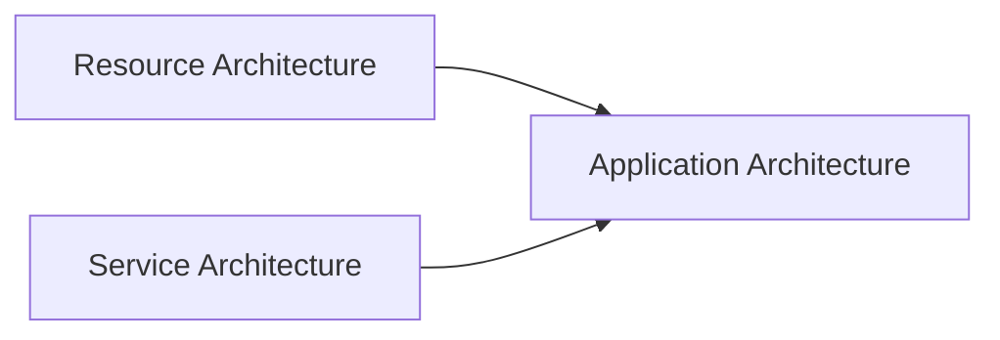
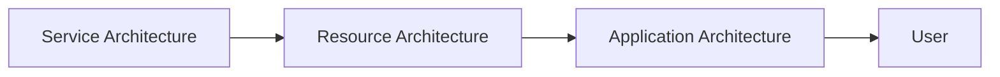
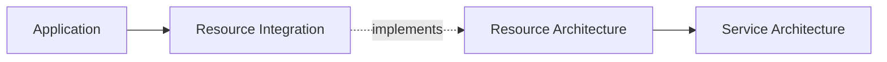
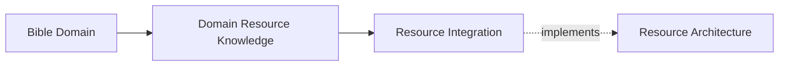
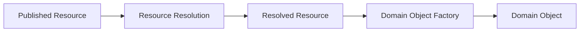
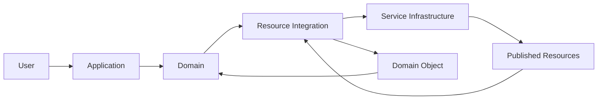

# KJVOnly

# Introduction

Welcome to the KJVOnly project.

This document is intended to provide the context required to understand the application as a whole before reading its source code.

The project contains a significant amount of architectural, implementation, and developer documentation. Each document describes one aspect of the system in detail. This document exists to connect those pieces together into a single mental model.

It is written for anyone who needs to understand how the application is organized, why particular architectural decisions were made, and how future development should proceed.

Whether you are a new contributor, returning to the project after some time away, or using an AI assistant to help implement new features, this document should be the first thing you read.

---

## What This Document Is

This document is not intended to replace the architecture documentation.

Instead, it explains how the architecture fits together.

The architecture documents define individual concepts such as Resource Resolution, Persistence, Workspace Runtime, Public APIs, and Repository Organization.

This document explains how those concepts relate to one another and why they exist.

Think of it as the guide that explains how to think about the project rather than how individual pieces are implemented.

---

## What This Document Is Not

This document is not a specification.

It does not attempt to describe every class, every function, or every implementation detail.

Those responsibilities belong to the architecture documents, implementation documents, and ultimately the source code itself.

Whenever detailed behavior is required, the individual architecture documents should be considered the authoritative reference.

This document focuses on the larger picture.

---

## The Goal

The goal of this document is to build a complete mental model of the application before discussing implementation.

By the time you finish reading, you should understand:

* what the application is trying to accomplish,
* how the major architectural systems fit together,
* why the repository is organized the way it is,
* how different parts of the application collaborate,
* how new functionality should be designed,
* and how future development should evolve without compromising the architecture.

The intent is that the architecture becomes understandable before the source code is explored.

---

## How To Read This Repository

The repository is organized into several layers of documentation.

Each layer answers a different set of questions.

### Project Context

This document.

Explains the overall philosophy of the project, introduces the major architectural concepts, and provides the mental model required to understand the system.

### Principles

The Principles describe the design philosophy used throughout the project.

They explain how architectural decisions are made and establish the rules that guide future development.

These documents should be understood before evaluating implementation decisions.

### Application Architecture

The Application Architecture describes the application.

It explains concepts such as:

* Workspace Runtime,
* Module Presentation,
* Persistence,
* Background Processing,
* User Interface,
* Public APIs,
* Repository Organization,
* and the relationships between those systems.

These documents describe how the application behaves.

### Resource Architecture

The Resource Architecture defines how Domain Objects exists independently of the application.

It explains concepts such as:

* Published Resources,
* Resource Identity,
* Resource Resolution,
* Installation,
* Discovery,
* Persistence,
* Synchronization,
* and Domain Object creation.

These documents describe how application data exists independently of the application itself.

### Implementation

The Implementation documents describe how the current application realizes the architecture.

They bridge the gap between architectural concepts and source code without redefining the architecture itself.

### Developer Guide

The Developer Guide provides implementation guidance, coding conventions, repository practices, and other information useful when contributing to the project.

---

## Reading Order

The recommended reading order is:

1. Project Context
2. Principles
3. Application Architecture
4. Resource Architecture
5. Implementation
6. Developer Guide
7. Source Code

Each layer builds upon the previous one.

Reading the repository in this order establishes the architectural reasoning before introducing implementation details.

---

## A Different Way Of Thinking

Many software projects are organized around technologies.

They begin with frameworks, libraries, patterns, or implementation techniques.

This project intentionally takes a different approach.

The architecture begins with meaning.

Meaning establishes ownership.

Ownership establishes responsibility.

Responsibilities define the Public APIs through which architectural owners collaborate.

Only after those concepts are understood does implementation become important.

Throughout this repository you will see the same pattern repeated consistently:

Meaning

↓

Ownership

↓

Responsibility

↓

Public API

↓

Implementation

This progression is the foundation upon which the rest of the architecture is built.

---

## Why This Matters

Software evolves.

Frameworks change.

Storage technologies change.

Networking changes.

Programming languages change.

Implementation techniques change.

The concepts represented by the application generally change much more slowly.

The purpose of the architecture is to organize software around those enduring concepts rather than around the technologies currently used to implement them.

This makes the application easier to understand, easier to evolve, and easier to maintain over time.

---

## Key Takeaways

* This document explains how to think about the project.
* The architecture documents define the project.
* The implementation documents explain how the architecture is realized.
* The source code implements those ideas.
* The project is organized around meaning and architectural ownership rather than implementation patterns.
* Understanding the architecture first makes every implementation decision easier to reason about.

# Project Overview

The KJVOnly project is a collection of systems that together provide a decentralized, offline-first application platform.

Although these systems are developed together, they each have distinct responsibilities and evolve independently.

Understanding the separation between these responsibilities is fundamental to understanding the architecture.

The project is intentionally organized around these architectural boundaries rather than around technologies or deployment models.

---

## The Three Architectures

The project consists of three primary architectural systems:

1. Application Architecture
2. Resource Architecture
3. Service Architecture

Each architecture solves a different problem.

Conceptually:

The Application consumes capabilities provided by the other two architectures.

Neither the Resource Architecture nor the Service Architecture depends upon the Application.

This separation allows each system to evolve independently while remaining conceptually aligned.

---

## Application Architecture

The Application Architecture describes the application itself.

Its responsibility is to present Domain capabilities to the user while coordinating the interaction between Runtime, Domains, User Interface, Persistence, Background Processing, and Resource Integration.

The Application is responsible for:

* presenting information,
* responding to user interaction,
* managing application state,
* coordinating background work,
* and providing a consistent user experience.

The Application does not define how content exists outside of the application.

Instead, it consumes Domain Objects produced by the Resource Architecture.

---

## Resource Architecture

The Resource Architecture defines how Domain Objects exists independently of the application.

It describes how information is identified, published, discovered, resolved, installed, updated, and transformed into Domain Objects.

The Resource Architecture is intentionally independent of the Application.

Any application capable of understanding the Resource Architecture could consume the same published content.

This separation allows application behavior and published content to evolve independently.

The Application does not own Resources.

It owns the Domain Objects created from those Resources.

---

## Service Architecture

The Service Architecture describes the external systems that support the application.

Examples include:

* Nostr Relays,
* Blossom servers,
* storage providers,
* synchronization services,
* and other supporting infrastructure.

These services provide capabilities to the Resource Architecture.

The Application communicates with these services through Resource Integration rather than directly coupling application behavior to individual service implementations.

The Service Architecture intentionally remains replaceable.

Supporting technologies may evolve without changing the Application Architecture.

---

## How The Architectures Collaborate

Each architecture has a clearly defined responsibility.

Conceptually:

Service Architecture enables Resource Architecture.

Resource Architecture provides Domain Objects to the Application.

The Application presents those Domain Objects to the user.

Each architecture remains focused on its own responsibilities.

No architecture attempts to absorb the responsibilities of another.

---

## Architectural Independence

Although the three architectures collaborate closely, they should be understood independently.

Changes within one architecture should minimize their impact on the others.

For example:

* introducing a new storage provider should primarily affect the Service Architecture,
* extending Resource Resolution should primarily affect the Resource Architecture,
* redesigning Module Presentation should primarily affect the Application Architecture.

Well-defined boundaries allow each architecture to evolve without unnecessary coupling.

---

## The Documentation

The repository documentation mirrors the architecture.

Each architectural system has its own documentation describing:

* its responsibilities,
* its concepts,
* its boundaries,
* and the decisions that govern its evolution.

Together, these documents form a complete description of the project.

This Project Context document connects those architectural systems into a single mental model.

---

## The Source Code

The repository implementation reflects these architectural boundaries.

The source code should progressively evolve so that repository organization, Public APIs, and implementation responsibilities correspond to the architectural ownership model described throughout the documentation.

Architecture drives repository organization.

Repository organization should not redefine the architecture.

---

## Long-Term Vision

The project is designed so that the three architectures remain useful beyond a single application.

The Resource Architecture should be capable of supporting multiple applications.

The Service Architecture should support different Resource implementations.

The Application Architecture should remain focused on providing the best possible user experience while consuming those capabilities.

This separation encourages reuse, independent evolution, and long-term maintainability.

---

## Key Takeaways

* The project consists of three independent architectural systems.
* The Application consumes Domain Objects produced by the Resource Architecture.
* The Resource Architecture uses capabilities provided by the Service Architecture.
* Each architecture owns a distinct set of responsibilities.
* Architectural boundaries are intentional and should remain visible throughout the repository.
* Repository organization and implementation should reinforce these architectural boundaries rather than obscure them.

# Design Philosophy

Every software project eventually accumulates complexity.

New features are added.

Requirements evolve.

Technologies change.

Over time, the difficulty of maintaining a system rarely comes from implementing new functionality. More often, it comes from understanding how existing functionality fits together.

The architecture of this project was designed with that observation in mind.

Rather than organizing the application around implementation techniques, frameworks, or programming patterns, the architecture is organized around stable application concepts that are expected to remain meaningful throughout the lifetime of the project.

The goal is not simply to produce working software.

The goal is to produce software whose structure continues to make sense as it evolves.

---

## Architecture Before Implementation

Implementation changes continuously.

Architecture should change much more slowly.

Programming languages evolve.

Frameworks are replaced.

Storage technologies improve.

Networking protocols mature.

User interface libraries come and go.

These changes are expected.

The architecture intentionally separates these implementation concerns from the responsibilities they fulfill.

For this reason, architectural discussions should begin without reference to specific technologies whenever practical.

The implementation exists to realize the architecture.

The architecture should not emerge from the implementation.

---

## Organizing Around Meaning

The project is organized around concepts that represent application meaning rather than technical implementation.

Examples include:

* Workspace Runtime,
* Domains,
* User Interface,
* Resource Integration,
* Background Processing,
* and Technical Infrastructure.

These concepts describe responsibilities that exist regardless of how they are implemented.

Implementation techniques such as Services, Stores, Components, Workers, Events, Factories, and Repositories exist within those architectural owners.

They support the architecture.

They do not define it.

This distinction keeps the architecture stable even when implementation evolves.

---

## Ownership Creates Clarity

Every responsibility should have a clearly identifiable owner.

Ownership establishes:

* where behavior belongs,
* where implementation should reside,
* where changes should be made,
* and how other parts of the application should collaborate.

When ownership is clear, repository organization becomes straightforward.

Architectural boundaries become easier to understand.

Implementation naturally follows the structure established by the architecture.

Many implementation decisions become obvious simply because ownership has already been established.

---

## Explicit Collaboration

Architectural owners should collaborate deliberately.

Responsibilities are shared through explicit Public APIs rather than through unrestricted implementation dependencies.

Each owner remains responsible for its own concepts while exposing only the capabilities required by other architectural owners.

This allows independently evolving parts of the application to collaborate without becoming tightly coupled.

Well-defined boundaries make both the architecture and the repository easier to understand.

---

## Stable Concepts

Technology changes faster than application concepts.

The project therefore attempts to build its architecture around ideas that are expected to remain stable over time.

For example:

* Bible chapters remain Bible chapters regardless of storage technology.
* Notes remain Notes regardless of presentation framework.
* Workspaces remain Workspaces regardless of layout implementation.
* Domain Objects remain Domain Objects regardless of how Resources are published or transported.

By organizing around these enduring concepts, implementation can evolve without requiring the conceptual architecture to be rediscovered.

---

## Incremental Evolution

The architecture is designed to support continuous evolution rather than periodic rewrites.

Existing implementation is not discarded simply because a better organizational model has been developed.

Instead, improvements are introduced incrementally.

Architectural ownership is established first.

Implementation then migrates toward that ownership over time.

This approach minimizes disruption while allowing the repository to steadily converge toward the documented architecture.

Evolution is preferred over replacement whenever practical.

---

## Simplicity Through Separation

Complexity is reduced by allowing each architectural owner to focus on a single area of responsibility.

The Workspace Runtime manages runtime behavior.

Domains own application meaning.

The User Interface presents information.

Resource Integration bridges the Application and the Resource Architecture.

Background Processing performs deferred application work.

Technical Infrastructure provides implementation capabilities.

Each owner has a limited set of responsibilities.

Together they form a cohesive application.

Separating responsibilities in this way allows individual parts of the system to remain understandable without requiring knowledge of the entire application.

---

## Architecture As A Communication Tool

Architecture exists to communicate.

A well-designed architecture should allow someone unfamiliar with the codebase to understand:

* the major responsibilities,
* how those responsibilities collaborate,
* where new functionality belongs,
* and how changes should be introduced.

Repository organization, documentation, and source code should reinforce the same architectural model.

When these representations remain aligned, understanding the system becomes significantly easier.

---

## Designing For The Future

Every architectural decision should consider the long-term evolution of the project.

Questions such as:

* Will this responsibility still exist in five years?
* Is this concept tied to a particular technology?
* Does this abstraction represent application meaning?
* Can this implementation evolve independently?

are often more valuable than questions about immediate implementation.

Architectural decisions should optimize for long-term clarity rather than short-term convenience.

The architecture should make future change easier rather than merely accommodating present requirements.

---

## Key Takeaways

* The architecture is organized around enduring application concepts rather than implementation technologies.
* Implementation fulfills architectural responsibilities rather than defining them.
* Clear ownership produces clear boundaries.
* Public APIs provide explicit collaboration between independently owned parts of the application.
* Stable concepts should outlive the technologies used to implement them.
* The project is intended to evolve incrementally rather than through periodic rewrites.
* Architecture should make the application easier to understand, easier to extend, and easier to maintain over time.

# System Overview

The KJVOnly project is built from three complementary architectural systems:

* Application Architecture
* Resource Architecture
* Service Architecture

Each architecture has a distinct purpose.

Together they describe the complete system.

The Application provides the user experience.

The Resource Architecture defines how application data exists independently of any particular application.

The Service Architecture provides the external capabilities required to publish, discover, retrieve, and synchronize those resources.

These architectures are intentionally independent while remaining closely integrated.

---

## Three Independent Architectures

Each architecture answers a different set of questions.

### Application Architecture

How should the application behave?

### Resource Architecture

How should application data exist independently of the application?

### Service Architecture

How should published resources be transported, stored, and discovered?

Each architecture focuses on its own responsibilities.

No architecture attempts to absorb the responsibilities of another.

---

## The Application

The Application is responsible for everything the user experiences.

It owns concepts such as:

* Workspace Runtime,
* Domains,
* Module Presentation,
* User Interface,
* Persistence,
* Background Processing,
* and Resource Integration.

The Application is also responsible for creating and managing Domain Objects.

Domain Objects represent the application's understanding of information.

They are the primary concepts consumed throughout the application.

---

## The Resource Architecture

The Resource Architecture defines the model by which application information exists outside the application.

It establishes concepts such as:

* Published Resources,
* Resource Identity,
* Discovery,
* Resolution,
* Resource Representations,
* Installation,
* Versioning,
* and Persistence.

These concepts describe **how Resources exist**.

They do not describe how a particular application chooses to use those Resources.

The Resource Architecture is intentionally application independent.

Multiple applications may consume the same Published Resources while creating entirely different Domain Objects.

---

## The Service Architecture

The Service Architecture provides the external capabilities required by the Resource Architecture.

Examples include:

* Nostr Relays,
* Blossom servers,
* storage providers,
* synchronization services,
* and other supporting infrastructure.

These services provide transport, storage, and communication.

They intentionally do not define application behavior.

Specific service implementations may evolve without changing either the Application Architecture or the Resource Architecture.

---

## Resource Integration

Resource Integration is the part of the Application responsible for implementing the Resource Architecture.

Conceptually:

Resource Integration allows the Application to participate in the Resource lifecycle while preserving the boundaries defined by the Resource Architecture.

Its responsibilities include coordinating:

* discovery,
* publication,
* installation,
* refresh,
* synchronization,
* installation state,
* and Resource lifecycle management.

Although these operations follow the rules defined by the Resource Architecture, they remain Application responsibilities.

---

## Domain Participation

Each Domain participates in the Resource Architecture through its own Resource knowledge.

For example, a Domain understands:

* which Published Resources it consumes,
* how those Resources are identified,
* how they should be discovered,
* how they become Domain Objects,
* how Domain Objects should be serialized,
* and which Resources should be published.

Conceptually:

The Domain owns the mapping between Published Resources and Domain Objects.

Generic Resource infrastructure cannot provide this knowledge because it belongs to the Domain itself.

---

## Domain Objects

Domain Objects form the boundary between generic Resource concepts and application behavior.

Published Resources are transformed into Domain Objects by application-owned behavior.

Conceptually:

The Domain Object Factory belongs to the Domain.

Likewise, the serializer responsible for publishing a Domain Object also belongs to the Domain.

The Resource Architecture defines the rules governing Resources.

The Domain defines how its application concepts participate within those rules.

---

## Information Flow

Information moves through several cooperating architectural systems.

Conceptually:

The Application initiates work.

Domains determine what information they require.

Resource Integration implements the Resource Architecture to retrieve and publish Resources.

Service Infrastructure communicates with external systems.

The Domain ultimately creates and consumes Domain Objects.

Each architectural system contributes its own responsibilities without taking ownership of another's.

---

## Independent Evolution

Because responsibilities are clearly separated, each architecture can evolve independently.

For example:

* a new Resource Representation may be introduced without changing Domain behavior,
* a different relay implementation may replace the existing infrastructure,
* a Domain may introduce additional Resource types,
* or the Workspace Runtime may evolve without affecting Resource Resolution.

This separation allows the project to grow incrementally while preserving clear architectural boundaries.

---

## Repository Alignment

The repository is organized to reflect these architectural responsibilities.

Documentation, repository organization, Public APIs, and implementation should all communicate the same ownership model.

The architecture should remain visible throughout the source code.

Repository organization should reinforce the architecture rather than obscure it.

---

## Key Takeaways

* The project consists of three complementary architectural systems.
* The Resource Architecture defines how Resources exist independently of any application.
* The Application implements the Resource Architecture through Resource Integration.
* Domains contribute the application-specific knowledge required to discover, interpret, publish, and serialize their own Resources.
* Domains own the creation of Domain Objects.
* The Service Architecture provides the external capabilities used to implement the Resource Architecture.
* Each architecture owns its own responsibilities while collaborating through explicit architectural boundaries.
