# ADR 0005 — Resource Discovery

**Status**

Accepted

---

# Problem

KJVOnly resources are distributed through Nostr.

A client must be able to find available resources without knowing every complete Resource Identifier in advance.

Resources may be discovered:

* directly by Resource Identity,
* by Resource Classification,
* from a known publisher,
* through descriptor collections,
* or through references contained in already discovered resources.

Discovery must remain separate from:

* publisher trust,
* resource resolution,
* installation,
* update policy,
* local persistence,
* and synchronization.

Without a clear boundary, querying relays can become coupled to decisions about which publishers are trusted, which resources should be installed, and which revisions should be followed automatically.

---

# Decision

Resource Discovery finds Resource Representations published by known publishers.


Discovery is responsible for:

* querying Nostr relays,
* filtering by publisher,
* filtering by Resource Identity,
* filtering by Resource Classification,
* discovering current addressable-event revisions,
* following references from descriptor collections,
* deduplicating discovered resources,
* and reporting discovery failures.

Discovery ends when Resource Representations and their identities are known.

It does not retrieve external content or install anything.

---

# Discovery Boundary

Resource Discovery operates on Nostr event metadata and validated Resource Representations.

It receives one or more known discovery inputs, such as:

```text
publisher public key

published Resource Identity

Resource Classification

descriptor reference

direct event reference
```

It produces discovered Resource Representations.

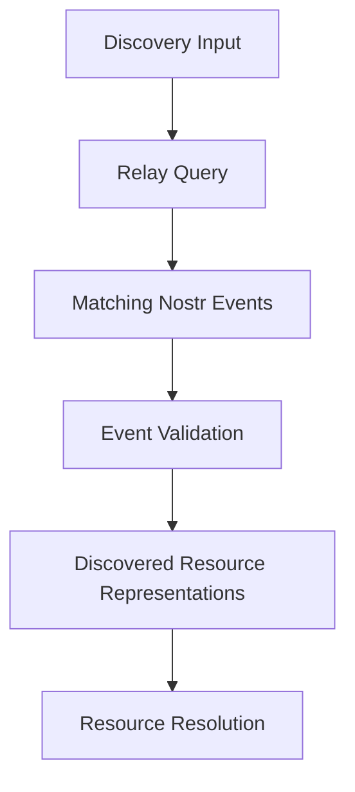

The Event Model owns Nostr event validation.

Resource Resolution owns content retrieval and integrity verification.

Resource Installation owns parsing and persistence.

---

# Known Publishers

Discovery begins from publishers already known to the client.

A known publisher may come from:

* built-in application configuration,
* user configuration,
* previously installed publisher metadata,
* an import archive,
* a direct Resource reference,
* or another application workflow.

This ADR does not determine whether a publisher is trusted.

Trust policy is defined in ADR 0009.

Discovery may technically find resources from any supplied publisher key, but the caller decides which publisher keys are allowed to act as discovery roots.

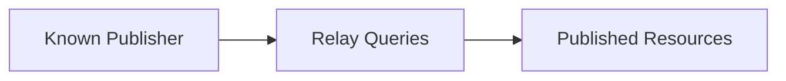

---

# Discovery Roots

A Discovery Root is the starting point for a discovery operation.

Supported roots include:

1. Publisher
2. Published Resource Identity
3. Resource Classification
4. Descriptor Reference

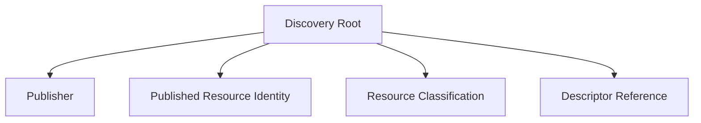

Different roots produce different relay queries, but all successful queries produce the same conceptual result: discovered Resource Representations.

---

# Direct Resource Discovery

A resource may be discovered directly when its complete published identity is known.

The complete Nostr address is:

```text
kind + publisher public key + d tag
```

For application-level discovery, the important values are:

```text
publisher public key + Resource Identifier
```

A direct query filters by:

* publisher public key,
* addressable resource kind,
* and exact `d` tag.

Conceptually:

```json
{
  "kinds": [37770],
  "authors": ["<publisher-pubkey>"],
  "#d": ["kjvonly/bible/chapters/kjv"]
}
```

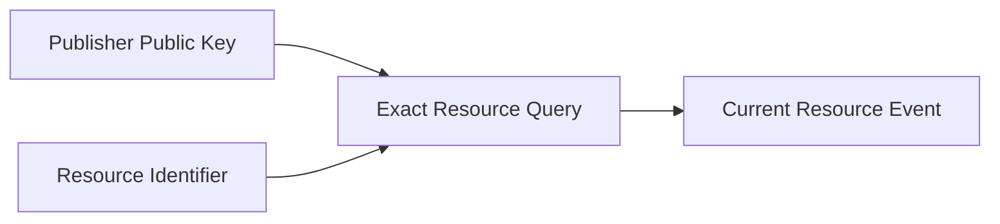

Direct discovery is the preferred method when a complete Resource Identity is already known.

---

# Classification Discovery

A client may discover a class of related resources using the Resource Classification tag.

The classification value follows:

```text
namespace/domain/resource-type
```

Examples include:

```text
kjvonly/bible/chapters

kjvonly/plans/readings

kjvonly/search/bible
```

A classification query filters by:

* one or more publisher public keys,
* the addressable resource kind,
* and the exact classification tag.

Conceptually:

```json
{
  "kinds": [37770],
  "authors": ["<publisher-pubkey>"],
  "#t": ["kjvonly/plans/readings"]
}
```

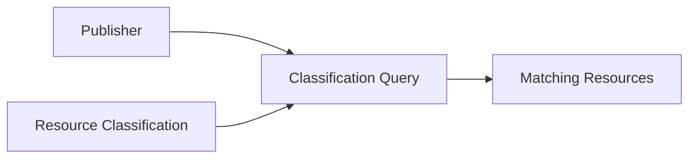

Classification discovery answers:

> Which resources of this class has this publisher published?

It does not determine whether those resources should be installed.

---

# Publisher Discovery

A client may query all application resources published by a known publisher.

Conceptually:

```json
{
  "kinds": [37770],
  "authors": ["<publisher-pubkey>"]
}
```

This broad query may be useful for:

* publisher browsing,
* administrative tools,
* diagnostics,
* small publisher catalogs,
* or initial discovery when no narrower classification is known.

Broad publisher queries should not be the default when a narrower Resource Classification is available.

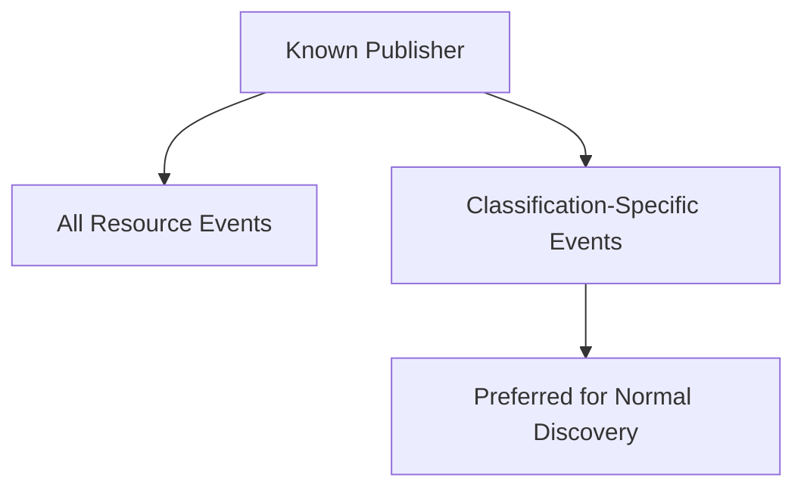

Narrow queries reduce relay load, transferred data, and client-side filtering.

---

# Addressable Event Revisions

Application resources are published as addressable Nostr events.

A published Resource Identity may have multiple Event Revisions over time.

Discovery returns the current valid revision available from the queried relays.

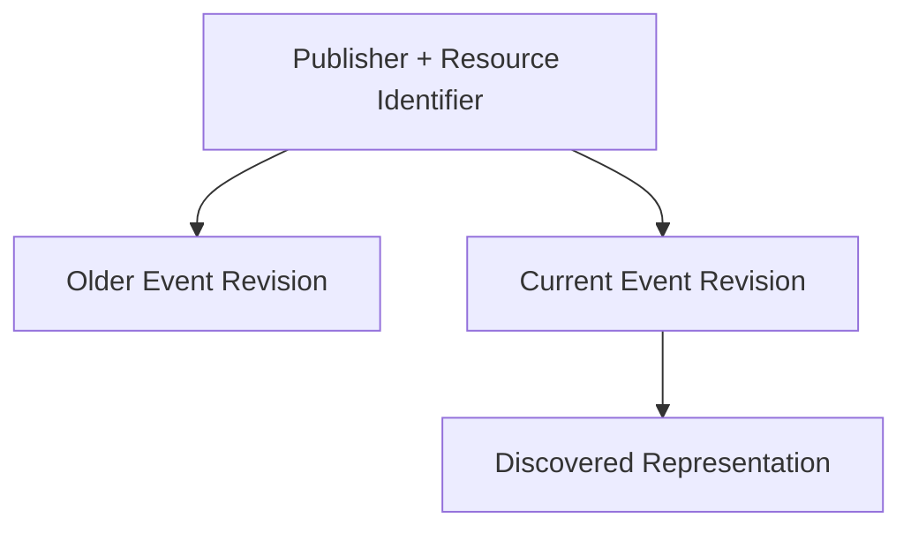

When multiple candidate events are returned for the same address, discovery selects the latest valid revision according to Nostr addressable-event semantics.

Event identifiers remain revision metadata.

They do not create new Resource Identities.

---

# Relay Queries

Resource Discovery uses relay filters that are as narrow as the discovery input allows.

The primary filters are:

```text
authors

kinds

#d

#t

ids
```

Typical query shapes include:

| Discovery goal                           | Filters                  |
| ---------------------------------------- | ------------------------ |
| Exact published resource                 | `authors`, `kinds`, `#d` |
| Resources of one class                   | `authors`, `kinds`, `#t` |
| All application resources from publisher | `authors`, `kinds`       |
| Exact event revision                     | `ids`                    |

Queries should include publisher filtering whenever the publisher is known.

A classification-only query across unknown publishers is not the normal application discovery path.

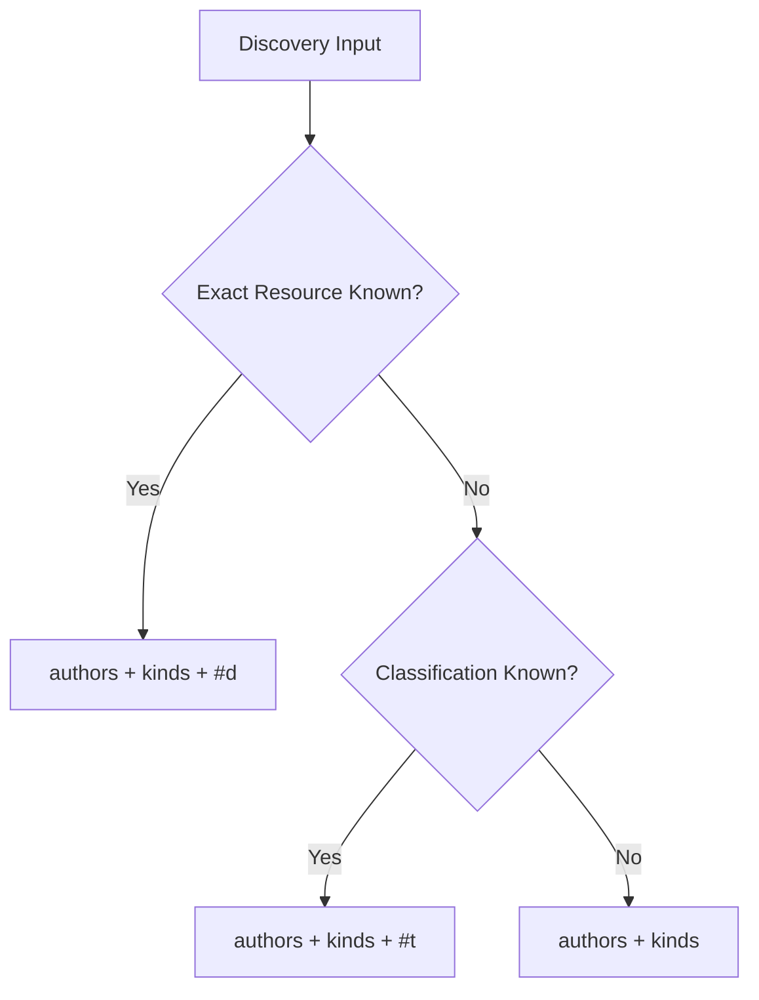

---

# Multi-Relay Discovery

A Resource may be available from more than one relay.

Discovery may query multiple configured relays.

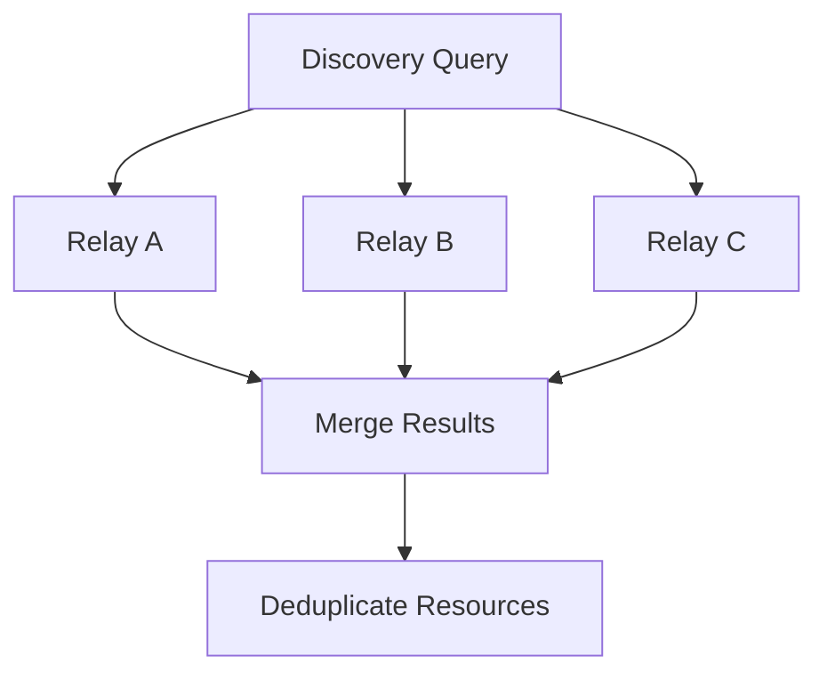

Results are merged by published Resource Identity:

```text
kind + publisher public key + d tag
```

When relays return different valid revisions for the same Resource Identity, the newest valid revision is selected.

The discovered result may retain relay provenance for diagnostics and later relay selection, but relay location is not part of Resource Identity.

---

# Deduplication

Discovery deduplicates events at two levels.

## Event Deduplication

The same event may be returned by multiple relays.

Events with the same event identifier are identical discovery results and are processed once.

## Resource Deduplication

Different Event Revisions may be returned for the same published Resource Identity.

Only the current selected revision is exposed as the discovered Resource Representation.

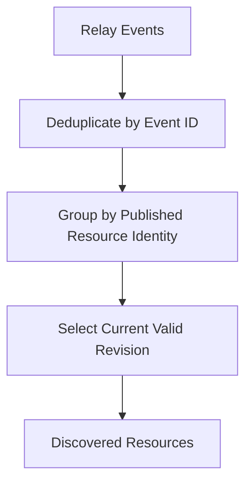

---

# Discovery Through Descriptors

A discovered Resource may use the `descriptors` representation.

That representation can identify additional Resources.

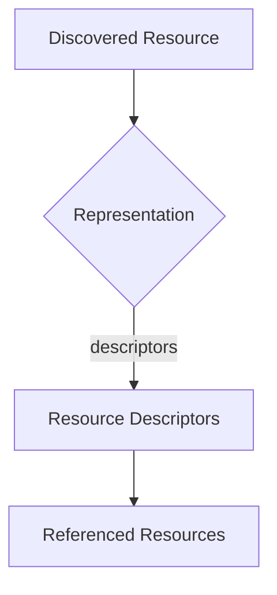

Descriptor collections extend discovery by describing additional independently identifiable Resources.

They do not replace relay discovery.

Depending on the descriptor, a referenced resource may be:

* fully described by external content metadata,
* identified by Resource Identity and resolved directly,
* or identified as another Nostr-published Resource that requires a relay query.

---

# Descriptor References to Nostr Resources

A descriptor may reference another Nostr-published Resource using:

```text
publisher public key

Resource Identifier

optional expected Event Revision or content hash
```

The discovery process uses the referenced publisher and Resource Identifier to perform direct Resource Discovery.

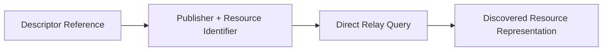

If the descriptor omits the publisher, the containing resource's publisher is used by default.

Cross-publisher references are allowed when the descriptor explicitly identifies another publisher.

Whether that publisher is permitted by trust policy is decided outside discovery.

---

# Descriptor References to External Content

Some descriptors contain enough information to resolve external content directly.

For example:

```text
strategy

url

sha256

media type
```

Such a descriptor does not require a relay query for another Nostr event.

It is passed to Resource Resolution as part of the already discovered representation.


Discovery identifies the descriptor.

Resolution retrieves its content.

---

# Recursive Discovery

Descriptor collections may reference Resources that themselves use the `descriptors` representation.

This allows recursive discovery.

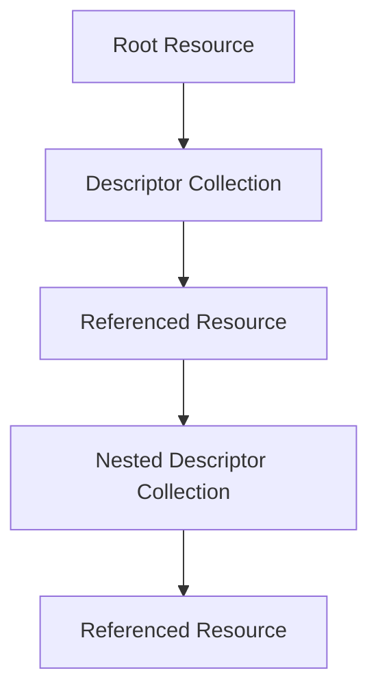

Discovery may continue recursively when requested by the caller.

Recursive discovery tracks published Resource Identities already visited during the current operation.

If a Resource Identity is encountered again, it is not queried or expanded again.

Implementations must enforce reasonable limits, including:

* maximum discovery depth,
* maximum number of discovered resources,
* maximum descriptor count,
* cancellation,
* and timeout support.

These limits prevent malformed or hostile resource graphs from causing unbounded discovery.

---

# Direct and Recursive Discovery Modes

Discovery supports two conceptual modes.

## Direct Discovery

Returns only resources matching the original query.

Examples:

* one exact Resource Identity,
* one Resource Classification,
* or all resources from one publisher.

## Recursive Discovery

Also follows references found in descriptor collections.

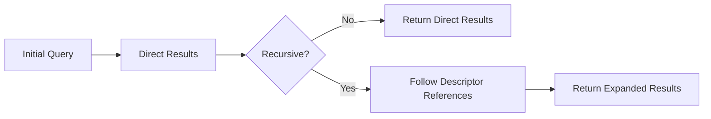

The caller chooses the mode based on the workflow.

Browsing a publisher may use direct discovery.

Importing or installing a descriptor collection may use recursive discovery.

---

# Discovery Results

A successful discovery result preserves the Resource's publication context.

Conceptually:

```ts
type DiscoveredResource = {
  publisher: string
  resourceId: string
  kind: number
  eventId: string
  createdAt: number
  classification?: string
  representation: ResourceRepresentation
  relays?: string[]
}
```

The exact implementation may differ.

A discovery result must contain enough information for:

* Resource Resolution,
* revision comparison,
* provenance,
* diagnostics,
* and future discovery references.

Discovery results are not Domain Objects.

They are network-facing Resource Representations.

---

# Discovery Failures

Discovery failures must be explicit.

Possible failure categories include:

```text
Relay Unavailable

Relay Rejected Query

Timeout

Cancelled

Invalid Event

Unsupported Event Kind

Invalid Resource Identifier

Invalid Classification

Conflicting Revisions

Referenced Resource Not Found

Discovery Depth Exceeded

Discovery Limit Exceeded
```

A failure should preserve enough context to identify:

* the relay,
* the publisher,
* the requested Resource Identifier,
* the requested classification,
* and the originating descriptor reference where applicable.

Conceptually:

```ts
type ResourceDiscoveryFailure = {
  publisher?: string
  resourceId?: string
  classification?: string
  relay?: string
  category: ResourceDiscoveryFailureCategory
  cause?: unknown
}
```

---

# Partial Discovery

Multi-relay and recursive discovery use best-effort behavior.

Failure from one relay does not invalidate valid results returned by another relay.

Failure to discover one referenced Resource does not prevent unrelated referenced Resources from being returned.

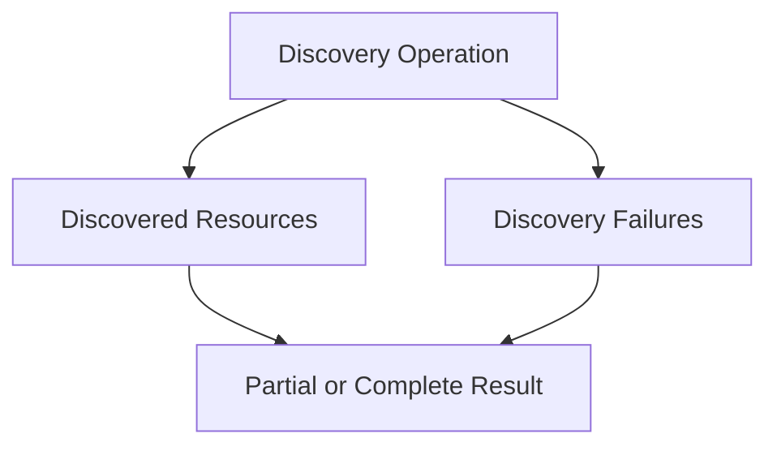

Conceptually:

```ts
type ResourceDiscoveryResult = {
  resources: DiscoveredResource[]
  failures: ResourceDiscoveryFailure[]
}
```

The caller determines whether partial discovery is sufficient for its workflow.

---

# Discovery Does Not Establish Trust

Finding a Resource does not mean the publisher is trusted.

Finding a descriptor reference to another publisher does not automatically extend trust to that publisher.

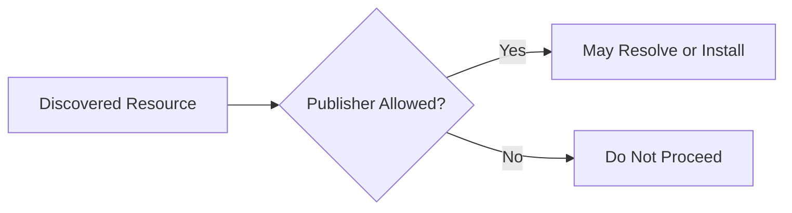

Discovery reports what exists.

Trust policy determines whether the application may use a publisher as a discovery or installation source.

Trusted Publisher behavior is defined in ADR 0009.

---

# Discovery Does Not Install

Discovery does not:

* retrieve externally stored content,
* parse resource schemas,
* create Domain Objects,
* write to Domain Stores,
* install dependencies,
* or record installation state.


Discovering a Resource does not imply that it should be downloaded or installed.

Resource Installation is defined in ADR 0012.

---

# Discovery Independence

The same discovery model may be used by different workflows.

Examples include:

* application bootstrap,
* publisher browsing,
* manual installation,
* Auto Sync,
* import validation,
* diagnostics,
* or direct resource navigation.

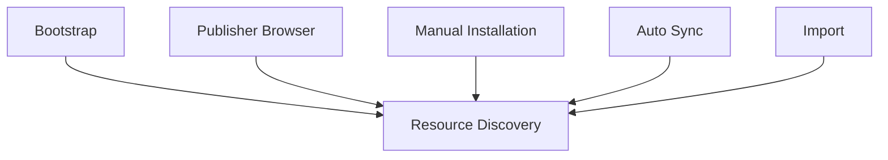

Each workflow supplies its own trust, retry, installation, and update policies.

Discovery itself remains unchanged.

---

# Scope

This ADR defines:

* Resource Discovery roots,
* direct Resource Discovery,
* publisher filtering,
* Resource Classification filtering,
* relay query shapes,
* multi-relay discovery,
* Event Revision selection,
* event and Resource deduplication,
* discovery through descriptors,
* recursive discovery,
* discovery limits,
* partial discovery,
* and discovery failure reporting.

This ADR does not define:

* how publishers become known,
* publisher trust policy,
* relay configuration policy,
* Nostr event schema validation,
* external content retrieval,
* integrity verification,
* Resource Parsing,
* Domain Object creation,
* installation,
* local persistence,
* dependency handling,
* update acceptance,
* Auto Sync,
* or outbound synchronization.

Those concerns are defined by other ADRs.

---

# Big Takeaway

Resource Discovery has one responsibility:

```mermaid
flowchart LR

    ROOT["Known Publisher or Resource Reference"]

    ROOT --> DISCOVER["Query, Filter, and Follow References"]

    DISCOVER --> RESULTS["Discovered Resource Representations"]
```

Publishers and Resource metadata determine what is queried.

The `d` tag identifies a specific Resource.

The `t` tag identifies a class of Resources.

Descriptor collections may reveal additional Resources.

Discovery finds what is available.

Trust, resolution, installation, and Auto Sync decide what happens next.
