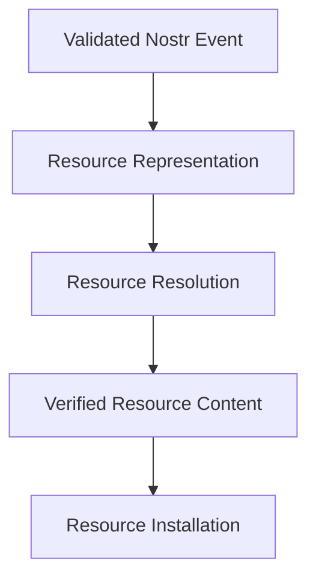
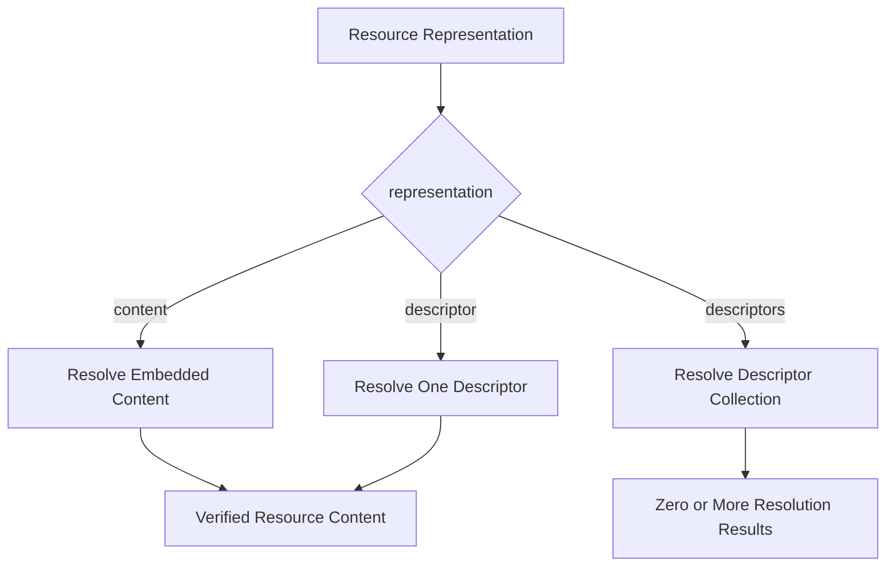
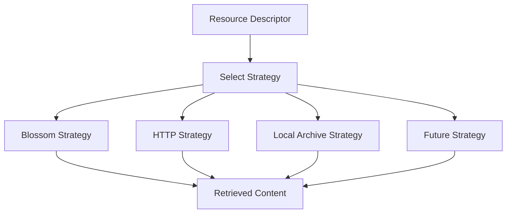
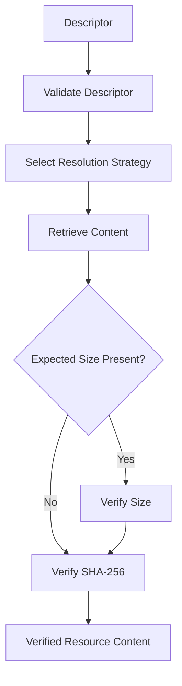
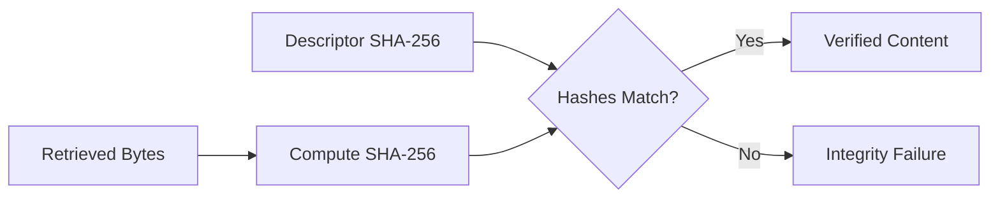
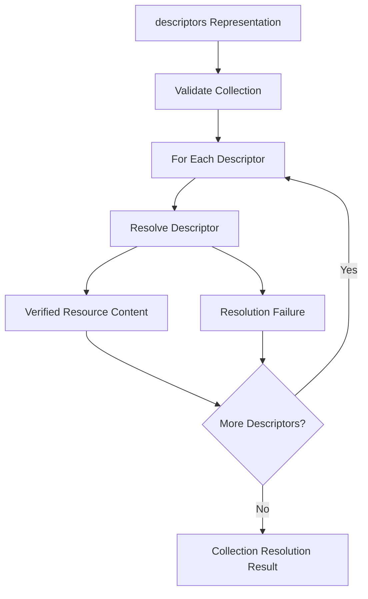
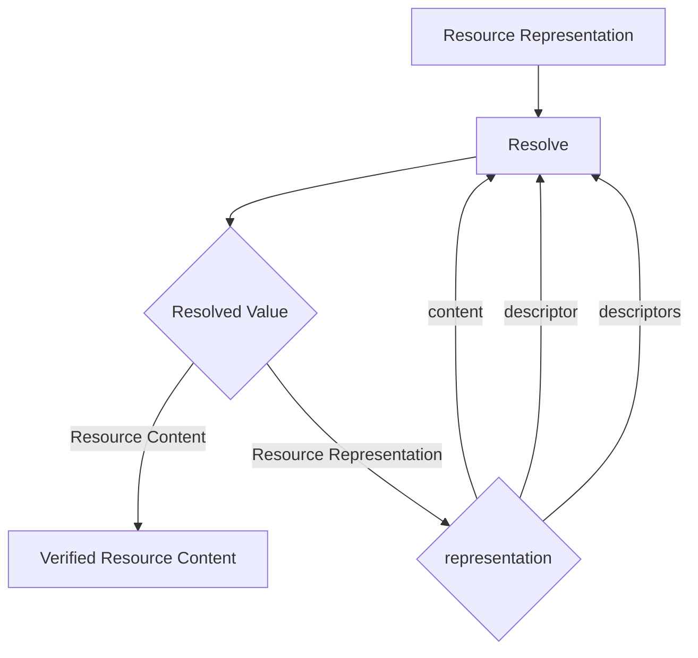
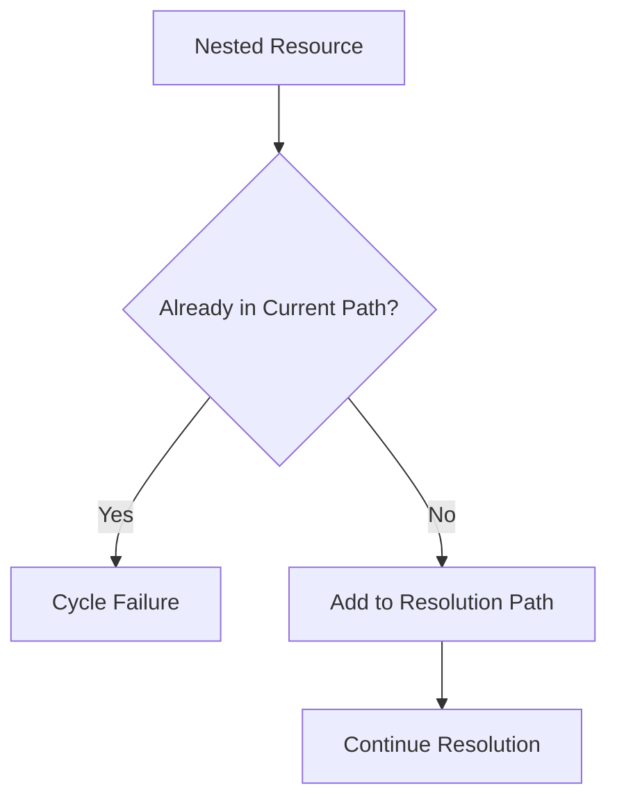
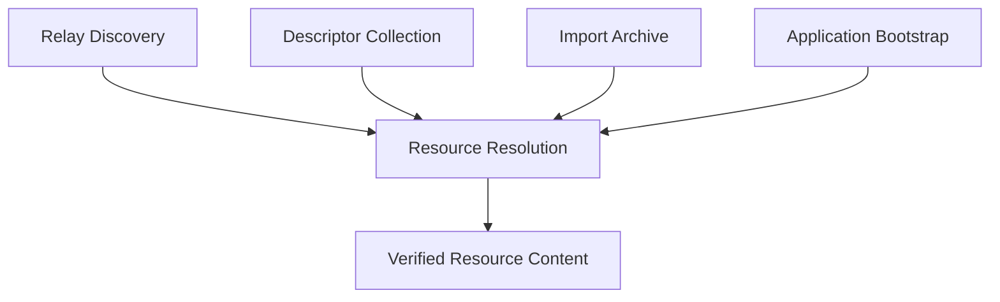
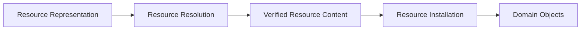

# ADR 0006 — Resource Resolution

**Status**

Accepted

---

# Problem

KJVOnly resources may use different representations and storage providers.

Resource content may be:

* embedded directly in a Nostr event,
* referenced through a descriptor,
* or organized as a collection of descriptors.

Externally stored content may be retrieved through Blossom, HTTP, local archives, or future storage providers.

The application needs one consistent process for converting any supported Resource Representation into verified serialized resource content.

This process must remain independent of:

* resource type,
* Domain Object parsing,
* installation,
* local persistence,
* application rendering,
* and synchronization.

Without a clear boundary, retrieval, validation, parsing, installation, and storage responsibilities become coupled.

---

# Decision

Resource Resolution converts a validated Resource Representation into verified Resource Content.


Resolution is responsible for:

* dispatching by representation,
* parsing descriptors,
* selecting a Resource Resolution Strategy,
* retrieving external content,
* verifying content integrity,
* expanding descriptor collections,
* recursively resolving nested descriptor collections,
* and reporting resolution failures.

Resolution ends when verified serialized content has been produced.

It does not interpret the resource schema or create application objects.

---

# Resolution Boundary

Resource Resolution begins after the Nostr event has passed protocol-level validation.

It receives an application-level Resource Representation containing sufficient context to identify and resolve the resource.

At minimum, that context includes:

```text
publisher
resource identifier
resource representation
event publication
media type
representation payload
```

Resource Resolution produces one or more verified Resource Content results.



The Event Model owns protocol validation and conversion from a Nostr event into a Resource Representation.

Resource Installation owns parsing, Domain Object creation, and persistence.

---

# Resolution Result

A successful resolution produces serialized resource content together with its resource context.

Conceptually:

```ts
type ResolvedResourceContent = {
  publisher: string
  resourceId: string
  eventId: string
  mediaType: string
  content: Uint8Array
  sha256?: string
}
```

The exact implementation may differ, but the result must preserve enough context for later parsing, provenance, and installation.

Resolution does not transform the serialized content into Domain Objects.

For example:

```text
application/json
application/json+gzip
application/octet-stream
```

remain serialized content until the Resource Installation pipeline selects the appropriate Domain Object Factory.

---

# Representation Dispatch

KJVOnly supports three Resource Representations:

1. `content`
2. `descriptor`
3. `descriptors`

The representation determines the initial resolution path.



Representation dispatch is exhaustive.

An unknown or missing representation is a resolution failure.

---

# Content Resolution

A `content` representation contains the serialized Resource Content directly in the event payload.

Resolution reads the embedded content and produces a Resource Content result.


The Nostr event signature establishes the integrity of the signed event payload.

Additional content verification may be performed when content identity metadata is available.

Content Resolution does not parse the resource schema.

It only produces the serialized content and its associated metadata.

---

# Descriptor Resolution

A `descriptor` representation describes how external Resource Content can be retrieved and verified.

A descriptor contains the information required by its Resource Resolution Strategy.

Conceptually:

```ts
type ResourceDescriptor = {
  strategy: string
  url: string
  sha256: string
  size?: number
  mediaType: string
}
```

A descriptor inside a `descriptors` collection also identifies the Resource it represents:

```ts
type CollectionResourceDescriptor = ResourceDescriptor & {
  resource: string
  publisher?: string
}
```

The publisher defaults to the publisher of the containing representation unless another publisher is explicitly identified.

A descriptor may include additional strategy-specific or descriptive metadata.

Generic resolution code must not depend on provider-specific fields beyond the contract defined by the selected strategy.

---

# Resource Resolution Strategies

A Resource Resolution Strategy retrieves content for one descriptor.

Examples include:

```text
Blossom
HTTP
Local Archive
IPFS
Future Providers
```

Each strategy implements the same conceptual operation:

```ts
interface ResourceResolutionStrategy {
  resolve(
    descriptor: ResourceDescriptor,
    signal?: AbortSignal
  ): Promise<Uint8Array>
}
```

The strategy is selected using the descriptor's `strategy` field.



A strategy is responsible only for retrieving the requested bytes.

It does not:

* determine Resource Identity,
* parse application data,
* create Domain Objects,
* install content,
* or update local metadata.

Adding a storage provider requires a new Resource Resolution Strategy rather than changes to Resource Identity, resource type, or installation behavior.

---

# Descriptor Resolution Pipeline

A singular descriptor follows this pipeline:



Resolution succeeds only after the retrieved content satisfies the descriptor's integrity requirements.

No retrieved content is passed to installation before verification succeeds.

---

# Integrity Verification

Externally retrieved content must be verified independently of the storage provider.

The descriptor's cryptographic hash identifies the expected content.

KJVOnly uses SHA-256 as the default content-integrity mechanism.



A size value may be used as an additional early validation check, but it does not replace cryptographic verification.

A successful network response does not imply valid Resource Content.

Content is considered resolved only after integrity verification succeeds.

The resolver must reject content when:

* the computed hash does not match,
* a declared size does not match,
* the descriptor is malformed,
* or required integrity metadata is absent.

Provider signatures or transport security may provide additional assurances, but they do not replace descriptor-level content verification.

---

# Descriptors Resolution

A `descriptors` representation contains a collection of independently resolvable descriptors.

Resolution expands the collection and processes each descriptor separately.



The collection itself is not interpreted as combined application content.

Each descriptor identifies a distinct Resource and produces an independent result.

Descriptor collection order does not define installation order or dependencies.

Dependencies, if any, are installation metadata and are handled by ADR 0008.

---

# Best-Effort Collection Resolution

Descriptor collections use best-effort resolution.

Failure to resolve one descriptor does not prevent unrelated descriptors from being resolved.

The collection result records each descriptor outcome.

Conceptually:

```ts
type DescriptorCollectionResult = {
  resolved: ResolvedResourceContent[]
  failures: ResourceResolutionFailure[]
}
```

Possible outcomes include:

* every descriptor resolved,
* some descriptors resolved,
* no descriptors resolved,
* or the collection itself was invalid.

A partially resolved collection is not treated as a single atomic Resource Resolution failure.

Whether partial results may be installed is determined by the Resource Installation policy.

---

# Recursive Resolution

A descriptor may resolve to another Resource Representation.

In particular, a descriptor may reference a Resource represented as `descriptors`.

The resolver processes the resulting representation recursively.



Recursive resolution allows publishers and archives to compose collections from other collections without introducing a separate manifest concept.

Every nested representation follows the same validation and integrity rules as the root representation.

---

# Recursion Safety

Recursive resolution must protect the client from malformed or hostile graphs.

The resolver tracks Resource Identities encountered in the current resolution path.

If the same published Resource Identity is encountered again in that path, resolution stops with a cycle failure.



Implementations must also enforce reasonable limits, including:

* maximum recursion depth,
* maximum descriptor count,
* maximum individual content size,
* maximum aggregate content size,
* and cancellation or timeout support.

Exact limits are implementation policy rather than part of the Resource model.

They must fail safely without allowing unbounded retrieval or recursion.

---

# Already-Available Content

Resolution and installation are separate operations.

The resolver may be given already-available verified content by its caller, such as content retrieved from a local archive or previously staged download.

In that case, the same integrity verification rules apply before the content is returned as resolved.

The decision to reuse installed resources, staged blobs, or cached downloads belongs to the local persistence and installation layers.

Resource Resolution does not define an IndexedDB cache or installation-status model.

---

# Resolution Failures

Resolution failures are explicit results.

A failure should preserve enough context to identify:

* the publisher,
* the Resource Identifier,
* the representation,
* the descriptor strategy,
* the attempted location,
* the failure category,
* and the underlying error where appropriate.

Conceptually:

```ts
type ResourceResolutionFailure = {
  publisher: string
  resourceId: string
  representation: string
  strategy?: string
  location?: string
  category: ResourceResolutionFailureCategory
  cause?: unknown
}
```

Failure categories include:

```text
Invalid Representation
Invalid Descriptor
Unsupported Strategy
Retrieval Failure
Timeout
Cancelled
Size Mismatch
Integrity Failure
Invalid Nested Representation
Cycle Detected
Recursion Limit Exceeded
Collection Limit Exceeded
```

The exact error type is an implementation detail, but callers must be able to distinguish invalid content from temporary retrieval failures.

---

# Retry Responsibility

Resource Resolution performs one requested resolution attempt.

It reports failures to its caller.

Long-lived retry policy belongs to the workflow that requested resolution, such as:

* Resource Installation,
* background downloading,
* application bootstrap,
* or application startup.

A Resolution Strategy may perform limited transport-level retry when appropriate, but Resource Resolution does not own persistent retry queues, exponential backoff schedules, or circuit-breaker state.

This prevents resource retrieval from becoming coupled to application lifecycle or synchronization policy.

---

# Resolution Independence

The same resolution behavior applies regardless of how a Resource was discovered.

Possible sources include:

* relay discovery,
* a descriptor collection,
* an import archive,
* application bootstrap,
* a direct Resource reference,
* or a future source.



Discovery determines which Resources are available.

Resolution determines how their content is obtained and verified.

The source of discovery does not create a separate resolution pipeline.

---

# Relationship to Resource Installation

Resource Resolution and Resource Installation are separate responsibilities.



Resource Resolution owns:

* representation dispatch,
* external retrieval,
* descriptor expansion,
* recursion,
* and content-integrity verification.

Resource Installation owns:

* selecting the appropriate Domain Object Factory,
* decompressing or decoding content as required,
* validating the resource schema,
* creating Domain Objects,
* installing dependencies,
* staging updates,
* and committing Domain Objects to Domain Stores.

Resolution success does not mean installation success.

It means only that verified serialized Resource Content is available for installation.

---

# Scope

This ADR defines:

* representation dispatch,
* descriptor validation,
* Resource Resolution Strategies,
* external content retrieval,
* integrity verification,
* descriptor collection expansion,
* recursive resolution,
* recursion safety,
* partial collection results,
* and resolution failure reporting.

This ADR does not define:

* Resource discovery,
* publisher trust,
* Nostr event validation,
* Resource Parser selection,
* resource-schema validation,
* decompression or domain decoding,
* Domain Object creation,
* dependency installation,
* atomic installation,
* IndexedDB schema,
* download caching,
* installation metadata,
* update selection,
* persistent retry behavior,
* application rendering,
* or outbound synchronization.

Those behaviors are defined by other ADRs.

---

# Big Takeaway

Resource Resolution has one responsibility:


Representation determines how content is obtained.

Resolution Strategies retrieve external bytes.

Integrity verification determines whether those bytes may proceed.

Parsing, installation, persistence, and synchronization begin only after Resource Resolution ends.
