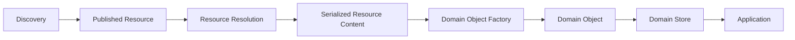
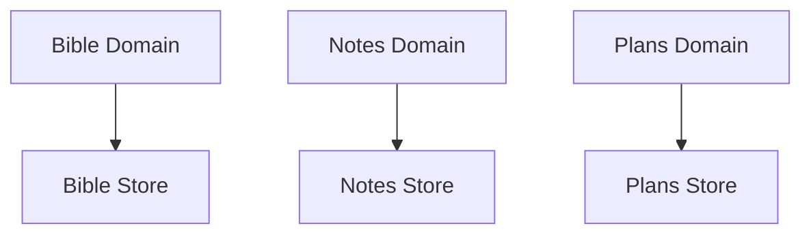
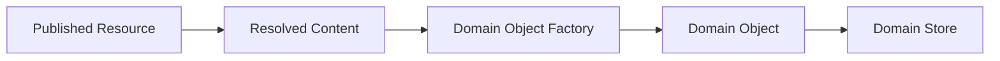

# ADR 0007 — Domain Storage Model

**Status**

Accepted

---

# Problem

After a Resource has been discovered, resolved, and transformed into a validated Domain Object, the application must persist it for local use.

The storage model should reflect the application's domain architecture rather than the underlying distribution protocol or storage technology.

Persisting raw Nostr events as the application's primary data model would unnecessarily couple the application to the transport layer and expose protocol details throughout the codebase.

---

# Decision

KJVOnly persists **Domain Objects**, not raw Nostr events.

Each domain owns one or more **Domain Stores** responsible for persisting and querying the Domain Objects that belong to that domain.

The storage implementation is an implementation detail.

---

# Storage Pipeline

A Resource progresses through several stages before becoming application data.

Only validated Domain Objects are persisted.

The application interacts exclusively with Domain Objects and Domain Stores.

---

# Domain Stores

A Domain Store is the persistent collection of Domain Objects belonging to a single domain.

Examples include:

* Bible Store
* Notes Store
* Reading Plans Store
* Reading History Store
* Search Store

Each Domain Store exposes the persistence model required by its domain without exposing implementation details to the rest of the application.

---

# Domain Ownership

Every domain owns its own storage.

A domain is responsible for:

* Domain Object schemas,
* serialization,
* indexes,
* migrations,
* and query APIs.

Other domains interact with Domain Objects through domain APIs rather than directly manipulating another domain's storage.

This keeps persistence concerns localized within each domain.

---

# Installed Domain Objects

Only installed Resources become persistent Domain Objects.

Conceptually:

Installation determines **when** a Resource is transformed into a Domain Object.

This ADR defines **where** that Domain Object is persisted.

---

# Domain Independence

Each Domain Store evolves independently.

Adding, removing, or migrating one domain's storage must not require changes to unrelated domains.

For example:

* Notes storage does not depend on Bible storage.
* Reading plans do not depend on annotations.
* Search indexes are managed independently of the content they index.

This allows each domain to evolve according to its own requirements while maintaining a consistent architectural model.

---

# Storage Technology

The architecture does not require a specific persistence technology.

Browser implementations will typically use IndexedDB to implement Domain Stores.

Alternative implementations may use any storage technology that preserves the Domain Store abstraction.

The remainder of the application should remain unaware of the underlying storage engine.

---

# Scope

This ADR defines:

* Domain Stores,
* persistence of Domain Objects,
* domain ownership of storage,
* storage boundaries,
* and storage independence.

This ADR does not define:

* Resource discovery,
* Published Resource Identity,
* Resource Resolution,
* installation,
* synchronization,
* Auto Sync,
* search indexing,
* caching strategies,
* or storage engine implementation.

Those concerns are defined by other ADRs.

---

# Big Takeaway

The application persists **Domain Objects**, not transport-layer artifacts.

Each domain owns its own persistent storage through one or more Domain Stores.

Storage technology is an implementation detail; the architectural boundary is the Domain Store abstraction.
