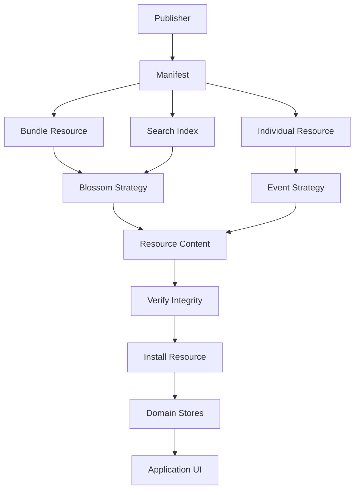
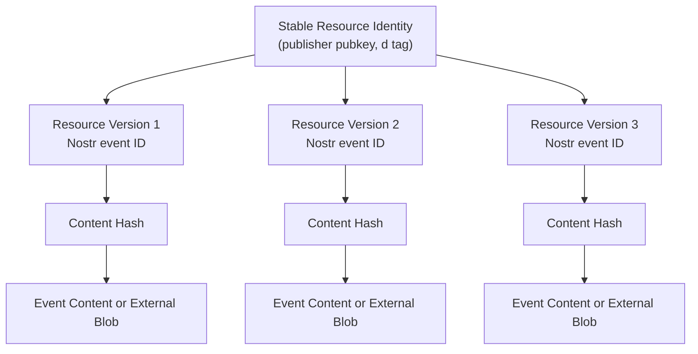

# ADR 0001 — Data Distribution Strategy

**Status**

Accepted

---

# Problem

KJVOnly distributes application resources through Nostr while remaining independent of any specific storage backend.

The architecture must support offline-first operation, efficient bootstrap, multiple storage strategies, and flexible resource granularity without changing the application's resource model.

---

# Decision

Resources are distributed through manifests.

Manifests describe resources.

Resources describe how they are resolved.

Storage strategies determine where resource content is retrieved.

This separates:

* Resource identity
* Resource discovery
* Resource transport
* Resource installation

Each concern evolves independently.
---
# Resource Distribution Overview


---

# Goals

* Keep Nostr kinds focused on protocol structures rather than storage mechanisms.
* Bootstrap application state from manifests.
* Support both bundled and individual resource distribution.
* Allow multiple storage strategies.
* Verify downloaded content using hashes.
* Preserve stable resource identities regardless of transport.
* Remain compatible with existing Nostr conventions.

---

# Kinds

Kinds represent broad protocol structures rather than individual application resource types.

```text
37770 Bible Resources
37772 Annotations
37773 Notes
37775 Reading Plans
37777 Completed Readings
37778 Manifests
```

Resource identity provides the application's logical organization.

Kinds define how events are interpreted by the Event Model.

---

# Resource Identity

Resources are represented using parameterized replaceable events.

The `d` tag contains the semantic resource identifier.

Resource identifiers follow the convention:

```text
namespace/domain/resource-type/...resource-id
```

Examples:

### Bundle Resources

```text
kjvonly/bible/chapters/kjv
kjvonly/bible/chapters/kjvs

kjvonly/search/bible/kjv

kjvonly/bible/booknames/default

kjvonly/bible/strongs/default

kjvonly/overlays/paragraphs/default
kjvonly/overlays/pericopes/default

kjvonly/plans/readings/chronological
kjvonly/plans/readings/yearly
```

### Individual Resources

```text
kjvonly/bible/chapters/kjv/1_1
kjvonly/bible/chapters/kjv/43_3

kjvonly/overlays/paragraphs/default/1_1
kjvonly/overlays/pericopes/default/1_1
```

Both bundled resources and individual resources share the same identity model.

For example:

```text
Entire Bible

kjvonly/bible/chapters/kjv
```

```text
Single Chapter

kjvonly/bible/chapters/kjv/43_3
```

Ownership is determined by the publisher's public key.

The combination of:

```text
(pubkey, d)
```

defines the stable logical identity of a publisher-owned resource.

Each published version receives its own immutable event identifier.

---

### Resource Identity and Versions


---

# Manifest Resources

A manifest bootstraps a collection of resources.

```text
kind = 37778

d = kjvonly/bible/kjv
```

Example:

```json
{
  "name": "KJV Bible",
  "resources": [
    {
      "resource": "kjvonly/bible/chapters/kjv",
      "strategy": "blossom",
      "url": "https://...",
      "sha256": "..."
    },
    {
      "resource": "kjvonly/overlays/paragraphs/default",
      "strategy": "blossom",
      "url": "https://...",
      "sha256": "..."
    },
    {
      "resource": "kjvonly/overlays/pericopes/default",
      "strategy": "blossom",
      "url": "https://...",
      "sha256": "..."
    }
  ]
}
```

A manifest may describe:

* An entire Bible
* Reading plans
* Search indexes
* Overlay collections
* Individual chapter resources
* Any future resource collection

---

# Storage Strategies

Resources declare how they are resolved.

The application resolves resources without knowing where the underlying content is stored.

## Blossom

```json
{
  "strategy": "blossom",
  "url": "https://...",
  "sha256": "..."
}
```

## Event

```json
{
  "strategy": "event"
}
```

Small resources such as a single Bible chapter may be stored directly in a Nostr event.

Large resources such as an entire Bible or search index may be stored in Blossom.

Both approaches use the same resource identity.

Future strategies may include:

```text
blossom
event
http
ipfs
local
```

---

# Resource Installation

Regardless of the storage strategy, resources follow the same installation pipeline.

```text
Manifest
        ↓
Resolve Resource
        ↓
Resolve Strategy
        ↓
Retrieve Content
        ↓
Verify Hash
        ↓
Install Resource
```

The installation process is independent of the storage backend.

---

# Distribution Models

## Offline First

Install complete resource collections.

```text
Manifest

↓

Bible Bundle

↓

Overlay Bundles

↓

Search Index

↓

Install
```

---

## On Demand

Install only the resources required by the current application state.

```text
Manifest

↓

Chapter Resource

↓

Overlay Resource

↓

Render
```

Both approaches use identical resource identifiers and installation behavior.

---

# Design Notes

* Resources are discovered through manifests.
* Kinds define protocol structures rather than storage backends.
* Resource identity is independent of transport.
* Storage is an implementation detail isolated behind strategies.
* Resources may represent bundles or individual items.
* Publishers own resources.
* `(pubkey, d)` defines stable logical identity.
* Event identifiers represent immutable published versions.
* Hashes verify downloaded content.
* Clients may choose full installation or on-demand installation without changing the resource model.

---

# Big Takeaway

The application distributes resources rather than files.

Manifests describe resources.

Resources describe how they are resolved.

Storage strategies retrieve content.

The installation pipeline transforms those resources into local application state while preserving stable identities regardless of where or how the content is stored.
