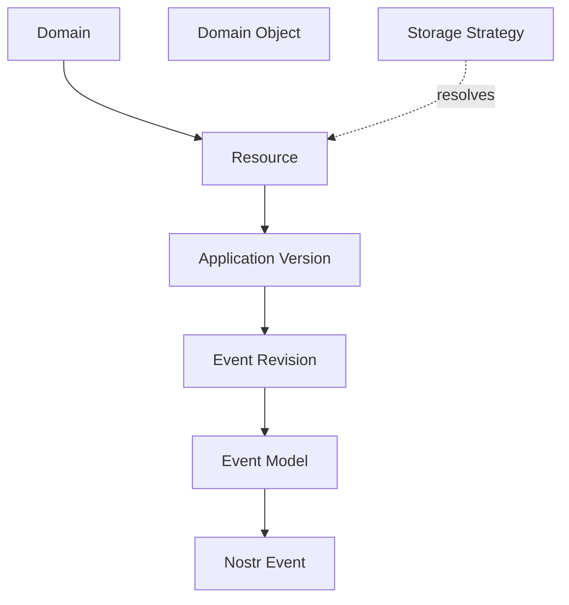
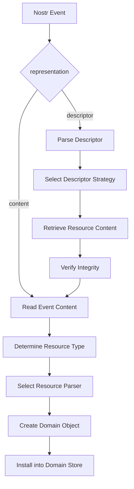
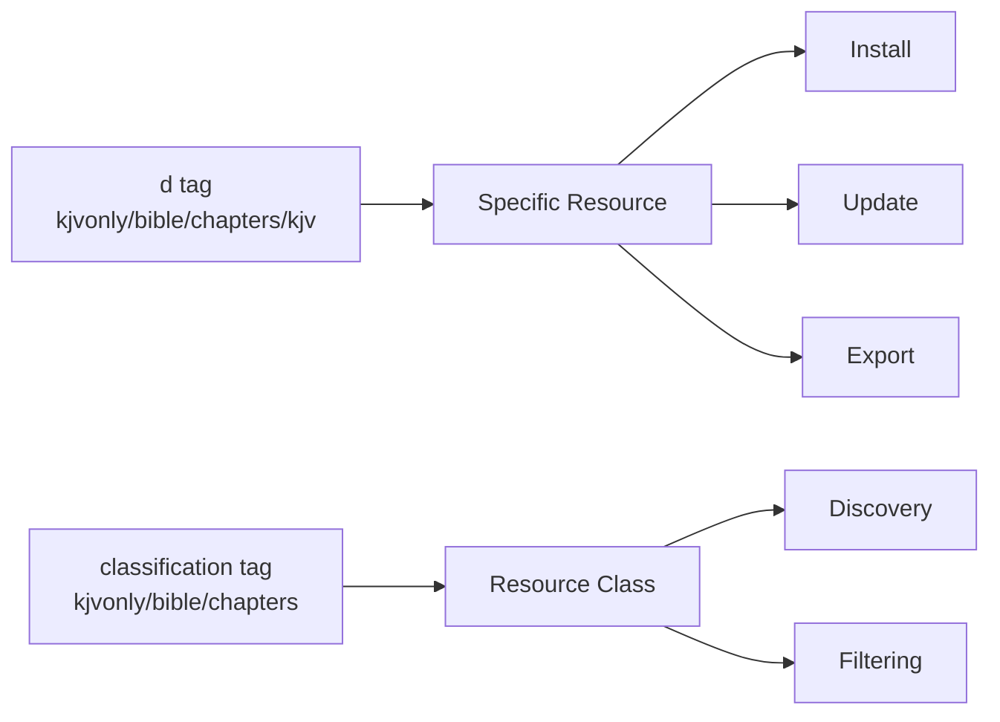
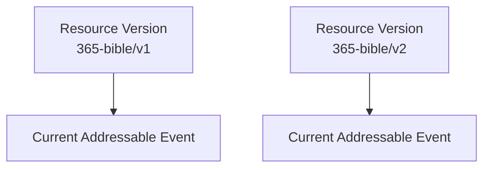

# ADR 0002 — Domain, Resource, and Storage Model

**Status**

Accepted

---

# Problem

KJVOnly distributes many different types of application data.

Examples include:

- Bible text
- Overlays
- Reading plans
- Notes
- Annotations
- Search indexes
- Completed readings
- Publisher metadata
- Manifests

These resources may be:

- Published by different publishers
- Stored using different backends
- Installed independently
- Updated independently
- Shared across datasets
- Retrieved at different levels of granularity

Without a clear separation of concerns, concepts such as domains, resources, storage, and protocol details become tightly coupled. This makes the architecture difficult to evolve as new resource types, storage providers, or distribution models are introduced.

The application therefore needs a model that clearly separates:

- What the data represents.
- How the data is identified.
- How the data is transported.
- How the data is stored.
- How the application consumes the data.

---

# Decision

KJVOnly separates the following concepts:

1. Domain
2. Resource
3. Application Version
4. Event Revision
5. Domain Object
6. Protocol Representation
7. Storage Strategy

Each concept has a single responsibility.

No concept should imply another.

For example:

- A domain does not determine storage.
- A storage backend does not determine resource identity.
- A resource identifier does not determine the application object.
- A Nostr event is not the application's domain model.

This separation allows the application to evolve each layer independently while reusing the same installation, synchronization, and discovery pipelines.

---

## Architectural Overview



The application primarily works with **resources** and **domain objects**.

The Event Model translates between application objects and protocol events.

Storage strategies resolve resource content without changing the logical identity of the resource.

---

# Domain

A domain represents a broad category of application data.

Examples include:

```text
Bible
Overlays
Plans
Notes
Annotations
Search
Completed Readings
Publishers
Manifests
```

Domains organize the application.

They answer the question:

> **What category of data does this belong to?**

A domain does **not** describe:

- where data is stored,
- how it is synchronized,
- who owns it,
- how it is retrieved,
- or how it is represented on the network.

Those concerns belong elsewhere in the architecture.

---

# Domains and Protocol Kinds

A domain is an application concept.

A Nostr kind is a protocol concept.

Although the two are related, they serve different purposes.

KJVOnly intentionally minimizes the number of protocol kinds used by the application.

Kinds distinguish fundamentally different protocol structures rather than application features.

For example:

```ts
export const RESOURCE_KIND = 37770
export const MANIFEST_KIND = 37778
```

Most application resources use the generic `RESOURCE_KIND`.

The specific type of resource is determined by its resource identifier and classification tags rather than by allocating additional kinds.

This approach provides several advantages:

- New resource types can be introduced without allocating new kinds.
- Generic resource discovery becomes simpler.
- Installation and synchronization pipelines can be reused.
- Application concepts remain independent of protocol details.

Protocol kinds answer the question:

> **How should this event be interpreted?**

Domains answer the question:

> **What category of application data does this represent?**

These are intentionally different concerns.

# Resource

A resource is an independently identifiable unit of application data and the primary unit of distribution in KJVOnly.

Everything that can be discovered, installed, synchronized, exported, imported, or shared is represented as a resource.

Examples include:

- A complete Bible
- A single Bible chapter
- A reading plan
- A search index
- A paragraph overlay
- A pericope overlay
- Publisher metadata
- A note collection
- A single note
- A manifest

A resource is a logical concept.

It defines **what** the application distributes, but not **how** that data is represented, stored, or retrieved.

---

## Resource Representation

Resources are represented by Nostr events.

A Nostr event may represent a resource in one of two ways:

1. **Content Representation**
2. **Descriptor Representation**

Both represent the same logical resource.

The remainder of the application is unaware of which representation was used.

---

## Content Representation

A Content Representation stores the resource directly in the event `content`.

For example:

```json
{
  "kind": 37770,
  "tags": [
    ["d", "kjvonly/plans/readings/365-bible/v1"],
    ["t", "kjvonly/plans/readings"],
    ["representation", "content"],
    ["m", "application/json"]
  ],
  "content": "{ ... resource data ... }"
}
```

The resource content is parsed directly from the event.

No additional retrieval step is required.

---

## Descriptor Representation

A Descriptor Representation stores metadata describing how to retrieve the resource content.

For example:

```json
{
  "kind": 37770,
  "tags": [
    ["d", "kjvonly/bible/chapters/kjv"],
    ["t", "kjvonly/bible/chapters"],
    ["representation", "descriptor"],
    ["m", "application/json"]
  ],
  "content": "{
    \"strategy\":\"blossom\",
    \"url\":\"https://...\",
    \"sha256\":\"...\",
    \"mediaType\":\"application/json+gzip\"
  }"
}
```

The descriptor does not contain the resource itself.

Instead, it describes how the resource content can be retrieved.

Possible descriptor strategies include:

- Blossom
- HTTP
- IPFS
- Local Archive
- Future storage providers

Both Content and Descriptor representations ultimately produce the same resource data.

---

## Resource Resolution

Every resource follows the same installation pipeline.



Representation determines **how the resource content is obtained**.

Resource type determines **how the resolved content is interpreted**.

This separation allows publishers to choose the most appropriate representation for each resource while keeping the remainder of the application architecture independent of storage implementation.

---

## Resource Identity

Every resource has a stable logical identity.

KJVOnly stores this identity in the Nostr `d` tag.

Resource identifiers follow the convention:

```text
namespace/domain/resource-type/...resource-id
```

The first three path segments classify the resource.

Everything after `resource-type` identifies the specific resource.

For example:

```text
kjvonly/bible/chapters/kjv
```

represents:

```text
namespace      = kjvonly
domain         = bible
resource-type  = chapters
resource-id    = kjv
```

A more granular resource may contain additional identity segments:

```text
kjvonly/bible/chapters/kjv/1_1
```

which becomes:

```text
namespace      = kjvonly
domain         = bible
resource-type  = chapters
resource-id    = kjv/1_1
```

Additional path segments are part of the logical resource identity.

They are not interpreted as filesystem paths.

> **Resource Type**
>
> The first three path segments (`namespace/domain/resource-type`) also identify
> the strategy responsible for parsing the resolved resource content.
>
> For example:
>
> ```text
> kjvonly/plans/readings/365-bible/v1
> ```
>
> selects the parser registered for:
>
> ```text
> kjvonly/plans/readings
> ```
>
> The remaining path segments identify the specific resource instance and do not
> affect parser selection.

---

## Resource Classification

While the `d` tag uniquely identifies a resource, clients frequently need to discover groups of related resources.

Every resource therefore also includes a classification tag.

The classification tag contains only the namespace, domain, and resource type.

Examples:

```text
t = kjvonly/bible/chapters
```

```text
t = kjvonly/search/bible
```

```text
t = kjvonly/plans/readings
```

The `d` tag answers:

> Which resource is this?

The classification tag answers:

> What class of resource is this?

The classification tag exists solely to support efficient relay filtering and discovery.

The `d` tag remains the authoritative resource identifier.

---

## Resource Identity and Classification



The `d` tag identifies one logical resource.

The classification tag identifies a class of related resources.

Together they provide a consistent mechanism for discovery, synchronization, installation, and filtering while allowing the application to use a minimal number of protocol kinds.

# Resource Versioning

A resource may evolve at two independent levels:

1. **Resource Version**
2. **Event Revision**

These represent different concerns and should not be confused.

This ADR defines how these concepts relate to resource identity.

The complete versioning model, including compatibility, migration, and lifecycle management, is defined in ADR 0006.

---

## Resource Version

A Resource Version identifies a distinct version of a logical resource.

The version forms part of the resource's logical identity and is therefore included in the resource identifier.

For example:

```text
kjvonly/plans/readings/365-bible/v1
kjvonly/plans/readings/365-bible/v2
```

These represent two distinct resources.

Each Resource Version may:

- exist simultaneously
- be installed independently
- be updated independently
- be referenced independently

Resource Versions are not limited to publisher-provided content.

They may also represent application-generated or user-created resources.

For example:

```text
kjvonly/notes/default/v1
kjvonly/notes/default/v2

kjvonly/highlights/default/v1
kjvonly/highlights/default/v2
```

The rules governing when a new Resource Version should be created are defined by ADR 0006.

---

## Event Revision

Nostr addressable events are identified by:

```text
(kind, pubkey, d)
```

Publishing another event using the same values creates a new event with a different event identifier.

The Resource Version remains unchanged.

The newly published event replaces the previously published event for that Resource Version.

For example:

```text
kind   = RESOURCE_KIND
pubkey = publisher
d      = kjvonly/plans/readings/365-bible/v1
```

Publishing another event using the same address replaces the previous event while preserving the Resource Version.

Although previous revisions may continue to exist on some relays temporarily, clients treat the most recent event as the authoritative representation of the Resource Version.

This mechanism allows resources to be corrected, updated, or republished without changing their logical identity.

---

## Resource Version and Event Revision

Resource Versions and Event Revisions exist independently.



Each Resource Version has its own addressable event.

Publishing a newer event using the same `(kind, pubkey, d)` replaces the current event for that Resource Version without creating a new Resource Version.

Creating a new Resource Version creates a new logical resource with its own independent addressable event.

---

## Summary

Resource Versioning and Event Revision solve different problems.

- **Resource Version** identifies a distinct version of a logical resource.
- **Event Revision** identifies successive publications of the same Resource Version.

A new Event Revision updates the current representation of an existing Resource Version.

A new Resource Version creates a new logical resource with its own independent identity.

Keeping these concepts separate allows resources to evolve over time while preserving stable logical identities and predictable update behavior.