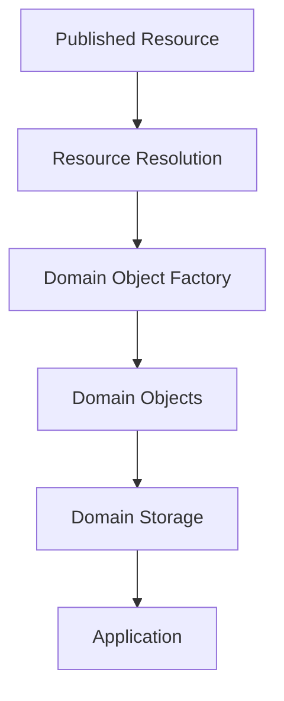
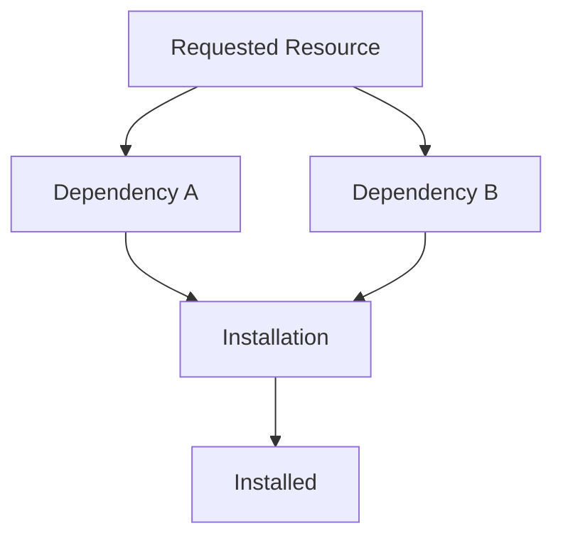
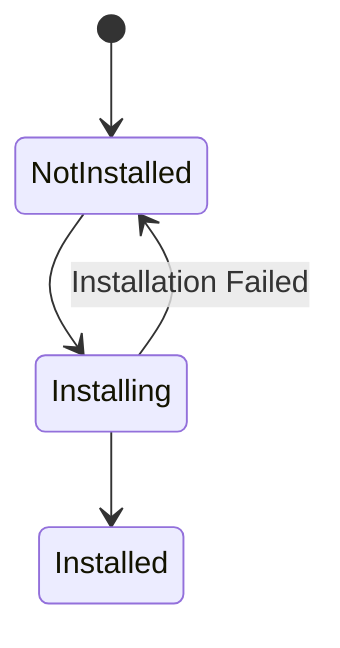
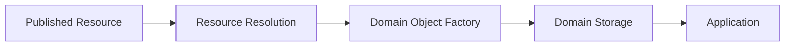

# ADR 0008 — Resource Installation Lifecycle

**Status**

Accepted

---

# Problem

Resource Discovery identifies Published Resources that are available to the application.

Resource Resolution obtains verified Resource content from those Published Resources.

However, the application does not operate directly on serialized Resources or Nostr events. It operates on Domain Objects stored in Domain Stores.

The architecture therefore requires a consistent process that transforms a Published Resource into installed Domain Objects, regardless of how the Resource was discovered or represented.

---

# Decision

KJVOnly defines a **Resource Installation Lifecycle**.

Installation is the architectural process that coordinates the existing pipeline of Resource Resolution, Domain Object creation, and Domain Storage to make a Published Resource available to the application.

Installation does not define those responsibilities. It orchestrates them.

---

# Installation Pipeline

Resource Installation coordinates the transformation of a Published Resource into installed Domain Objects.

Each stage has a single responsibility.

Installation coordinates the pipeline but does not redefine Resource Resolution, Domain Object creation, or Domain Storage.

---

# Installation Sources

Installation is independent of where a Published Resource originated.

Resources may be installed after being obtained through:

- Resource Discovery
- Application bootstrap
- Import
- Resource Auto Sync
- Future installation mechanisms

Regardless of origin, every Resource follows the same installation lifecycle.

---

# Installed State

A Resource is considered installed once all Domain Objects produced from that Resource have been successfully persisted.

The application never installs:

- Nostr events
- Resource Representations
- Descriptor metadata

These are intermediate architectural concepts used during distribution and resolution.

The installed state consists solely of the resulting Domain Objects.

---

# Resource Dependencies

Resources may depend on other Resources.

Installation is responsible for coordinating installation of those dependencies before completing installation of the requested Resource.

How dependencies are discovered or represented is defined elsewhere.

This ADR only defines that installation coordinates the process.

---

# Atomic Installation

Installation is atomic.

Either all Domain Objects produced by a Resource are successfully persisted, or the previously installed state remains unchanged.

The application must never expose partially installed Domain Objects.

This guarantees that the application always operates on a consistent installation.

---

# Reinstallation

Installing a newer publication of the same Published Resource replaces the previously installed Domain Objects produced by that Resource.

Installing a different Published Resource creates an independent installation.

Determining whether two publications represent the same Published Resource is defined by ADR 0004.

---

# Uninstallation

Uninstalling a Resource removes the Domain Objects produced by that Resource from their Domain Stores.

Uninstallation does not modify:

- Published Resource identity
- Publisher ownership
- Resource provenance

It only removes the local installation.

---

# Installation Lifecycle

A Resource progresses through a simple installation lifecycle.

The installation lifecycle represents local application state only.

It does not describe publishing or synchronization.

---

# Relationship to Other ADRs

This ADR coordinates concepts defined elsewhere.

It relies on:

- **ADR 0002** — Domain & Resource Model
- **ADR 0005** — Resource Discovery
- **ADR 0006** — Resource Resolution
- **ADR 0007** — Domain Storage Model

It intentionally does not redefine those responsibilities.

---

# Scope

This ADR defines:

- the Resource Installation Lifecycle
- installation sources
- dependency coordination
- atomic installation
- reinstallation
- uninstallation
- installed state

This ADR does not define:

- Resource Discovery
- Resource Resolution
- Domain Object creation
- Domain Storage
- Resource Auto Sync
- publishing
- synchronization

---

# Big Takeaway

Resource Installation is the architectural process that transforms a Published Resource into persistent Domain Objects that can be used by the application.

It coordinates the existing architecture without introducing a separate storage or synchronization model.

