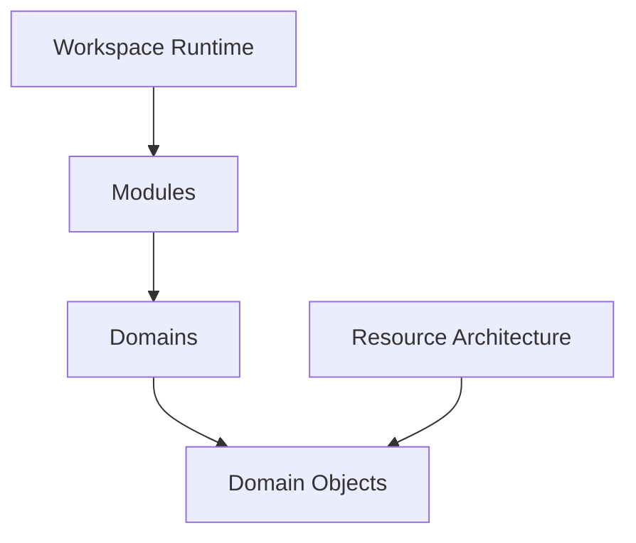
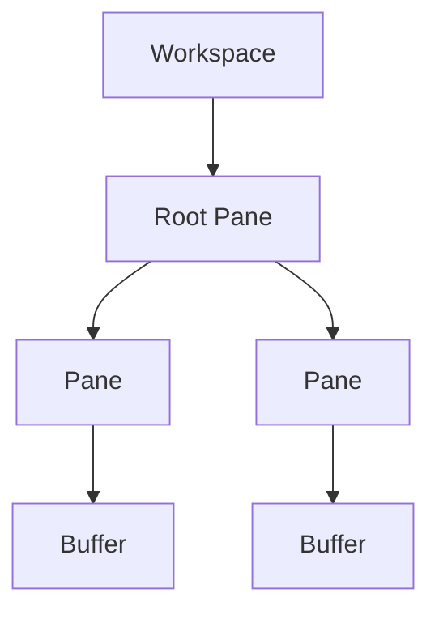
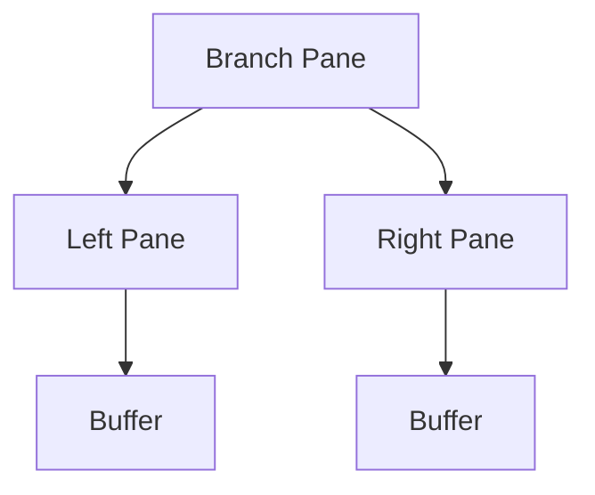
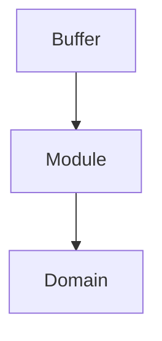
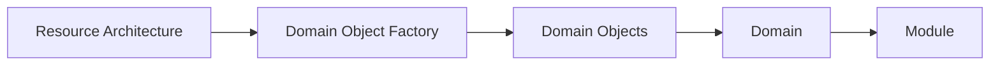
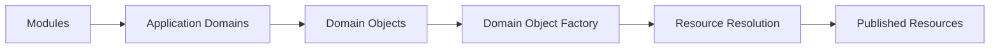

# Application Overview

## Status

Current

---

# Purpose

This document provides a high-level overview of the KJVOnly application.

It introduces the primary concepts used throughout the application and establishes the terminology used by the remaining implementation documentation.

Rather than describing individual source files or implementation details, this document explains how the application is organized and how its major responsibilities relate to one another.

The application consists of two complementary architectures.

The first is the **Application Architecture**, responsible for presenting the user interface and coordinating user interactions.

The second is the **Resource Architecture**, documented by the Architecture Decision Records (ADRs), which defines how application data is identified, discovered, resolved, installed, published, and synchronized.

The two architectures are intentionally independent.

The application operates on Domain Objects.

The Resource Architecture is responsible for producing and maintaining those Domain Objects.

This separation allows the application's behavior and user experience to evolve independently from the mechanisms used to distribute application data.

---

# Scope

This document provides a conceptual overview of the application.

It introduces:

- the application runtime,
- the workspace model,
- panes,
- buffers,
- modules,
- domains,
- the Resource Architecture,
- supporting infrastructure,
- and the relationship between these concepts.

This document does not describe the detailed implementation of individual subsystems.

Topics such as workspace management, pane rendering, domain organization, persistence, synchronization, startup, publishing, and resource resolution are described by their own implementation documents.

---

# Big Takeaway

The KJVOnly application is organized around a persistent workspace.

The workspace is modeled as a recursive pane tree.

Every visible feature in the application is presented by instantiating a module inside a buffer hosted by a leaf pane.

Modules provide user interactions for application domains.

Application domains own the data and behavior used by those modules.

The Resource Architecture retrieves, installs, publishes, and synchronizes the Domain Objects required by those domains.

Together these concepts allow the application runtime and the Resource Architecture to evolve independently while remaining connected through a shared domain model.

---

# Application Model

At a high level, the application consists of four major areas.



Each area has a distinct responsibility.

The **Workspace Runtime** manages the visible application and user interaction.

**Modules** provide individual application features that users interact with.

**Domains** own the application's business concepts, data, and behavior.

The **Resource Architecture** manages the lifecycle of application data from publication through installation and synchronization.

These responsibilities intentionally remain separate.

The workspace does not communicate directly with Nostr.

Modules do not operate on serialized Resources.

The Resource Architecture does not participate in rendering the user interface.

Instead, both architectures meet at the application's Domain Objects.

Domain Objects form the common language shared between the application runtime and the Resource Architecture.

This boundary allows either architecture to evolve without unnecessarily affecting the other.

---

# Application Runtime

The application is implemented as a single-page application (SPA).

Although SvelteKit provides the routing framework, routing is not used as the primary application composition model.

Nearly all application behavior exists within the root route.

The root route hosts a persistent workspace that remains active throughout the lifetime of the application.

User interaction occurs by manipulating the workspace rather than navigating between pages.

Conceptually, the application behaves more like a desktop application than a traditional website.

Subsequent sections describe how the workspace is modeled and how application features are presented within it.

# Workspace Runtime

The Workspace Runtime is responsible for presenting and managing the visible application.

Rather than constructing the user interface through route navigation, the application maintains a persistent workspace that remains active for the lifetime of the application.

All user interaction occurs within this workspace.

Opening a Bible chapter, displaying notes, searching Scripture, viewing references, or interacting with any other application feature occurs by modifying the workspace rather than navigating between pages.

The workspace therefore becomes the primary application runtime.

---

# Workspace Model

The workspace is modeled as a recursive pane tree.

This tree represents the complete visible layout of the application.

Each node within the tree is represented by a `Pane`.

A pane may either contain another pair of panes or display a single buffer.

Conceptually:



The workspace itself is therefore defined entirely by the pane tree.

Changing the workspace means modifying the tree.

The rendered user interface is simply a visual representation of that tree.

---

# Pane Tree

The pane tree is implemented as a conventional recursive tree structure.

Each pane represents either:

- a **branch pane**, or
- a **leaf pane**.

A branch pane divides the available space between two child panes.

A leaf pane hosts a single buffer.

Conceptually:



This recursive structure allows the workspace to support arbitrarily nested layouts while remaining represented by a single root pane.

The current implementation stores this tree directly within the workspace runtime.

Operations such as splitting, replacing, or deleting panes modify the tree before the workspace is re-rendered.

---

# Workspace Operations

The workspace provides a small number of primitive operations that modify the pane tree.

These include:

- splitting a pane,
- replacing the buffer displayed by a pane,
- deleting a pane,
- rebuilding the workspace layout,
- and updating pane dimensions.

More complex user interactions are composed from these primitive operations.

For example, opening a Bible module in a new pane is implemented by splitting an existing pane, creating a new buffer, assigning the requested module to that buffer, and regenerating the workspace layout.

This keeps the workspace runtime small while allowing application behavior to remain flexible.

---

# Rendering

The workspace runtime does not directly construct the visible layout.

Instead, it transforms the pane tree into a CSS Grid representation.

The generated grid becomes the visual representation of the current workspace.

Conceptually:

```text
Pane Tree
        │
        ▼
Grid Template Areas
        │
        ▼
Rendered Workspace
```

The pane tree therefore represents the logical layout.

CSS Grid represents the visual layout.

Separating these concepts allows the application to modify the workspace model without coupling application behavior to the rendering implementation.

---

# Stable Rendering

One of the primary goals of the workspace runtime is preserving module state.

The workspace is designed so that changes affecting one pane do not unnecessarily recreate modules hosted by unaffected panes.

For example, a user may have multiple Bible modules open, each displaying a different chapter and scroll position.

Opening a new module should not cause those existing modules to be recreated.

To preserve component identity, the workspace maintains stable pane identifiers and carefully controls how panes are rendered.

Deleted pane identifiers continue to be tracked after removal, allowing existing pane components to remain associated with their original identity.

This prevents unnecessary component recreation and preserves runtime state such as scroll position, selection state, and module-specific interaction state.

This behavior is a defining characteristic of the application's workspace model and contributes significantly to its desktop-like user experience.

---

# Relationship to Modules

The workspace is intentionally independent of application functionality.

It understands panes and buffers.

It does not understand Bible chapters, notes, search results, or reading plans.

Application functionality is introduced by the modules hosted within buffers.

This separation allows the workspace runtime to remain generic while supporting any number of application modules.

As new modules are introduced, the workspace itself does not require modification.

It continues to provide the same responsibilities:

- layout,
- composition,
- rendering,
- and workspace management.

The modules provide the application behavior.

# Domains

The application organizes its functionality into domains.

A domain represents a cohesive area of application data and behavior.

Examples include:

- Bible
- Notes
- Reading Plans
- Search (future organization may move search beneath individual domains)

Domains define the concepts understood by the application.

They own the application's business data, operations, and rules.

The user interface does not interact directly with infrastructure.

Instead, modules interact with their corresponding domain through strongly typed application models and domain services.

This separation allows the user experience to remain independent from the mechanisms used to retrieve, store, or synchronize application data.

---

# Modules

Modules provide the visible functionality presented to the user.

A module is an instantiable application feature hosted within a buffer.

Unlike a domain, which represents a category of application behavior, modules represent individual user interactions.

Examples include:

- Bible Reader
- Bible Search
- Notes Editor
- Reading Plans
- Publisher Browser

Multiple instances of the same module may exist simultaneously.

For example, a user may open several Bible Reader modules displaying different chapters while also opening one or more Bible Search modules.

Each module instance maintains its own runtime state through its associated buffer.



The buffer owns the runtime state.

The module owns the user interaction.

The domain owns the application behavior.

---

# Modules and Domains

A module belongs to exactly one domain.

A domain may provide one or more modules.

Conceptually:

```text
Bible Domain

    Bible Reader Module

    Bible Search Module

    Bible References Module


Notes Domain

    Notes Module

    Notes Search Module


Reading Plans Domain

    Reading Plans Module
```

This distinction is important.

The user opens modules.

The application operates on domains.

For example, a user does not open "the Bible domain."

The user opens a Bible Reader module.

That module presents and manipulates data owned by the Bible domain.

Likewise, searching Scripture is not a separate application domain.

It is another interaction with Bible-domain data.

Separating domains from modules allows new application functionality to be introduced without changing the application's overall organization.

---

# Domain Objects

Domain Objects are the application's primary data model.

Every application domain exposes strongly typed Domain Objects representing the data required by its modules.

Modules operate exclusively on these Domain Objects.

They do not operate on serialized Resources, Nostr events, Blossom descriptors, or IndexedDB records.

This separation isolates application behavior from transport and persistence concerns.

The Resource Architecture is responsible for producing and maintaining Domain Objects.

The application is responsible for presenting and manipulating them.

Conceptually:



The Domain Object therefore forms the boundary between the application's runtime and the Resource Architecture.

Everything above this boundary is application behavior.

Everything below this boundary is responsible for retrieving, installing, storing, or synchronizing application data.

# Resource Architecture

The application runtime is responsible for presenting and manipulating Domain Objects.

It is not responsible for determining where those Domain Objects originate.

That responsibility belongs to the Resource Architecture.

The Resource Architecture provides the mechanisms required to identify, discover, retrieve, install, publish, and synchronize application resources.

Its primary responsibility is transforming externally distributed Resources into strongly typed Domain Objects that can be consumed by the application.

The complete Resource Architecture is defined by the Architecture Decision Records (ADRs).

This document describes only how the application integrates with that architecture.

---

# Resource Boundary

The application and the Resource Architecture share a common domain model.

The application is responsible for creating, reading, updating, and deleting Domain Objects.

The Resource Architecture is responsible for transforming Published Resources into Domain Objects and serializing Domain Objects back into Published Resources.

This separation allows the application to operate entirely on strongly typed Domain Objects without depending on how those objects are serialized, transported, discovered, or persisted.

Likewise, the Resource Architecture has no knowledge of panes, buffers, modules, or user interface behavior.

Instead, both architectures meet at a single boundary.



The flow above illustrates the relationship between the application and the Resource Architecture.

The application creates and manipulates Domain Objects.

When application data is published, Domain Objects are serialized into Published Resources.

When application data is retrieved, Published Resources are resolved and transformed back into Domain Objects.

The Domain Object therefore forms the architectural boundary between the application runtime and the Resource Architecture.

Everything above this boundary represents application behavior.

Everything below this boundary represents the lifecycle of distributed application resources.

---

# Current Implementation

The current implementation predates the Resource Architecture defined by the ADRs.

Application data is currently accessed through a combination of domain services, transport adapters, local persistence, and background workers.

The `nostr/` package provides the transport implementation responsible for communicating with relays and publishing events.

Shared services coordinate data retrieval, serialization, caching, and persistence before exposing strongly typed application models to the rest of the application.

Local storage is provided through IndexedDB.

Background workers perform long-running operations such as downloading, indexing, and synchronization.

Collectively these packages form the application's current data-access layer.

Although several responsibilities remain combined within the current implementation, the separation between the application runtime and the transport implementation is already present.

Modules operate on typed application models rather than directly manipulating Nostr events or IndexedDB records.

This existing separation provides the foundation for implementing the Resource Architecture defined by the ADRs.

---

# Evolution

The Resource Architecture does not replace the application runtime.

Instead, it refines the implementation beneath the domain layer.

As the application evolves, responsibilities currently implemented across the `nostr/`, `services/`, `storer/`, and `workers/` packages will gradually align with the architectural boundaries defined by the ADRs.

The application runtime, workspace model, pane tree, buffers, modules, and domains remain largely unchanged.

The primary evolution occurs below the Domain Object boundary.

This allows the application's user experience to remain stable while the underlying resource lifecycle becomes more modular, maintainable, and consistent.