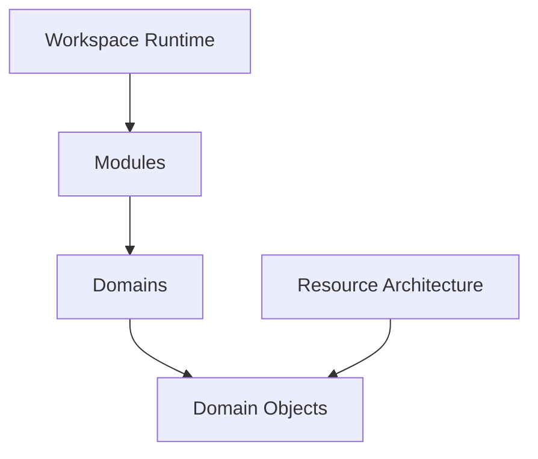

# Application Overview

## Status

Current

---

# Purpose

This document provides a high-level overview of the KJVOnly application.

It introduces the primary concepts used throughout the application and establishes the terminology used by the remaining implementation documentation.

Rather than describing individual source files or implementation details, this document explains how the application is organized and how its major responsibilities relate to one another.

The application consists of two complementary architectures.

The first is the **Application Architecture**, responsible for presenting the user interface and coordinating user interactions.

The second is the **Resource Architecture**, documented by the Architecture Decision Records (ADRs), which defines how application data is identified, discovered, resolved, installed, published, and synchronized.

The two architectures are intentionally independent.

The application operates on Domain Objects.

The Resource Architecture is responsible for producing and maintaining those Domain Objects.

This separation allows the application's behavior and user experience to evolve independently from the mechanisms used to distribute application data.

---

# Scope

This document provides a conceptual overview of the application.

It introduces:

- the application runtime,
- the workspace model,
- panes,
- buffers,
- modules,
- domains,
- the Resource Architecture,
- supporting infrastructure,
- and the relationship between these concepts.

This document does not describe the detailed implementation of individual subsystems.

Topics such as workspace management, pane rendering, domain organization, persistence, synchronization, startup, publishing, and resource resolution are described by their own implementation documents.

---

# Big Takeaway

The KJVOnly application is organized around a persistent workspace.

The workspace is modeled as a recursive pane tree.

Every visible feature in the application is presented by instantiating a module inside a buffer hosted by a leaf pane.

Modules provide user interactions for application domains.

Application domains own the data and behavior used by those modules.

The Resource Architecture retrieves, installs, publishes, and synchronizes the Domain Objects required by those domains.

Together these concepts allow the application runtime and the Resource Architecture to evolve independently while remaining connected through a shared domain model.

---

# Application Model

At a high level, the application consists of four major areas.

Each area has a distinct responsibility.

The **Workspace Runtime** manages the visible application and user interaction.

**Modules** provide individual application features that users interact with.

**Domains** own the application's business concepts, data, and behavior.

The **Resource Architecture** manages the lifecycle of application data from publication through installation and synchronization.

These responsibilities intentionally remain separate.

The workspace does not communicate directly with Nostr.

Modules do not operate on serialized Resources.

The Resource Architecture does not participate in rendering the user interface.

Instead, both architectures meet at the application's Domain Objects.

Domain Objects form the common language shared between the application runtime and the Resource Architecture.

This boundary allows either architecture to evolve without unnecessarily affecting the other.

---

# Application Runtime

The application is implemented as a single-page application (SPA).

Although SvelteKit provides the routing framework, routing is not used as the primary application composition model.

Nearly all application behavior exists within the root route.

The root route hosts a persistent workspace that remains active throughout the lifetime of the application.

User interaction occurs by manipulating the workspace rather than navigating between pages.

Conceptually, the application behaves more like a desktop application than a traditional website.

Subsequent sections describe how the workspace is modeled and how application features are presented within it.