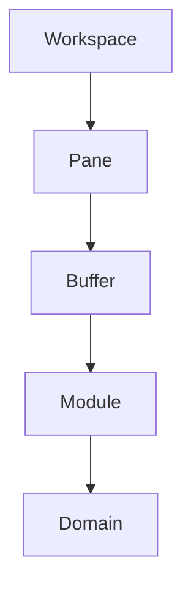
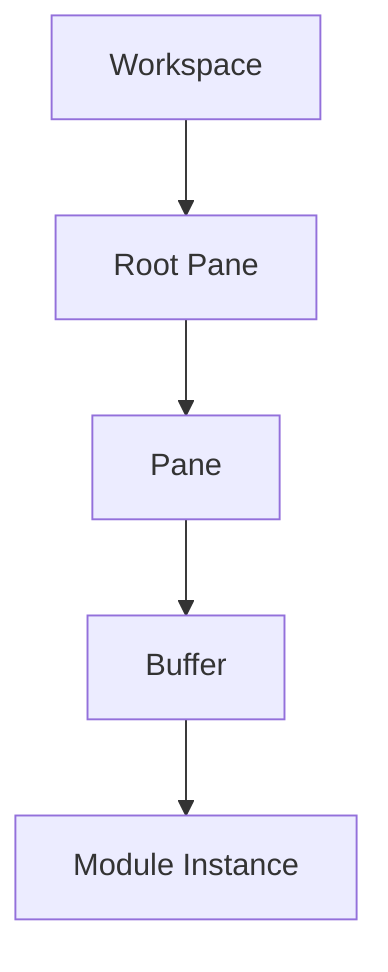
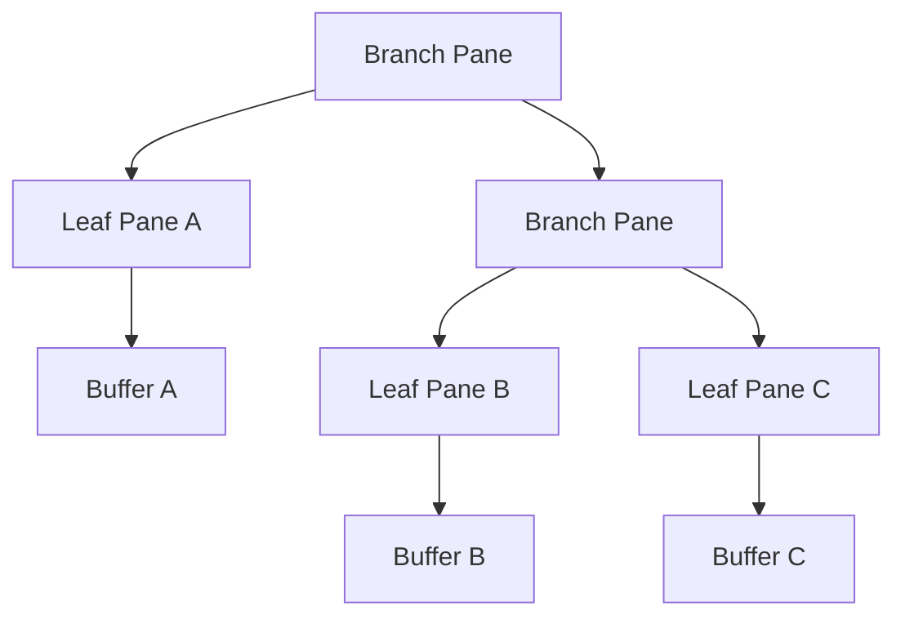
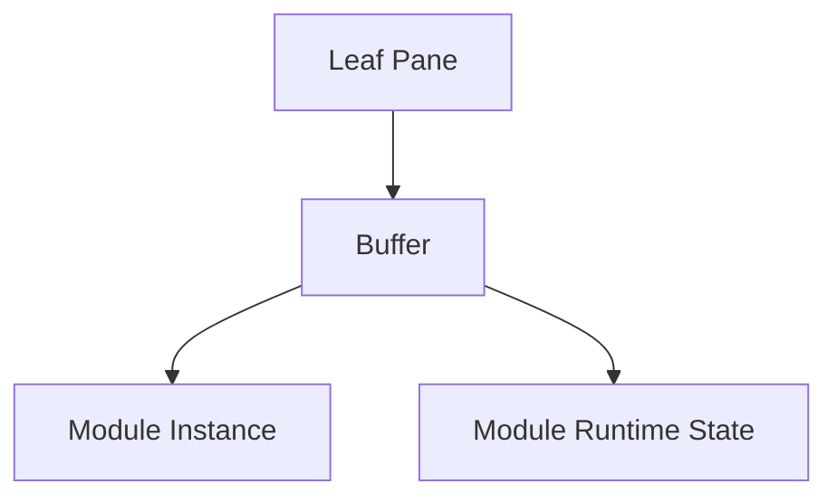
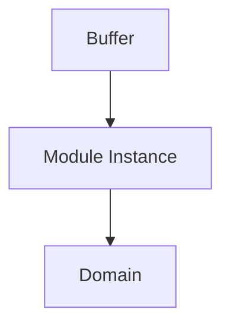
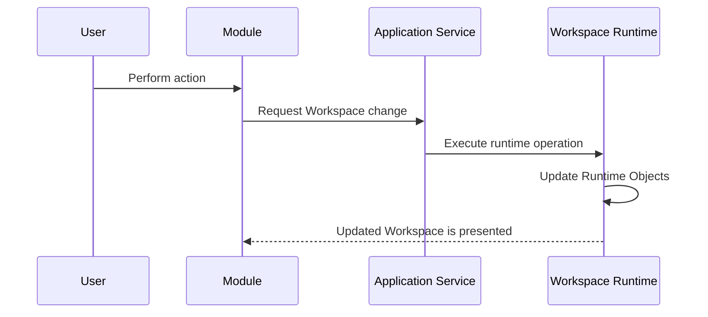

# Workspace Runtime

## Status

Current

---

# Purpose

The Workspace Runtime is responsible for presenting and coordinating the visible application.

It provides the runtime environment in which modules execute, user interaction occurs, and the workspace evolves over time.

This document describes the conceptual runtime model.

It intentionally describes the runtime independently from its current implementation.

Although the current implementation primarily resides within the application's root route, the concepts described by this document are independent of any particular framework, component hierarchy, or source file organization.

---

# Scope

This document defines:

- the responsibilities of the Workspace Runtime,
- the runtime object model,
- the workspace model,
- pane trees,
- buffers,
- modules,
- workspace operations,
- and the relationships between these concepts.

It does not describe the detailed rendering implementation, framework-specific behavior, or source code organization.

Those topics are described by implementation-specific documents.

---

# Background

Unlike traditional web applications, the KJVOnly application does not organize user interaction around route navigation.

Instead, the application maintains a persistent workspace that remains active for the lifetime of the application.

The workspace behaves more like the runtime of a desktop application than a collection of independent web pages.

User interaction occurs by modifying the workspace rather than navigating between routes.

This allows multiple application modules to coexist simultaneously while preserving their independent runtime state.

The Workspace Runtime exists to coordinate this behavior.

---

# Responsibilities

The Workspace Runtime owns:

- the workspace,
- pane management,
- buffer management,
- workspace layout,
- module composition,
- workspace events,
- and runtime object coordination.

It is responsible for presenting the application.

It does not own application data.

It does not own resource distribution.

It does not understand Domain Objects.

Instead, it provides the environment in which application modules execute.

---

# High-Level Design

The Workspace Runtime is organized around a small collection of runtime objects.

Each object owns a single responsibility.



The Workspace owns the pane hierarchy.

Panes organize the visible layout.

Buffers host module instances.

Modules provide user interaction.

Domains provide application behavior.

Together these runtime objects define the visible application.

# Runtime Objects

The Workspace Runtime is composed from a small collection of Runtime Objects.

Runtime Objects describe the execution state of the application.

Unlike Domain Objects, which represent application data, Runtime Objects represent how the application is currently organized and presented.

The primary Runtime Objects are:

- Workspace
- Pane
- Buffer
- Module Instance

Conceptually:


Each Runtime Object owns a single responsibility.

Together they define the visible application independently from the application's Domain Objects and the Resource Architecture.

---

# Workspace

A Workspace is the root Runtime Object of the application.

It owns the complete visible application presented to the user.

Conceptually, a Workspace consists of:

- a root pane,
- the recursive pane tree,
- every buffer,
- every module instance,
- and the runtime state required to coordinate them.

Conceptually:

```text
Workspace

    Root Pane

        Recursive Pane Tree

            Buffers

                Module Instances
```

The current implementation realizes this model primarily through the application's root route and the root pane.

The Workspace itself is currently an implicit concept rather than a dedicated object.

This does not change the runtime model.

Future implementations may introduce a concrete `Workspace` object without changing the responsibilities described by this document.

---

# Runtime State

The Workspace owns the runtime state required to present the application.

Examples include:

- the pane hierarchy,
- buffer assignments,
- module instances,
- workspace layout,
- active selections,
- and other presentation state.

Runtime state is intentionally separate from Domain Objects.

Domain Objects describe the application's data.

Runtime state describes how that data is currently being presented to the user.

Both models are required by the application but serve different responsibilities.

---

# Runtime Persistence

Runtime state may be persisted independently from application Resources.

Persisting runtime state allows the application to restore the user's working environment following:

- a page refresh,
- the application being suspended,
- switching to another application,
- or restarting the browser.

Examples of persisted runtime state include:

- pane layout,
- buffer state,
- the last Bible location,
- selected Bible version,
- theme,
- dark mode,
- and other application preferences.

This information represents the user's working environment rather than application content.

It is therefore distinct from the Resource Architecture and does not become a Published Resource.

---

# Planned Evolution

The runtime model intentionally supports multiple independent Workspaces.

Each Workspace owns its own complete runtime object graph.

Conceptually:

```text
Workspace A

    Root Pane

        Pane Tree


Workspace B

    Root Pane

        Pane Tree


Workspace C

    Root Pane

        Pane Tree
```

Supporting multiple Workspaces enables capabilities such as:

- switching between study sessions,
- saving workspace snapshots,
- restoring previous research,
- maintaining independent study contexts,
- and resuming work exactly where it was left.

These capabilities require no fundamental changes to the runtime model.

They represent natural extensions of the existing Workspace abstraction rather than new architectural concepts.

# Panes

A Pane is a node within the Workspace pane tree.

Panes define how the visible workspace is divided.

Every Workspace owns one root Pane. All other Panes are reachable recursively through that root.

The Pane structure is independent of the modules displayed within it.

A Pane does not understand Bible chapters, notes, search results, reading plans, or other application behavior.

It understands only:

* its position within the tree,
* whether it divides into child Panes,
* the direction of that division,
* and the Buffer hosted by a leaf Pane.

This separation allows the same Pane model to host any current or future Module.

---

# Pane Types

There are two conceptual Pane types:

* Branch Pane
* Leaf Pane

## Branch Pane

A Branch Pane divides its available area between two child Panes.

It contains:

* a left child Pane,
* a right child Pane,
* and a split direction.

A Branch Pane does not directly host a Buffer.

Its responsibility is to define the relationship between its child Panes.

Conceptually:

```text
Branch Pane

    Left Pane

    Right Pane
```

The terms `left` and `right` describe the two child positions in the tree.

Their visual arrangement is determined by the Branch Pane's split direction.

Depending on that direction, the children may appear beside one another or above and below one another.

## Leaf Pane

A Leaf Pane represents one visible region of the Workspace.

It contains:

* a stable Pane identifier,
* and one Buffer.

The Buffer determines which Module Instance is presented within the Pane.

Conceptually:

```text
Leaf Pane

    Buffer

        Module Instance
```

Only Leaf Panes are directly rendered as visible application regions.

---

# Recursive Pane Tree

Branch and Leaf Panes form a recursive tree.

A Branch Pane may contain:

* two Leaf Panes,
* two Branch Panes,
* or one Branch Pane and one Leaf Pane.

This allows the Workspace to represent nested layouts of arbitrary depth.

For example:



The tree is the logical Workspace layout.

The visual layout is derived from this tree.

The rendering technology does not define the Workspace structure; it presents the structure already described by the Pane tree.

---

# Pane Runtime Object

The current Pane runtime object is represented by a recursive interface.

```typescript
export interface Pane {
  id: string | any;
  left: Pane | any;
  right: Pane | any;
  split: string | any;
  buffer: any;
  updateBuffer: Function | any;
  toggle: boolean | any;
}
```

The same interface currently represents both Branch and Leaf Panes.

A Branch Pane is identified by its child Panes and split direction.

A Leaf Pane is identified by its Pane identifier and Buffer.

Conceptually:

| Property | Branch Pane | Leaf Pane |
| -------- | ----------: | --------: |
| `id`     |          No |       Yes |
| `left`   |         Yes |        No |
| `right`  |         Yes |        No |
| `split`  |         Yes |        No |
| `buffer` |          No |       Yes |

Some current properties support the rendering implementation rather than the conceptual Pane model.

Future refactoring may introduce more precise runtime types without changing the recursive Pane-tree architecture.

For example, Branch and Leaf Panes could eventually be represented as distinct types.

The ownership and responsibilities would remain the same.

---

# Pane Identity

Every Leaf Pane has a stable identifier.

Pane identifiers allow the Workspace Runtime to:

* find a Pane,
* update its Buffer,
* split it,
* delete it,
* associate it with a rendered region,
* and preserve its identity across layout changes.

Stable identity is essential because changing the surrounding Workspace should not recreate unaffected Pane components.

A Pane may change its size or position while continuing to represent the same active Module Instance.

For example, splitting a neighboring Pane may change the available area of an existing Bible Pane.

The Bible Module should remain mounted with its current state intact.

Its chapter, scroll position, selection state, and Buffer state should not be reset merely because the Workspace layout changed.

Pane identity allows layout to evolve independently from Module identity.

---

# Pane Data and Pane Component

The Pane runtime object and the Pane component are separate concepts.

The **Pane runtime object** is a node in the recursive Workspace model.

It describes:

* tree relationships,
* split direction,
* Pane identity,
* and Buffer assignment.

The **Pane component** presents a Leaf Pane in the user interface.

It is responsible for:

* applying the Pane's current dimensions,
* resolving the Module associated with its Buffer,
* and rendering that Module Instance.

Conceptually:

```text
Pane Runtime Object
        ↓
Pane Component
        ↓
Buffer
        ↓
Module Instance
```

The runtime object belongs to the Workspace model.

The component belongs to the rendering implementation.

Keeping these responsibilities separate allows the Workspace model to remain independent from the framework used to render it.

---

# Pane Operations

The Workspace Runtime modifies the application through operations on the Pane tree.

The primary Pane operations are:

* finding a Pane,
* splitting a Pane,
* replacing a Pane's Buffer,
* and deleting a Pane.

These operations modify runtime state rather than application data.

## Find

A Pane is located recursively from the root Pane using its stable identifier.

Finding a Pane allows other Workspace operations to target one specific region without requiring knowledge of the entire rendered layout.

## Split

Splitting a Leaf Pane converts it into a Branch Pane.

The existing Pane state becomes one child.

A new Leaf Pane and Buffer become the other child.

Conceptually:

```text
Before

Leaf Pane A
    Buffer A
```

```text
After

Branch Pane
    Left: Leaf Pane A
        Buffer A

    Right: Leaf Pane B
        Buffer B
```

The existing Buffer is preserved.

The split introduces a new Pane without recreating the Module Instance already hosted by the original Pane.

## Replace Buffer

Replacing a Buffer changes the Module Instance displayed by an existing Leaf Pane without changing the surrounding Pane tree.

The Pane retains its position and identity while presenting a different application feature.

## Delete

Deleting a Leaf Pane removes it from the tree.

Its sibling replaces the parent Branch Pane so the remaining tree stays valid.

The Workspace then reorganizes itself around the remaining Panes.

Conceptually:

```text
Before

Branch Pane
    Leaf Pane A
    Leaf Pane B
```

```text
Delete Pane B
```

```text
After

Leaf Pane A
```

Deletion affects the targeted Pane and the minimum surrounding tree structure required to close the gap.

Unrelated Panes and Module Instances remain intact.

---

# Pane Responsibility

A Pane owns one structural responsibility:

> A Pane defines one node in the visible Workspace hierarchy.

A Pane does not own:

* Module behavior,
* Domain Objects,
* application services,
* resource loading,
* persistence,
* synchronization,
* or publishing.

A Leaf Pane hosts a Buffer.

A Branch Pane organizes child Panes.

The Workspace Runtime owns operations across the complete Pane tree.

# Buffers

A Buffer represents one active Module Instance and its runtime state.

Every Leaf Pane hosts exactly one Buffer.

The Pane determines where the Module Instance appears within the Workspace.

The Buffer determines what is displayed there and preserves the state required by that Module Instance.

Conceptually:



This separation allows Pane layout and Module behavior to evolve independently.

A Pane may change position or size without changing its Buffer.

A Buffer may display a different Module Instance without changing the surrounding Pane tree.

---

# Buffer Responsibility

A Buffer owns the runtime state associated with one Module Instance.

This includes:

* the Module type,
* the mounted component,
* Module initialization data,
* Module-specific runtime state,
* keyboard bindings,
* selection state,
* and a stable Buffer identity.

The Buffer does not own the visible layout.

The Pane owns the Buffer's position within the Workspace.

The Buffer does not own domain behavior.

The Module and its associated Domain own that behavior.

The Buffer connects these responsibilities by hosting a Module Instance within a Pane.

---

# Buffer Runtime Object

The current Buffer runtime object is represented by a class.

```typescript
export class Buffer {
  key: string = uuid4();
  name: string = '';
  component: any;
  componentName: Modules = Modules.NULL;
  keyboardBindings: Map<string, Function> = new Map<string, Function>();
  selected: boolean = false;
  bag: any = {};
  onFocus: Function = () => {};
}
```

The Buffer contains both identity and runtime state.

| Property           | Responsibility                                               |
| ------------------ | ------------------------------------------------------------ |
| `key`              | Provides stable identity for the Buffer.                     |
| `name`             | Provides a readable name for the active Buffer.              |
| `component`        | References the currently mounted component.                  |
| `componentName`    | Identifies the Module type hosted by the Buffer.             |
| `keyboardBindings` | Stores keyboard actions associated with the Module Instance. |
| `selected`         | Tracks whether the Buffer is currently selected.             |
| `bag`              | Stores Module initialization and runtime state.              |
| `onFocus`          | Defines behavior invoked when the Buffer receives focus.     |

Some of these properties reflect the current implementation rather than the essential Buffer model.

The essential responsibility remains stable:

> A Buffer identifies and preserves one active Module Instance and its runtime state.

---

# Buffer Identity

Every Buffer has a stable identity independent of the Pane that displays it.

Stable Buffer identity allows the application to distinguish between multiple instances of the same Module type.

For example, two Buffers may both host Bible Reader Modules while displaying different chapters.

```text
Buffer A

    Bible Reader Module

    Genesis 1


Buffer B

    Bible Reader Module

    Romans 8
```

The Module type is the same.

The Buffer identity and runtime state are different.

This allows multiple independent Module Instances to coexist within one Workspace.

---

# Buffer State

The Buffer's `bag` provides general-purpose state associated with its Module Instance.

The Buffer bag is the current implementation of Module navigation context.

Examples include:

* a Bible location reference,
* a selected Bible version,
* reading plan navigation state,
* search context,
* Module initialization parameters,
* and other state required to restore or continue the interaction.

The Buffer does not define the meaning of this state.

The hosted Module interprets the values stored within the Buffer.

For example, a Bible Module may interpret:

```typescript
{
  bibleLocationRef: '1_1',
  bibleVersion: 'kjv'
}
```

while a Search Module may use an entirely different structure.

This keeps the Workspace Runtime independent from Module-specific behavior.

The Workspace can create, move, preserve, or restore a Buffer without understanding the contents of its state.

---

# Buffer and Pane Independence

Panes and Buffers have separate identities and responsibilities.

A Pane is a structural node in the Workspace.

A Buffer is an active application view hosted by a Leaf Pane.

This distinction supports several Workspace operations.

## Replace

The Buffer associated with an existing Leaf Pane may be replaced.

The Pane retains its position within the tree while displaying a new Module Instance.

```text
Before

Leaf Pane A

    Buffer

        Bible Reader Module
```

```text
After

Leaf Pane A

    Buffer

        Notes Module
```

The surrounding Workspace layout does not change.

## Split

When a Leaf Pane is split, its existing Buffer is preserved within one of the resulting child Panes.

A new Buffer is created for the new child Pane.

```text
Before

Leaf Pane A

    Buffer A
```

```text
After

Branch Pane

    Leaf Pane A

        Buffer A

    Leaf Pane B

        Buffer B
```

The original Module Instance remains associated with its existing Buffer.

## Delete

When a Leaf Pane is deleted, the Buffer hosted by that Pane is removed from the active Workspace.

The sibling Pane replaces the surrounding Branch Pane.

Buffers belonging to unrelated Panes remain unchanged.

---

# Buffer Persistence

Buffer state may be persisted as part of the Workspace runtime state.

Persisting Buffers allows the application to restore:

* which Modules were open,
* the initialization state of each Module,
* the active Bible locations,
* search context,
* reading plan navigation,
* and other Module-specific state.

A persisted Buffer represents the state required to reconstruct a Module Instance.

It does not persist the rendered component itself.

When the Workspace is restored, the application uses the persisted Buffer state to recreate the appropriate Module Instance.

This distinction separates serializable runtime state from framework-specific component instances.

---

# Buffer and Module Relationship

A Buffer hosts exactly one Module Instance at a time.

The Buffer owns the identity and runtime state of that instance.

The Module owns the user interaction and application behavior.

Conceptually:

```text
Buffer

    Identity

    Runtime State

    Module Type

        Module Instance

            Domain Behavior
```

The Buffer does not need to understand the Domain used by the Module.

It only needs enough information to identify, initialize, and preserve the Module Instance.

This allows the Buffer abstraction to support any current or future Module without requiring changes to the Workspace Runtime.

---

# Buffer Responsibility Boundary

A Buffer owns:

* Module Instance identity,
* Module selection,
* initialization state,
* runtime state,
* keyboard bindings,
* and focus behavior.

A Buffer does not own:

* Pane layout,
* Workspace structure,
* Module behavior,
* Domain Objects,
* data persistence,
* resource resolution,
* synchronization,
* or publishing.

The Pane hosts the Buffer.

The Buffer hosts the Module Instance.

The Module interacts with the Domain.

# Module Instances

A Module Instance provides one user interaction within the Workspace.

Every Module Instance is hosted by exactly one Buffer.

A Module Instance presents the capabilities of one application Domain while maintaining its own independent runtime state.

Examples include:

* a Bible Reader,
* a Bible Search,
* a Notes editor,
* or a Reading Plan viewer.

A Module Instance represents one active interaction rather than an application concept.

Conceptually:



The Buffer hosts the Module Instance.

The Module Instance presents the Domain.

The Domain owns the application's behavior.

---

# Module Responsibility

A Module Instance owns the interaction between the user and a Domain.

Its responsibilities include:

* presenting user interface,
* responding to user input,
* requesting Domain operations,
* maintaining interaction state,
* and updating the Buffer when required.

A Module Instance does not own:

* Workspace layout,
* Pane management,
* Buffer identity,
* Resource resolution,
* synchronization,
* or persistence.

Its responsibility begins when it is hosted by a Buffer and ends when it is removed from the Workspace.

---

# Module Types

A Module represents a reusable application feature.

A Module Instance represents one execution of that feature.

For example:

```text
Bible Reader Module

    Instance A
        Genesis 1

    Instance B
        Romans 8

    Instance C
        Psalms 23
```

All three Module Instances present the same Module type.

Each maintains its own independent runtime state.

This allows multiple interactions with the same Domain to exist simultaneously without interfering with one another.

---

# Modules and Domains

A Module belongs to one Domain.

A Domain may expose one or more Module types.

Conceptually:

```text
Bible Domain

    Bible Reader Module

    Bible Search Module

    Bible References Module


Notes Domain

    Notes Editor Module

    Notes Search Module


Reading Plans Domain

    Reading Plan Module
```

The user opens Modules.

Modules interact with Domains.

Domains own the application's business behavior.

This distinction separates user interaction from application logic.

New Modules may be introduced without changing the Domain.

Likewise, Domain behavior may evolve without fundamentally changing the Modules that present it.

---

# Module Independence

Modules should remain loosely coupled.

A Module may communicate with other parts of the application through:

- Application Services,
- application events,
- shared Domain state,
- or Buffer navigation context.

A Module should not directly manipulate another Module Instance or depend on its component implementation.

A Module should not directly manipulate another Module's runtime state.

Communication between Modules should occur through Application Services, events, shared Domain state, or navigation context rather than direct component references.

This allows each Module Instance to remain independently reusable within the Workspace.

For example, opening a new Bible Reader Module should not affect an existing Notes Module or Reading Plan Module.

Each Module continues operating within its own Buffer and runtime state.

---

# Module Lifecycle

A Module Instance follows a simple lifecycle.

```text
Created
    ↓
Initialized
    ↓
Presented
    ↓
Interacts with User
    ↓
Destroyed
```

The Workspace Runtime owns this lifecycle.

The Buffer preserves the runtime state associated with the Module Instance.

The Module owns the interaction that occurs during its lifetime.

---

# Module Extensibility

The Workspace Runtime does not need to understand individual Modules.

A new Module can be introduced without changing the Workspace model.

As long as a Module can be hosted within a Buffer, it naturally becomes part of the Workspace.

This allows the application to grow through new Modules while preserving the same runtime architecture.

The Workspace Runtime remains responsible for presentation.

The Domain remains responsible for behavior.

The Module provides the bridge between them.

---

# Module Responsibility Boundary

A Module owns:

* user interaction,
* presentation,
* interaction state,
* and communication with its Domain.

A Module does not own:

* Workspace structure,
* Pane layout,
* Buffer identity,
* Domain Objects,
* Resource Architecture,
* persistence,
* synchronization,
* or publishing.

The Workspace Runtime hosts the Module.

The Module presents the Domain.

The Domain owns the application's behavior.

# Workspace Operations

The Workspace Runtime evolves through a small set of operations applied to Runtime Objects.

These operations modify the visible application without changing Domain Objects or application data.

The primary Workspace operations are:

* find a Pane,
* split a Pane,
* replace a Buffer,
* delete a Pane,
* open a Module,
* select or focus a Buffer,
* and update the Workspace layout.

Each operation acts on the runtime model.

The Workspace Runtime owns the operation.

Modules may request Workspace changes through Application Services, but they do not directly manipulate the Pane tree.

---

# Find Pane

Most Workspace operations begin by locating a Pane within the recursive Pane tree.

A Pane is identified by its stable Pane identifier.

The runtime begins at the root Pane and recursively searches its left and right children until the requested Pane is found.

Conceptually:

```text
Root Pane
    ↓
Search left subtree
    ↓
Search right subtree
    ↓
Matching Pane
```

Finding a Pane is a structural operation.

It does not depend on the Buffer or Module hosted within the Pane.

This allows the Workspace Runtime to target one visible region without understanding the application behavior presented there.

---

# Split Pane

Splitting a Pane creates an additional visible region within the Workspace.

A split operation begins with an existing Leaf Pane.

The existing Pane becomes a Branch Pane with two children:

* one child preserves the existing Buffer,
* the other child receives a new Buffer.

Conceptually:

```text
Before

Leaf Pane A

    Buffer A
```

```text
After

Branch Pane

    Leaf Pane A

        Buffer A

    Leaf Pane B

        Buffer B
```

The Branch Pane records the split direction used to arrange its children.

The existing Buffer and Module Instance remain intact.

Only the minimum runtime structure required for the new Pane is introduced.

This preserves the active state of the original Module Instance while extending the Workspace.

---

# Replace Buffer

Replacing a Buffer changes the Module Instance displayed by an existing Leaf Pane.

The Pane retains:

* its identity,
* its position within the Pane tree,
* and its relationship to the surrounding Workspace.

Only its Buffer changes.

Conceptually:

```text
Before

Leaf Pane A

    Buffer

        Bible Reader Module
```

```text
After

Leaf Pane A

    Buffer

        Notes Module
```

Buffer replacement provides a simple way to change the activity displayed in one region without restructuring the Workspace.

It is distinct from splitting a Pane because it does not create an additional visible region.

---

# Delete Pane

Deleting a Pane removes one Leaf Pane and its Buffer from the active Workspace.

Because the Pane tree is recursive, removing a Leaf Pane also requires reorganizing its immediate parent Branch Pane.

The deleted Pane's sibling replaces the parent Branch Pane.

Conceptually:

```text
Before

Branch Pane

    Leaf Pane A

    Leaf Pane B
```

```text
Delete Pane B
```

```text
After

Leaf Pane A
```

If the sibling is itself a Branch Pane, its subtree replaces the deleted Pane's parent.

Deletion therefore preserves a valid recursive Pane tree while removing only the targeted runtime state and the minimum surrounding structure required to close the gap.

Unrelated Panes, Buffers, and Module Instances remain intact.

---

# Open Module

Opening a Module creates or replaces Runtime Objects required to display a new Module Instance.

A Module may be opened by:

* splitting an existing Pane and creating a new Buffer,
* or replacing the Buffer in an existing Leaf Pane.

The requesting Module does not manipulate the Pane tree directly.

Instead, it requests the operation through an Application Service such as the Pane Service.

Conceptually:

```text
Module Instance

    requests Module open

        ↓

Pane Service

        ↓

Workspace Runtime

        ↓

Split Pane or Replace Buffer
```

For example, selecting a reference from a Bible Module may request that another Module be opened in a new Pane.

The Bible Module knows which Module should be opened and which navigation context should be supplied.

The Workspace Runtime decides how that Module Instance is introduced into the visible Workspace.

This preserves the ownership boundary between application behavior and runtime coordination.

---

# Navigation Context

A Module may provide initialization context when requesting another Module.

The current implementation carries this context through the Buffer's `bag`.

The Buffer bag is therefore the current implementation of Module navigation context.

Navigation context may contain information such as:

* a Bible location reference,
* a Bible version,
* selected verses,
* reading plan navigation state,
* search results,
* references,
* or other Module initialization data.

Conceptually:

```text
Source Module

    Navigation Context

        ↓

New Buffer

        ↓

Target Module Instance
```

For example, a Reading Plan Module may open a Bible Reader Module with a navigation context describing the readings currently in progress.

The Bible Reader interprets that context and presents only the requested chapters or verses.

The Reading Plan Module does not directly control the Bible Reader.

It provides context.

The target Module determines how that context affects its behavior.

This allows Modules to coordinate without depending directly on one another's component implementations.

---

# Focus and Selection

The Workspace Runtime may track which Buffer or Pane is currently selected.

Selection state supports application behavior such as:

* keyboard input,
* focus handling,
* visual selection,
* commands applied to the active Module,
* and switching attention between Pane regions.

The selected Buffer may expose focus behavior through its runtime state.

Focus and selection remain runtime concerns.

They do not change the Domain Objects presented by the Module.

---

# Module Communication

Modules should remain loosely coupled.

A Module may communicate with other parts of the application through:

* Application Services,
* application events,
* shared Domain state,
* or Buffer navigation context.

A Module should not directly manipulate another Module Instance or depend on its component implementation.

For example, when a Note is created, Notes Modules may refresh through an application event or shared Notes state.

The Module creating the Note does not directly invoke rendering behavior on every open Notes Module.

Likewise, a Reading Plan Module may provide navigation context to a Bible Reader without depending on the Bible Reader's internal component structure.

This allows multiple Module Instances to respond consistently while remaining independently reusable.

---

# Runtime Events

Workspace operations are event-driven.

User actions and Module requests produce events that are handled by the Workspace Runtime or an Application Service coordinating with it.

Examples include:

* open a Module,
* split a Pane,
* close a Pane,
* replace a Buffer,
* select a Pane,
* update the Workspace layout,
* and notify Module Instances of shared application changes.

Conceptually:



Events allow the requester to express intent without owning the operation that realizes it.

The Module requests application behavior.

The Application Service exposes the capability.

The Workspace Runtime modifies the runtime model.

---

# Layout Update

Operations that change the Pane tree require the visible Workspace layout to be recalculated.

Examples include:

* splitting a Pane,
* deleting a Pane,
* and restoring a Workspace.

The runtime updates the logical Pane tree first.

The rendering implementation then derives the visible layout from that updated model.

Conceptually:

```text
Workspace Operation
        ↓
Update Pane Tree
        ↓
Derive Layout
        ↓
Present Updated Workspace
```

The runtime operation does not directly manipulate unrelated Module behavior.

Existing Buffers and Module Instances remain associated with their stable identities wherever possible.

This separation allows the Workspace layout to change without unnecessarily recreating unaffected parts of the application.

---

# Operation Ownership

The Workspace Runtime owns:

* Pane-tree modification,
* Buffer assignment,
* Module Instance placement,
* selection and focus coordination,
* and layout updates.

Application Services expose these capabilities to Modules.

Modules may request operations but do not own their implementation.

Domains remain independent from Workspace structure.

The Resource Architecture remains independent from Workspace operations.

This keeps runtime coordination centralized without coupling the Workspace Runtime to application-specific behavior.
