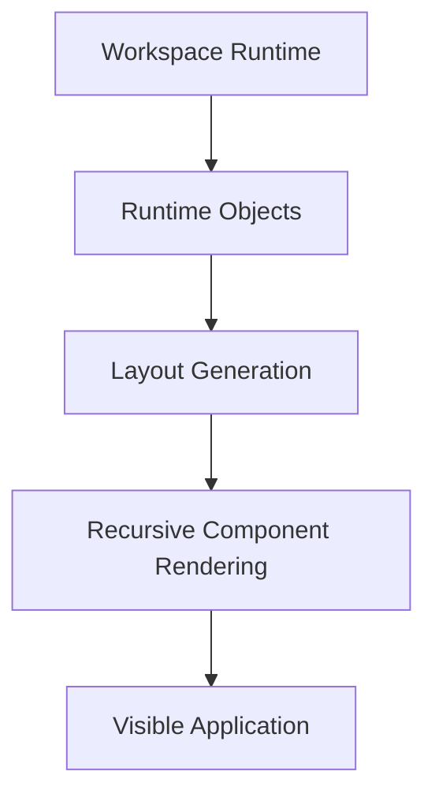
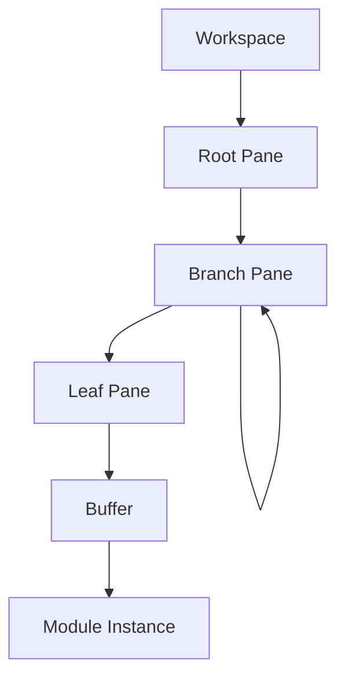
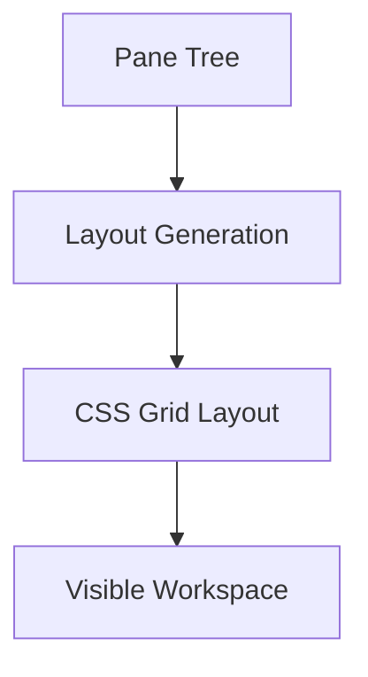
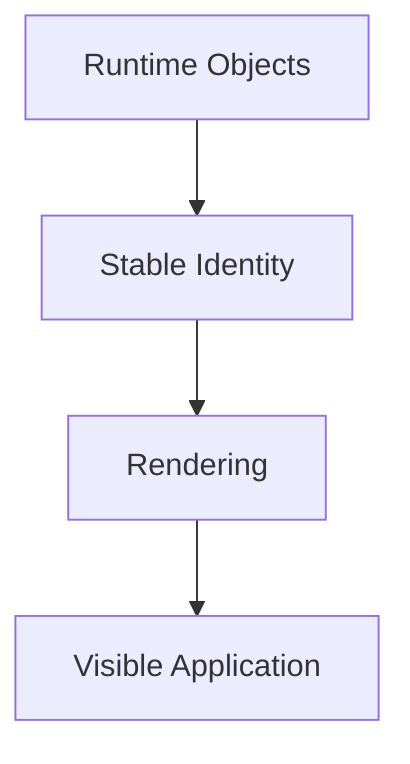
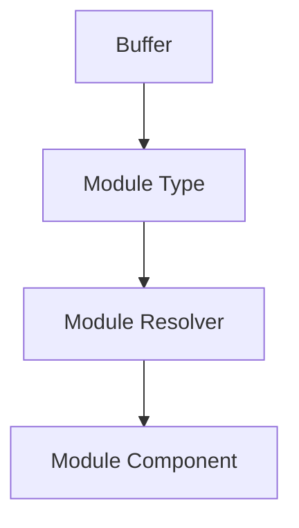

# Runtime Rendering

## Status

Current

---

# Purpose

The Workspace Runtime defines the logical structure of the application.

This document describes how that runtime model is rendered into the visible user interface.

It explains how the current implementation transforms Runtime Objects into a stable, interactive application while remaining faithful to the Workspace Runtime described by **002-workspace-runtime.md**.

---

# Scope

This document describes:

* the rendering pipeline,
* recursive rendering,
* dynamic module rendering,
* layout generation,
* component identity,
* rendering updates,
* and rendering performance.

It focuses on the current rendering implementation.

It does not redefine the Workspace Runtime or the Runtime Objects described by the previous document.

---

# Background

The KJVOnly application is implemented as a Single Page Application.

Unlike traditional web applications, navigation does not occur by transitioning between routes.

Instead, the application maintains one persistent Workspace.

The Workspace Runtime evolves over time while the rendering implementation updates only the portions of the interface affected by runtime changes.

This approach allows multiple Module Instances to remain active simultaneously while preserving their independent runtime state.

The rendering implementation exists to present the Workspace Runtime.

It does not define the runtime model.

---

# Responsibilities

The rendering implementation is responsible for:

* presenting the Workspace Runtime,
* recursively rendering the Pane tree,
* generating the visible layout,
* dynamically loading Module components,
* preserving component identity,
* and efficiently updating the visible application.

It is not responsible for:

* Workspace operations,
* Pane-tree manipulation,
* Buffer management,
* Domain behavior,
* Resource resolution,
* synchronization,
* or application services.

Those responsibilities belong to other parts of the application.

The rendering implementation consumes the Workspace Runtime.

It does not own it.

---

# Rendering Pipeline

Rendering is performed by transforming the Workspace Runtime into visible user interface components.

Conceptually:



The rendering pipeline begins with the Runtime Objects managed by the Workspace Runtime.

Those Runtime Objects define the logical structure of the application.

The rendering implementation derives the visible layout from that structure before recursively rendering the appropriate components.

The visible application is therefore a presentation of the Workspace Runtime rather than the source of truth itself.

This distinction allows the runtime model and rendering implementation to evolve independently while preserving a consistent application architecture.

# Recursive Rendering

The Workspace Runtime models the visible application as a recursive Pane tree.

The rendering implementation preserves this model by rendering the Pane tree recursively.

Each Pane is responsible for rendering only itself.

If the Pane is a Branch Pane, it renders its child Panes.

If the Pane is a Leaf Pane, it renders its hosted Buffer.

Conceptually:



The rendering hierarchy therefore mirrors the runtime hierarchy.

No separate rendering model is required.

The recursive Workspace model naturally produces a recursive component tree.

---

# Recursive Component Composition

The current implementation realizes the recursive Pane tree using recursive components.

Each rendered Branch Pane creates child Pane components.

Each rendered Leaf Pane creates the component associated with its Buffer.

Conceptually:

```text
Pane Component

    Branch Pane

        Pane Component

        Pane Component

    Leaf Pane

        Module Component
```

Each component is responsible only for rendering the Runtime Object it represents.

No component requires knowledge of the complete Workspace.

The Workspace emerges naturally from recursive composition.

---

# Branch and Leaf Rendering

Branch Panes and Leaf Panes have different rendering responsibilities.

A Branch Pane:

* divides available space,
* renders its child Panes,
* and coordinates recursive rendering.

A Leaf Pane:

* renders one Buffer,
* hosts one Module Instance,
* and presents one visible application region.

This distinction mirrors the responsibilities defined by the Workspace Runtime.

The rendering implementation therefore follows the runtime model rather than introducing an alternative rendering hierarchy.

---

# Rendering Ownership

The rendering implementation never constructs the Workspace model.

It consumes the Runtime Objects already owned by the Workspace Runtime.

The rendering layer is responsible only for presentation.

Workspace operations continue to belong to the Workspace Runtime.

Application behavior continues to belong to Modules and Domains.

This separation allows the runtime model to remain independent from the rendering framework.

A future rendering implementation could adopt a different UI framework while preserving the same recursive Workspace architecture.

---

# Rendering Responsibility Boundary

The rendering implementation owns:

* recursive component composition,
* visual presentation,
* layout realization,
* and Module component rendering.

It does not own:

* Pane-tree modification,
* Buffer management,
* Workspace operations,
* Domain behavior,
* Application Services,
* or the Resource Architecture.

The rendering implementation presents the Workspace Runtime.

It does not define it.

# Layout Generation

The Workspace Runtime defines the logical structure of the application as a recursive Pane tree.

The rendering implementation is responsible for transforming that tree into a two-dimensional layout that can be presented to the user.

The layout algorithm derives the visible workspace directly from the recursive Pane hierarchy.

The Pane tree remains the source of truth.

The generated layout is a presentation of that tree.

Conceptually:



---

# Recursive Layout

Each Branch Pane divides the available layout into two regions.

Each child Pane then repeats the same process recursively until every Leaf Pane has been assigned a visible region.

Conceptually:

```text
Root Pane

    Horizontal Split

        Left Pane

        Right Branch

            Vertical Split

                Top Pane

                Bottom Pane
```

The layout is therefore generated by traversing the recursive Pane tree rather than by manually positioning individual components.

This allows layouts of arbitrary complexity to be generated from a single runtime model.

---

# Layout Algorithm

The current implementation generates a CSS Grid from the Pane tree.

Rather than assigning fixed row and column sizes, the layout algorithm determines the minimum grid capable of representing the current Workspace.

To accomplish this, the recursive Pane hierarchy is analyzed to determine the smallest common subdivision that satisfies every nested split.

The resulting grid is generated using a least common denominator strategy.

This allows nested horizontal and vertical splits to coexist within a consistent two-dimensional grid while preserving the logical relationships described by the Pane tree.

The algorithm produces a grid that is entirely derived from the runtime model.

No layout information is duplicated outside of the Pane tree.

---

# Rendering Independence

The layout algorithm is an implementation detail of the rendering layer.

The Workspace Runtime remains unaware of:

* CSS Grid,
* rows,
* columns,
* template areas,
* or rendering technologies.

Its responsibility ends with the Pane tree.

The rendering implementation determines how that tree is realized visually.

Separating the runtime model from the layout algorithm allows future rendering technologies to generate the same visible Workspace without changing the Workspace Runtime.

---

# Stable Layout

Workspace operations modify the Pane tree rather than the rendered layout directly.

Whenever the Pane tree changes, the rendering implementation derives a new layout from the updated runtime model.

Because the layout is always generated from the Pane tree, there is no separate layout state that must be synchronized.

The runtime model remains the single source of truth.

This greatly simplifies layout management while ensuring the visible Workspace always reflects the current runtime state.

# Stable Component Identity

One of the primary goals of the rendering implementation is to preserve the identity of existing Module Instances while the Workspace evolves.

Workspace operations such as:

* splitting a Pane,
* deleting a Pane,
* replacing a Buffer,
* or restoring a Workspace,

should affect only the Runtime Objects directly involved in the operation.

Existing Module Instances should remain active whenever possible.

---

# Identity Before Rendering

The rendering implementation treats Runtime Object identity as more important than visual position.

A Pane may:

* change size,
* change position,
* gain or lose neighboring Panes,
* or become part of a different layout,

while continuing to represent the same Runtime Object.

Likewise, a Buffer continues to represent the same Module Instance regardless of where its Pane appears within the Workspace.

Conceptually:

```text
Before

Pane A

    Buffer A

        Bible Reader
```

```text
After Split

Branch

    Pane A

        Buffer A

            Bible Reader

    Pane B

        Buffer B

            Notes
```

The Bible Reader has not been recreated.

Only the Workspace structure has changed.

---

# Stable Runtime Identity

Each Runtime Object maintains a stable identity throughout its lifetime.

Examples include:

* Pane identifiers,
* Buffer identifiers,
* and Module Instance state.

Rendering is driven by these identities rather than by the visual layout.

This allows the rendering implementation to recognize when an existing Runtime Object should continue to exist even though the surrounding Workspace has changed.

Stable identity allows the rendering layer to preserve:

* component state,
* scroll position,
* focus,
* user selections,
* keyboard state,
* and other runtime information.

---

# Minimal Rendering

Workspace operations modify only the Runtime Objects directly affected by the operation.

The rendering implementation then updates only the corresponding portions of the visible application.

For example, splitting one Pane should not recreate unrelated Module Instances elsewhere in the Workspace.

Likewise, deleting a neighboring Pane should not reset an active Bible Reader or Notes editor.

The rendering implementation therefore strives to preserve existing component instances whenever their corresponding Runtime Objects remain unchanged.

---

# Runtime-Driven Rendering

The visible application is always derived from the current Runtime Objects.

Rendering decisions are based upon changes to Runtime Object identity rather than changes to the surrounding layout.

Conceptually:



This allows the Workspace layout to evolve independently from the lifetime of individual Module Instances.

Layout may change.

Runtime Object identity remains stable.

---

# Rendering Performance

Preserving Runtime Object identity minimizes unnecessary rendering work.

Only Runtime Objects that have actually changed require corresponding updates to the visible application.

Unchanged Runtime Objects continue to reuse their existing rendered components.

This approach improves both rendering performance and user experience.

Users experience a continuous Workspace rather than a collection of pages that are repeatedly recreated as the layout changes.

---

# Responsibility Boundary

The Workspace Runtime owns Runtime Object identity.

The rendering implementation respects that identity while presenting the visible application.

Neither the rendering implementation nor the Workspace Runtime owns the behavior of Module Instances.

Module behavior remains the responsibility of the Module and its associated Domain.

This separation allows the Workspace to evolve without unnecessarily disrupting the user's current interaction.

# Module Resolution

The Workspace Runtime does not understand how individual Modules are implemented.

Its responsibility ends with assigning a Buffer to a Leaf Pane.

The rendering implementation is responsible for resolving the appropriate Module component for that Buffer.

Conceptually:



The Buffer identifies which Module should be presented.

The rendering implementation resolves that Module into the appropriate user interface component.

This separation keeps the Workspace Runtime independent from application-specific presentation.

---

# Dynamic Module Composition

The Workspace Runtime does not maintain a fixed set of visible Modules.

Instead, the visible application is composed dynamically from the Buffers currently present within the Workspace.

Each Leaf Pane renders the Module associated with its Buffer.

As Buffers are added, removed, or replaced, the rendering implementation naturally composes a different visible application without changing the underlying runtime architecture.

For example:

```text
Workspace

    Bible Reader

    Notes

    Search
```

may later become:

```text
Workspace

    Bible Reader

    Bible Reader

    Reading Plan

    Notes
```

The Workspace Runtime does not distinguish between these layouts.

It simply presents the Runtime Objects currently contained within the Workspace.

---

# Module Independence

Each Module Instance is resolved independently.

The rendering implementation does not require knowledge of neighboring Modules.

A Module is rendered solely from the information contained within its associated Buffer.

This allows multiple instances of the same Module type to coexist naturally.

For example:

```text
Bible Reader

Genesis 1
```

and

```text
Bible Reader

Romans 8
```

represent two independent Module Instances.

Each is resolved independently despite sharing the same Module type.

---

# Extensible Composition

The rendering implementation is intentionally open to new Module types.

Adding a new Module requires:

* registering the Module,
* associating it with a Module type,
* and providing the corresponding rendering component.

No changes are required to:

* the Workspace Runtime,
* Pane rendering,
* Buffer management,
* or the layout algorithm.

The rendering implementation simply resolves the new Module when requested by a Buffer.

This allows the application to grow through composition rather than modification.

---

# Responsibility Boundary

The Workspace Runtime owns:

* Runtime Objects,
* Pane relationships,
* Buffer assignment,
* and Module placement.

The rendering implementation owns:

* Module resolution,
* component creation,
* and presentation.

Modules own:

* user interaction,
* application behavior,
* and communication with Domains.

Each layer owns a distinct responsibility.

Together they produce a runtime that is both extensible and independent from individual Module implementations.
