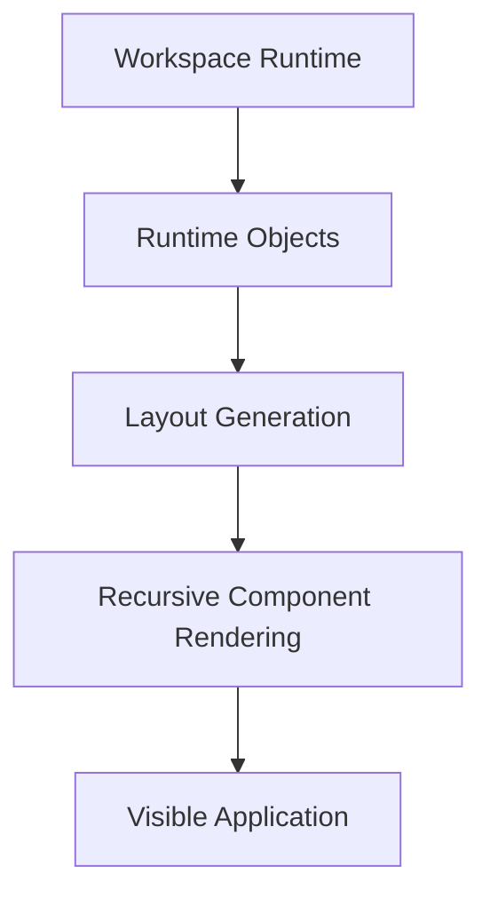

# Runtime Rendering

## Status

Current

---

# Purpose

The Workspace Runtime defines the logical structure of the application.

This document describes how that runtime model is rendered into the visible user interface.

It explains how the current implementation transforms Runtime Objects into a stable, interactive application while remaining faithful to the Workspace Runtime described by **002-workspace-runtime.md**.

---

# Scope

This document describes:

* the rendering pipeline,
* recursive rendering,
* dynamic module rendering,
* layout generation,
* component identity,
* rendering updates,
* and rendering performance.

It focuses on the current rendering implementation.

It does not redefine the Workspace Runtime or the Runtime Objects described by the previous document.

---

# Background

The KJVOnly application is implemented as a Single Page Application.

Unlike traditional web applications, navigation does not occur by transitioning between routes.

Instead, the application maintains one persistent Workspace.

The Workspace Runtime evolves over time while the rendering implementation updates only the portions of the interface affected by runtime changes.

This approach allows multiple Module Instances to remain active simultaneously while preserving their independent runtime state.

The rendering implementation exists to present the Workspace Runtime.

It does not define the runtime model.

---

# Responsibilities

The rendering implementation is responsible for:

* presenting the Workspace Runtime,
* recursively rendering the Pane tree,
* generating the visible layout,
* dynamically loading Module components,
* preserving component identity,
* and efficiently updating the visible application.

It is not responsible for:

* Workspace operations,
* Pane-tree manipulation,
* Buffer management,
* Domain behavior,
* Resource resolution,
* synchronization,
* or application services.

Those responsibilities belong to other parts of the application.

The rendering implementation consumes the Workspace Runtime.

It does not own it.

---

# Rendering Pipeline

Rendering is performed by transforming the Workspace Runtime into visible user interface components.

Conceptually:

The rendering pipeline begins with the Runtime Objects managed by the Workspace Runtime.

Those Runtime Objects define the logical structure of the application.

The rendering implementation derives the visible layout from that structure before recursively rendering the appropriate components.

The visible application is therefore a presentation of the Workspace Runtime rather than the source of truth itself.

This distinction allows the runtime model and rendering implementation to evolve independently while preserving a consistent application architecture.
