# Domains

## Status

Current

---

# Purpose

This document defines the role of Domains within the KJVOnly application.

It explains:

* what a Domain represents,
* which responsibilities a Domain owns,
* how Modules interact with Domains,
* how Domain Objects represent application data,
* and how Domains integrate with Application Services, Technical Infrastructure, and the Resource Architecture.

This document establishes the ownership model used when implementing and organizing domain-specific behavior.

---

# Scope

This document defines:

* Domains,
* domain ownership,
* Domain Objects,
* Domain Services,
* domain-specific Modules,
* domain boundaries,
* and communication between Domains and the surrounding application.

It does not define:

* Workspace Runtime behavior,
* runtime rendering,
* shared Application Services,
* Technical Infrastructure,
* Resource Resolution,
* Resource Installation,
* persistence implementation,
* synchronization,
* or repository organization.

Those responsibilities are described by separate implementation and architecture documents.

---

# Background

The Workspace Runtime provides the environment in which the application executes.

Modules provide the user interactions presented within that environment.

Domains define the application concepts and behavior used by those Modules.

Conceptually:

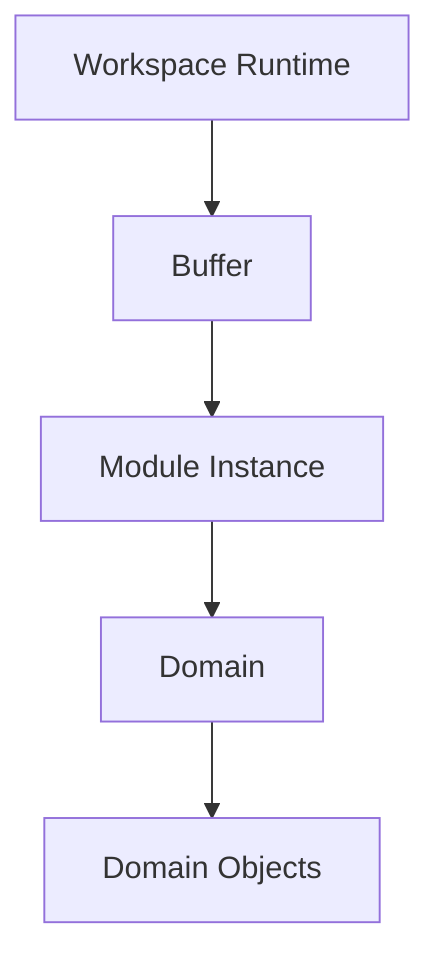

The runtime determines how the application is composed and presented.

Domains determine what the application does.

This distinction keeps application behavior independent from:

* Workspace layout,
* rendering technology,
* storage technology,
* transport protocols,
* and Resource representations.

---

# Domain Definition

A Domain represents one cohesive area of application data and behavior.

A Domain owns the concepts understood within that area of the application.

Examples include:

* Bible,
* Notes,
* and Reading Plans.

A Domain is not:

* a directory,
* a Module,
* a database,
* a Nostr event kind,
* or a Resource type.

Those implementation concepts may support a Domain, but they do not define it.

A Domain is defined by the application meaning and behavior it owns.

---

# Domain Responsibilities

A Domain owns the implementation responsibilities specific to its application area.

These may include:

* Domain Objects,
* domain rules,
* domain operations,
* Domain Services,
* Domain Object Factories,
* Resource Serializers,
* Domain Stores,
* domain-specific queries,
* and the Modules that present the Domain to the user.

Conceptually:

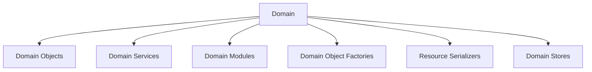

Not every Domain currently implements each responsibility through a dedicated abstraction.

The ownership remains the same even when responsibilities are currently combined or physically located in shared technical directories.

---

# Domain Ownership

Ownership is determined by application meaning rather than physical location.

A responsibility belongs to a Domain when it exists specifically to support that Domain's concepts or behavior.

For example, behavior that:

* parses Bible chapter content,
* applies Bible annotations,
* searches Bible text,
* manages Notes,
* or calculates Reading Plan progress

belongs to the corresponding Domain.

The responsibility remains domain-owned even if its implementation currently resides under:

```text
models/
modules/
services/
storer/
workers/
```

Repository structure may evolve.

Domain ownership should remain stable.

---

# Domain Boundary

A Domain exposes application behavior without exposing its implementation details.

Modules interact with Domains through:

* Domain Services,
* Domain Objects,
* domain operations,
* and domain-defined events or state.

Other parts of the application should not directly manipulate:

* a Domain's persistence records,
* serialized Resource content,
* transport events,
* internal indexes,
* or private runtime state.

Conceptually:

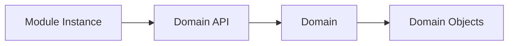

The Domain API may currently be represented by one or more services rather than a single formal interface.

The important boundary is behavioral:

> Callers request domain behavior rather than manipulating domain implementation details.

---

# Domain Independence

Each Domain should remain independently understandable and evolvable.

A change to one Domain should not require unrelated Domains to understand its internal implementation.

For example:

* Notes should not directly manipulate Bible storage.
* Reading Plans should not directly update Bible Module state.
* Bible search should not require Notes to understand Bible indexes.
* A Bible Module should not depend on the internal component structure of a Reading Plan Module.

Domains may collaborate when application behavior requires it.

That collaboration should occur through:

* shared Application Services,
* public Domain APIs,
* application events,
* shared identifiers,
* or explicitly defined integration behavior.

Domains should not become coupled through internal implementation details.

---

# Domain Objects

Domain Objects are the application-facing representation of domain data.

They provide the strongly typed data model used by Modules, Domain Services, and other application behavior.

Examples include:

* Bible chapters,
* annotations,
* notes,
* reading plans,
* completed readings,
* and other domain-owned data.

A Domain Object represents application meaning rather than its storage or transport format.

It is not:

* a Nostr event,
* serialized JSON,
* compressed content,
* an IndexedDB record,
* a Resource Representation,
* or a Blossom object.

Those formats may contain or persist the data used to construct a Domain Object, but the application does not operate directly on those representations.

Conceptually:

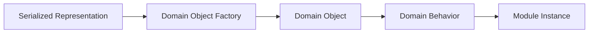

The Domain Object Factory converts resolved Resource content into a trusted Domain Object.

Once created, the Domain Object belongs to the Domain and may be used without knowledge of its original representation.

---

# Domain Object Ownership

Every Domain Object is owned by exactly one Domain.

The owning Domain defines:

* the object's type,
* its required fields,
* its invariants,
* the operations that may be performed on it,
* and how it is stored or serialized.

For example:

```text
Bible Domain

    Chapter

    Annotation

    Bible Version

    Book Names


Notes Domain

    Note

    Note Collection


Reading Plans Domain

    Reading Plan

    Completed Reading
```

A Domain Object may reference identifiers or concepts shared with another Domain without transferring ownership.

For example, a Note may refer to a Bible location.

The Notes Domain continues to own the Note.

The Bible location reference remains a shared application concept used to identify the location associated with it.

---

# Domain Object Lifecycle

Domain Objects may enter the application through more than one path.

They may be:

* created by a user,
* constructed from resolved Resource content,
* loaded from a Domain Store,
* modified by domain behavior,
* or recreated from persisted application state.

Conceptually:

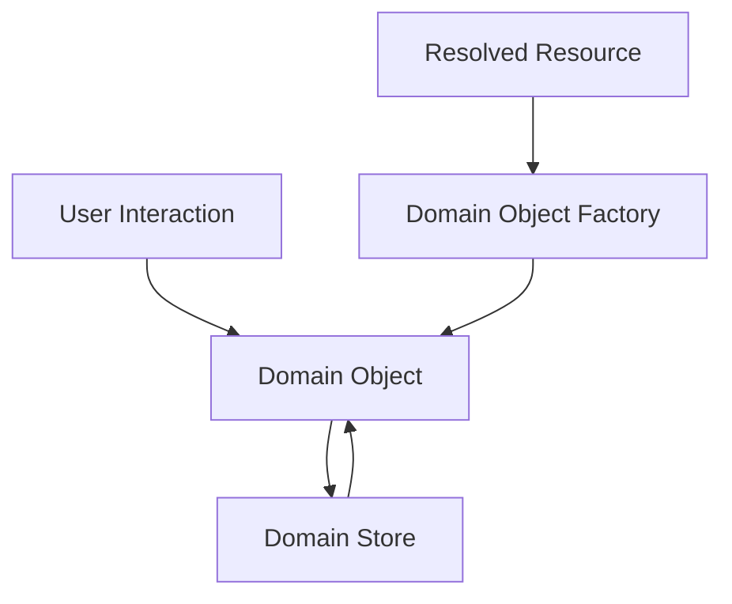

The application may create and modify Domain Objects directly.

When a Domain Object must be published, the owning Domain serializes it into an appropriate Resource representation.

The Domain Object remains the application's working model throughout this lifecycle.

---

# Domain Modules

A Domain may provide one or more Modules.

Each Module presents one focused interaction with the Domain.

For example:

```text
Bible Domain

    Bible Reader Module

    Bible Search Module

    Bible References Module


Notes Domain

    Notes Editor Module

    Notes List Module

    Notes Search Module


Reading Plans Domain

    Reading Plan Module
```

A Module is not the Domain itself.

The Domain owns the data and behavior.

The Module presents a specific capability to the user.

Multiple Module Instances may interact with the same Domain simultaneously.

For example, several Bible Reader Module Instances may display different chapters while sharing the same Bible Domain Services and Domain Store.

---

# Module Responsibility

A Domain Module owns:

* user interaction,
* domain-specific presentation,
* interaction state,
* and requests to its Domain.

A Domain Module does not own:

* the Workspace layout,
* Pane-tree manipulation,
* shared Application Services,
* Technical Infrastructure,
* Resource Resolution,
* or persistence implementation.

A Module may request these capabilities through the interfaces provided by their owners.

For example, a Bible Module may request that the Pane Service open a Verse References Module.

The Bible Module expresses the desired application behavior.

It does not manipulate the Pane tree itself.

---

# Domain Features

Not every domain capability requires a separate Module.

Some capabilities exist as behavior within another Module.

Annotations are one example.

Annotations belong to the Bible Domain and augment the interaction with Bible text.

A user may highlight:

* an entire verse,
* an individual word,
* or another supported Bible-text selection.

This behavior is presented within the Bible Reader Module, but it remains distinct from the Chapter Domain Object itself.

The distinction is:

* the Chapter represents Bible text,
* the Annotation represents user-created Bible metadata,
* and the Bible Reader Module presents both within one interaction.

A capability should become a separate Module when it represents an independently useful user interaction that can be hosted within its own Buffer.

It should remain a feature of an existing Module when its behavior is meaningful only within that interaction.

---

# Domain Services

Domain Services expose operations owned by one Domain.

A Domain Service coordinates domain behavior that does not naturally belong to a single Domain Object or Module.

Examples may include:

* retrieving a Bible chapter,
* applying annotations,
* searching Bible text,
* managing Notes,
* calculating Reading Plan progress,
* and coordinating domain-specific persistence.

A Domain Service provides an application-facing interface to its Domain.

Conceptually:

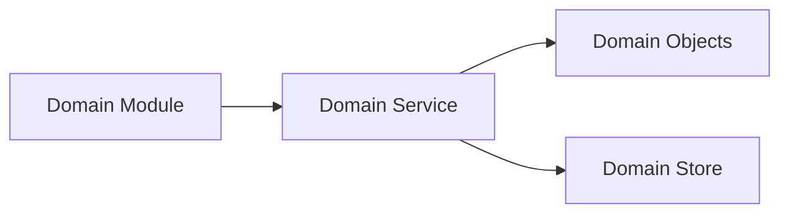

Modules request domain behavior through Domain Services.

Domain Services coordinate Domain Objects and Domain Stores.

The Module does not need to understand how the requested operation is implemented.

---

# Domain Service Ownership

A service belongs to a Domain when its responsibility is meaningful only within that Domain.

A useful ownership test is:

> Would another Domain naturally use this service as part of its own behavior?

If the answer is no, the service should generally remain within its owning Domain.

Examples include:

```text
Bible Chapter Service
    Bible Domain

Bible Annotation Service
    Bible Domain

Notes Service
    Notes Domain

Reading Plan Progress Service
    Reading Plans Domain
```

A service does not become shared merely because another Domain triggers behavior that eventually uses it.

For example, a Reading Plan may open a Bible Reader with selected readings.

The Reading Plans Domain provides navigation context.

The Bible Module then uses Bible Domain Services to interpret and display that context.

The Reading Plans Domain does not take ownership of Bible behavior.

---

# Application Services and Domain Services

Application Services and Domain Services serve different ownership models.

A Domain Service provides behavior specific to one Domain.

An Application Service provides a capability shared across multiple Domains.

For example, a Bible location reference may be used by:

* Bible,
* Notes,
* Reading Plans,
* Search,
* and References.

The service that parses or answers questions about that reference is therefore an Application Service rather than a service owned exclusively by the Bible Domain.

Conceptually:

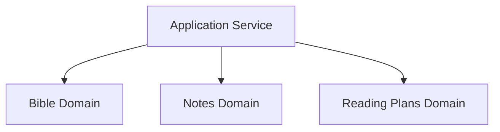

The distinction is based on ownership, not naming.

A service should be domain-owned when it supports only one Domain.

A service should be application-owned when it expresses a shared application concept used across Domains.

---

# Shared Identifiers

Domains often collaborate through shared identifiers.

A shared identifier allows one Domain to refer to data owned by another Domain without depending on its internal implementation.

Bible location references are an important example.

A Bible location reference may identify:

* a book,
* a chapter,
* a verse,
* a verse range,
* or another supported Bible location.

Notes and Reading Plans may store or transmit Bible location references without directly reading or manipulating Bible storage.

Conceptually:

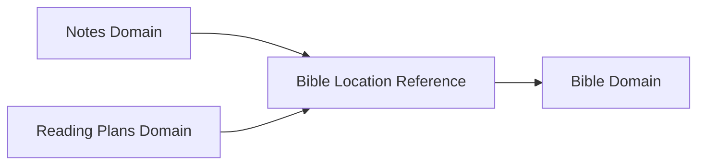

The shared identifier provides a stable integration boundary.

The Bible Domain remains responsible for interpreting Bible data.

Other Domains may use the identifier to express their relationship to that data.

---

# Cross-Domain Collaboration

Domains may collaborate when an application workflow spans multiple areas of behavior.

Cross-Domain collaboration should preserve the ownership of each participating Domain.

Preferred collaboration mechanisms include:

* Application Services,
* shared identifiers,
* public Domain Services,
* application events,
* and Module navigation context.

Domains should not collaborate by directly manipulating one another's:

* internal storage,
* private state,
* component instances,
* or implementation-specific data structures.

---

# Application Events

Application events allow Domain Modules to respond to changes without becoming directly coupled.

For example, creating a Note may cause multiple open Notes Module Instances to refresh their displayed lists.

Conceptually:

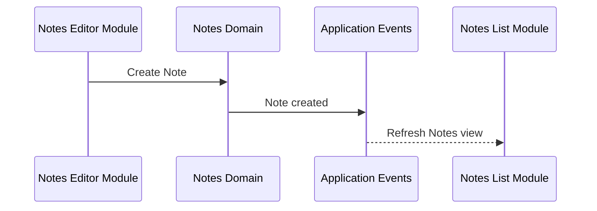

The Notes Editor does not directly call methods on each Notes List Module Instance.

It performs a Domain operation.

The resulting event allows interested Module Instances to update independently.

This preserves loose coupling while allowing the visible application to remain synchronized.

---

# Navigation Context

Module navigation context allows one Module to initialize another Module without directly controlling it.

The current implementation carries this information through the Buffer `bag`.

For example, a Reading Plan Module may provide:

* queued chapters,
* selected verses,
* Bible version,
* or reading progress

when opening a Bible Reader Module.

Conceptually:

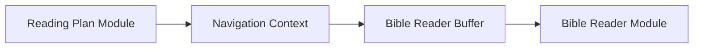

The source Module supplies context.

The target Module interprets it.

The source Module does not depend on the target Module's internal component implementation.

Navigation context therefore supports collaboration between Modules while preserving their independence.

---

# Search as a Domain Capability

Search is a capability that may be provided by multiple Domains.

Bible search operates on Bible data.

Notes search operates on Notes data.

Reading Plan search operates on Reading Plan data.

Although these capabilities may share:

* reusable components,
* query interfaces,
* indexing infrastructure,
* and interaction patterns,

their search behavior remains owned by the Domain whose data is being searched.

Conceptually:

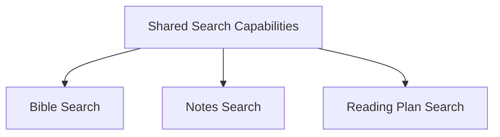

Search should not automatically become a standalone Domain merely because several Domains support searching.

The owning Domain defines:

* what is searchable,
* how results are interpreted,
* and which Domain Objects are returned.

Shared Application Services or Technical Infrastructure may provide reusable search capabilities without taking ownership of domain-specific search behavior.

---

# Relationship to the Resource Architecture

Domains form the integration boundary between application behavior and the Resource Architecture.

The Resource Architecture transforms Published Resources into Domain Objects and serializes Domain Objects back into Published Resources.

Domain-owned components participate in this flow.

These include:

* Domain Object Factories,
* Resource Serializers,
* and Domain Stores.

Conceptually:

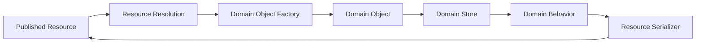

The Resource Architecture defines the resource lifecycle.

The Domain defines the application meaning of the data moving through that lifecycle.

---

# Domain Object Factory

A Domain Object Factory belongs to the Domain whose objects it creates.

It is responsible for:

* receiving resolved Resource content,
* validating domain-specific structure,
* constructing the appropriate Domain Object,
* and rejecting content that cannot become a valid Domain Object.

The factory understands the Domain Object.

It does not perform Resource discovery or relay communication.

Those responsibilities belong to the Resource Architecture.

---

# Resource Serializer

A Resource Serializer belongs to the Domain whose objects it serializes.

It converts a Domain Object into the content required for a Published Resource.

The serializer understands:

* the Domain Object,
* the Domain's serialization format,
* and the representation required for publication.

It does not own:

* signing,
* relay publication,
* outbox processing,
* or transport retries.

Those responsibilities belong to the Resource Architecture and its supporting infrastructure.

---

# Domain Store

A Domain Store persists and retrieves Domain Objects for one Domain.

Modules and Domain Services interact with the Domain Store through Domain-owned interfaces.

The Domain Store hides the physical persistence implementation.

Conceptually:

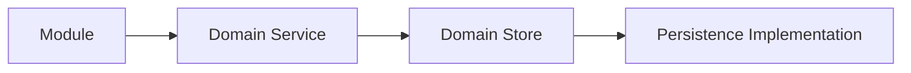

The Domain owns the Store interface.

Technical Infrastructure provides its persistence implementation.

This allows storage technology to evolve without changing Domain behavior.

---

# Future Evolution

The Domain architecture has been intentionally designed around ownership rather than implementation.

As the application evolves, new capabilities should extend existing Domains or introduce new Domains when they represent new areas of application behavior.

Conceptually:

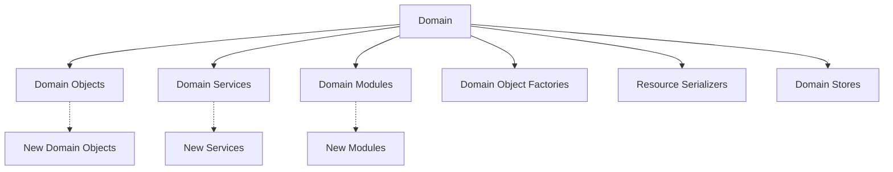

Future enhancements should strengthen the Domain model rather than distribute domain behavior throughout the application.

As long as ownership remains centered around the Domain, the implementation may evolve without changing the application's conceptual architecture.

---

# Big Takeaway

The Domain is the central owner of one area of application behavior.

Conceptually:

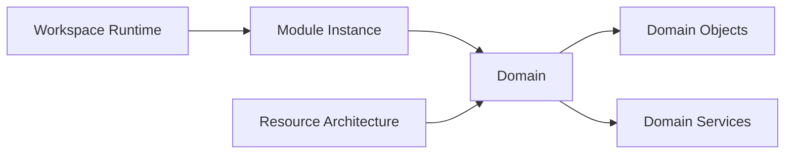

The Workspace Runtime presents Modules.

Modules present Domains.

Domains own application behavior.

Domain Objects represent domain data.

The Resource Architecture supplies and persists that data.

Everything related to one area of application behavior belongs to its Domain.

The Domain remains the stable center of ownership regardless of how the surrounding runtime, rendering implementation, or Resource Architecture evolves.
