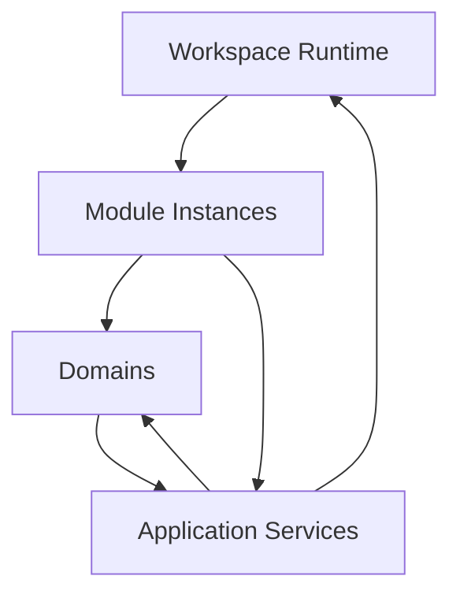
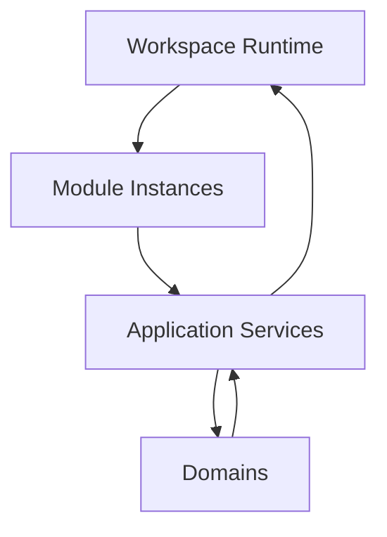
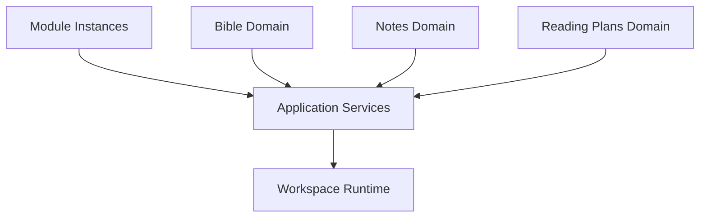

# Application Services

## Status

Current

---

# Purpose

This document defines the role of Application Services within the KJVOnly application.

Application Services provide capabilities shared across multiple Domains and the Workspace Runtime.

They encapsulate application-wide concepts that do not naturally belong to a single Domain while remaining independent from Technical Infrastructure.

This document establishes the ownership boundaries for shared application behavior.

---

# Scope

This document defines:

* Application Services,
* shared application capabilities,
* ownership boundaries,
* communication with Domains,
* communication with the Workspace Runtime,
* and the relationship between Application Services, Technical Infrastructure, and the Resource Architecture.

It does not define:

* Domain-specific behavior,
* Workspace Runtime implementation,
* rendering,
* persistence,
* transport protocols,
* Resource Resolution,
* or Technical Infrastructure.

Those responsibilities are described by separate implementation and architecture documents.

---

# Background

The Workspace Runtime owns the presentation and composition of the application.

Domains own application behavior.

Application Services provide shared capabilities that allow Modules, Domains, and the Workspace Runtime to collaborate through stable boundaries without directly depending on one another’s implementations.

Conceptually:

Application Services provide two forms of coordination.

They expose runtime capabilities to Modules without requiring Modules to manipulate Runtime Objects directly.

They also provide shared application capabilities through which Domains may collaborate without depending directly on one another.

The Workspace Runtime remains independent from Domain behavior.

It manages Runtime Objects and presents Module Instances but does not communicate directly with Domains.

---

# Application Service Definition

An Application Service provides a capability shared across multiple Domains or Runtime components.

An Application Service is defined by the application concept it represents rather than by the technology used to implement it.

Examples include:

* Bible location references,
* pane management,
* workspace management,
* navigation,
* application settings,
* theme management,
* and other shared application concepts.

An Application Service is not:

* a Domain,
* Technical Infrastructure,
* a transport protocol,
* a persistence technology,
* or a rendering component.

Those responsibilities may support an Application Service but do not define it.

---
# Application Service Responsibilities

Application Services own responsibilities that are meaningful across the application rather than within a single Domain.

They provide stable collaboration boundaries between:

- the Workspace Runtime,
- Module Instances,
- Domains,
- and other shared application capabilities.

Application Services do not own application behavior.

They coordinate shared concepts while allowing each owner to remain independent.

Conceptually:

Application Services expose application behavior rather than implementation details.

Modules use Application Services to request shared capabilities such as workspace operations.

Domains use Application Services to collaborate through shared application concepts without depending directly upon one another.

This allows the Workspace Runtime, Modules, and Domains to evolve independently while preserving stable collaboration boundaries throughout the application.

---

# Why Application Services Exist

Without Application Services, Domains would gradually accumulate knowledge of one another.

For example:

* Reading Plans would understand Bible navigation.
* Notes would understand Workspace management.
* Bible Modules would manipulate Pane trees.
* Multiple Domains would independently implement the same shared concepts.

Over time, these direct dependencies would increase coupling throughout the application.

Application Services prevent this by owning shared concepts once and exposing them through stable interfaces.

This preserves the independence of both the Workspace Runtime and individual Domains while allowing them to collaborate through well-defined application behavior.

# Application Service Ownership

Application Services own responsibilities that represent shared application concepts rather than domain-specific behavior.

Ownership is determined by meaning rather than implementation.

A responsibility belongs to an Application Service when it exists to support multiple Domains or multiple parts of the Workspace Runtime without naturally belonging to any one owner.

Application Services should become the single owner of these shared concepts.

Examples include:

* Bible location references,
* pane management,
* workspace management,
* navigation,
* application settings,
* theme management,
* and other shared application capabilities.

Conceptually:

Application Services become the shared owner of concepts that would otherwise be duplicated throughout the application.

---

# Ownership Heuristic

When introducing a new responsibility, determine whether it represents a shared application concept before assigning it to a Domain.

A useful heuristic is:

> **Would multiple Domains or Runtime components naturally depend upon this responsibility?**

If the answer is **yes**, it likely belongs to an Application Service.

If the answer is **no**, it should generally remain within its owning Domain or another existing owner.

Ownership should reflect the meaning of the responsibility rather than the technology used to implement it.

---

# Shared Application Concepts

A shared application concept is meaningful regardless of which Domain is currently using it.

For example, a Bible location reference is used by:

* the Bible Domain,
* the Notes Domain,
* the Reading Plans Domain,
* search,
* navigation,
* and other application features.

Although the concept originated from Bible data, it has become a shared application identifier.

Its ownership therefore belongs to an Application Service rather than exclusively to the Bible Domain.

Likewise, workspace operations such as opening, replacing, or closing Module Instances are shared application behaviors.

Individual Domains may request these operations, but they do not own how the Workspace Runtime performs them.

Application Services provide the stable boundary between these responsibilities.

---

# Application Services as Stable Boundaries

Application Services intentionally separate application behavior from implementation details.

Domains request shared capabilities.

Modules request runtime operations.

The Workspace Runtime performs runtime operations.

Each owner remains responsible only for the behavior it owns.

Application Services coordinate these interactions without taking ownership of Domain behavior or Runtime behavior.

This separation allows each part of the application to evolve independently while preserving a consistent collaboration model.
