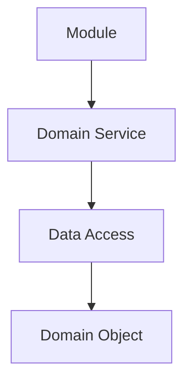
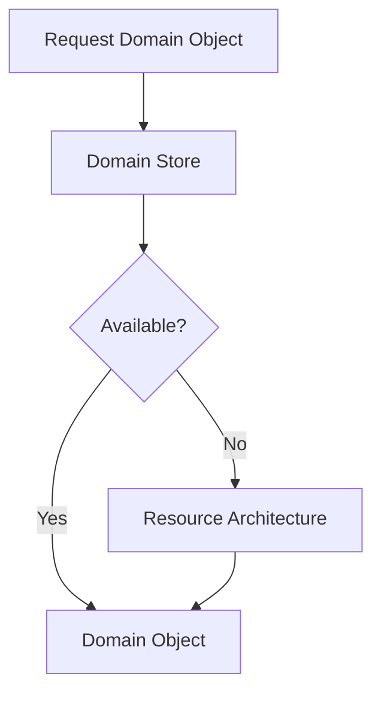
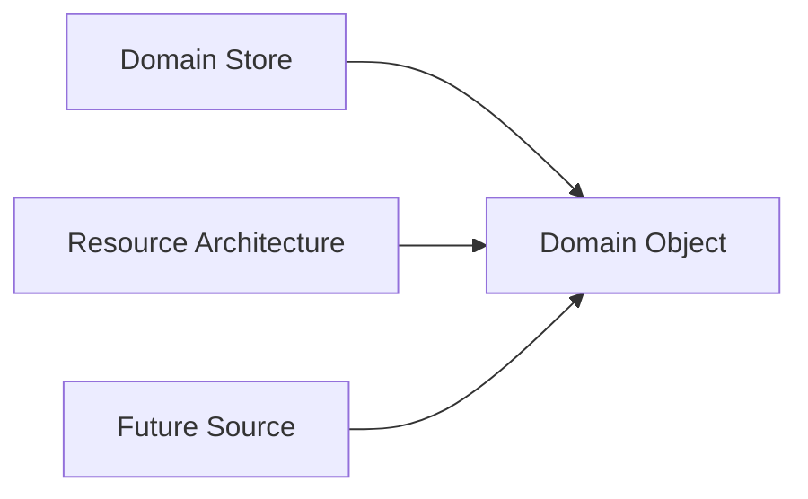
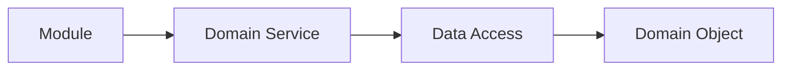

# Data Access

## Status

Current

---

# Purpose

This document defines how Domain Objects are obtained within the KJVOnly application.

It explains how Modules and Domain Services request data without depending upon storage technologies, transport protocols, or persistence implementations.

This document establishes the abstraction that allows the application to operate consistently regardless of where Domain Objects originate.

---

# Scope

This document defines:

* Data Access,
* Domain Object retrieval,
* local-first access,
* cache-first behavior,
* interaction with Domain Stores,
* interaction with the Resource Architecture,
* and the responsibilities of the Data Access abstraction.

It does not define:

* Domain behavior,
* persistence technologies,
* relay communication,
* background synchronization,
* startup,
* or transport protocols.

Those responsibilities are described by separate implementation and architecture documents.

---

# Background

The application is built around Domain Objects.

Modules and Domain Services operate exclusively on Domain Objects.

They should not know:

* where those Domain Objects are stored,
* how they are retrieved,
* whether they originated locally,
* or whether they were obtained from the network.

Conceptually:



The purpose of Data Access is to separate the request for data from the mechanism used to obtain it.

The caller requests a Domain Object.

Data Access determines how that request is satisfied.

---

# Data Access Definition

Data Access is responsible for obtaining Domain Objects on behalf of the application.

It owns the decision of where those objects should be retrieved from.

Possible sources include:

* Domain Stores,
* the Resource Architecture,
* cached application state,
* or future data providers.

The caller does not select the source.

The caller simply requests the required Domain Object.

This allows Modules and Domain Services to remain independent from storage technologies and transport implementations.

---

# Local-First Retrieval

The application follows a local-first retrieval strategy.

Whenever a Domain Object is requested, Data Access first attempts to satisfy that request using locally available data.

Only when the requested Domain Object cannot be obtained locally does Data Access request it from the Resource Architecture.

The caller does not choose the retrieval source.

The caller simply requests the required Domain Object.

This separation allows application behavior to remain independent from storage technologies and transport implementations.

One of the fundamental principles of the application is:

> **Request data, not location.**

Modules and Domain Services request the Domain Object they require.

They do not request:

* IndexedDB,
* Nostr,
* Blossom,
* HTTP,
* memory,
* or any other storage or transport technology.

Conceptually:



If the requested Domain Object already exists locally, it is returned immediately.

If it is unavailable locally, Data Access retrieves it through the Resource Architecture.

The caller receives the resulting Domain Object without knowing which retrieval path was taken.

The source of the data is therefore an implementation detail of Data Access rather than a concern of the caller.

This allows storage technologies, transport protocols, and retrieval strategies to evolve without affecting Modules or Domain Services.

Regardless of how a request is satisfied, Data Access always returns the same conceptual result:

a Domain Object.

Conceptually:



The source may differ.

The Domain Object returned to the application remains the same.

This consistency greatly simplifies the rest of the application because Modules and Domain Services operate on one stable representation rather than multiple storage-specific formats.

---

# Data Access Responsibilities

Data Access owns:

* selecting the appropriate source,
* retrieving Domain Objects,
* coordinating local-first behavior,
* requesting Resource retrieval when necessary,
* and returning Domain Objects to the caller.

It does not own:

* Domain behavior,
* persistence technologies,
* transport protocols,
* background synchronization,
* or presentation.

Its responsibility is limited to obtaining Domain Objects for the application through a consistent interface.

# Transparent Retrieval

The purpose of Data Access is to make Domain Object retrieval transparent to the rest of the application.

Modules and Domain Services request Domain Objects.

They do not determine where those objects originate.

Conceptually:



Whether the Domain Object was obtained from:

* a Domain Store,
* the Resource Architecture,
* previously cached application state,
* or another future source,

the caller receives the same result.

Data retrieval is therefore defined by the requested Domain Object rather than by its location.

---

# Request Data, Not Location

One of the fundamental principles of the application is:

> **Request data, not location.**

Callers request the Domain Object they require.

They do not request:

* IndexedDB,
* Nostr,
* Blossom,
* HTTP,
* memory,
* or any other storage or transport technology.

For example, a Module requests:

```text id="ngyjlwm"
Chapter

John 3
```

rather than:

```text id="bhx8b3"
Read John 3 from IndexedDB.

or

Read John 3 from Relay X.
```

The responsibility of locating the requested Domain Object belongs entirely to Data Access.

---

# Stable Application Behavior

Because callers never choose a retrieval source, application behavior remains stable as storage technologies evolve.

For example, replacing:

* IndexedDB,
* relay implementations,
* caching strategies,
* or transport mechanisms

should not require changes to Modules or Domain Services.

Those implementation decisions remain behind the Data Access abstraction.

This allows the application's behavior to remain independent from the technologies used to satisfy each request.

---

# Consistent Domain Objects

Regardless of how a request is satisfied, Data Access always returns the same conceptual result:

a Domain Object.

Conceptually:


The source may differ.

The object returned to the application remains the same.

This consistency greatly simplifies Module and Domain implementations because they operate on one stable representation rather than multiple storage-specific formats.
