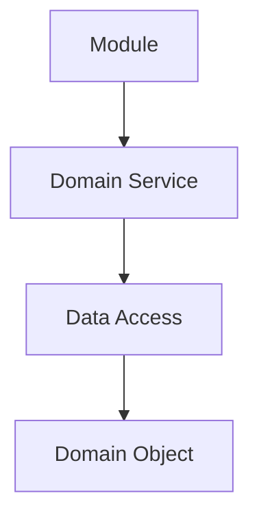
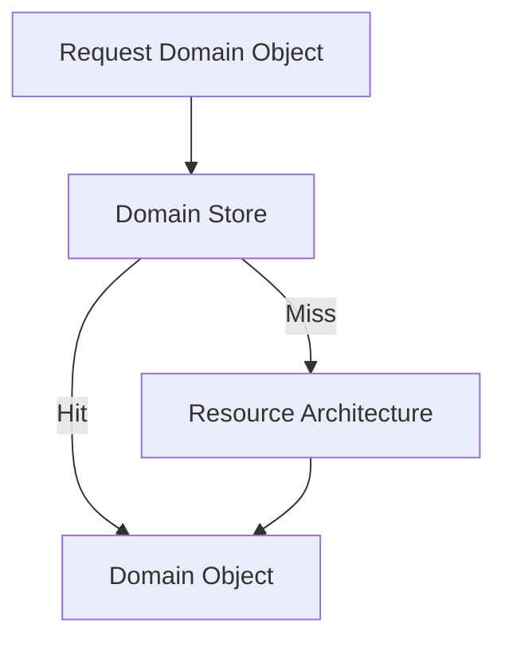

# Data Access

## Status

Current

---

# Purpose

This document defines how Domain Objects are obtained within the KJVOnly application.

It explains how Modules and Domain Services request data without depending upon storage technologies, transport protocols, or persistence implementations.

This document establishes the abstraction that allows the application to operate consistently regardless of where Domain Objects originate.

---

# Scope

This document defines:

* Data Access,
* Domain Object retrieval,
* local-first access,
* cache-first behavior,
* interaction with Domain Stores,
* interaction with the Resource Architecture,
* and the responsibilities of the Data Access abstraction.

It does not define:

* Domain behavior,
* persistence technologies,
* relay communication,
* background synchronization,
* startup,
* or transport protocols.

Those responsibilities are described by separate implementation and architecture documents.

---

# Background

The application is built around Domain Objects.

Modules and Domain Services operate exclusively on Domain Objects.

They should not know:

* where those Domain Objects are stored,
* how they are retrieved,
* whether they originated locally,
* or whether they were obtained from the network.

Conceptually:

The purpose of Data Access is to separate the request for data from the mechanism used to obtain it.

The caller requests a Domain Object.

Data Access determines how that request is satisfied.

---

# Data Access Definition

Data Access is responsible for obtaining Domain Objects on behalf of the application.

It owns the decision of where those objects should be retrieved from.

Possible sources include:

* Domain Stores,
* the Resource Architecture,
* cached application state,
* or future data providers.

The caller does not select the source.

The caller simply requests the required Domain Object.

This allows Modules and Domain Services to remain independent from storage technologies and transport implementations.

---

# Local-First Design

The application follows a local-first data access model.

Whenever a Domain Object is requested, Data Access first attempts to satisfy that request using locally available data.

Only when the requested object cannot be obtained locally does Data Access request it from the Resource Architecture.

Conceptually:

The caller receives the same Domain Object regardless of how it was obtained.

This behavior is intentionally hidden behind the Data Access abstraction.

Modules and Domain Services should not distinguish between local retrieval and network retrieval.

---

# Data Access Responsibilities

Data Access owns:

* selecting the appropriate source,
* retrieving Domain Objects,
* coordinating local-first behavior,
* requesting Resource retrieval when necessary,
* and returning Domain Objects to the caller.

It does not own:

* Domain behavior,
* persistence technologies,
* transport protocols,
* background synchronization,
* or presentation.

Its responsibility is limited to obtaining Domain Objects for the application through a consistent interface.
