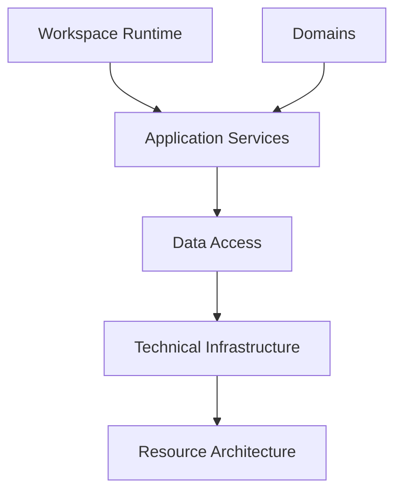
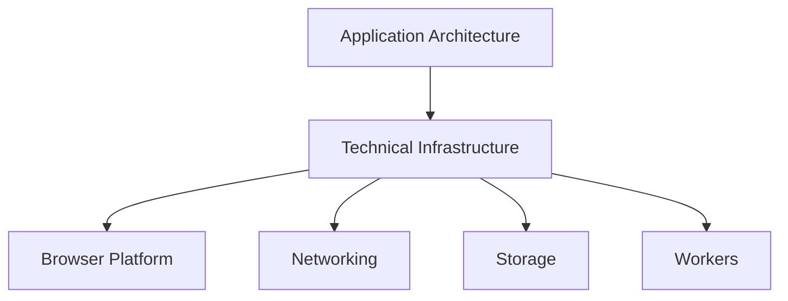
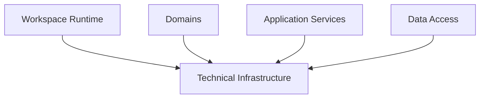
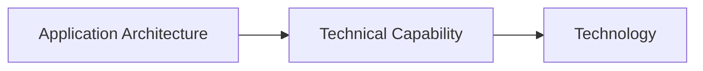
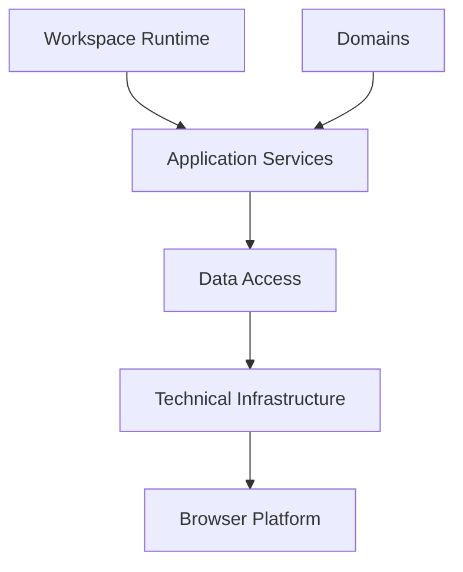
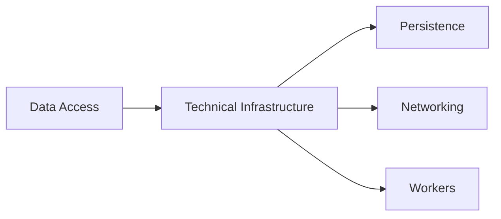
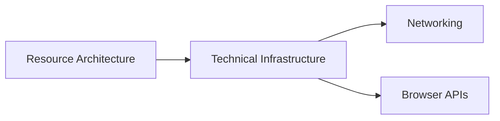

# Technical Infrastructure

## Status

Current

---

# Purpose

This document defines the role of Technical Infrastructure within the KJVOnly application.

Technical Infrastructure provides the implementation technologies required to support the application's architecture.

It owns the interaction with browser capabilities, networking, storage technologies, serialization, compression, and other platform-specific concerns.

This document establishes the boundary between the application's architectural responsibilities and the technologies used to implement them.

---

# Scope

This document defines:

* Technical Infrastructure,
* implementation technologies,
* browser capabilities,
* networking,
* persistence implementations,
* serialization,
* compression,
* workers,
* and platform integration.

It does not define:

* Workspace Runtime,
* Runtime Rendering,
* Domains,
* Application Services,
* Data Access,
* Resource Resolution,
* or application behavior.

Those responsibilities are described by separate implementation and architecture documents.

---

# Background

The application architecture is intentionally independent from the technologies used to implement it.

Application behavior is defined by the Workspace Runtime, Domains, Application Services, and Data Access.

Technical Infrastructure provides the implementation technologies required to realize those responsibilities.

Conceptually:



Technical Infrastructure is not responsible for defining application behavior.

Its responsibility is to provide the technical capabilities required by the application architecture.

---

# Technical Infrastructure Definition

Technical Infrastructure owns implementation technologies rather than application behavior.

It provides stable implementations for capabilities required throughout the application while remaining independent from Domain logic and the Workspace Runtime.

Examples include:

* IndexedDB,
* Web Workers,
* browser storage,
* HTTP,
* WebSockets,
* compression,
* serialization,
* browser APIs,
* and other platform-specific technologies.

These technologies implement responsibilities defined elsewhere within the application architecture.

They do not define those responsibilities themselves.

---

# Technical Infrastructure Responsibilities

Technical Infrastructure owns responsibilities that are inherently technical rather than domain-specific.

These include:

* interacting with browser APIs,
* implementing persistence technologies,
* implementing networking technologies,
* performing compression and decompression,
* performing serialization and deserialization,
* managing worker execution,
* and integrating with external platforms.

Conceptually:



Technical Infrastructure exposes implementation capabilities to the application architecture while remaining independent from the application's business behavior.

The application requests capabilities.

Technical Infrastructure determines how those capabilities are implemented.

# Technical Infrastructure Ownership

Technical Infrastructure owns responsibilities that exist because of the platform or technology used to implement the application.

Ownership is determined by implementation rather than application behavior.

A responsibility belongs to Technical Infrastructure when it provides a technical capability that could be reused regardless of the application's Domains or business logic.

Examples include:

* browser APIs,
* IndexedDB,
* Web Workers,
* HTTP,
* WebSockets,
* compression,
* serialization,
* cryptographic operations,
* timers,
* and platform-specific integration.

Conceptually:



Technical Infrastructure provides implementation capabilities to the application architecture.

It does not own application behavior.

---

# Ownership Heuristic

When introducing a new responsibility, first determine whether it represents application behavior or implementation technology.

A useful heuristic is:

> **Would this responsibility still exist if the application solved a completely different business problem?**

If the answer is **yes**, it likely belongs to Technical Infrastructure.

If the answer is **no**, it probably belongs elsewhere within the application architecture.

For example:

```text
Compression

Browser Storage

HTTP

Serialization

Timers

Logging
```

would still exist regardless of whether the application managed Bible study, accounting, or inventory.

These are implementation capabilities rather than application concepts.

---

# Technical Infrastructure Boundaries

Technical Infrastructure provides capabilities.

It does not make application decisions.

For example:

* IndexedDB stores data.
* It does not determine what should be stored.
* HTTP performs requests.
* It does not determine what should be requested.
* Compression compresses data.
* It does not determine what should be compressed.
* Web Workers execute work.
* They do not determine which work should be performed.

Those decisions belong to the application architecture.

Technical Infrastructure provides only the implementation required to carry them out.

---

# Stable Implementation Boundary

The application architecture intentionally depends upon capabilities rather than technologies.

Conceptually:



For example, the application depends upon:

* persistent storage,
* background execution,
* networking,
* serialization,
* and compression.

The specific technologies used to implement those capabilities may change over time.

This separation allows the application architecture to remain stable while Technical Infrastructure evolves independently.

# Technical Infrastructure and the Application

Technical Infrastructure exists to support the application architecture.

It provides implementation capabilities while remaining independent from application behavior.

The application defines:

* what should happen,
* when it should happen,
* and why it should happen.

Technical Infrastructure defines:

* how those decisions are realized on the underlying platform.

Conceptually:



The application architecture owns behavior.

Technical Infrastructure owns implementation.

This separation allows application behavior to evolve without requiring changes to platform-specific code.

---

# Technical Infrastructure and Data Access

Data Access requests technical capabilities from Technical Infrastructure without depending upon specific technologies.

For example, Data Access may request:

* persistent storage,
* serialization,
* compression,
* networking,
* or background execution.

Technical Infrastructure determines how those capabilities are implemented.

Conceptually:



Data Access remains independent from IndexedDB, browser APIs, HTTP, WebSockets, or any other implementation technology.

It depends only upon the capabilities exposed by Technical Infrastructure.

---

# Technical Infrastructure and the Resource Architecture

The Resource Architecture depends upon Technical Infrastructure to communicate with the outside world.

Technical Infrastructure provides capabilities such as:

* relay communication,
* HTTP,
* Blossom communication,
* compression,
* serialization,
* cryptographic operations,
* and browser networking.

The Resource Architecture determines how those capabilities are used to satisfy the application's resource model.

Conceptually:



Technical Infrastructure performs communication.

The Resource Architecture determines the meaning of that communication.

---

# Technology Independence

The application intentionally avoids coupling its architecture to individual technologies.

For example:

* Domains do not depend upon IndexedDB.
* Application Services do not depend upon browser APIs.
* Data Access does not depend upon HTTP.
* The Workspace Runtime does not depend upon CSS Grid.
* The Resource Architecture does not depend upon a particular relay implementation.

Instead, each architectural responsibility depends upon stable capabilities provided by Technical Infrastructure.

This separation allows technologies to evolve without affecting the application's conceptual architecture.

As new technologies emerge, they become additional implementations of existing capabilities rather than new architectural responsibilities.
