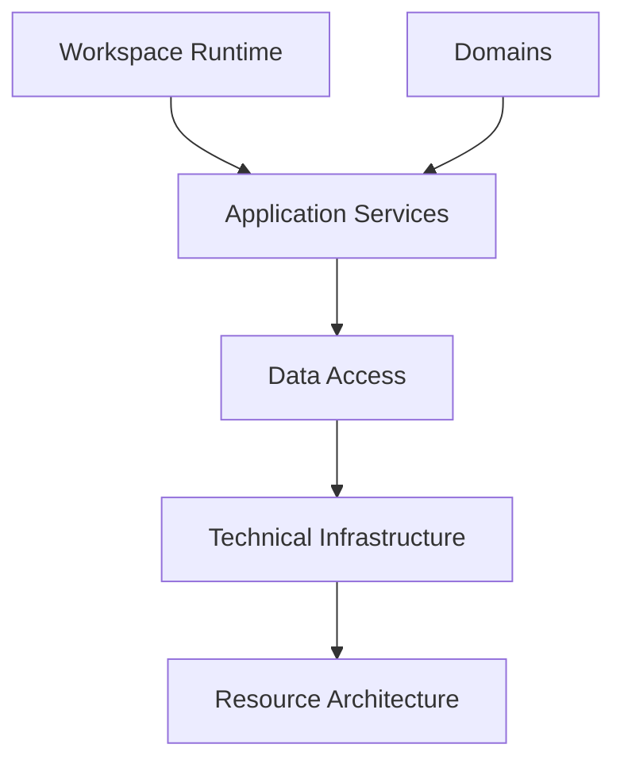
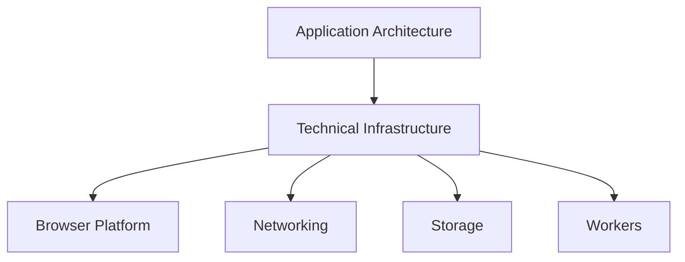

# Technical Infrastructure

## Status

Current

---

# Purpose

This document defines the role of Technical Infrastructure within the KJVOnly application.

Technical Infrastructure provides the implementation technologies required to support the application's architecture.

It owns the interaction with browser capabilities, networking, storage technologies, serialization, compression, and other platform-specific concerns.

This document establishes the boundary between the application's architectural responsibilities and the technologies used to implement them.

---

# Scope

This document defines:

* Technical Infrastructure,
* implementation technologies,
* browser capabilities,
* networking,
* persistence implementations,
* serialization,
* compression,
* workers,
* and platform integration.

It does not define:

* Workspace Runtime,
* Runtime Rendering,
* Domains,
* Application Services,
* Data Access,
* Resource Resolution,
* or application behavior.

Those responsibilities are described by separate implementation and architecture documents.

---

# Background

The application architecture is intentionally independent from the technologies used to implement it.

Application behavior is defined by the Workspace Runtime, Domains, Application Services, and Data Access.

Technical Infrastructure provides the implementation technologies required to realize those responsibilities.

Conceptually:

Technical Infrastructure is not responsible for defining application behavior.

Its responsibility is to provide the technical capabilities required by the application architecture.

---

# Technical Infrastructure Definition

Technical Infrastructure owns implementation technologies rather than application behavior.

It provides stable implementations for capabilities required throughout the application while remaining independent from Domain logic and the Workspace Runtime.

Examples include:

* IndexedDB,
* Web Workers,
* browser storage,
* HTTP,
* WebSockets,
* compression,
* serialization,
* browser APIs,
* and other platform-specific technologies.

These technologies implement responsibilities defined elsewhere within the application architecture.

They do not define those responsibilities themselves.

---

# Technical Infrastructure Responsibilities

Technical Infrastructure owns responsibilities that are inherently technical rather than domain-specific.

These include:

* interacting with browser APIs,
* implementing persistence technologies,
* implementing networking technologies,
* performing compression and decompression,
* performing serialization and deserialization,
* managing worker execution,
* and integrating with external platforms.

Conceptually:

Technical Infrastructure exposes implementation capabilities to the application architecture while remaining independent from the application's business behavior.

The application requests capabilities.

Technical Infrastructure determines how those capabilities are implemented.
