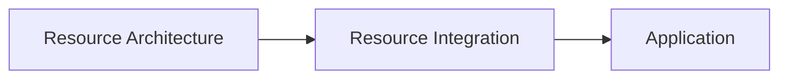
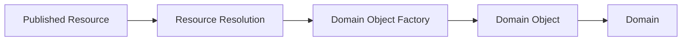
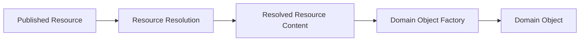
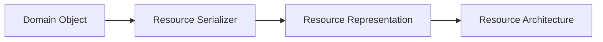
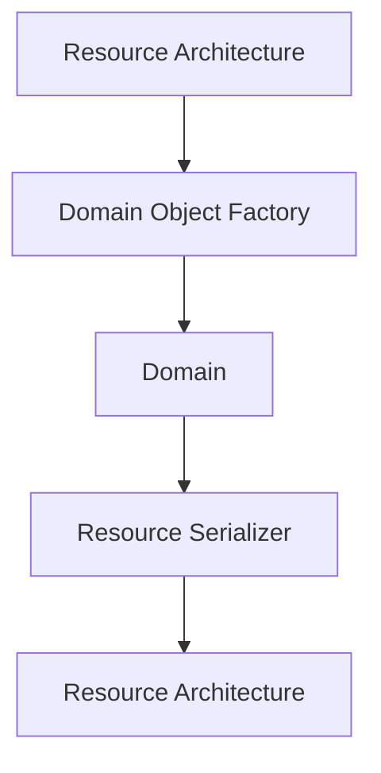

# Resource Integration

## Status

Current

---

# Purpose

This document defines how the KJVOnly application integrates with the Resource Architecture.

It explains how Published Resources become Domain Objects used by the application and how Domain Objects are transformed back into Published Resources.

This document establishes the boundary between the application architecture and the Resource Architecture.

---

# Scope

This document defines:

* Resource Integration,
* the flow of Published Resources into the application,
* the flow of Domain Objects back into Published Resources,
* integration responsibilities,
* Domain Object construction,
* Resource serialization,
* and the ownership boundaries between the application and the Resource Architecture.

It does not define:

* Resource Identity,
* Resource Resolution,
* relay communication,
* Resource Installation,
* synchronization,
* transport protocols,
* or Published Resource formats.

Those responsibilities are defined by the Resource Architecture.

Likewise, this document does not define:

* Workspace Runtime,
* Domains,
* Application Services,
* Data Access,
* or Technical Infrastructure.

Those responsibilities are defined by the application architecture.

---

# Background

The application and the Resource Architecture serve different purposes.

The Resource Architecture manages Published Resources.

The application operates on Domain Objects.

Resource Integration provides the boundary between these two architectural models.

Conceptually:

The Resource Architecture supplies published representations of data.

The application consumes Domain Objects representing application behavior.

Neither architecture replaces the other.

They collaborate through a well-defined integration boundary.

---

# Resource Integration Definition

Resource Integration is responsible for translating between the Published Resources managed by the Resource Architecture and the Domain Objects used by the application.

It owns the application-facing integration between these two architectural models.

Conceptually:

Published Resources are never consumed directly by Modules or Domain Services.

Instead, Resource Resolution produces resolved Resource content.

The owning Domain Object Factory constructs the corresponding Domain Object.

From that point forward, the application operates exclusively on the Domain Object.

The Published Resource representation no longer participates in application behavior.

---

# Architectural Boundary

The application and the Resource Architecture intentionally operate at different abstraction levels.

The Resource Architecture owns:

* Published Resources,
* Resource Identity,
* Resource Resolution,
* transport,
* installation,
* synchronization,
* publication,
* and Resource lifecycle management.

The application owns:

* Domain Objects,
* Domain behavior,
* Modules,
* Application Services,
* Data Access,
* and the Workspace Runtime.

Resource Integration forms the boundary between these responsibilities.

Neither side reaches across that boundary to manipulate the internal implementation of the other.

Instead, they exchange only the representations required to construct or serialize Domain Objects.

# Resource to Domain Object

Published Resources represent serialized application data.

They are designed for publication, discovery, synchronization, and transport.

The application does not operate directly on Published Resources.

Instead, Resource Resolution produces resolved Resource content which is then transformed into a Domain Object by the owning Domain.

Conceptually:

The Domain Object Factory belongs to the owning Domain.

It is responsible for:

* validating the resolved content,
* constructing the appropriate Domain Object,
* enforcing Domain invariants,
* and rejecting invalid representations.

Once constructed, the Domain Object becomes part of the application's Domain model.

The Published Resource is no longer used by the application.

---

# Domain Object to Resource

When application behavior modifies a Domain Object, the application continues to operate exclusively on that Domain Object.

Only when the object must be published does it become a Published Resource.

The owning Domain performs this transformation through its Resource Serializer.

Conceptually:

The Resource Serializer belongs to the owning Domain.

It understands how the Domain Object should be represented for publication.

The Resource Architecture then assumes responsibility for:

* publication,
* synchronization,
* transport,
* signing,
* relay communication,
* and lifecycle management.

The Domain's responsibility ends when it produces the Resource representation.

---

# Transformation Ownership

Transformation responsibilities are intentionally divided between the application and the Resource Architecture.

Conceptually:

The Resource Architecture owns:

* obtaining Published Resources,
* resolving representations,
* publishing representations,
* and managing Resource lifecycles.

The Domain owns:

* constructing Domain Objects,
* validating Domain data,
* interpreting Domain behavior,
* modifying Domain Objects,
* and serializing Domain Objects for publication.

This separation allows each architecture to evolve independently while maintaining a stable integration boundary.

---

# Stable Integration Boundary

Resource Integration exists to protect both architectures from unnecessary coupling.

The application should never depend upon:

* relay events,
* transport protocols,
* serialization formats,
* or Published Resource structures.

Likewise, the Resource Architecture should never depend upon:

* Module behavior,
* Domain logic,
* Workspace Runtime state,
* or application presentation.

The only responsibilities exchanged across this boundary are those required to construct or serialize Domain Objects.

This allows the application and the Resource Architecture to evolve independently while preserving a clear and consistent integration model.
