# Resource Integration

## Status

Current

---

# Purpose

This document defines how the KJVOnly application integrates with the Resource Architecture.

It explains how Published Resources become Domain Objects used by the application and how Domain Objects are transformed back into Published Resources.

This document establishes the boundary between the application architecture and the Resource Architecture.

---

# Scope

This document defines:

* Resource Integration,
* the flow of Published Resources into the application,
* the flow of Domain Objects back into Published Resources,
* integration responsibilities,
* Domain Object construction,
* Resource serialization,
* and the ownership boundaries between the application and the Resource Architecture.

It does not define:

* Resource Identity,
* Resource Resolution,
* relay communication,
* Resource Installation,
* synchronization,
* transport protocols,
* or Published Resource formats.

Those responsibilities are defined by the Resource Architecture.

Likewise, this document does not define:

* Workspace Runtime,
* Domains,
* Application Services,
* Data Access,
* or Technical Infrastructure.

Those responsibilities are defined by the application architecture.

---

# Background

The application and the Resource Architecture serve different purposes.

The Resource Architecture manages Published Resources.

The application operates on Domain Objects.

Resource Integration provides the boundary between these two architectural models.

Conceptually:

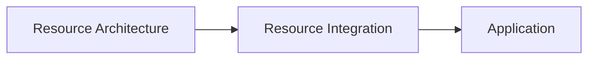

The Resource Architecture supplies published representations of data.

The application consumes Domain Objects representing application behavior.

Neither architecture replaces the other.

They collaborate through a well-defined integration boundary.

---

# Resource Integration Definition

Resource Integration is responsible for translating between the Published Resources managed by the Resource Architecture and the Domain Objects used by the application.

It owns the application-facing integration between these two architectural models.

Conceptually:

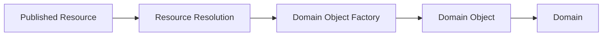

Published Resources are never consumed directly by Modules or Domain Services.

Instead, Resource Resolution produces resolved Resource content.

The owning Domain Object Factory constructs the corresponding Domain Object.

From that point forward, the application operates exclusively on the Domain Object.

The Published Resource representation no longer participates in application behavior.

---

# Architectural Boundary

The application and the Resource Architecture intentionally operate at different abstraction levels.

The Resource Architecture owns:

* Published Resources,
* Resource Identity,
* Resource Resolution,
* transport,
* installation,
* synchronization,
* publication,
* and Resource lifecycle management.

The application owns:

* Domain Objects,
* Domain behavior,
* Modules,
* Application Services,
* Data Access,
* and the Workspace Runtime.

Resource Integration forms the boundary between these responsibilities.

Neither side reaches across that boundary to manipulate the internal implementation of the other.

Instead, they exchange only the representations required to construct or serialize Domain Objects.

# Resource to Domain Object

Published Resources represent serialized application data.

They are designed for publication, discovery, synchronization, and transport.

The application does not operate directly on Published Resources.

Instead, Resource Resolution produces resolved Resource content which is then transformed into a Domain Object by the owning Domain.

Conceptually:

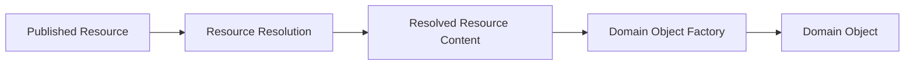

The Domain Object Factory belongs to the owning Domain.

It is responsible for:

* validating the resolved content,
* constructing the appropriate Domain Object,
* enforcing Domain invariants,
* and rejecting invalid representations.

Once constructed, the Domain Object becomes part of the application's Domain model.

The Published Resource is no longer used by the application.

---

# Domain Object to Resource

When application behavior modifies a Domain Object, the application continues to operate exclusively on that Domain Object.

Only when the object must be published does it become a Published Resource.

The owning Domain performs this transformation through its Resource Serializer.

Conceptually:

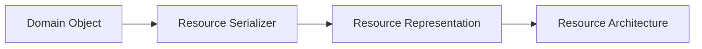

The Resource Serializer belongs to the owning Domain.

It understands how the Domain Object should be represented for publication.

The Resource Architecture then assumes responsibility for:

* publication,
* synchronization,
* transport,
* signing,
* relay communication,
* and lifecycle management.

The Domain's responsibility ends when it produces the Resource representation.

---

# Transformation Ownership

Transformation responsibilities are intentionally divided between the application and the Resource Architecture.

Conceptually:

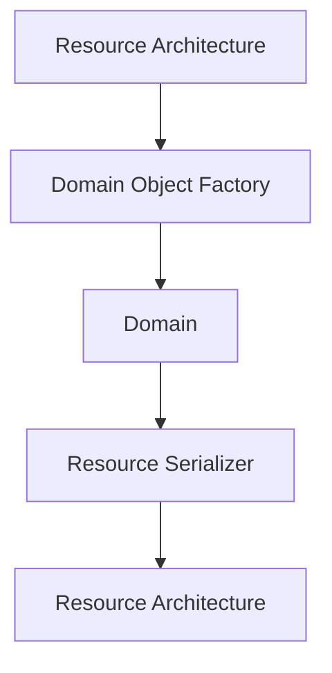

The Resource Architecture owns:

* obtaining Published Resources,
* resolving representations,
* publishing representations,
* and managing Resource lifecycles.

The Domain owns:

* constructing Domain Objects,
* validating Domain data,
* interpreting Domain behavior,
* modifying Domain Objects,
* and serializing Domain Objects for publication.

This separation allows each architecture to evolve independently while maintaining a stable integration boundary.

---

# Stable Integration Boundary

Resource Integration exists to protect both architectures from unnecessary coupling.

The application should never depend upon:

* relay events,
* transport protocols,
* serialization formats,
* or Published Resource structures.

Likewise, the Resource Architecture should never depend upon:

* Module behavior,
* Domain logic,
* Workspace Runtime state,
* or application presentation.

The only responsibilities exchanged across this boundary are those required to construct or serialize Domain Objects.

This allows the application and the Resource Architecture to evolve independently while preserving a clear and consistent integration model.

# Resource Integration and Data Access

Data Access is the primary consumer of Resource Integration.

When a requested Domain Object is not available from the owning Domain Store, Data Access delegates retrieval to the Resource Architecture through the Resource Integration boundary.

Conceptually:

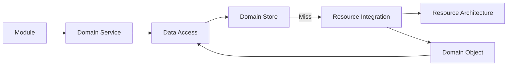

Data Access determines **when** Resource Integration is required.

Resource Integration determines **how** Domain Objects are obtained from the Resource Architecture.

The caller remains unaware that Resource retrieval occurred.

---

# Resource Installation

The Resource Architecture is responsible for obtaining and resolving Published Resources.

The application is responsible for deciding whether those Resources become installed Domain Objects.

When Resource Integration successfully constructs a Domain Object, the owning Domain may choose to install that object into its Domain Store.

Conceptually:

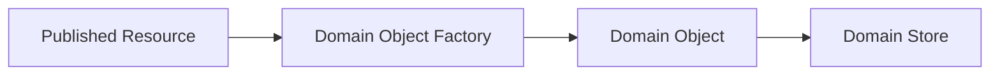

Installation represents the point at which a Resource becomes part of the application's local state.

The Resource Architecture does not install Domain Objects.

It supplies the information required for the application to construct them.

The application determines how those Domain Objects participate in its local runtime.

---

# Resource Integration and Domain Ownership

Resource Integration does not own Domain Objects.

It provides the boundary through which Domain Objects are constructed and serialized.

Ownership always remains with the Domain.

Conceptually:

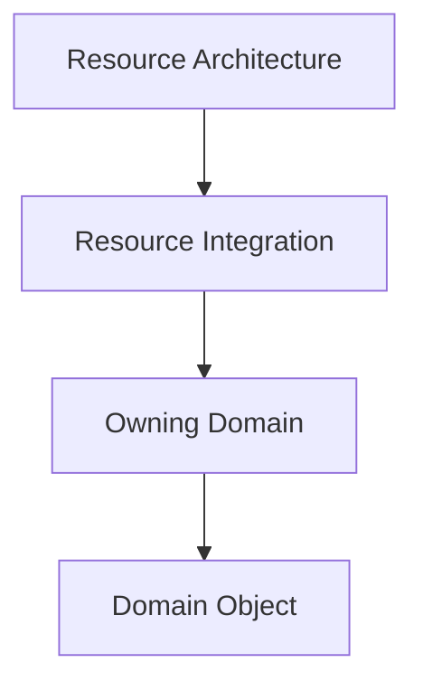

The Domain remains responsible for:

* constructing Domain Objects,
* validating Domain data,
* interpreting application behavior,
* storing Domain Objects,
* and serializing Domain Objects for publication.

Resource Integration coordinates the transformation.

It does not become the owner of the resulting objects.

---

# Resource Independence

The application architecture intentionally remains independent from the structure of Published Resources.

Modules interact with Domain Objects.

Domain Services coordinate Domain behavior.

Application Services provide shared capabilities.

Data Access retrieves Domain Objects.

None of these responsibilities require knowledge of:

* relay events,
* Resource identifiers,
* publication metadata,
* transport protocols,
* or serialized representations.

Those concerns remain entirely within the Resource Architecture.

This separation allows the transport architecture and the application architecture to evolve independently while preserving a stable integration boundary.

# Installation Decisions

Constructing a Domain Object does not automatically make it part of the application's local state.

Before a newly constructed Domain Object replaces an existing installed object, the application determines whether the new object should be installed.

This decision belongs to the application rather than the Resource Architecture.

Conceptually:

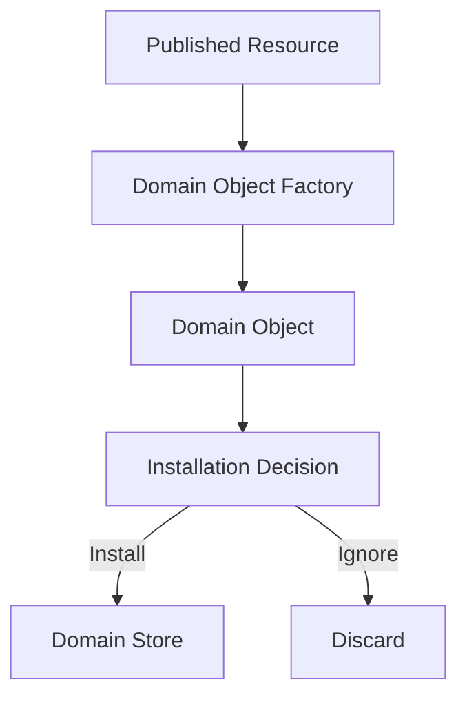

Installation decisions are based upon the application's current state.

For example, the application may determine that:

* no installed Domain Object currently exists,
* the newly constructed Domain Object is newer,
* the installed Domain Object is newer,
* or another Domain-specific installation rule applies.

The Resource Architecture is responsible for supplying valid Published Resources.

The application is responsible for determining whether those Resources become installed Domain Objects.

This distinction allows the application to maintain a consistent local state even when older or duplicate Published Resources are received from the network.

---

# Installed Domain Objects

An installed Domain Object represents the application's authoritative local representation of a Resource.

Modules, Domain Services, Application Services, and Data Access operate exclusively on installed Domain Objects.

Published Resources are used only to construct candidate Domain Objects.

Only after the application accepts a candidate does it become the installed Domain Object for that Domain.

Conceptually:

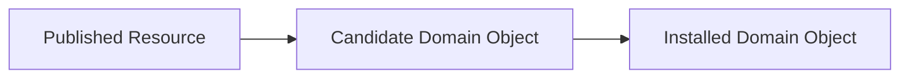

This distinction separates:

* transport,
* application state,
* and installation decisions.

The application therefore remains the owner of its local state while the Resource Architecture remains responsible for resource publication, discovery, and synchronization.

# Local Authority

The application is the authoritative owner of its installed Domain Objects.

Published Resources represent information available from the Resource Architecture.

They do not automatically replace the application's local state.

Every Published Resource received by the application becomes a candidate for installation.

The application determines whether that candidate should become the installed Domain Object.

Conceptually:

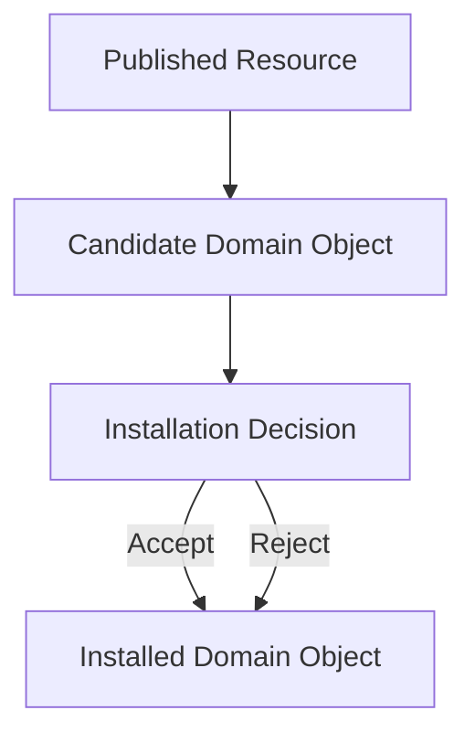

The installed Domain Object always remains the application's authoritative representation.

Receiving a Published Resource does not imply that the application's local state should change.

---

# Version Decisions

Installation decisions are made using the rules defined by the owning Domain and the application's synchronization model.

One common example is version comparison.

Conceptually:

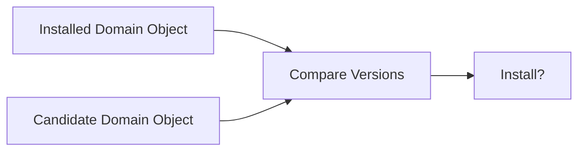

If the installed Domain Object already represents a newer version, the candidate is discarded.

The application continues using the installed Domain Object without interruption.

Likewise, if the candidate represents newer application data, it may replace the installed object.

The decision belongs entirely to the application.

The Resource Architecture simply provides valid Published Resources for consideration.

---

# Stable Local State

This model intentionally separates:

* resource discovery,
* resource publication,
* application state,
* and installation decisions.

The application therefore remains resilient when:

* relays temporarily lag behind,
* duplicate Resources are received,
* older Published Resources are discovered,
* or multiple publishers provide equivalent representations.

Regardless of the source, every Published Resource follows the same integration process.

Only accepted candidates become part of the application's local state.

This allows the application to maintain one authoritative installed Domain Object while continuing to participate in a decentralized resource network.

# Architectural Independence

Resource Integration intentionally separates the application architecture from the Resource Architecture.

The application is concerned with Domain Objects and application behavior.

The Resource Architecture is concerned with Published Resources and resource lifecycles.

Neither architecture requires knowledge of the internal implementation of the other.

Conceptually:

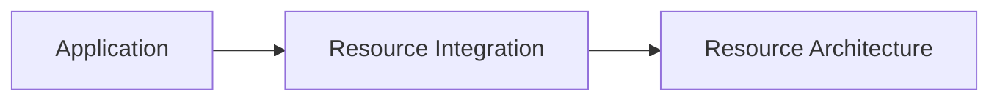

This separation allows each architecture to evolve independently while preserving a stable integration boundary.

Changes to:

* Resource representations,
* publication mechanisms,
* transport protocols,
* synchronization strategies,
* or discovery mechanisms

should not require changes to application behavior.

Likewise, changes to:

* Workspace Runtime,
* Modules,
* Domains,
* Application Services,
* or Data Access

should not require changes to the Resource Architecture.

Each architecture owns its own responsibilities.

Resource Integration coordinates the exchange between them.

---

# Stable Integration Model

The Resource Integration boundary intentionally limits what crosses between the application and the Resource Architecture.

The Resource Architecture supplies representations suitable for constructing Domain Objects.

The application supplies representations suitable for publication.

Neither architecture exchanges internal implementation details.

Conceptually:

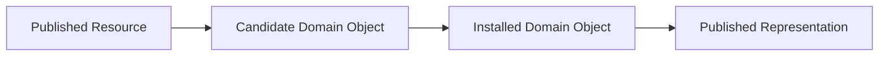

The application never exposes its internal Domain Objects directly to the Resource Architecture.

Likewise, the Resource Architecture never exposes Published Resources directly to Modules or Domain Services.

Each architecture operates exclusively on its own model while exchanging only the representations required for integration.

---

# Benefits

This separation provides several important architectural benefits.

It allows:

* the application to evolve independently of transport technologies,
* the Resource Architecture to evolve independently of application behavior,
* Domain Objects to remain stable regardless of representation changes,
* Published Resources to evolve without affecting Modules,
* and new transport implementations to be introduced without modifying application logic.

By maintaining this separation, Resource Integration protects both architectures from unnecessary coupling while providing a consistent and predictable integration model.
