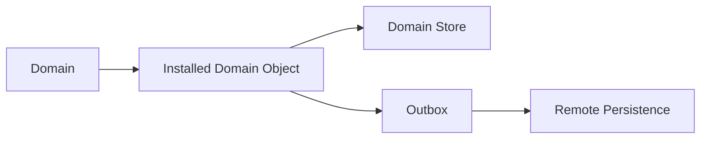
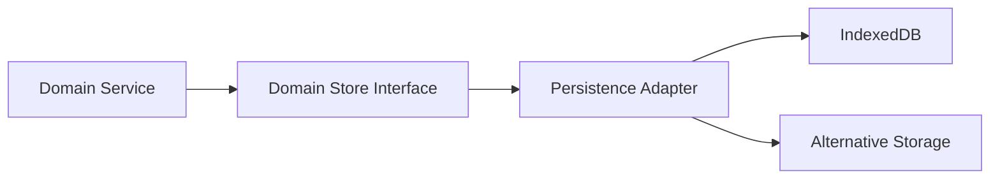

# Persistence

## Status

Current

---

# Purpose

This document defines how the KJVOnly application persists its local state.

Persistence ensures that installed Domain Objects, runtime state, settings, indexes, and application metadata survive application restarts and remain available while offline.

This document establishes the boundary between:

* Domain-owned Store interfaces,
* local persistence implementations,
* remote publication,
* and the application's authoritative local state.

---

# Scope

This document defines:

* local persistence,
* Domain Stores,
* Store ownership,
* immediate local writes,
* remote persistence through the outbox,
* deletion,
* persisted indexes,
* runtime persistence,
* settings and application metadata,
* and the relationship between persistence and Data Access.

It does not define:

* Data Access retrieval strategy,
* Resource Resolution,
* Resource publication,
* outbox processing,
* synchronization scheduling,
* background workers,
* or IndexedDB implementation details.

Those responsibilities are described by separate implementation documents and Architecture Decision Records.

---

# Background

The KJVOnly application is offline-first.

Application behavior should not depend upon immediate access to a relay, server, or other remote system.

When application state changes, the change is persisted locally first.

Remote publication occurs separately through the outbox and synchronization architecture.

Conceptually:



The local Store becomes authoritative immediately.

The outbox records the intent to publish the corresponding change remotely.

This separation allows application behavior to remain responsive and reliable even when remote systems are unavailable.

---

# Persistence Definition

Persistence is responsible for preserving application state across application lifecycles.

It ensures that locally installed data remains available after:

* a page refresh,
* the browser being closed,
* the application being suspended,
* a device restart,
* or a temporary loss of network access.

Persistence keeps data.

It does not determine how application data is requested or where remote representations are discovered.

Those responsibilities belong to Data Access and the Resource Architecture.

---

# Persisted State

The application persists several categories of state.

## Installed Domain Objects

Installed Domain Objects form the application's authoritative local domain model.

Examples include:

* Bible chapters,
* annotations,
* notes,
* reading plans,
* completed readings,
* Strong's data,
* and other Domain-owned objects.

Each installed Domain Object is persisted through the Store owned by its Domain.

## Runtime State

Runtime state may be persisted so the application can restore the user's working environment.

Examples include:

* Pane layout,
* Buffer state,
* active Module types,
* Module navigation context,
* and the last active Bible location.

## Application Settings

Application-wide preferences are persisted independently from Domain Objects.

Examples include:

* dark mode,
* color theme,
* selected Bible version,
* and other user preferences.

## Derived Indexes

Search and lookup indexes may also be persisted.

Indexes are derived data, but persisting them can substantially reduce startup and indexing work.

For example, a Notes index may be stored and incrementally updated so only newly created Notes require indexing.

## Application Metadata

The application may persist metadata required to coordinate local behavior.

Examples include:

* installed versions,
* index state,
* synchronization metadata,
* and other local bookkeeping information.

---

# Domain Store Ownership

Every Domain owns the Store interfaces required by its Domain Objects.

A Domain may own multiple Stores when its objects have different persistence requirements.

For example, the Bible Domain may maintain separate Stores for:

* Bible chapters,
* annotations,
* Bible versions,
* Strong's data,
* and other Bible-owned objects.

Multiple Bible versions may share the same chapter Store.

The persisted key includes the Bible version so that corresponding chapters remain independently addressable.

Conceptually:

```text
Bible Domain

    Chapter Store
        kjv/1_1
        kjvs/1_1

    Annotation Store

    Bible Version Store

    Strong's Store
```

Store organization follows Domain Object ownership rather than requiring every Domain to persist all of its objects within one physical collection.

The Domain owns:

* the Store interface,
* key semantics,
* object identity,
* persistence rules,
* and which objects belong in each Store.

Technical Infrastructure owns the implementation used to satisfy those Store interfaces.

---

# Store Implementation Boundary

Domain behavior should depend upon Domain Store interfaces rather than a particular database technology.

Conceptually:



The current browser implementation uses IndexedDB.

A different runtime could provide another implementation of the same Domain Store interface.

For example, a Node-based application could provide a filesystem, SQLite, or another persistence adapter without changing the Domain Service that requests the data.

This separation allows the Domain model and its services to be reused outside the browser.

---

# Persistence and Domain Services

Modules do not interact directly with persistence implementations.

They request Domain behavior through Domain Services.

The Domain Service then coordinates the appropriate Store.

For example:

```text
Bible Module

    requests Chapter

        ↓

Chapter Service

        ↓

Chapter Store

        ↓

Installed Chapter
```

The caller does not know whether the Store is implemented using IndexedDB or another persistence technology.

The Domain Service exposes Domain behavior.

The Domain Store exposes persistence behavior.

Technical Infrastructure implements the Store.
