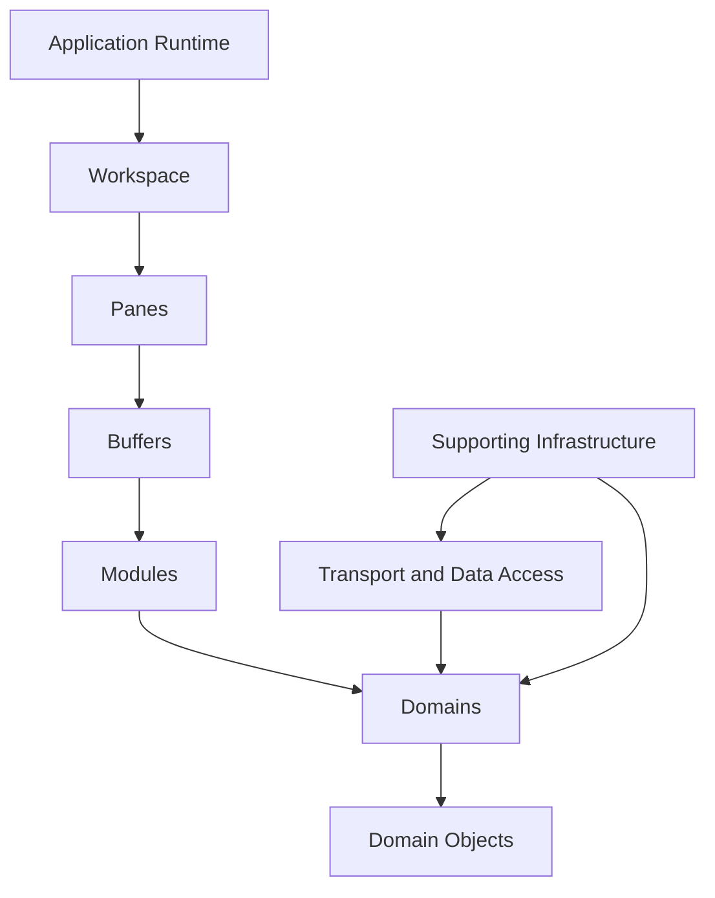
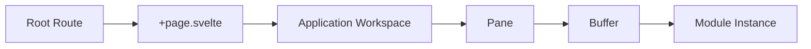
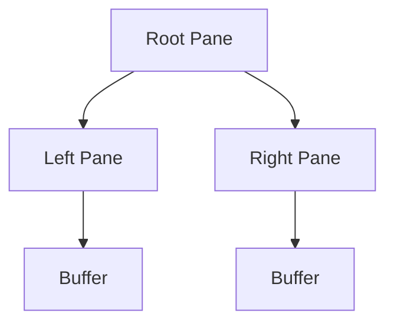

# Application Overview

## Status

Legacy

---

# Purpose

This document provides a high-level overview of the legacy KJVOnly application implementation.

It introduces the major parts of the application, explains how they fit together, and establishes the terminology used by the remaining legacy implementation documents.

The application described here is the working implementation that existed when the architecture specification was completed.

The legacy implementation already contains many of the concepts required by the target architecture, including:

* an offline-first local data model,
* strongly typed application data,
* domain-oriented application services,
* an event-driven application runtime,
* background processing,
* local persistence,
* and an abstraction around Nostr communication.

These concepts are not yet organized according to all of the boundaries defined by the ADRs.

This document describes the implementation as it currently exists. It does not reinterpret the existing code as though the target architecture had already been implemented.

---

# Scope

This document describes:

* the overall application model,
* the single-page application runtime,
* the workspace, panes, buffers, and modules,
* the relationship between modules and domains,
* the role of Domain Objects,
* the current transport and data-access layer,
* supporting infrastructure,
* and the high-level repository organization.

This document does not define the detailed implementation of:

* the pane rendering engine,
* individual modules,
* individual domains,
* resource discovery,
* data loading,
* IndexedDB storage,
* background workers,
* synchronization,
* publishing,
* application startup,
* or the target implementation.

Those responsibilities are described by later implementation documents.

---

# Background

KJVOnly was originally developed as an offline-first Progressive Web Application.

The application initially distributed app-provided data as statically hosted files. The browser downloaded those files and installed their contents into local IndexedDB storage.

All user-created data also remained within the browser.

The application was therefore already designed around several important constraints:

* it had to operate without an active network connection,
* application data had to be available locally,
* long-running work had to occur outside the primary interface flow,
* and the user interface could not depend on server-rendered pages or synchronous server requests.

Nostr support was added later.

The first Nostr integration reused the application's existing data-access patterns. Domain-specific files constructed Nostr queries in a manner similar to REST endpoint clients, while shared Nostr and service-layer code handled relay communication, caching, local persistence, serialization, and publishing.

This allowed Nostr to be introduced without redesigning the application runtime or exposing raw Nostr events to the user interface.

The resulting implementation is functional, but some responsibilities remain combined across the `nostr/`, `services/`, `storer/`, and `workers/` directories.

The ADRs were created to define a consistent architecture for evolving those responsibilities.

They primarily describe how distributed application data is:

* identified,
* discovered,
* resolved,
* installed,
* persisted,
* published,
* and synchronized.

They do not define the complete application runtime or user-interface composition model.

The implementation documentation therefore describes the complete application and identifies where the Resource architecture integrates with it.

---

# Responsibilities

This document owns the high-level description of the legacy application.

## Owns

This document describes:

* the major application concepts,
* the relationship between the application runtime and application data,
* the distinction between modules and domains,
* the role of the current transport layer,
* the role of supporting infrastructure,
* and the broad dependency direction within the application.

## Used By

This document provides context for all other legacy implementation documents.

It should be read before documents that describe:

* the application runtime,
* domains and modules,
* resource loading,
* persistence,
* workers,
* synchronization,
* startup,
* and publishing.

## Does Not Own

This document does not define detailed subsystem behavior.

It does not prescribe the target package structure, class structure, interfaces, or migration sequence.

---

# High-Level Application Model

The legacy application consists of three major areas:

1. the application runtime,
2. application modules and domain behavior,
3. transport and supporting infrastructure.



The application runtime manages the visible workspace.

The workspace contains panes.

Each pane contains a buffer.

Each buffer hosts an instance of an application module.

Modules provide specific user interactions with one or more application domains.

Domains own the application data and behavior used by those modules.

The current transport and data-access layer obtains, stores, and publishes application data through a combination of Nostr integration, application services, IndexedDB storage, and background workers.

These areas are related, but they are not interchangeable.

The application runtime does not retrieve Nostr events.

A module is not a Domain Object Factory.

A domain is not a pane.

The transport layer does not define the user interface.

Each area performs a different role within the complete application.

---

# Application Runtime

The application is implemented as a single-page application.

SvelteKit provides the application shell, static build support, service-worker integration, and root component lifecycle.

The application does not use routes as its primary navigation or composition model.

Nearly all application behavior exists under the root route:

```text
/
```

The root page hosts a persistent application workspace.

That workspace dynamically displays modules inside panes and buffers without navigating between application pages.

Conceptually:



The route layer is therefore a bootstrap boundary rather than an application navigation boundary.

---

# Workspace Ownership

The application workspace is managed directly by:

```text
client/src/routes/+page.svelte
```

The root page owns the current pane layout and coordinates changes to the visible workspace.

Workspace operations are event-driven.

Actions such as:

* splitting a pane,
* closing a pane,
* opening a module,
* restoring a pane,
* or changing the active workspace layout

produce events that are handled by functions in `+page.svelte` and the pane service.

Those functions update the pane tree, buffer assignments, pane identifiers, and generated CSS Grid layout.

Svelte then reacts to the changed application state and updates the affected interface.

The current implementation does not introduce a separate workspace-controller subsystem.

The root page, pane service, pane models, buffer models, and grid services collectively implement the workspace runtime.

---

# Panes

A pane represents one visible region of the application workspace.

Panes may be split horizontally or vertically to create additional visible regions.

The collection of panes forms a tree.

A pane may represent:

* a visible leaf containing a buffer, or
* an internal split containing left and right child panes.

The pane tree determines the logical workspace layout.

The rendering engine converts that tree into CSS Grid template areas.

Conceptually:



Pane layout is independent of the module hosted inside each pane.

A Bible module, Notes module, Search module, or other module may be placed into any available pane.

---

# Buffers

A buffer represents one active application view and its associated runtime state.

Buffers are conceptually similar to editor buffers.

A buffer contains:

* a unique key,
* a module identifier,
* the mounted component,
* module-specific state,
* keyboard bindings,
* selection state,
* and a general-purpose state bag used for persistence and module initialization.

A pane displays a buffer.

The buffer determines which module is rendered within that pane and preserves the state associated with that module instance.

This means the application may contain several instances of the same module at the same time.

For example:

```text
Pane A
    Bible module showing Genesis 1

Pane B
    Bible module showing Romans 8

Pane C
    Search module showing results for "faith"

Pane D
    Notes module showing notes for Romans
```

Each instance has its own buffer and state.

The domain is shared, but the visible module instances are independent.

---

# Modules

A module is an instantiable application feature that can be hosted within a buffer.

Modules represent user-facing activities.

Examples in the current application include:

* Bible reading,
* Notes,
* Reading Plans,
* Search,
* References,
* Settings,
* Login,
* and Profile.

A module is not the same as a domain.

A module provides a particular interaction with domain data.

A domain owns a category of application data and behavior.

Multiple modules may operate within the same domain.

For example, Bible reading and Bible search are different application activities, but both operate on Bible-domain data.

Conceptually:

```text
Bible Domain

    Bible Reader Module

    Bible Search Module

    Bible Reference Module
```

Likewise, Notes may support multiple modules:

```text
Notes Domain

    Notes Editor Module

    Notes List Module

    Notes Search Module
```

Not all of these conceptual module divisions are currently represented as separate packages.

The distinction is still useful because it describes how the application behaves:

* domains own meaning and data,
* modules provide user interactions,
* buffers host module instances,
* and panes display those buffers.
