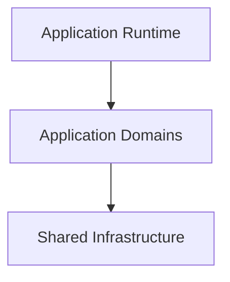
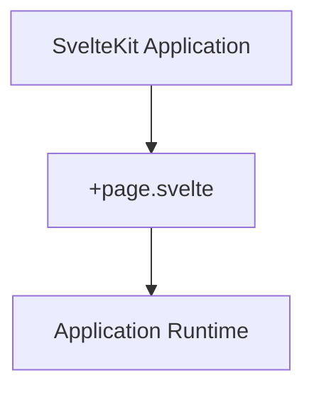
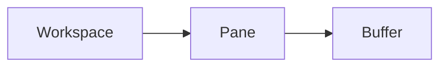
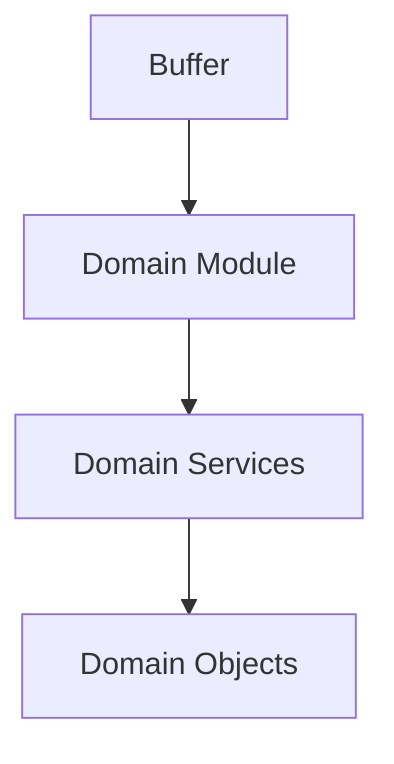
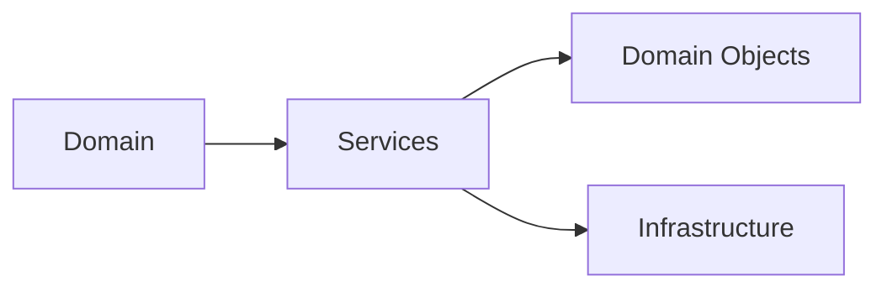
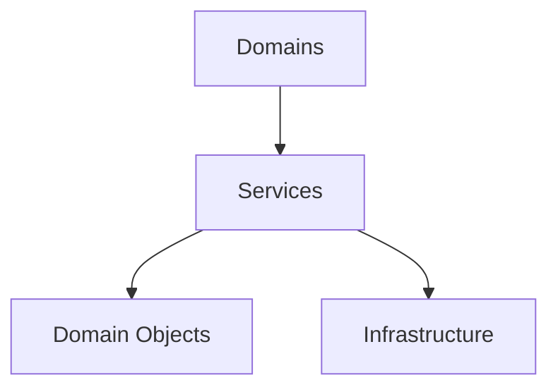

# Application Structure

## Status

Legacy

---

# Purpose

This document describes the physical structure of the legacy KJVOnly application.

It explains how the application is organized, how its major responsibilities are separated, and how the various implementation layers work together to form the complete application.

The application described by this document is the fully functioning implementation that existed when the architecture specification was completed.

It serves as the baseline implementation from which the target architecture will evolve.

This document intentionally describes the implementation rather than the architecture.

---

# Scope

This document describes:

- the physical repository structure,
- the organization of the client application,
- the major implementation layers,
- the relationship between application domains and shared infrastructure,
- and the runtime composition of the application.

This document does not describe:

- resource discovery,
- resource loading,
- persistence,
- synchronization,
- startup,
- workers,
- or individual domain implementations.

Those responsibilities are described by their own implementation documents.

---

# Background

The KJVOnly application was originally developed as an offline-first Progressive Web Application (PWA).

The application initially distributed app-provided resources as statically hosted files while storing all application data locally within the browser.

As the application evolved, support for Nostr was introduced to replace static distribution with decentralized resource discovery and publishing while preserving the application's existing behavior and offline-first design.

Rather than redesigning the application around Nostr, Nostr was introduced as another infrastructure layer responsible for transporting application resources.

The application itself continued to operate on its existing Domain Objects and local storage model.

This separation allowed the application's user-facing behavior to remain largely unchanged while the underlying distribution model evolved.

---

# Big Takeaway

The legacy application is organized around application domains hosted within a persistent single-page runtime.

The application is not organized around routes.

Instead, a single application shell hosts a dynamic workspace that manages panes, buffers, and domain modules.

Shared infrastructure provides services to those domains but does not define the structure of the application.

This separation allows application behavior to remain focused on domains while infrastructure concerns such as storage, synchronization, workers, and Nostr integration remain largely independent.

---

# High-Level Organization

The application consists of three primary layers.



The application runtime is responsible for presenting and managing the user interface.

Application domains implement the behavior visible to users.

Shared infrastructure provides reusable technical capabilities used by one or more domains.

Each layer has a distinct responsibility.

The application runtime composes the user experience.

Domains implement application behavior.

Infrastructure supports the domains without becoming part of the application's public behavior.

---

# Repository Structure

The repository contains several projects that together form the complete application.

At a high level the client application is isolated from supporting services such as the relay, Blossom server, deployment assets, and tooling.

```text
client/
relay/
blossom/
docs/
zarf/
```

The implementation described throughout this guide refers primarily to the client application located under:

```text
client/src/
```

The remaining projects exist to support development, testing, deployment, and resource distribution.

---

# Client Structure

The client application is implemented as a SvelteKit single-page application.

Most implementation code resides under:

```text
client/src/lib/
```

The library is organized around application domains supported by a set of shared technical packages.

```text
lib/

components/
models/
modules/
nostr/
services/
storer/
utils/
workers/
```

Each directory has a clearly defined responsibility.

| Directory | Responsibility |
|-----------|----------------|
| `components/` | Reusable user interface components shared between domains. |
| `models/` | Application Domain Objects and supporting types. |
| `modules/` | Domain-specific user interface and application behavior. |
| `nostr/` | Nostr protocol integration, relay communication, publishing, and event retrieval. |
| `services/` | Shared application and domain services. |
| `storer/` | IndexedDB persistence and local storage abstractions. |
| `utils/` | Shared utility functions used throughout the application. |
| `workers/` | Background processing including synchronization, downloading, indexing, and long-running operations. |

This organization separates reusable technical infrastructure from the application's domains while allowing domains to remain the primary organizational concept throughout the application.

# Application Runtime

The application is implemented as a single-page application (SPA).

Although SvelteKit provides the routing framework, the application itself is not organized around routes.

Instead, nearly all user interaction occurs within a single application workspace that remains active for the lifetime of the application.

Navigation, layout, and application state are managed entirely within that workspace.

This approach minimizes unnecessary rerendering, preserves application state, and allows multiple application views to remain active simultaneously.

---

# Application Shell

The root route acts primarily as the application's bootstrap.

Its responsibilities include:

- creating the application runtime,
- initializing global application state,
- constructing the workspace,
- and hosting the application's rendering engine.

Once initialized, the application rarely relies on route changes to present different application views.

The application workspace is managed directly by `+page.svelte`.

Rather than introducing a separate workspace manager, the root application component owns the pane layout, buffer mapping, and workspace state. User interactions, such as opening, closing, or rearranging panes, are processed as application events that update the workspace allowing Svelte's reactive rendering model to update only the portions of the interface affected by the change. 

This keeps the application's runtime simple while providing a single location responsible for coordinating the visible workspace.

Instead, the workspace dynamically composes the visible application from panes and buffers.

Conceptually the application behaves more like a desktop application than a traditional website.



The routing layer therefore remains intentionally small.

Its primary responsibility is bootstrapping the application rather than controlling application navigation.

---

# Workspace

The workspace represents the active application session.

It manages the visible application layout while coordinating the domains currently presented to the user.

Rather than replacing the current page during navigation, the workspace maintains multiple active views simultaneously.

This allows users to interact with several areas of the application without repeatedly constructing and destroying interface state.

The workspace is responsible for:

- pane layout,
- buffer management,
- view composition,
- and interaction between visible domains.

---

# Panes

A pane represents a visible region of the workspace.

Each pane occupies a position within the application's layout and hosts exactly one active buffer.

Panes are responsible only for presentation.

They do not own application behavior or domain data.

Instead, they provide stable containers in which application domains execute.

Conceptually:



The workspace may contain multiple panes simultaneously.

The layout of those panes is managed independently from the domains they display.

---

# Buffers

Buffers provide the runtime abstraction used to host application domains.

Each buffer maintains the state associated with a particular application view.

Rather than repeatedly constructing domain modules during navigation, buffers remain active while the workspace changes which panes are visible.

This allows application state to persist naturally throughout the user's session.

Conceptually a buffer behaves similarly to an editor buffer.

It represents an active piece of application state rather than a page.

A buffer may therefore remain alive even when it is not currently visible.

---

# Domain Modules

Application functionality is implemented by domain modules.

Examples include:

- Bible
- Notes
- Reading Plans
- References
- Search
- Settings

Each domain module owns the user interface and behavior associated with its domain.

Domain modules operate on Domain Objects exposed by the application's services.

They do not communicate directly with infrastructure components such as IndexedDB or Nostr.

Instead, those responsibilities remain behind shared infrastructure layers.



This separation allows the user interface to remain focused on application behavior while technical infrastructure evolves independently.

---

# Rendering Strategy

One of the defining characteristics of the application is its rendering strategy.

Rather than relying on route changes to reconstruct the interface, the application maintains a persistent runtime that dynamically composes panes within a single workspace.

The layout is managed through CSS Grid while the application runtime maintains a mapping between panes and their active buffers.

Because buffers remain associated with panes, domain modules generally remain mounted throughout normal application use.

This minimizes rerendering while naturally preserving interface state.

The result is a responsive application that behaves more like a desktop workspace than a traditional web application.

Subsequent implementation documents describe the services, persistence, synchronization, and resource-loading infrastructure that support this runtime.

# Domain Organization

The application is organized around functional domains.

Each domain represents a cohesive area of application behavior and contains the user interface, state, and operations necessary to present that behavior to the user.

Examples include:

- Bible
- Notes
- Reading Plans
- References
- Search
- Settings

Although supporting code may exist elsewhere in the repository, domains represent the primary organizational boundary of the application.

Each domain is responsible for implementing user-facing behavior rather than infrastructure concerns.

---

# Domain Boundaries

Application domains are intentionally isolated from the underlying implementation details used to retrieve, persist, or synchronize data.

Instead, domains interact with shared services that expose strongly typed Domain Objects.

This separation allows the application to evolve its infrastructure independently from the user-facing functionality provided by each domain.

Conceptually:



Domains depend on services.

Services expose Domain Objects.

Infrastructure supports the services.

---

# Shared Infrastructure

The application separates reusable technical capabilities from the domains that consume them.

These capabilities are implemented as shared infrastructure packages.

Examples include:

- Nostr communication
- IndexedDB persistence
- background workers
- utility libraries
- reusable user interface components

These packages are intentionally reusable across multiple domains.

Individual domains should remain focused on application behavior rather than infrastructure implementation.

---

# Infrastructure Responsibilities

The shared infrastructure provides common capabilities used throughout the application.

Examples include:

| Package | Responsibility |
|----------|----------------|
| `nostr/` | Relay communication, event retrieval, publishing, and protocol support. |
| `storer/` | Local persistence through IndexedDB. |
| `workers/` | Background processing and long-running operations. |
| `components/` | Reusable user interface elements shared by multiple domains. |
| `utils/` | General-purpose utility functions used throughout the application. |

These packages support the application but do not define its behavior.

Instead, they provide reusable capabilities that individual domains consume through the service layer.

---

# Dependency Direction

Dependencies within the application follow a consistent direction.

Application behavior originates within the domains.

Shared services provide access to Domain Objects and coordinate interactions with supporting infrastructure.

Infrastructure packages remain implementation details that support, but do not control, application behavior.

Conceptually:



This organization keeps user-facing behavior centered within the domains while allowing infrastructure implementations to evolve independently.

---

# Notes

Although the repository separates infrastructure into shared packages, the application itself is fundamentally domain-oriented.

Infrastructure exists to support the domains.

It should not become the organizing principle of the application.

This distinction is important when evolving the implementation toward the target architecture.

Future implementation documents describe how responsibilities currently implemented within shared infrastructure become aligned with the architectural boundaries defined by the ADRs.